# 浅析数据结构-图的基本概念


**线性表和树两类数据结构，线性表中的元素是“一对一”的关系，树中的元素是“一对多”的关系，本章所述的图结构中的元素则是“多对多”的关系。图（Graph）是一种复杂的非线性结构，在图结构中，每个元素都可以有零个或多个前驱，也可以有零个或多个后继，也就是说，元素之间的关系是任意的。**

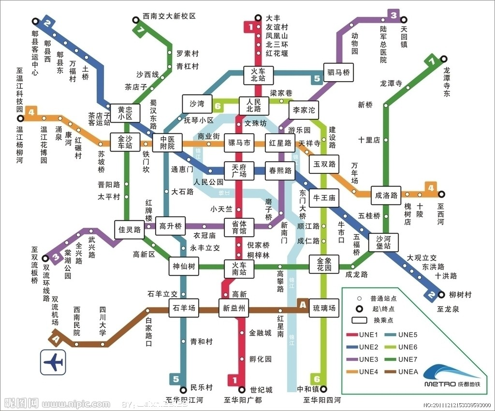

# 一、图的定义与术语

**定义：**图（Graph）是由顶点的有穷非空集合和顶点之间边的集合组成，通常表示为：**G(V,E)**，其中，**G**表示一个图，**V**是图G中顶点的集合，**E**是图G中边的集合。

## 1、图的分类

图是按照无方向和有方向分为无向图和有向图。

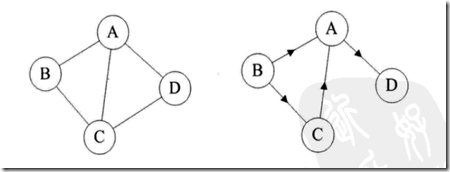

左图为无向图是由顶点和边构成，右图为有向图是由顶点和弧（有向边构成）。弧有弧头和弧尾区别。

按照边分为稀疏图和稠密图，这是个模糊的概念，同样是相对的概念。

如果任意两个顶点之间都存在边叫完全图，有向的边叫有向完全图。如果无重复的边或者顶点到自身的边叫简单图。在用数学方式表示时，无向边用()表示，有向边用<>表示。现在我们讲解的图全是简单图。

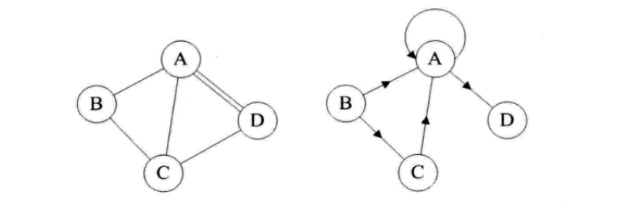

左图没有重复的边或者到自身的边（简单图），右图则有。

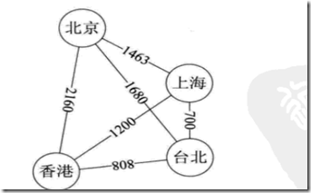

这种边带权值的图叫网

## 2.图的顶点和边间关系

顶点的度：顶点关联边的数目。有向图图中有，入度：方向指向顶点的边；出度：方向背向顶点的边。在有向图中顶点的度就是两者之和。

路径长度：路径上边或者弧的数目。

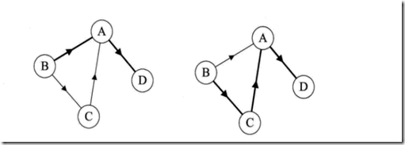

左图中，从B到D的路径度为2，在右图中就是3了（粗线的边）。

右图中A的入度是2，出度是1；B的入度为0，出度是2.

连通

在无向图G中，任意两个顶点是相通的就是连通图。

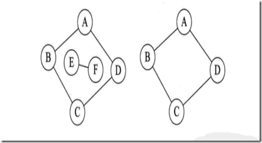

左图不是连通图，AE之间没有连通。

# 二、图的存储结构

图的结构比价复杂，任意两个顶点之间都可能存在关系，不能用简单的顺序存储结构来表示。如果运用多重链表，即一个数据域多个指针域组成的结点表示图中一个结点，则造成大量存储单元浪费。

## 1、邻接矩阵

邻接矩阵用两个数组保存数据。一个一维数组存储图中顶点信息，一个二维数组存储图中边或弧的信息。

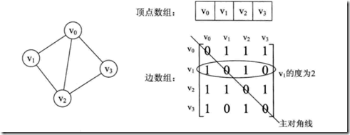

无向图中二维数组是个对称矩阵。

**特点：**

- 1、0表示无边，1表示有边

    2、顶点的度是行内数组之和。

    3、求取顶点邻接点，将行内元素遍历下。

  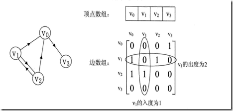

有向图的邻接矩阵：有向图中讲究入度和出度，各行之和是出度，各列之和是入度。

带权的图叫网，用邻接矩阵表示为：

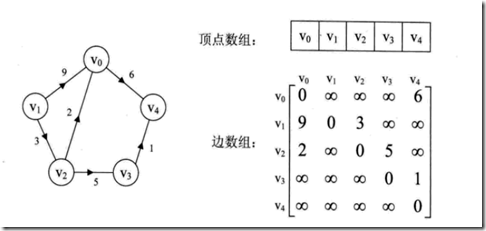

- ### 邻接矩阵对于边数相对顶点较少的图，就是对存储空间极大的浪费。

  ## 2、邻接表

  邻接表：数组和链表相结合的存储方法为邻接表。

- 图中顶点用一个一维数组存储。

- 图中每个顶点Vi的所有邻接点构成一个线性表。

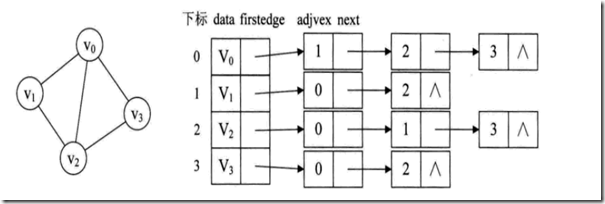

从图中得知，顶点表的各个结点由data和Firstedge两个域表示，data是数据域，存储顶点信息，firstedge是指针域，指向边表的第一个结点，即顶点的第一个邻接点。边表结点由adjvex和next两个域组成。adjvex是邻接点域，存储某顶点的邻接点在顶点表中坐标，next存储边表中下一个结点指针。比如v1顶点与v2、v0互为邻接点，则在v1边表中，adjvex分别为0和2。

有向图也可以用邻接表，出度表叫邻接表，入度表尾逆邻接表。

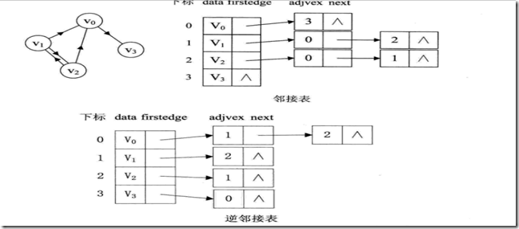

## 3、十字链表

在邻接表中针对有向图，分为邻接表和逆邻接表，导致无法从一个表中获取图的入读和出度的情况，有人提出了十字链表。

定点表：

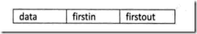

其中firstin：入边表头指针，指向顶点入边表的第一个结点。

firstout：出边表头指针，指向顶点出边表第一个结点。

边表：


其中tailvex是指弧起点在顶点表的下标，headvex弧终点在顶点表的下标，headlink入边表指针域，指向终点相同的下一条边，taillink是指边表指针域，指向起点相同的下一条边。

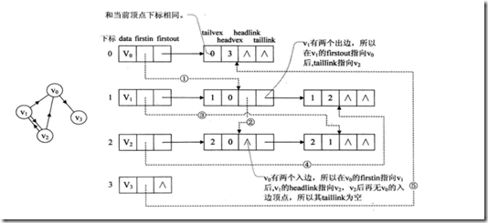

## 4、邻接多重表

邻接多重表结构如图：


ivex和jvex是与某条边依附的两个顶点在顶点表中的下标。ilink指向依附项点ivex的下一条边，jlink指向依附顶点jvex的下一条边。

 

# 三 、代码实现

```
#include <iostream>

#define  MAXVEX 100      //最大顶点数
#define INFINITY 65535   //最大权值

typedef int EdgeType;    //权值类型自己定义
typedef char VertexType;  //顶点类型自己定义
#pragma once

#pragma region 邻接矩阵结构体
typedef struct 
{
    VertexType vex[MAXVEX];   //顶点表
    EdgeType arg[MAXVEX][MAXVEX];  ///权值表-邻接矩阵
    int numVertexes,numEdges;  //图中的边数和顶点数
}GraphArray;

#pragma endregion

#pragma region 邻接表结构体
//边表结点
typedef struct EdgeNode
{
    int nNodevex;     //邻接点的点表中结点的坐标
    EdgeType nNodeWeight;   //用于网图中边的权值
    EdgeNode* next;       //链域，指向下一个邻接点
}EdgeNode,*pEdgeNode;
//顶点表结点
typedef struct VertexNode
{
    VertexType nNodeData;   //顶点表中存储的数据
    pEdgeNode pFirstNode;   //顶点表和边表中关联指针，指向边表头指针

}VertexNode,pVertexNode,VertexList[MAXVEX];
//图结构
typedef struct
{
    VertexList vertexList;
    int numVertess,numEdges;
}GraphList;

#pragma endregion

class GraphData
{
public:
    GraphData(void);
    ~GraphData(void);
    #pragma region 创建邻接矩阵
    void CreateGraphArray(GraphArray* pGraphArray,int numVer,int numEdegs);
    int GetGraphLocation(GraphArray* pGraphArrray,char chpoint);
    #pragma endregion

    #pragma region 创建邻接表
    void CreateGraphList(GraphList* pList,int numVer,int numEdegs);
    int GetGraphListLocation(GraphList* pList,char chpoint);
    #pragma endregion

};

Graphdata.h
```

```
#include "GraphData.h"


GraphData::GraphData(void)
{
}


GraphData::~GraphData(void)
{
}

int GraphData::GetGraphLocation(GraphArray* pGraphArrray,char chpoint)
{
    int i = 0;
    for (i = 0;i< pGraphArrray->numVertexes;i++)
    {
        if (pGraphArrray->vex[i] == chpoint)
        {
            break;;
        }
    }
    if (i >= pGraphArrray->numVertexes)
    {
        return -1;
    }
    return i;
}
/// <summary>
/// 创建邻接矩阵
/// </summary>        
void GraphData::CreateGraphArray(GraphArray* pGraphArray,int numVer,int numEdegs)
{
    int weight = 0;
    pGraphArray->numVertexes = numVer;
    pGraphArray->numEdges = numEdegs;
    
    //创建顶点表
    for (int i= 0; i < numVer;i++)
    {
        pGraphArray->vex[i] = getchar();
        while(pGraphArray->vex[i] == '\n')
        {
            pGraphArray->vex[i] = getchar();
        }
    }

    //创建邻接表的边矩阵
    for (int i = 0; i < numEdegs; i++)
    {
        for (int j = 0;j < numEdegs ; j++)
        {
            pGraphArray->arg[i][j] = INFINITY;
        }        
    }
    for(int k = 0; k < pGraphArray->numEdges; k++)
    {
        char p, q;
        printf("输入边(vi,vj)上的下标i，下标j和权值:\n");

        p = getchar();
        while(p == '\n')
        {
            p = getchar();
        }
        q = getchar();
        while(q == '\n')
        {
            q = getchar();
        }
        scanf("%d", &weight);    

        int m = -1;
        int n = -1;
        m = GetGraphLocation(pGraphArray, p);
        n = GetGraphLocation(pGraphArray, q);
        if(n == -1 || m == -1)
        {
            fprintf(stderr, "there is no this vertex.\n");
            return;
        }
        //getchar();
        pGraphArray->arg[m][n] = weight;
        pGraphArray->arg[n][m] = weight;  //因为是无向图，矩阵对称
    }
    
}

#pragma region
void GraphData::CreateGraphList(GraphList* pList,int numVer,int numEdegs)
{
    int weight = 0;
    GraphList *pGraphList = pList;
    pGraphList->numVertess = numVer;
    pGraphList->numEdges = numEdegs;
    EdgeNode* firstNode,*secondNode;
    //创建顶点表
    for (int i= 0; i < numVer;i++)
    {
        pGraphList->vertexList[i].nNodeData = getchar();
        pGraphList->vertexList[i].pFirstNode = NULL;
        while(pGraphList->vertexList[i].nNodeData == '\n')
        {
            pGraphList->vertexList[i].nNodeData = getchar();
        }
    }

    //创建边表    
    for(int k = 0; k < pGraphList->numEdges; k++)
    {
        char p, q;
        printf("输入边(vi,vj)上的下标i，下标j和权值:\n");

        p = getchar();
        while(p == '\n')
        {
            p = getchar();
        }
        q = getchar();
        while(q == '\n')
        {
            q = getchar();
        }
        scanf("%d", &weight);    

        int m = -1;
        int n = -1;
        m = GetGraphListLocation(pGraphList, p);
        n = GetGraphListLocation(pGraphList, q);
        if(n == -1 || m == -1)
        {
            fprintf(stderr, "there is no this vertex.\n");
            return;
        }
        //getchar();
        //字符p在顶点表的坐标为m，与坐标n的结点建立联系权重为weight
        firstNode = new EdgeNode();
        firstNode->nNodevex = n;
        firstNode->next = pGraphList->vertexList[m].pFirstNode;
        firstNode->nNodeWeight = weight;
        pGraphList->vertexList[m].pFirstNode = firstNode;

        //第二个字符second
        secondNode = new EdgeNode();
        secondNode->nNodevex = m;
        secondNode->next = pGraphList->vertexList[n].pFirstNode;
        secondNode->nNodeWeight = weight;
        pGraphList->vertexList[n].pFirstNode = secondNode;

    }
}

int GraphData::GetGraphListLocation(GraphList* pList,char chpoint)
{
    GraphList *pGraphList = pList;
    int i = 0;
    for (i = 0;i< pGraphList->numVertess;i++)
    {
        if (pGraphList->vertexList[i].nNodeData == chpoint)
        {
            break;;
        }
    }
    if (i >= pGraphList->numVertess)
    {
        return -1;
    }
    return i;
}

#pragma endregion

GraphData.cpp
```

```
#include <iostream>
#include "GraphData.h"
using namespace std;
//

void PrintGrgph(GraphList *pGraphList)
{
    int i =0;
    while(pGraphList->vertexList[i].pFirstNode != NULL && i<MAXVEX)
    {
        printf("顶点:%c  ",pGraphList->vertexList[i].nNodeData);
        EdgeNode *e = NULL;
        e = pGraphList->vertexList[i].pFirstNode;
        while(e != NULL)
        {
            printf("%d  ", e->nNodevex);
            e = e->next;
        }
        i++;
        printf("\n");
    }
    
}
int main()
{
    int numVexs,numEdges;
    GraphData* pTestGraph = new GraphData();
    GraphArray graphArray;
    GraphArray* pGraphArray = &graphArray;
    GraphList* pGgraphList = new GraphList();
    
    cout<<"输入顶点数和边数"<<endl;
    cin>>numVexs>>numEdges;
    cout<<"顶点数和边数为："<<numVexs<<numEdges<<endl;

    /*pTestGraph->CreateGraphArray(pGraphArray,numVexs,numEdges);
    for(int i = 0; i< numEdges;i++)
    {
        for (int j = 0;j< numEdges;j++)
        {
            cout<<pGraphArray->arg[i][j];
        }
        cout<<endl;
    }*/
    pTestGraph->CreateGraphList(pGgraphList,numVexs,numEdges);
    PrintGrgph(pGgraphList);
    system("pause");
}

TestGraph
```