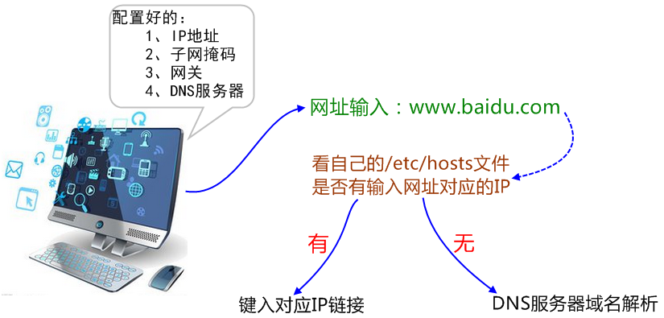

# DNS域名解析的过程

**一、主机解析域名的顺序**

　　1、找缓存

　　2、找本机的hosts文件

　　3、找DNS服务器

注意：

　　配置IP和主机名时，要记得修改/etc/hosts文件，因为有些应用程序在主机内的进程之间通信的时候，会本机的主机名，如果主机名不能正确解析到一个正常的IP地址，那么就会导致进程通信有问题。

 

 

**二、概念解释** 

DNS（Domain Name System，域名系统）

​    1、因特网上作为域名和IP(Internet Protocol Address)地址相互映射的一个分布式数据库，能够使用户更方便的访问互联网，而不用去记住能够被机器直接读取的IP数串。

​    2、通过主机名，最终得到该主机名对应的IP地址的过程叫做域名解析（或主机名解析）。

​    3、DNS协议运行在UDP协议之上，使用端口号53。

​    4、在整个互联网体系中，约定俗成的用于标识网络上设备的地址是IP，然而我们输入的是DNS，因为域名更方便人们记忆，不然那么多网站，人怎么可能记住所有的IP地址。

 

Q：浏览器如何通过域名去查询URL对应的IP（对应服务器地址）呢？

A：

　　1、浏览器缓存：浏览器会按照一定的频率缓存DNS记录。

　　2、操作系统缓存：如果浏览器缓存中找不到需要的DNS记录，那就去操作系统中找。

　　3、路由缓存：路由器也有DNS缓存。

　　4、ISP的DNS服务器：ISP是互联网服务提供商(Internet Service Provider)的简称，ISP有专门的DNS服务器应对DNS查询请求。

　　5、根服务器：ISP的DNS服务器还找不到的话，它就会向根服务器发出请求，进行递归查询（DNS服务器先问根域名服务器.com域名服务器的IP地址，然后再问.com域名服务器，依次类推）。

Q：在网上查到某个网站的IP地址，在自己的浏览器上输入，却为什么连接不上？

A：

　　大的高并发网站可能不止一个IP地址，根据不同的网络他们会有很多的IP来做集群。有的是通过DNS来实现负载均衡，有的是用squid来实现的。