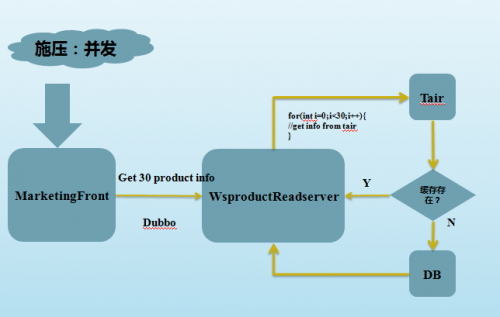
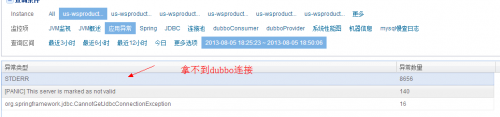
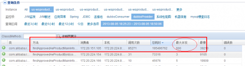
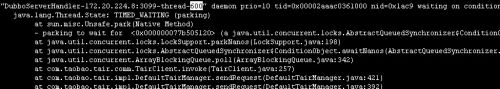
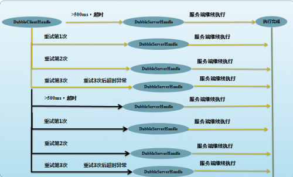
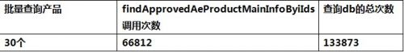

# Dubbo超时机制导致的雪崩连接

**Bug影响：**Dubbo服务提供者出现无法获取Dubbo服务处理线程异常，后端DB爆出拿不到数据库连接池，导致前端响应时间异常飙高，系统处理能力下降，核心基础服务无法提供正常服务。

**Bug发现过程：**

线 上，对于高并发的服务化接口应用，时常会出现Dubbo连接池爆满情况，通常，我们理所应当的认为，这是客户端并发连接过高所致，一方面调整连接池大小， 一方面考虑去增加服务接口的机器，当然也会考虑去优化服务接口的应用。很自然的，当我们在线上压测一个营销页面（为大促服务，具备高并发）时，我们遇到了 这种情况。而通过不断的深入研究，我发现了一个特别的情况。

场景描述：

 

压力从Jmeter压至前端web应用marketingfront，场景是批量获取30个产品的信息。wsproductreadserver有一个批量接口，会循环从tair中获取产品信息，若缓存不存在，则命中db。

**压测后有两个现象：**

**1）**Dubbo的服务端爆出大量连接拿不到的异常，还伴随着无法获取数据库连接池的情况

**2)**Dubbo Consumer端有大量的Dubbo超时和重试的异常，且重试3次后，均失败。

**3)**Dubbo Consumer端的最大并发时91个

Dubbo Provider端的最大并发却是600个，而服务端配置的dubbo最大线程数即为600。

这个时候，出于性能测试的警觉性，发现这两个并发数极为不妥。

按照正常的请求模式，DubboConsumer和DubboProvider展示出来的并发应该是一致的。此处为何会出现服务端的并发数被放大6倍，甚至有可能不止6倍，因为服务端的dubbo连接数限制就是600。

此处开始发挥性能测试各种大胆猜想：

1）是否是因为服务端再dubboServerHandle处理请求时，开启了多线程，而这块儿的多线程会累计到Dubbo的连接上，dragoon采集的这个数据可以真实的反应目前应用活动的线程对系统的压力情况；

2）压测环境不纯洁？我的小伙伴们在偷偷和我一起压测？（这个被我生生排除了，性能测试基本环境还是要保持独立性）

3）是否是因为超时所致？这里超时会重试3次，那么顺其自然的想，并发有可能最多会被放大到3倍，3*91=273<<600….还是不止3倍？

有了猜想，就得小心求证！

首先通过和dubbo开发人员 【草谷】分析，Dubbo连接数爆满的原因，猜想1被否决，Dubbo服务端连接池是计数DubboServerHandle个数的业务是否采用多线程无关。

通过在压测时，Dump provider端的线程数，也证明了这个。

那么，可能还是和超时有很大关系。

再观察wsproductreadserver接口的处理时间分布情况：

从RT的分布来看。基本上78.5%的响应时间是超过1s的。那么这个接口方法的dubbo超时时间是500ms，此时dubbo的重试机制会带来怎样的**雪崩效应**呢？

如果按照上图，虽然客户端只有1个并发在做操作，但是由于服务端执行十分耗时，每个请求的执行RT远远超过了超时时间500ms，此时服务端的最大并发会有多少呢?

**和服务端处理的响应时间有特比特别大的关系。服务端处理时间变长，但是如果超时，客户端的阻塞时间却只有可怜的500ms，超过500ms，新一轮压力又将发起。**

上图可直接看到的并发是8个，如果服务端RT再长些，那么并发可能还会再大些！

这也是为什么从marketingfront consumer的dragoon监控来看，只有90个并发。但是到服务端，却导致dubbo连接池爆掉的直接原因。

查看了wsproductreadserver的堆栈，600个dubboServerHandle大部分都在做数据库的读取和数据库连接获取以及tair的操作。

所以，为什么Dubbo服务端的连接池会爆掉？很有可能就是因为你的服务接口，在高并发下的大部分RT分布已经超过了你的Dubbo设置的超时时间！这将直接导致Dubbo的重试机制会不断放大你的服务端请求并发。

所 以如果，你在线上曾经遇到过类似场景，您可以采取去除Dubbo的重试机器，并且合理的设置Dubbo的超时时间。目前国际站的服务中心，已经开始去除 Dubbo的重试机制。当然Dubbo的重试机制其实是非常好的QOS保证，它的路由机制，是会帮你把超时的请求路由到其他机器上，而不是本机尝试，所以 dubbo的重试机器也能一定程度的保证服务的质量。但是请一定要综合线上的访问情况，给出综合的评估。

————**等等等，别着急，我们似乎又忽略了一些细节，元芳，你怎么看？**————————

我们重新回顾刚才的业务流程架构，wsproductReadserver层有DB和tair两级存储。那么对于同样接口为什么服务化的接口RT如此之差，按照前面提到的架构，包含tair缓存，怎么还会有数据库连接获取不到的情况？

接续深入追踪，将问题暴露和开发讨论，他们拿出tair

可以看到，客户端提交批量查询30个产品的产品信息。在服务端，有一个缓存模块，缓存的key是产品的ID。当产品命中tair时，则直接返回，若不命中，那么回去db中取数，再放入缓存中。

这里可以发现一个潜在的性能问题：

客 户端提交30个产品的查询请求，而服务端，则通过for循环和tair交互，所以这个接口在通常情况下的性能估计也得超过60-100ms。如果不是30 个产品，而是50或者100，那么这个接口的性能将会衰减的非常厉害！（这纯属性能测试的yy，当然这个暂时还不是我们本次关注的主要原因）

那么如此的架构，请求打在db上的可能性是比较小的， 由缓存命中率来保证。从线上真实的监控数据来看，tair的命中率在70%，应该说还不错，为什么在我们的压测场景，DB的压力确是如此凶残，甚至导致db的连接池无法获取呢？

所以性能验证场景就呼之欲出了：

**场景：**准备30个产品ID，保持不变，这样最多只会第一次会去访问DB，并将数据存入缓存，后面将会直接命中缓存，db就在后面喝喝茶好了！

 

 

但是从测试结果来看，有两点可以观察到：

1） tair是存在命中的，否则查询db的总次数应该是30*66812

2） 查询db的次数大概是调用次数的2倍。从数据比例可以明显的看出，可能有2个产品一直没命中缓存。

3） 但是这个数据也让我们奇怪，如果缓存开始工作，为什么总是有一些产品未进入缓存？

于是开始检查这30个产品到底有哪几个没有存入缓存。

**通 过开发Debug预发布环境代码，最终发现，这两个产品竟然已经被用户移到垃圾箱了。而通过和李浩和跃波沟通SellerCoponList的业务来 看，DA推送过来的产品是存在被用户移除的可能性。因而，每次这两个数据的查询，由于数据库查询不到记录，tair也没有存储相关记录，导致这些查询都将 经过数据库。数据库压力原因也找到了。**

**但是问题还没有结束，这似乎只像是冰山表面，我们希望能够鸟瞰整个冰山！**

**细细品味这个问题的最终性能表象，**这是一种变向击穿缓存的做法啊！也就是具备一定的通用性。如果接口始终传入数据库和缓存都不可能存在的数据，那么每次的访问都就落到db上，导致缓存变相击穿，这个现象很有意思！

目前有一种解决方案，就是Null Object Pattern，将数据库不存在的记录也记录到缓存中，但是value为NULL，使得缓存可以有效的拦截。由于数据的超时时间是10min，所以如果数据有所改动，也可以接受。

 我相信这只是一种方案，可能还会有其他方案，但是这种变向的缓存击穿却让我很兴奋。回过头来，如果让我自己去实现这样的缓存机制，数据库和缓存都不存在的 数据场景很容易被忽略，并且这个对于业务确实也不会有影响。在线上存在大量热点数据情况下，这样的机制，往往并不会暴露性能问题。巧合的是，特定的场景， 性能却会出现很大的偏差，这考验的既是性能测试工程师的功力，也考验的是架构的功力！

**Bug** **解决办法：**

**其实这过程中不仅仅有一些方法论，也有一些是性能测试经验的功底，更重要的是产出了一些通用性的性能问题解决方案，以及部分参数和技术方案的设计对系统架构的影响。**

**1）对于核心的服务中心，去除dubbo超时重试机制，并重新评估设置超时时间。**

**2）对于存在tair或者其他中间件缓存产品，对NULL数据进行缓存，防止出现缓存的变相击穿问题**

 

**GBA** **传承：**

****

**个人感受：**

**1）性能调优和诊断是一个不断挖掘的过程，不放过一个细节点，大胆猜想，小心求证**

**2）敢于质疑开发的建议和解决方案，提出自己的思路，并求证**

**3）勇于专研。性能调优就像追求自己心仪的女孩，有时努力了很久却没有任何结果，但是心动的感觉却是一生仅有的。**