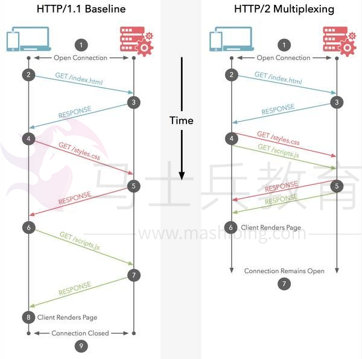

# Java 9 逆天的十大新特性

在介绍java9之前，我们先来看看java成立到现在的所有版本。

  1990年初，最初被命名为Oak；

   1995年5月23日，Java语言诞生；

   1996年1月，第一个JDK-JDK1.0诞生；

   1996年4月，10个最主要的操作系统供应商申明将在其产品中嵌入Java技术；

   1996年9月，约8.3万个网页应用了Java技术来制作；

   1997年2月18日，JDK1.1发布；

   1997年4月2日，JavaOne会议召开，参与者逾一万人，创当时全球同类会议纪录；

   1997年9月，JavaDeveloperConnection社区成员超过十万；

   1998年2月，JDK1.1被下载超过2,000,000次；

   1998年12月8日，Java 2企业平台J2EE发布； 

  1999年6月，SUN公司发布Java三个版本：标准版（J2SE）、企业版（J2EE）和微型版（J2ME）； 

  2000年5月8日，JDK1.3发布； 

  2000年5月29日，JDK1.4发布； 

  2001年6月5日，Nokia宣布到2003年将出售1亿部支持Java的手机； 

  2001年9月24日，J2EE1.3发布； 

  2002年2月26日，J2SE1.4发布，此后Java的计算能力有了大幅提升； 

  2004年9月30日，J2SE1.5发布，成为Java语言发展史上的又一里程碑。为了表示该版本的重要性，J2SE1.5更名为Java SE 5.0； 

  2005年6月，JavaOne大会召开，SUN公司公开Java SE 6。此时，Java的各种版本已经更名，以取消其中的数字“2”：J2EE更名为Java EE，J2SE更名为Java SE，J2ME更名为Java ME； 

  2006年12月，SUN公司发布JRE6.0； 

  2009年4月20日，甲骨文以74亿美元的价格购SUN公司，取得java的版权，业界传闻说这对Java程序员是个坏消息（其实恰恰相反）； 

  2010年11月，由于甲骨文对Java社区的不友善，因此Apache扬言将退出JCP； 

  2011年7月28日，甲骨文发布Java SE 7； 

  2014年3月18日，甲骨文发表Java SE 8；

  2017年7月，甲骨文发表Java SE 9。

**写在前面**

**modularity System 模块系统

Java 9中主要的变化是已经实现的模块化系统。

Modularity提供了类似于OSGI框架的功能，模块之间存在相互的依赖关系，可以导出一个公共的API，并且隐藏实现的细节，Java提供该功能的主要的动机在于，减少内存的开销，在JVM启动的时候，至少会有30～60MB的内存加载，主要原因是JVM需要加载rt.jar，不管其中的类是否被classloader加载，第一步整个jar都会被JVM加载到内存当中去，模块化可以根据模块的需要加载程序运行需要的class。

在引入了模块系统之后，JDK 被重新组织成 94 个模块。Java 应用可以通过新增的 jlink 工具，创建出只包含所依赖的 JDK 模块的自定义运行时镜像。这样可以极大的减少 Java 运行时环境的大小。使得JDK可以在更小的设备中使用。采用模块化系统的应用程序只需要这些应用程序所需的那部分JDK模块，而非是整个JDK框架了。

**HTTP/2**

JDK9之前提供HttpURLConnection API来实现Http访问功能，但是这个类基本很少使用，一般都会选择Apache的Http Client，此次在Java 9的版本中引入了一个新的package:java.net.http，里面提供了对Http访问很好的支持，不仅支持Http1.1而且还支持HTTP2（什么是HTTP2？请参见[HTTP2的时代来了...](https://link.jianshu.com/?t=http%3A%2F%2Fmp.weixin.qq.com%2Fs%2FjBOky6nld7XxZFecd7mIgA)），以及WebSocket，据说性能特别好。

注意：新的 HttpClient API 在 Java 9 中以所谓的孵化器模块交付。也就是说，这套 API 不能保证 100% 完成。

**JShell**

 

用过Python的童鞋都知道，Python 中的读取-求值-打印循环（ Read-Evaluation-Print Loop ）很方便。它的目的在于以即时结果和反馈的形式。

 

java9引入了jshell这个交互性工具，让Java也可以像脚本语言一样来运行，可以从控制台启动 jshell ，在 jshell 中直接输入表达式并查看其执行结果。当需要测试一个方法的运行效果，或是快速的对表达式进行求值时，jshell 都非常实用。

 

除了表达式之外，还可以创建 Java 类和方法。jshell 也有基本的代码完成功能。我们在教人们如何编写 Java 的过程中，不再需要解释 “public static void main（String [] args）” 这句废话。

**不可变集合工厂方法**

 

Java 9增加了List.of()、Set.of()、Map.of()和Map.ofEntries()等工厂方法来创建不可变集合。

 

  List strs = List.of("Hello", "World");

  List strs List.of(1, 2, 3);

  Set strs = Set.of("Hello", "World");

  Set ints = Set.of(1, 2, 3);

  Map maps = Map.of("Hello", 1, "World", 2);

 

除了更短和更好阅读之外，这些方法也可以避免您选择特定的集合实现。在创建后，继续添加元素到这些集合会导致 “UnsupportedOperationException” 。

 

**私有接口方法**

 

Java 8 为我们提供了接口的默认方法和静态方法，接口也可以包含行为，而不仅仅是方法定义。

默认方法和静态方法可以共享接口中的私有方法，因此避免了代码冗余，这也使代码更加清晰。如果私有方法是静态的，那这个方法就属于这个接口的。并且没有静态的私有方法只能被在接口中的实例调用。

 

interface InterfaceWithPrivateMethods {

  private static String staticPrivate() {

​    return "static private";

  }

  private String instancePrivate() {

​    return "instance private";

  }

  default void check() {  

​    String result = staticPrivate();

​    InterfaceWithPrivateMethods pvt = new InterfaceWithPrivateMethods() {

​      // anonymous class 匿名类

​    };

​    result = pvt.instancePrivate();

  }

}

 

**HTML5风格的Java帮助文档**

 

Java 8之前的版本生成的Java帮助文档是在HTML 4中。在Java 9中，Javadoc 的输出现在符合兼容 HTML5 标准。现在HTML 4是默认的输出标记语言，但是在之后发布的JDK中，HTML 5将会是默认的输出标记语言。

 

Java帮助文档还是由三个框架组成的结构构成，这是不会变的，并且以HTML 5输出的Java帮助文档也保持相同的结构。每个 Javadoc 页面都包含有关 JDK 模块类或接口来源的信息。

 

**多版本兼容 JAR**

 

当一个新版本的 Java 出现的时候，你的库用户要花费很长时间才会切换到这个新的版本。这就意味着库要去向后兼容你想要支持的最老的 Java 版本 (许多情况下就是 Java 6 或者 7)。这实际上意味着未来的很长一段时间，你都不能在库中运用 Java 9 所提供的新特性。幸运的是，多版本兼容 JAR 功能能让你创建仅在特定版本的 Java 环境中运行库程序时选择使用的 class 版本：

 

multirelease.jar

├── META-INF

│  └── versions

│    └── 9

│      └── multirelease

│        └── Helper.class

├── multirelease

├── Helper.class

└── Main.class

 

在上述场景中， multirelease.jar 可以在 Java 9 中使用, 不过 Helper 这个类使用的不是顶层的 multirelease.Helper 这个 class, 而是处在“META-INF/versions/9”下面的这个。这是特别为 Java 9 准备的 class 版本，可以运用 Java 9 所提供的特性和库。同时，在早期的 Java 诸版本中使用这个 JAR 也是能运行的，因为较老版本的 Java 只会看到顶层的这个 Helper 类。

 

**统一 JVM 日志**

 

Java 9 中 ，JVM 有了统一的日志记录系统，可以使用新的命令行选项-Xlog 来控制 JVM 上 所有组件的日志记录。该日志记录系统可以设置输出的日志消息的标签、级别、修饰符和输出目标等。

 

**java9的垃圾收集机制**

 

Java 9 移除了在 Java 8 中 被废弃的垃圾回收器配置组合，同时把G1设为默认的垃圾回收器实现。替代了之前默认使用的Parallel GC，对于这个改变，evens的评论是酱紫的：这项变更是很重要的，因为相对于Parallel来说，G1会在应用线程上做更多的事情，而Parallel几乎没有在应用线程上做任何事情，它基本上完全依赖GC线程完成所有的内存管理。这意味着切换到G1将会为应用线程带来额外的工作，从而直接影响到应用的性能

 

**I/O 流新特性**

 

java.io.InputStream 中增加了新的方法来读取和复制 InputStream 中包含的数据。

  readAllBytes：读取 InputStream 中的所有剩余字节。

  readNBytes： 从 InputStream 中读取指定数量的字节到数组中。

  transferTo：读取 InputStream 中的全部字节并写入到指定的 OutputStream 中 。

 

除了上面这些以外，还有以下这么多的新特性，不再一一介绍。

 

  102: Process API Updates

  110: HTTP 2 Client

  143: Improve Contended Locking

  158: Unified JVM Logging

  165: Compiler Control

  193: Variable Handles

  197: Segmented Code Cache

  199: Smart Java Compilation, Phase Two

  200: The Modular JDK

  201: Modular Source Code

  211: Elide Deprecation Warnings on Import Statements

  212: Resolve Lint and Doclint Warnings

  213: Milling Project Coin

  214: Remove GC Combinations Deprecated in JDK 8

  215: Tiered Attribution for javac

  216: Process Import Statements Correctly

  217: Annotations Pipeline 2.0

  219: Datagram Transport Layer Security (DTLS)

  220: Modular Run-Time Images

  221: Simplified Doclet API

  222: jshell: The Java Shell (Read-Eval-Print Loop)

  223: New Version-String Scheme

  224: HTML5 Javadoc

  225: Javadoc Search

  226: UTF-8 Property Files

  227: Unicode 7.0

  228: Add More Diagnostic Commands

  229: Create PKCS12 Keystores by Default

  231: Remove Launch-Time JRE Version Selection

  232: Improve Secure Application Performance

  233: Generate Run-Time Compiler Tests Automatically

  235: Test Class-File Attributes Generated by javac

  236: Parser API for Nashorn

  237: Linux/AArch64 Port

  238: Multi-Release JAR Files

  240: Remove the JVM TI hprof Agent

  241: Remove the jhat Tool

  243: Java-Level JVM Compiler Interface

  244: TLS Application-Layer Protocol Negotiation Extension

  245: Validate JVM Command-Line Flag Arguments

  246: Leverage CPU Instructions for GHASH and RSA

  247: Compile for Older Platform Versions

  248: Make G1 the Default Garbage Collector

  249: OCSP Stapling for TLS

  250: Store Interned Strings in CDS Archives

  251: Multi-Resolution Images

  252: Use CLDR Locale Data by Default  

  253: Prepare JavaFX UI Controls & CSS APIs for Modularization

  254: Compact Strings

  255: Merge Selected Xerces 2.11.0 Updates into JAXP

  256: BeanInfo Annotations

  257: Update JavaFX/Media to Newer Version of GStreamer

  258: HarfBuzz Font-Layout Engine

  259: Stack-Walking API

  260: Encapsulate Most Internal APIs

  261: Module System

  262: TIFF Image I/O

  263: HiDPI Graphics on Windows and Linux

  264: Platform Logging API and Service

  265: Marlin Graphics Renderer

  266: More Concurrency Updates

  267: Unicode 8.0

  268: XML Catalogs

  269: Convenience Factory Methods for Collections

  270: Reserved Stack Areas for Critical Sections

  271: Unified GC Logging

  272: Platform-Specific Desktop Features

  273: DRBG-Based SecureRandom Implementations

  274: Enhanced Method Handles

  275: Modular Java Application Packaging

  276: Dynamic Linking of Language-Defined Object Models

  277: Enhanced Deprecation

  278: Additional Tests for Humongous Objects in G1

  279: Improve Test-Failure Troubleshooting    

  280: Indify String Concatenation

  281: HotSpot C++ Unit-Test Framework

  282: jlink: The Java Linker

  283: Enable GTK 3 on Linux

  284: New HotSpot Build System

  285: Spin-Wait Hints

  287: SHA-3 Hash Algorithms

  288: Disable SHA-1 Certificates

  289: Deprecate the Applet API  

  290: Filter Incoming Serialization Data

  292: Implement Selected ECMAScript 6 Features in Nashorn

  294: Linux/s390x Port

  295: Ahead-of-Time Compilation