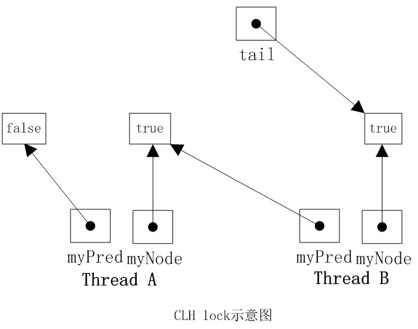

# JAVA并发编程学习笔记之CLH队列锁


## NUMA与SMP

SMP(Symmetric Multi-Processor)，即对称多处理器结构，指服务器中多个CPU对称工作，每个CPU访问内存地址所需时间相同。其主要特征是共享，包含对CPU，内存，I/O等进行共享。SMP的优点是能够保证内存一致性，缺点是这些共享的资源很可能成为性能瓶颈，随着CPU数量的增加，每个CPU都要访问相同的内存资源，可能导致内存访问冲突，可能会导致CPU资源的浪费。常用的PC机就属于这种。

NUMA(Non-Uniform Memory Access)非一致存储访问， 将CPU分为CPU模块，每个CPU模块由多个CPU组成， 并且具有独立的本地内存、 I/O 槽口等，模块之间可以通过互联模块 相互访问 ，访问本地内存的速度将远远高于访问远地内存 ( 系统内其它节点的内存 ) 的速度，这也是非一致存储访问 NUMA 的由来。 NUMA优点是 可以较好地解决原来 SMP 系统的扩展问题，缺点是由于 访问远地内存的延时远远超过本地内存，因此当 CPU 数量增加时，系统性能无法线性增加。

## CLH算法实现

CLH队列中的结点QNode中含有一个locked字段，该字段若为true表示该线程需要获取锁，且不释放锁，为false表示线程释放了锁。结点之间是通过隐形的链表相连，之所以叫隐形的链表是因为这些结点之间没有明显的next指针，而是通过myPred所指向的结点的变化情况来影响myNode的行为。CLHLock上还有一个尾指针，始终指向队列的最后一个结点。CLHLock的类图如下所示：


当一个线程需要获取锁时，会创建一个新的QNode，将其中的locked设置为true表示需要获取锁，然后线程对tail域调用getAndSet方法，使自己成为队列的尾部，同时获取一个指向其前趋的引用myPred,然后该线程就在前趋结点的locked字段上旋转，直到前趋结点释放锁。当一个线程需要释放锁时，将当前结点的locked域设置为false，同时回收前趋结点。如下图所示，线程A需要获取锁，其myNode域为true，些时tail指向线程A的结点，然后线程B也加入到线程A后面，tail指向线程B的结点。然后线程A和B都在它的myPred域上旋转，一量它的myPred结点的locked字段变为false，它就可以获取锁扫行。明显线程A的myPred locked域为false，此时线程A获取到了锁。



整个CLH的代码如下，其中用到了ThreadLocal类，将QNode绑定到每一个线程上，同时用到了AtomicReference,对尾指针的修改正是调用它的getAndSet()操作来实现的，它能够保证以原子方式更新对象引用。

```java
public class CLHLock implements Lock {
	AtomicReference<QNode> tail = new AtomicReference<QNode>(new QNode());
	ThreadLocal<QNode> myPred;
	ThreadLocal<QNode> myNode;

	public CLHLock() {
		tail = new AtomicReference<QNode>(new QNode());
		myNode = new ThreadLocal<QNode>() {
			protected QNode initialValue() {
				return new QNode();
			}
		};
		myPred = new ThreadLocal<QNode>() {
			protected QNode initialValue() {
				return null;
			}
		};
	}

	@Override
	public void lock() {
		QNode qnode = myNode.get();
		qnode.locked = true;
		QNode pred = tail.getAndSet(qnode);
		myPred.set(pred);
		while (pred.locked) {
		}
	}

	@Override
	public void unlock() {
		QNode qnode = myNode.get();
		qnode.locked = false;
		myNode.set(myPred.get());
	}
}	
```

从代码中可以看出lock方法中有一个while循环，这 是在等待前趋结点的locked域变为false，这是一个自旋等待的过程。unlock方法很简单，只需要将自己的locked域设置为false即可。

## CLH优缺点

CLH队列锁的优点是空间复杂度低（ 如果有n个线程，L个锁，每个线程每次只获取一个锁，那么需要的存储空间是O（L+n），n个线程有n个myNode，L个锁有L个tail），CLH的一种变体被应用在了JAVA并发框架中。唯一的缺点是在NUMA系统结构下性能很差，在这种系统结构下，每个线程有自己的内存，如果前趋结点的内存位置比较远，自旋判断前趋结点的locked域，性能将大打折扣，但是在SMP系统结构下该法还是非常有效的。一种解决NUMA系统结构的思路是MCS队列锁。

