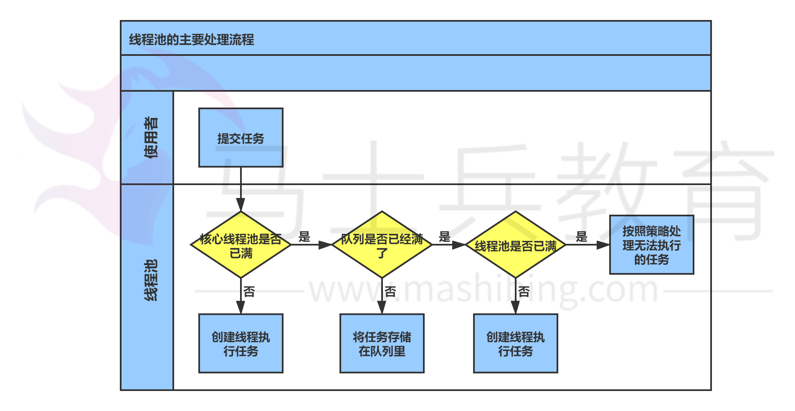

# JAVA线程池原理详解一


## 线程池的优点

1、线程是稀缺资源，使用线程池可以减少创建和销毁线程的次数，每个工作线程都可以重复使用。

2、可以根据系统的承受能力，调整线程池中工作线程的数量，防止因为消耗过多内存导致服务器崩溃。


## 线程池的创建

```
public ThreadPoolExecutor(int corePoolSize,
                               int maximumPoolSize,
                               long keepAliveTime,
                               TimeUnit unit,
                               BlockingQueue<Runnable> workQueue,
                               RejectedExecutionHandler handler) 
```

corePoolSize：线程池核心线程数量

maximumPoolSize:线程池最大线程数量

keepAliverTime：当活跃线程数大于核心线程数时，空闲的多余线程最大存活时间

unit：存活时间的单位

workQueue：存放任务的队列

handler：超出线程范围和队列容量的任务的处理程序


## 线程池的实现原理


提交一个任务到线程池中，线程池的处理流程如下：

1、判断**线程池里的核心线程**是否都在执行任务，如果不是（核心线程空闲或者还有核心线程没有被创建）则创建一个新的工作线程来执行任务。如果核心线程都在执行任务，则进入下个流程。

2、线程池判断工作队列是否已满，如果工作队列没有满，则将新提交的任务存储在这个工作队列里。如果工作队列满了，则进入下个流程。

3、判断**线程池里的线程**是否都处于工作状态，如果没有，则创建一个新的工作线程来执行任务。如果已经满了，则交给饱和策略来处理这个任务。



## 线程池的源码解读


1、ThreadPoolExecutor的execute()方法

```
 1 public void execute(Runnable command) {
 2         if (command == null)
 3             throw new NullPointerException();　　　　　　 //如果线程数大于等于基本线程数或者线程创建失败，将任务加入队列
 4         if (poolSize >= corePoolSize || !addIfUnderCorePoolSize(command)) {　　　　　　　　　　//线程池处于运行状态并且加入队列成功
 5             if (runState == RUNNING && workQueue.offer(command)) {
 6                 if (runState != RUNNING || poolSize == 0)
 7                     ensureQueuedTaskHandled(command);
 8             }　　　　　　　　　//线程池不处于运行状态或者加入队列失败，则创建线程（创建的是非核心线程）
 9             else if (!addIfUnderMaximumPoolSize(command))　　　　　　　　　　　//创建线程失败，则采取阻塞处理的方式
10                 reject(command); // is shutdown or saturated
11         }
12     }
```

2、创建线程的方法：addIfUnderCorePoolSize(command)

```
 1 private boolean addIfUnderCorePoolSize(Runnable firstTask) {
 2         Thread t = null;
 3         final ReentrantLock mainLock = this.mainLock;
 4         mainLock.lock();
 5         try {
 6             if (poolSize < corePoolSize && runState == RUNNING)
 7                 t = addThread(firstTask);
 8         } finally {
 9             mainLock.unlock();
10         }
11         if (t == null)
12             return false;
13         t.start();
14         return true;
15     }
```

我们重点来看第7行：

```
 1 private Thread addThread(Runnable firstTask) {
 2         Worker w = new Worker(firstTask);
 3         Thread t = threadFactory.newThread(w);
 4         if (t != null) {
 5             w.thread = t;
 6             workers.add(w);
 7             int nt = ++poolSize;
 8             if (nt > largestPoolSize)
 9                 largestPoolSize = nt;
10         }
11         return t;
12     }
```

这里将线程封装成工作线程worker，并放入工作线程组里，worker类的方法run方法：

```
 public void run() {
            try {
                Runnable task = firstTask;
                firstTask = null;
                while (task != null || (task = getTask()) != null) {
                    runTask(task);
                    task = null;
                }
            } finally {
                workerDone(this);
            }
        }
```

worker在执行完任务后，还会通过getTask方法循环获取工作队里里的任务来执行。

我们通过一个程序来观察线程池的工作原理：

1、创建一个线程

```
 1 public class ThreadPoolTest implements Runnable
 2 {
 3     @Override
 4     public void run()
 5     {
 6         try
 7         {
 8             Thread.sleep(300);
 9         }
10         catch (InterruptedException e)
11         {
12             e.printStackTrace();
13         }
14     }
15 }
```

2、线程池循环运行16个线程：

```
 1 public static void main(String[] args)
 2     {
 3         LinkedBlockingQueue<Runnable> queue =
 4             new LinkedBlockingQueue<Runnable>(5);
 5         ThreadPoolExecutor threadPool = new ThreadPoolExecutor(5, 10, 60, TimeUnit.SECONDS, queue);
 6         for (int i = 0; i < 16 ; i++)
 7         {
 8             threadPool.execute(
 9                 new Thread(new ThreadPoolTest(), "Thread".concat(i + "")));
10             System.out.println("线程池中活跃的线程数： " + threadPool.getPoolSize());
11             if (queue.size() > 0)
12             {
13                 System.out.println("----------------队列中阻塞的线程数" + queue.size());
14             }
15         }
16         threadPool.shutdown();
17     }
```

执行结果：

```
线程池中活跃的线程数： 1
线程池中活跃的线程数： 2
线程池中活跃的线程数： 3
线程池中活跃的线程数： 4
线程池中活跃的线程数： 5
线程池中活跃的线程数： 5
----------------队列中阻塞的线程数1
线程池中活跃的线程数： 5
----------------队列中阻塞的线程数2
线程池中活跃的线程数： 5
----------------队列中阻塞的线程数3
线程池中活跃的线程数： 5
----------------队列中阻塞的线程数4
线程池中活跃的线程数： 5
----------------队列中阻塞的线程数5
线程池中活跃的线程数： 6
----------------队列中阻塞的线程数5
线程池中活跃的线程数： 7
----------------队列中阻塞的线程数5
线程池中活跃的线程数： 8
----------------队列中阻塞的线程数5
线程池中活跃的线程数： 9
----------------队列中阻塞的线程数5
线程池中活跃的线程数： 10
----------------队列中阻塞的线程数5
Exception in thread "main" java.util.concurrent.RejectedExecutionException: Task Thread[Thread15,5,main] rejected from java.util.concurrent.ThreadPoolExecutor@232204a1[Running, pool size = 10, active threads = 10, queued tasks = 5, completed tasks = 0]
    at java.util.concurrent.ThreadPoolExecutor$AbortPolicy.rejectedExecution(ThreadPoolExecutor.java:2047)
    at java.util.concurrent.ThreadPoolExecutor.reject(ThreadPoolExecutor.java:823)
    at java.util.concurrent.ThreadPoolExecutor.execute(ThreadPoolExecutor.java:1369)
    at test.ThreadTest.main(ThreadTest.java:17)
```

从结果可以观察出：

1、创建的线程池具体配置为：核心线程数量为5个；全部线程数量为10个；工作队列的长度为5。

2、我们通过queue.size()的方法来获取工作队列中的任务数。

3、运行原理：

   **刚开始都是在创建新的线程，达到核心线程数量5个后，新的任务进来后不再创建新的线程，而是将任务加入工作队列，任务队列到达上线5个后，新的任务又会创建新的普通线程，直到达到线程池最大的线程数量10个，后面的任务则根据配置的饱和策略来处理。我们这里没有具体配置，使用的是默认的配置AbortPolicy:直接抛出异常。**

　　**当然，为了达到我需要的效果，上述线程处理的任务都是利用休眠导致线程没有释放！！！**

## RejetedExecutionHandler：饱和策略

当队列和线程池都满了，说明线程池处于饱和状态，那么必须对新提交的任务采用一种特殊的策略来进行处理。这个策略默认配置是AbortPolicy，表示无法处理新的任务而抛出异常。JAVA提供了4中策略：

1、AbortPolicy：直接抛出异常

2、CallerRunsPolicy：只用调用所在的线程运行任务

3、DiscardOldestPolicy：丢弃队列里最近的一个任务，并执行当前任务。

4、DiscardPolicy：不处理，丢弃掉。

我们现在用第四种策略来处理上面的程序：

```
 1 public static void main(String[] args)
 2     {
 3         LinkedBlockingQueue<Runnable> queue =
 4             new LinkedBlockingQueue<Runnable>(3);
 5         RejectedExecutionHandler handler = new ThreadPoolExecutor.DiscardPolicy();
 6 
 7         ThreadPoolExecutor threadPool = new ThreadPoolExecutor(2, 5, 60, TimeUnit.SECONDS, queue,handler);
 8         for (int i = 0; i < 9 ; i++)
 9         {
10             threadPool.execute(
11                 new Thread(new ThreadPoolTest(), "Thread".concat(i + "")));
12             System.out.println("线程池中活跃的线程数： " + threadPool.getPoolSize());
13             if (queue.size() > 0)
14             {
15                 System.out.println("----------------队列中阻塞的线程数" + queue.size());
16             }
17         }
18         threadPool.shutdown();
19     }
```

执行结果：

```
线程池中活跃的线程数： 1
线程池中活跃的线程数： 2
线程池中活跃的线程数： 2
----------------队列中阻塞的线程数1
线程池中活跃的线程数： 2
----------------队列中阻塞的线程数2
线程池中活跃的线程数： 2
----------------队列中阻塞的线程数3
线程池中活跃的线程数： 3
----------------队列中阻塞的线程数3
线程池中活跃的线程数： 4
----------------队列中阻塞的线程数3
线程池中活跃的线程数： 5
----------------队列中阻塞的线程数3
线程池中活跃的线程数： 5
----------------队列中阻塞的线程数3
```

这里采用了丢弃策略后，就没有再抛出异常，而是直接丢弃。在某些重要的场景下，可以采用记录日志或者存储到数据库中，而不应该直接丢弃。

设置策略有两种方式：

1、

```
 RejectedExecutionHandler handler = new ThreadPoolExecutor.DiscardPolicy();
 ThreadPoolExecutor threadPool = new ThreadPoolExecutor(2, 5, 60, TimeUnit.SECONDS, queue,handler);
```

2、

```
  ThreadPoolExecutor threadPool = new ThreadPoolExecutor(2, 5, 60, TimeUnit.SECONDS, queue);
  threadPool.setRejectedExecutionHandler(new ThreadPoolExecutor.AbortPolicy());
```


 