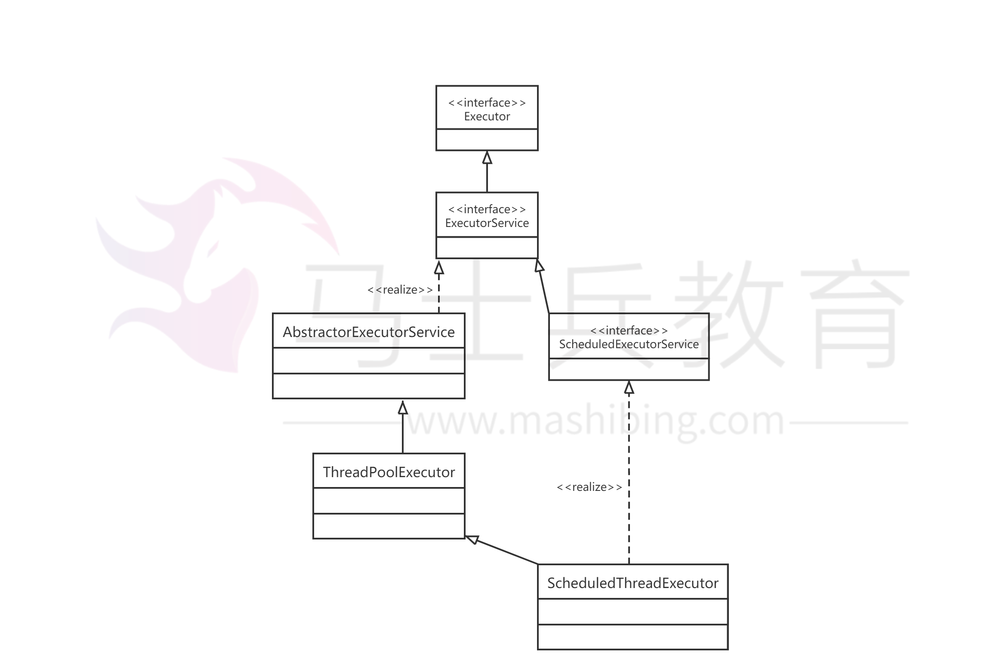

# JAVA线程池原理详解二                

​            

​            

### Executor框架的两级调度模型

在HotSpot VM的模型中，JAVA线程被一对一映射为本地操作系统线程。JAVA线程启动时会创建一个本地操作系统线程，当JAVA线程终止时，对应的操作系统线程也被销毁回收，而操作系统会调度所有线程并将它们分配给可用的CPU。

在上层，JAVA程序会将应用分解为多个任务，然后使用应用级的调度器（Executor）将这些任务映射成固定数量的线程；在底层，操作系统内核将这些线程映射到硬件处理器上。

**Executor框架类图**

**在前面介绍的JAVA线程既是工作单元，也是执行机制。而在Executor框架中，我们将工作单元与执行机制分离开来。Runnable和Callable是工作单元（也就是俗称的任务），而执行机制由Executor来提供。这样一来Executor是基于生产者消费者模式的，提交任务的操作相当于生成者，执行任务的线程相当于消费者。**

1、从类图上看，Executor接口是异步任务执行框架的基础，该框架能够支持多种不同类型的任务执行策略。

```
public interface Executor {

    void execute(Runnable command);
}
```

Executor接口就提供了一个执行方法，任务是Runnbale类型，不支持Callable类型。


2、ExecutorService接口实现了Executor接口，主要提供了关闭线程池和submit方法：

```
public interface ExecutorService extends Executor {

    List<Runnable> shutdownNow();


    boolean isTerminated();


    <T> Future<T> submit(Callable<T> task);

 }
```

另外该接口有两个重要的实现类：ThreadPoolExecutor与ScheduledThreadPoolExecutor。

其中ThreadPoolExecutor是线程池的核心实现类，用来执行被提交的任务；而ScheduledThreadPoolExecutor是一个实现类，可以在给定的延迟后运行任务，或者定期执行命令。

在上一篇文章中，我是使用ThreadPoolExecutor来通过给定不同的参数从而创建自己所需的线程池，但是在后面的工作中不建议这种方式，推荐使用Exectuors工厂方法来创建线程池

这里先来区别线程池和线程组（ThreadGroup与ThreadPoolExecutor）这两个概念：

a、线程组就表示一个线程的集合。

b、线程池是为线程的生命周期开销问题和资源不足问题提供解决方案，主要是用来管理线程。

Executors可以创建3种类型的ThreadPoolExecutor：SingleThreadExecutor、FixedThreadExecutor和CachedThreadPool

**a、SingleThreadExecutor：单线程线程池**

```
ExecutorService threadPool = Executors.newSingleThreadExecutor();
```

```
public static ExecutorService newSingleThreadExecutor() {
        return new FinalizableDelegatedExecutorService
            (new ThreadPoolExecutor(1, 1,
                                    0L, TimeUnit.MILLISECONDS,
                                    new LinkedBlockingQueue<Runnable>()));
    }
```

我们从源码来看可以知道，单线程线程池的创建也是通过ThreadPoolExecutor，里面的核心线程数和线程数都是1，并且工作队列使用的是无界队列。由于是单线程工作，每次只能处理一个任务，所以后面所有的任务都被阻塞在工作队列中，只能一个个任务执行。

**b、FixedThreadExecutor：固定大小线程池**

```
ExecutorService threadPool = Executors.newFixedThreadPool(5);
public static ExecutorService newFixedThreadPool(int nThreads) {
        return new ThreadPoolExecutor(nThreads, nThreads,
                                      0L, TimeUnit.MILLISECONDS,
                                      new LinkedBlockingQueue<Runnable>());
    }
```

这个与单线程类似，只是创建了固定大小的线程数量。

**c、CachedThreadPool:无界线程池**

```
ExecutorService threadPool = Executors.newCachedThreadPool();
public static ExecutorService newCachedThreadPool() {
        return new ThreadPoolExecutor(0, Integer.MAX_VALUE,
                                      60L, TimeUnit.SECONDS,
                                      new SynchronousQueue<Runnable>());
    }
```

无界线程池意味着没有工作队列，任务进来就执行，线程数量不够就创建，与前面两个的区别是：空闲的线程会被回收掉，空闲的时间是60s。这个适用于执行很多短期异步的小程序或者负载较轻的服务器。

### Callable、Future、FutureTash详解

Callable与Future是在JAVA的后续版本中引入进来的，Callable类似于Runnable接口，实现Callable接口的类与实现Runnable的类都是可以被线程执行的任务。

**三者之间的关系：**

**Callable是Runnable封装的异步运算任务。**

**Future用来保存Callable异步运算的结果**

**FutureTask封装Future的实体类**

**1、Callable与Runnbale的区别**

a、Callable定义的方法是call，而Runnable定义的方法是run。

b、call方法有返回值，而run方法是没有返回值的。

c、call方法可以抛出异常，而run方法不能抛出异常。

**2、Future**

Future表示异步计算的结果，提供了以下方法，主要是判断任务是否完成、中断任务、获取任务执行结果

```
 1 public interface Future<V> {
 2 
 3     boolean cancel(boolean mayInterruptIfRunning);
 4 
 5     boolean isCancelled();
 6 
 7     boolean isDone();
 8 
 9     V get() throws InterruptedException, ExecutionException;
10 
11     V get(long timeout, TimeUnit unit)
12         throws InterruptedException, ExecutionException, TimeoutException;
13 }
```

**3、FutureTask<V>**

可取消的异步计算，此类提供了对Future的基本实现，仅在计算完成时才能获取结果，如果计算尚未完成，则阻塞get方法。

```
public class FutureTask<V> implements RunnableFuture<V>
public interface RunnableFuture<V> extends Runnable, Future<V>
```

**FutureTask不仅实现了Future接口，还实现了Runnable接口，所以不仅可以将FutureTask当成一个任务交给Executor来执行，还可以通过Thread来创建一个线程。**

### Callable与FutureTask

定义一个callable的任务：

```
 1 public class MyCallableTask implements Callable<Integer>
 2 {
 3     @Override
 4     public Integer call()
 5         throws Exception
 6     {
 7         System.out.println("callable do somothing");
 8         Thread.sleep(5000);
 9         return new Random().nextInt(100);
10     }
11 }
```

```
 1 public class CallableTest
 2 {
 3     public static void main(String[] args) throws Exception
 4     {
 5         Callable<Integer> callable = new MyCallableTask();
 6         FutureTask<Integer> future = new FutureTask<Integer>(callable);
 7         Thread thread = new Thread(future);
 8         thread.start();
 9         Thread.sleep(100);
10         //尝试取消对此任务的执行
11         future.cancel(true);
12         //判断是否在任务正常完成前取消
13         System.out.println("future is cancel:" + future.isCancelled());
14         if(!future.isCancelled())
15         {
16             System.out.println("future is cancelled");
17         }
18         //判断任务是否已完成
19         System.out.println("future is done:" + future.isDone());
20         if(!future.isDone())
21         {
22             System.out.println("future get=" + future.get());
23         }
24         else
25         {
26             //任务已完成
27             System.out.println("task is done");
28         }
29     }
30 }
```

执行结果：

```
callable do somothing
future is cancel:true
future is done:true
task is done
```

这个DEMO主要是通过调用FutureTask的状态设置的方法，演示了状态的变迁。

**a、第11行，尝试取消对任务的执行，该方法如果由于任务已完成、已取消则返回false，如果能够取消还未完成的任务，则返回true，该DEMO中由于任务还在休眠状态，所以可以取消成功。**

```
future.cancel(true);
```

**b、第13行，判断任务取消是否成功：如果在任务正常完成前将其取消，则返回true**

```
System.out.println("future is cancel:" + future.isCancelled());
```

**c、第19行，判断任务是否完成：如果任务完成，则返回true，以下几种情况都属于任务完成：正常终止、异常或者取消而完成。**

  **我们的DEMO中，任务是由于取消而导致完成。**

```
 System.out.println("future is done:" + future.isDone());
```

**d、在第22行，获取异步线程执行的结果，我这个DEMO中没有执行到这里，需要注意的是，future.get方法会阻塞当前线程， 直到任务执行完成返回结果为止。**

```
System.out.println("future get=" + future.get());
```

### Callable与Future

```
public class CallableThread implements Callable<String>
{
    @Override
    public String call()
        throws Exception
    {
        System.out.println("进入Call方法，开始休眠，休眠时间为：" + System.currentTimeMillis());
        Thread.sleep(10000);
        return "今天停电";
    }
    
    public static void main(String[] args) throws Exception
    {
        ExecutorService es = Executors.newSingleThreadExecutor();
        Callable<String> call = new CallableThread();
        Future<String> fu = es.submit(call);
        es.shutdown();
        Thread.sleep(5000);
        System.out.println("主线程休眠5秒，当前时间" + System.currentTimeMillis());
        String str = fu.get();
        System.out.println("Future已拿到数据，str=" + str + ";当前时间为：" + System.currentTimeMillis());
    }
}
```

执行结果：

```
进入Call方法，开始休眠，休眠时间为：1478606602676
主线程休眠5秒，当前时间1478606608676
Future已拿到数据，str=今天停电;当前时间为：1478606612677
```

**这里的future是直接扔到线程池里面去执行的。由于要打印任务的执行结果，所以从执行结果来看，主线程虽然休眠了5s，但是从Call方法执行到拿到任务的结果，这中间的时间差正好是10s，说明get方法会阻塞当前线程直到任务完成。**

**通过FutureTask也可以达到同样的效果：

```
public static void main(String[] args) throws Exception
    {
      ExecutorService es = Executors.newSingleThreadExecutor();
      Callable<String> call = new CallableThread();
      FutureTask<String> task = new FutureTask<String>(call);
      es.submit(task);
      es.shutdown();
      Thread.sleep(5000);
      System.out.println("主线程等待5秒，当前时间为：" + System.currentTimeMillis());
      String str = task.get();
      System.out.println("Future已拿到数据，str=" + str + ";当前时间为：" + System.currentTimeMillis());
    }
```

以上的组合可以给我们带来这样的一些变化：

如有一种场景中，方法A返回一个数据需要10s,A方法后面的代码运行需要20s，但是这20s的执行过程中，只有后面10s依赖于方法A执行的结果。如果与以往一样采用同步的方式，势必会有10s的时间被浪费，如果采用前面两种组合，则效率会提高：

1、先把A方法的内容放到Callable实现类的call()方法中

2、在主线程中通过线程池执行A任务

3、执行后面方法中10秒不依赖方法A运行结果的代码

4、获取方法A的运行结果，执行后面方法中10秒依赖方法A运行结果的代码

这样代码执行效率一下子就提高了，程序不必卡在A方法处。