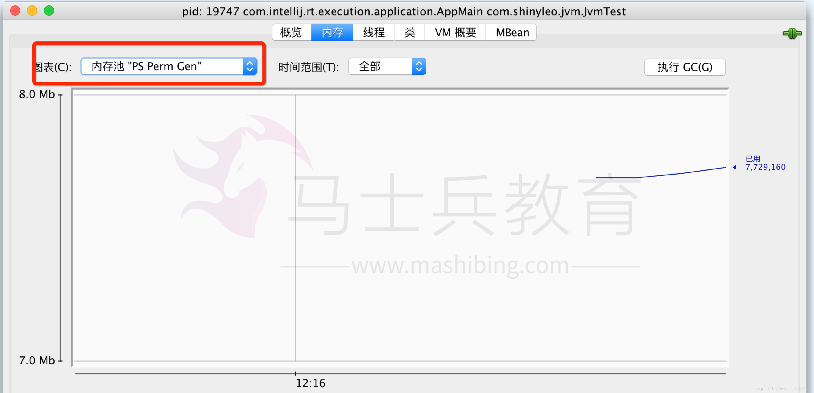
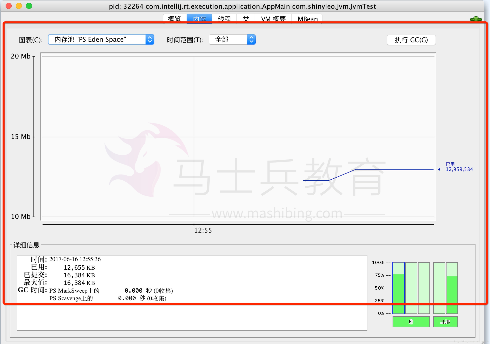
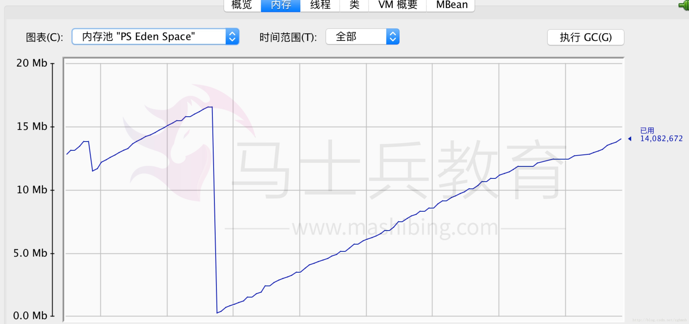
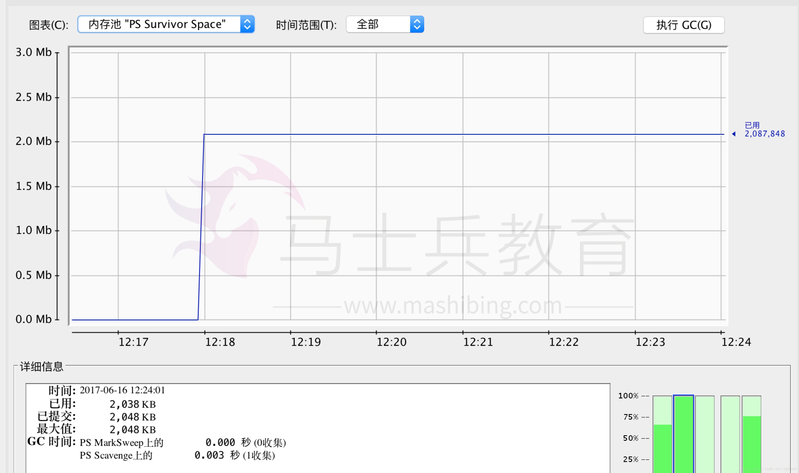
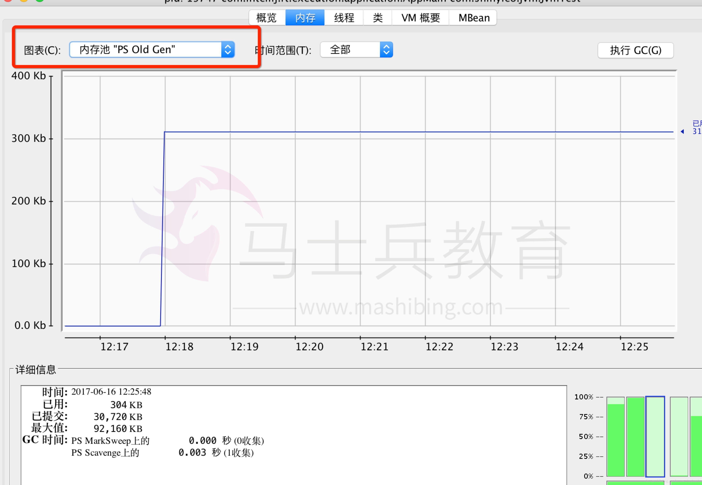
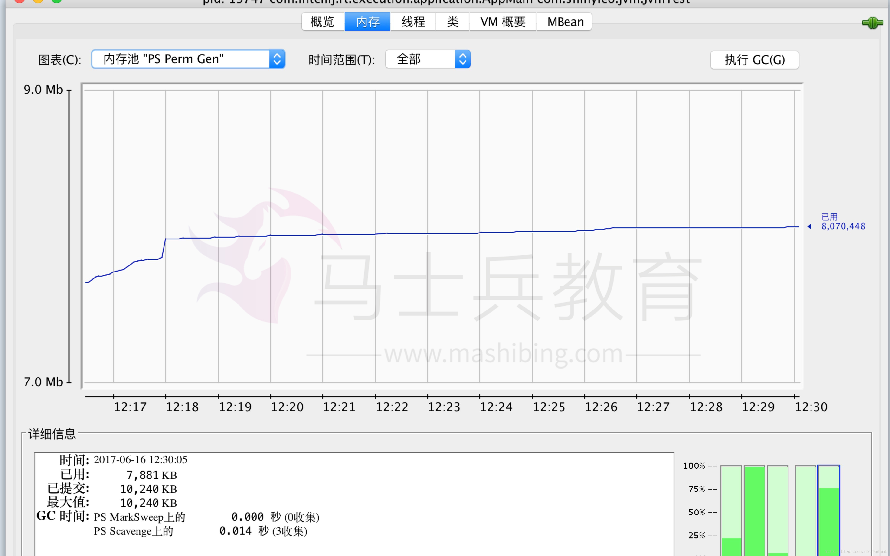
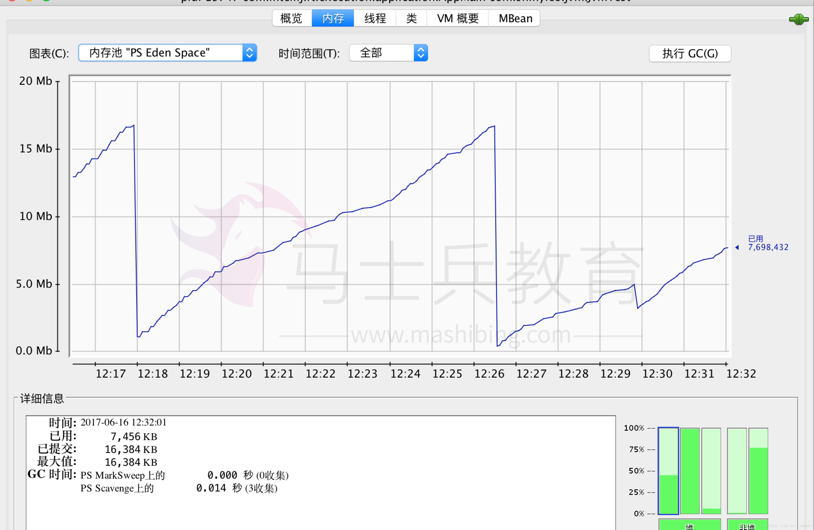
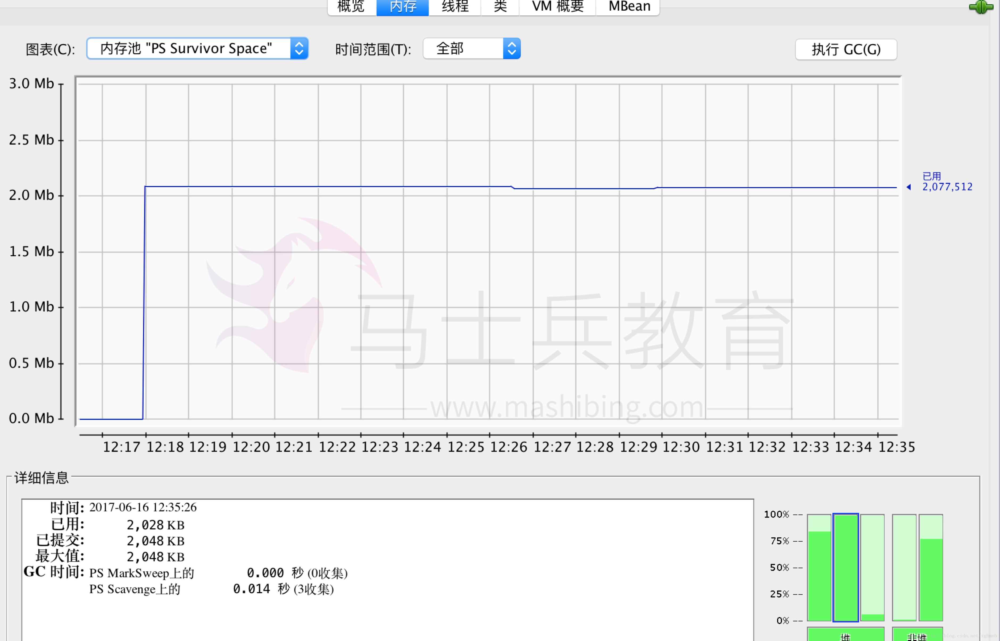
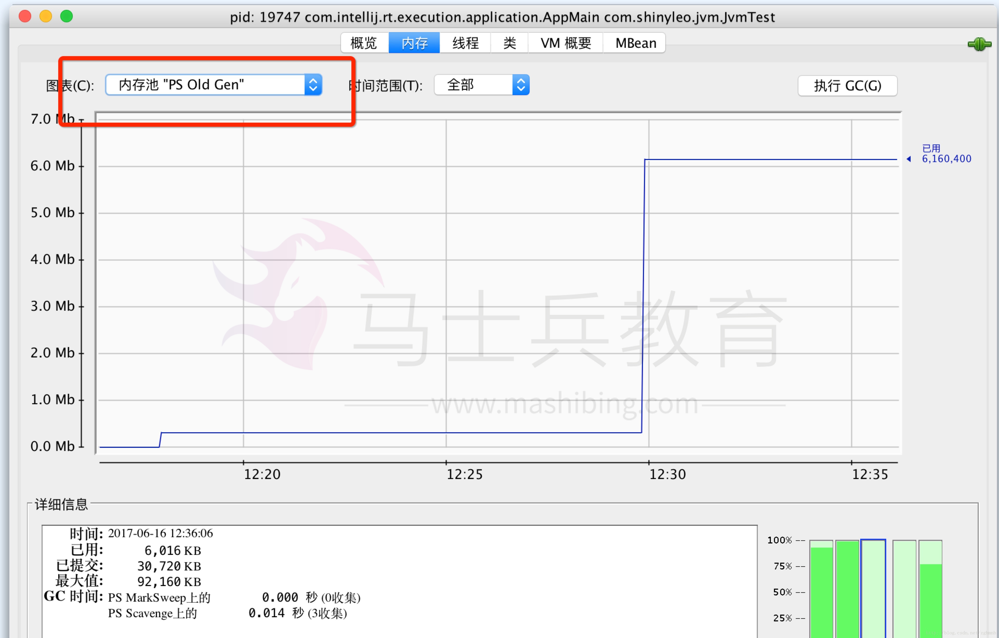

# JVM-堆学习之新生代老年代持久带的使用关系


之前被问到一个问题，大意是这样的：假如jvm参数中，最大堆内存分配了800M，Eden区分配了200M，s0、s1各分配50M，持久带分配了100M，老年代分配了400M，问现在启动应用程序后，可使用的最大内存有多少？

这个问题的问本质其实是想考我们对JVM堆内存的GC回收原理的理解，我当时回答说是650M，我这样回答，当时是这样考虑的：持久带100M 是用来存放静态类、方法或者变量的，程序启动后，这部分内存不会再分配给新创建的对象，s0和S1总不能同时是满的，即总有一个是空的或者非满状态，所以减去这两部分剩下的部分就是可用的，即800-100-50 =650. 后来下面仔细看了看GC分代回收算法，我这个答案可能是错的。为了弄清楚这个问题，自己简单写个测试类，结合Jconsole，来进行分析，思路是这样的：

- **创建一个测试类，静态代码块中初始化一个List，观察持久带使用情况**
- **创建临时对象，调整对象个数，分别观察Eden、s0、S1内存交换情况**
- **塞满新生代，观察Eden区 s0、s1、old区的情况**
- ***手动执行GC，观察分析gc回收日志**

以上每一个步骤执行完系统挂起，观察jconsole，进行分析

------

## 1.设置JVM启动参数

这里为了方便跑程序，设置的参数较小

```
 -Xms50M -Xmx110M -Xmn20M -XX:PermSize=10M -XX:MaxPermSize=10M -XX:SurvivorRatio=8 -XX:NewRatio=4 -XX:+PrintGCDetails1
```

参数分析如下

```
 * -Xms50M:初始堆大小 50M
 * -Xmx100M: 最大堆大小 100M
 * -Xmn20M: 新生代 20M （Eden + survivor0 + survivor1 ）
 * -XX:PermSize=10M :初始持久带10M

 * -XX:SurvivorRatio=8 : Eden区与Survivor区的大小比值=8,表示两个
   Survivor区之和与一个Eden区的比值为2:8,一个Survivor区占整个年轻代
   的1/10即Eden = 16M ,s0 = 2M ,s1=2M

 * -XX:NewRatio=4：表示新生代与年老代所占比值为1:4,新生代占整个堆栈的
   1/5,（110-10）*0.2 =20M，老年代占整个堆的4/5,(最大100*0.8=80M)

12345678910111213
```

总结推理：堆最大110M 持久带10M 新生代Eden=16M,S0=2M,s1=2M 老年代old区最大不超过80M，Eden区域到达16M时候触发幸存区复制，新生代达到20M的时候，触发YGC，old区域满的时候出发FGC，下面我们来验证这个理论。

## 测试类

```
/**
 * Created by zhugh on 17/6/16.
 */
public class JvmTest {

 List<DataObject> list = new ArrayList();
    static {
        //模拟持久带存储
        int index = 0;
        while(index < 10000){
            DataObject object = new DataObject();
            object.setAge(index + 30);
            object.setName("李四"+index);
            list.add(object);
            index ++;
        }
        System.out.println("生成持久带数据：" + list.size() + "条");
        System.out.println("[1]:生成持久带数据，请观察jconsole堆内存情况");
    }

    //模拟新生代存储
    public static void main(String[] agrs){
        try {
            System.out.print("请输入任意键开始给Eden区塞对象");
            System.in.read(); //模拟挂起，观察jconsole
            System.out.print("开始往Eden灌数据");
            List<DataObject> tempList = new ArrayList();
            int i = 100000;
            while(i > 0){
                DataObject object = new DataObject();
                object.setAge(i + 20);
                object.setName("张三"+i);
                i --;
                tempList.add(object);
            }
            System.out.println("生成新生代数据：" + tempList.size() + "条");
            System.out.println("[2]:生成新生代数据完成，请观察jconsole堆内存情况");
            System.in.read();
            System.out.println("输入任意键执行GC回收：");

            System.gc();
            System.out.println("[3]:GC回收完成，请观察jconsole堆内存情况");
            System.in.read();
            System.exit(0);
        } catch (IOException e) {
            e.printStackTrace();
        }
    }

    static class DataObject{
        private String name;
        private int age;

        public String getName() {
            return name;
        }

        public void setName(String name) {
            this.name = name;
        }

        public int getAge() {
            return age;
        }

        public void setAge(int age) {
            this.age = age;
        }

        @Override
        public String toString() {
            return "DataObject{" +
                    "name='" + name + '\'' +
                    ", age=" + age +
                    '}';
        }
    }
}123456789101112131415161718192021222324252627282930313233343536373839404142434445464748495051525354555657585960616263646566676869707172737475767778
```

[1]持久代先灌10000条记录，观察jconsole持久带占用情况如图1，使用不到8M：


我们在观察Eden区使用的情况如下图2：

看到Eden区域已经使用了约12m，这是应为类加载过程中会创建一些对象，这些对象是非用户定义的。

我们开始给Eden区域第一次灌对象，之后效果如下图3：\



我们可以看到上图，Eden区域使用到16M的时候进行了一次从Eden区域往幸存区的复制，从Eden区复制了2M数据到了幸存区域。

再来看看幸存区的情况，如下图4：


上图分析：由于触发了一次幸存区复制，所以幸存区使用了2M，目前为止符合我的推测。
我们再来看看old区现在的情况 图5：



分析，由于现在还未触发YGC，old区域使用300Kb,这是程序无关外的其他额外内存占用，可以忽略，基本上还是满存状态。

现在我们把挂起的程序继续向下执行，继续往新生代灌注数据，再次触发Eden区域往幸存区的复制，看看此时持久带的情况如下图6：

分析：持久带几乎没有变，这验证了临时对象的生成不占用持久带内存是正确的。

再来观察此时Eden区的情况图7：

分析，此时Eden区第二次被灌满16M，部分数据复制到了s0或者s1区域，又触发了一次复制。
我们再来看看s0和s1的情况图8：

分析，果然，幸存区又一次进行了复制，至此幸存区已经占满，触发YGC。

再来看看此时老年代的情况图9：

分析，如图，老年代此时已经使用了6M内存，说明此时已经触发了YGC，
那么这6M是哪里来的呢？看到这里如果明白的人，就会懂了，让我们来一起来分析一下：
第二次往Eden区域灌数据的时候，如图7，触发第二次幸存区复制后，Eden区域剩余约8M数据，说明有另外8M被进行复制回收了，那么这8M回收到哪里去了呢？由于第二次触发幸存区复制时，幸存区s0或者s1还有2M可以用（第一次Eden往幸存区复制后已经使用了2M），所以这8m有2M复制到了幸存区，此时幸存区已4M满，剩下6M被复制到老年区，所以老年区的6M = Eden区被回收的8M-新生代承担的2M。当然这里有一个概念我需要强调下，老年区的数据并不是直接从Eden区进行复制，而是先从Eden区倒腾到幸存区，再从幸存区倒腾到old区。
程序运行结束，敢看GC回收日志如下

```
  Heap
 PSYoungGen      total 18432K, used 375K [0x00000007fec00000, 0x0000000800000000, 0x0000000800000000)
  eden space 16384K, 2% used [0x00000007fec00000,0x00000007fec5dc38,0x00000007ffc00000)
  from space 2048K, 0% used [0x00000007ffe00000,0x00000007ffe00000,0x0000000800000000)
  to   space 2048K, 0% used [0x00000007ffc00000,0x00000007ffc00000,0x00000007ffe00000)
 ParOldGen       total 30720K, used 1947K [0x00000007f9200000, 0x00000007fb000000, 0x00000007fec00000)
  object space 30720K, 6% used [0x00000007f9200000,0x00000007f93e6d80,0x00000007fb000000)
 PSPermGen       total 10240K, used 7762K [0x00000007f8800000, 0x00000007f9200000, 0x00000007f9200000)
  object space 10240K, 75% used [0x00000007f8800000,0x00000007f8f94ab0,0x00000007f9200000)123456789
```

从GC汇总日志上看，新生代总共占用约20M，Eden占用约16M，s0、s1各2M，老年代总共30M左右，使用了6%，为什么现在是6%了？是因为代码中有人工进行GC回收的动作，老年代的6M，被回收释放了，剩余约1.8M，持久带约10M，使用了7M多点，占用约75%。

问题，和之前的结论大体一致，只有老年代为什么才30M，和预期的80M差这么多？我理解为老年代并不是初始化的时候就开辟80M的空间，而是当不断触发YGC往老年代复制数据的时候，一旦超过30M，会在开辟更多空间，最大不超过80M，只是推论，也希望同志们能够进行验证。

剩下如果想验证FGC的情况，需要继续往内存中灌数据，直到把old区域灌满，触发FGC，此时可以观察老年代的内存大小，这部分内容，就留给各位自己去验证吧。