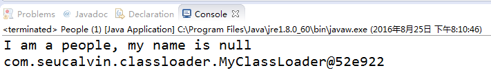

# JVM——自定义类加载器


***\*0.\** \**为什么需要自定义类加载器\**** 

网上的大部分自定义类加载器文章，几乎都是贴一段实现代码，然后分析一两句自定义ClassLoader的原理。但是我觉得首先得把为什么需要自定义加载器这个问题搞清楚，因为如果不明白它的作用的情况下，还要去学习它显然是很让人困惑的。

首先介绍自定义类的应用场景：

（1）加密：Java代码可以轻易的被[反编译](https://www.baidu.com/s?wd=反编译&tn=44039180_cpr&fenlei=mv6quAkxTZn0IZRqIHcvrjTdrH00T1d9rj6Yuhn3n1b3uWwBn1wb0ZwV5Hcvrjm3rH6sPfKWUMw85HfYnjn4nH6sgvPsT6KdThsqpZwYTjCEQLGCpyw9Uz4Bmy-bIi4WUvYETgN-TLwGUv3EP1R1rjD3njnzPWc1n1RdPW6Y)，如果你需要把自己的代码进行加密以防止反编译，可以先将编译后的代码用某种加密算法加密，类加密后就不能再用Java的ClassLoader去加载类了，这时就需要自定义ClassLoader在加载类的时候先解密类，然后再加载。

（2）从非标准的来源加载代码：如果你的字节码是放在数据库、甚至是在云端，就可以自定义类加载器，从指定的来源加载类。

（3）以上两种情况在实际中的综合运用：比如你的应用需要通过网络来传输 Java 类的字节码，为了安全性，这些字节码经过了加密处理。这个时候你就需要自定义类加载器来从某个网络地址上读取加密后的字节代码，接着进行解密和验证，最后定义出在Java虚拟机中运行的类。

 

***\*1. 双亲委派模型\****

在实现自己的ClassLoader之前，我们先了解一下系统是如何加载类的，那么就不得不介绍双亲委派模型的实现过程。

```java
//双亲委派模型的工作过程源码
protected synchronized Class<?> loadClass(String name, boolean resolve) throws ClassNotFoundException{
    // First, check if the class has already been loaded
    Class c = findLoadedClass(name);
    if (c == null) {
        try {
            if (parent != null) {
                c = parent.loadClass(name, false);
            } else {
                c = findBootstrapClassOrNull(name);
            }
        } 
        catch (ClassNotFoundException e) {
            // ClassNotFoundException thrown if class not found
            // from the non-null parent class loader
            //父类加载器无法完成类加载请求
        }
 
        if (c == null) {
            // If still not found, then invoke findClass in order to find the class
            //子加载器进行类加载 
            c = findClass(name);
        }
    }
 
    if (resolve) {
        //判断是否需要链接过程，参数传入
        resolveClass(c);
    }
 
    return c;
}
```

双亲委派模型的工作过程如下：

（1）当前类加载器从自己已经加载的类中查询是否此类已经加载，如果已经加载则直接返回原来已经加载的类。

（2）如果没有找到，就去委托父类加载器去加载（如代码c = parent.loadClass(name, false)所示）。父类加载器也会采用同样的策略，查看自己已经加载过的类中是否包含这个类，有就返回，没有就委托父类的父类去加载，一直到启动类加载器。因为如果父加载器为空了，就代表使用启动类加载器作为父加载器去加载。

（3）如果启动类加载器加载失败（例如在$JAVA_HOME/jre/lib里未查找到该class），则会抛出一个异常ClassNotFoundException，然后再调用当前加载器的findClass()方法进行加载。 

 

双亲委派模型的好处：

（1）主要是为了安全性，避免用户自己编写的类动态替换 Java的一些核心类，比如 String。

（2）同时也避免了类的重复加载，因为 JVM中区分不同类，不仅仅是根据类名，相同的 class文件被不同的 ClassLoader加载就是不同的两个类。

 

***\*2. 自定义类加载器\****

（1）从上面源码看出，调用loadClass时会先根据委派模型在父加载器中加载，如果加载失败，则会调用当前加载器的findClass来完成加载。

（2）因此我们自定义的类加载器只需要继承ClassLoader，并覆盖findClass方法，下面是一个实际例子，在该例中我们用自定义的类加载器去加载我们事先准备好的class文件。

 

***\*2.1\** \**自定义一个\**\**People.java\**\**类做例子\****

```java
public class People {
//该类写在记事本里，在用javac命令行编译成class文件，放在d盘根目录下
	private String name;
 
	public People() {}
 
	public People(String name) {
		this.name = name;
	}
 
	public String getName() {
		return name;
	}
 
	public void setName(String name) {
		this.name = name;
	}
 
	public String toString() {
		return "I am a people, my name is " + name;
	}
 
}
```

***\*2.2\** \**自定义类加载器\****

自定义一个类加载器，需要继承ClassLoader类，并实现findClass方法。其中defineClass方法可以把二进制流字节组成的文件转换为一个java.lang.Class（只要二进制字节流的内容符合Class文件规范）。

```java
import java.io.ByteArrayOutputStream;
import java.io.File;
import java.io.FileInputStream;
import java.nio.ByteBuffer;
import java.nio.channels.Channels;
import java.nio.channels.FileChannel;
import java.nio.channels.WritableByteChannel;
 
public class MyClassLoader extends ClassLoader
{
    public MyClassLoader()
    {

       
    }
    
    public MyClassLoader(ClassLoader parent)
    {
        super(parent);
    }
    
    protected Class<?> findClass(String name) throws ClassNotFoundException
    {
    	File file = new File("D:/People.class");
        try{
            byte[] bytes = getClassBytes(file);
            //defineClass方法可以把二进制流字节组成的文件转换为一个java.lang.Class
            Class<?> c = this.defineClass(name, bytes, 0, bytes.length);
            return c;
        } 
        catch (Exception e)
        {
            e.printStackTrace();
        }
        
        return super.findClass(name);
    }
    
    private byte[] getClassBytes(File file) throws Exception
    {
        // 这里要读入.class的字节，因此要使用字节流
        FileInputStream fis = new FileInputStream(file);
        FileChannel fc = fis.getChannel();
        ByteArrayOutputStream baos = new ByteArrayOutputStream();
        WritableByteChannel wbc = Channels.newChannel(baos);
        ByteBuffer by = ByteBuffer.allocate(1024);
        
        while (true){
            int i = fc.read(by);
            if (i == 0 || i == -1)
            break;
            by.flip();
            wbc.write(by);
            by.clear();
        }
        fis.close();
        return baos.toByteArray();
    }
}
```

 

***\*2.3\** \**在主函数里使用\****

```java
MyClassLoader mcl = new MyClassLoader(); 
Class<?> clazz = Class.forName("People", true, mcl); 
Object obj = clazz.newInstance();

System.out.println(obj);
System.out.println(obj.getClass().getClassLoader());//打印出我们的自定义类加载器
```

 

**2.4** **运行结果**


 

至此关于自定义ClassLoader的内容总结完毕。