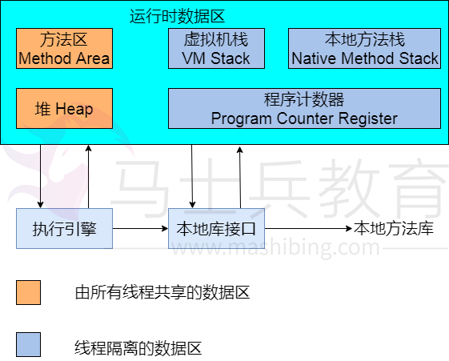
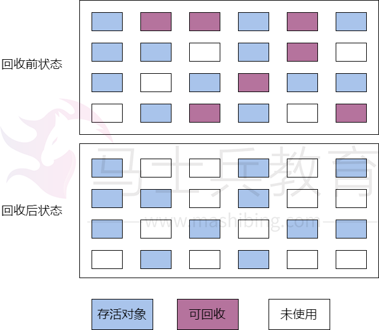
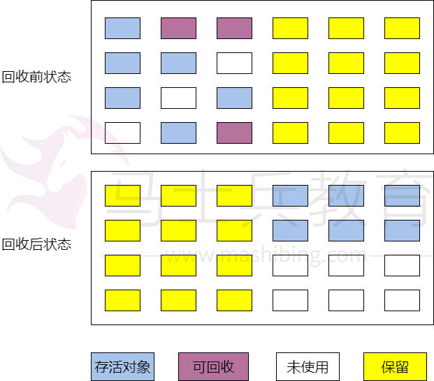
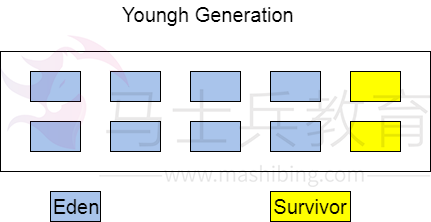

# JVM内存模型与GC算法

# 1.JVM内存模型



JVM内存模型如上图，需要声明一点，这是《Java虚拟机规范（Java SE 7版）》规定的内容，实际区域由各JVM自己实现，所以可能略有不同。以下对各区域进行简短说明。

## 1.1程序计数器

 程序计数器是众多编程语言都共有的一部分，作用是标示下一条需要执行的指令的位置，分支、循环、跳转、异常处理、线程恢复等基础功能都是依赖程序计数器完成的。

 对于Java的多线程程序而言，不同的线程都是通过轮流获得cpu的时间片运行的，这符合计算机组成原理的基本概念，因此不同的线程之间需要不停的获得运行，挂起等待运行，所以各线程之间的计数器互不影响，独立存储。这些数据区属于线程私有的内存。

## 1.2 Java虚拟机栈

 VM虚拟机栈也是线程私有的，生命周期与线程相同。虚拟机栈描述的是Java方法执行的内存模型：每个方法在执行的同时都会创建一个栈帧(Stack Frame)用于存储局部变量表、操作数栈、动态链接、方法出口等信息。每一个方法调用直至执行完的过程，就对应着一个栈帧在虚拟机栈中入栈到出栈的过程。

 有人将java内存区域划分为栈与堆两部分，在这种粗略的划分下，栈标示的就是当前讲的虚拟机栈，或者是虚拟机栈对应的局部变量表。之所以说这种划分比较粗略是角度不同，这种划分方法关心的是新申请内存的存在空间，而我们目前谈论的是JVM整体的内存划分，由于角度不同，所以划分的方法不同，没有对与错。

 局部变量表存放了编译期可知的各种基本类型，对象引用，和returnAddress。其中64位长的long和double占用了2个局部变量空间(slot)，其他类型都占用1个。这也从存储的角度上说明了long与double本质上的非原子性。局部变量表所需的内存在编译期间完成分配，当进入一个方法时，这个方法在栈帧中分配多大的局部变量空间是完全确定的，在方法运行期间不会改变局部变量表大小。

 由于栈帧的进出栈，显而易见的带来了空间分配上的问题。如果线程请求的栈深度大于虚拟机所允许的深度，将抛出StackOverFlowError异常；如果虚拟机栈可以扩展，扩展时无法申请到足够的内存，将会抛出OutOfMemoryError。显然，这种情况大多数是由于循环调用与递归带来的。

## 1.3 本地方法栈

 本地方法栈与虚拟机栈的作用十分类似，不过本地方法是为native方法服务的。部分虚拟机（比如 Sun HotSpot虚拟机）直接将本地方法栈与虚拟机栈合二为一。与虚拟机栈一样，本地方法栈也会抛出StactOverFlowError与OutOfMemoryError异常。

 至此，线程私有数据区域结束，下面开始线程共享数据区。

## 1.4 Java堆

 Java堆是虚拟机所管理的内存中最大的一块，在虚拟机启动时创建，此块内存的唯一目的就是存放对象实例，几乎所有的对象实例都在对上分配内存。JVM规范中的描述是：所有的对象实例以及数据都要在堆上分配。但是随着JIT编译器的发展与逃逸分析技术的逐渐成熟，栈上分配(对象只存在于某方法中，不会逃逸出去，因此方法出栈后就会销毁，此时对象可以在栈上分配，方便销毁)，标量替换(新对象拥有的属性可以由现有对象替换拼凑而成，就没必要真正生成这个对象)等优化技术带来了一些变化，目前并非所有的对象都在堆上分配了。

 当java堆上没有内存完成实例分配，并且堆大小也无法扩展是，将会抛出OutOfMemoryError异常。Java堆是垃圾收集器管理的主要区域。

## 1.5 方法区

 方法区与java堆一样，是线程共享的数据区，用于存储被虚拟机加载的类信息、常量、静态变量、即时编译的代码。JVM规范将方法与堆区分开，但是HotSpot将方法区作为永久代(Permanent Generation)实现。这样方便将GC分代手机方法扩展至方法区，HotSpot的垃圾收集器可以像管理Java堆一样管理方法区。但是这种方向已经逐步在被HotSpot替换中，在JDK1.7的版本中，已经把原本存放在方法区的字符串常量区移出。

 至此，JVM规范所声明的内存模型已经分析完毕，下面将分析一些经常提到的与内存相关的区域。

## 1.6 运行时常量池

 运行时常量池是方法区的一部分。Class文件中除了有类的版本、字段、方法、接口等信息外，还有一项信息是常量池(Constant Poll Table)用于存放编译期生成的各种字面量和符号引用，这部分内容将在类加载后进入方法区的运行时常量池存放。

 其中字符串常量池属于运行时常量池的一部分，不过在HotSpot虚拟机中，JDK1.7将字符串常量池移到了java堆中，通过下面的实验可以很容易看到。

```
import java.util.ArrayList;
import java.util.List;

/**
 * Created by shining.cui on 2017/7/23.
 */
public class RunTimeContantPoolOOM {
    public static void main(String[] args) {
        List list = new ArrayList();
        int i = 0;
        while(true){
            list.add(String.valueOf(i++).intern());
        }
    }
}
```

 在jdk1.6中，字符串常量区是在Perm Space中的，所以可以将Perm Spacce设置的小一些，XX:MaxPermSize=10M可以很快抛出异常：java.lang.OutOfMemoryError:Perm Space。

 在jdk1.7以上，字符串常量区已经移到了Java堆中，设置-Xms:64m -Xmx:64m，很快就可以抛出异常java.lang.OutOfMemoryError:java.heap.space。

## 1.7 直接内存

 直接内存不是JVM运行时的数据区的一部分，也不是Java虚拟机规范中定义的内存区域。在JDK1.4中引入了NIO(New Input/Output)类，引入了一种基于通道(Chanel)与缓冲区(Buffer)的I/O方式，他可以使用Native函数库直接分配堆外内存，然后通过一个存储在Java中的DirectByteBuffer对象作为对这块内存的引用进行操作。这样能在一些场景中显著提高性能，因为避免了在Java对和Native对中来回复制数据。

# 2.GC算法

## 2.1 标记-清除算法

 最基础的垃圾收集算法是“标记-清除”(Mark Sweep)算法，正如名字一样，算法分为2个阶段：1.标记处需要回收的对象，2.回收被标记的对象。标记算法分为两种:1.引用计数算法(Reference Counting) 2.可达性分析算法(Reachability Analysis)。由于引用技术算法无法解决循环引用的问题，所以这里使用的标记算法均为可达性分析算法。



 如图所示，当进行过标记清除算法之后，出现了大量的非连续内存。当java堆需要分配一段连续的内存给一个新对象时，发现虽然内存清理出了很多的空闲，但是仍然需要继续清理以满足“连续空间”的要求。所以说，这种方法比较基础，效率也比较低下。

## 2.2 复制算法

 为了解决效率与内存碎片问题，复制(Copying)算法出现了，它将内存划分为两块相等的大小，每次使用一块，当这一块用完了，就讲还存活的对象复制到另外一块内存区域中，然后将当前内存空间一次性清理掉。这样的对整个半区进行回收，分配时按照顺序从内存顶端依次分配，这种实现简单，运行高效。不过这种算法将原有的内存空间减少为实际的一半，代价比较高。



 从图中可以看出，整理后的内存十分规整，但是白白浪费一般的内存成本太高。然而这其实是很重要的一个收集算法，因为现在的商业虚拟机都采用这种算法来回收新生代。IBM公司的专门研究表明，新生代中的对象98%都是“朝生夕死”的，所以不需要按照1:1的比例来划分内存。HotSpot虚拟机将Java堆划分为年轻代(Young Generation)、老年代(Tenured Generation），其中年轻代又分为一块Eden和两块Survivor。



 所有的新建对象都放在年轻代中，年轻代使用的GC算法就是复制算法。其中Eden与Survivor的内存大小比例为8:2，其中Eden由1大块组成，Survivor由2小块组成。每次使用内存为1Eden+1Survivor，即90%的内存。由于年轻代中的对象生命周期往往很短，所以当需要进行GC的时候就将当前90%中存活的对象复制到另外一块Survivor中，原来的Eden与Survivor将被清空。但是这就有一个问题，我们无法保证每次年轻代GC后存活的对象都不高于10%。所以在当活下来的对象高于10%的时候，这部分对象将由Tenured进行担保，即无法复制到Survivor中的对象将移动到老年代。

## 2.3 标记-整理算法

 复制算法在极端情况下(存活对象较多)效率变得很低，并且需要有额外的空间进行分配担保。所以在老年代中这种情况一般是不适合的。


 所以就出现了标记-整理(Mark-Compact)算法。与标记清除算法一样，首先是标记对象，然而第二步是将存货的对象向内存一段移动，整理出一块较大的连续内存空间。

#  3. 总结

1. Java虚拟机规范中规定了对内存的分配，其中程序计数器、本地方法栈、虚拟机栈属于线程私有数据区，Java堆与方法区属于线程共享数据。
2. Jdk从1.7开始将字符串常量区由方法区(永久代)移动到了Java堆中。
3. Java从NIO开始允许直接操纵系统的直接内存，在部分场景中效率很高，因为避免了在Java堆与Native堆中来回复制数据。
4. Java堆分为年轻代有年老代，其中年轻代分为1个Eden与2个Survior，同时只有1个Eden与1个Survior处于使用中状态，又有年轻代的对象生存时间为往往很短，因此使用复制算法进行垃圾回收。
5. 年老代由于对象存活期比较长，并且没有可担保的数据区，所以往往使用标记-清除与标记-整理算法进行垃圾回收。