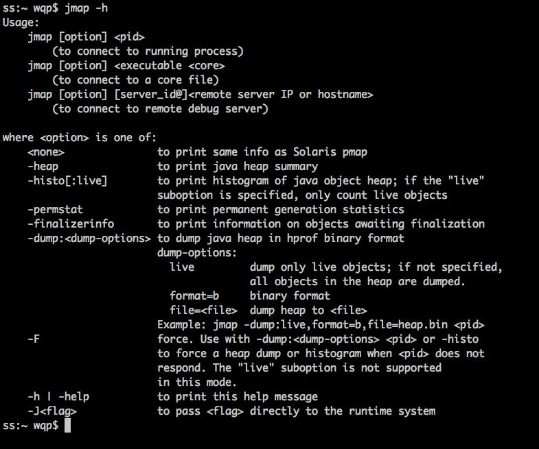

# JVM调优常用参数配置


### 堆配置


```undefined
-Xms:初始堆大小
-Xms：最大堆大小
-XX:NewSize=n:设置年轻代大小
-XX:NewRatio=n:设置年轻代和年老代的比值。如：为3表示年轻代和年老代比值为1：3，年轻代占整个年轻代年老代和的1/4
-XX:SurvivorRatio=n:年轻代中Eden区与两个Survivor区的比值。注意Survivor区有两个。如3表示Eden： 3 Survivor：2，一个Survivor区占整个年轻代的1/5
-XX:MaxPermSize=n:设置持久代大小
```

> 说明：
>  1、一般初始堆和最大堆设置一样，因为：现在内存不是什么稀缺的资源，但是如果不一样，从初始堆到最大堆的过程会有一定的性能开销，所以一般设置为初始堆和最大堆一样。64位系统理论上可以设置为无限大，但是一般设置为**4G**,因为如果再大，JVM进行垃圾回收出现的暂停时间会比较长，这样全GC过长，影响JVM对外提供服务，所以不能太大。一般设置为4G。
>  2、-XX:NewRaio和-XX:SurvivorRatio这两个参数，都是设置年轻代和年老代的大小的，设置一个即可，第一是设置年轻代的大小，第二个是设置比值，理论上设置一个既可以满足需求

------

### 收集器设置：


```css
 -XX:+UseSerialGC:设置串行收集器
 -XX:+UseParallelGC:设置并行收集器
 -XX:+UseParalledlOldGC:设置并行年老代收集器
 -XX:+UseConcMarkSweepGC:设置并发收集器
```

### 垃圾回收统计信息

**打印GC回收的过程日志信息**


```css
-XX:+PrintGC 
-XX:+PrintGCDetails
-XX:+PrintGCTimeStamps
-Xloggc:filename
```

### 并行收集器设置


```objectivec
-XX:ParallelGCThreads=n:设置并行收集器收集时使用的CPU数。并行收集线程数
-XX:MaxGCPauseMillis=n:设置并行收集最大的暂停时间（如果到这个时间了，垃圾回收器依然没有回收完，也会停止回收）
-XX:GCTimeRatio=n:设置垃圾回收时间占程序运行时间的百分比。公式为：1/(1+n)
-XX:+CMSIncrementalMode:设置为增量模式。适用于单CPU情况
-XX:ParallelGCThreads=n:设置并发收集器年轻代手机方式为并行收集时，使用的CPU数。并行收集线程数
```

## 典型配置举例

以下配置主要针对分代收集回收算法而言

### 堆大小设置

年轻代的设置很关键
 JVM中最大堆大小有三方面限制：相关操作系统的数据模型(32bit还是64bit)限制：系统的可用虚拟内存限制；系统的可用物理内存限制。32位系统下，一般限制在1.5G-2G;64位操作系统对内存没有限制。在Windows Server 2003系统，3.5G物理内存，JDK5.0下测试，最大设置为1478m。

典型设置：


```undefined
java-Xmx3550m -Xms3550m-Xmn2g -Xss128k
-Xmx3550m:设置JVM最大可用内存为3550m
-Xms3550m:设置JVM初始内存为3550m，此值可以设置-Xmx相同，以避免每次垃圾回收完成以后JVM重新分配内存
-Xmn2g:设置年轻代大小为2G。整个堆大小=年轻代大小+年老代大小+持久代大小。持久代一般固定为64M,所以增大年轻代后，将会减少年老代大小，此值对系统性能影响比较大，Sun官方推荐配置为整个堆的3/8
-Xss128k:设置每个线程的堆栈大小。JDK5.0以后每个线程栈大小为1M，以前每个线程堆栈大小为256k。根据应用的线程所需要内存大小进行调整。在相同物理内存下，减少这个值能够生成更多的线程。但是操作系统对一个进程内的线程还是有限制的，不能无限生成，经验值在3000-5000左右。
```

------


```undefined
java -Xmx3550m-Xms3550m-Xss128k-XX:NewRatio=4-XX:SurvivorRatio=4
-XX:MaxPermSize=16m-XX:MaxTenuringThreshold=0

-XX:NewRatio=4:设置年轻代（包括Eden和两个Survivor区）与年老代的比值（除去持久代）。设置为4，则年轻代和年老代所占比值为1：4，年轻代占整个堆栈的1/5
-XX:SurvivorRatio=4:设置年轻代中Eden区与Survivor区的大小比值。设置为4，则两个Survivor区与一个Eden区的比值为2:4,一个Survivor区占整个年轻代的1/6
-XX:MaxPermSize=16m:设置持久代大小为16m
-XX：MaxTenuringThreshold=0：设置垃圾最大年龄。如果设置为0，则年轻代对象不经过Survivor区，直接进入年老代。对于年老代比较多的应用，提高效率，如果将此值设置为一个较大值，则年轻代对象会在Survivor区进行多次复制，这样可以增加对象在年轻代的存活时间。
```

### 回收器的选择

JVM给了三种选择：串行收集器，并行收集器，并发收集器，但是串行收集器只适用于小数据量的情况，一般不考虑使用了，所以这里只针对并行收集器和并发收集器。默认情况下，JDK5.0以前是使用的串行收集器，如果想使用其他收集器需要在启动时加入相应的参数，**JDK5.0以后，JVM会根据系统当前的配置进行判断**

**吞吐量优先的并行收集器**
 并行收集器主要以到达一定的吞吐量为目标，适用于后台处理


```undefined
java -Xmx3550m-Xms3550m-Xss128k-XX:+UseParallelGC
-XX:ParallelGCThreads=20
-XX:+UseParallelGC:选择垃圾收集器为并行收集器。次配置仅对年轻代有效。即上述配置下，年轻代使用并行收集，而年老代仍旧使用串行收集。
-XX：PARALLELgcThreads=20:配置并行收集器的线程数，即：同时多少个线程一起进行垃圾回收。此值最好配置与处理器数目相同。
-XX:+UseParallelOldGC:配置年老代来及收集方式为并行收集，JDK6.0支持对年老代并行收集
-XX:MaxGCPauseMillis=100:设置每次年轻代垃圾回收的最长时间，如果无法满足此时间，JVM会自动调整年轻代大小，以满足此值
-XX:+UseAdaptiveSizePolicy:设置此选项以后，并行收集器会自动选择年轻代区大小和相应的Survivor区比例，以达到目标系统规定的最低响应时间或者收集频率等，此值建议使用并行收集器时，一直打开
```

**响应时间优先的并发收集器**
 并发收集器主要是保证系统的响应时间，减少垃圾收集时的停顿时间。适用于应用服务器、电信领域等。


```objectivec
-XX:CMSFullGCsBeforeCompaction=5
-XX:+UseCMSCompactAtFullCollection
-XX:CMSFullGCsBeforeCompaction:由于并发收集器不对内存空间进行压缩、整理、所以运行一段时间以后会产生“碎片”，使得运行效率降低。此值设置运行多少次GC以后对内存空间进行压缩、整理
-XX:+UseCMSCompactAtFullCollection：打开对年老代的压缩。可能会影响性能，但是可以消除碎片
```

### 调优总结：

**年轻代大小选择**
 响应时间优先的应用：尽可能设置大，直到接近系统的最低响应时间限制（根据实际情况选择）。在此种情况下，年轻代收集发生的频率也是最小的。同时减少到达年老代的对象。
 吞吐量优先的应用：尽可能的设置大，可能到达Gbit的成都，因为对响应时间没有要求，垃圾收集可以并行进行，一般适合8核CPU以上应用。

**年老代大小选择**
 响应时间优先的应用：年老代使用并发收集器，所以其大小需要小心设置，一般要考虑并发会话率和会话持续时间等一些参数。如果堆设置小了，可能会造成内存碎片、高回收频率以及应用暂停而使用传统的标记清除方式；如果堆大了，则需要较长的收集时间。最优化的方案，一般需要参考一下数据获得：
 1、并发垃圾收集信息
 2、持久代并发收集次数
 3、传统GC信息
 4、花在年轻代和年老代回收上的时间比例减少年轻代和年老代花费的时间，一般会提高应用的效率

**吞吐量优先的应用**
 一般吞吐量优先的应用都有一个很大的年轻代和一个较小的年老代。原因是，这样可以尽可能回收掉大部分短期对象，减少中期对象，而年老代尽存放长期存活的对象

**较小堆引起的碎片问题**
 因为年老代的并发收集器使用标记、清除算法，所以不会对堆进行压缩。当收集器回收时，他会把相邻的空间进行合并，这样可以分配给较大的对象。但是当堆空间较小时，运行一段时间以后，就会出现“碎片”，如果并发收集器找不到足够的空间，那么并发收集器将会停止，然后使用传统的标记、清除方式进行回收。如果出现“碎片”，可能需要进行如下配置：


```objectivec
-XX:+UseCMSCompactAtFullCollection:使用并发收集器时，开启对年老代的压缩
-XX:CMSFullGCsBeforeCompaction=0:上面配置开启的情况下，这里设置多少次FullGc后，对年老代进行压缩
```

### 调优方法

#### 调优工具

Jconsole,jProfile,VisualVM

Jconsole:jdk自带， 功能简单，但是可以再系统有一定负荷的情况下使用，对垃圾回收算法有很详细的跟踪。
 JProfiler：商业软件，需要付费，但是功能强大
 VisualVM:JDK自带，功能强大，与Jprofiler类似，推荐

### 如何调优

观察内存释放情况、集合类检查，对象树
 上面这些调优工具都提供了强大的功能，但是总的来说一般分为以下几类功能：

> 1、堆的信息查看（年轻代、年老代、持久代分配）
>  2、提供即时的垃圾回收功能呢
>  3、垃圾监控，长时间监控

### 内存泄露检查

一般就是根据垃圾回收前后情况对比，同时根据对象引用情况（**常见的集合对象引用**）分析，基本都可以找到泄漏点。

持久代沾满处理：
 1、-XX:MaxPermSize=16m
 2、换JDK比如：JRocket

系统内存被沾满：
 一般是因为没有足够的资源产生线程造成的，系统创建线程时，除了要在Java堆中分配内存外，操作系统本身也需要分配资源来创建线程。因此，当线程数量大的一定程度以后，堆中或许还有空间，但是操作系统分配不出资源来了，出现异常。
 分配给Java虚拟机的内存越多，系统剩余的资源就越少，因此，当系统内存固定时，分配给Java虚拟机的内存越多，那么，系统总共能够产生的线程也就越少，两者成反比。同事，可以通过修改-Xss来减少分配给单个线程的空间，也可以增加系统总共生产的线程数。

java程序内存问题的诊断方法：

> 1、jstat可以查看垃圾回收情况：jstat -gcutil pid
>  2、jmap可以将java内存dump出来
>  3、jstack -l 进程id
>  4、eclipse插件MAT可以有效的分析内存占用情况


```undefined
jmap -h
```

查看jmap的命令参数，帮助查看堆信息



最大线程数，一般的机器300-500不错了，淘宝曾经调优过1500，不过不清楚是如何调的。