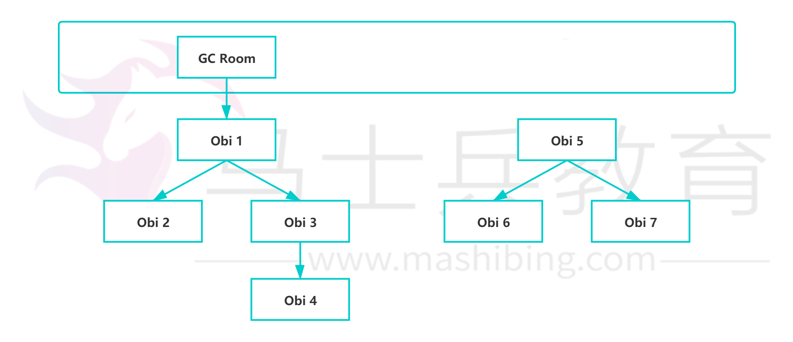

# Java JVM 8：垃圾回收（GC 在什么时候，对什么东西，做了什么事情）

**在什么时候**

首先需要知道，GC又分为 minor GC 和 Full GC (也称为 Major GC )。Java 堆内存分为新生代和老年代，新生代中又分为1个 Eden 区域 和两个 Survivor 区域。

那么对于 Minor GC 的触发条件：**大多数情况下，直接在 Eden 区中进行分配**。如果 Eden区域没有足够的空间，那么就会发起一次 Minor GC；对于 Full GC（Major GC）的触发条件：也是如果老年代没有足够空间的话，那么就会进行一次 Full GC。

Ps：上面所说的只是一般情况下，实际上，需要考虑一个空间分配担保的问题：

在发生Minor GC之前，虚拟机会先检查老年代最大可用的连续空间是否大于新生代所有对象的总空间。如果大于则进行Minor GC，如果小于则看HandlePromotionFailure设置是否允许担保失败（不允许则直接Full GC）。如果允许，那么会继续检查老年代最大可用的连续空间是否大于历次晋升到老年代对象的平均大小，如果大于则尝试Minor GC（如果尝试失败也会触发Full GC），如果小于则进行Full GC。

但是，具体到什么时刻执行，这个是由系统来进行决定，是无法预测的。

**对什么东西**

主要根据可达性分析算法，如果一个对象不可达，那么就是可以回收的；如果一个对象可达，那么这个对象就不可以回收。对于可达性分析算法，它是通过一系列称为“GC Roots” 的对象作为起始点，当一个对象到 GC Roots 没有任何引用链相接的时候，那么这个对象就是不可达，就可以被回收。如下图:

这个GC Root 对象可以是一些静态的对象，Java方法的local变量或参数， native 方法引用的对象，活着的线程。

**做了什么事情**

主要做了清理对象，整理内存的工作。Java堆分为新生代和老年代，采用了不同的回收方式。例如新生代采用了复制算法，老年代采用了标记整理法。在新生代中，分为一个Eden 区域和两个Survivor区域，真正使用的是一个Eden区域和一个Survivor区域，GC的时候，会把存活的对象放入到另外一个Survivor区域中，然后再把这个Eden区域和Survivor区域清除。那么对于老年代，采用的是标记整理法，首先标记出存活的对象，然后再移动到一端。这样也有利于减少内存碎片。