# List、Set、Map的区别

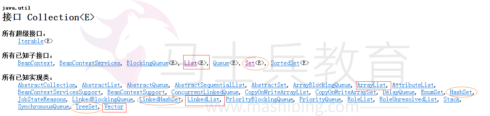

（图一）

## **1.面试题：你说说collection里面有什么子类。**

## （其实面试的时候听到这个问题的时候，你要知道，面试官是想考察List，Set）

## 正如图一，list和set是实现了collection接口的。

 

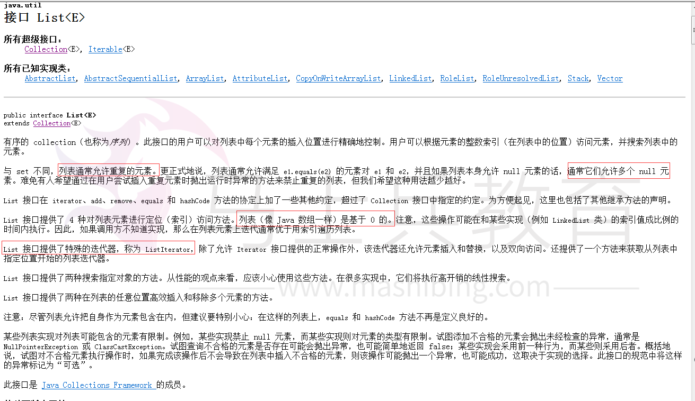

（图二）

## List：1.可以允许重复的对象。

## 　　  2.可以插入多个null元素。

##     3.是一个有序容器，保持了每个元素的插入顺序，输出的顺序就是插入的顺序。

##     4.常用的实现类有 ArrayList、LinkedList 和 Vector。ArrayList 最为流行，它提供了使用索引的随意访问，而 LinkedList 则对于经常需要从 List 中添加或删除元素的场合更为合适。

 

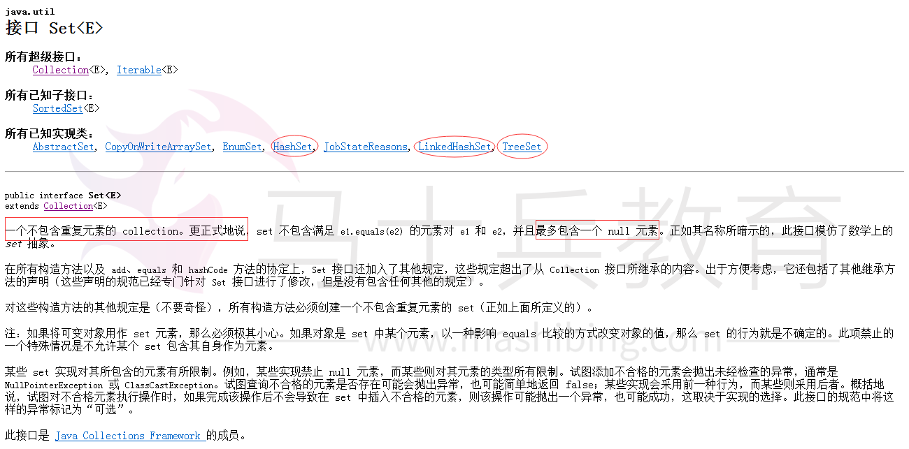

 （图三）

##  Set：1.不允许重复对象

## 　　  2. 无序容器，你无法保证每个元素的存储顺序，TreeSet通过 Comparator  或者 Comparable 维护了一个排序顺序。

##     3. 只允许一个 null 元素

##     4.Set 接口最流行的几个实现类是 HashSet、LinkedHashSet 以及 TreeSet。最流行的是基于 HashMap 实现的 HashSet；TreeSet 还实现了 SortedSet 接口，因此 TreeSet 是一个根据其 compare() 和 compareTo() 的定义进行排序的有序容器。

 

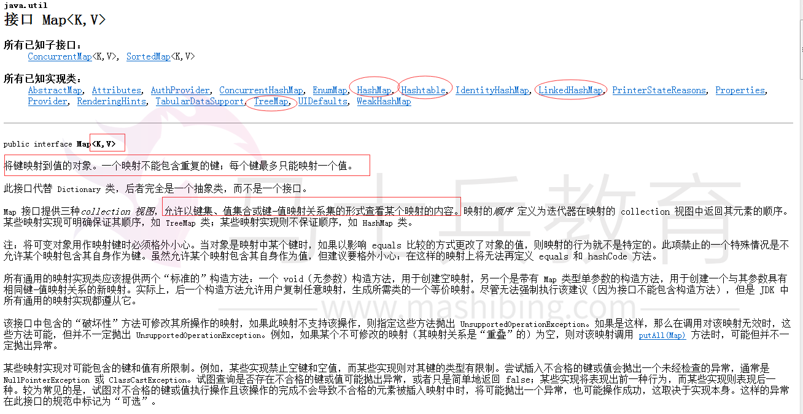

（图四）

## 1.Map不是collection的子接口或者实现类。Map是一个接口。

## 2.Map 的 每个 Entry 都持有两个对象，也就是一个键一个值，Map 可能会持有相同的值对象但键对象必须是唯一的。

## 3. TreeMap 也通过 Comparator  或者 Comparable 维护了一个排序顺序。

## 4. Map 里你可以拥有随意个 null 值但最多只能有一个 null 键。

## 5.Map 接口最流行的几个实现类是 HashMap、LinkedHashMap、Hashtable 和 TreeMap。（HashMap、TreeMap最常用）

 

 

## 2.面试题：什么场景下使用list，set，map呢？

## （或者会问为什么这里要用list、或者set、map，这里回答它们的优缺点就可以了）

## 答：

1. ## 如果你经常会使用索引来对容器中的元素进行访问，那么 List 是你的正确的选择。如果你已经知道索引了的话，那么 List 的实现类比如 ArrayList 可以提供更快速的访问,如果经常添加删除元素的，那么肯定要选择LinkedList。

2. ## 如果你想容器中的元素能够按照它们插入的次序进行有序存储，那么还是 List，因为 List 是一个有序容器，它按照插入顺序进行存储。

3. ## 如果你想保证插入元素的唯一性，也就是你不想有重复值的出现，那么可以选择一个 Set 的实现类，比如 HashSet、LinkedHashSet 或者 TreeSet。所有 Set 的实现类都遵循了统一约束比如唯一性，而且还提供了额外的特性比如 TreeSet 还是一个 SortedSet，所有存储于 TreeSet 中的元素可以使用 Java 里的 Comparator 或者 Comparable 进行排序。LinkedHashSet 也按照元素的插入顺序对它们进行存储。

4. ## 如果你以键和值的形式进行数据存储那么 Map 是你正确的选择。你可以根据你的后续需要从 Hashtable、HashMap、TreeMap 中进行选择。

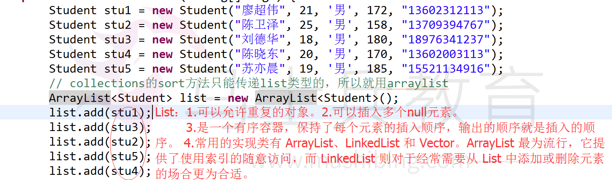

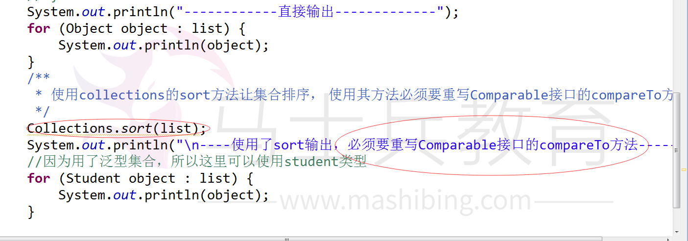

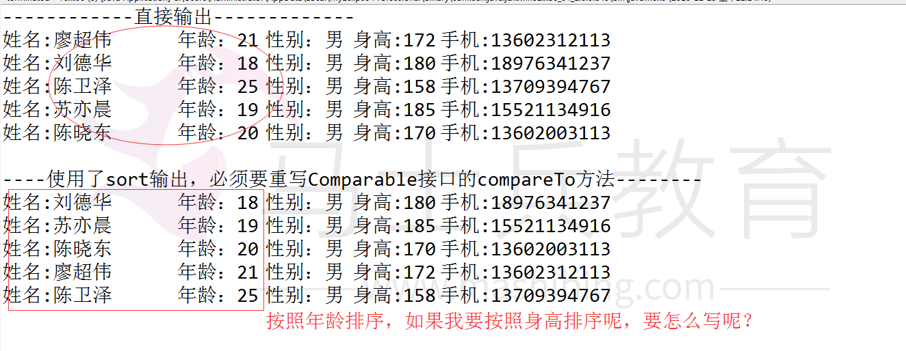

## 大家可以跟着下面的步骤一起尝试一下。

## 1.我们知道了列表要实现排序，需要重写comparable接口的compareTo的方法。

## 但是是我不知道comparaTo里面要怎么写呢，它有传入参数吗？它有返回值吗？如果有事什么类型的呢？ok，下面一起来做一下。先把这个链接的帮助文档下载下来。下载完之后，打开帮助文档，

 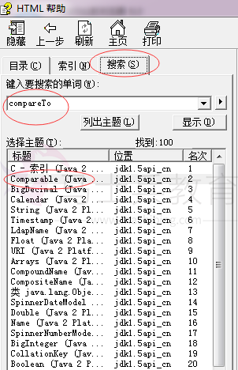

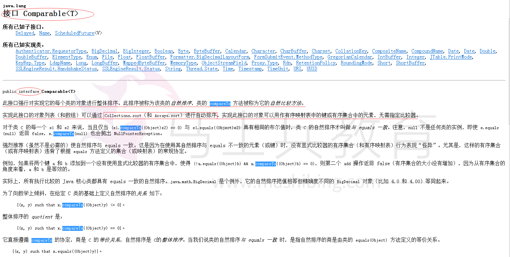

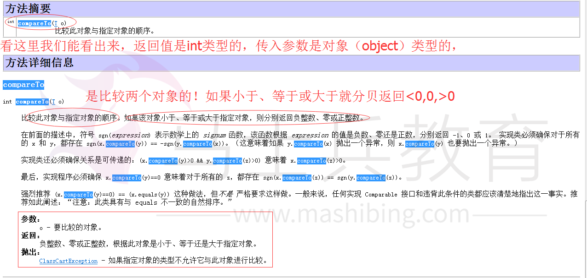

2.看完了帮助文档是不是心里稍微有点底气了呢，那现在打开eclipse我们一起来写一写吧。

首先我们要比较对象的哪个属性呢。年龄？身高？还是体重？刚刚看帮助文档已经知道了，所以下面大家一起来写一下。

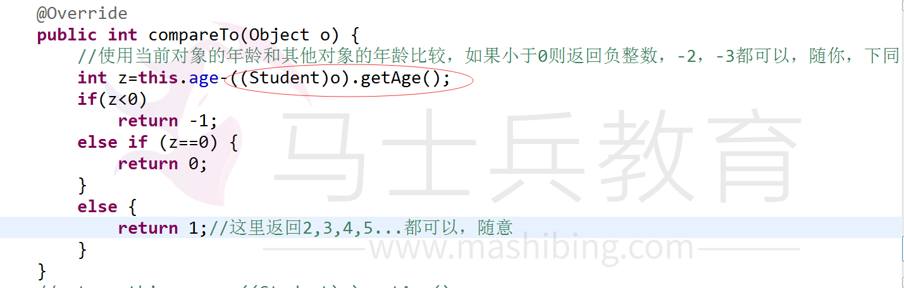

 如果大家也是像上图这种写法，那么再想一想有没有更好的办法。(我这样吻是肯定有的，好好看看帮助文档，你就知道了，我知道你只要用心想想，肯定想出来的！)

好了，写完年龄，不去继续花几分钟把按照身高来排序也写一下吧。