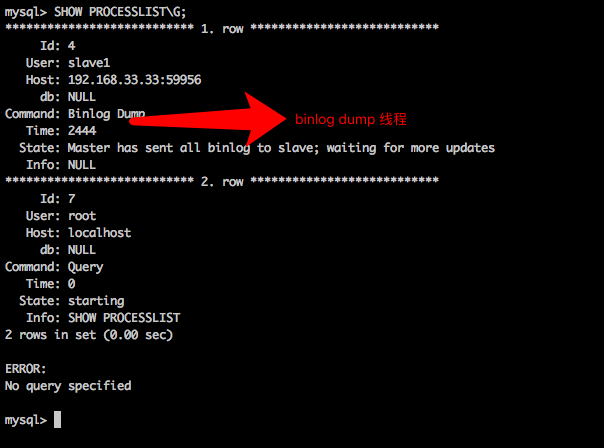
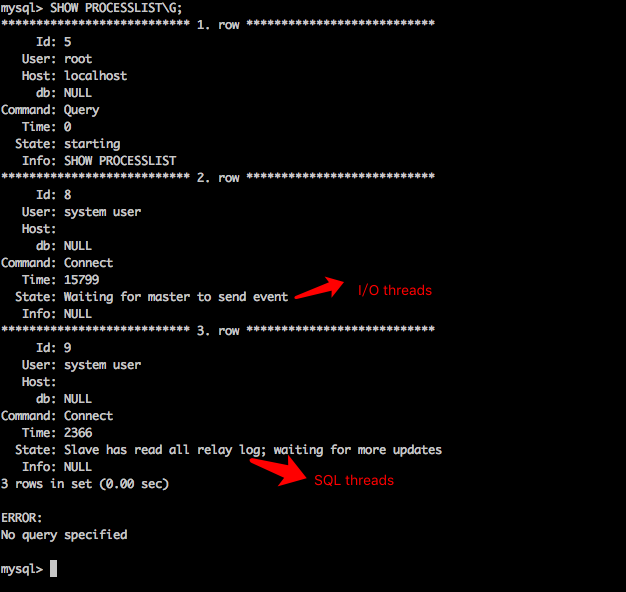
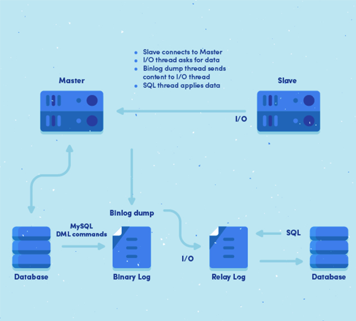

# Mysql主从同步的实现原理

**1、什么是mysql主从同步？
**

当master(主)库的数据发生变化的时候，变化会实时的同步到slave(从)库。

**2、主从同步有什么好处？**

- 水平扩展数据库的负载能力。
- 容错，高可用。Failover(失败切换)/High Availability
- 数据备份。

**3、主从同步的原理是什么？**

首先我们来了解master-slave的体系结构。

如下图：

不管是delete、update、insert，还是创建函数、存储过程，所有的操作都在master上。当master有操作的时候,slave会快速的接收到这些操作，从而做同步。

**但是，这个机制是怎么实现的呢？**

在master机器上，主从同步事件会被写到特殊的log文件中(binary-log);在slave机器上，slave读取主从同步事件，并根据读取的事件变化，在slave库上做相应的更改。

如此，就实现了主从同步了！

下面我们来详细的了解。

**3.1主从同步事件有哪些
**

上面说到：

在master机器上，主从同步事件会被写到特殊的log文件中(binary-log);

主从同步事件有3种形式:statement、row、mixed。

1. statement：会将对数据库操作的sql语句写入到binlog中。
2. row：会将每一条数据的变化写入到binlog中。
3. mixed：statement与row的混合。Mysql决定什么时候写statement格式的，什么时候写row格式的binlog。

3.2在master机器上的操作

当master上的数据发生改变的时候，该事件(insert、update、delete)变化会按照顺序写入到binlog中。

**binlog dump线程**

当slave连接到master的时候，master机器会为slave开启binlog dump线程。当master 的 binlog发生变化的时候，binlog dump线程会通知slave，并将相应的binlog内容发送给slave。

**3.3在slave机器上的操作**

当主从同步开启的时候，slave上会创建2个线程。

- I/O线程。该线程连接到master机器，master机器上的binlog dump线程会将binlog的内容发送给该I/O线程。该I/O线程接收到binlog内容后，再将内容写入到本地的relay log。
- SQL线程。该线程读取I/O线程写入的relay log。并且根据relay log的内容对slave数据库做相应的操作。

3.4如何在master、slave上查看上述的线程？

使用SHOW PROCESSLIST命令可以查看。

如图，在master机器上查看binlog dump线程。

如图，在slave机器上查看I/O、SQL线程。

**4、讲了这么多，一图以蔽之**

