# NIO技术概览                                    

NIO（Non-blocking I/O，在Java领域，也称为New I/O），是一种同步非阻塞的I/O模型，也是I/O多路复用的基础，已经被越来越多地应用到大型应用服务器，成为解决高并发与大量连接、I/O处理问题的有效方式。

## IO模型的分类

按照《Unix网络编程》的划分，I/O模型可以分为：阻塞I/O模型、非阻塞I/O模型、I/O复用模型、信号驱动式I/O模型和异步I/O模型，按照POSIX标准来划分只分为两类：同步I/O和异步I/O。

如何区分呢？首先一个I/O操作其实分成了两个步骤：**发起IO请求和实际的IO操作**。同步I/O和异步I/O的区别就在于第二个步骤是否阻塞，如果实际的I/O读写阻塞请求进程，那么就是同步I/O，因此阻塞I/O、非阻塞I/O、I/O复用、信号驱动I/O都是同步I/O，如果不阻塞，而是操作系统帮你做完I/O操作再将结果返回给你，那么就是异步I/O。

阻塞I/O和非阻塞I/O的区别在于第一步，发起I/O请求是否会被阻塞，如果阻塞直到完成那么就是传统的阻塞I/O，如果不阻塞，那么就是非阻塞I/O。


- 阻塞I/O模型 ：在linux中，默认情况下所有的socket都是blocking，一个典型的读操作流程大概是这样：

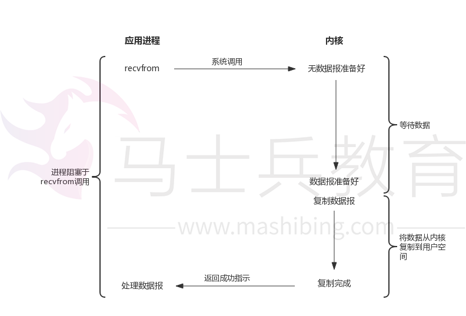

- 非阻塞I/O模型：linux下，可以通过设置socket使其变为non-blocking。当对一个non-blocking socket执行读操作时，流程是这个样子：

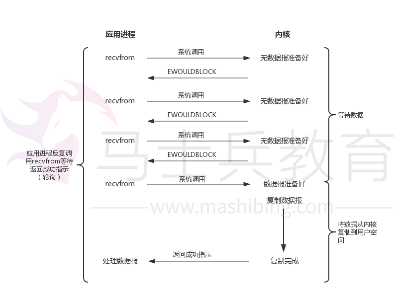

- I/O复用模型：我们可以调用`select`或`poll`，阻塞在这两个系统调用中的某一个之上，而不是真正的IO系统调用上：

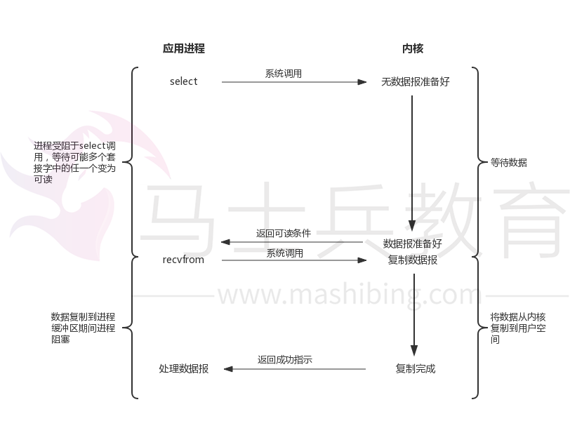

- 信号驱动式I/O模型：我们可以用信号，让内核在描述符就绪时发送SIGIO信号通知我们：

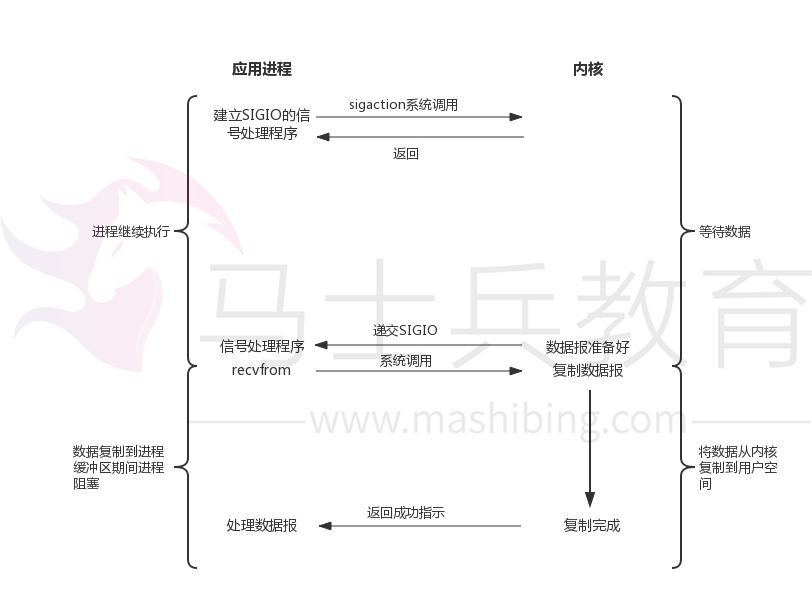

- 异步I/O模型：用户进程发起read操作之后，立刻就可以开始去做其它的事。而另一方面，从内核的角度，当它受到一个asynchronousread之后，首先它会立刻返回，所以不会对用户进程产生任何block。然后，内核会等待数据准备完成，然后将数据拷贝到用户内存，当这一切都完成之后，内核会给用户进程发送一个signal，告诉它read操作完成了：

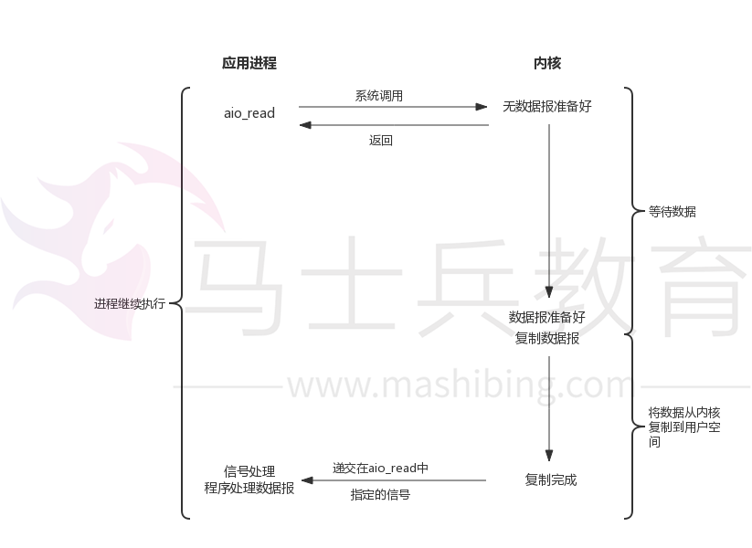

*以上参考自：《UNIX网络编程》*

从前面 I/O 模型的分类中，我们可以看出 AIO 的动机。阻塞模型需要在 I/O 操作开始时阻塞应用程序。这意味着不可能同时重叠进行处理和 I/O 操作。非阻塞模型允许处理和 I/O 操作重叠进行，但是这需要应用程序来检查 I/O 操作的状态。对于异步I/O ，它允许处理和 I/O 操作重叠进行，包括 I/O 操作完成的通知。除了需要阻塞之外，select 函数所提供的功能（异步阻塞 I/O）与 AIO 类似。不过，它是对通知事件进行阻塞，而不是对 I/O 调用进行阻塞。

参考下知乎上的回答：

> - **同步与异步：**同步和异步关注的是消息通信机制 (synchronous communication/ asynchronous communication)。所谓同步，就是在发出一个**调用**时，在没有得到结果之前，该**调用**就不返回。但是一旦调用返回，就得到返回值了。换句话说，就是由**调用者**主动等待这个**调用**的结果；
> - **阻塞与非阻塞：**阻塞和非阻塞关注的是程序在等待调用结果（消息，返回值）时的状态。阻塞调用是指调用结果返回之前，当前线程会被挂起。调用线程只有在得到结果之后才会返回；而非阻塞调用指在不能立刻得到结果之前，该调用不会阻塞当前线程。
>

## 两种IO多路复用方案：Reactor和Proactor

一般地，I/O多路复用机制都依赖于一个**事件多路分离器(Event Demultiplexer)**。分离器对象可将来自事件源的I/O事件分离出来，并分发到对应的read/write**事件处理器(Event Handler)**。开发人员预先注册需要处理的事件及其事件处理器（或回调函数）；事件分离器负责将请求事件传递给事件处理器。

两个与事件分离器有关的模式是Reactor和Proactor。Reactor模式采用同步I/O，而Proactor采用异步I/O。在Reactor中，事件分离器负责等待文件描述符或socket为读写操作准备就绪，然后将就绪事件传递给对应的处理器，最后由处理器负责完成实际的读写工作。

而在Proactor模式中，处理器或者兼任处理器的事件分离器，只负责发起异步读写操作。I/O操作本身由操作系统来完成。传递给操作系统的参数需要包括用户定义的数据缓冲区地址和数据大小，操作系统才能从中得到写出操作所需数据，或写入从socket读到的数据。事件分离器捕获I/O操作完成事件，然后将事件传递给对应处理器。比如，在windows上，处理器发起一个异步I/O操作，再由事件分离器等待IOCompletion事件。典型的异步模式实现，都建立在操作系统支持异步API的基础之上，我们将这种实现称为“系统级”异步或“真”异步，因为应用程序完全依赖操作系统执行真正的I/O工作。

举个例子，将有助于理解Reactor与Proactor二者的差异，以读操作为例（写操作类似）。

在Reactor中实现读：

- 注册读就绪事件和相应的事件处理器；
- 事件分离器等待事件；
- 事件到来，激活分离器，分离器调用事件对应的处理器；
- 事件处理器完成实际的读操作，处理读到的数据，注册新的事件，然后返还控制权。

在Proactor中实现读：

- 处理器发起异步读操作（注意：操作系统必须支持异步I/O）。在这种情况下，处理器无视I/O就绪事件，它关注的是完成事件；
- 事件分离器等待操作完成事件;
- 在分离器等待过程中，操作系统利用并行的内核线程执行实际的读操作，并将结果数据存入用户自定义缓冲区，最后通知事件分离器读操作完成；
- 事件分离器呼唤处理器；
- 事件处理器处理用户自定义缓冲区中的数据，然后启动一个新的异步操作，并将控制权返回事件分离器。

可以看出，两个模式的相同点，都是对某个I/O事件的事件通知（即告诉某个模块，这个I/O操作可以进行或已经完成）。在结构上，两者的相同点和不同点如下：

- 相同点：demultiplexor负责提交I/O操作（异步）、查询设备是否可操作（同步），然后当条件满足时，就回调handler；
- 不同点：异步情况下（Proactor），当回调handler时，表示I/O操作已经完成；同步情况下（Reactor），回调handler时，表示I/O设备可以进行某个操作（can read or can write）。

## 传统BIO模型

BIO是同步阻塞式IO，通常在while循环中服务端会调用accept方法等待接收客户端的连接请求，一旦接收到一个连接请求，就可以建立通信套接字在这个通信套接字上进行读写操作，此时不能再接收其他客户端连接请求，只能等待同当前连接的客户端的操作执行完成。

如果BIO要能够同时处理多个客户端请求，就必须使用多线程，即每次accept阻塞等待来自客户端请求，一旦受到连接请求就建立通信套接字同时开启一个新的线程来处理这个套接字的数据读写请求，然后立刻又继续accept等待其他客户端连接请求，即为每一个客户端连接请求都创建一个线程来单独处理。

我们看下传统的BIO方式下的编程模型大致如下：

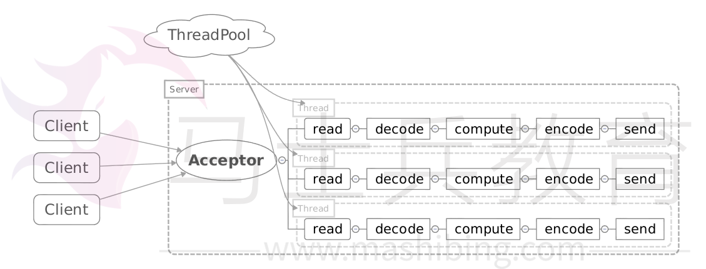

```
public class BIODemo {

    public static void main(String[] args) throws IOException {

        ExecutorService executor = Executors.newFixedThreadPool(128);

        ServerSocket serverSocket = new ServerSocket();
        serverSocket.bind(new InetSocketAddress(1234));
        // 循环等待新连接
        while (true) {
            Socket socket = serverSocket.accept();
            // 为新的连接创建线程执行任务
            executor.submit(new ConnectionTask(socket));
        }
    }

}

class ConnectionTask extends Thread {
    private Socket socket;

    public ConnectionTask(Socket socket) {
        this.socket = socket;
    }

    public void run() {
        while (true) {
            InputStream inputStream = null;
            OutputStream outputStream = null;
            try {
                inputStream = socket.getInputStream();
                
                // read from socket...
                
                inputStream.read();
                
                outputStream = socket.getOutputStream();

                // write to socket...

                outputStream.write();

            } catch (IOException e) {
                e.printStackTrace();
            } finally {
                // 关闭资源...

            }

        }
    }
}
```

这里之所以使用多线程，是因为socket.accept()、inputStream.read()、outputStream.write()都是同步阻塞的，当一个连接在处理I/O的时候，系统是阻塞的，如果是单线程的话在阻塞的期间不能接受任何请求。所以，使用多线程，就可以让CPU去处理更多的事情。其实这也是所有使用多线程的本质：

- 利用多核。
- 当I/O阻塞系统，但CPU空闲的时候，可以利用多线程使用CPU资源。

使用线程池能够让线程的创建和回收成本相对较低。在活动连接数不是特别高（小于单机1000）的情况下，这种模型是比较不错的，可以让每一个连接专注于自己的I/O并且编程模型简单，也不用过多考虑系统的过载、限流等问题。线程池可以缓冲一些过多的连接或请求。

但这个模型最本质的问题在于，严重依赖于线程。但线程是很”贵”的资源，主要表现在：

1. 线程的创建和销毁成本很高，在Linux这样的操作系统中，线程本质上就是一个进程。创建和销毁都是重量级的系统函数；
2. 线程本身占用较大内存，像Java的线程栈，一般至少分配512K～1M的空间，如果系统中的线程数过千，恐怕整个JVM的内存都会被吃掉一半；
3. 线程的切换成本是很高的。操作系统发生线程切换的时候，需要保留线程的上下文，然后执行系统调用。如果线程数过高，可能执行线程切换的时间甚至会大于线程执行的时间，这时候带来的表现往往是系统load偏高、CPU sy使用率特别高（超过20%以上)，导致系统几乎陷入不可用的状态；
4. 容易造成锯齿状的系统负载。因为系统负载是用活动线程数或CPU核心数，一旦线程数量高但外部网络环境不是很稳定，就很容易造成大量请求的结果同时返回，激活大量阻塞线程从而使系统负载压力过大。

所以，当面对十万甚至百万级连接的时候，传统的BIO模型是无能为力的。随着移动端应用的兴起和各种网络游戏的盛行，百万级长连接日趋普遍，此时，必然需要一种更高效的I/O处理模型。

## NIO的实现原理

NIO本身是基于事件驱动思想来完成的，其主要想解决的是BIO的大并发问题，即在使用同步I/O的网络应用中，如果要同时处理多个客户端请求，或是在客户端要同时和多个服务器进行通讯，就必须使用多线程来处理。也就是说，将每一个客户端请求分配给一个线程来单独处理。这样做虽然可以达到我们的要求，但同时又会带来另外一个问题。由于每创建一个线程，就要为这个线程分配一定的内存空间（也叫工作存储器），而且操作系统本身也对线程的总数有一定的限制。如果客户端的请求过多，服务端程序可能会因为不堪重负而拒绝客户端的请求，甚至服务器可能会因此而瘫痪。

NIO基于Reactor，当socket有流可读或可写入socket时，操作系统会相应的通知应用程序进行处理，应用再将流读取到缓冲区或写入操作系统。

也就是说，这个时候，已经不是一个连接就要对应一个处理线程了，而是有效的请求，对应一个线程，当连接没有数据时，是没有工作线程来处理的。

下面看下代码的实现：

NIO服务端代码（新建连接）：

```
//获取一个ServerSocket通道
ServerSocketChannel serverChannel = ServerSocketChannel.open();
serverChannel.configureBlocking(false);
serverChannel.socket().bind(new InetSocketAddress(port));
//获取通道管理器
selector = Selector.open();
//将通道管理器与通道绑定，并为该通道注册SelectionKey.OP_ACCEPT事件，
serverChannel.register(selector, SelectionKey.OP_ACCEPT);
```

NIO服务端代码（监听）：

```
while(true){
    //当有注册的事件到达时，方法返回，否则阻塞。
   selector.select();
   for(SelectionKey key : selector.selectedKeys()){
       if(key.isAcceptable()){
           ServerSocketChannel server =
                (ServerSocketChannel)key.channel();
           SocketChannel channel = server.accept();
           channel.write(ByteBuffer.wrap(
            new String("send message to client").getBytes()));
           //在与客户端连接成功后，为客户端通道注册SelectionKey.OP_READ事件。
           channel.register(selector, SelectionKey.OP_READ);
       }else if(key.isReadable()){//有可读数据事件
           SocketChannel channel = (SocketChannel)key.channel();
           ByteBuffer buffer = ByteBuffer.allocate(10);
           int read = channel.read(buffer);
           byte[] data = buffer.array();
           String message = new String(data);
           System.out.println("receive message from client, size:"
               + buffer.position() + " msg: " + message);
       }
   }
}
```

NIO模型示例如下：

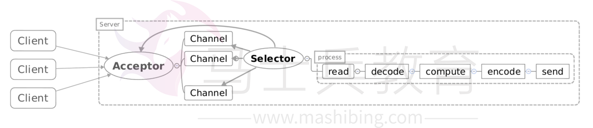

- Acceptor注册Selector，监听accept事件；
- 当客户端连接后，触发accept事件；
- 服务器构建对应的Channel，并在其上注册Selector，监听读写事件；
- 当发生读写事件后，进行相应的读写处理。

## Reactor模型

有关Reactor模型结构，可以参考Doug Lea在 Scalable IO in Java中的介绍。这里简单介绍一下Reactor模式的典型实现：

### Reactor单线程模型

这是最简单的单Reactor单线程模型。Reactor线程负责多路分离套接字、accept新连接，并分派请求到处理器链中。该模型适用于处理器链中业务处理组件能快速完成的场景。不过，这种单线程模型不能充分利用多核资源，所以实际使用的不多。

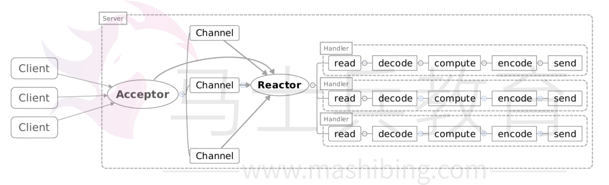

这个模型和上面的NIO流程很类似，只是将消息相关处理独立到了Handler中去了。

代码实现如下：

```
public class Reactor implements Runnable {

    final Selector selector;

    final ServerSocketChannel serverSocketChannel;

    public static void main(String[] args) throws IOException {
        new Thread(new Reactor(1234)).start();
    }

    public Reactor(int port) throws IOException {
        selector = Selector.open();
        serverSocketChannel = ServerSocketChannel.open();
        serverSocketChannel.socket().bind(new InetSocketAddress(port));
        serverSocketChannel.configureBlocking(false);
        SelectionKey key = serverSocketChannel.register(selector, SelectionKey.OP_ACCEPT);
        key.attach(new Acceptor());
    }

    @Override
    public void run() {
        while (!Thread.interrupted()) {
            try {
                selector.select();
                Set<SelectionKey> selectionKeys = selector.selectedKeys();
                for (SelectionKey selectionKey : selectionKeys) {
                    dispatch(selectionKey);
                }
                selectionKeys.clear();
            } catch (IOException e) {
                e.printStackTrace();
            }
        }

    }

    private void dispatch(SelectionKey selectionKey) {
        Runnable run = (Runnable) selectionKey.attachment();
        if (run != null) {
            run.run();
        }
    }

    class Acceptor implements Runnable {

        @Override
        public void run() {
            try {
                SocketChannel channel = serverSocketChannel.accept();
                if (channel != null) {
                    new Handler(selector, channel);
                }
            } catch (IOException e) {
                e.printStackTrace();
            }

        }

    }


}

class Handler implements Runnable {

    private final static int DEFAULT_SIZE = 1024;

    private final SocketChannel socketChannel;

    private final SelectionKey seletionKey;

    private static final int READING = 0;

    private static final int SENDING = 1;

    private int state = READING;

    ByteBuffer inputBuffer = ByteBuffer.allocate(DEFAULT_SIZE);

    ByteBuffer outputBuffer = ByteBuffer.allocate(DEFAULT_SIZE);

    public Handler(Selector selector, SocketChannel channel) throws IOException {
        this.socketChannel = channel;
        socketChannel.configureBlocking(false);
        this.seletionKey = socketChannel.register(selector, 0);
        seletionKey.attach(this);
        seletionKey.interestOps(SelectionKey.OP_READ);
        selector.wakeup();
    }

    @Override
    public void run() {
        if (state == READING) {
            read();
        } else if (state == SENDING) {
            write();
        }

    }

    class Sender implements Runnable {

        @Override
        public void run() {
            try {
                socketChannel.write(outputBuffer);
            } catch (IOException e) {
                e.printStackTrace();
            }
            if (outIsComplete()) {
                seletionKey.cancel();
            }
        }

    }

    private void write() {
        try {
            socketChannel.write(outputBuffer);
        } catch (IOException e) {
            e.printStackTrace();
        }
        while (outIsComplete()) {
            seletionKey.cancel();
        }

    }

    private void read() {
        try {
            socketChannel.read(inputBuffer);
            if (inputIsComplete()) {
                process();
                System.out.println("接收到来自客户端（" + socketChannel.socket().getInetAddress().getHostAddress()
                        + "）的消息：" + new String(inputBuffer.array()));
                seletionKey.attach(new Sender());
                seletionKey.interestOps(SelectionKey.OP_WRITE);
                seletionKey.selector().wakeup();
            }
        } catch (IOException e) {
            e.printStackTrace();
        }


    }

    public boolean inputIsComplete() {
        return true;
    }

    public boolean outIsComplete() {
        return true;

    }

    public void process() {
        // do something...
    }

}
```

虽然上面说到NIO一个线程就可以支持所有的IO处理。但是瓶颈也是显而易见的。我们看一个客户端的情况，如果这个客户端多次进行请求，如果在Handler中的处理速度较慢，那么后续的客户端请求都会被积压，导致响应变慢！所以引入了Reactor多线程模型。

### Reactor多线程模型

相比上一种模型，该模型在处理器链部分采用了多线程（线程池）：

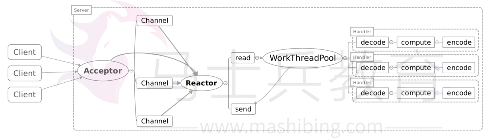

Reactor多线程模型就是将Handler中的IO操作和非IO操作分开，操作IO的线程称为IO线程，非IO操作的线程称为工作线程。这样的话，客户端的请求会直接被丢到线程池中，客户端发送请求就不会堵塞。

可以将Handler做如下修改：

```
class Handler implements Runnable {

    private final static int DEFAULT_SIZE = 1024;

    private final SocketChannel socketChannel;

    private final SelectionKey seletionKey;

    private static final int READING = 0;

    private static final int SENDING = 1;

    private int state = READING;

    ByteBuffer inputBuffer = ByteBuffer.allocate(DEFAULT_SIZE);

    ByteBuffer outputBuffer = ByteBuffer.allocate(DEFAULT_SIZE);
    
    private Selector selector;

    private static ExecutorService executorService = Executors.newFixedThreadPool(Runtime.getRuntime()
            .availableProcessors());
    private static final int PROCESSING = 3;

    public Handler(Selector selector, SocketChannel channel) throws IOException {
        this.selector = selector;
        this.socketChannel = channel;
        socketChannel.configureBlocking(false);
        this.seletionKey = socketChannel.register(selector, 0);
        seletionKey.attach(this);
        seletionKey.interestOps(SelectionKey.OP_READ);
        selector.wakeup();
    }

    @Override
    public void run() {
        if (state == READING) {
            read();
        } else if (state == SENDING) {
            write();
        }

    }

    class Sender implements Runnable {

        @Override
        public void run() {
            try {
                socketChannel.write(outputBuffer);
            } catch (IOException e) {
                e.printStackTrace();
            }
            if (outIsComplete()) {
                seletionKey.cancel();
            }
        }

    }

    private void write() {
        try {
            socketChannel.write(outputBuffer);
        } catch (IOException e) {
            e.printStackTrace();
        }
        if (outIsComplete()) {
            seletionKey.cancel();
        }

    }

    private void read() {
        try {
            socketChannel.read(inputBuffer);
            if (inputIsComplete()) {
                process();
                executorService.execute(new Processer());
            }
        } catch (IOException e) {
            e.printStackTrace();
        }


    }

    public boolean inputIsComplete() {
        return true;
    }

    public boolean outIsComplete() {
        return true;

    }

    public void process() {

    }

    synchronized void processAndHandOff() {
        process();
        state = SENDING; // or rebind attachment
        seletionKey.interestOps(SelectionKey.OP_WRITE);
        selector.wakeup();
    }
    class Processer implements Runnable {
        public void run() {
            processAndHandOff();
        }
    }

}
```

但是当用户进一步增加的时候，Reactor会出现瓶颈！因为Reactor既要处理IO操作请求，又要响应连接请求。为了分担Reactor的负担，所以引入了主从Reactor模型。

### 主从Reactor多线程模型

主从Reactor多线程模型是将Reactor分成两部分，mainReactor负责监听server socket，accept新连接，并将建立的socket分派给subReactor。subReactor负责多路分离已连接的socket，读写网络数据，对业务处理功能，其扔给worker线程池完成。通常，subReactor个数上可与CPU个数等同：

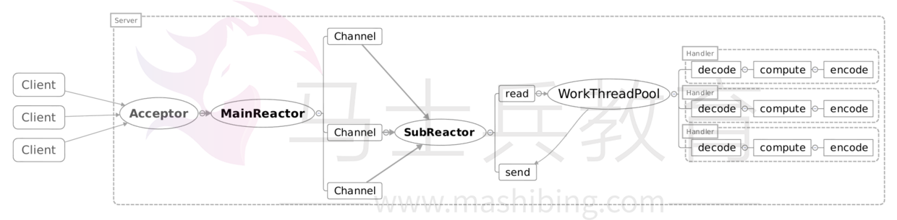

这时可以把Reactor做如下修改：

```
public class Reactor {


    final ServerSocketChannel serverSocketChannel;

    Selector[] selectors; // also create threads
    AtomicInteger next = new AtomicInteger(0);
    ExecutorService sunReactors = Executors.newFixedThreadPool(Runtime.getRuntime().availableProcessors());

    public static void main(String[] args) throws IOException {
        new Reactor(1234);
    }

    public Reactor(int port) throws IOException {
        serverSocketChannel = ServerSocketChannel.open();
        serverSocketChannel.socket().bind(new InetSocketAddress(port));
        serverSocketChannel.configureBlocking(false);
        selectors = new Selector[4];
        for (int i = 0; i < 4; i++) {
            Selector selector = Selector.open();
            selectors[i] = selector;
            SelectionKey key = serverSocketChannel.register(selector, SelectionKey.OP_ACCEPT);
            key.attach(new Acceptor());
            new Thread(() -> {
                while (!Thread.interrupted()) {
                    try {
                        selector.select();
                        Set<SelectionKey> selectionKeys = selector.selectedKeys();
                        for (SelectionKey selectionKey : selectionKeys) {
                            dispatch(selectionKey);
                        }
                        selectionKeys.clear();
                    } catch (IOException e) {
                        e.printStackTrace();
                    }
                }
            }).start();
        }

    }


    private void dispatch(SelectionKey selectionKey) {
        Runnable run = (Runnable) selectionKey.attachment();
        if (run != null) {
            run.run();
        }
    }

    class Acceptor implements Runnable {

        @Override
        public void run() {
            try {
                SocketChannel connection = serverSocketChannel.accept();
                if (connection != null)
                    sunReactors.execute(new Handler(selectors[next.getAndIncrement() % selectors.length], connection));
            } catch (IOException e) {
                e.printStackTrace();
            }

        }

    }


}
```

可见，主Reactor用于响应连接请求，从Reactor用于处理IO操作请求。

## AIO

与NIO不同，当进行读写操作时，只须直接调用API的read或write方法即可。这两种方法均为异步的，对于读操作而言，当有流可读取时，操作系统会将可读的流传入read方法的缓冲区，并通知应用程序；对于写操作而言，当操作系统将write方法传递的流写入完毕时，操作系统主动通知应用程序。
即可以理解为，read/write方法都是异步的，完成后会主动调用回调函数。
在JDK1.7中，这部分内容被称作NIO.2，主要在java.nio.channels包下增加了下面四个异步通道：

- AsynchronousSocketChannel
- AsynchronousServerSocketChannel
- AsynchronousFileChannel
- AsynchronousDatagramChannel

我们看一下AsynchronousSocketChannel中的几个方法：

```
public abstract class AsynchronousSocketChannel
    implements AsynchronousByteChannel, NetworkChannel
{
    public abstract Future<Integer> read(ByteBuffer dst);
    
    public abstract <A> void read(ByteBuffer[] dsts,
                                  int offset,
                                  int length,
                                  long timeout,
                                  TimeUnit unit,
                                  A attachment,
                                  CompletionHandler<Long,? super A> handler);

    public abstract <A> void write(ByteBuffer src,
                                   long timeout,
                                   TimeUnit unit,
                                   A attachment,
                                   CompletionHandler<Integer,? super A> handler);

    public final <A> void write(ByteBuffer src,
                                A attachment,
                                CompletionHandler<Integer,? super A> handler)

    {
        write(src, 0L, TimeUnit.MILLISECONDS, attachment, handler);
    }

    public abstract Future<Integer> write(ByteBuffer src);

    public abstract <A> void write(ByteBuffer[] srcs,
                                   int offset,
                                   int length,
                                   long timeout,
                                   TimeUnit unit,
                                   A attachment,
                                   CompletionHandler<Long,? super A> handler);
}
```

其中的read/write方法，有的会返回一个`Future`对象，有的需要传入一个`CompletionHandler`对象，该对象的作用是当执行完读取/写入操作后，直接该对象当中的方法进行回调。

对于`AsynchronousSocketChannel`而言，在windows和linux上的实现类是不一样的。

在windows上，AIO的实现是通过IOCP来完成的，实现类是：

```
WindowsAsynchronousSocketChannelImpl
```

实现的接口是：

```
Iocp.OverlappedChannel
```

而在linux上，实现类是：

```
UnixAsynchronousSocketChannelImpl
```

实现的接口是：

```
Port.PollableChannel
```

AIO是一种接口标准，各家操作系统可以实现也可以不实现。在不同操作系统上在高并发情况下最好都采用操作系统推荐的方式。Linux上还没有真正实现网络方式的AIO。

## select和epoll的区别

当需要读两个以上的I/O的时候，如果使用阻塞式的I/O，那么可能长时间的阻塞在一个描述符上面，另外的描述符虽然有数据但是不能读出来，这样实时性不能满足要求，大概的解决方案有以下几种：

1. 使用多进程或者多线程，但是这种方法会造成程序的复杂，而且对与进程与线程的创建维护也需要很多的开销（Apache服务器是用的子进程的方式，优点可以隔离用户）；
2. 用一个进程，但是使用非阻塞的I/O读取数据，当一个I/O不可读的时候立刻返回，检查下一个是否可读，这种形式的循环为轮询（polling），这种方法比较浪费CPU时间，因为大多数时间是不可读，但是仍花费时间不断反复执行read系统调用；
3. 异步I/O，当一个描述符准备好的时候用一个信号告诉进程，但是由于信号个数有限，多个描述符时不适用；
4. 一种较好的方式为I/O多路复用，先构造一张有关描述符的列表（epoll中为队列），然后调用一个函数，直到这些描述符中的一个准备好时才返回，返回时告诉进程哪些I/O就绪。select和epoll这两个机制都是多路I/O机制的解决方案，select为POSIX标准中的，而epoll为Linux所特有的。

它们的区别主要有三点：

1. select的句柄数目受限，在linux/posix_types.h头文件有这样的声明：`#define __FD_SETSIZE 1024`表示select最多同时监听1024个fd。而epoll没有，它的限制是最大的打开文件句柄数目；
2. epoll的最大好处是不会随着FD的数目增长而降低效率，在selec中采用轮询处理，其中的数据结构类似一个数组的数据结构，而epoll是维护一个队列，直接看队列是不是空就可以了。epoll只会对”活跃”的socket进行操作—这是因为在内核实现中epoll是根据每个fd上面的callback函数实现的。那么，只有”活跃”的socket才会主动的去调用 callback函数（把这个句柄加入队列），其他idle状态句柄则不会，在这点上，epoll实现了一个”伪”AIO。但是如果绝大部分的I/O都是“活跃的”，每个I/O端口使用率很高的话，epoll效率不一定比select高（可能是要维护队列复杂）；
3. 使用mmap加速内核与用户空间的消息传递。无论是select,poll还是epoll都需要内核把FD消息通知给用户空间，如何避免不必要的内存拷贝就很重要，在这点上，epoll是通过内核于用户空间mmap同一块内存实现的。

## NIO与epoll

上文说到了select与epoll的区别，再总结一下Java NIO与select和epoll：

- Linux2.6之后支持epoll
- windows支持select而不支持epoll
- 不同系统下nio的实现是不一样的，包括Sunos linux 和windows
- select的复杂度为O(N)
- select有最大fd限制，默认为1024
- 修改sys/select.h可以改变select的fd数量限制
- epoll的事件模型，无fd数量限制，复杂度O(1),不需要遍历fd

以下代码基于Java 8。

下面看下在NIO中Selector的open方法：

```
public static Selector open() throws IOException {
    return SelectorProvider.provider().openSelector();
}
```

这里使用了SelectorProvider去创建一个Selector，看下provider方法的实现：

```
public static SelectorProvider provider() {
    synchronized (lock) {
        if (provider != null)
            return provider;
        return AccessController.doPrivileged(
            new PrivilegedAction<SelectorProvider>() {
                public SelectorProvider run() {
                        if (loadProviderFromProperty())
                            return provider;
                        if (loadProviderAsService())
                            return provider;
                        provider = sun.nio.ch.DefaultSelectorProvider.create();
                        return provider;
                    }
                });
    }
}
```

看下`sun.nio.ch.DefaultSelectorProvider.create()`方法，该方法在不同的操作系统中的代码是不同的，在windows中的实现如下：

```
public static SelectorProvider create() {
    return new WindowsSelectorProvider();
}
```

在Mac OS中的实现如下：

```
public static SelectorProvider create() {
    return new KQueueSelectorProvider();
}
```

在linux中的实现如下：

```
public static SelectorProvider create() {
    String str = (String)AccessController.doPrivileged(new GetPropertyAction("os.name"));
    
    if (str.equals("SunOS"))
        return createProvider("sun.nio.ch.DevPollSelectorProvider");
    if (str.equals("Linux"))
        return createProvider("sun.nio.ch.EPollSelectorProvider");
    return new PollSelectorProvider();
}
```

我们看到create方法中是通过区分操作系统来返回不同的Provider的。其中SunOs就是Solaris返回的是DevPollSelectorProvider，对于Linux，返回的Provder是EPollSelectorProvider，其余操作系统，返回的是PollSelectorProvider。

## Zero Copy

许多web应用都会向用户提供大量的静态内容，这意味着有很多数据从硬盘读出之后，会原封不动的通过socket传输给用户。

这种操作看起来可能不会怎么消耗CPU，但是实际上它是低效的：

1. kernel把从disk读数据；
2. 将数据传输给application；
3. application再次把同样的内容再传回给处于kernel级的socket。

这种场景下，application实际上只是作为一种低效的中间介质，用来把磁盘文件的数据传给socket。

数据每次传输都会经过user和kernel空间都会被copy，这会消耗cpu，并且占用RAM的带宽。

### 传统的数据传输方式

像这种从文件读取数据然后将数据通过网络传输给其他的程序的方式其核心操作就是如下两个调用：

```
File.read(fileDesc,buf,len);
Socket.send(socket,buf,len);
```

其上操作看上去只有两个简单的调用，但是其内部过程却要经历四次用户态和内核态的切换以及四次的数据复制操作：

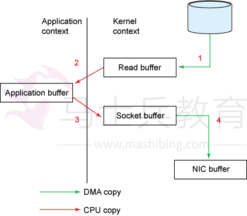

上图展示了数据从文件到socket的内部流程。

下面看下用户态和内核态的切换过程：

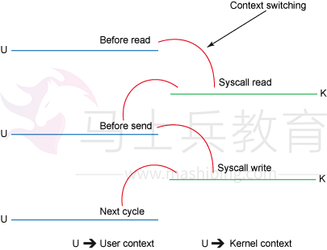


步骤如下：

1. read()的调用引起了从用户态到内核态的切换（看图二），内部是通过sys_read()（或者类似的方法）发起对文件数据的读取。数据的第一次复制是通过DMA（直接内存访问）将磁盘上的数据复制到内核空间的缓冲区中；
2. 数据从内核空间的缓冲区复制到用户空间的缓冲区后，read()方法也就返回了。此时内核态又切换回用户态，现在数据也已经复制到了用户地址空间的缓存中；
3. socket的send()方法的调用又会引起用户态到内核的切换，第三次数据复制又将数据从用户空间缓冲区复制到了内核空间的缓冲区，这次数据被放在了不同于之前的内核缓冲区中，这个缓冲区与数据将要被传输到的socket关联；
4. send()系统调用返回后，就产生了第四次用户态和内核态的切换。随着DMA单独异步的将数据从内核态的缓冲区中传输到协议引擎发送到网络上，有了第四次数据复制。

### Zero Copy的数据传输方式

`java.nio.channels.FileChannel`中定义了两个方法：transferTo( )和 transferFrom( )。

transferTo( )和 transferFrom( )方法允许将一个通道交叉连接到另一个通道，而不需要通过一个中间缓冲区来传递数据。只有 FileChannel 类有这两个方法，因此 **channel-to-channel** 传输中通道之一必须是 FileChannel。您不能在 socket 通道之间直接传输数据，不过 socket 通道实现 `WritableByteChannel` 和 `ReadableByteChannel` 接口，因此文件的内容可以用 `transferTo( )` 方法传输给一个 socket 通道，或者也可以用 transferFrom( )方法将数据从一个 socket 通道直接读取到一个文件中。

下面根据`transferTo()` 方法来说明。

根据上文可知，`transferTo()` 方法可以把bytes直接从调用它的channel传输到另一个WritableByteChannel，中间不经过应用程序。

下面看下该方法的定义：

```
public abstract long transferTo(long position, long count,
                                    WritableByteChannel target)
        throws IOException;
```

下图展示了通过transferTo实现数据传输的路径：

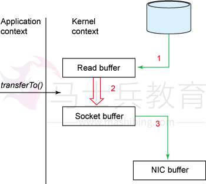

下图展示了内核态、用户态的切换情况：

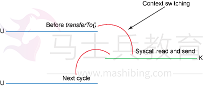

使用transferTo()方式所经历的步骤：

1. transferTo调用会引起DMA将文件内容复制到读缓冲区(内核空间的缓冲区)，然后数据从这个缓冲区复制到另一个与socket输出相关的内核缓冲区中；
2. 第三次数据复制就是DMA把socket关联的缓冲区中的数据复制到协议引擎上发送到网络上。

这次改善，我们是通过将内核、用户态切换的次数从四次减少到两次，将数据的复制次数从四次减少到三次(只有一次用到cpu资源)。但这并没有达到我们零复制的目标。如果底层网络适配器支持收集操作的话，我们可以进一步减少内核对数据的复制次数。在内核为2.4或者以上版本的linux系统上，socket缓冲区描述符将被用来满足这个需求。这个方式不仅减少了内核用户态间的切换，而且也省去了那次需要cpu参与的复制过程。从用户角度来看依旧是调用transferTo()方法，但是其本质发生了变化：

1. 调用transferTo方法后数据被DMA从文件复制到了内核的一个缓冲区中；
2. 数据不再被复制到socket关联的缓冲区中了，仅仅是将一个描述符（包含了数据的位置和长度等信息）追加到socket关联的缓冲区中。DMA直接将内核中的缓冲区中的数据传输给协议引擎，消除了仅剩的一次需要cpu周期的数据复制。

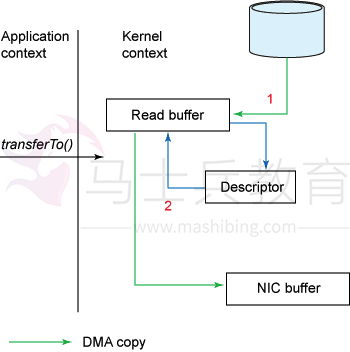

## NIO存在的问题

使用NIO != 高性能，当连接数<1000，并发程度不高或者局域网环境下NIO并没有显著的性能优势。

NIO并没有完全屏蔽平台差异，它仍然是基于各个操作系统的I/O系统实现的，差异仍然存在。使用NIO做网络编程构建事件驱动模型并不容易，陷阱重重。

推荐大家使用成熟的NIO框架，如Netty，MINA等。解决了很多NIO的陷阱，并屏蔽了操作系统的差异，有较好的性能和编程模型。

## 总结

最后总结一下NIO有哪些优势：

- 事件驱动模型
- 避免多线程
- 单线程处理多任务
- 非阻塞I/O，I/O读写不再阻塞
- 基于block的传输，通常比基于流的传输更高效
- 更高级的IO函数，Zero Copy
- I/O多路复用大大提高了Java网络应用的可伸缩性和实用性

