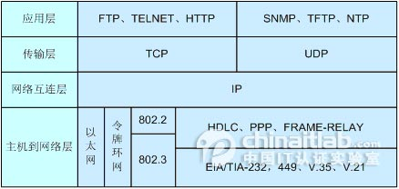
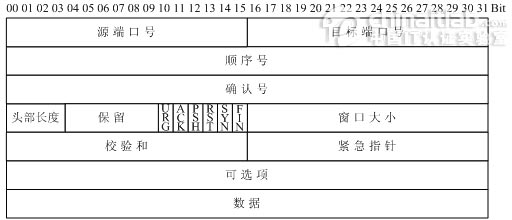
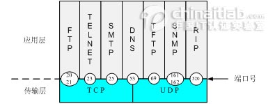

# OSI七层协议模型和TCP/IP四层模型比较

TCP/IP参考模型
　　
　　ISO制定的OSI参考模型的过于庞大、复杂招致了许多批评。与此对照，由技术人员自己开发的TCP/IP协议栈获得了更为广泛的应用。如图2-1所示，是TCP/IP参考模型和OSI参考模型的对比示意图。

图2-1　 TCP/IP参考模型

　　2.1　TCP/IP参考模型的层次结构
　　TCP/IP协议栈是美国国防部高级研究计划局计算机网（Advanced Research Projects Agency Network，ARPANET）和其后继因特网使用的参考模型。ARPANET是由美国国防部（U.S．Department of Defense，DoD）赞助的研究网络。最初，它只连接了美国境内的四所大学。随后的几年中，它通过租用的电话线连接了数百所大学和政府部门。最终ARPANET发展成为全球规模最大的互连网络-因特网。最初的ARPANET于1990年永久性地关闭。　　
　　TCP/IP参考模型分为四个层次：应用层、传输层、网络互连层和主机到网络层。如图2-2所示。

图2-2　 TCP/IP参考模型的层次结构

　　在TCP/IP参考模型中，去掉了OSI参考模型中的会话层和表示层（这两层的功能被合并到应用层实现）。同时将OSI参考模型中的数据链路层和物理层合并为主机到网络层。下面，分别介绍各层的主要功能。
　　
　　1、主机到网络层　　
　　实际上TCP/IP参考模型没有真正描述这一层的实现，只是要求能够提供给其上层-网络互连层一个访问接口，以便在其上传递IP分组。由于这一层次未被定义，所以其具体的实现方法将随着网络类型的不同而不同。　　
　　2、网络互连层　　
　　网络互连层是整个TCP/IP协议栈的核心。它的功能是把分组发往目标网络或主机。同时，为了尽快地发送分组，可能需要沿不同的路径同时进行分组传递。因此，分组到达的顺序和发送的顺序可能不同，这就需要上层必须对分组进行排序。　　
　　网络互连层定义了分组格式和协议，即IP协议（Internet Protocol）。　　
　　网络互连层除了需要完成路由的功能外，也可以完成将不同类型的网络（异构网）互连的任务。除此之外，网络互连层还需要完成拥塞控制的功能。　　
　　3、传输层　　
　　在TCP/IP模型中，传输层的功能是使源端主机和目标端主机上的对等实体可以进行会话。在传输层定义了两种服务质量不同的协议。即：传输控制协议TCP（transmission control protocol）和用户数据报协议UDP（user datagram protocol）。　　
　　TCP协议是一个面向连接的、可靠的协议。它将一台主机发出的字节流无差错地发往互联网上的其他主机。在发送端，它负责把上层传送下来的字节流分成报文段并传递给下层。在接收端，它负责把收到的报文进行重组后递交给上层。TCP协议还要处理端到端的流量控制，以避免缓慢接收的接收方没有足够的缓冲区接收发送方发送的大量数据。　　
　　UDP协议是一个不可靠的、无连接协议，主要适用于不需要对报文进行排序和流量控制的场合。　　
　　4、应用层　　
　　TCP/IP模型将OSI参考模型中的会话层和表示层的功能合并到应用层实现。　　
　　应用层面向不同的网络应用引入了不同的应用层协议。其中，有基于TCP协议的，如文件传输协议（File Transfer Protocol，FTP）、虚拟终端协议（TELNET）、超文本链接协议（Hyper Text Transfer Protocol，HTTP），也有基于UDP协议的。

　　2.2　TCP/IP报文格式　　
　　1、IP报文格式　　
　　IP协议是TCP/IP协议族中最为核心的协议。它提供不可靠、无连接的服务，也即依赖其他层的协议进行差错控制。在局域网环境，IP协议往往被封装在以太网帧中传送。而所有的TCP、UDP、ICMP、IGMP数据都被封装在IP数据报中传送。如图2-3所示：

图2-3　 TCP/IP报文封装

　　图2-4是IP头部（报头）格式：（RFC 791）。

图2-4　 IP头部格式
　　
　　其中：　　
　　●版本（Version）字段：占4比特。用来表明IP协议实现的版本号，当前一般为IPv4，即0100。　　
　　●报头长度（Internet Header Length，IHL）字段：占4比特。是头部占32比特的数字，包括可选项。普通IP数据报（没有任何选项），该字段的值是5，即160比特=20字节。此字段最大值为60字节。　　
　　●服务类型（Type of Service ，TOS）字段：占8比特。其中前3比特为优先权子字段（Precedence，现已被忽略）。第8比特保留未用。第4至第7比特分别代表延迟、吞吐量、可靠性和花费。当它们取值为1时分别代表要求最小时延、最大吞吐量、最高可靠性和最小费用。这4比特的服务类型中只能置其中1比特为1。可以全为0，若全为0则表示一般服务。服务类型字段声明了数据报被网络系统传输时可以被怎样处理。例如：TELNET协议可能要求有最小的延迟，FTP协议（数据）可能要求有最大吞吐量，SNMP协议可能要求有最高可靠性，NNTP（Network News Transfer Protocol，网络新闻传输协议）可能要求最小费用，而ICMP协议可能无特殊要求（4比特全为0）。实际上，大部分主机会忽略这个字段，但一些动态路由协议如OSPF（Open Shortest Path First Protocol）、IS-IS（Intermediate System to Intermediate System Protocol）可以根据这些字段的值进行路由决策。　　
　　●总长度字段：占16比特。指明整个数据报的长度（以字节为单位）。最大长度为65535字节。　　
　　●标志字段：占16比特。用来唯一地标识主机发送的每一份数据报。通常每发一份报文，它的值会加1。　　
　　●标志位字段：占3比特。标志一份数据报是否要求分段。　　
　　●段偏移字段：占13比特。如果一份数据报要求分段的话，此字段指明该段偏移距原始数据报开始的位置。　　
　　●生存期（TTL：Time to Live）字段：占8比特。用来设置数据报最多可以经过的路由器数。由发送数据的源主机设置，通常为32、64、128等。每经过一个路由器，其值减1，直到0时该数据报被丢弃。　　
　　●协议字段：占8比特。指明IP层所封装的上层协议类型，如ICMP（1）、IGMP（2） 、TCP（6）、UDP（17）等。　　
　　●头部校验和字段：占16比特。内容是根据IP头部计算得到的校验和码。计算方法是：对头部中每个16比特进行二进制反码求和。（和ICMP、IGMP、TCP、UDP不同，IP不对头部后的数据进行校验）。　　
　　●源IP地址、目标IP地址字段：各占32比特。用来标明发送IP数据报文的源主机地址和接收IP报文的目标主机地址。　　
　　可选项字段：占32比特。用来定义一些任选项：如记录路径、时间戳等。这些选项很少被使用，同时并不是所有主机和路由器都支持这些选项。可选项字段的长度必须是32比特的整数倍，如果不足，必须填充0以达到此长度要求。　
　
　　2、TCP数据段格式　　
　　TCP是一种可靠的、面向连接的字节流服务。源主机在传送数据前需要先和目标主机建立连接。然后，在此连接上，被编号的数据段按序收发。同时，要求对每个数据段进行确认，保证了可靠性。如果在指定的时间内没有收到目标主机对所发数据段的确认，源主机将再次发送该数据段。　　
　　如图2-5所示，是TCP头部结构（RFC 793、1323）。

图2-5　 TCP头部结构　　
　　●源、目标端口号字段：占16比特。TCP协议通过使用"端口"来标识源端和目标端的应用进程。端口号可以使用0到65535之间的任何数字。在收到服务请求时，操作系统动态地为客户端的应用程序分配端口号。在服务器端，每种服务在"众所周知的端口"（Well-Know Port）为用户提供服务。
　　●顺序号字段：占32比特。用来标识从TCP源端向TCP目标端发送的数据字节流，它表示在这个报文段中的第一个数据字节。　　
　　●确认号字段：占32比特。只有ACK标志为1时，确认号字段才有效。它包含目标端所期望收到源端的下一个数据字节。　　
　　●头部长度字段：占4比特。给出头部占32比特的数目。没有任何选项字段的TCP头部长度为20字节；最多可以有60字节的TCP头部。　　
　　●标志位字段（U、A、P、R、S、F）：占6比特。各比特的含义如下：　　
　　◆URG：紧急指针（urgent pointer）有效。　　
　　◆ACK：确认序号有效。　　
　　◆PSH：接收方应该尽快将这个报文段交给应用层。　　
　　◆RST：重建连接。　　
　　◆SYN：发起一个连接。　　
　　◆FIN：释放一个连接。　　
　　●窗口大小字段：占16比特。此字段用来进行流量控制。单位为字节数，这个值是本机期望一次接收的字节数。　　
　　●TCP校验和字段：占16比特。对整个TCP报文段，即TCP头部和TCP数据进行校验和计算，并由目标端进行验证。　　
　　●紧急指针字段：占16比特。它是一个偏移量，和序号字段中的值相加表示紧急数据最后一个字节的序号。　　
　　●选项字段：占32比特。可能包括"窗口扩大因子"、"时间戳"等选项。
　　
　　3、UDP数据段格式　　
　　UDP是一种不可靠的、无连接的数据报服务。源主机在传送数据前不需要和目标主机建立连接。数据被冠以源、目标端口号等UDP报头字段后直接发往目的主机。这时，每个数据段的可靠性依靠上层协议来保证。在传送数据较少、较小的情况下，UDP比TCP更加高效。　　
　　如图2-6所示，是UDP头部结构（RFC 793、1323）：

　　●源、目标端口号字段：占16比特。作用与TCP数据段中的端口号字段相同，用来标识源端和目标端的应用进程。　　
　　●长度字段：占16比特。标明UDP头部和UDP数据的总长度字节。　　
　　●校验和字段：占16比特。用来对UDP头部和UDP数据进行校验。和TCP不同的是，对UDP来说，此字段是可选项，而TCP数据段中的校验和字段是必须有的。　　

　　2.3　套接字　　
　　在每个TCP、UDP数据段中都包含源端口和目标端口字段。有时，我们把一个IP地址和一个端口号合称为一个套接字（Socket），而一个套接字对（Socket pair）可以唯一地确定互连网络中每个TCP连接的双方（客户IP地址、客户端口号、服务器IP地址、服务器端口号）。
　　
　　如图2-7所示，是常见的一些协议和它们对应的服务端口号。

图2-7　 常见协议和对应的端口号
　　
　　需要注意的是，不同的应用层协议可能基于不同的传输层协议，如FTP、TELNET、SMTP协议基于可靠的TCP协议。TFTP、SNMP、RIP基于不可靠的UDP协议。　　
　　同时，有些应用层协议占用了两个不同的端口号，如FTP的20、21端口，SNMP的161、162端口。这些应用层协议在不同的端口提供不同的功能。如FTP的21端口用来侦听用户的连接请求，而20端口用来传送用户的文件数据。再如，SNMP的161端口用于SNMP管理进程获取SNMP代理的数据，而162端口用于SNMP代理主动向SNMP管理进程发送数据。　　
　　还有一些协议使用了传输层的不同协议提供的服务。如DNS协议同时使用了TCP 53端口和UDP 53端口。DNS协议在UDP的53端口提供域名解析服务，在TCP的53端口提供DNS区域文件传输服务。

　　2.4　TCP连接建立、释放时的握手过程　　
　　1、TCP建立连接的三次握手过程　　
　　TCP会话通过三次握手来初始化。三次握手的目标是使数据段的发送和接收同步。同时也向其他主机表明其一次可接收的数据量（窗口大小），并建立逻辑连接。这三次握手的过程可以简述如下：　　
　　●源主机发送一个同步标志位（SYN）置1的TCP数据段。此段中同时标明初始序号（Initial Sequence Number，ISN）。ISN是一个随时间变化的随机值。　　
　　●目标主机发回确认数据段，此段中的同步标志位（SYN）同样被置1，且确认标志位（ACK）也置1，同时在确认序号字段表明目标主机期待收到源主机下一个数据段的序号（即表明前一个数据段已收到并且没有错误）。此外，此段中还包含目标主机的段初始序号。　　
　　●源主机再回送一个数据段，同样带有递增的发送序号和确认序号。　　
　　至此为止，TCP会话的三次握手完成。接下来，源主机和目标主机可以互相收发数据。整个过程可用图2-8表示。

　　2、TCP释放连接的四次握手过程