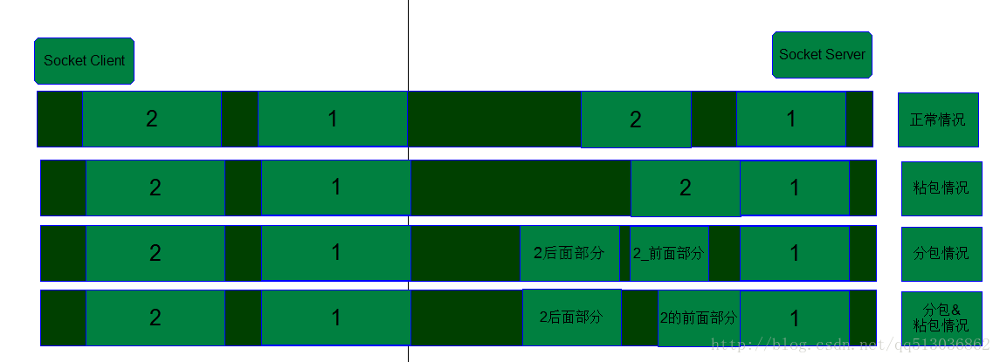

# Socket TCP/IP协议数据传输过程中的粘包和分包问题

一：通过图解法来描述一下分包和粘包，这样客户更清晰直观的了解：

下面对上面的图进行解释：
1.正常情况：如果Socket Client 发送的数据包，在Socket Server端也是一个一个完整接收的，那个就不会出现粘包和分包情况，数据正常读取。
2.粘包情况：Socket Client发送的数据包，在客户端发送和服务器接收的情况下都有可能发送，因为客户端发送的数据都是发送的一个缓冲buffer，然后由缓冲buffer最后刷到数据链路层的，那么就有可能把数据包2的一部分数据结合数据包1的全部被一起发送出去了，这样在服务器端就有可能出现这样的情况，导致读取的数据包包含了数据包2的一部分数据，这就产生粘包，当然也有可能把数据包1和数据包2全部读取出来。
3.分包情况：意思就是把数据包2或者数据包1都有可能被分开一部分发送出去，接着发另外的部分，在服务器端有可能一次读取操作只读到一个完整数据包的一部分。
4.在数据包发送的情况下，有可能后面的数据包分开成2个或者多个，但是最前面的部分包，黏住在前面的一个完整或者部分包的后面，也就是粘包和分包同时产生了。

二：产生上情况的内部原因有下面几点：
1.数据发送端发送数据给缓冲buffer太大，导致发送一个完整的数据包被分几次发送给缓存buffer，然而缓冲buffer等到数据满了以后会自动把数据发送的数据链路层去，这样就导致分包了。
2.TCP协议定义有一个选项叫做最大报文段长度（MSS，Maximum Segment Size），该选项用于在TCP连接建立时，收发双方协商通信时每一个报文段所能承载的最大数据长度。在一定程度上MSS应该能尽可能多地承载用户数据，用于在传输通路上又可能避免分片，但是在复杂的网络环境下确定这个长度值非常困难，那么在这样的情况下在传输过程中产生分包，粘包就很常见了
3.以太网，IP,TCP,UDP数据包分析
4.数据帧的有效载荷(payload)比以太网的最大传输单元（MTU）大的时候，进行了IP分片。

三：解决数据分包和粘包的基本策略如下
1.消息定长，比如定一个100，那么读取端每次读取数据就截取100个长度的数据，然后交给业务成去做解析
2.在消息的尾部加一些特殊字符，那么在读取数据的时候，只要读到这个特殊字符，就认为已经可以截取一个完整的数据包了，这种情况在一定的业务情况下实用。
3.读取缓存的数据是不定长的，所以我们把读取到的数据添加到我们自己的一个byte[]数组中，然后根据我们的业务逻辑来找到指定的特殊协议头部，协议长度，协议尾部，然后从我们的byte[]中获取一个完整的数据包，然后再对数据包进行业务解析就可以得到正确结果。