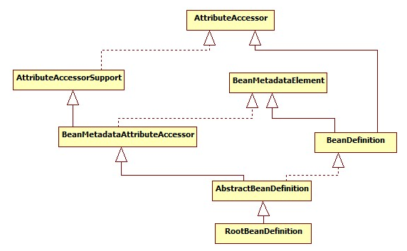
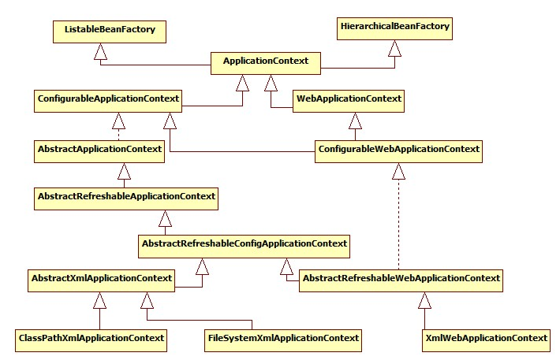
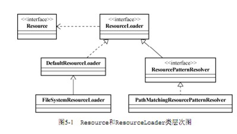
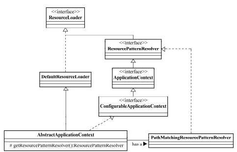
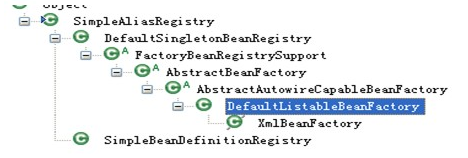
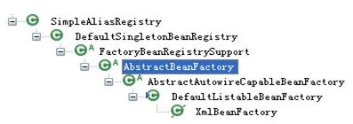

Spring IOC原理解读 面试必读


 

## 一、什么是Ioc/DI？

  IoC 容器：最主要是完成了完成对象的创建和依赖的管理注入等等。

先从我们自己设计这样一个视角来考虑：

所谓控制反转，就是把原先我们代码里面需要实现的对象创建、依赖的代码，反转给容器来帮忙实现。那么必然的我们需要创建一个容器，同时需要一种描述来让容器知道需要创建的对象与对象的关系。这个描述最具体表现就是我们可配置的文件。

对象和对象关系怎么表示？

可以用 xml ， properties 文件等语义化配置文件表示。

描述对象关系的文件存放在哪里？

可能是 classpath ， filesystem ，或者是 URL 网络资源， servletContext 等。

回到正题，有了配置文件，还需要对配置文件解析。

不同的配置文件对对象的描述不一样，如标准的，自定义声明式的，如何统一？ 在内部需要有一个统一的关于对象的定义，所有外部的描述都必须转化成统一的描述定义。

如何对不同的配置文件进行解析？需要对不同的配置文件语法，采用不同的解析器

 

## 二、 Spring IOC体系结构？

(1) BeanFactory

​     Spring Bean的创建是典型的工厂模式，这一系列的Bean工厂，也即IOC容器为开发者管理对象间的依赖关系提供了很多便利和基础服务，在Spring中有许多的IOC容器的实现供用户选择和使用，其相互关系如下：

 

其中BeanFactory作为最顶层的一个接口类，它定义了IOC容器的基本功能规范，BeanFactory 有三个子类：ListableBeanFactory、HierarchicalBeanFactory 和AutowireCapableBeanFactory。但是从上图中我们可以发现最终的默认实现类是 DefaultListableBeanFactory，他实现了所有的接口。那为何要定义这么多层次的接口呢？查阅这些接口的源码和说明发现，每个接口都有他使用的场合，它主要是为了区分在 Spring 内部在操作过程中对象的传递和转化过程中，对对象的数据访问所做的限制。例如 ListableBeanFactory 接口表示这些 Bean 是可列表的，而 HierarchicalBeanFactory 表示的是这些 Bean 是有继承关系的，也就是每个Bean 有可能有父 Bean。AutowireCapableBeanFactory 接口定义 Bean 的自动装配规则。这四个接口共同定义了 Bean 的集合、Bean 之间的关系、以及 Bean 行为.

最基本的IOC容器接口BeanFactory

  


```
1 public interface BeanFactory {    
2      
3      //对FactoryBean的转义定义，因为如果使用bean的名字检索FactoryBean得到的对象是工厂生成的对象，    
4      //如果需要得到工厂本身，需要转义           
5      String FACTORY_BEAN_PREFIX = "&"; 
6         
7      //根据bean的名字，获取在IOC容器中得到bean实例    
8      Object getBean(String name) throws BeansException;    
9    
10     //根据bean的名字和Class类型来得到bean实例，增加了类型安全验证机制。    
11      Object getBean(String name, Class requiredType) throws BeansException;    
12     
13     //提供对bean的检索，看看是否在IOC容器有这个名字的bean    
14      boolean containsBean(String name);    
15     
16     //根据bean名字得到bean实例，并同时判断这个bean是不是单例    
17     boolean isSingleton(String name) throws NoSuchBeanDefinitionException;    
18     
19     //得到bean实例的Class类型    
20     Class getType(String name) throws NoSuchBeanDefinitionException;    
21     
22     //得到bean的别名，如果根据别名检索，那么其原名也会被检索出来    
23    String[] getAliases(String name);    
24     
 }
```


  

  

  

在BeanFactory里只对IOC容器的基本行为作了定义，根本不关心你的bean是如何定义怎样加载的。正如我们只关心工厂里得到什么的产品对象，至于工厂是怎么生产这些对象的，这个基本的接口不关心。

  

​      而要知道工厂是如何产生对象的，我们需要看具体的IOC容器实现，spring提供了许多IOC容器的实现。比如XmlBeanFactory，ClasspathXmlApplicationContext等。其中XmlBeanFactory就是针对最基本的ioc容器的实现，这个IOC容器可以读取XML文件定义的BeanDefinition（XML文件中对bean的描述）,如果说XmlBeanFactory是容器中的屌丝，ApplicationContext应该算容器中的高帅富.

  

​      ApplicationContext是Spring提供的一个高级的IoC容器，它除了能够提供IoC容器的基本功能外，还为用户提供了以下的附加服务。

  

从ApplicationContext接口的实现，我们看出其特点：

  

​     \1. 支持信息源，可以实现国际化。（实现MessageSource接口）

  

​     \2. 访问资源。(实现ResourcePatternResolver接口，这个后面要讲)

  

​     \3. 支持应用事件。(实现ApplicationEventPublisher接口)

  

 

  

(2) BeanDefinition

  

​     SpringIOC容器管理了我们定义的各种Bean对象及其相互的关系，Bean对象在Spring实现中是以BeanDefinition来描述的，其继承体系如下：



 

Bean 的解析过程非常复杂，功能被分的很细，因为这里需要被扩展的地方很多，必须保证有足够的灵活性，以应对可能的变化。Bean 的解析主要就是对 Spring 配置文件的解析。这个解析过程主要通过下图中的类完成：


## 三、IoC容器的初始化？

​    IoC容器的初始化包括BeanDefinition的Resource定位、载入和注册这三个基本的过程。我们以ApplicationContext为例讲解，ApplicationContext系列容器也许是我们最熟悉的，因为web项目中使用的XmlWebApplicationContext就属于这个继承体系，还有ClasspathXmlApplicationContext等，其继承体系如下图所示：

 

ApplicationContext允许上下文嵌套，通过保持父上下文可以维持一个上下文体系。对于bean的查找可以在这个上下文体系中发生，首先检查当前上下文，其次是父上下文，逐级向上，这样为不同的Spring应用提供了一个共享的bean定义环境。

 

下面我们分别简单地演示一下两种ioc容器的创建过程

1、XmlBeanFactory(屌丝IOC)的整个流程

 

通过XmlBeanFactory的源码，我们可以发现:

  


```
 public class XmlBeanFactory extends DefaultListableBeanFactory{

     private final XmlBeanDefinitionReader reader; 
 
     public XmlBeanFactory(Resource resource)throws BeansException{
         this(resource, null);
     }
     
     public XmlBeanFactory(Resource resource, BeanFactory parentBeanFactory)
          throws BeansException{
         super(parentBeanFactory);
         this.reader = new XmlBeanDefinitionReader(this);
         this.reader.loadBeanDefinitions(resource);
    }
 }
```


  

  


```
//根据Xml配置文件创建Resource资源对象，该对象中包含了BeanDefinition的信息
 ClassPathResource resource =new ClassPathResource("application-context.xml");
//创建DefaultListableBeanFactory
 DefaultListableBeanFactory factory =new DefaultListableBeanFactory();
//创建XmlBeanDefinitionReader读取器，用于载入BeanDefinition。之所以需要BeanFactory作为参数，是因为会将读取的信息回调配置给factory
 XmlBeanDefinitionReader reader =new XmlBeanDefinitionReader(factory);
//XmlBeanDefinitionReader执行载入BeanDefinition的方法，最后会完成Bean的载入和注册。完成后Bean就成功的放置到IOC容器当中，以后我们就可以从中取得Bean来使用
 reader.loadBeanDefinitions(resource);
```


通过前面的源码，this.reader = new XmlBeanDefinitionReader(this); 中其中this 传的是factory对象

 

  

2、FileSystemXmlApplicationContext 的IOC容器流程

  

1、高富帅IOC解剖

  

 

  

1  ApplicationContext =new FileSystemXmlApplicationContext(xmlPath);

  

先看其构造函数：

  

  调用构造函数：


```
/**
* Create a new FileSystemXmlApplicationContext, loading the definitions
* from the given XML files and automatically refreshing the context.
* @param configLocations array of file paths
* @throws BeansException if context creation failed
 */public FileSystemXmlApplicationContext(String... configLocations) throws BeansException {
        this(configLocations, true, null);
    }
```


实际调用


```
public FileSystemXmlApplicationContext(String[] configLocations, boolean refresh, ApplicationContext parent)  
            throws BeansException {    
        super(parent);  
        setConfigLocations(configLocations);  
        if (refresh) {  
            refresh();  
        }  
    } 
```


  

  

2、设置资源加载器和资源定位

 

通过分析FileSystemXmlApplicationContext的源代码可以知道，在创建FileSystemXmlApplicationContext容器时，构造方法做以下两项重要工作：

首先，调用父类容器的构造方法(super(parent)方法)为容器设置好Bean资源加载器。

然后，再调用父类AbstractRefreshableConfigApplicationContext的setConfigLocations(configLocations)方法设置Bean定义资源文件的定位路径。

通过追踪FileSystemXmlApplicationContext的继承体系，发现其父类的父类AbstractApplicationContext中初始化IoC容器所做的主要源码如下：

 


```
public abstract class AbstractApplicationContext extends DefaultResourceLoader  
        implements ConfigurableApplicationContext, DisposableBean {  
    //静态初始化块，在整个容器创建过程中只执行一次  
    static {  
        //为了避免应用程序在Weblogic8.1关闭时出现类加载异常加载问题，加载IoC容  
       //器关闭事件(ContextClosedEvent)类  
        ContextClosedEvent.class.getName();  
    }  
    //FileSystemXmlApplicationContext调用父类构造方法调用的就是该方法  
    public AbstractApplicationContext(ApplicationContext parent) {  
        this.parent = parent;  
        this.resourcePatternResolver = getResourcePatternResolver();  
    }  
    //获取一个Spring Source的加载器用于读入Spring Bean定义资源文件  
    protected ResourcePatternResolver getResourcePatternResolver() {  
        // AbstractApplicationContext继承DefaultResourceLoader，也是一个S  
        //Spring资源加载器，其getResource(String location)方法用于载入资源  
        return new PathMatchingResourcePatternResolver(this);  
    }   
……  
} 
```


  

  

  

  

AbstractApplicationContext构造方法中调用PathMatchingResourcePatternResolver的构造方法创建Spring资源加载器：

  

```
public PathMatchingResourcePatternResolver(ResourceLoader resourceLoader) {  
        Assert.notNull(resourceLoader, "ResourceLoader must not be null");  
        //设置Spring的资源加载器  
        this.resourceLoader = resourceLoader;  
} 
```

  

在设置容器的资源加载器之后，接下来FileSystemXmlApplicationContet执行setConfigLocations方法通过调用其父类AbstractRefreshableConfigApplicationContext的方法进行对Bean定义资源文件的定位，该方法的源码如下：

  


```
    //处理单个资源文件路径为一个字符串的情况  
    public void setConfigLocation(String location) {  
       //String CONFIG_LOCATION_DELIMITERS = ",; /t/n";  
       //即多个资源文件路径之间用” ,; /t/n”分隔，解析成数组形式  
        setConfigLocations(StringUtils.tokenizeToStringArray(location, CONFIG_LOCATION_DELIMITERS));  
    }  
    //解析Bean定义资源文件的路径，处理多个资源文件字符串数组  
     public void setConfigLocations(String[] locations) {  
        if (locations != null) {  
            Assert.noNullElements(locations, "Config locations must not be null");  
            this.configLocations = new String[locations.length];  
            for (int i = 0; i < locations.length; i++) {  
                // resolvePath为同一个类中将字符串解析为路径的方法  
                this.configLocations[i] = resolvePath(locations[i]).trim();  
            }  
        }  
        else {  
            this.configLocations = null;  
        }  www
    } 
```


  

  

通过这两个方法的源码我们可以看出，我们既可以使用一个字符串来配置多个Spring Bean定义资源文件，也可以使用字符串数组，即下面两种方式都是可以的：

a.  ClasspathResource res = new ClasspathResource(“a.xml,b.xml,……”);

多个资源文件路径之间可以是用” ,; /t/n”等分隔。

b.  ClasspathResource res = new ClasspathResource(newString[]{“a.xml”,”b.xml”,……});

至此，Spring IoC容器在初始化时将配置的Bean定义资源文件定位为Spring封装的Resource。

 

3、AbstractApplicationContext的refresh函数载入Bean定义过程：

 

Spring IoC容器对Bean定义资源的载入是从refresh()函数开始的，refresh()是一个模板方法，refresh()方法的作用是：在创建IoC容器前，如果已经有容器存在，则需要把已有的容器销毁和关闭，以保证在refresh之后使用的是新建立起来的IoC容器。refresh的作用类似于对IoC容器的重启，在新建立好的容器中对容器进行初始化，对Bean定义资源进行载入

FileSystemXmlApplicationContext通过调用其父类AbstractApplicationContext的refresh()函数启动整个IoC容器对Bean定义的载入过程：

 


```
1      public void refresh() throws BeansException, IllegalStateException {  
2        synchronized (this.startupShutdownMonitor) {  
3            //调用容器准备刷新的方法，获取容器的当时时间，同时给容器设置同步标识  
4            prepareRefresh();  
5            //告诉子类启动refreshBeanFactory()方法，Bean定义资源文件的载入从  
6           //子类的refreshBeanFactory()方法启动  
7            ConfigurableListableBeanFactory beanFactory = obtainFreshBeanFactory();  
8            //为BeanFactory配置容器特性，例如类加载器、事件处理器等  
9            prepareBeanFactory(beanFactory);  
10            try {  
11                //为容器的某些子类指定特殊的BeanPost事件处理器  
12                postProcessBeanFactory(beanFactory);  
13                //调用所有注册的BeanFactoryPostProcessor的Bean  
14                invokeBeanFactoryPostProcessors(beanFactory);  
15                //为BeanFactory注册BeanPost事件处理器.  
16                //BeanPostProcessor是Bean后置处理器，用于监听容器触发的事件  
17                registerBeanPostProcessors(beanFactory);  
18                //初始化信息源，和国际化相关.  
19                initMessageSource();  
20                //初始化容器事件传播器.  
21                initApplicationEventMulticaster();  
22                //调用子类的某些特殊Bean初始化方法  
23                onRefresh();  
24                //为事件传播器注册事件监听器.  
25                registerListeners();  
26                //初始化所有剩余的单态Bean.  
27                finishBeanFactoryInitialization(beanFactory);  
28                //初始化容器的生命周期事件处理器，并发布容器的生命周期事件  
29                finishRefresh();  
30            }  
31            catch (BeansException ex) {  
32                //销毁以创建的单态Bean  
33                destroyBeans();  
34                //取消refresh操作，重置容器的同步标识.  
35                cancelRefresh(ex);  
36                throw ex;  
37            }  
38        }  
39    }
```


  

refresh()方法主要为IoC容器Bean的生命周期管理提供条件，Spring IoC容器载入Bean定义资源文件从其子类容器的refreshBeanFactory()方法启动，所以整个refresh()中“ConfigurableListableBeanFactory beanFactory =obtainFreshBeanFactory();”这句以后代码的都是注册容器的信息源和生命周期事件，载入过程就是从这句代码启动。

 

 refresh()方法的作用是：在创建IoC容器前，如果已经有容器存在，则需要把已有的容器销毁和关闭，以保证在refresh之后使用的是新建立起来的IoC容器。refresh的作用类似于对IoC容器的重启，在新建立好的容器中对容器进行初始化，对Bean定义资源进行载入

 

AbstractApplicationContext的obtainFreshBeanFactory()方法调用子类容器的refreshBeanFactory()方法，启动容器载入Bean定义资源文件的过程，代码如下：


```
    protected ConfigurableListableBeanFactory obtainFreshBeanFactory() {  
        //这里使用了委派设计模式，父类定义了抽象的refreshBeanFactory()方法，具体实现调用子类容器的refreshBeanFactory()方法
         refreshBeanFactory();  
        ConfigurableListableBeanFactory beanFactory = getBeanFactory();  
        if (logger.isDebugEnabled()) {  
            logger.debug("Bean factory for " + getDisplayName() + ": " + beanFactory);  
        }  
        return beanFactory;  
    } 
```


  

AbstractApplicationContext子类的refreshBeanFactory()方法：

 

  AbstractApplicationContext类中只抽象定义了refreshBeanFactory()方法，容器真正调用的是其子类AbstractRefreshableApplicationContext实现的  refreshBeanFactory()方法，方法的源码如下：

  


```
1    protected final void refreshBeanFactory() throws BeansException {  
2        if (hasBeanFactory()) {//如果已经有容器，销毁容器中的bean，关闭容器  
3            destroyBeans();  
4            closeBeanFactory();  
5        }  
6        try {  
7             //创建IoC容器  
8             DefaultListableBeanFactory beanFactory = createBeanFactory();  
9             beanFactory.setSerializationId(getId());  
10            //对IoC容器进行定制化，如设置启动参数，开启注解的自动装配等  
11            customizeBeanFactory(beanFactory);  
12            //调用载入Bean定义的方法，主要这里又使用了一个委派模式，在当前类中只定义了抽象的loadBeanDefinitions方法，具体的实现调用子类容器  
13            loadBeanDefinitions(beanFactory);  
14            synchronized (this.beanFactoryMonitor) {  
15                this.beanFactory = beanFactory;  
16            }  
17        }  
18        catch (IOException ex) {  
19            throw new ApplicationContextException("I/O error parsing bean definition source for " + getDisplayName(), ex);  
20        }  
21    }
```


  

  

  

  

  

  

在这个方法中，先判断BeanFactory是否存在，如果存在则先销毁beans并关闭beanFactory，接着创建DefaultListableBeanFactory，并调用loadBeanDefinitions(beanFactory)装载bean

  

定义。

  

 

  

5、AbstractRefreshableApplicationContext子类的loadBeanDefinitions方法：

  

 

  

AbstractRefreshableApplicationContext中只定义了抽象的loadBeanDefinitions方法，容器真正调用的是其子类AbstractXmlApplicationContext对该方法的实现，AbstractXmlApplicationContext的主要源码如下：

  

loadBeanDefinitions方法同样是抽象方法，是由其子类实现的，也即在AbstractXmlApplicationContext中。

  


```
1  public abstract class AbstractXmlApplicationContext extends AbstractRefreshableConfigApplicationContext {  
2     ……  
3     //实现父类抽象的载入Bean定义方法  
4     @Override  
5     protected void loadBeanDefinitions(DefaultListableBeanFactory beanFactory) throws BeansException, IOException {  
6         //创建XmlBeanDefinitionReader，即创建Bean读取器，并通过回调设置到容器中去，容  器使用该读取器读取Bean定义资源  
7         XmlBeanDefinitionReader beanDefinitionReader = new XmlBeanDefinitionReader(beanFactory);  
8         //为Bean读取器设置Spring资源加载器，AbstractXmlApplicationContext的  
9         //祖先父类AbstractApplicationContext继承DefaultResourceLoader，因此，容器本身也是一个资源加载器  
10        beanDefinitionReader.setResourceLoader(this);  
11        //为Bean读取器设置SAX xml解析器  
12        beanDefinitionReader.setEntityResolver(new ResourceEntityResolver(this));  
13        //当Bean读取器读取Bean定义的Xml资源文件时，启用Xml的校验机制  
14        initBeanDefinitionReader(beanDefinitionReader);  
15        //Bean读取器真正实现加载的方法  
16        loadBeanDefinitions(beanDefinitionReader);  
17    }  
18    //Xml Bean读取器加载Bean定义资源  
19    protected void loadBeanDefinitions(XmlBeanDefinitionReader reader) throws BeansException, IOException {  
20        //获取Bean定义资源的定位  
21        Resource[] configResources = getConfigResources();  
22        if (configResources != null) {  
23            //Xml Bean读取器调用其父类AbstractBeanDefinitionReader读取定位  
24            //的Bean定义资源  
25            reader.loadBeanDefinitions(configResources);  
26        }  
27        //如果子类中获取的Bean定义资源定位为空，则获取FileSystemXmlApplicationContext构造方法中setConfigLocations方法设置的资源  
28        String[] configLocations = getConfigLocations();  
29        if (configLocations != null) {  
30            //Xml Bean读取器调用其父类AbstractBeanDefinitionReader读取定位  
31            //的Bean定义资源  
32            reader.loadBeanDefinitions(configLocations);  
33        }  
34    }  
35    //这里又使用了一个委托模式，调用子类的获取Bean定义资源定位的方法  
36    //该方法在ClassPathXmlApplicationContext中进行实现，对于我们  
37    //举例分析源码的FileSystemXmlApplicationContext没有使用该方法  
38    protected Resource[] getConfigResources() {  
39        return null;  
40    }   ……  
41}
```


  

  

  

  

  

  

Xml Bean读取器(XmlBeanDefinitionReader)调用其父类AbstractBeanDefinitionReader的 reader.loadBeanDefinitions方法读取Bean定义资源。

  

由于我们使用FileSystemXmlApplicationContext作为例子分析，因此getConfigResources的返回值为null，因此程序执行reader.loadBeanDefinitions(configLocations)分支。

  

 

  

6、AbstractBeanDefinitionReader读取Bean定义资源：

  

 

  

AbstractBeanDefinitionReader的loadBeanDefinitions方法源码如下：

  

 可以到org.springframework.beans.factory.support看一下BeanDefinitionReader的结构

  

  

在其抽象父类AbstractBeanDefinitionReader中定义了载入过程

  


```
1    //重载方法，调用下面的loadBeanDefinitions(String, Set<Resource>);方法  
2    public int loadBeanDefinitions(String location) throws BeanDefinitionStoreException {  
3        return loadBeanDefinitions(location, null);  
4    }  
5    public int loadBeanDefinitions(String location, Set<Resource> actualResources) throws BeanDefinitionStoreException {  
6        //获取在IoC容器初始化过程中设置的资源加载器  
7        ResourceLoader resourceLoader = getResourceLoader();  
8        if (resourceLoader == null) {  
9            throw new BeanDefinitionStoreException(  
10                    "Cannot import bean definitions from location [" + location + "]: no ResourceLoader available");  
11        }  
12        if (resourceLoader instanceof ResourcePatternResolver) {  
13            try {  
14                //将指定位置的Bean定义资源文件解析为Spring IoC容器封装的资源  
15                //加载多个指定位置的Bean定义资源文件  
16                Resource[] resources = ((ResourcePatternResolver) resourceLoader).getResources(location);  
17                //委派调用其子类XmlBeanDefinitionReader的方法，实现加载功能  
18                int loadCount = loadBeanDefinitions(resources);  
19                if (actualResources != null) {  
20                    for (Resource resource : resources) {  
21                        actualResources.add(resource);  
22                    }  
23                }  
24                if (logger.isDebugEnabled()) {  
25                    logger.debug("Loaded " + loadCount + " bean definitions from location pattern [" + location + "]");  
26                }  
27                return loadCount;  
28            }  
29            catch (IOException ex) {  
30                throw new BeanDefinitionStoreException(  
31                        "Could not resolve bean definition resource pattern [" + location + "]", ex);  
32            }  
33        }  
34        else {  
35            //将指定位置的Bean定义资源文件解析为Spring IoC容器封装的资源  
36            //加载单个指定位置的Bean定义资源文件  
37            Resource resource = resourceLoader.getResource(location);  
38            //委派调用其子类XmlBeanDefinitionReader的方法，实现加载功能  
39            int loadCount = loadBeanDefinitions(resource);  
40            if (actualResources != null) {  
41                actualResources.add(resource);  
42            }  
43            if (logger.isDebugEnabled()) {  
44                logger.debug("Loaded " + loadCount + " bean definitions from location [" + location + "]");  
45            }  
46            return loadCount;  
47        }  
48    }  
49    //重载方法，调用loadBeanDefinitions(String);  
50    public int loadBeanDefinitions(String... locations) throws BeanDefinitionStoreException {  
51        Assert.notNull(locations, "Location array must not be null");  
52        int counter = 0;  
53        for (String location : locations) {  
54            counter += loadBeanDefinitions(location);  
55        }  
56        return counter;  
    } 
```


  

  

  

  

  

loadBeanDefinitions(Resource...resources)方法和上面分析的3个方法类似，同样也是调用XmlBeanDefinitionReader的loadBeanDefinitions方法。

  

从对AbstractBeanDefinitionReader的loadBeanDefinitions方法源码分析可以看出该方法做了以下两件事：

  

首先，调用资源加载器的获取资源方法resourceLoader.getResource(location)，获取到要加载的资源。

  

其次，真正执行加载功能是其子类XmlBeanDefinitionReader的loadBeanDefinitions方法。






 

看到第8、16行，结合上面的ResourceLoader与ApplicationContext的继承关系图，可以知道此时调用的是DefaultResourceLoader中的getSource()方法定位Resource，因为FileSystemXmlApplicationContext本身就是DefaultResourceLoader的实现类，所以此时又回到了FileSystemXmlApplicationContext中来。

 

7、资源加载器获取要读入的资源：

 

XmlBeanDefinitionReader通过调用其父类DefaultResourceLoader的getResource方法获取要加载的资源，其源码如下

  


```
1    //获取Resource的具体实现方法  
2    public Resource getResource(String location) {  
3        Assert.notNull(location, "Location must not be null");  
4        //如果是类路径的方式，那需要使用ClassPathResource 来得到bean 文件的资源对象  
5        if (location.startsWith(CLASSPATH_URL_PREFIX)) {  
6            return new ClassPathResource(location.substring(CLASSPATH_URL_PREFIX.length()), getClassLoader());  
7        }  
8         try {  
9              // 如果是URL 方式，使用UrlResource 作为bean 文件的资源对象  
10             URL url = new URL(location);  
11             return new UrlResource(url);  
12            }  
13            catch (MalformedURLException ex) { 
14            } 
15            //如果既不是classpath标识，又不是URL标识的Resource定位，则调用  
16            //容器本身的getResourceByPath方法获取Resource  
17            return getResourceByPath(location);  
18            
19    }
```


  

FileSystemXmlApplicationContext容器提供了getResourceByPath方法的实现，就是为了处理既不是classpath标识，又不是URL标识的Resource定位这种情况。

  


```
protected Resource getResourceByPath(String path) {    
   if (path != null && path.startsWith("/")) {    
        path = path.substring(1);    
    }  
    //这里使用文件系统资源对象来定义bean 文件
    return new FileSystemResource(path);  
}
```


  

这样代码就回到了 FileSystemXmlApplicationContext 中来，他提供了FileSystemResource 来完成从文件系统得到配置文件的资源定义。

这样，就可以从文件系统路径上对IOC 配置文件进行加载 - 当然我们可以按照这个逻辑从任何地方加载，在Spring 中我们看到它提供 的各种资源抽象，比如ClassPathResource, URLResource,FileSystemResource 等来供我们使用。上面我们看到的是定位Resource 的一个过程，而这只是加载过程的一部分.

   

 

 

8、XmlBeanDefinitionReader加载Bean定义资源：

   

   Bean定义的Resource得到了

   继续回到XmlBeanDefinitionReader的loadBeanDefinitions(Resource …)方法看到代表bean文件的资源定义以后的载入过程。


```
1    //XmlBeanDefinitionReader加载资源的入口方法  
2    public int loadBeanDefinitions(Resource resource) throws BeanDefinitionStoreException {  
3        //将读入的XML资源进行特殊编码处理  
4        return loadBeanDefinitions(new EncodedResource(resource));  
5    } 
     //这里是载入XML形式Bean定义资源文件方法
6    public int loadBeanDefinitions(EncodedResource encodedResource) throws BeanDefinitionStoreException {    
7    .......    
8    try {    
9         //将资源文件转为InputStream的IO流 
10        InputStream inputStream = encodedResource.getResource().getInputStream();    
11        try {    
12           //从InputStream中得到XML的解析源    
13            InputSource inputSource = new InputSource(inputStream);    
14            if (encodedResource.getEncoding() != null) {    
15                inputSource.setEncoding(encodedResource.getEncoding());    
16            }    
17            //这里是具体的读取过程    
18            return doLoadBeanDefinitions(inputSource, encodedResource.getResource());    
19        }    
20        finally {    
21            //关闭从Resource中得到的IO流    
22            inputStream.close();    
23        }    
24    }    
25       .........    
26}    
27    //从特定XML文件中实际载入Bean定义资源的方法 
28    protected int doLoadBeanDefinitions(InputSource inputSource, Resource resource)    
29        throws BeanDefinitionStoreException {    
30    try {    
31        int validationMode = getValidationModeForResource(resource);    
32        //将XML文件转换为DOM对象，解析过程由documentLoader实现    
33        Document doc = this.documentLoader.loadDocument(    
34                inputSource, this.entityResolver, this.errorHandler, validationMode, this.namespaceAware);    
35        //这里是启动对Bean定义解析的详细过程，该解析过程会用到Spring的Bean配置规则
36        return registerBeanDefinitions(doc, resource);    
37      }    
38      .......    
     } 
```


  

  

  

  

  

通过源码分析，载入Bean定义资源文件的最后一步是将Bean定义资源转换为Document对象，该过程由documentLoader实现

  

  

  

9、DocumentLoader将Bean定义资源转换为Document对象：

  

   

  

DocumentLoader将Bean定义资源转换成Document对象的源码如下：

  


```
1    //使用标准的JAXP将载入的Bean定义资源转换成document对象  
2    public Document loadDocument(InputSource inputSource, EntityResolver entityResolver,  
3            ErrorHandler errorHandler, int validationMode, boolean namespaceAware) throws Exception {  
4        //创建文件解析器工厂  
5        DocumentBuilderFactory factory = createDocumentBuilderFactory(validationMode, namespaceAware);  
6        if (logger.isDebugEnabled()) {  
7            logger.debug("Using JAXP provider [" + factory.getClass().getName() + "]");  
8        }  
9        //创建文档解析器  
10        DocumentBuilder builder = createDocumentBuilder(factory, entityResolver, errorHandler);  
11        //解析Spring的Bean定义资源  
12        return builder.parse(inputSource);  
13    }  
14    protected DocumentBuilderFactory createDocumentBuilderFactory(int validationMode, boolean namespaceAware)  
15            throws ParserConfigurationException {  
16        //创建文档解析工厂  
17        DocumentBuilderFactory factory = DocumentBuilderFactory.newInstance();  
18        factory.setNamespaceAware(namespaceAware);  
19        //设置解析XML的校验  
20        if (validationMode != XmlValidationModeDetector.VALIDATION_NONE) {  
21            factory.setValidating(true);  
22            if (validationMode == XmlValidationModeDetector.VALIDATION_XSD) {  
23                factory.setNamespaceAware(true);  
24                try {  
25                    factory.setAttribute(SCHEMA_LANGUAGE_ATTRIBUTE, XSD_SCHEMA_LANGUAGE);  
26                }  
27                catch (IllegalArgumentException ex) {  
28                    ParserConfigurationException pcex = new ParserConfigurationException(  
29                            "Unable to validate using XSD: Your JAXP provider [" + factory +  
30                            "] does not support XML Schema. Are you running on Java 1.4 with Apache Crimson? " +  
31                            "Upgrade to Apache Xerces (or Java 1.5) for full XSD support.");  
32                    pcex.initCause(ex);  
33                    throw pcex;  
34                }  
35            }  
36        }  
37        return factory;  
38    } 
```


  

该解析过程调用JavaEE标准的JAXP标准进行处理。

至此Spring IoC容器根据定位的Bean定义资源文件，将其加载读入并转换成为Document对象过程完成。

 

 

接下来我们要继续分析Spring IoC容器将载入的Bean定义资源文件转换为Document对象之后，是如何将其解析为Spring IoC管理的Bean对象并将其注册到容器中的。

 

10、XmlBeanDefinitionReader解析载入的Bean定义资源文件：

 

 XmlBeanDefinitionReader类中的doLoadBeanDefinitions方法是从特定XML文件中实际载入Bean定义资源的方法，该方法在载入Bean定义资源之后将其转换为Document对象，接下来调用registerBeanDefinitions启动Spring IoC容器对Bean定义的解析过程，registerBeanDefinitions方法源码如下：

  


```
1    //按照Spring的Bean语义要求将Bean定义资源解析并转换为容器内部数据结构  
2    public int registerBeanDefinitions(Document doc, Resource resource) throws BeanDefinitionStoreException {  
3        //得到BeanDefinitionDocumentReader来对xml格式的BeanDefinition解析  
4        BeanDefinitionDocumentReader documentReader = createBeanDefinitionDocumentReader();  
5        //获得容器中注册的Bean数量  
6        int countBefore = getRegistry().getBeanDefinitionCount();  
7        //解析过程入口，这里使用了委派模式，BeanDefinitionDocumentReader只是个接口，//具体的解析实现过程有实现类DefaultBeanDefinitionDocumentReader完成  
8        documentReader.registerBeanDefinitions(doc, createReaderContext(resource));  
9        //统计解析的Bean数量  
10        return getRegistry().getBeanDefinitionCount() - countBefore;  
11    }  
12    //创建BeanDefinitionDocumentReader对象，解析Document对象  
13    protected BeanDefinitionDocumentReader createBeanDefinitionDocumentReader() {  
14        return BeanDefinitionDocumentReader.class.cast(BeanUtils.instantiateClass(this.documentReaderClass));  
      } 
```


  

Bean定义资源的载入解析分为以下两个过程：

首先，通过调用XML解析器将Bean定义资源文件转换得到Document对象，但是这些Document对象并没有按照Spring的Bean规则进行解析。这一步是载入的过程

其次，在完成通用的XML解析之后，按照Spring的Bean规则对Document对象进行解析。

按照Spring的Bean规则对Document对象解析的过程是在接口BeanDefinitionDocumentReader的实现类DefaultBeanDefinitionDocumentReader中实现的。

 

11、DefaultBeanDefinitionDocumentReader对Bean定义的Document对象解析：

 

BeanDefinitionDocumentReader接口通过registerBeanDefinitions方法调用其实现类DefaultBeanDefinitionDocumentReader对Document对象进行解析，解析的代码如下：

  

  

  

  


```
1     //根据Spring DTD对Bean的定义规则解析Bean定义Document对象  
2     public void registerBeanDefinitions(Document doc, XmlReaderContext readerContext) {  
3         //获得XML描述符  
4         this.readerContext = readerContext;  
5         logger.debug("Loading bean definitions");  
6         //获得Document的根元素  
7         Element root = doc.getDocumentElement();  
8         //具体的解析过程由BeanDefinitionParserDelegate实现，  
9         //BeanDefinitionParserDelegate中定义了Spring Bean定义XML文件的各种元素  
10        BeanDefinitionParserDelegate delegate = createHelper(readerContext, root);  
11        //在解析Bean定义之前，进行自定义的解析，增强解析过程的可扩展性  
12        preProcessXml(root);  
13        //从Document的根元素开始进行Bean定义的Document对象  
14        parseBeanDefinitions(root, delegate);  
15        //在解析Bean定义之后，进行自定义的解析，增加解析过程的可扩展性  
16        postProcessXml(root);  
17    }  
18    //创建BeanDefinitionParserDelegate，用于完成真正的解析过程  
19    protected BeanDefinitionParserDelegate createHelper(XmlReaderContext readerContext, Element root) {  
20        BeanDefinitionParserDelegate delegate = new BeanDefinitionParserDelegate(readerContext);  
21        //BeanDefinitionParserDelegate初始化Document根元素  
22        delegate.initDefaults(root);  
23        return delegate;  
24    }  
25    //使用Spring的Bean规则从Document的根元素开始进行Bean定义的Document对象  
26    protected void parseBeanDefinitions(Element root, BeanDefinitionParserDelegate delegate) {  
27        //Bean定义的Document对象使用了Spring默认的XML命名空间  
28        if (delegate.isDefaultNamespace(root)) {  
29            //获取Bean定义的Document对象根元素的所有子节点  
30            NodeList nl = root.getChildNodes();  
31            for (int i = 0; i < nl.getLength(); i++) {  
32                Node node = nl.item(i);  
33                //获得Document节点是XML元素节点  
34                if (node instanceof Element) {  
35                    Element ele = (Element) node;  
36                //Bean定义的Document的元素节点使用的是Spring默认的XML命名空间  
37                    if (delegate.isDefaultNamespace(ele)) {  
38                        //使用Spring的Bean规则解析元素节点  
39                        parseDefaultElement(ele, delegate);  
40                    }  
41                    else {  
42                        //没有使用Spring默认的XML命名空间，则使用用户自定义的解//析规则解析元素节点  
43                        delegate.parseCustomElement(ele);  
44                    }  
45                }  
46            }  
47        }  
48        else {  
49            //Document的根节点没有使用Spring默认的命名空间，则使用用户自定义的  
50            //解析规则解析Document根节点  
51            delegate.parseCustomElement(root);  
52        }  
53    }  
54    //使用Spring的Bean规则解析Document元素节点  
55    private void parseDefaultElement(Element ele, BeanDefinitionParserDelegate delegate) {  
56        //如果元素节点是<Import>导入元素，进行导入解析  
57        if (delegate.nodeNameEquals(ele, IMPORT_ELEMENT)) {  
58            importBeanDefinitionResource(ele);  
59        }  
60        //如果元素节点是<Alias>别名元素，进行别名解析  
61        else if (delegate.nodeNameEquals(ele, ALIAS_ELEMENT)) {  
62            processAliasRegistration(ele);  
63        }  
64        //元素节点既不是导入元素，也不是别名元素，即普通的<Bean>元素，  
65        //按照Spring的Bean规则解析元素  
66        else if (delegate.nodeNameEquals(ele, BEAN_ELEMENT)) {  
67            processBeanDefinition(ele, delegate);  
68        }  
69    }  
70    //解析<Import>导入元素，从给定的导入路径加载Bean定义资源到Spring IoC容器中  
71    protected void importBeanDefinitionResource(Element ele) {  
72        //获取给定的导入元素的location属性  
73        String location = ele.getAttribute(RESOURCE_ATTRIBUTE);  
74        //如果导入元素的location属性值为空，则没有导入任何资源，直接返回  
75        if (!StringUtils.hasText(location)) {  
76            getReaderContext().error("Resource location must not be empty", ele);  
77            return;  
78        }  
79        //使用系统变量值解析location属性值  
80        location = SystemPropertyUtils.resolvePlaceholders(location);  
81        Set<Resource> actualResources = new LinkedHashSet<Resource>(4);  
82        //标识给定的导入元素的location是否是绝对路径  
83        boolean absoluteLocation = false;  
84        try {  
85            absoluteLocation = ResourcePatternUtils.isUrl(location) || ResourceUtils.toURI(location).isAbsolute();  
86        }  
87        catch (URISyntaxException ex) {  
88            //给定的导入元素的location不是绝对路径  
89        }  
90        //给定的导入元素的location是绝对路径  
91        if (absoluteLocation) {  
92            try {  
93                //使用资源读入器加载给定路径的Bean定义资源  
94                int importCount = getReaderContext().getReader().loadBeanDefinitions(location, actualResources);  
95                if (logger.isDebugEnabled()) {  
96                    logger.debug("Imported " + importCount + " bean definitions from URL location [" + location + "]");  
97                }  
98            }  
99            catch (BeanDefinitionStoreException ex) {  
100                getReaderContext().error(  
101                        "Failed to import bean definitions from URL location [" + location + "]", ele, ex);  
102            }  
103        }  
104        else {  
105            //给定的导入元素的location是相对路径  
106            try {  
107                int importCount;  
108                //将给定导入元素的location封装为相对路径资源  
109                Resource relativeResource = getReaderContext().getResource().createRelative(location);  
110                //封装的相对路径资源存在  
111                if (relativeResource.exists()) {  
112                    //使用资源读入器加载Bean定义资源  
113                    importCount = getReaderContext().getReader().loadBeanDefinitions(relativeResource);  
114                    actualResources.add(relativeResource);  
115                }  
116                //封装的相对路径资源不存在  
117                else {  
118                    //获取Spring IoC容器资源读入器的基本路径  
119                    String baseLocation = getReaderContext().getResource().getURL().toString();  
120                    //根据Spring IoC容器资源读入器的基本路径加载给定导入  
121                    //路径的资源  
122                    importCount = getReaderContext().getReader().loadBeanDefinitions(  
123                            StringUtils.applyRelativePath(baseLocation, location), actualResources);  
124                }  
125                if (logger.isDebugEnabled()) {  
126                    logger.debug("Imported " + importCount + " bean definitions from relative location [" + location + "]");  
127                }  
128            }  
129            catch (IOException ex) {  
130                getReaderContext().error("Failed to resolve current resource location", ele, ex);  
131            }  
132            catch (BeanDefinitionStoreException ex) {  
133                getReaderContext().error("Failed to import bean definitions from relative location [" + location + "]",  
134                        ele, ex);  
135            }  
136        }  
137        Resource[] actResArray = actualResources.toArray(new Resource[actualResources.size()]);  
138        //在解析完<Import>元素之后，发送容器导入其他资源处理完成事件  
139        getReaderContext().fireImportProcessed(location, actResArray, extractSource(ele));  
140    }  
141    //解析<Alias>别名元素，为Bean向Spring IoC容器注册别名  
142    protected void processAliasRegistration(Element ele) {  
143        //获取<Alias>别名元素中name的属性值  
144        String name = ele.getAttribute(NAME_ATTRIBUTE);  
145        //获取<Alias>别名元素中alias的属性值  
146        String alias = ele.getAttribute(ALIAS_ATTRIBUTE);  
147        boolean valid = true;  
148        //<alias>别名元素的name属性值为空  
149        if (!StringUtils.hasText(name)) {  
150            getReaderContext().error("Name must not be empty", ele);  
151            valid = false;  
152        }  
153        //<alias>别名元素的alias属性值为空  
154        if (!StringUtils.hasText(alias)) {  
155            getReaderContext().error("Alias must not be empty", ele);  
156            valid = false;  
157        }  
158        if (valid) {  
159            try {  
160                //向容器的资源读入器注册别名  
161                getReaderContext().getRegistry().registerAlias(name, alias);  
162            }  
163            catch (Exception ex) {  
164                getReaderContext().error("Failed to register alias '" + alias +  
165                        "' for bean with name '" + name + "'", ele, ex);  
166            }  
167            //在解析完<Alias>元素之后，发送容器别名处理完成事件  
168            getReaderContext().fireAliasRegistered(name, alias, extractSource(ele));  
169        }  
170    }  
171    //解析Bean定义资源Document对象的普通元素  
172    protected void processBeanDefinition(Element ele, BeanDefinitionParserDelegate delegate) {  
173        // BeanDefinitionHolder是对BeanDefinition的封装，即Bean定义的封装类  
174        //对Document对象中<Bean>元素的解析由BeanDefinitionParserDelegate实现  BeanDefinitionHolder bdHolder = delegate.parseBeanDefinitionElement(ele);  
175        if (bdHolder != null) {  
176            bdHolder = delegate.decorateBeanDefinitionIfRequired(ele, bdHolder);  
177            try {  
178               //向Spring IoC容器注册解析得到的Bean定义，这是Bean定义向IoC容器注册的入口                              BeanDefinitionReaderUtils.registerBeanDefinition(bdHolder, getReaderContext().getRegistry());  
179            }  
180            catch (BeanDefinitionStoreException ex) {  
181                getReaderContext().error("Failed to register bean definition with name '" +  
182                        bdHolder.getBeanName() + "'", ele, ex);  
183            }  
184            //在完成向Spring IoC容器注册解析得到的Bean定义之后，发送注册事件  
185            getReaderContext().fireComponentRegistered(new BeanComponentDefinition(bdHolder));  
186        }  
187    } 
```


  

  

  

  

通过上述Spring IoC容器对载入的Bean定义Document解析可以看出，我们使用Spring时，在Spring配置文件中可以使用<Import>元素来导入IoC容器所需要的其他资源，Spring IoC容器在解析时会首先将指定导入的资源加载进容器中。使用<Ailas>别名时，Spring IoC容器首先将别名元素所定义的别名注册到容器中。

  

对于既不是<Import>元素，又不是<Alias>元素的元素，即Spring配置文件中普通的<Bean>元素的解析由BeanDefinitionParserDelegate类的parseBeanDefinitionElement方法来实现。

  

 

  

12、BeanDefinitionParserDelegate解析Bean定义资源文件中的<Bean>元素：

  

 

  

Bean定义资源文件中的<Import>和<Alias>元素解析在DefaultBeanDefinitionDocumentReader中已经完成，对Bean定义资源文件中使用最多的<Bean>元素交由BeanDefinitionParserDelegate来解析，其解析实现的源码如下：

  


```
1    //解析<Bean>元素的入口  
2    public BeanDefinitionHolder parseBeanDefinitionElement(Element ele) {  
3        return parseBeanDefinitionElement(ele, null);  
4    }  
5    //解析Bean定义资源文件中的<Bean>元素，这个方法中主要处理<Bean>元素的id，name  
6    //和别名属性  
7    public BeanDefinitionHolder parseBeanDefinitionElement(Element ele, BeanDefinition containingBean) {  
8        //获取<Bean>元素中的id属性值  
9        String id = ele.getAttribute(ID_ATTRIBUTE);  
10        //获取<Bean>元素中的name属性值  
11        String nameAttr = ele.getAttribute(NAME_ATTRIBUTE);  
12        ////获取<Bean>元素中的alias属性值  
13        List<String> aliases = new ArrayList<String>();  
14        //将<Bean>元素中的所有name属性值存放到别名中  
15        if (StringUtils.hasLength(nameAttr)) {  
16            String[] nameArr = StringUtils.tokenizeToStringArray(nameAttr, BEAN_NAME_DELIMITERS);  
17            aliases.addAll(Arrays.asList(nameArr));  
18        }  
19        String beanName = id;  
20        //如果<Bean>元素中没有配置id属性时，将别名中的第一个值赋值给beanName  
21        if (!StringUtils.hasText(beanName) && !aliases.isEmpty()) {  
22            beanName = aliases.remove(0);  
23            if (logger.isDebugEnabled()) {  
24                logger.debug("No XML 'id' specified - using '" + beanName +  
25                        "' as bean name and " + aliases + " as aliases");  
26            }  
27        }  
28        //检查<Bean>元素所配置的id或者name的唯一性，containingBean标识<Bean>  
29        //元素中是否包含子<Bean>元素  
30        if (containingBean == null) {  
31            //检查<Bean>元素所配置的id、name或者别名是否重复  
32            checkNameUniqueness(beanName, aliases, ele);  
33        }  
34        //详细对<Bean>元素中配置的Bean定义进行解析的地方  
35        AbstractBeanDefinition beanDefinition = parseBeanDefinitionElement(ele, beanName, containingBean);  
36        if (beanDefinition != null) {  
37            if (!StringUtils.hasText(beanName)) {  
38                try {  
39                    if (containingBean != null) {  
40                        //如果<Bean>元素中没有配置id、别名或者name，且没有包含子//<Bean>元素，为解析的Bean生成一个唯一beanName并注册  
41                        beanName = BeanDefinitionReaderUtils.generateBeanName(  
42                                beanDefinition, this.readerContext.getRegistry(), true);  
43                    }  
44                    else {  
45                        //如果<Bean>元素中没有配置id、别名或者name，且包含了子//<Bean>元素，为解析的Bean使用别名向IoC容器注册  
46                        beanName = this.readerContext.generateBeanName(beanDefinition);  
47                        //为解析的Bean使用别名注册时，为了向后兼容                                    //Spring1.2/2.0，给别名添加类名后缀  
48                        String beanClassName = beanDefinition.getBeanClassName();  
49                        if (beanClassName != null &&  
50                                beanName.startsWith(beanClassName) && beanName.length() > beanClassName.length() &&  
51                                !this.readerContext.getRegistry().isBeanNameInUse(beanClassName)) {  
52                            aliases.add(beanClassName);  
53                        }  
54                    }  
55                    if (logger.isDebugEnabled()) {  
56                        logger.debug("Neither XML 'id' nor 'name' specified - " +  
57                                "using generated bean name [" + beanName + "]");  
58                    }  
59                }  
60                catch (Exception ex) {  
61                    error(ex.getMessage(), ele);  
62                    return null;  
63                }  
64            }  
65            String[] aliasesArray = StringUtils.toStringArray(aliases);  
66            return new BeanDefinitionHolder(beanDefinition, beanName, aliasesArray);  
67        }  
68        //当解析出错时，返回null  
69        return null;  
70    }  
71    //详细对<Bean>元素中配置的Bean定义其他属性进行解析，由于上面的方法中已经对//Bean的id、name和别名等属性进行了处理，该方法中主要处理除这三个以外的其他属性数据  
72    public AbstractBeanDefinition parseBeanDefinitionElement(  
73            Element ele, String beanName, BeanDefinition containingBean) {  
74        //记录解析的<Bean>  
75        this.parseState.push(new BeanEntry(beanName));  
76        //这里只读取<Bean>元素中配置的class名字，然后载入到BeanDefinition中去  
77        //只是记录配置的class名字，不做实例化，对象的实例化在依赖注入时完成  
78        String className = null;  
79        if (ele.hasAttribute(CLASS_ATTRIBUTE)) {  
80            className = ele.getAttribute(CLASS_ATTRIBUTE).trim();  
81        }  
82        try {  
83            String parent = null;  
84            //如果<Bean>元素中配置了parent属性，则获取parent属性的值  
85            if (ele.hasAttribute(PARENT_ATTRIBUTE)) {  
86                parent = ele.getAttribute(PARENT_ATTRIBUTE);  
87            }  
88            //根据<Bean>元素配置的class名称和parent属性值创建BeanDefinition  
89            //为载入Bean定义信息做准备  
90            AbstractBeanDefinition bd = createBeanDefinition(className, parent);  
91            //对当前的<Bean>元素中配置的一些属性进行解析和设置，如配置的单态(singleton)属性等  
92            parseBeanDefinitionAttributes(ele, beanName, containingBean, bd);  
93            //为<Bean>元素解析的Bean设置description信息 bd.setDescription(DomUtils.getChildElementValueByTagName(ele, DESCRIPTION_ELEMENT));  
94            //对<Bean>元素的meta(元信息)属性解析  
95            parseMetaElements(ele, bd);  
96            //对<Bean>元素的lookup-method属性解析  
97            parseLookupOverrideSubElements(ele, bd.getMethodOverrides());  
98            //对<Bean>元素的replaced-method属性解析  
99            parseReplacedMethodSubElements(ele, bd.getMethodOverrides());  
100            //解析<Bean>元素的构造方法设置  
101            parseConstructorArgElements(ele, bd);  
102            //解析<Bean>元素的<property>设置  
103            parsePropertyElements(ele, bd);  
104            //解析<Bean>元素的qualifier属性  
105            parseQualifierElements(ele, bd);  
106            //为当前解析的Bean设置所需的资源和依赖对象  
107            bd.setResource(this.readerContext.getResource());  
108            bd.setSource(extractSource(ele));  
109            return bd;  
110        }  
111        catch (ClassNotFoundException ex) {  
112            error("Bean class [" + className + "] not found", ele, ex);  
113        }  
114        catch (NoClassDefFoundError err) {  
115            error("Class that bean class [" + className + "] depends on not found", ele, err);  
116        }  
117        catch (Throwable ex) {  
118            error("Unexpected failure during bean definition parsing", ele, ex);  
119        }  
120        finally {  
121            this.parseState.pop();  
122        }  
123        //解析<Bean>元素出错时，返回null  
124        return null;  
125    } 
```


  

  

  

  

  

只要使用过Spring，对Spring配置文件比较熟悉的人，通过对上述源码的分析，就会明白我们在Spring配置文件中<Bean>元素的中配置的属性就是通过该方法解析和设置到Bean中去的。

  

注意：在解析<Bean>元素过程中没有创建和实例化Bean对象，只是创建了Bean对象的定义类BeanDefinition，将<Bean>元素中的配置信息设置到BeanDefinition中作为记录，当依赖注入时才使用这些记录信息创建和实例化具体的Bean对象。

  

上面方法中一些对一些配置如元信息(meta)、qualifier等的解析，我们在Spring中配置时使用的也不多，我们在使用Spring的<Bean>元素时，配置最多的是<property>属性，因此我们下面继续分析源码，了解Bean的属性在解析时是如何设置的。

  

 

  

13、BeanDefinitionParserDelegate解析<property>元素：

  

 

  

BeanDefinitionParserDelegate在解析<Bean>调用parsePropertyElements方法解析<Bean>元素中的<property>属性子元素，解析源码如下：

  


```
1    //解析<Bean>元素中的<property>子元素  
2    public void parsePropertyElements(Element beanEle, BeanDefinition bd) {  
3        //获取<Bean>元素中所有的子元素  
4        NodeList nl = beanEle.getChildNodes();  
5        for (int i = 0; i < nl.getLength(); i++) {  
6            Node node = nl.item(i);  
7            //如果子元素是<property>子元素，则调用解析<property>子元素方法解析  
8            if (isCandidateElement(node) && nodeNameEquals(node, PROPERTY_ELEMENT)) {  
9                parsePropertyElement((Element) node, bd);  
10            }  
11        }  
12    }  
13    //解析<property>元素  
14    public void parsePropertyElement(Element ele, BeanDefinition bd) {  
15        //获取<property>元素的名字   
16        String propertyName = ele.getAttribute(NAME_ATTRIBUTE);  
17        if (!StringUtils.hasLength(propertyName)) {  
18            error("Tag 'property' must have a 'name' attribute", ele);  
19            return;  
20        }  
21        this.parseState.push(new PropertyEntry(propertyName));  
22        try {  
23            //如果一个Bean中已经有同名的property存在，则不进行解析，直接返回。  
24            //即如果在同一个Bean中配置同名的property，则只有第一个起作用  
25            if (bd.getPropertyValues().contains(propertyName)) {  
26                error("Multiple 'property' definitions for property '" + propertyName + "'", ele);  
27                return;  
28            }  
29            //解析获取property的值  
30            Object val = parsePropertyValue(ele, bd, propertyName);  
31            //根据property的名字和值创建property实例  
32            PropertyValue pv = new PropertyValue(propertyName, val);  
33            //解析<property>元素中的属性  
34            parseMetaElements(ele, pv);  
35            pv.setSource(extractSource(ele));  
36            bd.getPropertyValues().addPropertyValue(pv);  
37        }  
38        finally {  
39            this.parseState.pop();  
40        }  
41    }  
42    //解析获取property值  
43    public Object parsePropertyValue(Element ele, BeanDefinition bd, String propertyName) {  
44        String elementName = (propertyName != null) ?  
45                        "<property> element for property '" + propertyName + "'" :  
46                        "<constructor-arg> element";  
47        //获取<property>的所有子元素，只能是其中一种类型:ref,value,list等  
48        NodeList nl = ele.getChildNodes();  
49        Element subElement = null;  
50        for (int i = 0; i < nl.getLength(); i++) {  
51            Node node = nl.item(i);  
52            //子元素不是description和meta属性  
53            if (node instanceof Element && !nodeNameEquals(node, DESCRIPTION_ELEMENT) &&  
54                    !nodeNameEquals(node, META_ELEMENT)) {  
55                if (subElement != null) {  
56                    error(elementName + " must not contain more than one sub-element", ele);  
57                }  
58                else {//当前<property>元素包含有子元素  
59                    subElement = (Element) node;  
60                }  
61            }  
62        }  
63        //判断property的属性值是ref还是value，不允许既是ref又是value  
64        boolean hasRefAttribute = ele.hasAttribute(REF_ATTRIBUTE);  
65        boolean hasValueAttribute = ele.hasAttribute(VALUE_ATTRIBUTE);  
66        if ((hasRefAttribute && hasValueAttribute) ||  
67                ((hasRefAttribute || hasValueAttribute) && subElement != null)) {  
68            error(elementName +  
69                    " is only allowed to contain either 'ref' attribute OR 'value' attribute OR sub-element", ele);  
70        }  
71        //如果属性是ref，创建一个ref的数据对象RuntimeBeanReference，这个对象  
72        //封装了ref信息  
73        if (hasRefAttribute) {  
74            String refName = ele.getAttribute(REF_ATTRIBUTE);  
75            if (!StringUtils.hasText(refName)) {  
76                error(elementName + " contains empty 'ref' attribute", ele);  
77            }  
78            //一个指向运行时所依赖对象的引用  
79            RuntimeBeanReference ref = new RuntimeBeanReference(refName);  
80            //设置这个ref的数据对象是被当前的property对象所引用  
81            ref.setSource(extractSource(ele));  
82            return ref;  
83        }  
84         //如果属性是value，创建一个value的数据对象TypedStringValue，这个对象  
85        //封装了value信息  
86        else if (hasValueAttribute) {  
87            //一个持有String类型值的对象  
88            TypedStringValue valueHolder = new TypedStringValue(ele.getAttribute(VALUE_ATTRIBUTE));  
89            //设置这个value数据对象是被当前的property对象所引用  
90            valueHolder.setSource(extractSource(ele));  
91            return valueHolder;  
92        }  
93        //如果当前<property>元素还有子元素  
94        else if (subElement != null) {  
95            //解析<property>的子元素  
96            return parsePropertySubElement(subElement, bd);  
97        }  
98        else {  
99            //propery属性中既不是ref，也不是value属性，解析出错返回null        error(elementName + " must specify a ref or value", ele);  
100            return null;  
101        }  
    } 
```


  

  

  

  

  

通过对上述源码的分析，我们可以了解在Spring配置文件中，<Bean>元素中<property>元素的相关配置是如何处理的：

  

a. ref被封装为指向依赖对象一个引用。

  

b.value配置都会封装成一个字符串类型的对象。

  

c.ref和value都通过“解析的数据类型属性值.setSource(extractSource(ele));”方法将属性值/引用与所引用的属性关联起来。

  

在方法的最后对于<property>元素的子元素通过parsePropertySubElement 方法解析，我们继续分析该方法的源码，了解其解析过程。

  

 

  

14、解析<property>元素的子元素：

  

 

  

在BeanDefinitionParserDelegate类中的parsePropertySubElement方法对<property>中的子元素解析，源码如下：

  


```
1    //解析<property>元素中ref,value或者集合等子元素  
2    public Object parsePropertySubElement(Element ele, BeanDefinition bd, String defaultValueType) {  
3        //如果<property>没有使用Spring默认的命名空间，则使用用户自定义的规则解析//内嵌元素  
4        if (!isDefaultNamespace(ele)) {  
5            return parseNestedCustomElement(ele, bd);  
6        }  
7        //如果子元素是bean，则使用解析<Bean>元素的方法解析  
8        else if (nodeNameEquals(ele, BEAN_ELEMENT)) {  
9            BeanDefinitionHolder nestedBd = parseBeanDefinitionElement(ele, bd);  
10            if (nestedBd != null) {  
11                nestedBd = decorateBeanDefinitionIfRequired(ele, nestedBd, bd);  
12            }  
13            return nestedBd;  
14        }  
15        //如果子元素是ref，ref中只能有以下3个属性：bean、local、parent  
16        else if (nodeNameEquals(ele, REF_ELEMENT)) {  
17            //获取<property>元素中的bean属性值，引用其他解析的Bean的名称  
18            //可以不再同一个Spring配置文件中，具体请参考Spring对ref的配置规则  
19            String refName = ele.getAttribute(BEAN_REF_ATTRIBUTE);  
20            boolean toParent = false;  
21            if (!StringUtils.hasLength(refName)) {  
22                 //获取<property>元素中的local属性值，引用同一个Xml文件中配置  
23                 //的Bean的id，local和ref不同，local只能引用同一个配置文件中的Bean  
24                refName = ele.getAttribute(LOCAL_REF_ATTRIBUTE);  
25                if (!StringUtils.hasLength(refName)) {  
26                    //获取<property>元素中parent属性值，引用父级容器中的Bean  
27                    refName = ele.getAttribute(PARENT_REF_ATTRIBUTE);  
28                    toParent = true;  
29                    if (!StringUtils.hasLength(refName)) {  
30                        error("'bean', 'local' or 'parent' is required for <ref> element", ele);  
31                        return null;  
32                    }  
33                }  
34            }  
35            //没有配置ref的目标属性值  
36            if (!StringUtils.hasText(refName)) {  
37                error("<ref> element contains empty target attribute", ele);  
38                return null;  
39            }  
40            //创建ref类型数据，指向被引用的对象  
41            RuntimeBeanReference ref = new RuntimeBeanReference(refName, toParent);  
42            //设置引用类型值是被当前子元素所引用  
43            ref.setSource(extractSource(ele));  
44            return ref;  
45        }  
46        //如果子元素是<idref>，使用解析ref元素的方法解析  
47        else if (nodeNameEquals(ele, IDREF_ELEMENT)) {  
48            return parseIdRefElement(ele);  
49        }  
50        //如果子元素是<value>，使用解析value元素的方法解析  
51        else if (nodeNameEquals(ele, VALUE_ELEMENT)) {  
52            return parseValueElement(ele, defaultValueType);  
53        }  
54        //如果子元素是null，为<property>设置一个封装null值的字符串数据  
55        else if (nodeNameEquals(ele, NULL_ELEMENT)) {  
56            TypedStringValue nullHolder = new TypedStringValue(null);  
57            nullHolder.setSource(extractSource(ele));  
58            return nullHolder;  
59        }  
60        //如果子元素是<array>，使用解析array集合子元素的方法解析  
61        else if (nodeNameEquals(ele, ARRAY_ELEMENT)) {  
62            return parseArrayElement(ele, bd);  
63        }  
64        //如果子元素是<list>，使用解析list集合子元素的方法解析  
65        else if (nodeNameEquals(ele, LIST_ELEMENT)) {  
66            return parseListElement(ele, bd);  
67        }  
68        //如果子元素是<set>，使用解析set集合子元素的方法解析  
69        else if (nodeNameEquals(ele, SET_ELEMENT)) {  
70            return parseSetElement(ele, bd);  
71        }  
72        //如果子元素是<map>，使用解析map集合子元素的方法解析  
73        else if (nodeNameEquals(ele, MAP_ELEMENT)) {  
74            return parseMapElement(ele, bd);  
75        }  
76        //如果子元素是<props>，使用解析props集合子元素的方法解析  
77        else if (nodeNameEquals(ele, PROPS_ELEMENT)) {  
78            return parsePropsElement(ele);  
79        }  
80        //既不是ref，又不是value，也不是集合，则子元素配置错误，返回null  
81        else {  
82            error("Unknown property sub-element: [" + ele.getNodeName() + "]", ele);  
83            return null;  
84        }  
    }  
```


  

  

通过上述源码分析，我们明白了在Spring配置文件中，对<property>元素中配置的Array、List、Set、Map、Prop等各种集合子元素的都通过上述方法解析，生成对应的数据对象，比如ManagedList、ManagedArray、ManagedSet等，这些Managed类是Spring对象BeanDefiniton的数据封装，对集合数据类型的具体解析有各自的解析方法实现，解析方法的命名非常规范，一目了然，我们对<list>集合元素的解析方法进行源码分析，了解其实现过程。

 

15、解析<list>子元素：

 

在BeanDefinitionParserDelegate类中的parseListElement方法就是具体实现解析<property>元素中的<list>集合子元素，源码如下：

  


```
1    //解析<list>集合子元素  
2    public List parseListElement(Element collectionEle, BeanDefinition bd) {  
3        //获取<list>元素中的value-type属性，即获取集合元素的数据类型  
4        String defaultElementType = collectionEle.getAttribute(VALUE_TYPE_ATTRIBUTE);  
5        //获取<list>集合元素中的所有子节点  
6        NodeList nl = collectionEle.getChildNodes();  
7        //Spring中将List封装为ManagedList  
8        ManagedList<Object> target = new ManagedList<Object>(nl.getLength());  
9        target.setSource(extractSource(collectionEle));  
10        //设置集合目标数据类型  
11        target.setElementTypeName(defaultElementType);  
12        target.setMergeEnabled(parseMergeAttribute(collectionEle));  
13        //具体的<list>元素解析  
14        parseCollectionElements(nl, target, bd, defaultElementType);  
15        return target;  
16    }   
17    //具体解析<list>集合元素，<array>、<list>和<set>都使用该方法解析  
18    protected void parseCollectionElements(  
19            NodeList elementNodes, Collection<Object> target, BeanDefinition bd, String defaultElementType) {  
20        //遍历集合所有节点  
21        for (int i = 0; i < elementNodes.getLength(); i++) {  
22            Node node = elementNodes.item(i);  
23            //节点不是description节点  
24            if (node instanceof Element && !nodeNameEquals(node, DESCRIPTION_ELEMENT)) {  
25                //将解析的元素加入集合中，递归调用下一个子元素  
26                target.add(parsePropertySubElement((Element) node, bd, defaultElementType));  
27            }  
28        }  
    } 
```


  

  

  

  

  

 

经过对Spring Bean定义资源文件转换的Document对象中的元素层层解析，Spring IoC现在已经将XML形式定义的Bean定义资源文件转换为Spring IoC所识别的数据结构——BeanDefinition，它是Bean定义资源文件中配置的POJO对象在Spring IoC容器中的映射，我们可以通过AbstractBeanDefinition为入口，荣IoC容器进行索引、查询和操作。

通过Spring IoC容器对Bean定义资源的解析后，IoC容器大致完成了管理Bean对象的准备工作，即初始化过程，但是最为重要的依赖注入还没有发生，现在在IoC容器中BeanDefinition存储的只是一些静态信息，接下来需要向容器注册Bean定义信息才能全部完成IoC容器的初始化过程

 

16、解析过后的BeanDefinition在IoC容器中的注册：

 

让我们继续跟踪程序的执行顺序，接下来会到我们第3步中分析DefaultBeanDefinitionDocumentReader对Bean定义转换的Document对象解析的流程中，在其parseDefaultElement方法中完成对Document对象的解析后得到封装BeanDefinition的BeanDefinitionHold对象，然后调用BeanDefinitionReaderUtils的registerBeanDefinition方法向IoC容器注册解析的Bean，BeanDefinitionReaderUtils的注册的源码如下：

  


```
//将解析的BeanDefinitionHold注册到容器中 
public static void registerBeanDefinition(BeanDefinitionHolder definitionHolder, BeanDefinitionRegistry registry)  
    throws BeanDefinitionStoreException {  
        //获取解析的BeanDefinition的名称
         String beanName = definitionHolder.getBeanName();  
        //向IoC容器注册BeanDefinition 
        registry.registerBeanDefinition(beanName, definitionHolder.getBeanDefinition());  
        //如果解析的BeanDefinition有别名，向容器为其注册别名  
         String[] aliases = definitionHolder.getAliases();  
        if (aliases != null) {  
            for (String aliase : aliases) {  
                registry.registerAlias(beanName, aliase);  
            }  
        }  
}
```


  

当调用BeanDefinitionReaderUtils向IoC容器注册解析的BeanDefinition时，真正完成注册功能的是DefaultListableBeanFactory。

 

17、DefaultListableBeanFactory向IoC容器注册解析后的BeanDefinition：

 

DefaultListableBeanFactory中使用一个HashMap的集合对象存放IoC容器中注册解析的BeanDefinition，向IoC容器注册的主要源码如下：




```
1    //存储注册的俄BeanDefinition  
2    private final Map<String, BeanDefinition> beanDefinitionMap = new ConcurrentHashMap<String, BeanDefinition>();  
3    //向IoC容器注册解析的BeanDefiniton  
4    public void registerBeanDefinition(String beanName, BeanDefinition beanDefinition)  
5            throws BeanDefinitionStoreException {  
6        Assert.hasText(beanName, "Bean name must not be empty");  
7        Assert.notNull(beanDefinition, "BeanDefinition must not be null");  
8        //校验解析的BeanDefiniton  
9        if (beanDefinition instanceof AbstractBeanDefinition) {  
10            try {  
11                ((AbstractBeanDefinition) beanDefinition).validate();  
12            }  
13            catch (BeanDefinitionValidationException ex) {  
14                throw new BeanDefinitionStoreException(beanDefinition.getResourceDescription(), beanName,  
15                        "Validation of bean definition failed", ex);  
16            }  
17        }  
18        //注册的过程中需要线程同步，以保证数据的一致性  
19        synchronized (this.beanDefinitionMap) {  
20            Object oldBeanDefinition = this.beanDefinitionMap.get(beanName);  
21            //检查是否有同名的BeanDefinition已经在IoC容器中注册，如果已经注册，  
22            //并且不允许覆盖已注册的Bean，则抛出注册失败异常  
23            if (oldBeanDefinition != null) {  
24                if (!this.allowBeanDefinitionOverriding) {  
25                    throw new BeanDefinitionStoreException(beanDefinition.getResourceDescription(), beanName,  
26                            "Cannot register bean definition [" + beanDefinition + "] for bean '" + beanName +  
27                            "': There is already [" + oldBeanDefinition + "] bound.");  
28                }  
29                else {//如果允许覆盖，则同名的Bean，后注册的覆盖先注册的  
30                    if (this.logger.isInfoEnabled()) {  
31                        this.logger.info("Overriding bean definition for bean '" + beanName +  
32                                "': replacing [" + oldBeanDefinition + "] with [" + beanDefinition + "]");  
33                    }  
34                }  
35            }  
36            //IoC容器中没有已经注册同名的Bean，按正常注册流程注册  
37            else {  
38                this.beanDefinitionNames.add(beanName);  
39                this.frozenBeanDefinitionNames = null;  
40            }  
41            this.beanDefinitionMap.put(beanName, beanDefinition);  
42            //重置所有已经注册过的BeanDefinition的缓存  
43            resetBeanDefinition(beanName);  
44        }  
    } 
```


  

至此，Bean定义资源文件中配置的Bean被解析过后，已经注册到IoC容器中，被容器管理起来，真正完成了IoC容器初始化所做的全部工作。现 在IoC容器中已经建立了整个Bean的配置信息，这些BeanDefinition信息已经可以使用，并且可以被检索，IoC容器的作用就是对这些注册的Bean定义信息进行处理和维护。这些的注册的Bean定义信息是IoC容器控制反转的基础，正是有了这些注册的数据，容器才可以进行依赖注入。

 

总结：

   现在通过上面的代码，总结一下IOC容器初始化的基本步骤：

u 初始化的入口在容器实现中的 refresh()调用来完成

u 对 bean 定义载入 IOC 容器使用的方法是 loadBeanDefinition,其中的大致过程如下：通过 ResourceLoader 来完成资源文件位置的定位，DefaultResourceLoader 是默认的实现，同时上下文本身就给出了 ResourceLoader 的实现，可以从类路径，文件系统, URL 等方式来定为资源位置。如果是 XmlBeanFactory作为 IOC 容器，那么需要为它指定 bean 定义的资源，也就是说 bean 定义文件时通过抽象成 Resource 来被 IOC 容器处理的，容器通过 BeanDefinitionReader来完成定义信息的解析和 Bean 信息的注册,往往使用的是XmlBeanDefinitionReader 来解析 bean 的 xml 定义文件 - 实际的处理过程是委托给 BeanDefinitionParserDelegate 来完成的，从而得到 bean 的定义信息，这些信息在 Spring 中使用 BeanDefinition 对象来表示 - 这个名字可以让我们想到loadBeanDefinition,RegisterBeanDefinition 这些相关的方法 - 他们都是为处理 BeanDefinitin 服务的， 容器解析得到 BeanDefinitionIoC 以后，需要把它在 IOC 容器中注册，这由 IOC 实现 BeanDefinitionRegistry 接口来实现。注册过程就是在 IOC 容器内部维护的一个HashMap 来保存得到的 BeanDefinition 的过程。这个 HashMap 是 IoC 容器持有 bean 信息的场所，以后对 bean 的操作都是围绕这个HashMap 来实现的.

u 然后我们就可以通过 BeanFactory 和 ApplicationContext 来享受到 Spring IOC 的服务了,在使用 IOC 容器的时候，我们注意到除了少量粘合代码，绝大多数以正确 IoC 风格编写的应用程序代码完全不用关心如何到达工厂，因为容器将把这些对象与容器管理的其他对象钩在一起。基本的策略是把工厂放到已知的地方，最好是放在对预期使用的上下文有意义的地方，以及代码将实际需要访问工厂的地方。 Spring 本身提供了对声明式载入 web 应用程序用法的应用程序上下文,并将其存储在ServletContext 中的框架实现。具体可以参见以后的文章 

在使用 Spring IOC 容器的时候我们还需要区别两个概念:

​    Beanfactory 和 Factory bean，其中 BeanFactory 指的是 IOC 容器的编程抽象，比如 ApplicationContext， XmlBeanFactory 等，这些都是 IOC 容器的具体表现，需要使用什么样的容器由客户决定,但 Spring 为我们提供了丰富的选择。 FactoryBean 只是一个可以在 IOC而容器中被管理的一个 bean,是对各种处理过程和资源使用的抽象,Factory bean 在需要时产生另一个对象，而不返回 FactoryBean本身,我们可以把它看成是一个抽象工厂，对它的调用返回的是工厂生产的产品。所有的 Factory bean 都实现特殊的org.springframework.beans.factory.FactoryBean 接口，当使用容器中 factory bean 的时候，该容器不会返回 factory bean 本身,而是返回其生成的对象。Spring 包括了大部分的通用资源和服务访问抽象的 Factory bean 的实现，其中包括:对 JNDI 查询的处理，对代理对象的处理，对事务性代理的处理，对 RMI 代理的处理等，这些我们都可以看成是具体的工厂,看成是SPRING 为我们建立好的工厂。也就是说 Spring 通过使用抽象工厂模式为我们准备了一系列工厂来生产一些特定的对象,免除我们手工重复的工作，我们要使用时只需要在 IOC 容器里配置好就能很方便的使用了

   

  

## 四、IOC容器的依赖注入

1、依赖注入发生的时间

当Spring IoC容器完成了Bean定义资源的定位、载入和解析注册以后，IoC容器中已经管理类Bean定义的相关数据，但是此时IoC容器还没有对所管理的Bean进行依赖注入，依赖注入在以下两种情况发生：

(1).用户第一次通过getBean方法向IoC容索要Bean时，IoC容器触发依赖注入。

(2).当用户在Bean定义资源中为<Bean>元素配置了lazy-init属性，即让容器在解析注册Bean定义时进行预实例化，触发依赖注入。

BeanFactory接口定义了Spring IoC容器的基本功能规范，是Spring IoC容器所应遵守的最底层和最基本的编程规范。BeanFactory接口中定义了几个getBean方法，就是用户向IoC容器索取管理的Bean的方法，我们通过分析其子类的具体实现，理解Spring IoC容器在用户索取Bean时如何完成依赖注入。



 

在BeanFactory中我们看到getBean（String…）函数，它的具体实现在AbstractBeanFactory中

 

2、AbstractBeanFactory通过getBean向IoC容器获取被管理的Bean：

 

AbstractBeanFactory的getBean相关方法的源码如下：

  


```
1    //获取IoC容器中指定名称的Bean  
2    public Object getBean(String name) throws BeansException {  
3        //doGetBean才是真正向IoC容器获取被管理Bean的过程  
4        return doGetBean(name, null, null, false);  
5    }  
6    //获取IoC容器中指定名称和类型的Bean  
7    public <T> T getBean(String name, Class<T> requiredType) throws BeansException {  
8        //doGetBean才是真正向IoC容器获取被管理Bean的过程  
9        return doGetBean(name, requiredType, null, false);  
10    }  
11    //获取IoC容器中指定名称和参数的Bean  
12    public Object getBean(String name, Object... args) throws BeansException {  
13        //doGetBean才是真正向IoC容器获取被管理Bean的过程  
14        return doGetBean(name, null, args, false);  
15    }  
16    //获取IoC容器中指定名称、类型和参数的Bean  
17    public <T> T getBean(String name, Class<T> requiredType, Object... args) throws BeansException {  
18    //doGetBean才是真正向IoC容器获取被管理Bean的过程  
19        return doGetBean(name, requiredType, args, false);  
20    }  
21    //真正实现向IoC容器获取Bean的功能，也是触发依赖注入功能的地方  
22    @SuppressWarnings("unchecked")  
23    protected <T> T doGetBean(  
24            final String name, final Class<T> requiredType, final Object[] args, boolean typeCheckOnly)  
25            throws BeansException {  
26        //根据指定的名称获取被管理Bean的名称，剥离指定名称中对容器的相关依赖  
27        //如果指定的是别名，将别名转换为规范的Bean名称  
28        final String beanName = transformedBeanName(name);  
29        Object bean;  
30        //先从缓存中取是否已经有被创建过的单态类型的Bean，对于单态模式的Bean整  
31        //个IoC容器中只创建一次，不需要重复创建  
32        Object sharedInstance = getSingleton(beanName);  
33        //IoC容器创建单态模式Bean实例对象  
34        if (sharedInstance != null && args == null) {  
35            if (logger.isDebugEnabled()) {  
36                //如果指定名称的Bean在容器中已有单态模式的Bean被创建，直接返回  
37                //已经创建的Bean  
38                if (isSingletonCurrentlyInCreation(beanName)) {  
39                    logger.debug("Returning eagerly cached instance of singleton bean '" + beanName +  
40                            "' that is not fully initialized yet - a consequence of a circular reference");  
41                }  
42                else {  
43                    logger.debug("Returning cached instance of singleton bean '" + beanName + "'");  
44                }  
45            }  
46            //获取给定Bean的实例对象，主要是完成FactoryBean的相关处理  
47            //注意：BeanFactory是管理容器中Bean的工厂，而FactoryBean是  
48            //创建创建对象的工厂Bean，两者之间有区别  
49            bean = getObjectForBeanInstance(sharedInstance, name, beanName, null);  
50        }  
51        else {//缓存没有正在创建的单态模式Bean  
52            //缓存中已经有已经创建的原型模式Bean，但是由于循环引用的问题导致实  
53            //例化对象失败  
54            if (isPrototypeCurrentlyInCreation(beanName)) {  
55                throw new BeanCurrentlyInCreationException(beanName);  
56            }  
57            //对IoC容器中是否存在指定名称的BeanDefinition进行检查，首先检查是否  
58            //能在当前的BeanFactory中获取的所需要的Bean，如果不能则委托当前容器  
59            //的父级容器去查找，如果还是找不到则沿着容器的继承体系向父级容器查找  
60            BeanFactory parentBeanFactory = getParentBeanFactory();  
61            //当前容器的父级容器存在，且当前容器中不存在指定名称的Bean  
62            if (parentBeanFactory != null && !containsBeanDefinition(beanName)) {  
63                //解析指定Bean名称的原始名称  
64                String nameToLookup = originalBeanName(name);  
65                if (args != null) {  
66                    //委派父级容器根据指定名称和显式的参数查找  
67                    return (T) parentBeanFactory.getBean(nameToLookup, args);  
68                }  
69                else {  
70                    //委派父级容器根据指定名称和类型查找  
71                    return parentBeanFactory.getBean(nameToLookup, requiredType);  
72                }  
73            }  
74            //创建的Bean是否需要进行类型验证，一般不需要  
75            if (!typeCheckOnly) {  
76                //向容器标记指定的Bean已经被创建  
77                markBeanAsCreated(beanName);  
78            }  
79             //根据指定Bean名称获取其父级的Bean定义，主要解决Bean继承时子类  
80            //合并父类公共属性问题  
81            final RootBeanDefinition mbd = getMergedLocalBeanDefinition(beanName);  
82            checkMergedBeanDefinition(mbd, beanName, args);  
83            //获取当前Bean所有依赖Bean的名称  
84            String[] dependsOn = mbd.getDependsOn();  
85            //如果当前Bean有依赖Bean  
86            if (dependsOn != null) {  
87                for (String dependsOnBean : dependsOn) {  
88                    //递归调用getBean方法，获取当前Bean的依赖Bean  
89                    getBean(dependsOnBean);  
90                    //把被依赖Bean注册给当前依赖的Bean  
91                    registerDependentBean(dependsOnBean, beanName);  
92                }  
93            }  
94            //创建单态模式Bean的实例对象  
95            if (mbd.isSingleton()) {  
96            //这里使用了一个匿名内部类，创建Bean实例对象，并且注册给所依赖的对象  
97                sharedInstance = getSingleton(beanName, new ObjectFactory() {  
98                    public Object getObject() throws BeansException {  
99                        try {  
100                            //创建一个指定Bean实例对象，如果有父级继承，则合并子//类和父类的定义  
101                            return createBean(beanName, mbd, args);  
102                        }  
103                        catch (BeansException ex) {  
104                            //显式地从容器单态模式Bean缓存中清除实例对象  
105                            destroySingleton(beanName);  
106                            throw ex;  
107                        }  
108                    }  
109                });  
110                //获取给定Bean的实例对象  
111                bean = getObjectForBeanInstance(sharedInstance, name, beanName, mbd);  
112            }  
113            //IoC容器创建原型模式Bean实例对象  
114            else if (mbd.isPrototype()) {  
115                //原型模式(Prototype)是每次都会创建一个新的对象  
116                Object prototypeInstance = null;  
117                try {  
118                    //回调beforePrototypeCreation方法，默认的功能是注册当前创//建的原型对象  
119                    beforePrototypeCreation(beanName);  
120                    //创建指定Bean对象实例  
121                    prototypeInstance = createBean(beanName, mbd, args);  
122                }  
123                finally {  
124                    //回调afterPrototypeCreation方法，默认的功能告诉IoC容器指//定Bean的原型对象不再创建了  
125                    afterPrototypeCreation(beanName);  
126                }  
127                //获取给定Bean的实例对象  
128                bean = getObjectForBeanInstance(prototypeInstance, name, beanName, mbd);  
129            }  
130            //要创建的Bean既不是单态模式，也不是原型模式，则根据Bean定义资源中  
131            //配置的生命周期范围，选择实例化Bean的合适方法，这种在Web应用程序中  
132            //比较常用，如：request、session、application等生命周期  
133            else {  
134                String scopeName = mbd.getScope();  
135                final Scope scope = this.scopes.get(scopeName);  
136                //Bean定义资源中没有配置生命周期范围，则Bean定义不合法  
137                if (scope == null) {  
138                    throw new IllegalStateException("No Scope registered for scope '" + scopeName + "'");  
139                }  
140                try {  
141                    //这里又使用了一个匿名内部类，获取一个指定生命周期范围的实例  
142                    Object scopedInstance = scope.get(beanName, new ObjectFactory() {  
143                        public Object getObject() throws BeansException {  
144                            beforePrototypeCreation(beanName);  
145                            try {  
146                                return createBean(beanName, mbd, args);  
147                            }  
148                            finally {  
149                                afterPrototypeCreation(beanName);  
150                            }  
151                        }  
152                    });  
153                    //获取给定Bean的实例对象  
154                    bean = getObjectForBeanInstance(scopedInstance, name, beanName, mbd);  
155                }  
156                catch (IllegalStateException ex) {  
157                    throw new BeanCreationException(beanName,  
158                            "Scope '" + scopeName + "' is not active for the current thread; " +  
159                            "consider defining a scoped proxy for this bean if you intend to refer to it from a singleton",  
160                            ex);  
161                }  
162            }  
163        }  
164        //对创建的Bean实例对象进行类型检查  
165        if (requiredType != null && bean != null && !requiredType.isAssignableFrom(bean.getClass())) {  
166            throw new BeanNotOfRequiredTypeException(name, requiredType, bean.getClass());  
167        }  
168        return (T) bean;  
169    } 
```


  

  

  

  

  

 

通过上面对向IoC容器获取Bean方法的分析，我们可以看到在Spring中，如果Bean定义的单态模式(Singleton)，则容器在创建之前先从缓存中查找，以确保整个容器中只存在一个实例对象。如果Bean定义的是原型模式(Prototype)，则容器每次都会创建一个新的实例对象。除此之外，Bean定义还可以扩展为指定其生命周期范围。

上面的源码只是定义了根据Bean定义的模式，采取的不同创建Bean实例对象的策略，具体的Bean实例对象的创建过程由实现了ObejctFactory接口的匿名内部类的createBean方法完成，ObejctFactory使用委派模式，具体的Bean实例创建过程交由其实现类AbstractAutowireCapableBeanFactory完成，我们继续分析AbstractAutowireCapableBeanFactory的createBean方法的源码，理解其创建Bean实例的具体实现过程。

 

3、AbstractAutowireCapableBeanFactory创建Bean实例对象：

AbstractAutowireCapableBeanFactory类实现了ObejctFactory接口，创建容器指定的Bean实例对象，同时还对创建的Bean实例对象进行初始化处理。其创建Bean实例对象的方法源码如下：

  


```
1    //创建Bean实例对象  
2    protected Object createBean(final String beanName, final RootBeanDefinition mbd, final Object[] args)  
3            throws BeanCreationException {  
4        if (logger.isDebugEnabled()) {  
5            logger.debug("Creating instance of bean '" + beanName + "'");  
6        }  
7        //判断需要创建的Bean是否可以实例化，即是否可以通过当前的类加载器加载  
8        resolveBeanClass(mbd, beanName);  
9        //校验和准备Bean中的方法覆盖  
10        try {  
11            mbd.prepareMethodOverrides();  
12        }  
13        catch (BeanDefinitionValidationException ex) {  
14            throw new BeanDefinitionStoreException(mbd.getResourceDescription(),  
15                    beanName, "Validation of method overrides failed", ex);  
16        }  
17        try {  
18            //如果Bean配置了初始化前和初始化后的处理器，则试图返回一个需要创建//Bean的代理对象  
19            Object bean = resolveBeforeInstantiation(beanName, mbd);  
20            if (bean != null) {  
21                return bean;  
22            }  
23        }  
24        catch (Throwable ex) {  
25            throw new BeanCreationException(mbd.getResourceDescription(), beanName,  
26                    "BeanPostProcessor before instantiation of bean failed", ex);  
27        }  
28        //创建Bean的入口  
29        Object beanInstance = doCreateBean(beanName, mbd, args);  
30        if (logger.isDebugEnabled()) {  
31            logger.debug("Finished creating instance of bean '" + beanName + "'");  
32        }  
33        return beanInstance;  
34    }  
35    //真正创建Bean的方法  
36    protected Object doCreateBean(final String beanName, final RootBeanDefinition mbd, final Object[] args) {  
37        //封装被创建的Bean对象  
38        BeanWrapper instanceWrapper = null;  
39        if (mbd.isSingleton()){//单态模式的Bean，先从容器中缓存中获取同名Bean  
40            instanceWrapper = this.factoryBeanInstanceCache.remove(beanName);  
41        }  
42        if (instanceWrapper == null) {  
43            //创建实例对象  
44            instanceWrapper = createBeanInstance(beanName, mbd, args);  
45        }  
46        final Object bean = (instanceWrapper != null ? instanceWrapper.getWrappedInstance() : null);  
47        //获取实例化对象的类型  
48        Class beanType = (instanceWrapper != null ? instanceWrapper.getWrappedClass() : null);  
49        //调用PostProcessor后置处理器  
50        synchronized (mbd.postProcessingLock) {  
51            if (!mbd.postProcessed) {  
52                applyMergedBeanDefinitionPostProcessors(mbd, beanType, beanName);  
53                mbd.postProcessed = true;  
54            }  
55        }  
56        // Eagerly cache singletons to be able to resolve circular references  
57        //向容器中缓存单态模式的Bean对象，以防循环引用  
58        boolean earlySingletonExposure = (mbd.isSingleton() && this.allowCircularReferences &&  
59                isSingletonCurrentlyInCreation(beanName));  
60        if (earlySingletonExposure) {  
61            if (logger.isDebugEnabled()) {  
62                logger.debug("Eagerly caching bean '" + beanName +  
63                        "' to allow for resolving potential circular references");  
64            }  
65            //这里是一个匿名内部类，为了防止循环引用，尽早持有对象的引用  
66            addSingletonFactory(beanName, new ObjectFactory() {  
67                public Object getObject() throws BeansException {  
68                    return getEarlyBeanReference(beanName, mbd, bean);  
69                }  
70            });  
71        }  
72        //Bean对象的初始化，依赖注入在此触发  
73        //这个exposedObject在初始化完成之后返回作为依赖注入完成后的Bean  
74        Object exposedObject = bean;  
75        try {  
76            //将Bean实例对象封装，并且Bean定义中配置的属性值赋值给实例对象  
77            populateBean(beanName, mbd, instanceWrapper);  
78            if (exposedObject != null) {  
79                //初始化Bean对象  
80                exposedObject = initializeBean(beanName, exposedObject, mbd);  
81            }  
82        }  
83        catch (Throwable ex) {  
84            if (ex instanceof BeanCreationException && beanName.equals(((BeanCreationException) ex).getBeanName())) {  
85                throw (BeanCreationException) ex;  
86            }  
87            else {  
88                throw new BeanCreationException(mbd.getResourceDescription(), beanName, "Initialization of bean failed", ex);  
89            }  
90        }  
91        if (earlySingletonExposure) {  
92            //获取指定名称的已注册的单态模式Bean对象  
93            Object earlySingletonReference = getSingleton(beanName, false);  
94            if (earlySingletonReference != null) {  
95                //根据名称获取的以注册的Bean和正在实例化的Bean是同一个  
96                if (exposedObject == bean) {  
97                    //当前实例化的Bean初始化完成  
98                    exposedObject = earlySingletonReference;  
99                }  
100                //当前Bean依赖其他Bean，并且当发生循环引用时不允许新创建实例对象  
101                else if (!this.allowRawInjectionDespiteWrapping && hasDependentBean(beanName)) {  
102                    String[] dependentBeans = getDependentBeans(beanName);  
103                    Set<String> actualDependentBeans = new LinkedHashSet<String>(dependentBeans.length);  
104                    //获取当前Bean所依赖的其他Bean  
105                    for (String dependentBean : dependentBeans) {  
106                        //对依赖Bean进行类型检查  
107                        if (!removeSingletonIfCreatedForTypeCheckOnly(dependentBean)) {  
108                            actualDependentBeans.add(dependentBean);  
109                        }  
110                    }  
111                    if (!actualDependentBeans.isEmpty()) {  
112                        throw new BeanCurrentlyInCreationException(beanName,  
113                                "Bean with name '" + beanName + "' has been injected into other beans [" +  
114                                StringUtils.collectionToCommaDelimitedString(actualDependentBeans) +  
115                                "] in its raw version as part of a circular reference, but has eventually been " +  
116                                "wrapped. This means that said other beans do not use the final version of the " +  
117                                "bean. This is often the result of over-eager type matching - consider using " +  
118                                "'getBeanNamesOfType' with the 'allowEagerInit' flag turned off, for example.");  
119                    }  
120                }  
121            }  
122        }  
123        //注册完成依赖注入的Bean  
124        try {  
125            registerDisposableBeanIfNecessary(beanName, bean, mbd);  
126        }  
127        catch (BeanDefinitionValidationException ex) {  
128            throw new BeanCreationException(mbd.getResourceDescription(), beanName, "Invalid destruction signature", ex);  
129        }  
130        return exposedObject;  
    } 
```


  

  

通过对方法源码的分析，我们看到具体的依赖注入实现在以下两个方法中：

(1).createBeanInstance：生成Bean所包含的java对象实例。

(2).populateBean ：对Bean属性的依赖注入进行处理。

 

下面继续分析这两个方法的代码实现。

4、createBeanInstance方法创建Bean的java实例对象：

在createBeanInstance方法中，根据指定的初始化策略，使用静态工厂、工厂方法或者容器的自动装配特性生成java实例对象，创建对象的源码如下：

  


```
1    //创建Bean的实例对象  
2    protected BeanWrapper createBeanInstance(String beanName, RootBeanDefinition mbd, Object[] args) {  
3        //检查确认Bean是可实例化的  
4        Class beanClass = resolveBeanClass(mbd, beanName);  
5        //使用工厂方法对Bean进行实例化  
6        if (beanClass != null && !Modifier.isPublic(beanClass.getModifiers()) && !mbd.isNonPublicAccessAllowed()) {  
7            throw new BeanCreationException(mbd.getResourceDescription(), beanName,  
8                    "Bean class isn't public, and non-public access not allowed: " + beanClass.getName());  
9        }  
10        if (mbd.getFactoryMethodName() != null)  {  
11            //调用工厂方法实例化  
12            return instantiateUsingFactoryMethod(beanName, mbd, args);  
13        }  
14        //使用容器的自动装配方法进行实例化  
15        boolean resolved = false;  
16        boolean autowireNecessary = false;  
17        if (args == null) {  
18            synchronized (mbd.constructorArgumentLock) {  
19                if (mbd.resolvedConstructorOrFactoryMethod != null) {  
20                    resolved = true;  
21                    autowireNecessary = mbd.constructorArgumentsResolved;  
22                }  
23            }  
24        }  
25        if (resolved) {  
26            if (autowireNecessary) {  
27                //配置了自动装配属性，使用容器的自动装配实例化  
28                //容器的自动装配是根据参数类型匹配Bean的构造方法  
29                return autowireConstructor(beanName, mbd, null, null);  
30            }  
31            else {  
32                //使用默认的无参构造方法实例化  
33                return instantiateBean(beanName, mbd);  
34            }  
35        }  
36        //使用Bean的构造方法进行实例化  
37        Constructor[] ctors = determineConstructorsFromBeanPostProcessors(beanClass, beanName);  
38        if (ctors != null ||  
39                mbd.getResolvedAutowireMode() == RootBeanDefinition.AUTOWIRE_CONSTRUCTOR ||  
40                mbd.hasConstructorArgumentValues() || !ObjectUtils.isEmpty(args))  {  
41            //使用容器的自动装配特性，调用匹配的构造方法实例化  
42            return autowireConstructor(beanName, mbd, ctors, args);  
43        }  
44        //使用默认的无参构造方法实例化  
45        return instantiateBean(beanName, mbd);  
46    }   
47    //使用默认的无参构造方法实例化Bean对象  
48    protected BeanWrapper instantiateBean(final String beanName, final RootBeanDefinition mbd) {  
49        try {  
50            Object beanInstance;  
51            final BeanFactory parent = this;  
52            //获取系统的安全管理接口，JDK标准的安全管理API  
53            if (System.getSecurityManager() != null) {  
54                //这里是一个匿名内置类，根据实例化策略创建实例对象  
55                beanInstance = AccessController.doPrivileged(new PrivilegedAction<Object>() {  
56                    public Object run() {  
57                        return getInstantiationStrategy().instantiate(mbd, beanName, parent);  
58                    }  
59                }, getAccessControlContext());  
60            }  
61            else {  
62                //将实例化的对象封装起来  
63                beanInstance = getInstantiationStrategy().instantiate(mbd, beanName, parent);  
64            }  
65            BeanWrapper bw = new BeanWrapperImpl(beanInstance);  
66            initBeanWrapper(bw);  
67            return bw;  
68        }  
69        catch (Throwable ex) {  
70            throw new BeanCreationException(mbd.getResourceDescription(), beanName, "Instantiation of bean failed", ex);  
71        }  
72    }
```


  

  

经过对上面的代码分析，我们可以看出，对使用工厂方法和自动装配特性的Bean的实例化相当比较清楚，调用相应的工厂方法或者参数匹配的构造方法即可完成实例化对象的工作，但是对于我们最常使用的默认无参构造方法就需要使用相应的初始化策略(JDK的反射机制或者CGLIB)来进行初始化了，在方法getInstantiationStrategy().instantiate中就具体实现类使用初始策略实例化对象。

 

5、SimpleInstantiationStrategy类使用默认的无参构造方法创建Bean实例化对象：

在使用默认的无参构造方法创建Bean的实例化对象时，方法getInstantiationStrategy().instantiate调用了SimpleInstantiationStrategy类中的实例化Bean的方法，其源码如下：

  


```
1    //使用初始化策略实例化Bean对象  
2    public Object instantiate(RootBeanDefinition beanDefinition, String beanName, BeanFactory owner) {  
3        //如果Bean定义中没有方法覆盖，则就不需要CGLIB父类类的方法  
4        if (beanDefinition.getMethodOverrides().isEmpty()) {  
5            Constructor<?> constructorToUse;  
6            synchronized (beanDefinition.constructorArgumentLock) {  
7                //获取对象的构造方法或工厂方法  
8                constructorToUse = (Constructor<?>) beanDefinition.resolvedConstructorOrFactoryMethod;  
9                //如果没有构造方法且没有工厂方法  
10                if (constructorToUse == null) {  
11                    //使用JDK的反射机制，判断要实例化的Bean是否是接口  
12                    final Class clazz = beanDefinition.getBeanClass();  
13                    if (clazz.isInterface()) {  
14                        throw new BeanInstantiationException(clazz, "Specified class is an interface");  
15                    }  
16                    try {  
17                        if (System.getSecurityManager() != null) {  
18                        //这里是一个匿名内置类，使用反射机制获取Bean的构造方法  
19                            constructorToUse = AccessController.doPrivileged(new PrivilegedExceptionAction<Constructor>() {  
20                                public Constructor run() throws Exception {  
21                                    return clazz.getDeclaredConstructor((Class[]) null);  
22                                }  
23                            });  
24                        }  
25                        else {  
26                            constructorToUse =  clazz.getDeclaredConstructor((Class[]) null);  
27                        }  
28                        beanDefinition.resolvedConstructorOrFactoryMethod = constructorToUse;  
29                    }  
30                    catch (Exception ex) {  
31                        throw new BeanInstantiationException(clazz, "No default constructor found", ex);  
32                    }  
33                }  
34            }  
35            //使用BeanUtils实例化，通过反射机制调用”构造方法.newInstance(arg)”来进行实例化  
36            return BeanUtils.instantiateClass(constructorToUse);  
37        }  
38        else {  
39            //使用CGLIB来实例化对象  
40            return instantiateWithMethodInjection(beanDefinition, beanName, owner);  
41        }  
    } 
```


  

  

通过上面的代码分析，我们看到了如果Bean有方法被覆盖了，则使用JDK的反射机制进行实例化，否则，使用CGLIB进行实例化。

instantiateWithMethodInjection方法调用SimpleInstantiationStrategy的子类CglibSubclassingInstantiationStrategy使用CGLIB来进行初始化，其源码如下：

  


```
1    //使用CGLIB进行Bean对象实例化  
2    public Object instantiate(Constructor ctor, Object[] args) {  
3            //CGLIB中的类  
4            Enhancer enhancer = new Enhancer();  
5            //将Bean本身作为其基类  
6            enhancer.setSuperclass(this.beanDefinition.getBeanClass());  
7            enhancer.setCallbackFilter(new CallbackFilterImpl());  
8            enhancer.setCallbacks(new Callback[] {  
9                    NoOp.INSTANCE,  
10                    new LookupOverrideMethodInterceptor(),  
11                    new ReplaceOverrideMethodInterceptor()  
12            });  
13            //使用CGLIB的create方法生成实例对象  
14            return (ctor == null) ?   
15                    enhancer.create() :   
16                    enhancer.create(ctor.getParameterTypes(), args);  
17        } 
```


  

  

CGLIB是一个常用的字节码生成器的类库，它提供了一系列API实现java字节码的生成和转换功能。我们在学习JDK的动态代理时都知道，JDK的动态代理只能针对接口，如果一个类没有实现任何接口，要对其进行动态代理只能使用CGLIB。

 

6、populateBean方法对Bean属性的依赖注入：

在第3步的分析中我们已经了解到Bean的依赖注入分为以下两个过程：

(1).createBeanInstance：生成Bean所包含的java对象实例。

(2).populateBean ：对Bean属性的依赖注入进行处理。

第4、5步中我们已经分析了容器初始化生成Bean所包含的Java实例对象的过程，现在我们继续分析生成对象后，Spring IoC容器是如何将Bean的属性依赖关系注入Bean实例对象中并设置好的，属性依赖注入的代码如下：

  


```
1    //将Bean属性设置到生成的实例对象上  
2    protected void populateBean(String beanName, AbstractBeanDefinition mbd, BeanWrapper bw) {  
3        //获取容器在解析Bean定义资源时为BeanDefiniton中设置的属性值  
4        PropertyValues pvs = mbd.getPropertyValues();  
5        //实例对象为null  
6        if (bw == null) {  
7            //属性值不为空  
8            if (!pvs.isEmpty()) {  
9                throw new BeanCreationException(  
10                        mbd.getResourceDescription(), beanName, "Cannot apply property values to null instance");  
11            }  
12            else {  
13                //实例对象为null，属性值也为空，不需要设置属性值，直接返回  
14                return;  
15            }  
16        }  
17        //在设置属性之前调用Bean的PostProcessor后置处理器  
18        boolean continueWithPropertyPopulation = true;  
19        if (!mbd.isSynthetic() && hasInstantiationAwareBeanPostProcessors()) {  
20            for (BeanPostProcessor bp : getBeanPostProcessors()) {  
21                if (bp instanceof InstantiationAwareBeanPostProcessor) {  
22                    InstantiationAwareBeanPostProcessor ibp = (InstantiationAwareBeanPostProcessor) bp;  
23                    if (!ibp.postProcessAfterInstantiation(bw.getWrappedInstance(), beanName)) {  
24                        continueWithPropertyPopulation = false;  
25                        break;  
26                    }  
27                }  
28            }  
29        }  
30        if (!continueWithPropertyPopulation) {  
31            return;  
32        }  
33        //依赖注入开始，首先处理autowire自动装配的注入  
34        if (mbd.getResolvedAutowireMode() == RootBeanDefinition.AUTOWIRE_BY_NAME ||  
35                mbd.getResolvedAutowireMode() == RootBeanDefinition.AUTOWIRE_BY_TYPE) {  
36            MutablePropertyValues newPvs = new MutablePropertyValues(pvs);  
37            //对autowire自动装配的处理，根据Bean名称自动装配注入  
38            if (mbd.getResolvedAutowireMode() == RootBeanDefinition.AUTOWIRE_BY_NAME) {  
39                autowireByName(beanName, mbd, bw, newPvs);  
40            }  
41            //根据Bean类型自动装配注入  
42            if (mbd.getResolvedAutowireMode() == RootBeanDefinition.AUTOWIRE_BY_TYPE) {  
43                autowireByType(beanName, mbd, bw, newPvs);  
44            }  
45            pvs = newPvs;  
46        }  
47        //检查容器是否持有用于处理单态模式Bean关闭时的后置处理器  
48        boolean hasInstAwareBpps = hasInstantiationAwareBeanPostProcessors();  
49        //Bean实例对象没有依赖，即没有继承基类  
50        boolean needsDepCheck = (mbd.getDependencyCheck() != RootBeanDefinition.DEPENDENCY_CHECK_NONE);  
51        if (hasInstAwareBpps || needsDepCheck) {  
52            //从实例对象中提取属性描述符  
53            PropertyDescriptor[] filteredPds = filterPropertyDescriptorsForDependencyCheck(bw);  
54            if (hasInstAwareBpps) {  
55                for (BeanPostProcessor bp : getBeanPostProcessors()) {  
56                    if (bp instanceof InstantiationAwareBeanPostProcessor) {  
57                        InstantiationAwareBeanPostProcessor ibp = (InstantiationAwareBeanPostProcessor) bp;  
58                        //使用BeanPostProcessor处理器处理属性值  
59                        pvs = ibp.postProcessPropertyValues(pvs, filteredPds, bw.getWrappedInstance(), beanName);  
60                        if (pvs == null) {  
61                            return;  
62                        }  
63                    }  
64                }  
65            }  
66            if (needsDepCheck) {  
67                //为要设置的属性进行依赖检查  
68                checkDependencies(beanName, mbd, filteredPds, pvs);  
69            }  
70        }  
71        //对属性进行注入  
72        applyPropertyValues(beanName, mbd, bw, pvs);  
73    }  
74    //解析并注入依赖属性的过程  
75    protected void applyPropertyValues(String beanName, BeanDefinition mbd, BeanWrapper bw, PropertyValues pvs) {  
76        if (pvs == null || pvs.isEmpty()) {  
77            return;  
78        }  
79        //封装属性值  
80        MutablePropertyValues mpvs = null;  
81        List<PropertyValue> original;  
82        if (System.getSecurityManager()!= null) {  
83            if (bw instanceof BeanWrapperImpl) {  
84                //设置安全上下文，JDK安全机制  
85                ((BeanWrapperImpl) bw).setSecurityContext(getAccessControlContext());  
86            }  
87        }  
88        if (pvs instanceof MutablePropertyValues) {  
89            mpvs = (MutablePropertyValues) pvs;  
90            //属性值已经转换  
91            if (mpvs.isConverted()) {  
92                try {  
93                    //为实例化对象设置属性值  
94                    bw.setPropertyValues(mpvs);  
95                    return;  
96                }  
97                catch (BeansException ex) {  
98                    throw new BeanCreationException(  
99                            mbd.getResourceDescription(), beanName, "Error setting property values", ex);  
100                }  
101            }  
102            //获取属性值对象的原始类型值  
103            original = mpvs.getPropertyValueList();  
104        }  
105        else {  
106            original = Arrays.asList(pvs.getPropertyValues());  
107        }  
108        //获取用户自定义的类型转换  
109        TypeConverter converter = getCustomTypeConverter();  
110        if (converter == null) {  
111            converter = bw;  
112        }  
113        //创建一个Bean定义属性值解析器，将Bean定义中的属性值解析为Bean实例对象  
114        //的实际值  
115        BeanDefinitionValueResolver valueResolver = new BeanDefinitionValueResolver(this, beanName, mbd, converter);  
116        //为属性的解析值创建一个拷贝，将拷贝的数据注入到实例对象中  
117        List<PropertyValue> deepCopy = new ArrayList<PropertyValue>(original.size());  
118        boolean resolveNecessary = false;  
119        for (PropertyValue pv : original) {  
120            //属性值不需要转换  
121            if (pv.isConverted()) {  
122                deepCopy.add(pv);  
123            }  
124            //属性值需要转换  
125            else {  
126                String propertyName = pv.getName();  
127                //原始的属性值，即转换之前的属性值  
128                Object originalValue = pv.getValue();  
129                //转换属性值，例如将引用转换为IoC容器中实例化对象引用  
130                Object resolvedValue = valueResolver.resolveValueIfNecessary(pv, originalValue);  
131                //转换之后的属性值  
132                Object convertedValue = resolvedValue;  
133                //属性值是否可以转换  
134                boolean convertible = bw.isWritableProperty(propertyName) &&  
135                        !PropertyAccessorUtils.isNestedOrIndexedProperty(propertyName);  
136                if (convertible) {  
137                    //使用用户自定义的类型转换器转换属性值  
138                    convertedValue = convertForProperty(resolvedValue, propertyName, bw, converter);  
139                }  
140                //存储转换后的属性值，避免每次属性注入时的转换工作  
141                if (resolvedValue == originalValue) {  
142                    if (convertible) {  
143                        //设置属性转换之后的值  
144                        pv.setConvertedValue(convertedValue);  
145                    }  
146                    deepCopy.add(pv);  
147                }  
148                //属性是可转换的，且属性原始值是字符串类型，且属性的原始类型值不是  
149                //动态生成的字符串，且属性的原始值不是集合或者数组类型  
150                else if (convertible && originalValue instanceof TypedStringValue &&  
151                        !((TypedStringValue) originalValue).isDynamic() &&  
152                        !(convertedValue instanceof Collection || ObjectUtils.isArray(convertedValue))) {  
153                    pv.setConvertedValue(convertedValue);  
154                    deepCopy.add(pv);  
155                }  
156                else {  
157                    resolveNecessary = true;  
158                    //重新封装属性的值  
159                    deepCopy.add(new PropertyValue(pv, convertedValue));  
160                }  
161            }  
162        }  
163        if (mpvs != null && !resolveNecessary) {  
164            //标记属性值已经转换过  
165            mpvs.setConverted();  
166        }  
167        //进行属性依赖注入  
168        try {  
169            bw.setPropertyValues(new MutablePropertyValues(deepCopy));  
170        }  
171        catch (BeansException ex) {  
172            throw new BeanCreationException(  
173                    mbd.getResourceDescription(), beanName, "Error setting property values", ex);  
174        }  
    }  
```


  

分析上述代码，我们可以看出，对属性的注入过程分以下两种情况：

(1).属性值类型不需要转换时，不需要解析属性值，直接准备进行依赖注入。

(2).属性值需要进行类型转换时，如对其他对象的引用等，首先需要解析属性值，然后对解析后的属性值进行依赖注入。

对属性值的解析是在BeanDefinitionValueResolver类中的resolveValueIfNecessary方法中进行的，对属性值的依赖注入是通过bw.setPropertyValues方法实现的，在分析属性值的依赖注入之前，我们先分析一下对属性值的解析过程。

 

7、BeanDefinitionValueResolver解析属性值：

 

当容器在对属性进行依赖注入时，如果发现属性值需要进行类型转换，如属性值是容器中另一个Bean实例对象的引用，则容器首先需要根据属性值解析出所引用的对象，然后才能将该引用对象注入到目标实例对象的属性上去，对属性进行解析的由resolveValueIfNecessary方法实现，其源码如下：

  


```
1    //解析属性值，对注入类型进行转换  
2    public Object resolveValueIfNecessary(Object argName, Object value) {  
3        //对引用类型的属性进行解析  
4        if (value instanceof RuntimeBeanReference) {  
5            RuntimeBeanReference ref = (RuntimeBeanReference) value;  
6            //调用引用类型属性的解析方法  
7            return resolveReference(argName, ref);  
8        }  
9        //对属性值是引用容器中另一个Bean名称的解析  
10        else if (value instanceof RuntimeBeanNameReference) {  
11            String refName = ((RuntimeBeanNameReference) value).getBeanName();  
12            refName = String.valueOf(evaluate(refName));  
13            //从容器中获取指定名称的Bean  
14            if (!this.beanFactory.containsBean(refName)) {  
15                throw new BeanDefinitionStoreException(  
16                        "Invalid bean name '" + refName + "' in bean reference for " + argName);  
17            }  
18            return refName;  
19        }  
20        //对Bean类型属性的解析，主要是Bean中的内部类  
21        else if (value instanceof BeanDefinitionHolder) {  
22            BeanDefinitionHolder bdHolder = (BeanDefinitionHolder) value;  
23            return resolveInnerBean(argName, bdHolder.getBeanName(), bdHolder.getBeanDefinition());  
24        }  
25        else if (value instanceof BeanDefinition) {  
26            BeanDefinition bd = (BeanDefinition) value;  
27            return resolveInnerBean(argName, "(inner bean)", bd);  
28        }  
29        //对集合数组类型的属性解析  
30        else if (value instanceof ManagedArray) {  
31            ManagedArray array = (ManagedArray) value;  
32            //获取数组的类型  
33            Class elementType = array.resolvedElementType;  
34            if (elementType == null) {  
35                //获取数组元素的类型  
36                String elementTypeName = array.getElementTypeName();  
37                if (StringUtils.hasText(elementTypeName)) {  
38                    try {  
39                        //使用反射机制创建指定类型的对象  
40                        elementType = ClassUtils.forName(elementTypeName, this.beanFactory.getBeanClassLoader());  
41                        array.resolvedElementType = elementType;  
42                    }  
43                    catch (Throwable ex) {  
44                        throw new BeanCreationException(  
45                                this.beanDefinition.getResourceDescription(), this.beanName,  
46                                "Error resolving array type for " + argName, ex);  
47                    }  
48                }  
49                //没有获取到数组的类型，也没有获取到数组元素的类型，则直接设置数  
50                //组的类型为Object  
51                else {  
52                    elementType = Object.class;  
53                }  
54            }  
55            //创建指定类型的数组  
56            return resolveManagedArray(argName, (List<?>) value, elementType);  
57        }  
58        //解析list类型的属性值  
59        else if (value instanceof ManagedList) {  
60            return resolveManagedList(argName, (List<?>) value);  
61        }  
62        //解析set类型的属性值  
63        else if (value instanceof ManagedSet) {  
64            return resolveManagedSet(argName, (Set<?>) value);  
65        }  
66        //解析map类型的属性值  
67        else if (value instanceof ManagedMap) {  
68            return resolveManagedMap(argName, (Map<?, ?>) value);  
69        }  
70        //解析props类型的属性值，props其实就是key和value均为字符串的map  
71        else if (value instanceof ManagedProperties) {  
72            Properties original = (Properties) value;  
73            //创建一个拷贝，用于作为解析后的返回值  
74            Properties copy = new Properties();  
75            for (Map.Entry propEntry : original.entrySet()) {  
76                Object propKey = propEntry.getKey();  
77                Object propValue = propEntry.getValue();  
78                if (propKey instanceof TypedStringValue) {  
79                    propKey = evaluate((TypedStringValue) propKey);  
80                }  
81                if (propValue instanceof TypedStringValue) {  
82                    propValue = evaluate((TypedStringValue) propValue);  
83                }  
84                copy.put(propKey, propValue);  
85            }  
86            return copy;  
87        }  
88        //解析字符串类型的属性值  
89        else if (value instanceof TypedStringValue) {  
90            TypedStringValue typedStringValue = (TypedStringValue) value;  
91            Object valueObject = evaluate(typedStringValue);  
92            try {  
93                //获取属性的目标类型  
94                Class<?> resolvedTargetType = resolveTargetType(typedStringValue);  
95                if (resolvedTargetType != null) {  
96                    //对目标类型的属性进行解析，递归调用  
97                    return this.typeConverter.convertIfNecessary(valueObject, resolvedTargetType);  
98                }  
99                //没有获取到属性的目标对象，则按Object类型返回  
100                else {  
101                    return valueObject;  
102                }  
103            }  
104            catch (Throwable ex) {  
105                throw new BeanCreationException(  
106                        this.beanDefinition.getResourceDescription(), this.beanName,  
107                        "Error converting typed String value for " + argName, ex);  
108            }  
109        }  
110        else {  
111            return evaluate(value);  
112        }  
113    }  
114    //解析引用类型的属性值  
115    private Object resolveReference(Object argName, RuntimeBeanReference ref) {  
116        try {  
117            //获取引用的Bean名称  
118            String refName = ref.getBeanName();  
119            refName = String.valueOf(evaluate(refName));  
120            //如果引用的对象在父类容器中，则从父类容器中获取指定的引用对象  
121            if (ref.isToParent()) {  
122                if (this.beanFactory.getParentBeanFactory() == null) {  
123                    throw new BeanCreationException(  
124                            this.beanDefinition.getResourceDescription(), this.beanName,  
125                            "Can't resolve reference to bean '" + refName +  
126                            "' in parent factory: no parent factory available");  
127                }  
128                return this.beanFactory.getParentBeanFactory().getBean(refName);  
129            }  
130            //从当前的容器中获取指定的引用Bean对象，如果指定的Bean没有被实例化  
131            //则会递归触发引用Bean的初始化和依赖注入  
132            else {  
133                Object bean = this.beanFactory.getBean(refName);  
134                //将当前实例化对象的依赖引用对象  
135                this.beanFactory.registerDependentBean(refName, this.beanName);  
136                return bean;  
137            }  
138        }  
139        catch (BeansException ex) {  
140            throw new BeanCreationException(  
141                    this.beanDefinition.getResourceDescription(), this.beanName,  
142                    "Cannot resolve reference to bean '" + ref.getBeanName() + "' while setting " + argName, ex);  
143        }  
144    }   
145    //解析array类型的属性  
146    private Object resolveManagedArray(Object argName, List<?> ml, Class elementType) {  
147        //创建一个指定类型的数组，用于存放和返回解析后的数组  
148        Object resolved = Array.newInstance(elementType, ml.size());  
149        for (int i = 0; i < ml.size(); i++) {  
150        //递归解析array的每一个元素，并将解析后的值设置到resolved数组中，索引为i  
151            Array.set(resolved, i,  
152                resolveValueIfNecessary(new KeyedArgName(argName, i), ml.get(i)));  
153        }  
154        return resolved;  
155    }  
156    //解析list类型的属性  
157    private List resolveManagedList(Object argName, List<?> ml) {  
158        List<Object> resolved = new ArrayList<Object>(ml.size());  
159        for (int i = 0; i < ml.size(); i++) {  
160            //递归解析list的每一个元素  
161            resolved.add(  
162                resolveValueIfNecessary(new KeyedArgName(argName, i), ml.get(i)));  
163        }  
164        return resolved;  
165    }  
166    //解析set类型的属性  
167    private Set resolveManagedSet(Object argName, Set<?> ms) {  
168        Set<Object> resolved = new LinkedHashSet<Object>(ms.size());  
169        int i = 0;  
170        //递归解析set的每一个元素  
171        for (Object m : ms) {  
172            resolved.add(resolveValueIfNecessary(new KeyedArgName(argName, i), m));  
173            i++;  
174        }  
175        return resolved;  
176    }  
177    //解析map类型的属性  
178    private Map resolveManagedMap(Object argName, Map<?, ?> mm) {  
179        Map<Object, Object> resolved = new LinkedHashMap<Object, Object>(mm.size());  
180        //递归解析map中每一个元素的key和value  
181        for (Map.Entry entry : mm.entrySet()) {  
182            Object resolvedKey = resolveValueIfNecessary(argName, entry.getKey());  
183            Object resolvedValue = resolveValueIfNecessary(  
184                    new KeyedArgName(argName, entry.getKey()), entry.getValue());  
185            resolved.put(resolvedKey, resolvedValue);  
186        }  
187        return resolved;  
188    } 
```


  

  

  

  

 

通过上面的代码分析，我们明白了Spring是如何将引用类型，内部类以及集合类型等属性进行解析的，属性值解析完成后就可以进行依赖注入了，依赖注入的过程就是Bean对象实例设置到它所依赖的Bean对象属性上去，在第7步中我们已经说过，依赖注入是通过bw.setPropertyValues方法实现的，该方法也使用了委托模式，在BeanWrapper接口中至少定义了方法声明，依赖注入的具体实现交由其实现类BeanWrapperImpl来完成，下面我们就分析依BeanWrapperImpl中赖注入相关的源码。

 

8、BeanWrapperImpl对Bean属性的依赖注入：

 

BeanWrapperImpl类主要是对容器中完成初始化的Bean实例对象进行属性的依赖注入，即把Bean对象设置到它所依赖的另一个Bean的属性中去，依赖注入的相关源码如下：

  


```
1    //实现属性依赖注入功能  
2    private void setPropertyValue(PropertyTokenHolder tokens, PropertyValue pv) throws BeansException {  
3        //PropertyTokenHolder主要保存属性的名称、路径，以及集合的size等信息  
4        String propertyName = tokens.canonicalName;  
5        String actualName = tokens.actualName;  
6        //keys是用来保存集合类型属性的size  
7        if (tokens.keys != null) {  
8            //将属性信息拷贝  
9            PropertyTokenHolder getterTokens = new PropertyTokenHolder();  
10            getterTokens.canonicalName = tokens.canonicalName;  
11            getterTokens.actualName = tokens.actualName;  
12            getterTokens.keys = new String[tokens.keys.length - 1];  
13            System.arraycopy(tokens.keys, 0, getterTokens.keys, 0, tokens.keys.length - 1);  
14            Object propValue;  
15            try {  
16                //获取属性值，该方法内部使用JDK的内省( Introspector)机制，调用属性//的getter(readerMethod)方法，获取属性的值  
17                propValue = getPropertyValue(getterTokens);  
18            }  
19            catch (NotReadablePropertyException ex) {  
20                throw new NotWritablePropertyException(getRootClass(), this.nestedPath + propertyName,  
21                        "Cannot access indexed value in property referenced " +  
22                        "in indexed property path '" + propertyName + "'", ex);  
23            }  
24            //获取集合类型属性的长度  
25            String key = tokens.keys[tokens.keys.length - 1];  
26            if (propValue == null) {  
27                throw new NullValueInNestedPathException(getRootClass(), this.nestedPath + propertyName,  
28                        "Cannot access indexed value in property referenced " +  
29                        "in indexed property path '" + propertyName + "': returned null");  
30            }  
31            //注入array类型的属性值  
32            else if (propValue.getClass().isArray()) {  
33                //获取属性的描述符  
34                PropertyDescriptor pd = getCachedIntrospectionResults().getPropertyDescriptor(actualName);  
35                //获取数组的类型  
36                Class requiredType = propValue.getClass().getComponentType();  
37                //获取数组的长度  
38                int arrayIndex = Integer.parseInt(key);  
39                Object oldValue = null;  
40                try {  
41                    //获取数组以前初始化的值  
42                    if (isExtractOldValueForEditor()) {  
43                        oldValue = Array.get(propValue, arrayIndex);  
44                    }  
45                    //将属性的值赋值给数组中的元素  
46                    Object convertedValue = convertIfNecessary(propertyName, oldValue, pv.getValue(), requiredType,  
47                            new PropertyTypeDescriptor(pd, new MethodParameter(pd.getReadMethod(), -1), requiredType));  
48                    Array.set(propValue, arrayIndex, convertedValue);  
49                }  
50                catch (IndexOutOfBoundsException ex) {  
51                    throw new InvalidPropertyException(getRootClass(), this.nestedPath + propertyName,  
52                            "Invalid array index in property path '" + propertyName + "'", ex);  
53                }  
54            }  
55            //注入list类型的属性值  
56            else if (propValue instanceof List) {  
57                PropertyDescriptor pd = getCachedIntrospectionResults().getPropertyDescriptor(actualName);  
58                //获取list集合的类型  
59                Class requiredType = GenericCollectionTypeResolver.getCollectionReturnType(  
60                        pd.getReadMethod(), tokens.keys.length);  
61                List list = (List) propValue;  
62                //获取list集合的size  
63                int index = Integer.parseInt(key);  
64                Object oldValue = null;  
65                if (isExtractOldValueForEditor() && index < list.size()) {  
66                    oldValue = list.get(index);  
67                }  
68                //获取list解析后的属性值  
69                Object convertedValue = convertIfNecessary(propertyName, oldValue, pv.getValue(), requiredType,  
70                        new PropertyTypeDescriptor(pd, new MethodParameter(pd.getReadMethod(), -1), requiredType));  
71                if (index < list.size()) {  
72                    //为list属性赋值  
73                    list.set(index, convertedValue);  
74                }  
75                //如果list的长度大于属性值的长度，则多余的元素赋值为null  
76                else if (index >= list.size()) {  
77                    for (int i = list.size(); i < index; i++) {  
78                        try {  
79                            list.add(null);  
80                        }  
81                        catch (NullPointerException ex) {  
82                            throw new InvalidPropertyException(getRootClass(), this.nestedPath + propertyName,  
83                                    "Cannot set element with index " + index + " in List of size " +  
84                                    list.size() + ", accessed using property path '" + propertyName +  
85                                    "': List does not support filling up gaps with null elements");  
86                        }  
87                    }  
88                    list.add(convertedValue);  
89                }  
90            }  
91            //注入map类型的属性值  
92            else if (propValue instanceof Map) {  
93                PropertyDescriptor pd = getCachedIntrospectionResults().getPropertyDescriptor(actualName);  
94                //获取map集合key的类型  
95                Class mapKeyType = GenericCollectionTypeResolver.getMapKeyReturnType(  
96                        pd.getReadMethod(), tokens.keys.length);  
97                //获取map集合value的类型  
98                Class mapValueType = GenericCollectionTypeResolver.getMapValueReturnType(  
99                        pd.getReadMethod(), tokens.keys.length);  
100                Map map = (Map) propValue;  
101                //解析map类型属性key值  
102                Object convertedMapKey = convertIfNecessary(null, null, key, mapKeyType,  
103                        new PropertyTypeDescriptor(pd, new MethodParameter(pd.getReadMethod(), -1), mapKeyType));  
104                Object oldValue = null;  
105                if (isExtractOldValueForEditor()) {  
106                    oldValue = map.get(convertedMapKey);  
107                }  
108                //解析map类型属性value值  
109                Object convertedMapValue = convertIfNecessary(  
110                        propertyName, oldValue, pv.getValue(), mapValueType,  
111                        new TypeDescriptor(new MethodParameter(pd.getReadMethod(), -1, tokens.keys.length + 1)));  
112                //将解析后的key和value值赋值给map集合属性  
113                map.put(convertedMapKey, convertedMapValue);  
114            }  
115            else {  
116                throw new InvalidPropertyException(getRootClass(), this.nestedPath + propertyName,  
117                        "Property referenced in indexed property path '" + propertyName +  
118                        "' is neither an array nor a List nor a Map; returned value was [" + pv.getValue() + "]");  
119            }  
120        }  
121        //对非集合类型的属性注入  
122        else {  
123            PropertyDescriptor pd = pv.resolvedDescriptor;  
124            if (pd == null || !pd.getWriteMethod().getDeclaringClass().isInstance(this.object)) {  
125                pd = getCachedIntrospectionResults().getPropertyDescriptor(actualName);  
126                //无法获取到属性名或者属性没有提供setter(写方法)方法  
127                if (pd == null || pd.getWriteMethod() == null) {  
128                    //如果属性值是可选的，即不是必须的，则忽略该属性值  
129                    if (pv.isOptional()) {  
130                        logger.debug("Ignoring optional value for property '" + actualName +  
131                                "' - property not found on bean class [" + getRootClass().getName() + "]");  
132                        return;  
133                    }  
134                    //如果属性值是必须的，则抛出无法给属性赋值，因为每天提供setter方法异常  
135                    else {  
136                        PropertyMatches matches = PropertyMatches.forProperty(propertyName, getRootClass());  
137                        throw new NotWritablePropertyException(  
138                                getRootClass(), this.nestedPath + propertyName,  
139                                matches.buildErrorMessage(), matches.getPossibleMatches());  
140                    }  
141                }  
142                pv.getOriginalPropertyValue().resolvedDescriptor = pd;  
143            }  
144            Object oldValue = null;  
145            try {  
146                Object originalValue = pv.getValue();  
147                Object valueToApply = originalValue;  
148                if (!Boolean.FALSE.equals(pv.conversionNecessary)) {  
149                    if (pv.isConverted()) {  
150                        valueToApply = pv.getConvertedValue();  
151                    }  
152                    else {  
153                        if (isExtractOldValueForEditor() && pd.getReadMethod() != null) {  
154                            //获取属性的getter方法(读方法)，JDK内省机制  
155                            final Method readMethod = pd.getReadMethod();  
156                            //如果属性的getter方法不是public访问控制权限的，即访问控制权限比较严格，  
157                            //则使用JDK的反射机制强行访问非public的方法(暴力读取属性值)  
158                            if (!Modifier.isPublic(readMethod.getDeclaringClass().getModifiers()) &&  
159                                    !readMethod.isAccessible()) {  
160                                if (System.getSecurityManager()!= null) {  
161                                    //匿名内部类，根据权限修改属性的读取控制限制  
162                                    AccessController.doPrivileged(new PrivilegedAction<Object>() {  
163                                        public Object run() {  
164                                            readMethod.setAccessible(true);  
165                                            return null;  
166                                        }  
167                                    });  
168                                }  
169                                else {  
170                                    readMethod.setAccessible(true);  
171                                }  
172                            }  
173                            try {  
174                                //属性没有提供getter方法时，调用潜在的读取属性值//的方法，获取属性值  
175                                if (System.getSecurityManager() != null) {  
176                                    oldValue = AccessController.doPrivileged(new PrivilegedExceptionAction<Object>() {  
177                                        public Object run() throws Exception {  
178                                            return readMethod.invoke(object);  
179                                        }  
180                                    }, acc);  
181                                }  
182                                else {  
183                                    oldValue = readMethod.invoke(object);  
184                                }  
185                            }  
186                            catch (Exception ex) {  
187                                if (ex instanceof PrivilegedActionException) {  
188                                    ex = ((PrivilegedActionException) ex).getException();  
189                                }  
190                                if (logger.isDebugEnabled()) {  
191                                    logger.debug("Could not read previous value of property '" +  
192                                            this.nestedPath + propertyName + "'", ex);  
193                                }  
194                            }  
195                        }  
196                        //设置属性的注入值  
197                        valueToApply = convertForProperty(propertyName, oldValue, originalValue, pd);  
198                    }  
199                    pv.getOriginalPropertyValue().conversionNecessary = (valueToApply != originalValue);  
200                }  
201                //根据JDK的内省机制，获取属性的setter(写方法)方法  
202                final Method writeMethod = (pd instanceof GenericTypeAwarePropertyDescriptor ?  
203                        ((GenericTypeAwarePropertyDescriptor) pd).getWriteMethodForActualAccess() :  
204                        pd.getWriteMethod());  
205                //如果属性的setter方法是非public，即访问控制权限比较严格，则使用JDK的反射机制，  
206                //强行设置setter方法可访问(暴力为属性赋值)  
207                if (!Modifier.isPublic(writeMethod.getDeclaringClass().getModifiers()) && !writeMethod.isAccessible()) {  
208                    //如果使用了JDK的安全机制，则需要权限验证  
209                    if (System.getSecurityManager()!= null) {  
210                        AccessController.doPrivileged(new PrivilegedAction<Object>() {  
211                            public Object run() {  
212                                writeMethod.setAccessible(true);  
213                                return null;  
214                            }  
215                        });  
216                    }  
217                    else {  
218                        writeMethod.setAccessible(true);  
219                    }  
220                }  
221                final Object value = valueToApply;  
222                if (System.getSecurityManager() != null) {  
223                    try {  
224                        //将属性值设置到属性上去  
225                        AccessController.doPrivileged(new PrivilegedExceptionAction<Object>() {  
226                            public Object run() throws Exception {  
227                                writeMethod.invoke(object, value);  
228                                return null;  
229                            }  
230                        }, acc);  
231                    }  
232                    catch (PrivilegedActionException ex) {  
233                        throw ex.getException();  
234                    }  
235                }  
236                else {  
237                    writeMethod.invoke(this.object, value);  
238                }  
239            }  
240            catch (TypeMismatchException ex) {  
241                throw ex;  
242            }  
243            catch (InvocationTargetException ex) {  
244                PropertyChangeEvent propertyChangeEvent =  
245                        new PropertyChangeEvent(this.rootObject, this.nestedPath + propertyName, oldValue, pv.getValue());  
246                if (ex.getTargetException() instanceof ClassCastException) {  
247                    throw new TypeMismatchException(propertyChangeEvent, pd.getPropertyType(), ex.getTargetException());  
248                }  
249                else {  
250                    throw new MethodInvocationException(propertyChangeEvent, ex.getTargetException());  
251                }  
252            }  
253            catch (Exception ex) {  
254                PropertyChangeEvent pce =  
255                        new PropertyChangeEvent(this.rootObject, this.nestedPath + propertyName, oldValue, pv.getValue());  
256                throw new MethodInvocationException(pce, ex);  
257            }  
258        }  
    }  
```


  

  

  

通过对上面注入依赖代码的分析，我们已经明白了Spring IoC容器是如何将属性的值注入到Bean实例对象中去的：

(1).对于集合类型的属性，将其属性值解析为目标类型的集合后直接赋值给属性。

(2).对于非集合类型的属性，大量使用了JDK的反射和内省机制，通过属性的getter方法(reader method)获取指定属性注入以前的值，同时调用属性的setter方法(writer method)为属性设置注入后的值。看到这里相信很多人都明白了Spring的setter注入原理。

至此Spring IoC容器对Bean定义资源文件的定位，载入、解析和依赖注入已经全部分析完毕，现在Spring IoC容器中管理了一系列靠依赖关系联系起来的Bean，程序不需要应用自己手动创建所需的对象，Spring IoC容器会在我们使用的时候自动为我们创建，并且为我们注入好相关的依赖，这就是Spring核心功能的控制反转和依赖注入的相关功能。

## 五、[IoC容器的高级特性](http://blog.csdn.net/chjttony/article/details/6278627)

1、介绍

   通过前面4篇文章对Spring IoC容器的源码分析，我们已经基本上了解了Spring IoC容器对Bean定义资源的定位、读入和解析过程，同时也清楚了当用户通过getBean方法向IoC容器获取被管理的Bean时，IoC容器对Bean进行的初始化和依赖注入过程，这些是Spring IoC容器的基本功能特性。Spring IoC容器还有一些高级特性，如使用lazy-init属性对Bean预初始化、FactoryBean产生或者修饰Bean对象的生成、IoC容器初始化Bean过程中使用BeanPostProcessor后置处理器对Bean声明周期事件管理和IoC容器的autowiring自动装配功能等。

2、Spring IoC容器的lazy-init属性实现预实例化：

   通过前面我们对IoC容器的实现和工作原理分析，我们知道IoC容器的初始化过程就是对Bean定义资源的定位、载入和注册，此时容器对Bean的依赖注入并没有发生，依赖注入主要是在应用程序第一次向容器索取Bean时，通过getBean方法的调用完成。

当Bean定义资源的<Bean>元素中配置了lazy-init属性时，容器将会在初始化的时候对所配置的Bean进行预实例化，Bean的依赖注入在容器初始化的时候就已经完成。这样，当应用程序第一次向容器索取被管理的Bean时，就不用再初始化和对Bean进行依赖注入了，直接从容器中获取已经完成依赖注入的现成Bean，可以提高应用第一次向容器获取Bean的性能。

下面我们通过代码分析容器预实例化的实现过程：

(1).refresh()

先从IoC容器的初始会过程开始，通过前面文章分析，我们知道IoC容器读入已经定位的Bean定义资源是从refresh方法开始的，我们首先从AbstractApplicationContext类的refresh方法入手分析，源码如下：


```
1    //容器初始化的过程，读入Bean定义资源，并解析注册  
2    public void refresh() throws BeansException, IllegalStateException {  
3        synchronized (this.startupShutdownMonitor) {  
4             //调用容器准备刷新的方法，获取容器的当时时间，同时给容器设置同步标识  
5             prepareRefresh();  
6             //告诉子类启动refreshBeanFactory()方法，Bean定义资源文件的载入从  
7             //子类的refreshBeanFactory()方法启动  
8             ConfigurableListableBeanFactory beanFactory = obtainFreshBeanFactory();  
9             //为BeanFactory配置容器特性，例如类加载器、事件处理器等  
10            prepareBeanFactory(beanFactory);  
11            try {  
12                //为容器的某些子类指定特殊的BeanPost事件处理器  
13                postProcessBeanFactory(beanFactory);  
14                //调用所有注册的BeanFactoryPostProcessor的Bean  
15                invokeBeanFactoryPostProcessors(beanFactory);  
16                //为BeanFactory注册BeanPost事件处理器.  
17                //BeanPostProcessor是Bean后置处理器，用于监听容器触发的事件  
18                registerBeanPostProcessors(beanFactory);  
19                //初始化信息源，和国际化相关.  
20                initMessageSource();  
21                //初始化容器事件传播器.  
22                initApplicationEventMulticaster();  
23                //调用子类的某些特殊Bean初始化方法  
24                onRefresh();  
25                //为事件传播器注册事件监听器.  
26                registerListeners();  
27                //这里是对容器lazy-init属性进行处理的入口方法  
28                finishBeanFactoryInitialization(beanFactory);  
29                //初始化容器的生命周期事件处理器，并发布容器的生命周期事件  
30                finishRefresh();  
31            }  
32            catch (BeansException ex) {  
33                //销毁以创建的单态Bean  
34                destroyBeans();  
35                //取消refresh操作，重置容器的同步标识.  
36                cancelRefresh(ex);  
37                throw ex;  
38            }  
39        }  
    } 
```


  

  

  

  

  

  

  

  

在refresh方法中ConfigurableListableBeanFactorybeanFactory = obtainFreshBeanFactory();启动了Bean定义资源的载入、注册过程，而finishBeanFactoryInitialization方法是对注册后的Bean定义中的预实例化(lazy-init=false，Spring默认就是预实例化，即为true)的Bean进行处理的地方。

  

(2).finishBeanFactoryInitialization处理预实例化Bean：

  

当Bean定义资源被载入IoC容器之后，容器将Bean定义资源解析为容器内部的数据结构BeanDefinition注册到容器中，AbstractApplicationContext类中的finishBeanFactoryInitialization方法对配置了预实例化属性的Bean进行预初始化过程，源码如下：


```
1    //对配置了lazy-init属性的Bean进行预实例化处理  
2    protected void finishBeanFactoryInitialization(ConfigurableListableBeanFactory beanFactory) {  
3        //这是Spring3以后新加的代码，为容器指定一个转换服务(ConversionService)  
4        //在对某些Bean属性进行转换时使用  
5        if (beanFactory.containsBean(CONVERSION_SERVICE_BEAN_NAME) &&  
6                beanFactory.isTypeMatch(CONVERSION_SERVICE_BEAN_NAME, ConversionService.class)) {  
7            beanFactory.setConversionService(  
8                    beanFactory.getBean(CONVERSION_SERVICE_BEAN_NAME, ConversionService.class));  
9        }  
10        //为了类型匹配，停止使用临时的类加载器  
11        beanFactory.setTempClassLoader(null);  
12        //缓存容器中所有注册的BeanDefinition元数据，以防被修改  
13        beanFactory.freezeConfiguration();  
14        //对配置了lazy-init属性的单态模式Bean进行预实例化处理  
15        beanFactory.preInstantiateSingletons();  
    } 
```


  

ConfigurableListableBeanFactory是一个接口，其preInstantiateSingletons方法由其子类DefaultListableBeanFactory提供。 

(3)、DefaultListableBeanFactory对配置lazy-init属性单态Bean的预实例化：

  


```
1//对配置lazy-init属性单态Bean的预实例化  
2public void preInstantiateSingletons() throws BeansException {  
3        if (this.logger.isInfoEnabled()) {  
4            this.logger.info("Pre-instantiating singletons in " + this);  
5        }  
6        //在对配置lazy-init属性单态Bean的预实例化过程中，必须多线程同步，以确保数据一致性  
7        synchronized (this.beanDefinitionMap) {  
8            for (String beanName : this.beanDefinitionNames) {  
9                //获取指定名称的Bean定义  
10                RootBeanDefinition bd = getMergedLocalBeanDefinition(beanName);  
11                //Bean不是抽象的，是单态模式的，且lazy-init属性配置为false  
12                if (!bd.isAbstract() && bd.isSingleton() && !bd.isLazyInit()) {  
13                    //如果指定名称的bean是创建容器的Bean  
14                    if (isFactoryBean(beanName)) {  
15                    //FACTORY_BEAN_PREFIX=”&”，当Bean名称前面加”&”符号  
16                   //时，获取的是产生容器对象本身，而不是容器产生的Bean.  
17                   //调用getBean方法，触发容器对Bean实例化和依赖注入过程  
18                        final FactoryBean factory = (FactoryBean) getBean(FACTORY_BEAN_PREFIX + beanName);  
19                        //标识是否需要预实例化  
20                        boolean isEagerInit;  
21                        if (System.getSecurityManager() != null && factory instanceof SmartFactoryBean) {  
22                            //一个匿名内部类  
23                            isEagerInit = AccessController.doPrivileged(new PrivilegedAction<Boolean>() {  
24                                public Boolean run() {  
25                                    return ((SmartFactoryBean) factory).isEagerInit();  
26                                }  
27                            }, getAccessControlContext());  
28                        }  
29                        else {  
30                            isEagerInit = factory instanceof SmartFactoryBean && ((SmartFactoryBean) factory).isEagerInit();   
31                        }  
32                        if (isEagerInit) {  
33                           //调用getBean方法，触发容器对Bean实例化和依赖注入过程  
34                            getBean(beanName);  
35                        }  
36                    }  
37                    else {  
38                         //调用getBean方法，触发容器对Bean实例化和依赖注入过程  
39                        getBean(beanName);  
40                    }  
41                }  
42            }  
43        }  
    } 
```


  

  

通过对lazy-init处理源码的分析，我们可以看出，如果设置了lazy-init属性，则容器在完成Bean定义的注册之后，会通过getBean方法，触发对指定Bean的初始化和依赖注入过程，这样当应用第一次向容器索取所需的Bean时，容器不再需要对Bean进行初始化和依赖注入，直接从已经完成实例化和依赖注入的Bean中取一个线程的Bean，这样就提高了第一次获取Bean的性能。

3、FactoryBean的实现：

​    在Spring中，有两个很容易混淆的类：BeanFactory和FactoryBean。
BeanFactory：Bean工厂，是一个工厂(Factory)，我们Spring IoC容器的最顶层接口就是这个BeanFactory，它的作用是管理Bean，即实例化、定位、配置应用程序中的对象及建立这些对象间的依赖。

FactoryBean：工厂Bean，是一个Bean，作用是产生其他bean实例。通常情况下，这种bean没有什么特别的要求，仅需要提供一个工厂方法，该方法用来返回其他bean实例。通常情况下，bean无须自己实现工厂模式，Spring容器担任工厂角色；但少数情况下，容器中的bean本身就是工厂，其作用是产生其它bean实例。

当用户使用容器本身时，可以使用转义字符”&”来得到FactoryBean本身，以区别通过FactoryBean产生的实例对象和FactoryBean对象本身。在BeanFactory中通过如下代码定义了该转义字符：

StringFACTORY_BEAN_PREFIX = "&";

如果myJndiObject是一个FactoryBean，则使用&myJndiObject得到的是myJndiObject对象，而不是myJndiObject产生出来的对象。

(1).FactoryBean的源码如下：


```
//工厂Bean，用于产生其他对象  
public interface FactoryBean<T> {  
   //获取容器管理的对象实例  
    T getObject() throws Exception;  
    //获取Bean工厂创建的对象的类型  
    Class<?> getObjectType();  
    //Bean工厂创建的对象是否是单态模式，如果是单态模式，则整个容器中只有一个实例  
   //对象，每次请求都返回同一个实例对象  
    boolean isSingleton();  
} 
```


  

(2). AbstractBeanFactory的getBean方法调用FactoryBean：

在前面我们分析Spring Ioc容器实例化Bean并进行依赖注入过程的源码时，提到在getBean方法触发容器实例化Bean的时候会调用AbstractBeanFactory的doGetBean方法来进行实例化的过程，源码如下：


```
1      //真正实现向IoC容器获取Bean的功能，也是触发依赖注入功能的地方    
2      @SuppressWarnings("unchecked")    
3      protected <T> T doGetBean(    
4              final String name, final Class<T> requiredType, final Object[] args, boolean typeCheckOnly)    
5              throws BeansException {    
6          //根据指定的名称获取被管理Bean的名称，剥离指定名称中对容器的相关依赖    
7          //如果指定的是别名，将别名转换为规范的Bean名称    
8          final String beanName = transformedBeanName(name);    
9          Object bean;    
10        //先从缓存中取是否已经有被创建过的单态类型的Bean，对于单态模式的Bean整    
11            //个IoC容器中只创建一次，不需要重复创建    
12          Object sharedInstance = getSingleton(beanName);    
13          //IoC容器创建单态模式Bean实例对象    
14          if (sharedInstance != null && args == null) {    
15              if (logger.isDebugEnabled()) {    
16              //如果指定名称的Bean在容器中已有单态模式的Bean被创建，直接返回    
17                    //已经创建的Bean    
18                  if (isSingletonCurrentlyInCreation(beanName)) {    
19                      logger.debug("Returning eagerly cached instance of singleton bean '" + beanName +    
20                              "' that is not fully initialized yet - a consequence of a circular reference");    
21                  }    
22                  else {    
23                      logger.debug("Returning cached instance of singleton bean '" + beanName + "'");    
24                  }    
25              }    
26              //获取给定Bean的实例对象，主要是完成FactoryBean的相关处理   
27              bean = getObjectForBeanInstance(sharedInstance, name, beanName, null);    
28          }    
29         ……  
30     }  
31    //获取给定Bean的实例对象，主要是完成FactoryBean的相关处理 
32    protected Object getObjectForBeanInstance(  
33            Object beanInstance, String name, String beanName, RootBeanDefinition mbd) {  
34        //容器已经得到了Bean实例对象，这个实例对象可能是一个普通的Bean，也可能是  
35        //一个工厂Bean，如果是一个工厂Bean，则使用它创建一个Bean实例对象，如果  
36        //调用本身就想获得一个容器的引用，则指定返回这个工厂Bean实例对象  
37        //如果指定的名称是容器的解引用(dereference，即是对象本身而非内存地址)，  
38        //且Bean实例也不是创建Bean实例对象的工厂Bean  
39        if (BeanFactoryUtils.isFactoryDereference(name) && !(beanInstance instanceof FactoryBean)) {  
40            throw new BeanIsNotAFactoryException(transformedBeanName(name), beanInstance.getClass());  
41        }  
42        //如果Bean实例不是工厂Bean，或者指定名称是容器的解引用，调用者向获取对  
43        //容器的引用，则直接返回当前的Bean实例  
44        if (!(beanInstance instanceof FactoryBean) || BeanFactoryUtils.isFactoryDereference(name)) {  
45            return beanInstance;  
46        }  
47    //处理指定名称不是容器的解引用，或者根据名称获取的Bean实例对象是一个工厂Bean  
48    //使用工厂Bean创建一个Bean的实例对象  
49        Object object = null;  
50        if (mbd == null) {  
51            //从Bean工厂缓存中获取给定名称的Bean实例对象  
52            object = getCachedObjectForFactoryBean(beanName);  
53        }  
54        //让Bean工厂生产给定名称的Bean对象实例  
55        if (object == null) {  
56            FactoryBean factory = (FactoryBean) beanInstance;  
57            //如果从Bean工厂生产的Bean是单态模式的，则缓存  
58            if (mbd == null && containsBeanDefinition(beanName)) {  
59                //从容器中获取指定名称的Bean定义，如果继承基类，则合并基类相关属性  
60                mbd = getMergedLocalBeanDefinition(beanName);  
61            }  
62            //如果从容器得到Bean定义信息，并且Bean定义信息不是虚构的，则让工厂  
63            //Bean生产Bean实例对象  
64            boolean synthetic = (mbd != null && mbd.isSynthetic());  
65            //调用FactoryBeanRegistrySupport类的getObjectFromFactoryBean  
66            //方法，实现工厂Bean生产Bean对象实例的过程  
67            object = getObjectFromFactoryBean(factory, beanName, !synthetic);  
68        }  
69        return object;  
    } 
```


  

  

  

  

在上面获取给定Bean的实例对象的getObjectForBeanInstance方法中，会调用FactoryBeanRegistrySupport类的getObjectFromFactoryBean方法，该方法实现了Bean工厂生产Bean实例对象。

  

Dereference(解引用)：一个在C/C++中应用比较多的术语，在C++中，”*”是解引用符号，而”&”是引用符号，解引用是指变量指向的是所引用对象的本身数据，而不是引用对象的内存地址。

  

(3)、AbstractBeanFactory生产Bean实例对象：

  

AbstractBeanFactory类中生产Bean实例对象的主要源码如下：


```
71    //Bean工厂生产Bean实例对象  
72    protected Object getObjectFromFactoryBean(FactoryBean factory, String beanName, boolean shouldPostProcess) {  
73        //Bean工厂是单态模式，并且Bean工厂缓存中存在指定名称的Bean实例对象  
74        if (factory.isSingleton() && containsSingleton(beanName)) {  
75            //多线程同步，以防止数据不一致  
76            synchronized (getSingletonMutex()) {  
77                //直接从Bean工厂缓存中获取指定名称的Bean实例对象  
78                Object object = this.factoryBeanObjectCache.get(beanName);  
79                //Bean工厂缓存中没有指定名称的实例对象，则生产该实例对象  
80                if (object == null) {  
81                    //调用Bean工厂的getObject方法生产指定Bean的实例对象  
82                    object = doGetObjectFromFactoryBean(factory, beanName, shouldPostProcess);  
83                    //将生产的实例对象添加到Bean工厂缓存中  
84                    this.factoryBeanObjectCache.put(beanName, (object != null ? object : NULL_OBJECT));  
85                }  
86                return (object != NULL_OBJECT ? object : null);  
87            }  
88        }  
89        //调用Bean工厂的getObject方法生产指定Bean的实例对象  
90        else {  
91            return doGetObjectFromFactoryBean(factory, beanName, shouldPostProcess);  
92        }  
93    }  
94    //调用Bean工厂的getObject方法生产指定Bean的实例对象  
95    private Object doGetObjectFromFactoryBean(  
96            final FactoryBean factory, final String beanName, final boolean shouldPostProcess)  
97            throws BeanCreationException {  
98        Object object;  
99        try {  
100            if (System.getSecurityManager() != null) {  
101                AccessControlContext acc = getAccessControlContext();  
102                try {  
103                    //实现PrivilegedExceptionAction接口的匿名内置类  
104                    //根据JVM检查权限，然后决定BeanFactory创建实例对象  
105                    object = AccessController.doPrivileged(new PrivilegedExceptionAction<Object>() {  
106                        public Object run() throws Exception {  
107                                //调用BeanFactory接口实现类的创建对象方法  
108                                return factory.getObject();  
109                            }  
110                        }, acc);  
111                }  
112                catch (PrivilegedActionException pae) {  
113                    throw pae.getException();  
114                }  
115            }  
116            else {  
117                //调用BeanFactory接口实现类的创建对象方法  
118                object = factory.getObject();  
119            }  
120        }  
121        catch (FactoryBeanNotInitializedException ex) {  
122            throw new BeanCurrentlyInCreationException(beanName, ex.toString());  
123        }  
124        catch (Throwable ex) {  
125            throw new BeanCreationException(beanName, "FactoryBean threw exception on object creation", ex);  
126        }  
127        //创建出来的实例对象为null，或者因为单态对象正在创建而返回null  
128        if (object == null && isSingletonCurrentlyInCreation(beanName)) {  
129            throw new BeanCurrentlyInCreationException(  
130                    beanName, "FactoryBean which is currently in creation returned null from getObject");  
131        }  
132        //为创建出来的Bean实例对象添加BeanPostProcessor后置处理器  
133        if (object != null && shouldPostProcess) {  
134            try {  
135                object = postProcessObjectFromFactoryBean(object, beanName);  
136            }  
137            catch (Throwable ex) {  
138                throw new BeanCreationException(beanName, "Post-processing of the FactoryBean's object failed", ex);  
139            }  
140        }  
141        return object;  
    } 
```


  

从上面的源码分析中，我们可以看出，BeanFactory接口调用其实现类的getObject方法来实现创建Bean实例对象的功能。

(4).工厂Bean的实现类getObject方法创建Bean实例对象：

FactoryBean的实现类有非常多，比如：Proxy、RMI、JNDI、ServletContextFactoryBean等等，FactoryBean接口为Spring容器提供了一个很好的封装机制，具体的getObject有不同的实现类根据不同的实现策略来具体提供，我们分析一个最简单的AnnotationTestFactoryBean的实现源码：


```
143    public class AnnotationTestBeanFactory implements FactoryBean<IJmxTestBean> {  
144        private final FactoryCreatedAnnotationTestBean instance = new FactoryCreatedAnnotationTestBean();  
145        public AnnotationTestBeanFactory() {  
146            this.instance.setName("FACTORY");  
147        }  
148        //AnnotationTestBeanFactory产生Bean实例对象的实现  
149        public IJmxTestBean getObject() throws Exception {  
150            return this.instance;  
151        }  
152        public Class<? extends IJmxTestBean> getObjectType() {  
153            return FactoryCreatedAnnotationTestBean.class;  
154        }  
155        public boolean isSingleton() {  
156            return true;  
157        }  
     } 
```


其他的Proxy，RMI，JNDI等等，都是根据相应的策略提供getObject的实现。这里不做一一分析，这已经不是Spring的核心功能，有需要的时候再去深入研究。

4.BeanPostProcessor后置处理器的实现：

BeanPostProcessor后置处理器是Spring IoC容器经常使用到的一个特性，这个Bean后置处理器是一个监听器，可以监听容器触发的Bean声明周期事件。后置处理器向容器注册以后，容器中管理的Bean就具备了接收IoC容器事件回调的能力。

BeanPostProcessor的使用非常简单，只需要提供一个实现接口BeanPostProcessor的实现类，然后在Bean的配置文件中设置即可。

(1).BeanPostProcessor的源码如下：


```
1    package org.springframework.beans.factory.config;  
2    import org.springframework.beans.BeansException;  
3    public interface BeanPostProcessor {  
4        //为在Bean的初始化前提供回调入口  
5        Object postProcessBeforeInitialization(Object bean, String beanName) throws BeansException;  
6        //为在Bean的初始化之后提供回调入口  
7        Object postProcessAfterInitialization(Object bean, String beanName) throws BeansException;  
     }  
```


  

这两个回调的入口都是和容器管理的Bean的生命周期事件紧密相关，可以为用户提供在Spring IoC容器初始化Bean过程中自定义的处理操作。

(2).AbstractAutowireCapableBeanFactory类对容器生成的Bean添加后置处理器：

BeanPostProcessor后置处理器的调用发生在Spring IoC容器完成对Bean实例对象的创建和属性的依赖注入完成之后，在对Spring依赖注入的源码分析过程中我们知道，当应用程序第一次调用getBean方法(lazy-init预实例化除外)向Spring IoC容器索取指定Bean时触发Spring IoC容器创建Bean实例对象并进行依赖注入的过程，其中真正实现创建Bean对象并进行依赖注入的方法是AbstractAutowireCapableBeanFactory类的doCreateBean方法，主要源码如下：


```
1    //真正创建Bean的方法  
2    protected Object doCreateBean(final String beanName, final RootBeanDefinition mbd, final Object[] args) {  
3        //创建Bean实例对象  
4        ……  
5        try {  
6            //对Bean属性进行依赖注入  
7            populateBean(beanName, mbd, instanceWrapper);  
8            if (exposedObject != null) {  
9                //在对Bean实例对象生成和依赖注入完成以后，开始对Bean实例对象  
10               //进行初始化 ，为Bean实例对象应用BeanPostProcessor后置处理器  
11               exposedObject = initializeBean(beanName, exposedObject, mbd);  
12            }  
13        }  
14        catch (Throwable ex) {  
15            if (ex instanceof BeanCreationException && beanName.equals(((BeanCreationException) ex).getBeanName())) {  
16                throw (BeanCreationException) ex;  
17            }  
18        ……  
19        //为应用返回所需要的实例对象  
20        return exposedObject;  
    } 
```


  

  

从上面的代码中我们知道，为Bean实例对象添加BeanPostProcessor后置处理器的入口的是initializeBean方法。

  

(3).initializeBean方法为容器产生的Bean实例对象添加BeanPostProcessor后置处理器：

  

同样在AbstractAutowireCapableBeanFactory类中，initializeBean方法实现为容器创建的Bean实例对象添加BeanPostProcessor后置处理器，源码如下：


```
1    //初始容器创建的Bean实例对象，为其添加BeanPostProcessor后置处理器  
2    protected Object initializeBean(final String beanName, final Object bean, RootBeanDefinition mbd) {  
3        //JDK的安全机制验证权限  
4        if (System.getSecurityManager() != null) {  
5            //实现PrivilegedAction接口的匿名内部类  
6            AccessController.doPrivileged(new PrivilegedAction<Object>() {  
7                public Object run() {  
8                    invokeAwareMethods(beanName, bean);  
9                    return null;  
10                }  
11            }, getAccessControlContext());  
12        }  
13        else {  
14            //为Bean实例对象包装相关属性，如名称，类加载器，所属容器等信息  
15            invokeAwareMethods(beanName, bean);  
16        }  
17        Object wrappedBean = bean;  
18        //对BeanPostProcessor后置处理器的postProcessBeforeInitialization  
19        //回调方法的调用，为Bean实例初始化前做一些处理  
20        if (mbd == null || !mbd.isSynthetic()) {  
21            wrappedBean = applyBeanPostProcessorsBeforeInitialization(wrappedBean, beanName);  
22        }  
23        //调用Bean实例对象初始化的方法，这个初始化方法是在Spring Bean定义配置  
24        //文件中通过init-method属性指定的  
25        try {  
26            invokeInitMethods(beanName, wrappedBean, mbd);  
27        }  
28        catch (Throwable ex) {  
29            throw new BeanCreationException(  
30                    (mbd != null ? mbd.getResourceDescription() : null),  
31                    beanName, "Invocation of init method failed", ex);  
32        }  
33        //对BeanPostProcessor后置处理器的postProcessAfterInitialization  
34        //回调方法的调用，为Bean实例初始化之后做一些处理  
35        if (mbd == null || !mbd.isSynthetic()) {  
36            wrappedBean = applyBeanPostProcessorsAfterInitialization(wrappedBean, beanName);  
37        }  
38        return wrappedBean;  
39    }  
40    //调用BeanPostProcessor后置处理器实例对象初始化之前的处理方法  
41    public Object applyBeanPostProcessorsBeforeInitialization(Object existingBean, String beanName)  
42            throws BeansException {  
43        Object result = existingBean;  
44        //遍历容器为所创建的Bean添加的所有BeanPostProcessor后置处理器  
45        for (BeanPostProcessor beanProcessor : getBeanPostProcessors()) {  
46            //调用Bean实例所有的后置处理中的初始化前处理方法，为Bean实例对象在  
47            //初始化之前做一些自定义的处理操作  
48            result = beanProcessor.postProcessBeforeInitialization(result, beanName);  
49            if (result == null) {  
50                return result;  
51            }  
52        }  
53        return result;  
54    }  
55    //调用BeanPostProcessor后置处理器实例对象初始化之后的处理方法  
56    public Object applyBeanPostProcessorsAfterInitialization(Object existingBean, String beanName)  
57            throws BeansException {  
58        Object result = existingBean;  
59        //遍历容器为所创建的Bean添加的所有BeanPostProcessor后置处理器  
60        for (BeanPostProcessor beanProcessor : getBeanPostProcessors()) {  
61            //调用Bean实例所有的后置处理中的初始化后处理方法，为Bean实例对象在  
62            //初始化之后做一些自定义的处理操作  
63            result = beanProcessor.postProcessAfterInitialization(result, beanName);  
64            if (result == null) {  
65                return result;  
66            }  
67        }  
68        return result;  
    } 
```


  

  

BeanPostProcessor是一个接口，其初始化前的操作方法和初始化后的操作方法均委托其实现子类来实现，在Spring中，BeanPostProcessor的实现子类非常的多，分别完成不同的操作，如：AOP面向切面编程的注册通知适配器、Bean对象的数据校验、Bean继承属性/方法的合并等等，我们以最简单的AOP切面织入来简单了解其主要的功能。

  

(4).AdvisorAdapterRegistrationManager在Bean对象初始化后注册通知适配器：

  

AdvisorAdapterRegistrationManager是BeanPostProcessor的一个实现类，其主要的作用为容器中管理的Bean注册一个面向切面编程的通知适配器，以便在Spring容器为所管理的Bean进行面向切面编程时提供方便，其源码如下：


```
1 //为容器中管理的Bean注册一个面向切面编程的通知适配器  
2 public class AdvisorAdapterRegistrationManager implements BeanPostProcessor {  
3    //容器中负责管理切面通知适配器注册的对象  
4    private AdvisorAdapterRegistry advisorAdapterRegistry = GlobalAdvisorAdapterRegistry.getInstance();  
5    public void setAdvisorAdapterRegistry(AdvisorAdapterRegistry advisorAdapterRegistry) {  
6        this.advisorAdapterRegistry = advisorAdapterRegistry;  
7    }  
8    //BeanPostProcessor在Bean对象初始化前的操作  
9    public Object postProcessBeforeInitialization(Object bean, String beanName) throws BeansException {  
10        //没有做任何操作，直接返回容器创建的Bean对象  
11        return bean;  
12    }  
13    //BeanPostProcessor在Bean对象初始化后的操作  
14    public Object postProcessAfterInitialization(Object bean, String beanName) throws BeansException {  
15        if (bean instanceof AdvisorAdapter){  
16            //如果容器创建的Bean实例对象是一个切面通知适配器，则向容器的注册              this.advisorAdapterRegistry.registerAdvisorAdapter((AdvisorAdapter) bean);  
17        }  
18        return bean;  
19    }  
} 
```


  

  

其他的BeanPostProcessor接口实现类的也类似，都是对Bean对象使用到的一些特性进行处理，或者向IoC容器中注册，为创建的Bean实例对象做一些自定义的功能增加，这些操作是容器初始化Bean时自动触发的，不需要认为的干预。

  

5.Spring IoC容器autowiring实现原理：

  

Spring IoC容器提供了两种管理Bean依赖关系的方式：

  

a.   显式管理：通过BeanDefinition的属性值和构造方法实现Bean依赖关系管理。

  

b． autowiring：Spring IoC容器的依赖自动装配功能，不需要对Bean属性的依赖关系做显式的声明，只需要在配置好autowiring属性，IoC容器会自动使用反射查找属性的类型和名称，然后基于属性的类型或者名称来自动匹配容器中管理的Bean，从而自动地完成依赖注入。

  

通过对autowiring自动装配特性的理解，我们知道容器对Bean的自动装配发生在容器对Bean依赖注入的过程中。在前面对Spring IoC容器的依赖注入过程源码分析中，我们已经知道了容器对Bean实例对象的属性注入的处理发生在AbstractAutoWireCapableBeanFactory类中的populateBean方法中，我们通过程序流程分析autowiring的实现原理：

  

(1). AbstractAutoWireCapableBeanFactory对Bean实例进行属性依赖注入：

  

应用第一次通过getBean方法(配置了lazy-init预实例化属性的除外)向IoC容器索取Bean时，容器创建Bean实例对象，并且对Bean实例对象进行属性依赖注入，AbstractAutoWireCapableBeanFactory的populateBean方法就是实现Bean属性依赖注入的功能，其主要源码如下：


```
1    protected void populateBean(String beanName, AbstractBeanDefinition mbd, BeanWrapper bw) {  
2        //获取Bean定义的属性值，并对属性值进行处理  
3        PropertyValues pvs = mbd.getPropertyValues();  
4        ……  
5        //对依赖注入处理，首先处理autowiring自动装配的依赖注入  
6        if (mbd.getResolvedAutowireMode() == RootBeanDefinition.AUTOWIRE_BY_NAME ||  
7                mbd.getResolvedAutowireMode() == RootBeanDefinition.AUTOWIRE_BY_TYPE) {  
8            MutablePropertyValues newPvs = new MutablePropertyValues(pvs);  
9            //根据Bean名称进行autowiring自动装配处理  
10            if (mbd.getResolvedAutowireMode() == RootBeanDefinition.AUTOWIRE_BY_NAME) {  
11                autowireByName(beanName, mbd, bw, newPvs);  
12            }  
13            //根据Bean类型进行autowiring自动装配处理  
14            if (mbd.getResolvedAutowireMode() == RootBeanDefinition.AUTOWIRE_BY_TYPE) {  
15                autowireByType(beanName, mbd, bw, newPvs);  
16            }  
17        }  
18        //对非autowiring的属性进行依赖注入处理  
19         ……  
    } 
```


  

  

(2).Spring IoC容器根据Bean名称或者类型进行autowiring自动依赖注入：


```
1    //根据名称对属性进行自动依赖注入  
2    protected void autowireByName(  
3            String beanName, AbstractBeanDefinition mbd, BeanWrapper bw, MutablePropertyValues pvs) {  
4         //对Bean对象中非简单属性(不是简单继承的对象，如8中原始类型，字符串，URL等//都是简单属性)进行处理  
5        String[] propertyNames = unsatisfiedNonSimpleProperties(mbd, bw);  
6        for (String propertyName : propertyNames) {  
7            //如果Spring IoC容器中包含指定名称的Bean  
8            if (containsBean(propertyName)) {  
9                 //调用getBean方法向IoC容器索取指定名称的Bean实例，迭代触发属性的//初始化和依赖注入  
10                Object bean = getBean(propertyName);  
11                //为指定名称的属性赋予属性值  
12                pvs.add(propertyName, bean);  
13                //指定名称属性注册依赖Bean名称，进行属性依赖注入  
14                registerDependentBean(propertyName, beanName);  
15                if (logger.isDebugEnabled()) {  
16                    logger.debug("Added autowiring by name from bean name '" + beanName +  
17                            "' via property '" + propertyName + "' to bean named '" + propertyName + "'");  
18                }  
19            }  
20            else {  
21                if (logger.isTraceEnabled()) {  
22                    logger.trace("Not autowiring property '" + propertyName + "' of bean '" + beanName +  
23                            "' by name: no matching bean found");  
24                }  
25            }  
26        }  
27    }  
28    //根据类型对属性进行自动依赖注入  
29    protected void autowireByType(  
30            String beanName, AbstractBeanDefinition mbd, BeanWrapper bw, MutablePropertyValues pvs) {  
31        //获取用户定义的类型转换器  
32        TypeConverter converter = getCustomTypeConverter();  
33        if (converter == null) {  
34            converter = bw;  
35        }  
36        //存放解析的要注入的属性  
37        Set<String> autowiredBeanNames = new LinkedHashSet<String>(4);  
38          //对Bean对象中非简单属性(不是简单继承的对象，如8中原始类型，字符  
39         //URL等都是简单属性)进行处理  
40        String[] propertyNames = unsatisfiedNonSimpleProperties(mbd, bw);  
41        for (String propertyName : propertyNames) {  
42            try {  
43                //获取指定属性名称的属性描述器  
44                PropertyDescriptor pd = bw.getPropertyDescriptor(propertyName);  
45                //不对Object类型的属性进行autowiring自动依赖注入  
46                if (!Object.class.equals(pd.getPropertyType())) {  
47                    //获取属性的setter方法  
48                    MethodParameter methodParam = BeanUtils.getWriteMethodParameter(pd);  
49                    //检查指定类型是否可以被转换为目标对象的类型  
50                    boolean eager = !PriorityOrdered.class.isAssignableFrom(bw.getWrappedClass());  
51                    //创建一个要被注入的依赖描述  
52                    DependencyDescriptor desc = new AutowireByTypeDependencyDescriptor(methodParam, eager);  
53                    //根据容器的Bean定义解析依赖关系，返回所有要被注入的Bean对象  
54                    Object autowiredArgument = resolveDependency(desc, beanName, autowiredBeanNames, converter);  
55                    if (autowiredArgument != null) {  
56                        //为属性赋值所引用的对象  
57                        pvs.add(propertyName, autowiredArgument);  
58                    }  
59                    for (String autowiredBeanName : autowiredBeanNames) {  
60                        //指定名称属性注册依赖Bean名称，进行属性依赖注入  
61                        registerDependentBean(autowiredBeanName, beanName);  
62                        if (logger.isDebugEnabled()) {  
63                            logger.debug("Autowiring by type from bean name '" + beanName + "' via property '" +  
64                                    propertyName + "' to bean named '" + autowiredBeanName + "'");  
65                        }  
66                    }  
67                    //释放已自动注入的属性  
68                    autowiredBeanNames.clear();  
69                }  
70            }  
71            catch (BeansException ex) {  
72                throw new UnsatisfiedDependencyException(mbd.getResourceDescription(), beanName, propertyName, ex);  
73            }  
74        }  
    } 
```


  

通过上面的源码分析，我们可以看出来通过属性名进行自动依赖注入的相对比通过属性类型进行自动依赖注入要稍微简单一些，但是真正实现属性注入的是DefaultSingletonBeanRegistry类的registerDependentBean方法。

(3).DefaultSingletonBeanRegistry的registerDependentBean方法对属性注入：


```
1    //为指定的Bean注入依赖的Bean  
2    public void registerDependentBean(String beanName, String dependentBeanName) {  
3        //处理Bean名称，将别名转换为规范的Bean名称  
4        String canonicalName = canonicalName(beanName);  
5        //多线程同步，保证容器内数据的一致性  
6        //先从容器中：bean名称-->全部依赖Bean名称集合找查找给定名称Bean的依赖Bean  
7        synchronized (this.dependentBeanMap) {  
8            //获取给定名称Bean的所有依赖Bean名称  
9            Set<String> dependentBeans = this.dependentBeanMap.get(canonicalName);  
10            if (dependentBeans == null) {  
11                //为Bean设置依赖Bean信息  
12                dependentBeans = new LinkedHashSet<String>(8);  
13                this.dependentBeanMap.put(canonicalName, dependentBeans);  
14            }  
15            //向容器中：bean名称-->全部依赖Bean名称集合添加Bean的依赖信息  
16            //即，将Bean所依赖的Bean添加到容器的集合中  
17            dependentBeans.add(dependentBeanName);  
18        }  
19          //从容器中：bean名称-->指定名称Bean的依赖Bean集合找查找给定名称  
20         //Bean的依赖Bean  
21        synchronized (this.dependenciesForBeanMap) {  
22            Set<String> dependenciesForBean = this.dependenciesForBeanMap.get(dependentBeanName);  
23            if (dependenciesForBean == null) {  
24                dependenciesForBean = new LinkedHashSet<String>(8);  
25                this.dependenciesForBeanMap.put(dependentBeanName, dependenciesForBean);  
26            }  
27            //向容器中：bean名称-->指定Bean的依赖Bean名称集合添加Bean的依赖信息  
28            //即，将Bean所依赖的Bean添加到容器的集合中  
29            dependenciesForBean.add(canonicalName);  
30        }  
    }
```


  

  

通过对autowiring的源码分析，我们可以看出，autowiring的实现过程：

  

a.  对Bean的属性迭代调用getBean方法，完成依赖Bean的初始化和依赖注入。

  

b.  将依赖Bean的属性引用设置到被依赖的Bean属性上。

  

c.   将依赖Bean的名称和被依赖Bean的名称存储在IoC容器的集合中。

  

Spring IoC容器的autowiring属性自动依赖注入是一个很方便的特性，可以简化开发时的配置，但是凡是都有两面性，自动属性依赖注入也有不足，首先，Bean的依赖关系在配置文件中无法很清楚地看出来，对于维护造成一定困难。其次，由于自动依赖注入是Spring容器自动执行的，容器是不会智能判断的，如果配置不当，将会带来无法预料的后果，所以自动依赖注入特性在使用时还是综合考虑。