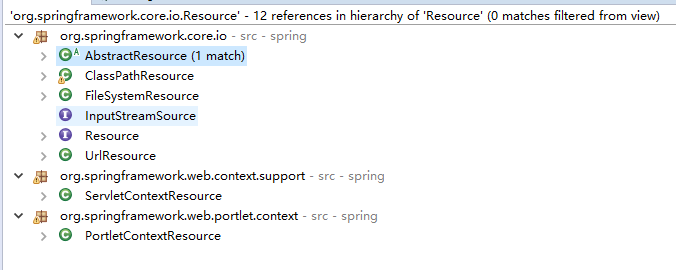
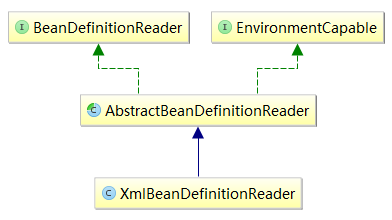

# Spring IoC容器初始化过程学习


IoC容器是什么？
IoC文英全称Inversion of Control，即控制反转，我么可以这么理解IoC容器：
　　“把某些业务对象的的控制权交给一个平台或者框架来同一管理，这个同一管理的平台可以称为IoC容器。”

我们刚开始学习spring的时候会经常看到的类似下面的这代码：

```
ApplicationContext appContext = new ClassPathXmlApplicationContext("cjj/models/beans.xml");
Person p = (Person)appContext.getBean("person");
```

上面代码中，在创建ApplicationContext实例对象过程中会创建一个spring容器，该容器会读取配置文件"cjj/models/beans.xml",并统一管理由该文件中定义好的所有bean实例对象，如果要获取某个bean实例，使用getBean方法就行了。例如我们只需要将Person提前配置在beans.xml文件中（可以理解为注入），之后我们可以不需使用new Person()的方式创建实例，而是通过容器来获取Person实例，这就相当于将Person的控制权交由spring容器了，差不多这就是控制反转的概念。

那在创建IoC容器时经历了哪些呢？为此，先来了解下Spring中IoC容器分类，继而根据一个具体的容器来讲解IoC容器初始化的过程。
Spring中有两个主要的容器系列：

1. 实现BeanFactory接口的简单容器；
2. 实现ApplicationContext接口的高级容器。

ApplicationContext比较复杂，它不但继承了BeanFactory的大部分属性，还继承其它可扩展接口，扩展的了许多高级的属性，其接口定义如下：


```
public interface ApplicationContext extends EnvironmentCapable, 　　　　　　　　　　　　　　　　　　ListableBeanFactory,    //继承于BeanFactory　　　　　　　　　　　　　　　　　　HierarchicalBeanFactory,//继承于BeanFactory
　　　　　　　　　　　　　　　　　　MessageSource,            //　　　　　　　　　　　　　　　　　　ApplicationEventPublisher,//　　　　　　　　　　　　　　　　　　ResourcePatternResolver   //继承ResourceLoader，用于获取resource对象
```


在BeanFactory子类中有一个***DefaultListableBeanFactory***类，它包含了基本Spirng IoC容器所具有的重要功能，开发时不论是使用BeanFactory系列还是ApplicationContext系列来创建容器基本都会使用到DefaultListableBeanFactory类，可以这么说，在spring中实际上把它当成默认的IoC容器来使用。下文在源码实例分析时你将会看到这个类。

（注：文章有点长，需要细心阅读，不同版本的spring中源码可能不同，但逻辑几乎是一样的，如果可以建议还是看源码 ^_^）

 

回到本文正题上来，关于Spirng IoC容器的初始化过程在《Spirng技术内幕：深入解析Spring架构与设计原理》一书中有明确的指出，IoC容器的初始化过程可以分为三步：

1. Resource定位（Bean的定义文件定位）
2. 将Resource定位好的资源载入到BeanDefinition
3. 将BeanDefiniton注册到容器中

 

- **第一步 Resource定位**

Resource是Sping中用于封装I/O操作的接口。正如前面所见，在创建spring容器时，通常要访问XML配置文件，除此之外还可以通过访问文件类型、二进制流等方式访问资源，还有当需要网络上的资源时可以通过访问URL，Spring把这些文件统称为Resource，Resource的体系结构如下:



常用的resource资源类型如下：
　　**FileSystemResource：**以文件的绝对路径方式进行访问资源，效果类似于Java中的File;
　　**ClassPathResourcee：**以类路径的方式访问资源，效果类似于this.getClass().getResource("/").getPath();
　　**ServletContextResource：**web应用根目录的方式访问资源，效果类似于request.getServletContext().getRealPath("");
　　**UrlResource：**访问网络资源的实现类。例如file: http: ftp:等前缀的资源对象;
　　**ByteArrayResource:** 访问字节数组资源的实现类。

那如何获取上图中对应的各种Resource对象呢？
Spring提供了ResourceLoader接口用于实现不同的Resource加载策略，该接口的实例对象中可以获取一个resource对象，也就是说将不同Resource实例的创建交给ResourceLoader的实现类来处理。ResourceLoader接口中只定义了两个方法：

```
Resource getResource(String location); //通过提供的资源location参数获取Resource实例
ClassLoader getClassLoader(); // 获取ClassLoader,通过ClassLoader可将资源载入JVM
```

注：ApplicationContext的所有实现类都实现RecourceLoader接口，因此可以直接调用getResource（参数）获取Resoure对象**。**不同的ApplicatonContext实现类使用getResource方法取得的资源类型不同，例如：FileSystemXmlApplicationContext.getResource获取的就是FileSystemResource实例；ClassPathXmlApplicationContext.gerResource获取的就是ClassPathResource实例；XmlWebApplicationContext.getResource获取的就是ServletContextResource实例，另外像不需要通过xml直接使用注解@Configuation方式加载资源的AnnotationConfigApplicationContext等等。

在资源定位过程完成以后，就为资源文件中的bean的载入创造了I/O操作的条件，如何读取资源中的数据将会在下一步介绍的BeanDefinition的载入过程中描述。

 

- ***\*第二步 通过返回的\**resource对象，进行BeanDefinition的载入**

1.什么是BeanDefinition? BeanDefinition与Resource的联系呢？

　　官方文档中对BeanDefinition的解释如下：
　　A BeanDefinition describes a bean instance, which has property values, constructor argument values, and further information supplied by concrete implementations.
它们之间的联系从官方文档描述的一句话：Load bean definitions from the specified resource中可见一斑。


```
　　/**
     * Load bean definitions from the specified resource.
     * @param resource the resource descriptor
     * @return the number of bean definitions found
     * @throws BeanDefinitionStoreException in case of loading or parsing errors
     */
    int loadBeanDefinitions(Resource resource) throws BeanDefinitionStoreException;
```


　　总之，BeanDefinition相当于一个数据结构，这个数据结构的生成过程是根据定位的resource资源对象中的bean而来的，这些bean在Spirng IoC容器内部表示成了的BeanDefintion这样的数据结构，IoC容器对bean的管理和依赖注入的实现都是通过操作BeanDefinition来进行的。

2.如何将BeanDefinition载入到容器？
　　在Spring中配置文件主要格式是XML，对于用来读取XML型资源文件来进行初始化的IoC 容器而言，该类容器会使用到AbstractXmlApplicationContext类，该类定义了一个名为loadBeanDefinitions(DefaultListableBeanFactory beanFactory) 的方法用于获取BeanDefinition：


```
// 该方法属于AbstractXmlApplicationContect类
protected void loadBeanDefinitions(DefaultListableBeanFactory beanFactory) throws BeansException, IOException {
    XmlBeanDefinitionReader beanDefinitionReader = new XmlBeanDefinitionReader(beanFactory);
    beanDefinitionReader.setEnvironment(this.getEnvironment());
    beanDefinitionReader.setResourceLoader(this);
    beanDefinitionReader.setEntityResolver(new ResourceEntityResolver(this));
    this.initBeanDefinitionReader(beanDefinitionReader);
    // 用于获取BeanDefinition
    this.loadBeanDefinitions(beanDefinitionReader);
}
```


此方法在具体执行过程中首先会new一个与容器对应的BeanDefinitionReader型实例对象，然后将生成的BeanDefintionReader实例作为参数传入loadBeanDefintions(XmlBeanDefinitionReader)，继续往下执行载入BeanDefintion的过程。例如AbstractXmlApplicationContext有两个实现类：FileSystemXmlApplicationContext、ClassPathXmlApplicationContext，这些容器在调用此方法时会创建一个**XmlBeanDefinitionReader类**对象专门用来载入所有的BeanDefinition。

下面以XmlBeanDefinitionReader对象载入BeanDefinition为例，使用源码说明载入BeanDefinition的过程：


```
// 该方法属于AbstractXmlApplicationContect类protected void loadBeanDefinitions(XmlBeanDefinitionReader reader) throws BeansException, IOException {
        Resource[] configResources = getConfigResources();//获取所有定位到的resource资源位置（用户定义）
        if (configResources != null) {
            reader.loadBeanDefinitions(configResources);//载入resources
        }
        String[] configLocations = getConfigLocations();//获取所有本地配置文件的位置（容器自身）
        if (configLocations != null) {
            reader.loadBeanDefinitions(configLocations);//载入resources
        }
}
```


通过上面代码将用户定义的资源以及容器本身需要的资源全部加载到reader中，reader.loadBeanDefinitions方法的源码如下：


```
// 该方法属于AbstractBeanDefinitionReader类, 父接口BeanDefinitionReader
@Override
public int loadBeanDefinitions(Resource... resources) throws BeanDefinitionStoreException {
    Assert.notNull(resources, "Resource array must not be null");
    int counter = 0;
    for (Resource resource : resources) {
        // 将所有资源全部加载，交给AbstractBeanDefinitionReader的实现子类处理这些resource
        counter += loadBeanDefinitions(resource);
    }
    return counter;
}
```


BeanDefinitionReader接口定义了 int loadBeanDefinitions（Resource resource）方法：

```
int loadBeanDefinitions(Resource resource) throws BeanDefinitionStoreException;
int loadBeanDefinitions(Resource... resources) throws BeanDefinitionStoreException;
```



XmlBeanDefinitionReader 类实现了BeanDefinitionReader接口中的loadBeanDefinitions(Resource)方法，其继承关系如上图所示。XmlBeanDefinitionReader类中几主要对加载的所有resource开始进行处理，大致过程是，先将resource包装为EncodeResource类型，然后处理，为生成BeanDefinition对象做准备，其主要几个方法的源码如下：


```
    public int loadBeanDefinitions(Resource resource) throws BeanDefinitionStoreException {
        // 包装resource为EncodeResource类型
        return loadBeanDefinitions(new EncodedResource(resource)); 
    }

    // 加载包装后的EncodeResource资源
    public int loadBeanDefinitions(EncodedResource encodedResource) throws BeanDefinitionStoreException {
        Assert.notNull(encodedResource, "EncodedResource must not be null");
        if (logger.isInfoEnabled()) {
            logger.info("Loading XML bean definitions from " + encodedResource.getResource());
        }

        try {
            // 通过resource对象得到XML文件内容输入流，并为IO的InputSource做准备
            InputStream inputStream = encodedResource.getResource().getInputStream();
            try {
                // Create a new input source with a byte stream.
                InputSource inputSource = new InputSource(inputStream);
                if (encodedResource.getEncoding() != null) {
                    inputSource.setEncoding(encodedResource.getEncoding());
                }
                // 开始准备 load bean definitions from the specified XML file
                return doLoadBeanDefinitions(inputSource, encodedResource.getResource());
            }
            finally {
                inputStream.close();
            }
        }
        catch (IOException ex) {
            throw new BeanDefinitionStoreException(
                    "IOException parsing XML document from " + encodedResource.getResource(), ex);
        }
    }

    protected int doLoadBeanDefinitions(InputSource inputSource, Resource resource)
            throws BeanDefinitionStoreException {
        try {
            // 获取指定资源的验证模式
            int validationMode = getValidationModeForResource(resource);

            // 从资源对象中加载DocumentL对象，大致过程为：将resource资源文件的内容读入到document中
            // DocumentLoader在容器读取XML文件过程中有着举足轻重的作用！
            // XmlBeanDefinitionReader实例化时会创建一个DefaultDocumentLoader型的私有属性,继而调用loadDocument方法
            // inputSource--要加载的文档的输入源
            Document doc = this.documentLoader.loadDocument(
                    inputSource, this.entityResolver, this.errorHandler, validationMode, this.namespaceAware);
            
            // 将document文件的bean封装成BeanDefinition，并注册到容器
            return registerBeanDefinitions(doc, resource);
        }
        catch ...(略)
    }
```


DefaultDocumentLoader大致了解即可，感兴趣可继续深究，其源码如下：（看完收起，便于阅读下文）

 View Code

上面代码分析到了registerBeanDefinitions(doc, resource)这一步，也就是准备将Document中的Bean按照Spring bean语义进行解析并转化为BeanDefinition类型，这个方法的具体过程如下：


```
/**
 * 属于XmlBeanDefinitionReader类
 * Register the bean definitions contained in the given DOM document.
 * @param doc the DOM document
 * @param resource
 * @return the number of bean definitions found
 * @throws BeanDefinitionStoreException
 */
public int registerBeanDefinitions(Document doc, Resource resource) throws BeanDefinitionStoreException {
    // 获取到DefaultBeanDefinitionDocumentReader实例
    BeanDefinitionDocumentReader documentReader = createBeanDefinitionDocumentReader();
    // 获取容器中bean的数量
    int countBefore = getRegistry().getBeanDefinitionCount();
    documentReader.registerBeanDefinitions(doc, createReaderContext(resource));
    return getRegistry().getBeanDefinitionCount() - countBefore;
}
```


通过 XmlBeanDefinitionReader 类中的私有属性 documentReaderClass 可以获得一个 DefaultBeanDefinitionDocumentReader 实例对象： 

```
private Class<?> documentReaderClass = DefaultBeanDefinitionDocumentReader.class;
protected BeanDefinitionDocumentReader createBeanDefinitionDocumentReader() {
   return BeanDefinitionDocumentReader.class.cast(BeanUtils.instantiateClass(this.documentReaderClass));
}
```

**DefaultBeanDefinitionDocumentReader**实现了**BeanDefinitionDocumentReader接口**，它的registerBeanDefinitions方法定义如下：


```
// DefaultBeanDefinitionDocumentReader implements BeanDefinitionDocumentReader
public void registerBeanDefinitions(Document doc, XmlReaderContext readerContext) {
    this.readerContext = readerContext;

    logger.debug("Loading bean definitions");
    // 获取doc的root节点，通过该节点能够访问所有的子节点
    Element root = doc.getDocumentElement();
    // 处理beanDefinition的过程委托给BeanDefinitionParserDelegate实例对象来完成
    BeanDefinitionParserDelegate delegate = createHelper(readerContext, root);

    // Default implementation is empty.
    // Subclasses can override this method to convert custom elements into standard Spring bean definitions
    preProcessXml(root);
    // 核心方法，代理
    parseBeanDefinitions(root, delegate);
    postProcessXml(root);
}
```


上面出现的**BeanDefinitionParserDelegate类**非常非常重要（需要了解代理技术，如JDK动态代理、cglib动态代理等）。Spirng BeanDefinition的解析就是在这个代理类下完成的，此类包含了各种对符合Spring Bean语义规则的处理，比如<bean></bean>、<import></import>、<alias><alias/>等的检测。

parseBeanDefinitions(root, delegate)方法如下：


```
   protected void parseBeanDefinitions(Element root, BeanDefinitionParserDelegate delegate) {
        if (delegate.isDefaultNamespace(root)) {
            NodeList nl = root.getChildNodes();
            // 遍历所有节点，做对应解析工作
            // 如遍历到<import>标签节点就调用importBeanDefinitionResource(ele)方法对应处理
            // 遍历到<bean>标签就调用processBeanDefinition(ele,delegate)方法对应处理
            for (int i = 0; i < nl.getLength(); i++) {
                Node node = nl.item(i);
                if (node instanceof Element) {
                    Element ele = (Element) node;
                    if (delegate.isDefaultNamespace(ele)) {
                        parseDefaultElement(ele, delegate);
                    }
                    else {
                        //对应用户自定义节点处理方法
                        delegate.parseCustomElement(ele); 
                    }
                }
            }
        }
        else {
            delegate.parseCustomElement(root);
        }
    }

    private void parseDefaultElement(Element ele, BeanDefinitionParserDelegate delegate) {
        // 解析<import>标签
        if (delegate.nodeNameEquals(ele, IMPORT_ELEMENT)) {
            importBeanDefinitionResource(ele);
        }
        // 解析<alias>标签
        else if (delegate.nodeNameEquals(ele, ALIAS_ELEMENT)) {
            processAliasRegistration(ele);
        }
        // 解析<bean>标签,最常用，过程最复杂
        else if (delegate.nodeNameEquals(ele, BEAN_ELEMENT)) {
            processBeanDefinition(ele, delegate);
        }
        // 解析<beans>标签
        else if (delegate.nodeNameEquals(ele, NESTED_BEANS_ELEMENT)) {
            // recurse
            doRegisterBeanDefinitions(ele);
        }
    }
```


这里针对常用的<bean>标签中的方法做简单介绍，其他标签的加载方式类似：


```
    /**
     * Process the given bean element, parsing the bean definition
     * and registering it with the registry.
     */
    protected void processBeanDefinition(Element ele, BeanDefinitionParserDelegate delegate) {
        // 该对象持有beanDefinition的name和alias，可以使用该对象完成beanDefinition向容器的注册
        BeanDefinitionHolder bdHolder = delegate.parseBeanDefinitionElement(ele);
        if (bdHolder != null) {
            bdHolder = delegate.decorateBeanDefinitionIfRequired(ele, bdHolder);
            try {
                // 注册最终被修饰的bean实例，下文注册beanDefinition到容器会讲解该方法
                BeanDefinitionReaderUtils.registerBeanDefinition(bdHolder, getReaderContext().getRegistry());
            }
            catch (BeanDefinitionStoreException ex) {
                getReaderContext().error("Failed to register bean definition with name '" +
                        bdHolder.getBeanName() + "'", ele, ex);
            }
            // Send registration event.
            getReaderContext().fireComponentRegistered(new BeanComponentDefinition(bdHolder));
        }
    }
```


parseBeanDefinitionElement(Element ele)方法会调用parseBeanDefinitionElement(ele, null)方法，并将值返回**BeanDefinitionHolder类**对象，这个方法将会对给定的<bean>标签进行解析，如果在解析<bean>标签的过程中出现错误则返回null。

需要强调一下的是parseBeanDefinitionElement(ele, null)方法中产生了一个抽象类型的BeanDefinition实例，这也是我们首次看到直接定义BeanDefinition的地方，这个方法里面会将<bean>标签中的内容解析到BeanDefinition中，之后再对BeanDefinition进行包装，将它与beanName,Alias等封装到BeanDefinitionHolder 对象中，该部分源码如下：


```
    public BeanDefinitionHolder parseBeanDefinitionElement(Element ele) {
        return parseBeanDefinitionElement(ele, null);
    }

    public BeanDefinitionHolder parseBeanDefinitionElement(Element ele, BeanDefinition containingBean) {
        String id = ele.getAttribute(ID_ATTRIBUTE);
        String nameAttr = ele.getAttribute(NAME_ATTRIBUTE);
            ...(略)
        String beanName = id;
           ...（略）
        // 从上面按过程走来，首次看到直接定义BeanDefinition ！！！
        // 该方法会对<bean>节点以及其所有子节点如<property>、<List>、<Set>等做出解析，具体过程本文不做分析（太多太长）
        AbstractBeanDefinition beanDefinition = parseBeanDefinitionElement(ele, beanName, containingBean);
        if (beanDefinition != null) {
            if (!StringUtils.hasText(beanName)) {
                ...(略)
            }
            String[] aliasesArray = StringUtils.toStringArray(aliases);
            return new BeanDefinitionHolder(beanDefinition, beanName, aliasesArray);
        }

        return null;
    }
```


 

 

- **第三步，将BeanDefiniton注册到容器中**

 　最终Bean配置会被解析成BeanDefinition并与beanName,Alias一同封装到**BeanDefinitionHolder类**中， 之后beanFactory.registerBeanDefinition(beanName, bdHolder.getBeanDefinition())，注册到**DefaultListableBeanFactory**.beanDefinitionMap中。之后客户端如果要获取Bean对象，Spring容器会根据注册的BeanDefinition信息进行实例化。

 BeanDefinitionReaderUtils类：


```
public static void registerBeanDefinition(
            BeanDefinitionHolder bdHolder, BeanDefinitionRegistry beanFactory) throws BeansException {

        // Register bean definition under primary name.
        String beanName = bdHolder.getBeanName();　　　　　// 注册beanDefinition!!!
        beanFactory.registerBeanDefinition(beanName, bdHolder.getBeanDefinition());

        // 如果有别名的话也注册进去，Register aliases for bean name, if any.
        String[] aliases = bdHolder.getAliases();
        if (aliases != null) {
            for (int i = 0; i < aliases.length; i++) {
                beanFactory.registerAlias(beanName, aliases[i]);
            }
        }
    }
```


**DefaultListableBeanFactory**实现了上面调用BeanDefinitionRegistry接口的 registerBeanDefinition( beanName, bdHolder.getBeanDefinition())方法，这一部分的主要逻辑是向DefaultListableBeanFactory对象的**beanDefinitionMap**中存放beanDefinition，当初始化容器进行bean初始化时，在bean的生命周期分析里必然会在这个beanDefinitionMap中获取beanDefition实例，有机会成文分析一下bean的生命周期，到时可以分析一下如何使用这个beanDefinitionMap。

registerBeanDefinition( beanName, bdHolder.getBeanDefinition() )方法具体方法如下：

```
    /** Map of bean definition objects, keyed by bean name */
    private final Map<String, BeanDefinition> beanDefinitionMap = new ConcurrentHashMap<String, BeanDefinition>(256);
```


```
public void registerBeanDefinition(String beanName, BeanDefinition beanDefinition)
            throws BeanDefinitionStoreException {

        Assert.hasText(beanName, "Bean name must not be empty");
        Assert.notNull(beanDefinition, "Bean definition must not be null");

        if (beanDefinition instanceof AbstractBeanDefinition) {
            try {
                ((AbstractBeanDefinition) beanDefinition).validate();
            }
            catch (BeanDefinitionValidationException ex) {
                throw new BeanDefinitionStoreException(beanDefinition.getResourceDescription(), beanName,
                        "Validation of bean definition failed", ex);
            }
        }
　　　　　　　　 // beanDefinitionMap是个ConcurrentHashMap类型数据，用于存放beanDefinition,它的key值是beanName
        Object oldBeanDefinition = this.beanDefinitionMap.get(beanName);
        if (oldBeanDefinition != null) {
            if (!this.allowBeanDefinitionOverriding) {
                throw new BeanDefinitionStoreException(beanDefinition.getResourceDescription(), beanName,
                        "Cannot register bean definition [" + beanDefinition + "] for bean '" + beanName +
                        "': there's already [" + oldBeanDefinition + "] bound");
            }
            else {
                if (logger.isInfoEnabled()) {
                    logger.info("Overriding bean definition for bean '" + beanName +
                            "': replacing [" + oldBeanDefinition + "] with [" + beanDefinition + "]");
                }
            }
        }
        else {
            this.beanDefinitionNames.add(beanName);  
        }　　　　　// 将获取到的BeanDefinition放入Map中，容器操作使用bean时通过这个HashMap找到具体的BeanDefinition
        this.beanDefinitionMap.put(beanName, beanDefinition);        // Remove corresponding bean from singleton cache, if any.
        // Shouldn't usually be necessary, rather just meant for overriding
        // a context's default beans (e.g. the default StaticMessageSource
        // in a StaticApplicationContext).
        removeSingleton(beanName);
    }
```

