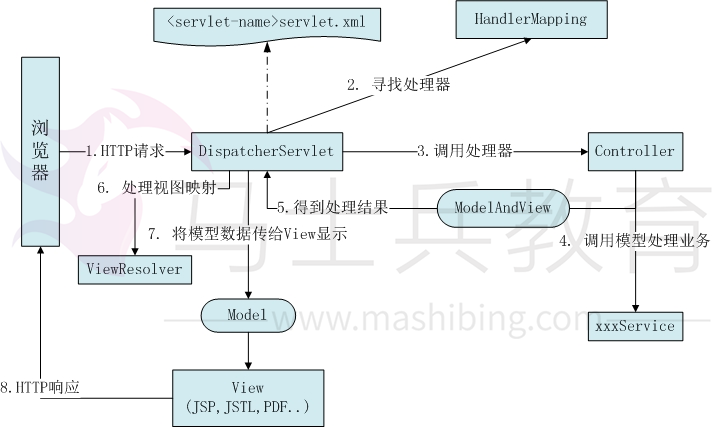

# Spring MVC工作原理 及注解说明

# SpringMVC框架介绍

  1) [spring](http://lib.csdn.net/base/javaee) MVC属于SpringFrameWork的后续产品，已经融合在Spring Web Flow里面。

> Spring 框架提供了构建 Web 应用程序的全功能 MVC 模块。使用 Spring 可插入的 MVC [架构](http://lib.csdn.net/base/architecture)，可以选择是使用内置的 Spring Web 框架还是 Struts 这样的 Web 框架。通过策略接口，Spring 框架是高度可配置的，而且包含多种视图技术，例如 JavaServer Pages（JSP）技术、Velocity、Tiles、iText 和 POI。Spring MVC 框架并不知道使用的视图，所以不会强迫您只使用 JSP 技术。

​    Spring MVC 分离了控制器、模型对象、分派器以及处理程序对象的角色，这种分离让它们更容易进行定制。

  2) Spring的MVC框架主要由DispatcherServlet、处理器映射、处理器(控制器)、视图解析器、视图组成。

# SpringMVC原理图

 

# SpringMVC接口解释

DispatcherServlet接口：

> Spring提供的前端控制器，所有的请求都有经过它来统一分发。在DispatcherServlet将请求分发给Spring Controller之前，需要借助于Spring提供的HandlerMapping定位到具体的Controller。

HandlerMapping接口：

> 能够完成客户请求到Controller映射。

Controller接口：

> 需要为并发用户处理上述请求，因此实现Controller接口时，必须保证线程安全并且可重用。
>
> Controller将处理用户请求，这和Struts Action扮演的角色是一致的。一旦Controller处理完用户请求，则返回ModelAndView对象给DispatcherServlet前端控制器，ModelAndView中包含了模型（Model）和视图（View）。
>
> 从宏观角度考虑，DispatcherServlet是整个Web应用的控制器；从微观考虑，Controller是单个Http请求处理过程中的控制器，而ModelAndView是Http请求过程中返回的模型（Model）和视图（View）。

ViewResolver接口：

 

Spring提供的视图解析器（ViewResolver）在Web应用中查找View对象，从而将相应结果渲染给客户。

# SpringMVC运行原理

> \1. 客户端请求提交到DispatcherServlet
>
> \2. 由DispatcherServlet控制器查询一个或多个HandlerMapping，找到处理请求的Controller
>
> \3. DispatcherServlet将请求提交到Controller
>
> \4. Controller调用业务逻辑处理后，返回ModelAndView
>
> \5. DispatcherServlet查询一个或多个ViewResoler视图解析器，找到ModelAndView指定的视图
>
> \6. 视图负责将结果显示到客户端

DispatcherServlet是整个Spring MVC的核心。它负责接收HTTP请求组织协调Spring MVC的各个组成部分。其主要工作有以下三项：

​    \1. 截获符合特定格式的URL请求。
​    \2. 初始化DispatcherServlet上下文对应的WebApplicationContext，并将其与业务层、持久化层的WebApplicationContext建立关联。
​    \3. 初始化Spring MVC的各个组成组件，并装配到DispatcherServlet中。

 

 

 

<mvc:annotation-driven /> 说明:

 

是一种简写形式，可以让初学者快速成应用默认的配置方案，会默认注册 DefaultAnnotationHandleMapping以及AnnotionMethodHandleAdapter 这两个 Bean, 这两个 Bean ，前者对应类级别， 后者对应到方法级别；

 

上在面的 DefaultAnnotationHandlerMapping和AnnotationMethodHandlerAdapter 是 Spring 为 @Controller 分发请求所必需的。

 

annotation-driven 扫描指定包中类上的注解，常用的注解有:

 

复制代码

@Controller 声明Action组件

@Service 声明Service组件 @Service("myMovieLister")

@Repository 声明Dao组件

@Component 泛指组件, 当不好归类时.

@RequestMapping("/menu") 请求映射

@Resource 用于注入，( j2ee提供的 ) 默认按名称装配，@Resource(name="beanName")

@Autowired 用于注入，(srping提供的) 默认按类型装配

@Transactional( rollbackFor={Exception.class}) 事务管理

@ResponseBody

@Scope("prototype") 设定bean的作用域