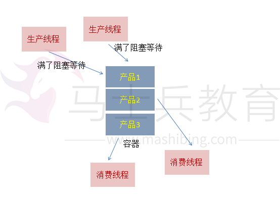
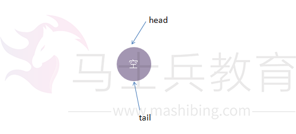
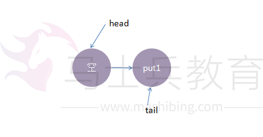
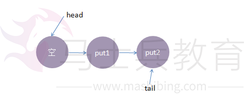
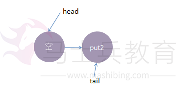
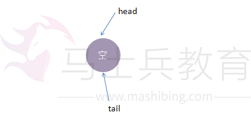
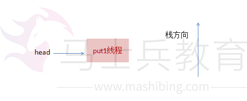
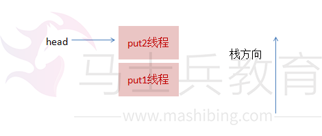
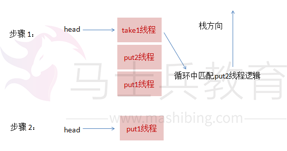
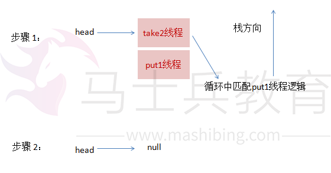

# SynchronousQueue实现原理

## 前言

SynchronousQueue是一个比较特别的队列，由于在线程池方面有所应用，为了更好的理解线程池的实现原理，笔者花了些时间学习了一下该队列源码(JDK1.8)，此队列源码中充斥着大量的CAS语句，理解起来是有些难度的，为了方便日后回顾，本篇文章会以简洁的图形化方式展示该队列底层的实现原理。


## SynchronousQueue简单使用

经典的生产者-消费者模式，操作流程是这样的：

有多个生产者，可以并发生产产品，把产品置入队列中，如果队列满了，生产者就会阻塞；

有多个消费者，并发从队列中获取产品，如果队列空了，消费者就会阻塞；

如下面的示意图所示：





SynchronousQueue
也是一个队列来的，但它的特别之处在于它内部没有容器，一个生产线程，当它生产产品（即put的时候），如果当前没有人想要消费产品(即当前没有线程执行take)，此生产线程必须阻塞，等待一个消费线程调用take操作，take操作将会唤醒该生产线程，同时消费线程会获取生产线程的产品（即数据传递），这样的一个过程称为一次配对过程(当然也可以先take后put,原理是一样的)。

我们用一个简单的代码来验证一下，如下所示：

```text
package com.concurrent;

import java.util.concurrent.SynchronousQueue;

public class SynchronousQueueDemo {
    public static void main(String[] args) throws InterruptedException {
        final SynchronousQueue<Integer> queue = new SynchronousQueue<Integer>();

        Thread putThread = new Thread(new Runnable() {
            @Override
            public void run() {
                System.out.println("put thread start");
                try {
                    queue.put(1);
                } catch (InterruptedException e) {
                }
                System.out.println("put thread end");
            }
        });

        Thread takeThread = new Thread(new Runnable() {
            @Override
            public void run() {
                System.out.println("take thread start");
                try {
                    System.out.println("take from putThread: " + queue.take());
                } catch (InterruptedException e) {
                }
                System.out.println("take thread end");
            }
        });

        putThread.start();
        Thread.sleep(1000);
        takeThread.start();
    }
}
```


一种输出结果如下:

```text
put thread start
take thread start
take from putThread: 1
put thread end
take thread end
```


从结果可以看出，put线程执行queue.put(1) 后就被阻塞了，只有take线程进行了消费，put线程才可以返回。可以认为这是一种线程与线程间一对一传递消息的模型。


## SynchronousQueue实现原理

不像ArrayBlockingQueue、LinkedBlockingDeque之类的阻塞队列依赖AQS实现并发操作，SynchronousQueue直接使用CAS实现线程的安全访问。由于源码中充斥着大量的CAS代码，不易于理解，所以按照笔者的风格，接下来会使用简单的示例来描述背后的实现模型。

队列的实现策略通常分为公平模式和非公平模式，接下来将分别进行说明。


## 公平模式下的模型：

公平模式下，底层实现使用的是TransferQueue这个内部队列，它有一个head和tail指针，用于指向当前正在等待匹配的线程节点。

初始化时，TransferQueue的状态如下：





接着我们进行一些操作：

1、线程put1执行 put(1)操作，由于当前没有配对的消费线程，所以put1线程入队列，自旋一小会后睡眠等待，这时队列状态如下：





2、接着，线程put2执行了put(2)操作，跟前面一样，put2线程入队列，自旋一小会后睡眠等待，这时队列状态如下：





3、这时候，来了一个线程take1，执行了
take操作，由于tail指向put2线程，put2线程跟take1线程配对了(一put一take)，这时take1线程不需要入队，但是请注意了，这时候，要唤醒的线程并不是put2，而是put1。为何？

大家应该知道我们现在讲的是公平策略，所谓公平就是谁先入队了，谁就优先被唤醒，我们的例子明显是put1应该优先被唤醒。至于读者可能会有一个疑问，明明是take1线程跟put2线程匹配上了，结果是put1线程被唤醒消费，怎么确保take1线程一定可以和次首节点(head.next)也是匹配的呢？其实大家可以拿个纸画一画，就会发现真的就是这样的。


公平策略总结下来就是：队尾匹配队头出队。

执行后put1线程被唤醒，take1线程的 take()方法返回了1(put1线程的数据)，这样就实现了线程间的一对一通信，这时候内部状态如下：





4、最后，再来一个线程take2，执行take操作，这时候只有put2线程在等候，而且两个线程匹配上了，线程put2被唤醒，

take2线程take操作返回了2(线程put2的数据)，这时候队列又回到了起点，如下所示：





以上便是公平模式下，SynchronousQueue的实现模型。总结下来就是：队尾匹配队头出队，先进先出，体现公平原则。


## 非公平模式下的模型：

我们还是使用跟公平模式下一样的操作流程，对比两种策略下有何不同。非公平模式底层的实现使用的是TransferStack，

一个栈，实现中用head指针指向栈顶，接着我们看看它的实现模型:

1、线程put1执行 put(1)操作，由于当前没有配对的消费线程，所以put1线程入栈，自旋一小会后睡眠等待，这时栈状态如下：




2、接着，线程put2再次执行了put(2)操作，跟前面一样，put2线程入栈，自旋一小会后睡眠等待，这时栈状态如下：




3、这时候，来了一个线程take1，执行了take操作，这时候发现栈顶为put2线程，匹配成功，但是实现会先把take1线程入栈，然后take1线程循环执行匹配put2线程逻辑，一旦发现没有并发冲突，就会把栈顶指针直接指向 put1线程




4、最后，再来一个线程take2，执行take操作，这跟步骤3的逻辑基本是一致的，take2线程入栈，然后在循环中匹配put1线程，最终全部匹配完毕，栈变为空，恢复初始状态，如下图所示：




可以从上面流程看出，虽然put1线程先入栈了，但是却是后匹配，这就是非公平的由来。

## 总结

SynchronousQueue由于其独有的线程一一配对通信机制，在大部分平常开发中，可能都不太会用到，但线程池技术中会有所使用，由于内部没有使用AQS，而是直接使用CAS，所以代码理解起来会比较困难，但这并不妨碍我们理解底层的实现模型，在理解了模型的基础上，有兴趣的话再查阅源码，就会有方向感，看起来也会比较容易，希望本文有所借鉴意义。