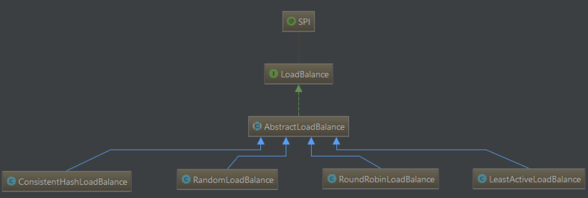
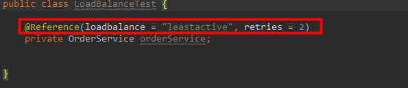

# dubbo负载均衡策略

前言：在上一篇博客中，介绍了zookeeper作为dubbo的注册中心是如何工作的，有一个很重要的点，我们的程序是分布式应用，服务部署在几个节点（服务器）上，当消费者调用服务时，zk返回给dubbo的是一个节点列表，但是dubbo只会选择一台服务器，那么它究竟会选择哪一台呢？这就是dubbo的负载均衡策略了，本篇博客就来聚焦dubbo的负载均衡策略。

本篇博客的目录

**一：负载均衡介绍**

1.1:负载均衡简介

以下是wikipedia对负载均衡的定义：

   **负载均衡**改善了跨多个计算资源（例如计算机，计算机集群，网络链接，中央处理单元或磁盘驱动的的工作负载分布。负载平衡旨在优化资源使用，最大化吞吐量，最小化响应时间，并避免任何单个资源的过载。使用具有负载平衡而不是单个组件的多个组件可以通过冗余提高可靠性和可用性。负载平衡通常涉及专用软件或硬件

 1.2：简单解释

   这个概念如何理解呢？通俗点来说假如一个请求从客户端发起,比如(查询订单列表)，要选择服务器进行处理，但是我们的集群环境提供了5个服务器A\B\C\D\E，每个服务器都有处理这个请求的能力,此时客户端就必须选择一个服务器来进行处理(**不存在先选择A，处理一会又选择C,又跳到D**).说白了就是一个选择的问题。当请求多了的话，就要考虑各服务器的负载，一共5个服务器，不可能每次都让一个服务器都来处理吧，比如把让其他服务器来分压。这就是负载均衡的优点：避免单个服务器响应同一请求，容易造成服务器宕机、崩溃等问题。

**二：dubbo的loadBalance接口**

1.1：loadBalance

dubbo的负载均衡策略，主体向外暴露出来是一个接口，名字叫做loadBlace,位于com.alibaba.dubbo.rpc.cluster包下，很明显根据包名就可以看出它是用来管理集群的：

这个接口就一个方法，select方法的作用就是从众多的调用的List选择出一个调用者，Invoker可以理解为客户端的调用者，dubbo专门封装一个类来表示，URL就是调用者发起的URL请求链接，从这个URL中可以获取很多请求的具体信息,Invocation表示的是调用的具体过程，dubbo用这个类模拟调用具体细节过程：

1.2：AbstractLoadBlance

该接口在下面的子类都会对其进行实现。接口下是一个抽象类AbstractLoadBlance

```
package com.alibaba.dubbo.rpc.cluster;
public interface LoadBalance {@Adaptive("loadbalance")
    <T> Invoker<T> select(List<Invoker<T>> invokers, URL url, Invocation invocation) throws RpcException;
}
```

AbstractLoadBlance抽象类继承自LoadBalance，其中有个static方法表明它在类加载的时候就会运行，它表示的含义是计算预热加载权重，参数是uptime，这里可以理解为服务启动的时间，warmup就是预热时间，weight是权重的值，下面会对比进行详细解释：

```
public abstract class AbstractLoadBalance implements LoadBalance{

   static int calculateWarmupWeight(int uptime, int warmup, int weight){
    //
  }
    @Override
    public <T> Invoker<T> select(List<Invoker<T>> invokers, URL url, 
   Invocation invocation){
   //
   }
    protected abstract <T> Invoker<T> doSelect(List<Invoker<T>> 
     invokers, URL url, Invocation invocation);      
     protected int getWeight(Invoker<?> invoker, Invocation invocation) {
    }
}
```

 1.2.1：select方法

 抽象类方法中有个有方法体的方法select,先判断调用者组成的List是否为null，如果是null就返回null。再判断调用者的大小，如果只有一个就返回那个唯一的调用者(试想，如果服务调用另一个服务时，当服务的提供者机器只有一个，那么就可以返回那一个，因为没有选择了！)如果这些都不成立，就继续往下走，走doSelect方法：

```
@Override
    public <T> Invoker<T> select(List<Invoker<T>> invokers, URL url, Invocation invocation) {
        if (invokers == null || invokers.isEmpty())
            return null;
        if (invokers.size() == 1)
            return invokers.get(0);
        return doSelect(invokers, url, invocation);
    }
```

1.2.2:doSelect方法

该方法是抽象的，交给具体的子类去实现，由此也可以思考出一个问题就是：dubbo为什么要将一个接口首先做出一个实现抽象类，再由不同的子类去实现？原因是抽象类中的非抽象方法，再子类中都是必须要实现的，而他们子类的不同点就是具体做出选择的策略不同,将公共的逻辑提取出来放在抽象类里，子类不用写多余的代码，只用维护和实现最终要的自己的逻辑

```
 protected abstract <T> Invoker<T> doSelect(List<Invoker<T>> invokers, URL url, Invocation invocation);
```

1.2.3：getWeight方法

顾名思义，这个方法的含义就是获取权重，首先通过URL(URL为dubbo封装的一个实体)获取基本的权重，如果权重大于0，会获取服务启动时间，再用当前的时间-启动时间就是服务到目前为止运行了多久，因此这个upTime就可以理解为服务启动时间，再获取配置的预热时间，如果启动时间小于预热时间，就会再次调用获取权重。这个预热的方法其实dubbo针对JVM做出的一个**很契合的优化**，因为JVM从启动到起来都运行到最佳状态是需要一点时间的，这个时间叫做warmup,而dubbo就会对这个时间进行设定，然后等到服务运行时间和warmup相等时再计算权重，这样就可以保障服务的最佳运行状态！

```
protected int getWeight(Invoker<?> invoker, Invocation invocation) {
        int weight = invoker.getUrl().getMethodParameter(invocation.getMethodName(), Constants.WEIGHT_KEY, Constants.DEFAULT_WEIGHT);
        if (weight > 0) {
            long timestamp = invoker.getUrl().getParameter(Constants.REMOTE_TIMESTAMP_KEY, 0L);
            if (timestamp > 0L) {
                int uptime = (int) (System.currentTimeMillis() - timestamp);
                int warmup = invoker.getUrl().getParameter(Constants.WARMUP_KEY, Constants.DEFAULT_WARMUP);
                if (uptime > 0 && uptime < warmup) {
                    weight = calculateWarmupWeight(uptime, warmup, weight);
                }
            }
        }
        return weight;
    }
```

**三：dubbo的几种负载均衡策略**

3.1：整体架构图

 可以看出抽象的负载均衡下的类分为4个，这4个类表示了4种负载均衡策略，分别是一致性Hash均衡算法、随机调用法、轮询法、最少活动调用法



 3.2:RandomLoadBalance

   随机调用负载均衡，该类实现了抽象的AbstractLoadBalance接口,重写了doSelect方法，看方法的细节就是首先遍历每个提供服务的机器，获取每个服务的权重，然后累加权重值，判断每个服务的提供者权重是否相同，如果每个调用者的权重不相同，并且每个权重大于0，那么就会根据权重的总值生成一个随机数，再用这个随机数，根据调用者的数量每次减去调用者的权重，直到计算出当前的服务提供者随机数小于0，就选择那个提供者！另外，如果每个机器的权重的都相同，那么权重就不会参与计算，直接选择随机算法生成的某一个选择，完全随机。可以看出，随机调用法，

```
public class RandomLoadBalance extends AbstractLoadBalance {

    public static final String NAME = "random";

    private final Random random = new Random();

    @Override
    protected <T> Invoker<T> doSelect(List<Invoker<T>> invokers, URL url, Invocation invocation) {
        int length = invokers.size(); // Number of invokers
        int totalWeight = 0; // The sum of weights
        boolean sameWeight = true; // Every invoker has the same weight?
        for (int i = 0; i < length; i++) {
            int weight = getWeight(invokers.get(i), invocation);
            totalWeight += weight; // Sum
            if (sameWeight && i > 0
                    && weight != getWeight(invokers.get(i - 1), invocation)) {
                sameWeight = false;
            }
        }
        if (totalWeight > 0 && !sameWeight) {
            // If (not every invoker has the same weight & at least one invoker's weight>0), select randomly based on totalWeight.
            int offset = random.nextInt(totalWeight);
            // Return a invoker based on the random value.
            for (int i = 0; i < length; i++) {
                offset -= getWeight(invokers.get(i), invocation);
                if (offset < 0) {
                    return invokers.get(i);
                }
            }
        }
        // If all invokers have the same weight value or totalWeight=0, return evenly.
        return invokers.get(random.nextInt(length));
    }
```

3.3：RoundRobinLoadBlance

轮询调用，轮询调用的过程主要是维护了局部变量的一个LinkdesHashMap（有顺序的Map）去存储调用者和权重值的对应关系，然后遍历每个调用者,把调用者和当前大于0的权重值放进去，再累加权重值。还有一个全局变量的map，找到第一个服务调用者，首先是找到每个服务的key值和method，这里可以理解为标识第一个调用者的唯一key，然后再给它对应的值保证原子性的+1（AtomicPositiveInteger是原子的），再对这个值取模总权重，再每次对其权重值-1，知道它取模与总权重值等于0就选择该调用者，可以称之为**"降权取模"**（只是一种的计算层面,而不是真正降权）。总结：**轮询调用并不是简单的一个接着一个依次调用，它是根据权重的值进行循环的。**

```
public class RoundRobinLoadBalance extends AbstractLoadBalance {

    public static final String NAME = "roundrobin";

    private final ConcurrentMap<String, AtomicPositiveInteger> sequences = new ConcurrentHashMap<String, AtomicPositiveInteger>();

    @Override
    protected <T> Invoker<T> doSelect(List<Invoker<T>> invokers, URL url, Invocation invocation) {
        String key = invokers.get(0).getUrl().getServiceKey() + "." + invocation.getMethodName();
        int length = invokers.size(); // Number of invokers
        int maxWeight = 0; // The maximum weight
        int minWeight = Integer.MAX_VALUE; // The minimum weight
        final LinkedHashMap<Invoker<T>, IntegerWrapper> invokerToWeightMap = new LinkedHashMap<Invoker<T>, IntegerWrapper>();
        int weightSum = 0;
        for (int i = 0; i < length; i++) {
            int weight = getWeight(invokers.get(i), invocation);
            maxWeight = Math.max(maxWeight, weight); // Choose the maximum weight
            minWeight = Math.min(minWeight, weight); // Choose the minimum weight
            if (weight > 0) {
                invokerToWeightMap.put(invokers.get(i), new IntegerWrapper(weight));
                weightSum += weight;
            }
        }
        AtomicPositiveInteger sequence = sequences.get(key);
        if (sequence == null) {
            sequences.putIfAbsent(key, new AtomicPositiveInteger());
            sequence = sequences.get(key);
        }
        int currentSequence = sequence.getAndIncrement();
        if (maxWeight > 0 && minWeight < maxWeight) {
            int mod = currentSequence % weightSum;
            for (int i = 0; i < maxWeight; i++) {
                for (Map.Entry<Invoker<T>, IntegerWrapper> each : invokerToWeightMap.entrySet()) {
                    final Invoker<T> k = each.getKey();
                    final IntegerWrapper v = each.getValue();
                    if (mod == 0 && v.getValue() > 0) {
                        return k;
                    }
                    if (v.getValue() > 0) {
                        v.decrement();
                        mod--;
                    }
                }
            }
        }
        // Round robin
        return invokers.get(currentSequence % length);
    }
```

2.4：LeastActiveLoadBlance

最少活跃数调用法：这个方法的主要作用根据服务的提供者的运行状态去选择服务器,主要的思路就是遍历每个调用者，然后获取每个服务器的运行状态，如果当前运行的运行状态小于最小的状态-1，把它保存在leastIndexs中的第一个位置，并且认定所有的调用者权重都相同，然后直接返回那个调用者(这里的逻辑是：找到最少活跃数(在代码层反应就是：active的值))。如果计算出的权重值和最少的权重值相同，那么把它保存在leastIndexs数组里面，累加权重值，如果当前的权重值不等于初始值firstWeight，那么就认定不是所有的调用者的权重不同。然后再遍历lestIndexs，取权重累加值的随机数生成权重偏移量，在累减它，到它小于0的时候返回那个调用者。如果这些都不符合，就从leastIndexs随机选一个index，返回那个调用者！

```
public class LeastActiveLoadBalance extends AbstractLoadBalance {

    public static final String NAME = "leastactive";

    private final Random random = new Random();

    @Override
    protected <T> Invoker<T> doSelect(List<Invoker<T>> invokers, URL url, Invocation invocation) {
        int length = invokers.size(); // Number of invokers
        int leastActive = -1; // The least active value of all invokers
        int leastCount = 0; // The number of invokers having the same least active value (leastActive)
        int[] leastIndexs = new int[length]; // The index of invokers having the same least active value (leastActive)
        int totalWeight = 0; // The sum of weights
        int firstWeight = 0; // Initial value, used for comparision
        boolean sameWeight = true; // Every invoker has the same weight value?
        for (int i = 0; i < length; i++) {
            Invoker<T> invoker = invokers.get(i);
            int active = RpcStatus.getStatus(invoker.getUrl(), invocation.getMethodName()).getActive(); // Active number
            int weight = invoker.getUrl().getMethodParameter(invocation.getMethodName(), Constants.WEIGHT_KEY, Constants.DEFAULT_WEIGHT); // Weight
            if (leastActive == -1 || active < leastActive) { // Restart, when find a invoker having smaller least active value.
                leastActive = active; // Record the current least active value
                leastCount = 1; // Reset leastCount, count again based on current leastCount
                leastIndexs[0] = i; // Reset
                totalWeight = weight; // Reset
                firstWeight = weight; // Record the weight the first invoker
                sameWeight = true; // Reset, every invoker has the same weight value?
            } else if (active == leastActive) { // If current invoker's active value equals with leaseActive, then accumulating.
                leastIndexs[leastCount++] = i; // Record index number of this invoker
                totalWeight += weight; // Add this invoker's weight to totalWeight.
                // If every invoker has the same weight?
                if (sameWeight && i > 0
                        && weight != firstWeight) {
                    sameWeight = false;
                }
            }
        }
        // assert(leastCount > 0)
        if (leastCount == 1) {
            // If we got exactly one invoker having the least active value, return this invoker directly.
            return invokers.get(leastIndexs[0]);
        }
        if (!sameWeight && totalWeight > 0) {
            // If (not every invoker has the same weight & at least one invoker's weight>0), select randomly based on totalWeight.
            int offsetWeight = random.nextInt(totalWeight);
            // Return a invoker based on the random value.
            for (int i = 0; i < leastCount; i++) {
                int leastIndex = leastIndexs[i];
                offsetWeight -= getWeight(invokers.get(leastIndex), invocation);
                if (offsetWeight <= 0)
                    return invokers.get(leastIndex);
            }
        }
        // If all invokers have the same weight value or totalWeight=0, return evenly.
        return invokers.get(leastIndexs[random.nextInt(leastCount)]);
    }
}
```

 2.2.5：ConsistentHashLoadBalance

一致性Hash算法，doSelect方法进行选择。一致性Hash负载均衡涉及到两个主要的配置参数为hash.arguments与hash.nodes：当进行调用时候根据调用方法的哪几个参数生成key，并根据key来通过一致性hash算法来选择调用节点。例如调用方法invoke(Strings1,Strings2);若hash.arguments为1(默认值)，则仅取invoke的参数1（s1）来生成hashCode。

hash.nodes：节点的副本数。。dubbo的一致性哈希通过ConsistentHashLoadBalance类来实现。ConsistentHashLoadBalance内部定义ConsistentHashSelector类，最终通过该类进行结点选择。ConsistentHashLoadBalance实现的doSelect方法来利用所创建的ConsistentHashSelector对象选择结点。doSelect的实现如下。当调用该方法时，如果选择器不存在则去创建。随后通过ConsistentHashSelector的select方法选择结点。ConsistentHashSelector在构造函数内部会创建replicaNumber个虚拟结点，并将这些虚拟结点存储于TreeMap。随后根据调用方法的参数来生成key，并在TreeMap中选择一个结点进行调用。上述代码中hash(byte[]digest,intnumber)方法用来生成hashCode。该函数将生成的结果转换为long类，这是因为生成的结果是一个32位数，若用int保存可能会产生负数。而一致性hash生成的逻辑环其hashCode的范围是在0-MAX_VALUE之间。因此为正整数，所以这里要强制转换为long类型，避免出现负数。进行节点选择的方法为select,最后通过sekectForKey方法来选择结点。在进行选择时候若HashCode直接与某个虚拟结点的key一样，则直接返回该结点，如果hashCode落在某个节点上。若不在，找到一个最小上个的key所对应的结点。

```
public class ConsistentHashLoadBalance extends AbstractLoadBalance {

    private final ConcurrentMap<String, ConsistentHashSelector<?>> selectors = new ConcurrentHashMap<String, ConsistentHashSelector<?>>();

    @SuppressWarnings("unchecked")
    @Override
    protected <T> Invoker<T> doSelect(List<Invoker<T>> invokers, URL url, Invocation invocation) {
        String key = invokers.get(0).getUrl().getServiceKey() + "." + invocation.getMethodName();
        int identityHashCode = System.identityHashCode(invokers);
        ConsistentHashSelector<T> selector = (ConsistentHashSelector<T>) selectors.get(key);        //若选择器不存在去创建
        if (selector == null || selector.identityHashCode != identityHashCode) {
            selectors.put(key, new ConsistentHashSelector<T>(invokers, invocation.getMethodName(), identityHashCode));
            selector = (ConsistentHashSelector<T>) selectors.get(key);
        }
        return selector.select(invocation);
    }
    //私有内部类
    private static final class ConsistentHashSelector<T> {

        private final TreeMap<Long, Invoker<T>> virtualInvokers;

        private final int replicaNumber;

        private final int identityHashCode;

        private final int[] argumentIndex;

        ConsistentHashSelector(List<Invoker<T>> invokers, String methodName, int identityHashCode) {
            this.virtualInvokers = new TreeMap<Long, Invoker<T>>();
            this.identityHashCode = identityHashCode;
            URL url = invokers.get(0).getUrl();
            this.replicaNumber = url.getMethodParameter(methodName, "hash.nodes", 160);
            String[] index = Constants.COMMA_SPLIT_PATTERN.split(url.getMethodParameter(methodName, "hash.arguments", "0"));
            argumentIndex = new int[index.length];
            for (int i = 0; i < index.length; i++) {
                argumentIndex[i] = Integer.parseInt(index[i]);
            }
            for (Invoker<T> invoker : invokers) {
                String address = invoker.getUrl().getAddress();
                for (int i = 0; i < replicaNumber / 4; i++) {
                    byte[] digest = md5(address + i);
                    for (int h = 0; h < 4; h++) {
                        long m = hash(digest, h);                        //虚拟调用者
                        virtualInvokers.put(m, invoker);
                    }
                }
            }
        }
         //选择调用
        public Invoker<T> select(Invocation invocation) {
            String key = toKey(invocation.getArguments());
            byte[] digest = md5(key);
            return selectForKey(hash(digest, 0));
        }
        //转化为服务的key值
        private String toKey(Object[] args) {
            StringBuilder buf = new StringBuilder();
            for (int i : argumentIndex) {
                if (i >= 0 && i < args.length) {
                    buf.append(args[i]);
                }
            }
            return buf.toString();
        }
        //  
        private Invoker<T> selectForKey(long hash) {            //从TreeMap中去寻找
            Map.Entry<Long, Invoker<T>> entry = virtualInvokers.tailMap(hash, true).firstEntry();
            if (entry == null) {
                entry = virtualInvokers.firstEntry();
            }
            return entry.getValue();
        }
        //计算Hash值
        private long hash(byte[] digest, int number) {
            return (((long) (digest[3 + number * 4] & 0xFF) << 24)
                    | ((long) (digest[2 + number * 4] & 0xFF) << 16)
                    | ((long) (digest[1 + number * 4] & 0xFF) << 8)
                    | (digest[number * 4] & 0xFF))
                    & 0xFFFFFFFFL;
        }
        //md5加密
        private byte[] md5(String value) {
            MessageDigest md5;
            try {
                md5 = MessageDigest.getInstance("MD5");
            } catch (NoSuchAlgorithmException e) {
                throw new IllegalStateException(e.getMessage(), e);
            }
            md5.reset();
            byte[] bytes;
            try {
                bytes = value.getBytes("UTF-8");
            } catch (UnsupportedEncodingException e) {
                throw new IllegalStateException(e.getMessage(), e);
            }
            md5.update(bytes);
            return md5.digest();
        }
    }

}
```

 三：dubbo的默认负载均衡策略

3.1：由@SPI注解可以看到，dubbo默认的负载均衡策略是随机调用法



3.2：如何改变dubbo的负载均衡策略？

3.2.1：如果是springboot项目,直接注解在@Reference中引用，然后注明loadblance="xx".其中xx为每个实现类中的name的值


3.2.2:xml配置的方式

```
<dubbo:serviceinterface="..."loadbalance="roundrobin"/>
```

四：总结

 本篇博客讲述了dubbo的负载均衡机制，其中可以看到除了一致性Hash算法，其它都是根据权重进行计算的，在实际的分布式应用中,理解dubbo如何与zookeeper进行通信选择，如何实现负载均衡，如何维护服务的高可用性,理解负载均衡对于微服务的重要意义，将对于我们学习分布式的开发起着推波助澜的作用。