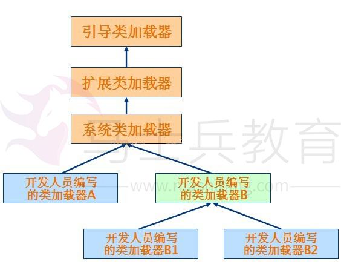

# java classload 机制 详解


类加载器是 Java 语言的一个创新，也是 Java 语言流行的重要原因之一。它使得 Java 类可以被动态加载到 Java 虚拟机中并执行。类加载器从 JDK 1.0 就出现了，最初是为了满足 Java Applet 的需要而开发出来的。Java Applet 需要从远程下载 Java 类文件到浏览器中并执行。现在类加载器在 Web 容器和 OSGi 中得到了广泛的使用。一般来说，Java 应用的开发人员不需要直接同类加载器进行交互。Java 虚拟机默认的行为就已经足够满足大多数情况的需求了。不过如果遇到了需要与类加载器进行交互的情况，而对类加载器的机制又不是很了解的话，就很容易花大量的时间去调试 

ClassNotFoundException 和 NoClassDefFoundError 等异常。本文将详细介绍 Java 的类加载器，帮助读者深刻理解 Java 语言中的这个重要概念。下面首先介绍一些相关的基本概念。 

#    **类加载器基本概念** 

   类加载器（class loader）用来加载 Java 类到 Java 虚拟机中。一般来说，Java 虚拟机使用 Java 类的方式如下：Java 源程序（.java 文件）在经过 Java 编译器编译之后就被转换成 Java 字节代码（.class 文件）。类加载器负责读取 Java 字节代码，并转换成 java.lang.Class 类的一个实例。每个这样的实例用来表示一个 Java 类。通过此实例的 newInstance()方法就可以创建出该类的一个对象。实际的情况可能更加复杂，比如 Java 字节代码可能是通过工具动态生成的，也可能是通过网络下载的。 基本上所有的类加载器都是 java.lang.ClassLoader 类的一个实例。下面详细介绍这个 Java 类。 

#    **java.lang.ClassLoader 类介绍** 

   java.lang.ClassLoader 类的基本职责就是根据一个指定的类的名称，找到或者生成其对应的字节代码，然后从这些字节代码中定义出一个ava 类，即 java.lang.Class 类的一个实例。除此之外，ClassLoader 还负责加载 Java 
应用所需的资源，如图像文件和配置文件等。不过本文只讨论其加载类的功能。为了完成加载类的这个职责，ClassLoader 提供了一系列的方法，比较重要的方法如 表 1 所示。关于这些方法的细节会在下面进行介绍。 


| 方法                                                 | 说明                                                         |
| :--------------------------------------------------- | :----------------------------------------------------------- |
| getParent()                                          | 返回该类加载器的父类加载器                                   |
| loadClass(String name)                               | 加载名称为 name 的类，返回的结果是 java.lang.Class 类的实例  |
| findClass(String name)                               | 查找名称为 name 的类，返回的结果是 java.lang.Class 类的实例  |
| findLoadedClass(String name)                         | 查找名称为 name 的已经被加载过的类，返回的结果是 java.lang.Class 类的实例。 |
| defineClass(String name, byte[] b, int off, int len) | 把字节数组 b 中的内容转换成 Java 类，返回的结果是 java.lang.Class 类的实例。这个方法被声明为 final 的 |
| resolveClass(Class<?> c)                             | 链接指定的 Java 类                                           |

​           表 1. ClassLoader 中与加载类相关的方法 
   对于 表 1 中给出的方法，表示类名称的 name 参数的值是类的二进制名称。需要注意的是内部类的表示，如 
com.example.Sample$1 和 com.example.Sample$Inner 等表示方式。这些方法会在下面介绍类加载器的工作机制时，做进一步的说明。下面介绍类加载器的树状组织结构。 


#    **类加载器的树状组织结构** 

   Java 中的类加载器大致可以分成两类，一类是系统提供的，另外一类则是由 Java 应用开发人员编写的。系统提供的类加载器主要有下面三个： 

- **引导类加载器（bootstrap class loader）**：它用来加载 Java 的核心库，是用原生代码来实现的，并不继承自 

java.lang.ClassLoader。 

- **扩展类加载器（extensions class loader）**：它用来加载 Java 的扩展库。Java 虚拟机的实现会提供一个扩展库目录。该类加载器在此目录里面查找并加载 Java 类。 
- **系统类加载器（system class loader/App classloader）**：它根据 Java 应用的类路径（CLASSPATH）来加载 Java 类。一般来说，Java 应用的类都是由它来完成加载的。可以通过 ClassLoader.getSystemClassLoader() 来获取它。 

   除了系统提供的类加载器以外，开发人员可以通过继承 java.lang.ClassLoader 类的方式实现自己的类加载器，以满足一些特殊的需求。 
   除了引导类加载器之外，***\*所有的类加载器都有一个父类加载器。通过 表 1 中给出的 getParent()\**** ***\*方法可以得到\****。对于系统提供的类加载器来说，system classloader的父类加载器是extensions cloassloader，而extensions cloassloader的父类加载器是bootstrap classloader；对于开发人员编写的类加载器来说，其父类加载器是加载此类加载器 Java 类的类加载器。因为类加载器 Java 类如同其它的 Java 类一样，也是要由类加载器来加载的。一般来说，开发人员编写的类加载器的父类加载器是system classloader。类加载器通过这种方式组织起来，形成树状结构。树的根节点就是bootstrap classloader。图 1 中给出了一个典型的类加载器树状组织结构示意图，其中的箭头指向的是父类加载器。 




图 1. 类加载器树状组织结构示意图 
   代码清单 1 演示了类加载器的树状组织结构。 

```java
<span style="font-size:18px;">public class ClassLoaderTree { 

    public static void main(String[] args) { 
        ClassLoader loader = ClassLoaderTree.class.getClassLoader(); 
        while (loader != null) { 
            System.out.println(loader.getClass().getName()); 
            loader = loader.getParent(); 
        } 
        System.out.println(loader);//最后当loader=null的时候。这个时候loader代表的是引导类加载器BootStrap
    } 
 }</span>
```

输出结果：


```java
sun.misc.Launcher$AppClassLoader
sun.misc.Launcher$ExtClassLoader
null
```

第一个输出的是 `ClassLoaderTree` 类的类加载器，即系统类加载器。它是 `sun.misc.Launcher$AppClassLoader` 类的实例；第二个输出的是扩展类加载器，是 `sun.misc.Launcher$ExtClassLoader` 类的实例。需要注意的是这里并没有输出引导类加载器，这是由于有些 JDK 的实现对于父类加载器是引导类加载器的情况， `getParent()` 方法返回 `null` 。 


   **类加载器的代理模式** 

   在了解了类加载器的树状组织结构之后，下面介绍类加载器的代理模式。
   类加载器在尝试自己去查找某个类的字节代码并定义它时，会先代理给其父类加载器，由父类加载器先去尝试加载这个类，依次类推。在介绍代理模式背后的动机之前，首先需要说明一下 Java 虚拟机是如何判定两个 Java 类是相同的。***\*Java\**** ***\*虚拟机不仅要看类的全名是否相同，还要看加载此类的类加载器是否一样。只有两者都相同的情况，才认为两个类是相同的。即便是同样的字节代码，被不同的类加载器加载之后所得到的类，也是不同的。\****比如一个 Java 类`com.tao.test.`ClassTest，编译之后生成了字节代码文件`ClassTest.class`。两个不同的类加载器`ClassLoaderA`和 `ClassLoaderB`分别读取了这个`ClassTest.class`文件，并定义出两个`java.lang.Class`类的实例来表示这个类。这两个实例是不相同的。对于 Java 虚拟机来说，它们是不同的类。试图对这两个类的对象进行相互赋值，会抛出运行时异常`ClassCastException`。下面通过上面一讲的示例来具体比较


```java
public class Test {
	public static void main(String[] args) throws ClassNotFoundException, InstantiationException, IllegalAccessException {
	    Class clazz1=new MyClassLoader().loadClass("com.tao.test.ClassTest");
	    Class clazz2=new MyClassLoader().loadClass("com.tao.test.ClassTest");
		//这是由不同的类加载器加载的类生成的对象
	    InterfaceTest classTest1=(InterfaceTest) clazz1.newInstance();
	    InterfaceTest classTest2=(InterfaceTest) clazz2.newInstance();
	    //这是Date对象，是由同一个类加载器加载的
	    Date date1=new Date();
	    Date date2=new Date();
	    //比较他们是否是同一个Class类的实例
	    System.out.println(date1.getClass().equals(date2.getClass())); System.out.println(classTest1.getClass().equals(classTest2.getClass()));
	}
}
```

 运行结果：


```java
true
false
```


类加载器是怎么进行委托的呢，我们可以查看下ClassLoader的源码分析下。

因为，在加载一个类的时候，都是调用loadClass()方法，所以具体看下loadClass()方法。


```java
//有两个loadClass()方法，不过最终都是调用第二个方法
public Class<?> loadClass(String name) throws ClassNotFoundException {
        return loadClass(name, false);
    }

//最终调用的loadClass()方法 
protected Class<?> loadClass(String name, boolean resolve)
        throws ClassNotFoundException
    {
        //异步保护，防止重复加载一个相同的类
        synchronized (getClassLoadingLock(name)) {
            // 检测这个类是否被加载了
            Class c = findLoadedClass(name);
            //如果没有被加载，首先让父类去加载
            if (c == null) {
                long t0 = System.nanoTime();
                try {
                    if (parent != null) {//父类加载器不是null，也就是说不是BootStrap加载器
                        c = parent.loadClass(name, false);
                    } else {//父类加载器是BootStrap加载器
                        c = findBootstrapClassOrNull(name);
                    }
                } catch (ClassNotFoundException e) {
                    // ClassNotFoundException thrown if class not found
                    // from the non-null parent class loader
                }
                 //如果经过父类加载器之后，还是null，也就是说父类无法加载，那么再由自己完成加载
                  if (c == null) {
                    // If still not found, then invoke findClass in order
                    // to find the class.
                    long t1 = System.nanoTime();
                    c = findClass(name);//调用自己的findClass()方法
 
                    // this is the defining class loader; record the stats
                    sun.misc.PerfCounter.getParentDelegationTime().addTime(t1 - t0);
                    sun.misc.PerfCounter.getFindClassTime().addElapsedTimeFrom(t1);
                    sun.misc.PerfCounter.getFindClasses().increment();
                }
            }
            if (resolve) {
                resolveClass(c);
            }
            return c;
        }
    }
```


所以，可以很清楚的看到，加载一个类的过程，它是层层的像父类委托，然后在层层的向下加载。用这样的一种委托机制，到底有什么好处呢？为什么要这样做呢？

原因如下：

1、节约系统资源。只要，这个类已经被加载过了，就不会在次加载。

2、保证 Java 核心库的类型安全。所有 Java 应用都至少需要引用 `java.lang.Object`类，也就是说在运行的时候，`java.lang.Object`这个类需要被加载到 Java 虚拟机中。如果这个加载过程由 Java 应用自己的类加载器来完成的话，很可能就存在多个版本的 `java.lang.Object`类，而且这些类之间是不兼容的。通过代理模式，对于 Java 核心库的类的加载工作由引导类加载器来统一完成，保证了 Java 应用所使用的都是同一个版本的 Java 核心库的类，是互相兼容的。

​    下面讨论另外一种类加载器：线程上下文类加载器。 
   **线程上下文类加载器** 
   线程上下文类加载器（context class loader）是从 JDK 1.2 开始引入的。类 java.lang.Thread 中的方法 getContextClassLoader() 和 setContextClassLoader(ClassLoader cl) 用来获取和设置线程的上下文类加载器。如果没有通过 setContextClassLoader(ClassLoader cl)方法进行设置的话，线程将继承其父线程的上下文类加载器。**Java** **应用运行的初始线程的上下文类加载器是系统类加载器。在线程中运行的代码可以通过此类加载器来加载类和资源。** 
   前面提到的类加载器的代理模式并不能解决 Java 应用开发中会遇到的类加载器的全部问题。Java 提供了很多服务提供者接口（Service Provider Interface，SPI），允许第三方为这些接口提供实现。常见的 SPI 有 JDBC、JCE、JNDI、JAXP 和 JBI 等。这些 SPI 的接口由 Java 核心库来提供，如 JAXP 的 SPI 接口定义包含在 javax.xml.parsers 包中。这些 SPI 的实现代码很可能是作为 Java 应用所依赖的 jar 包被包含进来，可以通过类路径（CLASSPATH）来找到，如实现了 JAXP SPI 的 Apache Xerces 所包含的 jar 包。SPI 接口中的代码经常需要加载具体的实现类。如 JAXP 中的 javax.xml.parsers.DocumentBuilderFactory 类中的 newInstance() 方法用来生成一个新的 DocumentBuilderFactory 的实例。这里的实例的真正的类是继承自 
javax.xml.parsers.DocumentBuilderFactory，由 SPI 的实现所提供的。如在 Apache Xerces 中，实现的类是 org.apache.xerces.jaxp.DocumentBuilderFactoryImpl。而问题在于，SPI 的接口是 
Java 核心库的一部分，是由引导类加载器(extension classloader)来加载的；SPI 实现的 Java 类一般是由系统类加载器(system classloader)来加载的。引导类加载器是无法找到 SPI 的实现类的，因为它只加载 Java 的核心库。它也不能代理给系统类加载器，因为它是系统类加载器的祖先类加载器。也就是说，类加载器的代理模式无法解决这个问题。 线程上下文类加载器正好解决了这个问题。如果不做任何的设置，Java 应用的线程的上下文类加载器默认就是系统上下文类加载器。在 SPI 接口的代码中使用线程上下文类加载器，就可以成功的加载到 SPI 实现的类。线程上下文类加载器在很多 SPI 的实现中都会用到。 
   下面介绍另外一种加载类的方法：Class.forName。 
   **Class.forName** 
   Class.forName 是一个静态方法，同样可以用来加载类。该方法有两种形式：

   Class.forName(String name, boolean initialize, ClassLoader loader) 

   Class.forName(String className)。

   第一种形式的参数 name 表示的是类的全名；initialize 表示是否初始化类；loader表示加载时使用的类加载器。第二种形式则相当于设置了参数 initialize 的值为 true，loader 的值为当前类的类加载器。Class.forName 的一个很常见的用法是在加载数据库驱动的时候。如 Class.forName("org.apache.derby.jdbc.EmbeddedDriver").newInstance() 用来加载 Apache Derby 数据库的驱动。 
   在介绍完类加载器相关的基本概念之后，下面介绍如何开发自己的类加载器。 
   **开发自己的类加载器** 
   虽然在绝大多数情况下，系统默认提供的类加载器实现已经可以满足需求。但是在某些情况下，您还是需要为应用开发出自己的类加载器。比如您的应用通过网络来传输 Java 
类的字节代码，为了保证安全性，这些字节代码经过了加密处理。这个时候您就需要自己的类加载器来从某个网络地址上读取加密后的字节代码，接着进行解密和验证，最后定义出要在 Java 虚拟机中运行的类来。下面将通过两个具体的实例来说明类加载器的开发。 


下面，详细的介绍自定义一个类加载器的过程。

一、首先，写出一个接口，然后用一个类实现该接口，该类作为测试类，即我们自定义ClassLoader要加载的类。

接口：


```java
/**
 * 要加载类的接口，加载该接口的子类时，可以用接口引用，而不需要利用反射来实现。
 */
public interface InterfaceTest {
	public void name();
	public void age();
}
```

测试类：


```java
/**
 * 测试类，自定义类加载器去加载该类
 */
public class ClassTest implements InterfaceTest{

	@Override
	public void name() {
		System.out.println("tao");
	}
 
	@Override
	public void age() {
		System.out.println("21");
	}
 
}
```

二、自定义一个加密类，用来加密测试类的字节码文件。


到我们要加密的.class文件的位置：E:\workspace.fu\ClassLoaderTest\bin\com\tao\test\ClassTest.class

加密后的.class文件要存储的位置，这里将它直接放到E盘根目录：E:\ClassTest.class

```java
/**
 * 用加密算法生成要隐藏的字节码文件
 */
public class ClassEncrypt extends MyClassLoader{
	public static void main(String[] args) throws IOException {
		//要加密的字节码.class文件
		String srcPath="E:/workspace.fu/ClassLoaderTest/bin/com/tao/test/ClassTest.class";
		//加密之后输出的字节码.class文件的位置
		String destPath="E:/ClassTest.class";
		FileInputStream fis=new FileInputStream(srcPath);
		FileOutputStream ofs=new FileOutputStream(destPath);
		cypher(fis, ofs);//加密
		fis.close();
		ofs.close();
	}
	
	//简单的加密，用于测试。将所有二进制位取反，即0变成1，1变成0
	private static void cypher(InputStream in,OutputStream out) throws IOException{
		int b=-1;
		while((b=in.read())!=-1){
			out.write(b^0xff);
		}
	}
}
```

运行该类，那么，我们就已经对ClassTest.class文件加密成功，打开E盘，可以发现根目录下已经有了一个ClassTest.class文件。


可以将E:\workspace.fu\ClassLoaderTest\bin\com\tao\test的ClassTest.class文件删除，并且删除ClassTest.java文件和加密类ClassEncrypt.java。

三、编写我们自己的类加载器，必须继承ClassLoader，然后覆盖findClass()方法。

ClassLoader超类的loadClass方法用于将类的加载操作委托给父类加载器去进行，只有该类尚未加载并且父类加载器也无法加载该类时，才调用findClass()方法。

如果要实现该方法，必须做到以下几点：

（1）、为来自本地文件系统或者其他来源的类加载其字节码

（2）、调用ClassLoader超类的defineClass()方法，向虚拟机提供字节码

```java
/**
 * 自定义的类加载器
 */
public class MyClassLoader extends ClassLoader{
	
	/**
	 * 因为类加载器是基于委托机制，所以我们只需要重写findClass方法。
	 * 它会自动向父类加载器委托，如果父类没有找到，就会再去调用我们重写的findClass方法加载
	 */
	@Override

	protected Class<?> findClass(String name) throws ClassNotFoundException {
        try {
			//需要加载的.class字节码的位置
			String classPath="E:/ClassTest.class";
			
			FileInputStream fis=new FileInputStream(classPath);
			ByteArrayOutputStream bos=new ByteArrayOutputStream();
			cypher(fis, bos);
			fis.close();
			byte[] bytes=bos.toByteArray();
			return defineClass(bytes, 0, bytes.length);
		} catch (FileNotFoundException e) {
			e.printStackTrace();
		} catch (IOException e) {
			e.printStackTrace();
		}
		return super.findClass(name);
	}
	
    //相应的字节码解密类，在加载E盘根目录下的被加密过的ClassTest.class字节码的时候，进行相应的解密。
    private static void cypher(InputStream in,OutputStream out) throws IOException{
		int b=-1;
		while((b=in.read())!=-1){
			out.write(b^0xff);
		}
	}
}
```

四、最后写一个测试类，测试我们的类加载器

```java
public class Test {
	public static void main(String[] args) throws ClassNotFoundException, InstantiationException, IllegalAccessException {
		Class clazz=new MyClassLoader().loadClass("com.tao.test.ClassTest");
            //这就是我们接口的作用。如果没有接口，就需要利用反射来实现了。
            InterfaceTest classTest=(InterfaceTest) clazz.newInstance();
	    classTest.name();
	    classTest.age();
	}
}
```

​    在介绍完如何开发自己的类加载器之后，下面说明类加载器和 Web 容器的关系。 
​    **类加载器与 Web 容器** 
   　对于运行在 Java EE? 容器中的 Web 应用来说，类加载器的实现方式与一般的 Java 应用有所不同。不同的 Web 容器的实现方式也会有所不同。以 Apache Tomcat 来说，每个 Web 
应用都有一个对应的类加载器实例。**该类加载器也使用代理模式，所不同的是它是首先尝试去加载某个类，如果找不到再代理给父类加载器。这与一般类加载器的顺序是相反的。这是** ***\*Java Servlet 规范中的推荐做法，其目的是使得 Web 应用自己的类的优先级高于 Web 容器提供的类。这种代理模式的一个例外是：Java\** \**核心库的类是不在查找范围之内的。这也是为了保证 Java 核心库的类型安全。\**** 绝大多数情况下，Web 应用的开发人员不需要考虑与类加载器相关的细节。下面给出几条简单的原则： 

-    每个 Web 应用自己的 Java 类文件和使用的库的 jar 包，分别放在 WEB-INF/classes 和 WEB-INF/lib 目录下面。 
-    多个应用共享的 Java 类文件和 jar 包，分别放在 Web 容器指定的由所有 Web 应用共享的目录下面。 
-    当出现找不到类的错误时，检查当前类的类加载器和当前线程的上下文类加载器是否正确。 

   在介绍完类加载器与 Web 容器的关系之后，下面介绍它与 OSGi 的关系。 
   **类加载器与 OSGi** 
   OSGi 是 Java 上的动态模块系统。它为开发人员提供了面向服务和基于组件的运行环境，并提供标准的方式用来管理软件的生命周期。OSGi 已经被实现和部署在很多产品上，在开源社区也得到了广泛的支持。Eclipse 就是基于 OSGi 技术来构建的。 
   OSGi 中的每个模块（bundle）都包含 Java 包和类。模块可以声明它所依赖的需要导入（import）的其它模块的 Java 包和类（通过 Import-Package），也可以声明导出（export）自己的包和类，供其它模块使用（通过 Export-Package）。也就是说需要能够隐藏和共享一个模块中的某些 Java 包和类。这是通过 OSGi 特有的类加载器机制来实现的***\*。OSGi 中的每个模块都有对应的一个类加载器。它负责加载模块自己包含的 Java 包和类。当它需要加载 Java\****  ***\**\*核心库的类时（以 java 开头的包和类），它会代理给父类加载器（通常是启动类加载器）来完成。当它需要加载所导入的 Java 类时，它会代理给导出此\*\* \*\*Java 类的模块来完成加载。模块也可以显式的声明某些 Java 包和类，必须由父类加载器来加载。只需要设置系统属性\*\* \*\*org.osgi.framework.bootdelegation 的值即可。\*\**\*** 
   假设有两个模块 bundleA 和 bundleB，它们都有自己对应的类加载器 classLoaderA 和 classLoaderB。在 bundleA 中包含类 com.bundleA.Sample，并且该类被声明为导出的，也就是说可以被其它模块所使用的。bundleB 声明了导入  bundleA 提供的类 com.bundleA.Sample，并包含一个类 com.bundleB.NewSample 继承自 com.bundleA.Sample。在 bundleB 启动的时候，其类加载器 classLoaderB 需要加载类 com.bundleB.NewSample，进而需要加载类 com.bundleA.Sample。由于 bundleB 声明了类 com.bundleA.Sample 是导入的，classLoaderB 把加载类 com.bundleA.Sample 的工作代理给导出该类的  bundleA 的类加载器 classLoaderA。classLoaderA 在其模块内部查找类 com.bundleA.Sample 并定义它，所得到的类 com.bundleA.Sample 实例就可以被所有声明导入了此类的模块使用。对于以 java 开头的类，都是由父类加载器来加载的。如果声明了系统属性 org.osgi.framework.bootdelegation=com.example.core.*，那么对于包 com.example.core 中的类，都是由父类加载器来完成的。 
   OSGi 模块的这种类加载器结构，使得一个类的不同版本可以共存在 Java 虚拟机中，带来了很大的灵活性。不过它的这种不同，也会给开发人员带来一些麻烦，尤其当模块需要使用第三方提供的库的时候。下面提供几条比较好的建议： 

- 如果一个类库只有一个模块使用，把该类库的 jar 包放在模块中，在 Bundle-ClassPath 中指明即可。 
- 如果一个类库被多个模块共用，可以为这个类库单独的创建一个模块，把其它模块需要用到的 Java 包声明为导出的。其它模块声明导入这些类。

   　如果类库提供了 SPI 接口，并且利用线程上下文类加载器来加载 SPI 实现的 Java 类，有可能会找不到 Java 类。如果出现了  NoClassDefFoundError 异常，首先检查当前线程的上下文类加载器是否正确。通过 Thread.currentThread().getContextClassLoader() 就可以得到该类加载器。该类加载器应该是该模块对应的类加载器。如果不是的话，可以首先通过 class.getClassLoader() 
来得到模块对应的类加载器，再通过 Thread.currentThread().setContextClassLoader()  来设置当前线程的上下文类加载器。 
   　***\*总结\**** 
   　类加载器是 Java 语言的一个创新。它使得动态安装和更新软件组件成为可能。本文详细介绍了类加载器的相关话题，包括基本概念、代理模式、线程上下文类加载器、与 Web 容器和 OSGi 的关系等。开发人员在遇到 ClassNotFoundException 和 NoClassDefFoundError  等异常的时候，应该检查抛出异常的类的类加载器和当前线程的上下文类加载器，从中可以发现问题的所在。在开发自己的类加载器的时候，需要注意与已有的类加载器组织结构的协调。