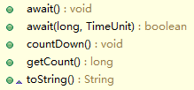

# java线程池主线程等待子线程执行完成

# Java如何等待子线程执行结束

今天讨论一个入门级的话题, 不然没东西更新对不起空间和域名~~

工作总往往会遇到异步去执行某段逻辑, 然后先处理其他事情, 处理完后再把那段逻辑的处理结果进行汇总的产景, 这时候就需要使用线程了.

一个线程启动之后, 是异步的去执行需要执行的内容的, 不会影响主线程的流程,  往往需要让主线程指定后, 等待子线程的完成. 这里有几种方式.

站在 主线程的角度, 我们可以分为主动式和被动式.

主动式指主线主动去检测某个标志位, 判断子线程是否已经完成. 被动式指主线程被动的等待子线程的结束, 很明显, 比较符合人们的胃口. 就是你事情做完了, 你告诉我, 我汇总一下, 哈哈.

那么主线程如何等待子线程工作完成呢. 很简单, Thread 类给我们提供了join 系列的方法, 这些方法的目的就是等待当前线程的die. 举个例子.

**public**  **class**  Threads **{**

​    **public**  **static**  **void**  main (String[]  args ) {

​      SubThread **thread**  =  **new**  SubThread () ;

​     thread . start () ;

​     //主线程处理其他工作,让子线程异步去执行.

​      *mainThreadOtherWork* () ;

​      System . *out* . println ( “now waiting sub thread done.” ) ;

​     //主线程其他工作完毕,等待子线程的结束, 调用join系列的方法即可(可以设置超时时间)

​      **try**  {

​       thread . join () ;

​     }  **catch**  **(** InterruptedException **e) {**

​       e . printStackTrace () ;

​     }

​     System . *out* . println ( “now all done.” ) ;

   }

​    **private**  **static**  **void**  mainThreadOtherWork () {

​     System . *out* . println ( “main thread work start” ) ;

​      **try**  {

​        Thread . *sleep* ( 3000L ) ;

​     }  **catch**  **(** InterruptedException **e) {**

​       e . printStackTrace () ;

​     }

​      System . *out* . println ( “main thread work done.” ) ;

   }

​    **public**  **static**  **class**  SubThread  **extends**  Thread**{**

​      @Override

​      **public**  **void**  run () {

​        working () ;

​     }

​      **private**  **void**  working () {

​        System . *out* . println ( “sub thread start working.” ) ;

​        busy () ;

​        System . *out* . println ( “sub thread stop working.” ) ;

​     }

​      **private**  **void**  busy () {

​        **try**  {

​           *sleep* ( 5000L ) ;

​       }  **catch**  **(** InterruptedException **e) {**

​          e . printStackTrace () ;

​       }

​     }

​     

   }

}

本程序的数据有可能是如下:

> 1. main thread work start
> 2. sub thread start working.
> 3. main thread work done.
> 4. now waiting sub thread done.
> 5. sub thread stop working.
> 6. now all done.

忽略标号, 当然输出也有可能是1和2调换位置了. 这个我们是无法控制的. 我们看下线程的join操作, 究竟干了什么.

**
**

   **public**  **final**  **void**  join()  **throws**  InterruptedException {

   join(0) ;

  }

这里是调用了

   **public** **final** **synchronized** **void** join( **long** millis) 

方法, 参数为0, 表示没有超时时间, 等到线程结束为止. join(millis)方法里面有这么一段代码:

​     **while** (isAlive()) {

​     wait(0) ;

​     }

说明, 当线程处于活跃状态的时候, 会一直等待, 直到这里的isAlive方法返回false, 才会结束.isAlive方法是一个本地方法, 他的作用是判断线程是否已经执行结束. 注释是这么写的: 

Tests if this thread is alive. A thread is alive if it has been started and has not yet died.

可见, join系列方法可以帮助我们等待一个子线程的结束.

那么要问, 有没有另外一种方法可以等待子线程结束? 当然有的, 我们可以使用并发包下面的Future模式.

Future是一个任务执行的结果, 他是一个将来时, 即一个任务执行, 立即异步返回一个Future对象, 等到任务结束的时候, 会把值返回给这个future对象里面. 我们可以使用ExecutorService接口来提交一个线程.

**public**  **class**  Threads {

​    **static**  ExecutorService  *executorService*  =  Executors . *newFixedThreadPool* ( 1 ) ;

   

​    @SuppressWarnings ( “rawtypes” )

​    **public**  **static**  **void**  main (String[]  args )  **throws**  InterruptedException ,  ExecutionException {

​     SubThread thread  =  **new**  SubThread () ;

//    thread.start();

​      Future  future  =  *executorService* . submit (thread) ;

​      *mainThreadOtherWork* () ;

​     System . *out* . println ( “now waiting sub thread done.” ) ;

​     future . get () ;

//    try {

//      thread.join();

//    } catch (InterruptedException e) {

//      e.printStackTrace();

//    }

​     System . *out* . println ( “now all done.” ) ;

​      *executorService* . shutdown () ;

   }

​    **private**  **static**  **void**  mainThreadOtherWork () {

​     System . *out* . println ( “main thread work start” ) ;

​      **try**  {

​       Thread . *sleep* ( 3000L ) ;

​     }  **catch**  (InterruptedException e) {

​       e . printStackTrace () ;

​     }

​     System . *out* . println ( “main thread work done.” ) ;

   }

​    **public**  **static**  **class**  SubThread  **extends**  Thread{

​      @Override

​      **public**  **void**  run () {

​        working () ;

​     }

​      **private**  **void**  working () {

​       System . *out* . println ( “sub thread start working.” ) ;

​        busy () ;

​       System . *out* . println ( “sub thread stop working.” ) ;

​     }

​      **private**  **void**  busy () {

​        **try**  {

​           *sleep* ( 5000L ) ;

​       }  **catch**  (InterruptedException e) {

​          e . printStackTrace () ;

​       }

​     }

​     

   }

   

}

这 里, ThreadPoolExecutor 是实现了 ExecutorService的方法, sumbit的过程就是把一个Runnable接口对象包装成一个 Callable接口对象, 然后放到 workQueue里等待调度执行. 当然, 执行的启动也是调用了thread的start来做到的, 只不过这里被包装掉了. 另外, 这里的thread是会被重复利用的, 所以这里要退出主线程, 需要执行以下shutdown方法以示退出使用线程池. 扯远了. 

这 种方法是得益于Callable接口和Future模式, 调用future接口的get方法, 会同步等待该future执行结束, 然后获取到结果. Callbale接口的接口方法是 V call(); 是可以有返回结果的, 而Runnable的 void run(), 是没有返回结果的. 所以, 这里即使被包装成Callbale接口, future.get返回的结果也是null的.如果需要得到返回结果, 建议使用Callable接口.

通过队列来控制线程的进度, 是很好的一个理念. 我们完全可以自己搞个队列, 自己控制. 这样也可以实现. 不信看代码:

***\*public class\** Threads {**

//  static ExecutorService executorService = Executors.newFixedThreadPool(1);

   **static final** BlockingQueue < Integer > *queue* = **new** ArrayBlockingQueue < Integer > ( 1 ) ;

   **public static void** main (String[] args ) **throws** InterruptedException , ExecutionException {

​     SubThread thread = **new** SubThread ( *queue* ) ;

​     thread . start () ;

//    Future future = executorService.submit(thread);

​      *mainThreadOtherWork* () ;

​     System . *out* . println ( “now waiting sub thread done.” ) ;

//    future.get();

​      *queue* . take () ;

//    try {

//      thread.join();

//    } catch (InterruptedException e) {

//      e.printStackTrace();

//    }

​     System . *out* . println ( “now all done.” ) ;

//    executorService.shutdown();

   }

   **private static void** mainThreadOtherWork () {

​     System . *out* . println ( “main thread work start” ) ;

​      **try** {

​       Thread . *sleep* ( 3000L ) ;

​     } **catch** (InterruptedException e) {

​       e . printStackTrace () ;

​     }

​     System . *out* . println ( “main thread work done.” ) ;

   }

   **public static class** SubThread **extends** Thread{

​     

​      **private** BlockingQueue < Integer > queue ;

​     

​      /**

​      \* **@param** queue

​      */

​      **public** SubThread ( BlockingQueue < Integer > queue ) {

​        **this** . queue = queue ;

​     }

​      @Override

​      **public void** run () {

​        **try** {

​        working () ;

​       } **finally** {

​          **try** {

​             queue . put ( 1 ) ;

​          } **catch** (InterruptedException e) {

​            e . printStackTrace () ;

​          }

​       }

​       

​     }

​      **private void** working () {

​       System . *out* . println ( “sub thread start working.” ) ;

​        busy () ;

​       System . *out* . println ( “sub thread stop working.” ) ;

​     }

​      **private void** busy () {

​        **try** {

​          *sleep* ( 5000L ) ;

​       } **catch** (InterruptedException e) {

​          e . printStackTrace () ;

​       }

​     }

​     

   }

   

}

这 里是得益于我们用了一个阻塞队列, 他的put操作和take操作都会阻塞(同步), 在满足条件的情况下.当我们调用take()方法是, 由于子线程还没结束, 队列是空的, 所以这里的take操作会阻塞, 直到子线程结束的时候, 往队列里面put了个元素, 表明自己结束了. 这时候主线程的take()就会返回他拿到的数据. 当然, 他拿到什么我们是不必去关心的.

以上几种情况都是针对子线程只有1个的时候. 当子线程有多个的时候, 情况就不妙了.

第一种方法, 你要调用很多个线程的join, 特别是当你的线程不是for循环创建的, 而是一个一个创建的时候.

第二种方法, 要调用很多的future的get方法, 同第一种方法.

第三种方法, 比较方便一些, 只需要每个线程都在queue里面 put一个元素就好了.但是, 第三种方法, 这个队列里的对象, 对我们是毫无用处, 我们为了使用队列, 而要不明不白浪费一些内存, 那有没有更好的办法呢?

有的, concurrency包里面提供了好多有用的东东, 其中, CountDownLanch就是我们要用的.

CountDownLanch 是一个倒数计数器, 给一个初始值(>=0), 然后没countDown一次就会减1, 这很符合等待多个子线程结束的产景: 一个线程结束的时候, countDown一次, 直到所有都countDown了 , 那么所有子线程就都结束了.

先看看CountDownLanch有哪些方法:

await: 会阻塞等待计数器减少到0位置. 带参数的await是多了等待时间.

countDown: 将当前的技术减1

getCount(): 返回当前的计数

显而易见, 我们只需要在子线程执行之前, 赋予初始化countDownLanch, 并赋予线程数量为初始值.

每个线程执行完毕的时候, 就countDown一下.主线程只需要调用await方法, 可以等待所有子线程执行结束, 看代码:

**public** **class** Threads {

//  static ExecutorService executorService = Executors.newFixedThreadPool(1);

   **static** **final** BlockingQueue < Integer > *queue* = **new** ArrayBlockingQueue < Integer > ( 1 ) ;

   **public** **static** **void** main (String[] args ) **throws** InterruptedException , ExecutionException {

​      **int** threads = 5 ;

​     CountDownLatch countDownLatch = **new** CountDownLatch (threads) ;

​      **for** ( **int** i = 0 ; i < threads ; i ++ ){

​       SubThread thread = **new** SubThread ( 2000 * (i + 1 ) , countDownLatch) ;

​       thread . start () ;

​     }

//    Future future = executorService.submit(thread);

​      *mainThreadOtherWork* () ;

​     System . *out* . println ( “now waiting sub thread done.” ) ;

//    future.get();

//    queue.take();

​     countDownLatch . await () ;

//    try {

//      thread.join();

//    } catch (InterruptedException e) {

//      e.printStackTrace();

//    }

​     System . *out* . println ( “now all done.” ) ;

//    executorService.shutdown();

   }

   **private** **static** **void** mainThreadOtherWork () {

​     System . *out* . println ( “main thread work start” ) ;

​      **try** {

​       Thread . *sleep* ( 3000L ) ;

​     } **catch** (InterruptedException e) {

​       e . printStackTrace () ;

​     }

​     System . *out* . println ( “main thread work done.” ) ;

   }

   **public** **static** **class** SubThread **extends** Thread{

​     

//    private BlockingQueue<Integer> queue;

​      **private** CountDownLatch countDownLatch ;

​      **private** **long** work ;

​     

​      /**

​      \* **@param** queue

​      */

//    public SubThread(BlockingQueue<Integer> queue) {

//      this.queue = queue;

//      this.work = 5000L;

//    }

​     

​      **public** SubThread ( **long** work , CountDownLatch countDownLatch ) {

//      this.queue = queue;

​        **this** . countDownLatch = countDownLatch ;

​        **this** . work = work ;

​     }

​      @Override

​      **public** **void** run () {

​        **try** {

​        working () ;

​       } **finally** {

//         try {

//           queue.put(1);

//         } catch (InterruptedException e) {

//           e.printStackTrace();

//         }

​          countDownLatch . countDown () ;

​       }

​       

​     }

​      **private** **void** working () {

​       System . *out* . println ( getName () + ” sub thread start working.” ) ;

​        busy () ;

​       System . *out* . println ( getName () + ” sub thread stop working.” ) ;

​     }

​      **private** **void** busy () {

​        **try** {

​          *sleep* ( work ) ;

​       } **catch** (InterruptedException e) {

​          e . printStackTrace () ;

​       }

​     }

​     

   }

}

此种方法也适用于使用 ExecutorService summit 的任务的执行.

另外还有一个并发包的类CyclicBarrier, 这个是(子)线程之间的互相等待的利器. 栅栏, 就是把大家都在一个地方堵住, 就像水闸, 等大家都完成了之前的操作, 在一起继续下面的操作. 不过就不再本篇的讨论访问内了.