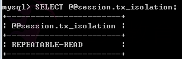
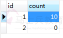
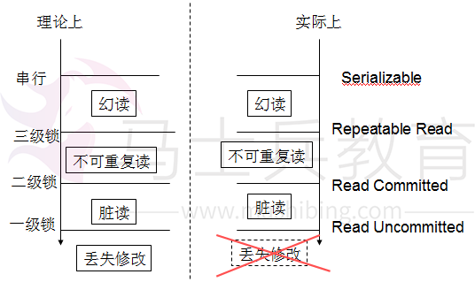
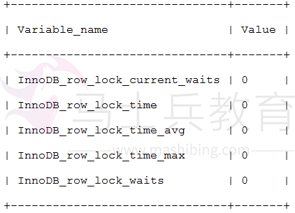
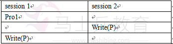

# mysql的锁--行锁，表锁，乐观锁，悲观锁


**一 引言--为什么mysql提供了锁**

　　最近看到了mysql有行锁和表锁两个概念，越想越疑惑。为什么mysql要提供锁机制，而且这种机制不是一个摆设，还有很多人在用。在现代数据库里几乎有事务机制，acid的机制应该能解决并发调度的问题了，为什么还要主动加锁呢？

　　后来看到一篇，“防止更新丢失，并不能单靠数据库事务控制器来解决，需要应用程序对要更新的数据**加必要的锁**来解决”。瞬间，世界观都崩塌了。非常不敢相信，于是自己写了代码检验一下。

　　数据库表是这样的。用count字段来做100次累加。


　　为了保证实验的科学性，先确认了数据库是InnoDB的，这样才有事务机制；也确认了隔离性级别



定义一个任务，读count值--程序count++--写数据库


```
public class LostUpdate implements Runnable{
    private CountDownLatch countDown;
    public LostUpdate(CountDownLatch countDown){
        this.countDown = countDown;
    }
    
    @Override
    public void run() {
        Connection conn=null;
        try {
            Class.forName("com.mysql.jdbc.Driver");
            conn = DriverManager.getConnection("jdbc:mysql://localhost:3306/test?useUnicode=true&characterEncoding=UTF-8",
                    "root", "123");
        } catch (Exception e) {
            e.printStackTrace();
            return;
        }
        
        try {
            conn.setAutoCommit(false);
            //不加锁的情况
            PreparedStatement ps =conn.prepareStatement("select * from LostUpdate where id =1");
            //加锁的情况
            //PreparedStatement ps =conn.prepareStatement("select * from LostUpdate where id =1 for update");
            ResultSet rs=ps.executeQuery();
            int count = 0;
            while(rs.next()){
                count= rs.getInt("count");
            }
            
            count++;
            ps =conn.prepareStatement("update LostUpdate set count=? where id =1");
            ps.setInt(1, count);
            ps.executeUpdate();
            
            conn.commit();
        } catch (Exception e) {
            try {
                conn.rollback();
            } catch (SQLException e1) {
                e1.printStackTrace();
            }
            e.printStackTrace();
        }
        //表示一次任务完成
        countDown.countDown();
    }
}
```


 主线程下创建子线程，模拟多线程环境


```
public class TestLock {    
    public static void main(String[] args) throws InterruptedException {
        //创建线程池，里面有10个线程，共执行100次+1操作
        final int THREAD_COUNT=10;
        final int RUN_TIME=100;
        
        ExecutorService threadPool=Executors.newFixedThreadPool(THREAD_COUNT);
        //用CountDownLatch保证主线程等待所有任务完成
        CountDownLatch count=new CountDownLatch(RUN_TIME);
        
        for(int i=0;i<RUN_TIME;i++)
            threadPool.execute(new LostUpdate(count));
        
        threadPool.shutdown();
        count.await();
        //提示所有任务执行完
        System.out.println("finish");
    }
}
```


运行结果是：



　　大概解释一下程序，就是创建了一个线程池，里面10个线程，执行100次任务。每个任务就是 读count值--程序count++--写数据库，经典的银行存款（丢失修改）问题。事实胜于雄辩，结论就是上面的橙色字，解决丢失修改不能靠事务，要加必要的锁，所以数据库提供的锁不是个摆设。

 

**二 数据库事务机制**

　　为了找到问题的根源，为了拯救我崩溃的世界观，我又去回顾了数据库事务的知识。

　　**数据库的acid属性**

- 原性性（Actomicity）：事务是一个原子操作单元，其对数据的修改，要么全都执行，要么全都不执行。
- 一致性（Consistent）：在事务开始和完成时，数据都必须保持一致状态。这意味着所有相关的数据规则都必须应用于事务的修改，以操持完整性；事务结束时，所有的内部数据结构（如B树索引或双向链表）也都必须是正确的。
- 隔离性（Isolation）：数据库系统提供一定的隔离机制，保证事务在不受外部并发操作影响的“独立”环境执行。这意味着事务处理过程中的中间状态对外部是不可见的，反之亦然。
- 持久性（Durable）：事务完成之后，它对于数据的修改是永久性的，即使出现系统故障也能够保持。

　　说好的一致性呢，童话里都是骗人的！！　　

　　**事务并发调度的问题**

1. 脏读（dirty read）：A事务读取B事务尚未提交的更改数据，并在这个数据基础上操作。如果B事务回滚，那么A事务读到的数据根本不是合法的，称为脏读。在oracle中，由于有version控制，不会出现脏读。
2. 不可重复读（unrepeatable read）：A事务读取了B事务已经提交的更改（或删除）数据。比如A事务第一次读取数据，然后B事务更改该数据并提交，A事务再次读取数据，两次读取的数据不一样。
3. 幻读（phantom read）：A事务读取了B事务已经提交的新增数据。注意和不可重复读的区别，这里是新增，不可重复读是更改（或删除）。这两种情况对策是不一样的，对于不可重复读，只需要采取行级锁防止该记录数据被更改或删除，然而对于幻读必须加表级锁，防止在这个表中新增一条数据。
4. 第一类丢失更新：A事务撤销时，把已提交的B事务的数据覆盖掉。
5. 第二类丢失更新：A事务提交时，把已提交的B事务的数据覆盖掉。

　　**三级封锁协议**

1. 一级封锁协议：事务T中如果对数据R有写操作，必须在这个事务中对R的第一次读操作前对它加X锁，直到事务结束才释放。事务结束包括正常结束（COMMIT）和非正常结束（ROLLBACK）。
2. 二级封锁协议：一级封锁协议加上事务T在读取数据R之前必须先对其加S锁，读完后方可释放S锁。 
3. 三级封锁协议 ：一级封锁协议加上事务T在读取数据R之前必须先对其加S锁，直到事务结束才释放。

　　可见，三级锁操作一个比一个厉害（满足高级锁则一定满足低级锁）。但有个非常致命的地方，一级锁协议就要在第一次读加x锁，直到事务结束。几乎就要在整个事务加写锁了，效率非常低。三级封锁协议只是一个理论上的东西，实际数据库常用另一套方法来解决事务并发问题。

　　**隔离性级别**

　　mysql用意向锁（另一种机制）来解决事务并发问题，为了区别封锁协议，弄了一个新概念隔离性级别：包括Read Uncommitted、Read Committed、Repeatable Read、Serializable。mysql 一般默认Repeatable Read。

　



　　终于发现自己为什么会误会事务能解决丢失修改了。至于为什么隔离性级别不解决丢失修改，我猜是有更好的解决方案吧。

　　总结一下，repeatable read能解决脏读和不可重复读，但不嗯呢该解决丢失修改。

　　

**三 mysql的行锁和表锁**

　　说了那么久，终于入正题了，先来说说什么是行锁和表锁。

- 表级锁：每次操作锁住整张表。开销小，加锁快；不会出现死锁；锁定粒度大，发生锁冲突的概率最高，并发度最低；
- 行级锁：每次操作锁住一行数据。开销大，加锁慢；会出现死锁；锁定粒度最小，发生锁冲突的概率最低，并发度也最高；
- 页面锁：开销和加锁时间界于表锁和行锁之间；会出现死锁；锁定粒度界于表锁和行锁之间，并发度一般。没弄懂，有空再看。？

**1 MyISAM的锁**

　　稍微提一下MyISAM，只说和InnoDB不同的。

　　a. MyISAM只有表锁，锁又分为读锁和写锁。　


　　b. 没有事务，不用考虑并发问题，世界和平~

　　c. 由于锁的粒度太大，所以当该表写并发量较高时，要等待的查询就会很多了。

**2 InnoDB的行锁和表锁**

　　没有特定的语法。mysql的行锁是通过索引体现的。

　　如果where条件中只用到索引项，则加的是行锁；否则加的是表锁。比如说主键索引，唯一索引和聚簇索引等。如果sql的where是全表扫描的，想加行锁也爱莫能助。

　　行锁和表锁对我们编程有什么影响，要在where中尽量只用索引项，否则就会触发表锁。另一个可能是，我们发疯了地想优化查询，但where子句中就是有非索引项，于是我们自己写连接？

　　行锁和表锁各适合怎么样的应用，待求证？。

**3 读锁和写锁**

　　InnoDB用意向锁？实现隔离性级别，原理未名，贴张图：


　　回想锁协议，对什么操作加什么锁是一个问题，加锁加到什么时候有是一个问题。锁协议里常常会看到“加锁直到事务结束”的烦心字样。而在InnoDB中，select,insert,update,delete等语句执行时都会自动加解锁。select的锁一般执行完就释放了，修改操作的X锁会持有到事务结束，效率高很多。至于详细的加锁原理，见[这里](http://blog.csdn.net/xifeijian/article/details/20313977)，搜“InnoDB存储引擎中不同SQL在不同隔离级别下锁比较”

　　mysql也给用户提供了加锁的机会，只要在sql后加LOCK IN SHARE MODE 或FOR UPDATE

　　共享锁（S）：SELECT * FROM table_name WHERE ... LOCK IN SHARE MODE
　　排他锁（X）：SELECT * FROM table_name WHERE ... FOR UPDATE

　　值得注意的是，自己加的锁没有释放锁的语句，所以锁会持有到事务结束。

　　mysql 还提供了LOCK TABLES，UNLOCK TABLES，用于加表锁，怎么用还不太清楚？

**4 考察加锁的情况**

　　加了读锁还是写锁，加了行锁还是表锁，说什么时候释放，可以从原理上分析。但刚开始时我不太懂原理，于是又写了个程序。


```
public class ForUpdate1  implements Runnable{
    private CountDownLatch countDown;
    public ForUpdate1(CountDownLatch countDown){
        this.countDown = countDown;
    }
    @Override
    public void run() {
        Connection conn=null;
        try {
            Class.forName("com.mysql.jdbc.Driver");
            conn = DriverManager.getConnection("jdbc:mysql://localhost:3306/test?useUnicode=true&characterEncoding=UTF-8",
                    "root", "123");
        } catch (Exception e) {
            e.printStackTrace();
            return;
        }
        
        try {
            conn.setAutoCommit(false);
            /*PreparedStatement ps =conn.prepareStatement("select * from LostUpdate where id =1 for update");
            ps.executeQuery();*/        
            PreparedStatement ps =conn.prepareStatement("update LostUpdate set count =1 where id =1");
            ps.executeUpdate();
            Thread.sleep(10000);
            
            conn.commit();
            System.out.println("test 1 finish");
            countDown.countDown();
        } catch (Exception e) {
            try {
                conn.rollback();
            } catch (SQLException e1) {
                e1.printStackTrace();
            }
            e.printStackTrace();
        }    
    }
}
```


```
public class ForUpdate2  implements Runnable{
    private CountDownLatch countDown;
    public ForUpdate2(CountDownLatch countDown){
        this.countDown = countDown;
    }
    
    @Override
    public void run() {
        Connection conn=null;
        try {
            Class.forName("com.mysql.jdbc.Driver");
            conn = DriverManager.getConnection("jdbc:mysql://localhost:3306/test?useUnicode=true&characterEncoding=UTF-8",
                    "root", "123");
        } catch (Exception e) {
            e.printStackTrace();
            return;
        }
        
        try {
            Thread.sleep(2000);
            conn.setAutoCommit(false);
            PreparedStatement ps =conn.prepareStatement("select * from LostUpdate where id =1 for update");
            ps.executeQuery();
            /*PreparedStatement ps =conn.prepareStatement("update LostUpdate set count =1 where id =1");
            ps.executeUpdate();*/        
            
            conn.commit();
            System.out.println("test 2 finish");
            countDown.countDown();
        } catch (Exception e) {
            try {
                conn.rollback();
            } catch (SQLException e1) {
                e1.printStackTrace();
            }
            e.printStackTrace();
        }    
    }
}
```


```
public class TestForUpdate {    
    public static void main(String[] args) throws InterruptedException {
        final int THREAD_COUNT=10;
        
        ExecutorService threadPool=Executors.newFixedThreadPool(THREAD_COUNT);
        CountDownLatch count=new CountDownLatch(2);
        
        threadPool.execute(new ForUpdate1(count));
        threadPool.execute(new ForUpdate2(count));
        
        threadPool.shutdown();
        count.await();
        System.out.println("finish");
    }
}
```


　　只有两个线程，ForUpdate1先执行sql语句之后等10s，ForUpdate2先等待2s再执行sql语句。所以如果ForUpdate1持有锁，而且ForUpdate2等待，输出就应该是test 1 finish->test 2 finish->finish；否则就是test 2 finish->test 1 finish->finish。

　　这个程序改一下能测试上面说的理论：

- repeatable read能解决脏读和不可重复读
- 比如行锁真的只锁住一行
- s，x，is和ix的关系

　　判断加锁情况，mysql应该有工具，但没找到？

　　可以通过检查InnoDB_row_lock状态变量来分析系统上的行锁的争夺情况：
　　mysql> show status like 'innodb_row_lock%';



　　如果发现锁争用比较严重，如InnoDB_row_lock_waits和InnoDB_row_lock_time_avg的值比较高，还可以通过设置InnoDB Monitors来进一步观察发生锁冲突的表、数据行等，并分析锁争用的原因。不明觉厉？，看[这篇](http://blog.csdn.net/xifeijian/article/details/20313977)

　　总结一下这一章，mysql提供了行锁和表锁，我们写语句时应该尽量启动行锁，以提高效率；另一方面，也说了一下读锁和写锁的原理。好了武器（原理）我们都懂了，那就看怎么优化了。

 

**四 解决丢失修改--乐观锁和悲观锁**

　　首先为什么要加锁，加锁就是为了解决丢失修改（也不知道这么说对不对）。如果一个事务中只有一句sql，数据库是可以保证它是并发安全的。丢失修改的特征就是在一个事务中先读P数据，再写P数据，注意是同一个数据（也不知道这么说对不对）。只是自己推理了一下，没有太强的理据。所谓丢失修改，一般是A事务有两个操作，后一个操作依赖于前一个操作，之后后一个操作覆盖了B事务的写操作，可以表示为这样。

　

　　pro1可能是Read(P),Write(P),Read(Q),Write(Q),其中P=2Q，数据库中的冗余导致的关联关系是很常见的。

1. pro1=Read(P)，就是我们结论中的情况；
2. pro1=Write(P)，pro1处会对P加IX锁？，IX锁会直至事务结束，不会丢失修改；
3. pro1=Read(Q)或Write(Q)，虽然语法上回发生这种情况，但既然数据时关联的，那在两个事务中都应该同时操作P，Q。这样就规范到第一种情况。

　　综上，如果一个事务先读后写**同一份数据**，就可能发生丢失修改，要做一些处理。可以用下面的乐观锁和悲观锁解决。

　　

　　**悲观锁和乐观锁**的概念：

　　悲观锁（Pessimistic Concurrency Control，PCC）：假定会发生并发冲突，屏蔽一切可能违反数据完整性的操作。至于怎么加锁，加锁的范围也没讲。

　　乐观锁（Optimistic Concurrency Control，OCC）：假设不会发生并发冲突，只在提交操作时检查是否违反数据完整性。也没具体指定怎么检查。

　　就是这么概念，什么都不说清楚。毕竟乐观锁和悲观锁也不仅仅能用在数据库中，也能用在线程中。

　　悲观的缺陷是不论是页锁还是行锁，加锁的时间可能会很长，这样可能会长时间的限制其他用户的访问，也就是说悲观锁的并发访问性不好。

　　乐观锁不能解决脏读，加锁的时间要比悲观锁短（只是在执行sql时加了基本的锁保证隔离性级别），乐观锁可以用较大的锁粒度获得较好的并发访问性能。但是如果第二个用户恰好在第一个用户提交更改之前读取了该对象，那么当他完成了自己的更改进行提交时，数据库就会发现该对象已经变化了，这样，第二个用户不得不重新读取该对象并作出更改。

　　可见，乐观锁更适合解决冲突概率极小的情况；而悲观锁则适合解决并发竞争激烈的情况，尽量用行锁，缩小加锁粒度，以提高并发处理能力，即便加行锁的时间比加表锁的要长。

　　

　　**悲观锁的例子**

　　并没有人说悲观锁要怎么加锁，加锁的范围如何。这里仅仅提供一种解决丢失修改的悲观锁例子。

　　丢失修改我们用第一章讲到的累积100次的例子。综合前面讲到的结论，丢失修改的特征就是在一个事务中先读P数据，再写P数据。而且一级锁协议能解决丢失修改，所以如果事务A 中写P，我们只要在A中第一次读P前加X锁。做法在第一章程序中有：

```
//把
PreparedStatement ps =conn.prepareStatement("select * from LostUpdate where id =1");
//换成
PreparedStatement ps =conn.prepareStatement("select * from LostUpdate where id =1 for update");
```

　　

　　**乐观锁的例子**

　　乐观锁也没有指定怎么检测并发冲突，下面是常见的两种做法：

1. 使用数据版本（Version）。在P数据上（通常每一行）加version字段(int)，A事务在读数据P 时同时读出版本号，在修改数据前检测最新版本号是否等于先前取出的版本号，如果是，则修改，同时把版本号+1；否则要么回滚，要么重新执行事务。另外，数据P的所有修改操作都要把版本号+1。有一个非常重要的点，版本号是用来查看被读的变量有无变化，而不是针对被写的变量，作用是防止被依赖的变量有修改。
2. 使用时间戳(TimeStamp)。做法类似于1中。

　　下面写两个例子，背景还是一开始的累积100次的丢失修改问题，都是用version解决的。

　　1 当发生冲突时回滚并抛异常

　　任务类


```
public class LostUpdateOccDiscard implements Runnable{
    private CountDownLatch countDown;
    public LostUpdateOccDiscard(CountDownLatch countDown){
        this.countDown = countDown;
    }
    
    @Override
    public void run() {
        Connection conn=null;
        try {
            Class.forName("com.mysql.jdbc.Driver");
            conn = DriverManager.getConnection("jdbc:mysql://localhost:3306/test?useUnicode=true&characterEncoding=UTF-8",
                    "root", "123");
        } catch (Exception e) {
            e.printStackTrace();
            return;
        }
        
        try {
            conn.setAutoCommit(false);
            //读的时候一并读出version
            PreparedStatement ps =conn.prepareStatement("select * from LostUpdate where id =1");
            ResultSet rs=ps.executeQuery();
            int count = 0;
            int version = 0;
            while(rs.next()){
                count= rs.getInt("count");
                version= rs.getInt("version");
            }
            
            count++;
            
            //更新操作，用cas原子操作来更新
            ps =conn.prepareStatement("update LostUpdate set count=?, version=version+1 where id =1 and version=?");
            ps.setInt(1, count);
            ps.setInt(2, version);
            int result = ps.executeUpdate();
            
            //检查有无因冲突导致执行失败
            //成功，则commit，完成任务
            if(result>0) {    
                conn.commit();
            }
            //失败，回滚，抛异常提醒调用者出现冲突。
            else{
                conn.rollback();
                throw new Exception("更新count出现冲突");
            }            
        } catch (SQLException e) {
            try {
                conn.rollback();
            } catch (SQLException e1) {
                e1.printStackTrace();
            }
            e.printStackTrace();
        }
        catch (Exception e) {
            System.out.println(e.getMessage());
        }
        //表示一次任务完成
        countDown.countDown();
    }
}
```


　　　主线程，和前面差不多，创建10个线程，执行100个任务。

```
public class TestLockOcc {    
    public static void main(String[] args) throws InterruptedException {
        //创建线程池，里面有10个线程，共执行100次+1操作
        final int THREAD_COUNT=10;
        final int RUN_TIME=100;
        
        ExecutorService threadPool=Executors.newFixedThreadPool(THREAD_COUNT);
        //用CountDownLatch保证主线程等待所有任务完成
        CountDownLatch count=new CountDownLatch(RUN_TIME);
        
        for(int i=0;i<RUN_TIME;i++)
            threadPool.execute(new LostUpdateOccDiscard(count));
        
        threadPool.shutdown();
        count.await();
        //提示所有任务执行完
        System.out.println("finish");
    }
}
```


　　输出结果：在console里出了一堆异常，看数据库，大概累积了10-12次

　　不要怀疑，程序没有问题。

　　a. 对着上面说的version方法的原理，程序也比较好懂。

　　b. 更新时要用cas（compare and set）的原子操作，一步搞定。而不是先读一次version，比较完再执行依据update。想想也知道后者在多线程有问题。

 　至于为什么只累积了10-12次，原因是这个累加的并发量是10，就是有10个线程在争夺着修改权。九死一生啊，1个线程commit了，就意味着9个线程要rollback抛异常。

　　2 当发生冲突时重试，有时我们我们不希望程序里那么多异常

　　任务类　　


```
public class LostUpdateOcc implements Runnable{
    private CountDownLatch countDown;
    public LostUpdateOcc(CountDownLatch countDown){
        this.countDown = countDown;
    }
    
    @Override
    public void run() {
        Connection conn=null;
        try {
            Class.forName("com.mysql.jdbc.Driver");
            conn = DriverManager.getConnection("jdbc:mysql://localhost:3306/test?useUnicode=true&characterEncoding=UTF-8",
                    "root", "123");
        } catch (Exception e) {
            e.printStackTrace();
            return;
        }
        
        try {            
            int try_times=100;
            int count;
            int version;    
            PreparedStatement ps;
            ResultSet rs;
            
            //把循环条件放在里面if里
            while(try_times>0){
                //开始事务
                try_times--;
                conn.setAutoCommit(false);
                
                //读操作
                ps=conn.prepareStatement("select * from LostUpdate where id =1");
                rs=ps.executeQuery();
                
                //判断事务执行的条件，首先是能执行，其次是需要执行
                if(rs.next()){
                    count= rs.getInt("count");
                    version= rs.getInt("version");
                    
                    count++;
                    
                    //更新操作，用cas原子操作来更新
                    ps =conn.prepareStatement("update LostUpdate set count=?, version=version+1 where id =1 and version=?");
                    ps.setInt(1, count);
                    ps.setInt(2, version);
                    int result = ps.executeUpdate();
                    
                    //每次执行完更新操作，检测一次冲突
                    //成功，则继续事务
                    //失败，回滚，睡100ms，避开竞争。结束这次循环，开启新事务。
                    if(result==0) {    
                        conn.rollback();
                        Thread.sleep(100);
                        continue;
                    }
                    
                    //事务一路顺风，没遇到冲突，事务提交，跳出while
                    conn.commit();
                    break;
                }
                //作为while条件不成立时的处理，比如该行数据被删除。
                else{
                    conn.rollback();
                    break;
                }                                                            
            }
            if(try_times<=0) throw new Exception("冲突重试的此时过多，事务失败");
            System.out.println(try_times);
        } catch (SQLException e) {
            try {
                conn.rollback();
            } catch (SQLException e1) {
                e1.printStackTrace();
            }
            e.printStackTrace();
        }catch (Exception e) {
            System.out.println(e.getMessage());
        }
        
        //表示一次任务完成
        countDown.countDown();
    }
}
```


 

　　主线程，和前面差不多，创建10个线程，执行100个任务。

```
public class TestLockOcc {    
    public static void main(String[] args) throws InterruptedException {
        //创建线程池，里面有10个线程，共执行100次+1操作
        final int THREAD_COUNT=10;
        final int RUN_TIME=100;
        
        ExecutorService threadPool=Executors.newFixedThreadPool(THREAD_COUNT);
        //用CountDownLatch保证主线程等待所有任务完成
        CountDownLatch count=new CountDownLatch(RUN_TIME);
        
        for(int i=0;i<RUN_TIME;i++)
            threadPool.execute(new LostUpdateOcc(count));
        
        threadPool.shutdown();
        count.await();
        //提示所有任务执行完
        System.out.println("finish");
    }
}
```


　　任务类里就有比较多要注意的

　　a.  为了不断的重试，用了一个while。因为while的终止条件一般要读了数据后才知道，所以while只放了try_times，把结束条件放在了里面的if。

　　b. 在while里的每一次循环就重新起一个事务。因为更新失败我们要回滚的。下一次要重起一个。

　　c. 这里的事务执行条件，能执行且需要执行。比如id=1的记录被删掉了，那就不能执行了；需要执行，比如程序为了把商品记录status由未上架改为已上架，但发现已经被改了，那就不需要执行。可想而知，在多线程条件每次都要判断的。

　　d. try_times这个东西还是设置一下。至于设多少，要看并发量。

　　e. 每次更新，都要检测一次冲突

　　f. 冲突了，要睡一阵子再重试，避开冲突。怎么设置这个值，我突然想起计网的拥塞控制，说笑的~

　　顺手做了个小实验，还是执行100次，冲突睡眠100ms，

　　

　　总结一下：

　　乐观锁更适合并发竞争少的情况，最好隔那么3-5分钟才有一次冲突。当并发量为10时就能明显感觉乐观锁更慢；

　　上面只是一读一写。考虑如果一个事务中有3个写，如果每次写都是九死一生，事务提交比小蝌蚪找妈妈还难，这时就更要考虑是不是要用乐观锁了。

　　但是，当分布式数据库规模大到一定程度后，又另说了。基于悲观锁的分布式锁在集群大到一定程度后（从几百台扩展到几千台时），性能开销就打得无法接受。所以目前的趋势是大规模的分布式数据库更倾向于用乐观锁来达成external consistency。

　　