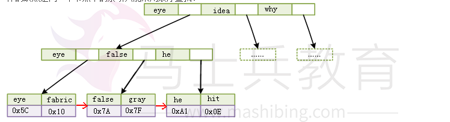
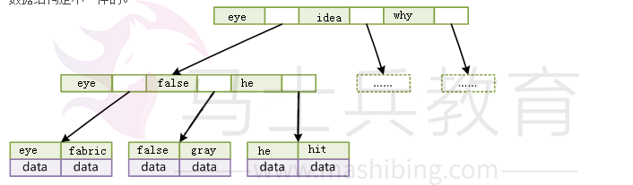
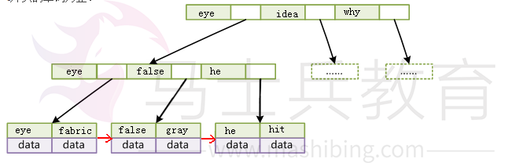

# mysql索引原理之聚簇索引

索引分为聚簇索引和非聚簇索引。

以一本英文课本为例，要找第8课，直接翻书，若先翻到第5课，则往后翻，再翻到第10课，则又往前翻。这本书本身就是一个索引，即“聚簇索引”。

如果要找"fire”这个单词，会翻到书后面的附录，这个附录是按字母排序的，找到F字母那一块，再找到"fire”，对应的会是它在第几课。这个附录，为“非聚簇索引”。

由此可见，聚簇索引，索引的顺序就是数据存放的顺序，所以，很容易理解，一张数据表只能有一个聚簇索引。

聚簇索引要比非聚簇索引查询效率高很多，特别是范围查询的时候。所以，至于聚簇索引到底应该为主键，还是其他字段，这个可以再讨论。

**1、MYSQL的索引**

mysql中，不同的存储引擎对索引的实现方式不同，大致说下MyISAM和InnoDB两种存储引擎。

MyISAM的B+Tree的叶子节点上的data，并不是数据本身，而是数据存放的地址。主索引和辅助索引没啥区别，只是主索引中的key一定得是唯一的。这里的索引都是非聚簇索引。

MyISAM还采用压缩机制存储索引，比如，第一个索引为“her”，第二个索引为“here”，那么第二个索引会被存储为“3,e”，这样的缺点是同一个节点中的索引只能采用顺序查找。

InnoDB的数据文件本身就是索引文件，B+Tree的叶子节点上的data就是数据本身，key为主键，这是聚簇索引。非聚簇索引，叶子节点上的data是主键(所以聚簇索引的key，不能过长)。为什么存放的主键，而不是记录所在地址呢，理由相当简单，因为记录所在地址并不能保证一定不会变，但主键可以保证。

至于为什么主键通常建议使用自增id呢？

**2、聚簇索引**

聚簇索引的数据的物理存放顺序与索引顺序是一致的，即：只要索引是相邻的，那么对应的数据一定也是相邻地存放在磁盘上的。如果主键不是自增id，那么可以想象，它会干些什么，不断地调整数据的物理地址、分页，当然也有其他一些措施来减少这些操作，但却无法彻底避免。但，如果是自增的，那就简单了，它只需要一页一页地写，索引结构相对紧凑，磁盘碎片少，效率也高。

聚簇索引不但在检索上可以大大滴提高效率，在数据读取上也一样。比如：需要查询f~t的所有单词。

一个使用MyISAM的主索引，一个使用InnoDB的聚簇索引。两种索引的B+Tree检索时间一样，但读取时却有了差异。

因为MyISAM的主索引并非聚簇索引，那么他的数据的物理地址必然是凌乱的，拿到这些物理地址，按照合适的算法进行I/O读取，于是开始不停的寻道不停的旋转。聚簇索引则只需一次I/O。

不过，如果涉及到大数据量的排序、全表扫描、count之类的操作的话，还是MyISAM占优势些，因为索引所占空间小，这些操作是需要在内存中完成的。

鉴于聚簇索引的范围查询效率，很多人认为使用主键作为聚簇索引太多浪费，毕竟几乎不会使用主键进行范围查询。但若再考虑到聚簇索引的存储，就不好定论了。

## 学习笔记】mysql索引原理之B+/-Tree

索引，是为了更快的查询数据，查询算法有很多，对应的数据结构也不少，数据库常用的索引数据结构一般为B+Tree。

**1、B-Tree**

关于B-Tree的官方定义个人觉得比较难懂，通俗一点就是举个例子。假如：一本英文字典，单词+详细解释组成了一条记录，现在需要索引单词，那么以单词为key，单词+详细解释为data，B-Tree就是以一个二元组{key,data}来定义一条记录。如果一个节点有3条记录，那么会有对应的4个指针，用以指向下一个节点。B-Tree是有序且平衡的，所有叶子节点在同一层，即不会出现某个分支层级多，某个分支层级少的情况。

因为B-Tree是有序的，所以它的查找就简单了，先从根节点开始二分查找，找到则返回节点；否则沿着区间指针查找下一个节点。比如，查询false这个单词。

**2、B+Tree**

与B-Tree不同的是，B+Tree每个节点只有key，没有data；而且叶子节点没有指针。也就是说B+Tree的叶子节点和内节点的数据结构是不一样的。

一般数据库采用的是B+Tree，而且经过了一些优化，比如在叶子节点上增加了顺序访问指针，提高区间查询效率。比如：查询首字母为f~t的所有单词。那么只需查到f开头的第一个单词fabric，然后沿着叶子节点的开始遍历，直到找到最后一个以t开头的单词为止。

 

简单介绍了B-/+Tree，至于众多数据结构中，为何数据库索引选择BTree，而且选择B+Tree，下面从计算机存储原理方面简单说说。

**3、读内存和读磁盘**

内存读取和磁盘读取的效率是相差很大的。

简单点说说内存读取，内存是由一系列的存储单元组成的，每个存储单元存储固定大小的数据，且有一个唯一地址。

当需要读内存时，将地址信号放到地址总线上传给内存，内存解析信号并定位到存储单元，然后把该存储单元上的数据放到数据总线上，回传。

写内存时，系统将要写入的数据和单元地址分别放到数据总线和地址总线上，内存读取两个总线的内容，做相应的写操作。

内存存取效率，跟次数有关，先读取A数据还是后读取A数据不会影响存取效率。而磁盘存取就不一样了，磁盘I/O涉及机械操作。

磁盘是由大小相同且同轴的圆形盘片组成，磁盘可以转动(各个磁盘须同时转动)。磁盘的一侧有磁头支架，磁头支架固定了一组磁头，每个磁头负责存取一个磁盘的内容。磁头不动，磁盘转动，但磁臂可以前后动，用于读取不同磁道上的数据。磁道就是以盘片为中心划分出来的一系列同心环(如图标红那圈)。磁道又划分为一个个小段，叫扇区，是磁盘的最小存储单元。

磁盘读取时，系统将数据逻辑地址传给磁盘，磁盘的控制电路会解析出物理地址，即哪个磁道哪个扇区。于是磁头需要前后移动到对应的磁道，消耗的时间叫寻道时间，然后磁盘旋转将对应的扇区转到磁头下，消耗的时间叫旋转时间。所以，适当的操作顺序和数据存放可以减少寻道时间和旋转时间。

为了尽量减少I/O操作，磁盘读取每次都会预读，大小通常为页的整数倍。即使只需要读取一个字节，磁盘也会读取一页的数据(通常为4K)放入内存，内存与磁盘以页为单位交换数据。因为局部性原理认为，通常一个数据被用到，其附近的数据也会立马被用到。

**4、检索性能分析**

B-Tree：如果一次检索需要访问4个节点，数据库系统设计者利用磁盘预读原理，把节点的大小设计为一个页，那读取一个节点只需要一次I/O操作，完成这次检索操作，最多需要3次I/O(根节点常驻内存)。数据记录越小，每个节点存放的数据就越多，树的高度也就越小，I/O操作就少了，检索效率也就上去了。

B+Tree：内节点只存key，大大滴减少了内节点的大小，那么每个节点就可以存放更多的记录，树的更矮了，I/O操作更少了。所以B+Tree拥有更好的性能。

**5、其他索引方式**

散列索引：通过HASH来定位的一种索引，这种索引用的较少，通过用于单值查询。InnoDB的自适应索引就是HASH索引。

位图索引：字段值固定且少，比如性别、状态。在同时对多个这样的字段and/or查询时，效率极高，直接按位与/或就可以得到结果了。所以，应用范围局限。