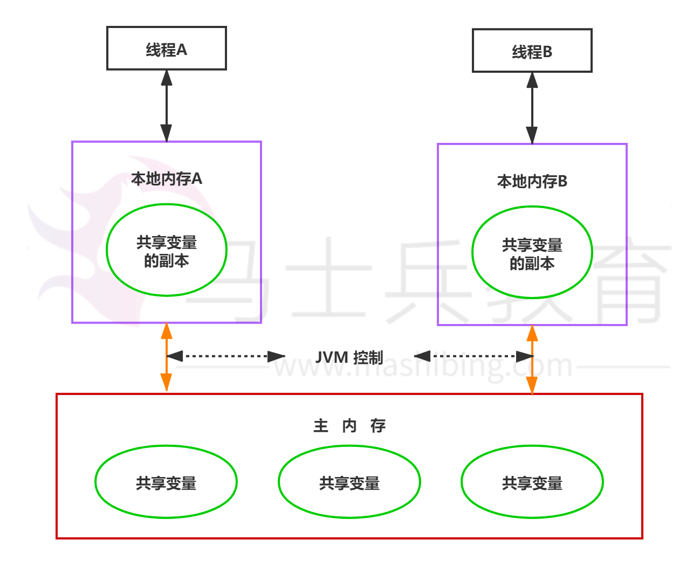
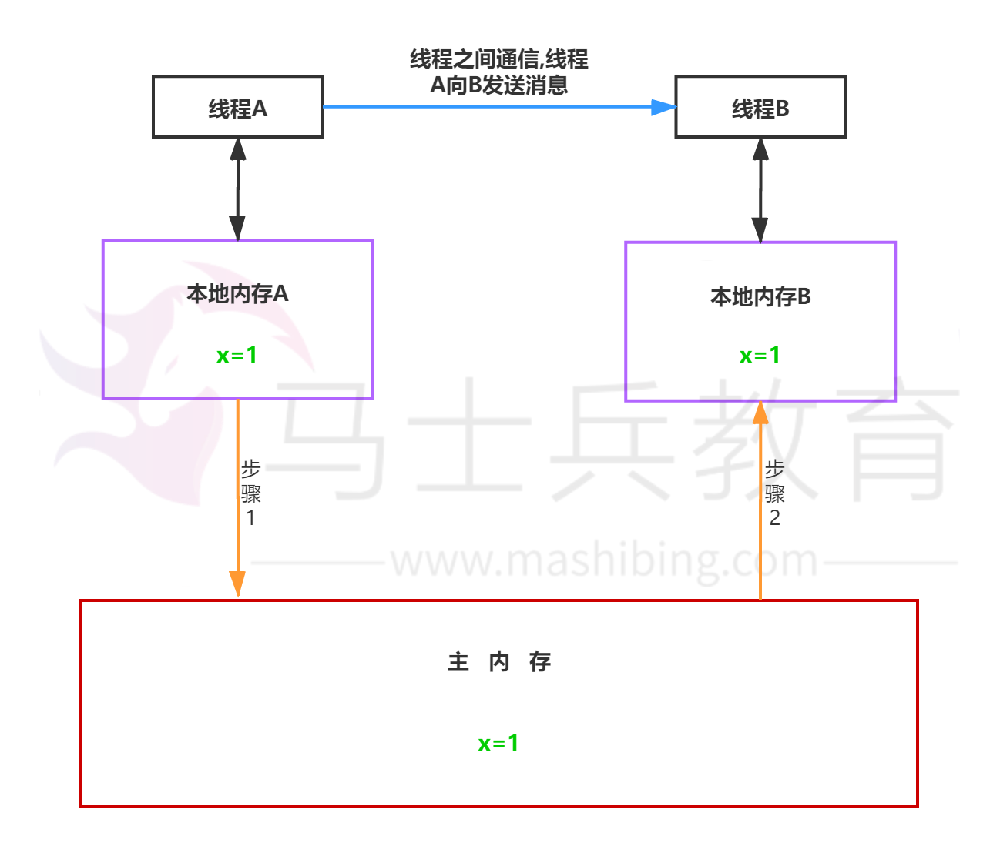
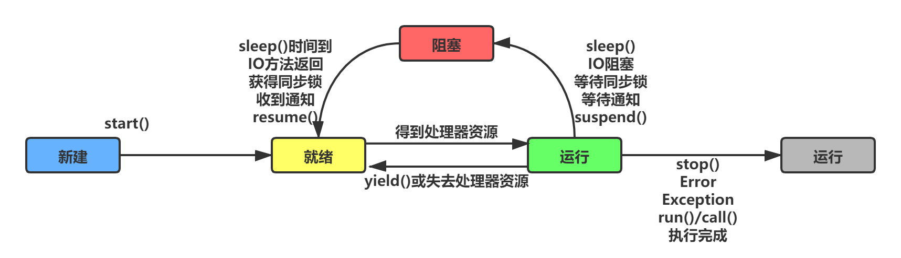

# synchronized和volatile区别

个人理解**JMM**：Java Memory Model(Java内存模型)，根据并发过程中如何处理、可见性、原子性和有序性这三个特性而建立的模型。
**可见性**：JMM提供了volatile变量定义、final、synchronized块来保证可见性。
**原子性**：个人理解是如果执行，就执行完，synchronized块来保证。
**有序性**：觉得有序是相对性的，根据从哪个线程观察，volatile和synchronized保证线程之间操作的有序性。
**指令重排**：处理器为了提高程序运行效率，可能会对输入代码进行优化，它不保证各个语句的执行顺序同代码中的顺序一致，但是它会保证程序最终执行结果和代码顺序执行的结果是一致的。指令重排序不会影响单个线程的执行，但是会影响到线程并发执行的正确性。
**JMM处理过程**：JMM是通过禁止特定类型的编译器重排序和处理器重排序来为程序员提供一致的内存可见性保证。例如A线程具体什么时候刷新共享数据到主内存是不确定的，假设我们使用了同步原语(synchronized，volatile和final),那么刷新的时间是确定的。

- 每个线程都有一个自己的本地内存空间–虚拟机栈线程空间。线程执行时，先把变量从主内存读取到线程自己的本地内存空间，然后再对该变量进行操作
- 对该变量操作完后，在某个时间再把变量刷新回主内存，所以线程A释放锁后会同步到主内存，线程B获取锁后会同步主内存数据，即“A线程释放锁–B线程获取锁”可以实现A，B线程之间的通信
  
  稍微解释下：
  假设本地内存A和B有主内存中共享变量x的副本，初始时这三个内存中的x值都为0。线程A在执行时，把更新后的x值（假设值为1）临时存放在自己的本地内存A中。当线程A和线程B需要通信时，线程A首先会把自己本地内存中修改后的x值刷新到主内存中，此时主内存中的x值变为了1。然后，线程B到主内存中去读取线程A更新后的x值，此时线程B的本地内存的x值也变为了1。

建议了解下线程的生命状态，这里就不多做解释，面试的时候很有可能会被问到。

**重点：**

1. volatile主要应用在多个线程对实例变量更改的场合，刷新主内存共享变量的值从而使得各个线程可以获得最新的值，线程读取变量的值需要从主存中读取；synchronized则是锁定当前变量，只有当前线程可以访问该变量，其他线程被阻塞住。另外，synchronized还会创建一个内存屏障，内存屏障指令保证了所有CPU操作结果都会直接刷到主存中（即释放锁前），从而保证了操作的内存可见性，同时也使得先获得这个锁的线程的所有操作
2. volatile仅能使用在变量级别；synchronized则可以使用在变量、方法、和类级别的。
3. volatile不会造成线程的阻塞；synchronized可能会造成线程的阻塞，比如多个线程争抢synchronized锁对象时，会出现阻塞。
4. volatile仅能实现变量的修改可见性，不能保证原子性；而synchronized则可以保证变量的修改可见性和原子性，因为线程获得锁才能进入临界区，从而保证临界区中的所有语句全部得到执行。
5. volatile标记的变量不会被编译器优化，可以禁止进行指令重排；synchronized标记的变量可以被编译器优化。