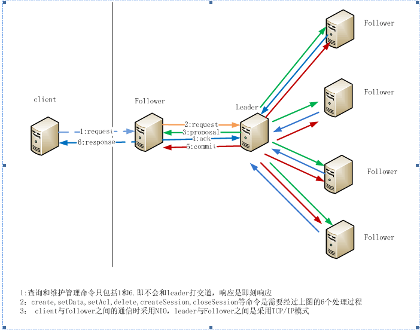
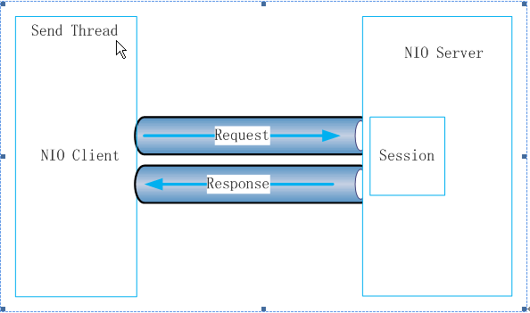
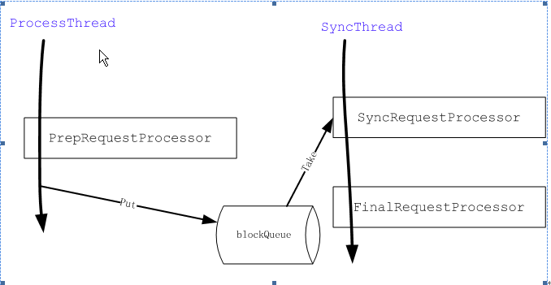
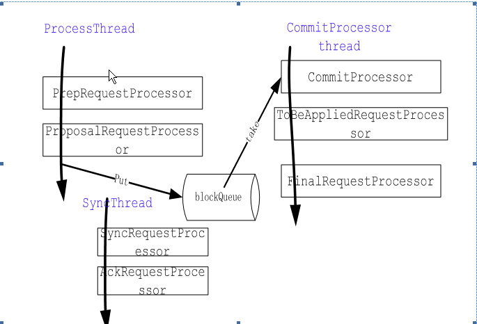
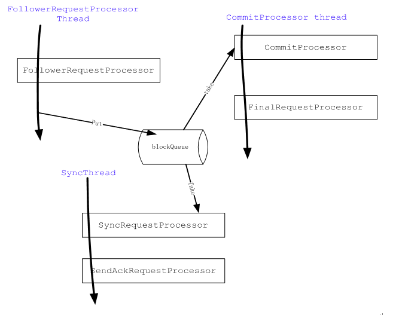

# zookeeper系列之通信模型

本文的主题就是讲解Zookeeper通信模型，本节将通过一个概要图来说明Zookeeper的通信模型。

Zookeeper的通信架构

在Zookeeper整个系统中，有3中角色的服务，client、Follower、leader。其中client负责发起应用的请求，Follower接受client发起的请求，参与事务的确认过程，在leader crash后的leader选择。而leader主要承担事务的协调，当然leader也可以承担接收客户请求的功能，为了方便描述，后面的描述都是client与Follower之间的通信，如果Zookeeper的配置支持leader接收client的请求，client与leader的通信跟client与Follower的通信模式完全一样。Follower与leader之间的角色可能在某一时刻进行转换。一个Follower在leader crash掉以后可能被集群（Quorum）的Follower选举为leader。而一个leader在crash后，再次加入集群（Quorum）将作为Follower角色存在。在一个集群（Quorum）中,除了在选举leader的过程中没有Follower和leader的区分外，其他任何时刻都只有1个leader和多个Follower。Client、Follower和leader之间的通信架构如下：

Client与Follower之间

 

 

为了使客户端具有较高的吞吐量，Client与Follower之间采用NIO的通信方式。当client需要与Zookeeper service打交道时，首先读取配置文件确定集群内的所有server列表，按照一定的load balance算法选取一个Follower作为一个通信目标。这样client和Follower之间就有了一条由NIO模式构成的通信通道。这条通道会一直保持到client关闭session或者因为client或Follower任一方因某种原因异常中断通信连接。正常情况下, client与Follower在没有请求发起的时候都有心跳检测。

 

 Follower与leader之间

 

Follower与leader之间的通信主要是因为Follower接收到像（create, delete, setData, setACL, createSession, closeSession, sync）这样一些需要让leader来协调最终结果的命令，将会导致Follower与leader之间产生通信。由于leader与Follower之间的关系式一对多的关系，非常适合client/server模式，因此他们之间是采用c/s模式，由leader创建一个socket server，监听各Follower的协调请求。

 集群在选择leader过程中

 

由于在选择leader过程中没有leader，在集群中的任何一个成员都需要与其他所有成员进行通信，当集群的成员变得很大时，这个通信量是很大的。选择leader的过程发生在Zookeeper系统刚刚启动或者是leader失去联系后，选择leader过程中将不能处理用户的请求，为了提高系统的可用性，一定要尽量减少这个过程的时间。选择哪种方式让他们可用快速得到选择结果呢？Zookeeper在这个过程中采用了策略模式，可用动态插入选择leader的算法。系统默认提供了3种选择算法，AuthFastLeaderElection，FastLeaderElection，LeaderElection。其中AuthFastLeaderElection和LeaderElection采用UDP模式进行通信，而FastLeaderElection仍然采用tcp/ip模式。在Zookeeper新的版本中，新增了一个learner角色，减少选择leader的参与人数。使得选择过程更快。一般说来Zookeeper leader的选择过程都非常快，通常<200ms。

 

Zookeeper的通信流程

 

要详细了解Zookeeper的通信流程，我们首先得了解Zookeeper提供哪些客户端的接口，我们按照具有相同的通信流程的接口进行分组：

Zookeeper系统管理命令

 

Zookeeper的系统管理接口是指用来查看Zookeeper运行状态的一些命令，他们都是具有4字母构成的命令格式。主要包括：

\1.     ruok:发送此命令可以测试zookeeper是否运行正常。

\2.     dump：dump server端所有存活session的Ephemeral（临时）node信息。

\3.     stat：获取连接server的服务器端的状态及连接该server的所有客服端的状态信息。

\4.     reqs: 获取当前客户端已经提交但还未返回的请求。

\5.     stmk：开启或关闭Zookeeper的trace level.

\6.     gtmk：获取当前Zookeeper的trace level是否开启。

\7.     envi: 获取Zookeeper的java相关的环境变量。

\8.     srst：重置server端的统计状态

当用户发送这些命令的到server时，由于这些请求只与连接的server相关，没有业务处理逻辑，非常简单。Zookeeper对这些命令采用最快的效率进行处理。这些命令发送到server端只占用一个4字节的int类型来表示不同命令，没有采用字符串处理。当服务器端接收到这些命令，立刻返回结果。

 

Session创建

 

任何客户端的业务请求都是基于session存在的前提下。Session是维持client与Follower之间的一条通信通道，并维持他们之间从创建开始后的所有状态。当启动一个Zookeeper client的时候，首先按照一定的算法查找出follower, 然后与Follower建立起NIO连接。当连接建立好后，发送create session的命令，让server端为该连接创建一个维护该连接状态的对象session。当server收到create session命令，先从本地的session列表中查找看是否已经存在有相同sessionId，则关闭原session重新创建新的session。创建session的过程将需要发送到Leader，再由leader通知其他follower，大部分Follower都将此操作记录到本地日志再通知leader后，leader发送commit命令给所有Follower，连接客户端的Follower返回创建成功的session响应。Leader与Follower之间的协调过程将在后面的做详细讲解。当客户端成功创建好session后，其他的业务命令就可以正常处理了。

 

Zookeeper查询命令

 

 

Zookeeper查询命令主要用来查询服务器端的数据，不会更改服务器端的数据。所有的查询命令都可以即刻从client连接的server立即返回，不需要leader进行协调，因此查询命令得到的数据有可能是过期数据。但由于任何数据的修改，leader都会将更改的结果发布给所有的Follower，因此一般说来，Follower的数据是可以得到及时的更新。这些查询命令包括以下这些命令：

\1.  exists:判断指定path的node是否存在，如果存在则返回true，否则返回false.

\2.  *getData:**从指定**path**获取该**node**的数据*

\3.  *getACL:**获取指定**path**的**ACL**。*

\4.  *getChildren:**获取指定**path**的**node**的所有孩子结点。*

所有的查询命令都可以指定watcher，通过它来跟踪指定path的数据变化。一旦指定的数据发生变化（create,delete,modified,children_changed），服务器将会发送命令来回调注册的watcher. Watcher详细的讲解将在Zookeeper的Watcher中单独讲解。

Zookeeper修改命令

 

Zookeeper修改命令主要是用来修改节点数据或结构，或者权限信息。任何修改命令都需要提交到leader进行协调，协调完成后才返回。修改命令主要包括：

*1.*  *createSession**：**请求**server**创建一个**session*

*2.*  *create**：**创建一个节点*

*3.*  *delete**：**删除一个节点*

*4.*  *setData**：**修改一个节点的数据*

*5.*  *setACL**：**修改一个节点的**ACL*

*6.*  *closeSession**：**请求**server**关闭**session*

我们根据前面的通信图知道，任何修改命令都需要leader协调。 在leader的协调过程中，需要3次leader与Follower之间的来回请求响应。并且在此过程中还会涉及事务日志的记录，更糟糕的情况是还有take snapshot的操作。因此此过程可能比较耗时。但Zookeeper的通信中最大特点是异步的，如果请求是连续不断的，Zookeeper的处理是集中处理逻辑，然后批量发送，批量的大小也是有控制的。如果请求量不大，则即刻发送。这样当负载很大时也能保证很大的吞吐量，时效性也在一定程度上进行了保证。

 

zookeeper server端的业务处理-processor链

 

<!--EndFragment-->

Zookeeper通过链式的processor来处理业务请求，每个processor负责处理特定的功能。不同的Zookeeper角色的服务器processor链是不一样的，以下分别介绍standalone Zookeeper server, leader和Follower不同的processor链。

 

Zookeeper中的processor

 

\1.  AckRequestProcessor:当leader从向Follower发送proposal后，Follower将发送一个Ack响应，leader收到Ack响应后，将会调用这个Processor进行处理。它主要负责检查请求是否已经达到了多数Follower的确认，如果满足条件，则提交commitProcessor进行commit处理

\2.  CommitProcessor：从commited队列中处理已经由leader协调好并commit的请求或者从请求队列中取出那些无需leader协调的请求进行下一步处理。

\3.  FinalRequestProcessor：任何请求的处理都需要经过这个processor，这是请求处理的最后一个Processor，主要负责根据不同的请求包装不同的类型的响应包。当然Follower与leader之间协调后的请求由于没有client连接，将不需要发送响应（代码体现在if (request.cnxn == null) {return;}）。

\4.  FollowerRequestProcessor：Follower processor链上的第一个，主要负责将修改请求和同步请求发往leader进行协调。

\5.  PrepRequestProcessor：在leader和standalone server上作为第一Processor，主要作用对于所有的修改命令生成changelog。

\6.  ProposalRequestProcessor：leader用来将请求包装为proposal向Follower请求确认。

\7.  SendAckRequestProcessor：Follower用来向leader发送Ack响应的处理。

\8.  SyncRequestProcessor：负责将已经commit的事务写到事务日志以及take snapshot.

\9.  ToBeAppliedRequestProcessor:负责将tobeApplied队列的中request转移到下一个请求进行处理。

Standalone zookeeper processor链

 

 

Leader processor链

Follower processor链

 

 