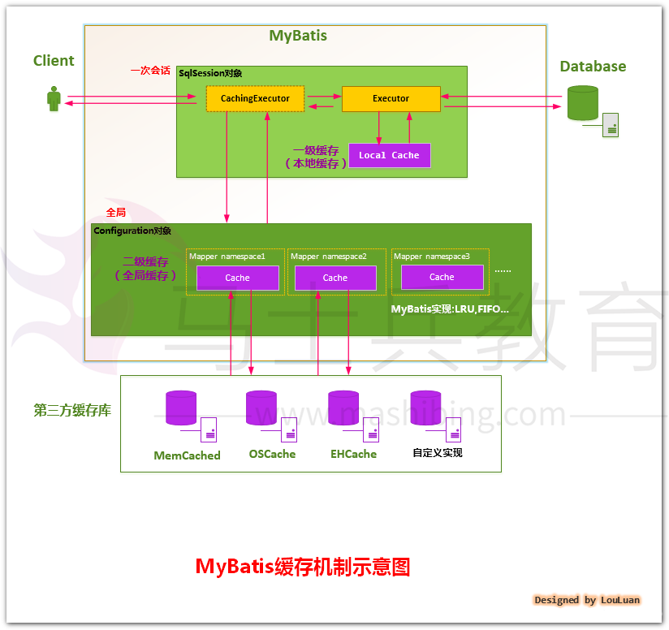
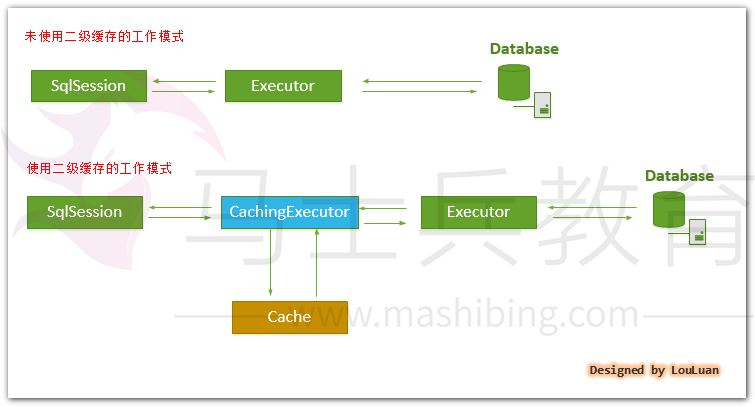
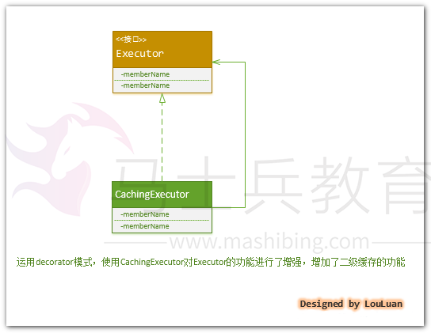

# 《深入理解mybatis原理》 MyBatis缓存机制的设计与实现

 本文主要讲解***\*MyBatis\****非常棒的缓存机制的设计原理，给读者们介绍一下***\*MyBatis\****的缓存机制的轮廓，然后会分别针对缓存机制中的方方面面展开讨论。

***\*MyBatis\****将数据缓存设计成两级结构，分为一级缓存、二级缓存：

​    **一级缓存是\**Session\**会话级别的缓存**，位于表示一次数据库会话的***\*SqlSession\****对象之中，又被称之为本地缓存。一级缓存是***\*MyBatis\****内部实现的一个特性，用户不能配置，默认情况下自动支持的缓存，用户没有定制它的权利（不过这也不是绝对的，可以通过开发插件对它进行修改）；

​    **二级缓存是\**Application\**应用级别的缓存**，它的是生命周期很长，跟***\*Application\****的声明周期一样，也就是说它的作用范围是整个***\*Application\****应用。

 

 ***\*MyBatis\****中一级缓存和二级缓存的组织如下图所示：

 ***\*一级缓存的工作机制：\****

>    一级缓存是***\*Session\****会话级别的，一般而言，一个***\*SqlSession\****对象会使用一个***\*Executor\****对象来完成会话操作，***\*Executor\****对象会维护一个***\*Cache\****缓存，以提高查询性能。

**二级缓存的工作机制：**

> ​    如上所言，一个***\*SqlSession\****对象会使用一个***\*Executor\****对象来完成会话操作，**MyBatis**的二级缓存机制的关键就是对这个***\*Executor\****对象做文章。如果用户配置了"***\*cacheEnabled=true\****"，那么**MyBatis**在为***\*SqlSession\****对象创建***\*Executor\****对象时，会对***\*Executor\****对象加上一个装饰者：**CachingExecutor**，这时***\*SqlSession\****使用**CachingExecutor**对象来完成操作请求。**CachingExecutor**对于查询请求，会先判断该查询请求在**Application**级别的二级缓存中是否有缓存结果，如果有查询结果，则直接返回缓存结果；如果缓存中没有，再交给真正的***\*Executor\****对象来完成查询操作，之后**CachingExecutor**会将真正***\*Executor\****返回的查询结果放置到缓存中，然后在返回给用户。
>
>    **MyBatis**的二级缓存设计得比较灵活，你可以使用**MyBatis**自己定义的二级缓存实现；你也可以通过实现***\*org.apache.ibatis.cache.Cache\****接口自定义缓存；也可以使用第三方内存缓存库，如***\*Memcached\****等，这个我们会在后续的文章中详细讨论。

   

> 