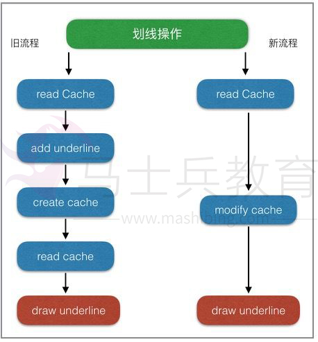
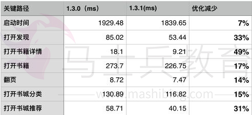
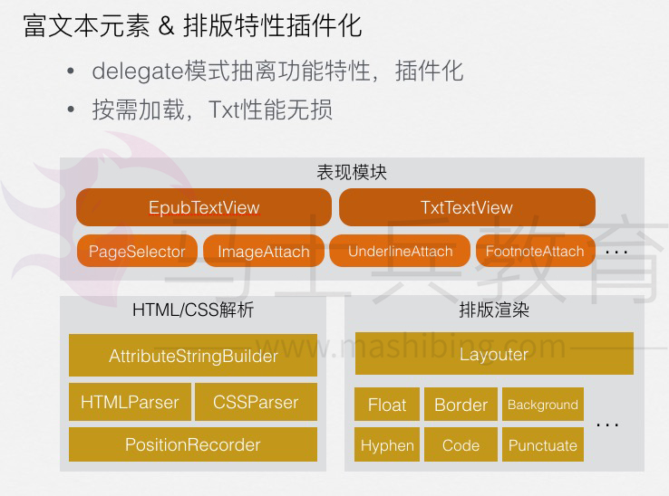

# 三个方面解决性能问题的基本思路和方法


先来个大图（电脑端观看，否则显示不清）


### 发现问题、解决问题和预防问题三个方面

> 首先，根据个人的开发经验，我不得不承认，当应用发展到一定程度后，性能问题就不可能完全避免。
> 以往我们总是希望能寻找一种解决性能问题的一劳永逸的方法，其实是不太现实的。所以我们换个思路，如何尽早的发现性能问题，然后解决问题。
> 在发现问题方面，我们项目也并没有什么高招，主要有两个方面

#### 1. 用户反馈（包括测试人员）

受限于测试时间和用户反馈的积极性，性能问题往往到了比较严重的程度，开发人员才真正发现问题。

#### 2.在线监控

在线监控主要有业务性能监控和卡顿监控
卡顿监控，是用了RDM的工具，然后通过动态下发开关，用抽样的方法进行上报
还有一些反馈卡顿的用户，我们也会通过这个方法来查找问题

> 然后，在解决性能问题方法，相信大家都累积了很多经验。
> 产生性能问题的原因多种多样，所以解决的办法也不尽相同，各种奇技淫巧都有可能派上用场，这里我大概介绍一下我们项目中用到的一些方面：

**（1）优化业务流程** **（2）合理的线程分配** **（3）预处理和延时加载** **（4）缓存** **（5）使用正确的API**

#### (1). 优化业务流程

性能优化看似高深，真正落到实处才会发现，最大的坑往往都隐藏在于业务不断累积和频繁变更之处。优化业务流程就是在满足需求的同时，提出更加高效优雅的解决方案，从根本上解决问题。从实践来看，这种方法解决问题是最彻底的，但通常也是难度最大的。

这是我们其中一个业务优化的案例,看似挺简单的优化，但真正落到实处，才会出现其中的坑有多大，所以重构优化的时候，还得有颗坚强的心！

#### (2). 合理的线程分配

由于GCD实在太方便了，如果不加控制，大部分需要抛到子线程操作都会被直接加到global队列，这样会导致两个问题，1.开的子线程越来越多，线程的开销逐渐明显，因为开启线程需要占用一定的内存空间（默认的情况下，主线程占1M,子线程占用512KB）。2.多线程情况下，网络回调的时序问题，导致数据处理错乱，而且不容易发现。为此，我们项目定了一些基本原则。

UI操作和DataSource的操作一定在主线程。 DB操作、日志记录、网络回调都在各自的固定线程。 不同业务，可以通过创建队列保证数据一致性。例如，想法列表的数据加载、书籍章节下载、书架加载等。

合理的线程分配，最终目的就是保证主线程尽量少的处理非UI操作，同时控制整个App的子线程数量在合理的范围内。

#### (3). 预处理和延时加载。

预处理，是将初次显示需要耗费大量线程时间的操作，提前放到后台线程进行计算，再将结果数据拿来显示。

延时加载，是指首先加载当前必须的可视内容，在稍后一段时间内或特定事件时，再触发其他内容的加载。这种方式可以很有效的提升界面绘制速度，使体验更加流畅。（UITableView就是最典型的例子）

这两种方法都是在资源比较紧张的情况下，优先处理马上要用到的数据，同时尽可能提前加载即将要用到的数据。在微信读书中阅读的排版是优先级最高的，所在在阅读过程中会预处理下一页、下一章的排版，同时可能会延时加载阅读相关的其它数据（如想法、划线、书签等）。

#### (4). 缓存

cache可能是所有性能优化中最常用的手段，但也是我们极不推荐的手段。cache建立的成本低，见效快，但是带来维护的成本却很高。如果一定要用，也请谨慎使用，并注意以下几点：

并发访问cache时，数据一致性问题。 cache线程安全问题，防止一边修改一边遍历的crash。 cache查找时性能问题。 cache的释放与重建，避免占用空间无限扩大，同时释放的粒度也要依实际需求而定。

#### (5).使用正确的API

选择合适的容器; 了解**imageNamed**与**imageWithContentsOfFile**的差异(*imageNamed*适用于会重复加载的小图片，因为系统会自动缓存加载的图片;*imageWithContentsOfFile*仅加载图片) 缓存**NSDateFormatter**的结果。 寻找**(NSDate \*)dateFromString:(NSString )string**的替换品 不要随意使用NSLog();

> 这方面主要还是靠经验的累积
> 上面只是列举了几种常规手段，相信大家在实践过程中，肯定还有很多的高招。
> 经过一段时间的性能优化工作，我们团队达成了一项共识，与其花那么时间去发现问题，查问题，还不如多开发一些工具，让问题尽量暴露在开发阶段，最好达到避免共性问题。
> 所以，我们总是想开发一些有意思小工具来做这种事情。
> 下面列举几个**我们认识还挺有帮忙的工具**

#### (1).FPS/SQL性能监测工具条

工具条是在DEBUG模式下，以浮窗的形式，实时展示当前可能存在问题的FPS次数和执行时间较长的SQL语句个数，是团队成员tower开发的。

FPS监测的原理并不复杂，虽然不是百分百准确，但非常实用，因为可以随时查看FPS低于某个阈值时的堆栈信息，再结合当时的使用场景，开发人员使用起来非常便利，可以很快定位到引起卡顿的场景和原因。SQL语句的监测也非常实用，对于微信读书，DB的读写速度是影响性能的瓶颈之一。因此在DEBUG阶段，我们监测了每一条SQL语句的执行速度，一旦执行时间超出某个阈值，就会表现在工具条的数字上，点击后可以进一步查询到具体的SQL操作以及实际耗时。

顶部工具条点击后，就可以查到具体是哪条sql语句慢 这个工具帮助我们在开发阶段发现了很多卡顿问题，尤其是一些不合理的SQL语句，例如：
在想法圏的优化过程中，利用这个工具，我们就发现想法圈第一次加载更多，执行的SQL语句耗时竟然达到了1000多毫秒。

```

_SELECT * FROM WRReview INNER JOIN WRUser ON WRReview.fromId = WRUser.vid WHERE WRReview.type & ? AND WRReview.createTime <= ? ORDER BY WRReview.createTime DESC , WRReview.itemId ASC LIMIT ?_
```

通过explain，可以发现这条SQL效率之低:

```

SEARCH TABLE WRReview SEARCH TABLE WRUser USING INTEGER PRIMARY KEY (rowid=?) USE TEMP B-TREE FOR ORDER BY
```

没有建立合适的索引，导致WRReview全表扫描。 排序字段没有索引，导致SQLite需要再一次B-TREE排序。 两字段排序，性能更低。

优化：给WRReview的 *fromId* *createTime* 两个字段增加了索引，并去掉一个排序字段:

```

_SELECT * FROM WRReview INNER JOIN WRUser ON WRReview.fromId = WRUser.vid WHERE WRReview.type & ? ORDER BY WRReview.createTime DESC LIMIT ?_
```

Explain的结果：

```

SCAN TABLE WRReview USING INDEX WRReview_createTime SEARCH TABLE WRUser USING INTEGER PRIMARY KEY (rowid=?)
```

SQL执行时间直接降了一个数量级，到100毫秒左右。

#### (4). UI/DataSource主线程检测工具。

该工具是为了保证所有的UI的操作和DataSource操作一定是在主线程进行。实现原理是通过hook UIView的**setNeedsLayout**，**setNeedsDisplay**，**setNeedsDisplayInRect**三个方法，确保它们都是在主线程执行。子线程操作UI可能会引起什么问题，苹果说得并不清楚，实际开发中我们遇到几种神奇的问题似乎都是跟这个有关。

app突然丢动画，似乎iOS系统也有这个bug。虽然没有确切的证据，但使用这个工具，改完所有的问题后，bug也好了(不止一次是这样)。

UI操作偶尔响应特别慢，从代码看没有任何耗时操作，只是简单的push某个controller。

莫名的crash，这当然是因为UI操作非线程安全引起的。

更多时候，子线程操作UI也并不一定会发生什么问题，也正因为不知道会发生什么，所以更需要我们警惕，这个工具替我们扫除了这些隐患。虽然，苹果表示，现在部分的UI操作也已经是线程安全了，但毕竟大部分还不是。DataSource的监测是因为我们业务定下的原则，保证列表DataSource的线程安全。

#### (3) 排版引擎自动化检测工具

排版引擎是微信读书最核心的功能，排版引擎检测工具原本是为了检验排版引擎改进过程中准确性，防止因为业务变更，而影响原来的排版特性。实现原理是结合自动化脚本和App本身的排版引擎，给书库中的每一本书建立一个镜像，镜像的内容包括书籍的每一章每一页的截图。然后分析同一页码的两个不同版本的图片差异，就可以知道不同版本的排版引擎渲染效果。但是我发现，只要稍加改进，排版后记录每个章节排版耗时，就可以知道每个版本变化后同一个章节的耗时变化，以此作为排版引擎的性能指标。这个工具保证了微信读书，即使在快速迭代过程中也不会丢失阅读的核心体验。虽然这个工具无法在其它项目中复用，但是提醒了我们，可以通过自动化工具来保证产品最核心功能的体验。

这个虽然业务相关性比较强，但是对于某些应用的自动化测试也是有效的

#### (4) 书源检测工具

微信读书为了支持正版版权，目前书源完全依赖于后台，不允许本地导入。书源的优劣的直接影响排版的效果和性能。为了解决了部分书籍无法打开或者乱码的问题，我们借助了后台同学的书源检测工具。对线上所有epub书籍（大概13,000本）进行扫描，按照章节大小进行排序。对于章节内容特别大的书籍重点检测，重新排版，解决了一批epub书籍无法打开的问题。同时针对章节内容乱码的问题，对所有txt的书籍进行了一次全量扫描，发现了一些问题，但还无法准确找出所有乱码的章节，这一点还在努力改善中。

### 优化成果

整体使用感受上，已经可以明显区分两个版本的性能差异，这一点也可以通过每天的用户反馈数据中得到验证。
1.3.0和1.3.1分别发布一周后反馈的卡顿数从10个降到了3个，从总体反馈比例的2.8%降到0.8%。 某些关键业务，耗时也有明显改善。 极端案例的修复。超大的epub书籍已通过后台进行拆分，解决了无法打开书籍的情况。 针对低端机型，去掉了某些动画，交互更加流畅。


### 总结

通过上述介绍，我们可以看出，性能问题普遍存在，无可避免，与其花费大量时间，查找线上版本的性能问题，
不如提高整体团队成员性能优化意识，借助性能查找工具，将性能问题尽早暴露在开发阶段，达到预防为主的效果。

### 问题

#### (0)想问下你们 DB 操作这部分涉及到多线程读写是怎么处理的？

我们用了FMDB，它已经处理了这种情况

MDB 的解决方案，我理解是放到一个队列里，虽然可以解决多线程读写的问题，但是队列的处理还是会阻塞住来自不同线程的请求，对么?

是的。我们一直也是读写都在同一条队列，其实并没有太明显的性能瓶颈,
因为在sqlite之上我们还有一层基于model的cache

#### (1)除了 sqlite 语句的优化之外，db 这部分还有没有其他方面的优化工作?

除了 sqlite 语句的优化之外，db 这部分还有没有其他方面的优化工作
我们有一个自己的DB框架，是ORM的，做了很多优化的工作，最近刚开源，大家可以看看

#### (2) 请问你们选择用sqlite的考量是什么, 有没有考虑过使用其他的db如realm?

选择sqlite是历史原因，因为我们已经基于sqlite做了一个高性能的DB框架，而且也是经过QQMail App验证的。realm有考虑过，但是因为不是开源，所以估计不用采用

#### (3)合理的使用线程，多线程之间的同步这块儿有什么方案或建议?

这里我们也并没有什么通用的方案，原则是尽量避免使用多线程。一定要用的时候，也是根据业务谨慎选择

#### (4) 我把我的问题编号为4吧，方便对应。业务场景里会不会涉及到有 读操作 依赖写操作完成的情况，否则会出现读操作的数据不准确的情况。FMDB 感觉不能很好的解决这个问题。

读操作 依赖写操作完成，这种场景一定会有的。但是这种问题应该是业务流程自己控制，而不是DB应该考虑的事情，DB性一能保证的就是按照业务提交的顺序，顺序执行

#### 数据库的记录-一般是在什么级别百千有没有尝试去做过一些压测数据量达到多少的时候会遇到瓶颈">(5)能不能问下 微信读书的数据库的记录 一般是在什么级别，百、千？有没有尝试去做过一些压测，数据量达到多少的时候会遇到瓶颈?

微信读书的数据库记录并不是很大，单表记录最多可能也就10w的数据级别。QQ邮箱的mailApp跟我们是用的同一套，但是数量级别远大于微信读书。目前发现的瓶颈是DB文件达到200M以上时，sqlite的性能会明显受到影响，不过具体原因还在调查中。做过一些压力测试，用来对比CoreData，但是具体数据我这里暂时没有

#### (6) 微信读书这么成功，方便说下她的架构吗？我觉得架构好才是她可优化的第一步

哈哈，现在还远谈不上成功啦。架构要用图来画才方便看，我暂时还没总结整个app的架构, 可以看看关于阅读器epub渲染的一个架构


#### (7) 你们的 db 是只有一个文件，还是尝试分文件存储的？

看业务需求，目前是多个DB文件

**END**