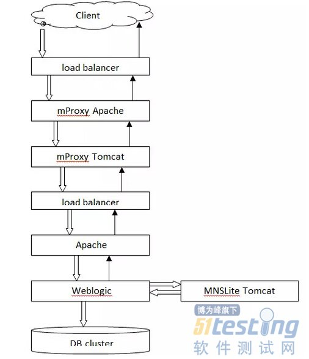
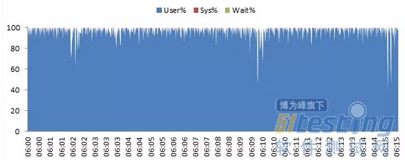
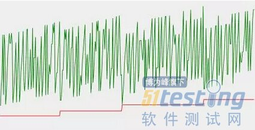
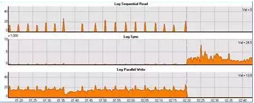
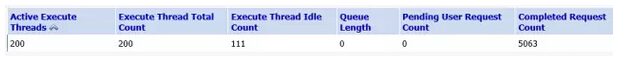
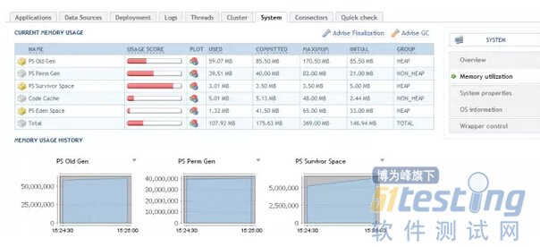

# 五步定位性能瓶颈

**1、着手在\**测试\**前：理清数据流向，数据流程分解**

　　通过绘制数据流向图，以便清晰的列出所有可能出现瓶颈的位置，避免在分析过程中遗漏可能的瓶颈点。

　　系统架构分解——水池模型

　　要查找瓶颈，首先要对系统的架构有详细的了解，清楚知道所有可能成为瓶颈的位置。只有这样才能在遇到问题是合理的设计**测试用例**，对流程的各个步骤进行逐一排查。

　　举个例子，家里厨房的水池下水堵了，我们要找原因，首先得知道水池的下水道都有哪些部分：

　　简单的看，可以把下水道分解为水漏、上连接管、回水弯、下连接管最后接入地漏。再查找堵塞位置时，我们就可以将水直接导入回水弯，排除水漏和上连接管道堵塞的可能。

　　应用在测试中，我们也可以利用直接向应用中间件发请求，来排除Web代理层的瓶颈。

　　通过绘制流向图，可以更清晰的展现系统中数据流向，帮助我们在定位瓶颈的过程始终能迅速的分析预计到下一个可能的瓶颈位置。

　　如上图，就是在play一个Mobile game时的数据流向图。

　　**2、最直观的指征：检索日志中的异常**

　　日志是系统异常的最直接反映，通过客户端(负载工具端)、服务器端的日志，可以迅速确定瓶颈可能存在的方向。一些在大用户量大并发情况下的功能问题，也会在错误日志中体现。

　　在**性能测试**过程中，一般情况是不把全部日志打开的，而是尽量保持与生产环境的设置相同，生产环境开启什么样的日志级别，在性能测试环境中也应该开启同样的级别。

　　但是往往在生产环境出于性能考虑，并不会把日志级别开的非常高，所以在发现系统存在性能问题时，我们可以适当调高日志级别，以便获得更多的信息。

　　在日志中，我们可以由一些关键字直接推断出系统的问题所在，比如：

　　· Too many open files

　　**Linux**下存在句柄数限制，系统的默认值较小，在测试前应该优化，另外还要怀疑是否程序存在打开句柄却在某些情况下没有关闭。

　　· OutOfMemoryError/Cannot allocate memory

　　Java环境的虚拟内存异常，往往需要关注是否有溢出。

　　· SQLException

　　**数据库**语句执行异常，一般日志中还会有数据库返回的信息。

　　· Connection closed/connection refused

　　连接被关闭被拒绝，一般是连接数限制不能承担当前的压力。

　　**3、最底层的反映：分析硬件资源占用**

　　硬件资源也是系统性能达到瓶颈点的重要指征，如果没有在日志中找到异常，那么通过监控硬件资源消耗，往往可以发现系统的资源瓶颈。

　　3.1 CPU占用率

　　CPU的高占用，并不一定表示有问题，因为实现最优性能的一方面就是充分发挥当前的硬件资源能力。

　　但是如上图这样CPU长期出于满负荷，就很值得我们关注，至少说明在大多数情况下，系统已经是在耗用最大的计算能力进行计算，运算能力已经成为瓶颈。

　　另外还要注意CPU是消耗在User还是Sys还是Wait, 如果是Wait，还要观察其他硬件资源，查看CPU是在等待什么。

　　3.2 内存占用

　　内存在性能测试中是被重点关注的指标，因为它是反映重大缺陷——内存泄露的最直接指标，但是我们应该注意到，在JAVA框架中的内存泄漏是发生在虚拟内存中的。

　　观察内存/虚拟内存的占用情况，尤其是在压力消失后的内存占用恢复情况，是比较直接的判断内存泄漏的依据。

　　如果观察到如上图的内存使用情况，在每次Full GC后，占用的内存都没能恢复到原来的水平，如果在压力撤除一段时间后，内存依旧不能恢复，那么十有八九当前系统存在内存泄漏。

　　3.3 磁盘I/O

　　通常情况下，磁盘是计算机中速度最慢的一个子系统，因此很多情况中，磁盘I/O会成为系统的瓶颈。实际上在设计高性能系统的时候，会把避免磁盘I/O作为一个首要准则。

　　虽然当前的技术发展让存储系统的读写速度不断提升，但高昂的成本使得大多数情况下，高速存储会使用在数据库或文件服务器上，而不会使用在应用服务器中。所以在我们进行性能测试时，要更多的注意应用服务器的磁盘使用情况。

3.4 网络I/O

　　很多时候大家都容易忽略网络对系统的影响，实际上网络带宽在一些情况下也会成为系统的瓶颈。一旦在业务的请求和响应中包含较大的数据传输时，往往会遇到网络瓶颈。因为更多的时候服务器采用的还是以太网卡，1000M网卡在全双工模式下传输速率也只有80M/s，如果响应中包含报表、图片之类的大尺寸数据，很有可能在性能测试中出现网络瓶颈。

　　还有一点就是不要忽略回环地址传输的影响，比如一些应用访问本地监听的其他服务，都会受到网卡的传输速率限制的影响。

　　**4、软件性能软肋：数据库的监控分析**

　　对于Web系统，超过七成的瓶颈都出现在数据库子系统，因此在进行之前几步不能明确瓶颈位置的时候，应优先进行数据库的监控分析。

　　**Oracle数据库监控工具**

　　Oracle本身提供了ASH，AWR等Report来帮助进行性能分析，但是对于测试人员来说，掌握这些需要较深入的数据库知识学习，不是一朝一夕可以达成的。而一些第三方提供的工具，通过图形界面，可以更加直观的帮助我们进行Oracle数据库的监控和分析。

　　Lab128就是国内开发的一块很不错的共享软件，而且它还提供无限期的试用key，可以免费试用。

　　**Oracle中的等待事件**

　　判断Oracle中的瓶颈，了解Oracle中的等待事件Wait event，对于查找瓶颈有很大的帮助。在Oracle中，处理SQL的过程，会产生一系列的等待事件。

　　有等待事件并不代表数据库存在瓶颈，正常的处理也会有等待事件，但如果发现等待事件激增，或者SQL执行缓慢，这时候等待事件中排名靠前的事件将会直接反映出瓶颈所在。

　　上图是在测试中的某一时刻，log sync的等待事件突然增高，同时数据库的吞吐率大幅下降，原本正常的SQL执行速度也突然变长。

　　因为压力并没有突然改变，很有可能是写log的过程出现了问题，或者是在传输过程，或者是在存储子系统。后来经过排查，发现是存储集群的一个存储单元出现故障导致写入速度变慢致使出现大量等待。

　　**5、最后的大杀器：应用服务器监控及代码分析**

　　如果没能在其他位置发现瓶颈，那么软件程序所运行的平台——应用服务器很可能是最大的潜在瓶颈点，进行应用服务器的监控与分析将是我们最后的大杀器。

　　5.1 常见的软件资源种类

　　相对于硬件资源，软件资源往往容易被忽略，它不像CPU占用率那么让人更直观的和性能联系起来，但是实际上，软件资源同样限制着软件系统能达到什么样的性能。

　　软件资源不论是在Web层，应用层还是在数据库层，都可以按“入口”、“内部”、“出口”来划分。对于常见的原因中间件，“入口”就是如HTTP连接池之类，是数据来源方向的相关设置，比如连接数限制，超时时间，连接回收策略等等；“内部”就是处理请求的各项资源，不如线程数，线程调度策略，虚拟内存设置，GC策略等等；“出口”则是向后端交互的各项资源，如数据库连接池的配置。

　　5.2 应用中间件监控

　　要了解软件资源是否成为瓶颈，我们就需要监控这些软件资源指标。以JAVA环境为例，Weblogic 本身就有控制台，提供了各种计数器。

　　上图显示的是Execute Threads的计数器，对请求的处理就在这些Thread中进行。

　　Tomcat也有开源的控制台，常用的像PSI-Probe，提供了Tomcat服务器各项资源的图形化监控。如下图中对JVM的监控。

　　5.3 应用中间件剖析

　　仅仅监控只能初步判断问题的方向，例如发现ExecuteThreads持续的增加，我们虽然知道这个现象不正常，但是想要确定是程序中的哪个方法导致了当前问题，我还需要其他的工具进行深入剖析。

　　对于Java程序，最常用的工具有JProfiler，YourKit，他们的原理类似，都是要把一个小插件挂在到应用服务器上，以获取需要的程序运行信息。

　　而Sun在JDK1.7后版本整合了继承自JRockit的MissionControl，也提供了很强大的分析监控功能，而且开销较小，确实是个不错的选择。

　　它提供的Mem leak detector可以对对象的创建进行趋势分析，帮你找到最有可能出现泄漏的对象，

　　再通过展开剖析工具中的invoke tree，找出创建该对象的方法，可以更细致的定位问题的原因。

　　同时，Call tree 也可以依据CPU时间进行分析，找到在虚拟机中消耗最高的方法。