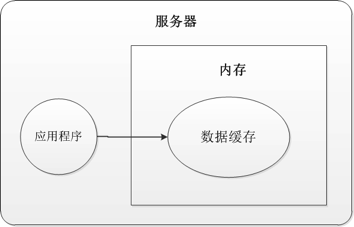
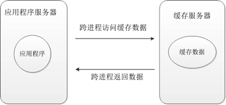
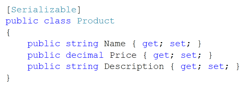
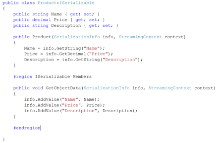
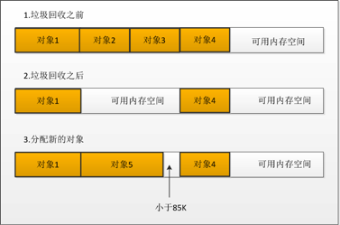
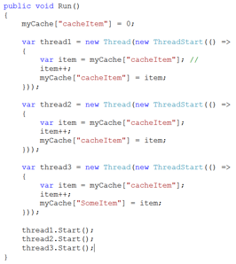
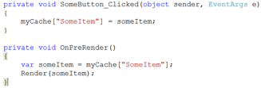

# 使用缓存的9大误区（上）

如果说要对一个站点或者应用程序经常优化，可以说缓存的使用是最快也是效果最明显的方式。一般而言，我们会把一些常用的，或者需要花费大量的资源或时间而产生的数据缓存起来，使得后续的使用更加快速。

　　如果真要细说缓存的好处，还真是不少，但是在实际的应用中，很多时候使用缓存的时候，总是那么的不尽人意。换句话说，假设本来采用缓存，可以使得性能提升为100（这里的数字只是一个计量符号而已，只是为了给大家一个“量”的体会），但是很多时候，提升的效果只有80,70，或者更少，甚至还会导致性能严重的下降，这个现象在使用分布式缓存的时候尤为突出。

　　在本篇文章中，我们将为大家讲述导致以上问题的9大症结，并且给出相对应的解决方案。文章以.NET为例子进行代码的演示，对于来及其他技术平台的朋友也是有参考价值的，只要替换相对应的代码就行了！

　　为了使得后文的阐述更加的方便，也使得文章更为的完整，我们首先来看看缓存的两种形式：本地内存缓存，分布式缓存。

　　首先对于本地内存缓存，就是把数据缓存在本机的内存中，如下图1所示：

　　从上图中可以很清楚的看出：

- 应用程序把数据缓存在本机的内存，需要的时候直接去本机内存进行获取。
- 对于.NET的应用而言，在获取缓存中的数据的时候，是通过对象的引用去内存中查找数据对象的，也就说，如果我们通过引用获取了数据对象之后，我们直接修改这个对象，其实我们真正的是在修改处于内存中的那个缓存对象。

　　对于分布式的缓存，此时因为缓存的数据是放在缓存服务器中的，或者说，此时应用程序需要跨进程的去访问分布式缓存服务器，如图2：

　　不管缓存服务器在哪里，因为涉及到了跨进程，甚至是跨域访问缓存数据，那么缓存数据在发送到缓存服务器之前就要先被序列化，当要用缓存数据的时候，应用程序服务器接收到了序列化的数据之后，会将之反序列化。序列化与反序列化的过程是非常消耗CPU的操作，很多问题就出现在这上面。

　　另外，如果我们把获取到的数据，在应用程序中进行了修改，此时缓存服务器中的原先的数据是没有修改的，除非我们再次将数据保存到缓存服务器。请注意：这一点和之前的本地内存缓存是不一样的。

　　对于缓存中的每一份数据，为了后文的讲述方面，我们称之为“缓存项“。

　　普及完了这两个概念之后，我们就进入今天的主题：使用缓存常见的9大误区：

1. **太过于依赖.NET****默认的序列化机制**
2. **缓存大对象**
3. **使用缓存机制在线程间进行数据的共享**
4. **认为调用缓存API****之后，数据会被立刻缓存起来**
5. **缓存大量的数据集合，而读取其中一部分**
6. **缓存大量具有图结构的对象导致内存浪费**
7. **缓存应用程序的配置信息**
8. **使用很多不同的键指向相同的缓存项**
9. **没有及时的更新或者删除再缓存中已经过期或者失效的数据**

　　下面，我们就每一点来具体的看看！

　　**太过于依赖.NET默认的序列化机制**

　　当我们在应用中使用跨进程的缓存机制，例如分布式缓存memcached或者微软的AppFabric，此时数据被缓存在应用程序之外的进程中。每次，当我们要把一些数据缓存起来的时候，缓存的API就会把数据首先序列化为字节的形式，然后把这些字节发送给缓存服务器去保存。同理，当我们在应用中要再次使用缓存的数据的时候，缓存服务器就会将缓存的字节发送给应用程序，而缓存的客户端类库接受到这些字节之后就要进行反序列化的操作了，将之转换为我们需要的数据对象。

　　另外还有三点需要注意的就是：

- 这个序列化与反序列化的机制都是发生在应用程序服务器上的，而缓存服务器只是负责保存而已。
- .NET中的默认使用的序列化机制不是最优的，因为它要使用反射机制，而反射机制是是非常耗CPU的，特别是当我们缓存了比较复杂的数据对象的时候。

　　基于这个问题，我们要自己选择一个比较好的序列化方法来尽可能的减少对CPU的使用。常用的方法就是让对象自己来实现ISerializable接口。

　　首先我们来看看默认的序列化机制是怎么样的。如图3：

　　然后，我们自己来实现ISerializable接口，如下图4所示：

　　我们自己实现的方式与.NET默认的序列化机制的最大区别在于：没有使用反射。自己实现的这种方式速度可以是默认机制的上百倍。

　　可能有人认为没有什么，不就是一个小小的序列化而已，有必要小题大做么？

　　在开发一个高性能应用（例如网站）而言，从架构，到代码的编写，以及后面的部署，每一个地方都需要优化。一个小问题，例如这个序列化的问题，初看起来不是问题，如果我们站点应用的访问量是百万，千万，甚至更高级别的，而这些访问需要去获取一些公共的缓存的数据，这个之前所谓的小问题就不小了！

　　下面，我们来看第二个误区。

　　**缓存大对象**

　　有时候，我们想要把一些大对象缓存起来，因为产生一次大对象的代价很大，我们需要产生一次，尽可能的多次使用，从而提升响应。

　　提到大对象，这里就很有必要对其进行一个比较深入的介绍了。在.NET中，所谓的大对象，就是指的其占用的内存大于了85K的对象，下面通过一个比较将问题说清楚。

　　如果现在有一个Person类的集合，定义为List<Person>，每个Person对象占用1K的内存，如果这个Person集合中包含了100个Person对象实例，那么这个集合是否是大对象呢？

　　回答是：不是！

　　因为集合中只是包含的Person对象实例的引用而言，即，在.NET的托管堆上面，这个Person集合分配的内存大小也就是100个引用的大小而言。

　　然后，对于下面的这个对象，就是大对象了: byte[] data = new byte[87040]（85 * 1024 = 87040）。

　　说到了这里，那就就谈谈，为什么说：产生一次大对象的代价很大。

　　因为在.NET中，大对象是分配在大对象托管堆上面的（我们简称为“大堆”，当然，还有一个对应的小堆），而这个大堆上面的对象的分配机制和小堆不一样：大堆在分配的时候，总是去需找合适的内存空间，结果就是导致出现内存碎片，导致内存不足！我们用一个图来描述一下，如图5所示：

　　上图非常明了，在图5中：

- 垃圾回收机制不会在回收对象之后压缩大堆（小堆是压缩的）。
- 分配对象的时候，需要去遍历大堆，去需找合适的空间，遍历是要花成本的。
- 如果某些空间小于85K，那么就不能分配了，只能白白浪费，也导致内存碎片。

　　讲完了这些之后，我们言归正传，来看看大对象的缓存。

　　正如之前讲过，将对象缓存和读取的时候是要进行序列化与反序列化的，缓存的对象越大（例如，有1M等），整个过程中就消耗更多的CPU。

　　对于这样的大对象，要看它使用的是否很频繁，是否是公用的数据对象，还是每个用户都要产生的。因为我们一旦缓存了（特别在分布式缓存中），就需要同时消耗缓存服务器的内存与应用程序服务器的CPU。如果使用的不频繁，建议每次生成！如果是公用的数据，那么建议多多的测试：将生产大对象的成本与缓存它的时候消耗的内存和CPU的成本进行比较，选择成本小的！如果是每个用户都要产生的，看看是否可以分解，如果实在不能分解，那么缓存，但是及时的释放！

　　**使用缓存机制在线程间进行数据的共享**

　　当数据放在缓存中的时候，我们程序的多个线程都可以访问这个公共的区域。多个线程在访问缓存数据的时候，会产生一些竞争，这也是多线程中常常发生的问题。

　　下面我们分别从本地内存缓存与分布式缓存两个方面介绍竞争的带来的问题。

　　看下面的一段代码：

　　对于本地内存缓存，对于上面的代码，当这个三个线程运行起来之后，在线程1中，item的值很多时候可能为1，线程2可能是2，线程3可能是3。当然，这不一定！只是大多数情况下的可能值！

　　如果是对于分布式缓存，就不好说了！因为数据的修改不是立刻发生在本机的内存中的，而是经过了一个跨进程的过程。

　　有一些缓存模块已经实现了加锁的方式来解决这个问题，例如AppFabric。大家在修改缓存数据的时候要特别注意这一点。

　　**认为调用缓存API\**之后，数据会被立刻缓存起来\****

　　有时候，当我们调用了缓存的API之后，我们就会认为：数据已经被换成了，之后就可以直接读取缓存中的数据。尽管情况很多时候如此，但是不是绝对的！很多的问题就是这样产生的！

　　我们通过一个例子来讲解。

　　例如，对于一个ASP.NET 应用而言，如果我们在一个按钮的Click事件中调用了缓存API，然后在页面呈现的时候，就去读取缓存，代码如下：

　　上面的代码照道理来说是对的，但是会发生问题。按钮点击之后回传页面，然后呈现页面的时候显示数据，流程没有问题。但是没有考虑到这样一个问题：如果服务器的内存紧张，而导致进行服务器内存的回收，那么很有可能缓存的数据就没有了！

　　这里有朋友就要说了：内存回收这么快？

　　这主要看我们的一些设置和处理。

　　一般而言，缓存机制都是会设置绝对过期时间与相对过期时间，二者的区别，大家应很清楚，我这里不多说。对于上面的代码而言，如果我们设置的是绝对过期时间，假设1分钟，如果页面处理的非常慢，时间超过了1分钟，那么等到呈现的时候，可能缓存中的数据已经没有了！

　　有时候，即使我们在第一行代码中缓存了数据，那么也许在第三行代码中，我们去缓存读取数据的时候，就已经没有了。这或许是因为在服务器内存压力很大的，缓存机制将最少访问的数据直接清掉。或者服务器CPU很忙，网络也不好，导致数据没有被即使的序列化保存到缓存服务器中。

　　另外，对于ASP.NET而言，如果使用了本地内存缓存，那么，还涉及到IIS的配置问题（对缓存内存的限制），我们有机会专门为大家分享这方面的知识。

　　所以，每次在使用缓存数据的时候，要判断是否存在，不然，会有很多的“找不到对象”的错误，产生一些我们认为的“奇怪而又合理的现象”。