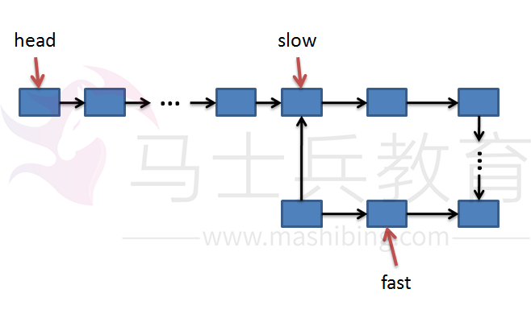
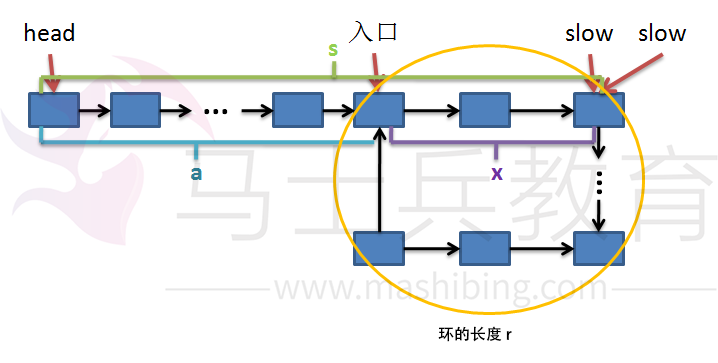
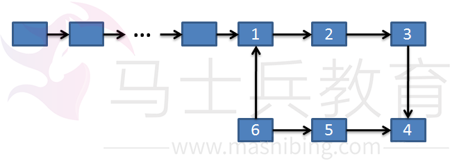
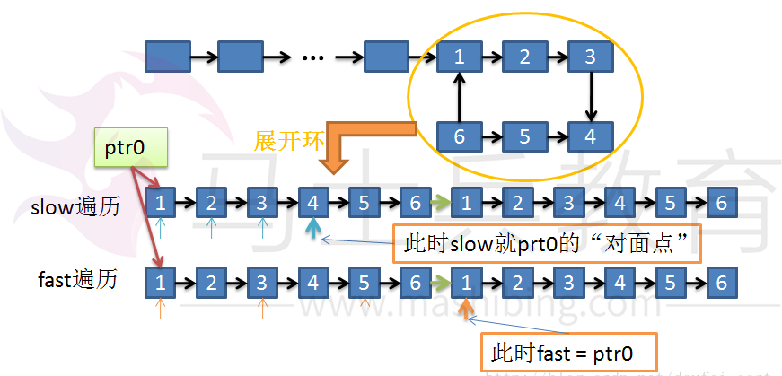
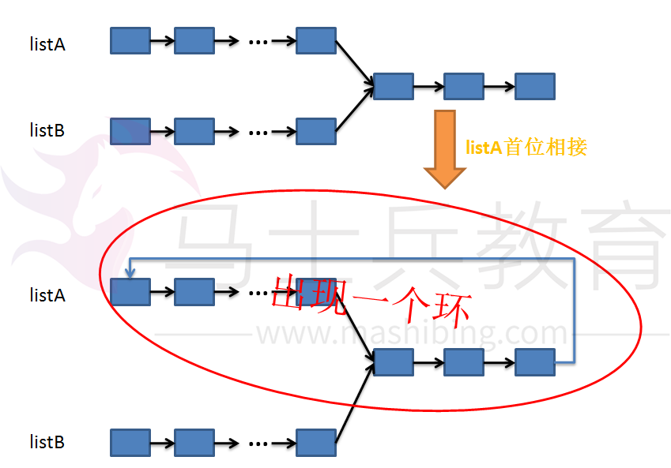

# 判断链表中是否有环 ----- 有关单链表中环的问题


给定一个单链表，判断其中是否有环，已经是一个比较老同时也是比较经典的问题，在网上搜集了一些资料，

然后总结一下大概可以涉及到的问题，以及相应的解法。


首先，关于单链表中的环，一般涉及到一下问题：

1.给一个单链表，判断其中是否有环的存在；

2.如果存在环，找出环的入口点；

3.如果存在环，求出环上节点的个数；

4.如果存在环，求出链表的长度；

5.如果存在环，求出环上距离任意一个节点最远的点（对面节点）；

6.（扩展）如何判断两个无环链表是否相交；

7.（扩展）如果相交，求出第一个相交的节点；


下面，我将针对上面这七个问题一一给出解释和相应的代码。

1.判断时候有环（链表头指针为head）

对于这个问题我们可以采用“快慢指针”的方法。就是有两个指针fast和slow，开始的时候两个指针都指向链表头head，然后在每一步

操作中slow向前走一步即：slow = slow->next，而fast每一步向前两步即：fast = fast->next->next。

由于fast要比slow移动的快，如果有环，fast一定会先进入环，而slow后进入环。当两个指针都进入环之后，经过一定步的操作之后

二者一定能够在环上相遇，并且此时slow还没有绕环一圈，也就是说一定是在slow走完第一圈之前相遇。证明可以看下图：



当slow刚进入环时每个指针可能处于上面的情况，接下来slow和fast分别向前走即：


```
if (slow != NULL && fast->next != NULL)
{
         slow = slow -> next ;
         fast = fast -> next -> next ;
}
```

也就是说，slow每次向前走一步，fast向前追了两步，因此每一步操作后fast到slow的距离缩短了1步，这样继续下去就会使得


两者之间的距离逐渐缩小：...、5、4、3、2、1、0 -> 相遇。又因为在同一个环中fast和slow之间的距离不会大于换的长度，因此

到二者相遇的时候slow一定还没有走完一周（或者正好走完以后，这种情况出现在开始的时候fast和slow都在环的入口处）。


下面给出问题1的完整代码：


```
typedef struct node{
	char data ;
	node * next ;
}Node;
bool exitLoop(Node *head)
{
	Node *fast, *slow ;
	slow = fast = head ;

	while (slow != NULL && fast -> next != NULL)
	{
		slow = slow -> next ;
		fast = fast -> next -> next ;
		if (slow == fast)
			return true ;
	}
	return false ;
}
```


下面看问题2，找出环的入口点：


我结合着下图讲解一下：





从上面的分析知道，当fast和slow相遇时，slow还没有走完链表，假设fast已经在环内循环了n(1<= n)圈。假设slow走了s步，则fast走了2s步，又由于

fast走过的步数 = s + n*r（s + 在环上多走的n圈），则有下面的等式：


2*s = s + n  * r ; (1)

 => s = n*r (2)

如果假设整个链表的长度是L，入口和相遇点的距离是x（如上图所示），起点到入口点的距离是a(如上图所示)，则有：

a + x = s = n * r; (3)  由（2）推出

a + x = (n - 1) * r + r  = (n - 1) * r + (L - a) (4) 由环的长度 = 链表总长度 - 起点到入口点的距离求出

a = (n - 1) * r + (L -a -x) (5)


集合式子（5）以及上图我们可以看出，从链表起点head开始到入口点的距离a,与从slow和fast的相遇点（如图）到入口点的距离相等。

因此我们就可以分别用一个指针（ptr1, prt2），同时从head与slow和fast的相遇点出发，每一次操作走一步，直到ptr1 == ptr2，此时的位置也就是入口点！

到此第二个问题也已经解决。

下面给出示意性的简单代码（没有测试但是应该没有问题）：


```
Node* findLoopStart(Node *head)
{
	Node *fast, *slow ;
	slow = fast = head ;

	while (slow != NULL && fast -> next != NULL)
	{
		slow = slow -> next ;
		fast = fast -> next -> next ;
		if (slow == fast) break ;
	}
	if (slow == NULL || fast -> next == NULL) return NULL ; //没有环，返回NULL值

	Node * ptr1 = head ; //链表开始点
	Node * ptr2 = slow ; //相遇点
	while (ptr1 != ptr2) 
	{
		ptr1 = ptr1 -> next ;
		ptr2 = ptr2 -> next ;
	}
	return ptr1 ; //找到入口点
}
```


第3个问题，如果存在环，求环上节点的个数：

对于这个问题，我这里有两个思路（肯定还有其它跟好的办法）：

思路1：记录下相遇节点存入临时变量tempPtr，然后让slow(或者fast，都一样)继续向前走slow = slow -> next；一直到slow == tempPtr; 此时经过的步数就是环上节点的个数；

思路2： 从相遇点开始slow和fast继续按照原来的方式向前走slow = slow -> next; fast = fast -> next -> next；直到二者再次项目，此时经过的步数就是环上节点的个数 。


第一种思路很简单，其实就是一次遍历链表的环，从而统计出点的个数，没有什么可以详细解释的了。

对于第二种思路，我们可以这样想，结合上面的分析，fast和slow没一次操作都会使得两者之间的距离较少1。我们可以把两者相遇的时候看做两者之间的距离正好是整个环的

长度r。因此，当再次相遇的时候所经过的步数正好是环上节点的数目。

由于这两种思路都比较简单，代码也很容易实现，这里就不给出了。


问题4是如果存在环，求出链表的长度：

到这里，问题已经简单的多了，因为我们在问题1、2、3中已经做得足够的”准备工作“。

我们可以这样求出整个链表的长度：


链表长度L = 起点到入口点的距离 + 环的长度r;


已经知道了起点和入口点的位置，那么两者之间的距离很好求了吧！环的长度也已经知道了，因此该问题也就迎刃而解了！


问题5是，求出环上距离任意一个节点最远的点（对面节点）


如下图所示，点1和4、点2和5、点3和6分别互为”对面节点“ ，也就是换上最远的点，我们的要求是怎么求出换上任意一个点的最远点。




对于换上任意的一个点ptr0, 我们要找到它的”对面点“，可以这样思考：同样使用上面的快慢指针的方法，让slow和fast都指向ptr0，每一步都执行与上面相同的操作（slow每次跳一步，fast每次跳两步），

当fast = ptr0或者fast = prt0->next的时候slow所指向的节点就是ptr0的”对面节点“。

为什么是这样呢？我们可以这样分析：




如上图，我们想像一下，把环从ptro处展开，展开后可以是无限长的（如上在6后重复前面的内容）如上图。

现在问题就简单了，由于slow移动的距离永远是fast的一般，因此当fast遍历玩整个环长度r个节点的时候slow正好遍历了r/2个节点，

也就是说，此时正好指向距离ptr0最远的点。


对于问题6（扩展）如何判断两个无环链表是否相交，和7（扩展）如果相交，求出第一个相交的节点，其实就是做一个问题的转化：


假设有连个链表listA和listB，如果两个链表都无环，并且有交点，那么我们可以让其中一个链表（不妨设是listA）的为节点连接到其头部，这样在listB中就一定会出现一个环。

因此我们将问题6和7分别转化成了问题1和2.

看看下图就会明白了：



