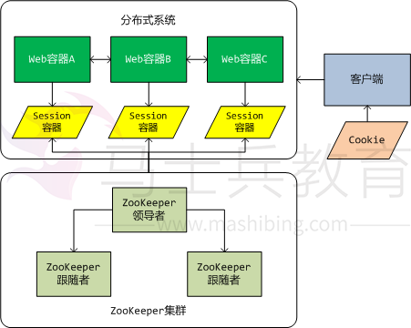
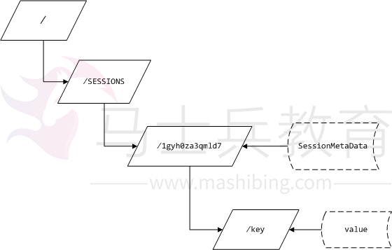

# 基于ZooKeeper的分布式Session实现

认识*ZooKeeper*

*ZooKeeper*——“动物园管理员”。动物园里当然有好多的动物，游客可以根据动物园提供的向导图到不同的场馆观赏各种类型的动物，而不是像走在原始丛林里，心惊胆颤的被动物所观赏。为了让各种不同的动物呆在它们应该呆的地方，而不是相互串门，或是相互厮杀，就需要动物园管理员按照动物的各种习性加以分类和管理，这样我们才能更加放心安全的观赏动物。回到我们企业级应用系统中，随着信息化水平的不断提高，我们的企业级系统变得越来越庞大臃肿，性能急剧下降，客户抱怨频频。拆分系统是目前我们可选择的解决系统可伸缩性和性能问题的唯一行之有效的方法。但是拆分系统同时也带来了系统的复杂性——各子系统不是孤立存在的，它们彼此之间需要协作和交互，这就是我们常说的分布式系统。各个子系统就好比动物园里的动物，为了使各个子系统能正常为用户提供统一的服务，必须需要一种机制来进行协调——这就是*ZooKeeper*——动物园管理员。

关于*ZooKeeper*更正式的介绍——*ZooKeeper*是一个为分布式应用程序提供高性能协调服务的工具集合。它可以应用在一些需要提供统一协调服务的*case*中，例如命名、配置管理、同步和组服务等。而在我们的*case*中，它被作为一个协调分布式环境中各子系统之间共享状态数据的基础设施。

*2．* *ZooKeeper*之特性

*ZooKeeper*本质上是一个分布式的小文件存储系统。原本是*Apache Hadoop*的一个组件，现在被拆分为一个*Hadoop*的独立子项目，在*HBase*（*Hadoop*的另外一个被拆分出来的子项目，用于分布式环境下的超大数据量的*DBMS*）中也用到了*ZooKeeper*集群。*ZooKeeper*有如下的特性：

*1）* 简单

*ZooKeeper*核心是一个精简的文件系统，它提供了一些简单的文件操作以及附加的功能，例如排序和通知。

*2）* 易表达

*ZooKeeper*的数据结构原型是一棵*znode*树（类似*Linux*的文件系统），并且它们是一些已经被构建好的块，可以用来构建大型的协作数据结构和协议。

*3）* 高可用性

*ZooKeeper*可以运行在一组服务器上，同时它们被设计成高可用性，为你的应用程序避免单点故障。

*4）* 松耦合交互

*ZooKeeper*提供的*Watcher*机制使得各客户端与服务器的交互变得松耦合，每个客户端无需知晓其他客户端的存在，就可以和其他客户端进行数据交互。

*5）* 丰富的*API*

*ZooKeeper*为开发人员提供了一套丰富的*API*，减轻了开发人员编写通用协议的负担。

这篇文章是关于如何在*ZooKeeper*上创建分布式*Session*系统，所以关于*ZooKeeper*的安装、使用、管理等主题不在本文的讨论范围内，如果想了解*ZooKeeper*更加详细的情况，请看另外一篇文章《*ZooKeeper*实战》。

*3．* 为什么使用*ZooKeeper*

目前有关于分布式*Session*的实现基本上都是基于*memcached*。*memcached*本质上是一个内存缓存系统。虽然*memcached*也可以是分布式集群环境的，但是对于一份数据来说，它总是存储在某一台*memcached*服务器上。如果发生网络故障或是服务器当机，则存储在这台服务器上的所有数据都将不可访问。由于数据是存储在内存中的，重启服务器，将导致数据全部丢失。当然你可以自己实现一套机制，用来在分布式*memcached*之间进行数据的同步和持久化，但是实现这套机制谈何容易！

由上述*ZooKeeper*的特性可知，*ZooKeeper*是一个分布式小文件系统，并且被设计为高可用性。通过选举算法和集群复制可以避免单点故障，由于是文件系统，所以即使所有的*ZooKeeper*节点全部挂掉，数据也不会丢失，重启服务器之后，数据即可恢复。另外*ZooKeeper*的节点更新是原子的，也就是说更新不是成功就是失败。通过版本号，*ZooKeeper*实现了更新的乐观锁，当版本号不相符时，则表示待更新的节点已经被其他客户端提前更新了，而当前的整个更新操作将全部失败。当然所有的一切*ZooKeeper*已经为开发者提供了保障，我们需要做的只是调用*API*。

有人会怀疑*ZooKeeper*的执行能力，在*ZooKeeper*诞生的地方——*Yahoo!*给出了一组数据将打消你的怀疑。它的吞吐量标准已经达到大约每秒*10000*基于写操作的工作量。对于读操作的工作量来说，它的吞吐量标准还要高几倍。

*4．* 实现分布式*Session*所面临的挑战

实现分布式*session*最大的挑战莫过于如何实现*session*在分布式系统之间的共享。在分布式环境下，每个子系统都是跨网络的独立*JVM*，在这些*JVM*之间实现共享数据的方式无非就是*TCP/IP*通讯。无论是*memcached*，还是*ZooKeeper*，底层都是基于*TCP/IP*的。所以，我认为使用何种工具实现分布式*Session*都是可行的，没有那种实现优于另外一种实现，在不同的应用场景，各有优缺点。世间万物，无十全十美，不要盲目的崇拜某种技术，唯有适合才是真理。

*1）* *Session ID*的共享

*Session ID*是一个实例化*Session*对象的唯一标识，也是它在*Web*容器中可以被识别的唯一身份标签。*Jetty*和*Tomcat*容器会通过一个*Hash*算法，得到一个唯一的*ID*字符串，然后赋值给某个实例化的*Session*，此时，这个*Session*就可以被放入*Web*容器的*SessionManager*中开始它短暂的一生。在*Servlet*中，我们可以通过*HttpSession*的*getId()*方法得到这个值，但是我们无法改变这个值。当*Session*走到它一生尽头的时候，*Web*容器的*SessionManager*会根据这个*ID*将其“火化”。所以*Session ID*是非常重要的一个属性，并且要保证它的唯一性。在单系统中，*Session ID*只需要被自身的*Web*容器读写，但是在分布式环境中，多个*Web*容器需要共享同一个*Session ID*。因此，当某个子系统的*Web*容器产生一个新的*ID*时，它必须需要一种机制来通知其他子系统，并且告知新*ID*是什么。

*2）* *Session*中数据的复制

和共享*Session ID*的问题一样，在分布式环境下，*Session*中的用户数据也需要在各个子系统中共享。当用户通过*HttpSession*的*setAttribute()*方法在*Session*中设置了一个用户数据时，它只存在于当前与用户交互的那个*Web*容器中，而对其他子系统的*Web*容器来说，这些数据是不可见的。当用户在下一步跳转到另外一个*Web*容器时，则又会创建一个新的*Session*对象，而此*Session*中并不包含上一步骤用户设置的数据。其实*Session*在分布式系统之间的复制实现是简单的，但是每次在*Session*数据发生变化时，都在子系统之间复制一次数据，会大大降低用户的响应速度。因此我们需要一种机制，即可以保证*Session*数据的一致性，又不会降低用户操作的响应度。

*3）* *Session*的失效

*Session*是有生命周期的，当*Session*的空闲时间*(maxIdle*属性值*)*超出限制时，*Session*就失效了，这种设计主要是考虑到了*Web*容器的可靠性。当一个系统有上万人使用时，就会产生上万个*Session*对象，由于*HTTP*的无状态特性，服务器无法确切的知道用户是否真的离开了系统。因此如果没有失效机制，所有被*Session*占据的内存资源将永远无法被释放，直到系统崩溃为止。在分布式环境下，*Session*被简单的创建，并且通过某种机制被复制到了其他系统中。你无法保证每个子系统的时钟都是一致的，可能相差几秒，甚至相差几分钟。当某个*Web*容器的*Session*失效时，可能其他的子系统中的*Session*并未失效，这时会产生一个有趣的现象，一个用户在各个子系统之间跳转时，有时会提示*Session*超时，而有时又能正常操作。因此我们需要一种机制，当某个系统的*Session*失效时，其他所有系统的与之相关联的*Session*也要同步失效。

*4）* 类装载问题

在单系统环境下，所有类被装载到“同一个”*ClassLoader*中。我在同一个上打了引号，因为实际上并非是同一个*ClassLoader*，只是逻辑上我们认为是同一个。这里涉及到了*JVM*的类装载机制，由于这个主题不是本文的讨论重点，所以相关详情可以参考相关的*JVM*文档。因此即使是由*memcached*或是*ZooKeeper*返回的字节数组也可以正常的反序列化成相对应的对象类型。但是在分布式环境下，问题就变得异常的复杂。我们通过一个例子来描述这个问题。用户在某个子系统的*Session*中设置了一个*User*类型的对象，通过序列化，将*User*类型的对象转换成字节数组，并通过网络传输到了*memcached*或是*ZooKeeper*上。此时，用户跳转到了另外一个子系统上，需要通过*getAttribute*方法从*memcached*或是*ZooKeeper*上得到先前设置的那个*User*类型的对象数据。但是问题出现了，在这个子系统的*ClassLoader*中并没有装载*User*类型。因此在做反序列化时出现了*ClassNotFoundException*异常。

当然上面描述的*4*点挑战只是在实现分布式*Session*过程中面临的关键问题，并不是全部。其实在我实现分布式*Session*的整个过程中还遇到了其他的一些挑战。比如，需要通过*filter*机制拦截*HttpServletRequest*，以便覆盖其*getSession*方法。但是在不同的*Web*容器中（例如*Jetty*或是*Tomcat*）对*HttpServletRequest*的实现是不一样的，虽然都是实现了*HttpServletRequest*接口，但是各自又添加了一些特性在其中。例如，在*Jetty*容器中，*HttpSession*的实现类是一个保护内部类，无法从其继承并覆盖相关的方法，只能从其实现类的父类中继承更加抽象的*Session*实现。这样就会造成一个问题，我必须重新实现对*Session*整个生命周期管理的*SessionManager*接口。有人会说，那就放弃它的实现吧，我们自己实现*HttpSession*接口。很不幸，那是不可能的。因为在*Jetty*的*HttpServletRequest*实现类的一些方法中对*Session*的类型进行了强制转换（转换成它自定义的*HttpSession*实现类），如果不从其继承，则会出现*ClassCastException*异常。相比之下，*Tomcat*的对*HttpServletRequest*和*HttpSession*接口的实现还是比较标准的。由此可见，实现分布式*Session*其实是和某种*Web*容器紧密耦合的。并不像网上有些人的轻描淡写，仅仅覆盖*setAttribute*和*getAttribute*方法是行不通的。

*5．* 算法实现

从上述的挑战来看，要写一个分布式应用程序是困难的，主要原因是因为局部故障。由于数据需要通过网络传输，而网络是不稳定的，所以如果网络发生故障，则所有的数据通讯都将终止。*ZooKeeper*并不能解决网络故障的发生，甚至它本身也是基于网络的分布式应用程序。但是它为我们提供了一套工具集合，帮助我们建立安全处理局部故障的分布式应用程序。接下来我们就开始描述如何实现基于*ZooKeeper*的分布式*Session*系统。

*1）* 基于*ZooKeeper*的分布式*Session*系统架构

 

为了实现高可用性，采用了*ZooKeeper*集群，*ZooKeeper*集群是由一台领导者服务器和若干台跟随者服务器构成（总服务器数要奇数）。所有的读操作由跟随者提供，而写操作由领导者提供，并且领导者还负责将写入的数据复制到集群中其他的跟随者。当领导者服务器由于故障无法访问时，剩下的所有跟随者服务器就开始进行领导者的选举。通过选举算法，最终由一台原本是跟随者的服务器升级为领导者。当然原来的领导者服务器一旦被恢复，它就只能作为跟随者服务器，并在下一次选举中争夺领导者的位置。

*Web*容器中的*Session*容器也将发生变化。它不再对用户的*Session*进行本地管理，而是委托给*ZooKeeper*和我们自己实现的*Session*管理器。也就是说，*ZooKeeper*负责*Session*数据的存储，而我们自己实现的*Session*管理器将负责*Session*生命周期的管理。

最后是关于在分布式环境下共享*Session ID*的策略。我们还是通过客户端的*Cookie*来实现，我们会自定义一个*Cookie*，并通过一定的算法在多个子系统之间进行共享。下面会对此进行详细的描述。

*2）* 分布式*Session*的数据模型

*Session*数据的存储是有一定格式的，下图展示了一个*Session ID*为*”1gyh0za3qmld7”*的*Session*在*ZooKeeper*上的存储结构：

 

*“/SESSIONS”*是一个组节点，用来在*ZooKeeper*上划分不同功能组的定义。你可以把它理解为一个文件夹目录。在这个目录下可以存放*0*个或*N*个子节点，我们就把一个*Session*的实例作为一个节点，节点的名称就是*Session ID*。在*ZooKeeper*中，每个节点本身也可以存放一个字节数组。因此，每个节点天然就是一个*Key-Value*键值对的数据结构。

我们将*Session*中的用户数据（本质上就是一个*Map*）设计成多节点，节点名称就是*Session*的*key*，而节点的数据就是*Session*的*Value*。采用这种设计主要是考虑到性能问题和*ZooKeeper*对节点大小的限制问题。当然，我们可以将*Session*中的用户数据保存在一个*Map*中，然后将*Map*序列化之后存储在对应的*Session*节点中。但是大部分情况下，我们在读取数据时并不需要整个*Map*，而是*Map*中的一个或几个值。这样就可以避免一个非常大的*Map*在网络间传来传去。同理，在写*Session*的时候，也可以最大限度的减少数据流量。另外由于*ZooKeeper*是一个小文件系统，为了性能，每个节点的大小为*1MB*。如果*Session*中的*Map*大于*1MB*，就不能单节点的存储了。当然，一个*Key*的数据量是很少会超过*1MB*的，如果真的超过*1MB*，你就应该考虑一下，是否应该将此数据保存在*Session*中。

最后我们来关注一下*Session*节点中的数据——*SessionMetaData*。它是一个*Session*实例的元数据，保存了一些与*Session*生命周期控制有关的数据。以下代码就是*SessionMetaData*的实现：

***\*public\*******\*class\**** *SessionMetaData****\*implements\**** *Serializable {*

  ***\*private\*******\*static\*******\*final\*******\*long\******serialVersionUID** *= -6446174402446690125L;*

  ***\*private\**** *String*      *id**;*

  */**session*的创建时间**/*

  ***\*private\**** *Long*       *createTm**;*

  */**session*的最大空闲时间**/*

  ***\*private\**** *Long*       *maxIdle**;*

  */**session*的最后一次访问时间**/*

  ***\*private\**** *Long*       *lastAccessTm**;*

  */***是否可用**/*

  ***\*private\**** *Boolean*     *validate*    *=****\*false\*****;*

  */***当前版本**/*

  ***\*private\*******\*int\****       *version*     *= 0;*

 

  */***

  ***构造方法

  **/*

  ***\*public\**** *SessionMetaData() {*

​    ***\*this\*****.**createTm* *= System.\*currentTimeMillis\*();*

​    ***\*this\*****.**lastAccessTm* *=* ***\*this\*****.**createTm**;*

​    ***\*this\*****.**validate* *=* ***\*true\*****;*

*}*

 

*……*以下是*N*多*getter*和*setter*方法

 

其中需要关注的属性有：

*a)*  *id*属性：*Session*实例的*ID*。

*b)*  *maxIdle*属性：*Session*的最大空闲时间，默认情况下是*30*分钟。

*c)*  *lastAccessTm*属性：*Session*的最后一次访问时间，每次调用*Request.getSession*方法时都会去更新这个值。用来计算当前*Session*是否超时。如果*lastAccessTm+maxIdle*小于*System.***currentTimeMillis***()*，就表示当前*Session*超时。

*d)*  *validate*属性：表示当前*Session*是否可用，如果超时，则此属性为*false*。

*e)*  *version*属性：这个属性是为了冗余*Znode*的*version*值，用来实现乐观锁，对*Session*节点的元数据进行更新操作。

这里有必要提一下一个老生常谈的问题，就是所有存储在节点上的对象必须是可序列化的，也就是必须实现*Serializable*接口，否则无法保存。这个问题在*memcached*和*ZooKeeper*上都存在的。

*3）* 实现过程

实现分布式*Session*的第一步就是要定义一个*filter*，用来拦截*HttpServletRequest*对象。以下代码片段，展现了在*Jetty*容器下的*filter*实现。

***\*public\*******\*class\**** *JettyDistributedSessionFilter****\*extends\**** *DistributedSessionFilter {*

  ***\*private\**** *Logger**log* *= Logger.\*getLogger\*(getClass());*

 

  *@Override*

  ***\*public\*******\*void\**** *init(FilterConfig filterConfig)****\*throws\**** *ServletException {*

​    ***\*super\*****.init(filterConfig);*

​    *//*实例化*Jetty*容器下的*Session*管理器

​    *sessionManager* *=****\*new\**** *JettyDistributedSessionManager(**conf**);*

​    ***\*try\**** *{*

​      *sessionManager**.start();**//*启动初始化

​      *//*创建组节点

​      *ZooKeeperHelper.\*createGroupNode\*();*

​      *log**.debug(**"DistributedSessionFilter.init completed."**);*

​    *}****\*catch\**** *(Exception e) {*

​      *log**.error(e);*

​    *}*

  *}*

 

  *@Override*

  ***\*public\*******\*void\**** *doFilter(ServletRequest request, ServletResponse response, FilterChain chain)*

​                                              ***\*throws\**** *IOException,*

​                                              *ServletException {*

​    *//Jetty*容器的*Request*对象包装器，用于重写*Session*的相关操作

​    *JettyRequestWrapper req =****\*new\**** *JettyRequestWrapper(request,**sessionManager**);*

​    *chain.doFilter(req, response);*

  *}*

*}*

这个*filter*是继承自*DistributedSessionFilter*的，这个父类主要是负责完成初始化参数设置等通用方法的实现，代码如下所示：

***\*public\*******\*abstract\*******\*class\**** *DistributedSessionFilter****\*implements\**** *Filter {*

  ***\*protected\**** *Logger*     *log*   *= Logger.\*getLogger\*(getClass());*

  */***参数配置**/*

  ***\*protected\**** *Configuration*  *conf**;*

  */**Session*管理器**/*

  ***\*protected\**** *SessionManager* *sessionManager**;*

  */***初始化参数名称**/*

  ***\*public\*******\*static\*******\*final\**** *String***SERVERS** *=**"servers"**;*

  ***\*public\*******\*static\*******\*final\**** *String***TIMEOUT** *=**"timeout"**;*

  ***\*public\*******\*static\*******\*final\**** *String***POOLSIZE** *=**"poolsize"**;*

 

  */***

  ***初始化

  ******\*@see\**** *javax.servlet.Filter#init(javax.servlet.FilterConfig)*

  **/*

  *@Override*

  ***\*public\*******\*void\**** *init(FilterConfig filterConfig)****\*throws\**** *ServletException {*

​    *conf* *=****\*new\**** *Configuration();*

​    *String servers = filterConfig.getInitParameter(***SERVERS***);*

​    ***\*if\**** *(StringUtils.\*isNotBlank\*(servers)) {*

​      *conf**.setServers(servers);*

​    *}*

​    *String timeout = filterConfig.getInitParameter(***TIMEOUT***);*

​    ***\*if\**** *(StringUtils.\*isNotBlank\*(timeout)) {*

​      ***\*try\**** *{*

​        *conf**.setTimeout(Long.\*valueOf\*(timeout));*

​      *}****\*catch\**** *(NumberFormatException ex) {*

​        *log**.error(**"timeout parse error["* *+ timeout +**"]."**);*

​      *}*

​    *}*

​    *String poolsize = filterConfig.getInitParameter(***POOLSIZE***);*

​    ***\*if\**** *(StringUtils.\*isNotBlank\*(poolsize)) {*

​      ***\*try\**** *{*

​        *conf**.setPoolSize(Integer.\*valueOf\*(poolsize));*

​      *}****\*catch\**** *(NumberFormatException ex) {*

​        *log**.error(**"poolsize parse error["* *+ poolsize +**"]."**);*

​      *}*

​    *}*

​    *//*初始化*ZooKeeper*配置参数

​    *ZooKeeperHelper.\*initialize\*(**conf**);*

  *}*

 

  */***

  ***销毁

  ******\*@see\**** *javax.servlet.Filter#destroy()*

  **/*

  *@Override*

  ***\*public\*******\*void\**** *destroy() {*

​    ***\*if\**** *(**sessionManager* *!=****\*null\*****) {*

​      ***\*try\**** *{*

​        *sessionManager**.stop();*

​      *}****\*catch\**** *(Exception e) {*

​        *log**.error(e);*

​      *}*

​    *}*

​    *//*销毁*ZooKeeper*

​    *ZooKeeperHelper.\*destroy\*();*

​    *log**.debug(**"DistributedSessionFilter.destroy completed."**);*

  *}*

在*filter*中需要关注的重点是*doFilter*方法。

  *@Override*

  ***\*public\*******\*void\**** *doFilter(ServletRequest request, ServletResponse response, FilterChain chain)*

​                                              ***\*throws\**** *IOException,*

​                                              *ServletException {*

​    *//Jetty*容器的*Request*对象包装器，用于重写*Session*的相关操作

​    *JettyRequestWrapper req =****\*new\**** *JettyRequestWrapper(request,**sessionManager**);*

​    *chain.doFilter(req, response);*

  *}*

*}*

这里实例化了一个包装器（装饰者模式）类，用来包装*Jetty*容器的*Request*对象，并覆盖其*getSession*方法。 另外我们还自己实现*sessionManager*接口，用来管理*Session*的生命周期。通过*filter*机制，我们就接管了*Session*的整个生命周期的管理权。

接下来我们来看看，*Request*包装器是如何重写*getSession*方法，替换成使用*ZooKeeper*上的*Session*数据。关键代码如下所示：

*@Override*

  ***\*public\**** *HttpSession getSession(****\*boolean\**** *create) {*

​    *//*检查*Session*管理器

​    ***\*if\**** *(**sessionManager* *==****\*null\**** *&& create) {*

​      ***\*throw\*******\*new\**** *IllegalStateException(**"No SessionHandler or SessionManager"**);*

​    *}*

​    ***\*if\**** *(**session* *!=****\*null\**** *&&**sessionManager* *!=****\*null\*****) {*

​      ***\*return\*****session**;*

​    *}*

 

​    *session* *=****\*null\*****;*

 

​    *//*从客户端*cookie*中查找*Session ID*

​    *String id =**sessionManager**.getRequestSessionId(**request**);*

​    *log**.debug(**"*获取客户端的*Session ID:["* *+ id +**"]"**);*

​    ***\*if\**** *(id !=****\*null\**** *&&**sessionManager* *!=****\*null\*****) {*

​      *//*如果存在，则先从管理器中取

​      *session* *=**sessionManager**.getHttpSession(id,**request**);*

​      ***\*if\**** *(**session* *==****\*null\**** *&& !create) {*

​        ***\*return\*******\*null\*****;*

​      *}*

​    *}*

​    *//*否则实例化一个新的*Session*对象

​    ***\*if\**** *(**session* *==****\*null\**** *&&**sessionManager* *!=****\*null\**** *&& create) {*

​      *session* *=**sessionManager**.newHttpSession(**request**);*

​    *}*

​    ***\*return\*****session**;*

  *}*

 

其实实现很简单，大部分工作都委托给了*sessionManager*来处理。因此，还是让我们来关注*sessionManager*的相关方法实现。

*A）* 获取*Session ID:*

*@Override*

  ***\*public\**** *StringgetRequestSessionId(HttpServletRequest request) {*

​    ***\*return\**** *CookieHelper.\*findSessionId\*(request);*

  *}*

这个方法就是从客户端的*Cookies*中查找我们的一个自定义的*Cookie*值，这个*Cookie*的名称为：*”DISTRIBUTED_SESSION_ID”(Web*容器自己也在*Cookie*中写了一个值，用来在不同的*request*中传递*Session ID*，这个*Cookie*的名称叫“*JSESSIONID*”*)*。如果返回*null*，则表示客户端从来都没有创建过*Session*实例。

*B）* 如果返回的*Cookie*值不为*null*，则有*3*种可能性：其一，已经实例化过一个*Session*对象并且可以正常使用；其二，虽然已经实例化过了，但是可能此*Session*已经超时失效；其三，分布式环境中的其他子系统已经实例化过了，但是本系统中还未实例化过此*Session*对象。所以先要对已经存在的*Session ID*进行处理。关键代码如下：

*@Override*

  ***\*public\**** *HttpSession getHttpSession(String id, HttpServletRequest request) {*

​    *//*类型检查

​    ***\*if\**** *(!(request****\*instanceof\**** *Request)) {*

​      *log**.warn(**"*不是*Jetty*容器下的*Request*对象*"**);*

​      ***\*return\*******\*null\*****;*

​    *}*

​    *//*将*HttpServletRequest*转换成*Jetty*容器的*Request*类型

​    *Request req = (Request) request;*

​    *//ZooKeeper*服务器上查找指定节点是否有效

​    ***\*boolean\**** *valid = ZooKeeperHelper.\*isValid\*(id);*

​    *//*如果为*false*，表示服务器上无该*Session*节点，需要重新创建*(*返回*null)*

​    ***\*if\**** *(!valid) {*

​      *//*删除本地的副本

​      *sessions**.remove(id);*

​      ***\*return\*******\*null\*****;*

​    *}****\*else\**** *{*

​      *//*更新*Session*节点的元数据

​      *ZooKeeperHelper.\*updateSessionMetaData\*(id);*

​      *HttpSession session =**sessions**.get(id);*

​      *//*如果存在，则直接返回

​      ***\*if\**** *(session !=****\*null\*****) {*

​        ***\*return\**** *session;*

​      *}*

​      *//*否则创建指定*ID*的*Session*并返回*(*用于同步分布式环境中的其他机器上的*Session*本地副本*)*

​      *session =****\*new\**** *JettyDistributedSession((AbstractSessionManager) req.getSessionManager(),*

​        *System.\*currentTimeMillis\*(), id);*

​      *sessions**.put(id, session);*

​      ***\*return\**** *session;*

​    *}*

  *}*

首先根据*ID*去*ZooKeeper*上验证此*Session*是否有效，如果无效了，则直接返回*null*，表示此*Session*已经超时不可用，同时需要删除本地的“影子”*Session*对象（不管存在与否）。如果该节点有效，则首先更新该*Session*节点的元数据（例如，最后一次访问时间）。然后先到本地的*Session*容器中查找是否存在该*ID*的*Session*对象。本地*Session*容器中的*Session*对象并不用来保存用户数据，也不进行生命周期管理，纯粹为了在不同请求中进行传递。唯一有价值的就*Session ID*，因此，我喜欢把本地*Session*容器中的*Session*对象称为“影子”*Session*，它只是*ZooKeeper*上真正*Session*的一个影子而已。

如果*Session*节点没有失效，但是本地*Session*容器并没有指定*ID*的*”*影子*”Session*，则表示是第三种可能性，需要进行影子*Session*的同步。正如代码中所展示的，我们实例化一个指定*ID*的*Session*对象，并放入当前系统的*Session*容器中，这样就完成了*Session ID*在分布式环境中的共享，以及*Session*对象在各子系统之间的同步。

*C）* 如果通过上面的方法返回的*Session*对象还是*null*，则真的需要实例化一个*Session*对象了，代码如下所示：

  ***\*public\**** *HttpSession newHttpSession(HttpServletRequest request) {*

​    *//*类型检查

​    ***\*if\**** *(!(request****\*instanceof\**** *Request)) {*

​      *log**.warn(**"*不是*Jetty*容器下的*Request*对象*"**);*

​      ***\*return\*******\*null\*****;*

​    *}*

​    *//*将*HttpServletRequest*转换成*Jetty*容器的*Request*类型

​    *Request req = (Request) request;*

​    *Session session =****\*new\**** *JettyDistributedSession(*

​      *(AbstractSessionManager) req.getSessionManager(), request);*

​    *addHttpSession(session, request);*

​    *String id = session.getId();*

​    *//*写*cookie*

​    *Cookie cookie = CookieHelper.\*writeSessionIdToCookie\*(id, req, req.getConnection()*

​      *.getResponse());*

​    ***\*if\**** *(cookie !=****\*null\*****) {*

​      *log**.debug(**"Wrote sid to Cookie,name:["* *+ cookie.getName() +**"],value:["*

​           *+ cookie.getValue() +**"]"**);*

​    *}*

​    *//*在*ZooKeeper*服务器上创建*session*节点，节点名称为*Session ID*

​    *//*创建元数据

​    *SessionMetaData metadata =****\*new\**** *SessionMetaData();*

​    *metadata.setId(id);*

​    *metadata.setMaxIdle(**config**.getTimeout() \* 60 \* 1000);**//*转换成毫秒

​    *ZooKeeperHelper.\*createSessionNode\*(metadata);*

​    ***\*return\**** *session;*

  *}*

以上代码会实例化一个*Session*对象，并将*Session ID*写入客户端*Cookie*中，最后实例化*Session*元数据，并在*ZooKeeper*上新建一个*Session*节点。

通过上面步骤，我们就将*Session*的整个生命周期管理与*ZooKeeper*关联起来了。接下来我们看看*Session*对象的几个重要方法的重写：

***\*public\*******\*synchronized\**** *Object getAttribute(String name) {*

​    *//*获取*session ID*

​    *String id = getId();*

​    ***\*if\**** *(StringUtils.\*isNotBlank\*(id)) {*

​      *//*返回*Session*节点下的数据

​      ***\*return\**** *ZooKeeperHelper.\*getSessionData\*(id, name);*

​    *}*

​    ***\*return\*******\*null\*****;*

  *}*

 

***\*public\*******\*synchronized\*******\*void\**** *removeAttribute(String name) {*

​    *//*获取*session ID*

​    *String id = getId();*

​    ***\*if\**** *(StringUtils.\*isNotBlank\*(id)) {*

​      *//*删除*Session*节点下的数据

​      *ZooKeeperHelper.\*removeSessionData\*(id, name);*

​    *}*

  *}*

 

***\*public\*******\*synchronized\*******\*void\**** *setAttribute(String name, Object value) {*

​    *//*获取*session ID*

​    *String id = getId();*

​    ***\*if\**** *(StringUtils.\*isNotBlank\*(id)) {*

​      *//*将数据添加到*ZooKeeper*服务器上

​      *ZooKeeperHelper.\*setSessionData\*(id, name, value);*

​    *}*

  *}*

 

***\*public\*******\*void\**** *invalidate()****\*throws\**** *IllegalStateException {*

​    *//*获取*session ID*

​    *String id = getId();*

​    ***\*if\**** *(StringUtils.\*isNotBlank\*(id)) {*

​      *//*删除*Session*节点

​      *ZooKeeperHelper.\*deleteSessionNode\*(id);*

​    *}*

  *}*

这些方法中都是直接和*ZooKeeper*上对应的*Session*进行数据交换。本来我是想在本地*Session*对象上创建一个*ZooKeeper*的缓冲，当用户调用*Session*的读方法时，先到本地缓冲中读数据，读不到再到*ZooKeeper*上去取，这样可以减少网络的通讯开销。但在分布式环境下，这种策略所带来的数据同步开销更加的可观。因为每次一个子系统的*Session*数据更新，都将触发所有其他子系统与之关联的*Session*数据同步操作，否则*Session*中数据的一致性将无法得到保障。

看到这里，大家可能已经发觉了，所有与*ZooKeeper*交互的代码都被封装到*ZooKeeperHelper*类中，接下来就来看看这个类的实现。

*4）* *ZooKeeperHelper*类实现

***\*public\*******\*class\**** *ZooKeeperHelper {*

  */***日志 **/*

  ***\*private\*******\*static\**** *Logger*     **log**    *=Logger.\*getLogger\*(ZooKeeperHelper.****\*class\*****);*

  ***\*private\*******\*static\**** *String*     **hosts***;*

  ***\*private\*******\*static\**** *ExecutorService***pool**   *= Executors.\*newCachedThreadPool\*();*

  ***\*private\*******\*static\*******\*final\**** *String*  **GROUP_NAME** *=**"/SESSIONS"**;*

 

  */***

  ***初始化

  **/*

  ***\*public\*******\*static\*******\*void\**** *initialize(Configuration config) {*

​    **hosts** *= config.getServers();*

  *}*

 

  */***

  ***销毁

  **/*

  ***\*public\*******\*static\*******\*void\**** *destroy() {*

​    ***\*if\**** *(***pool** *!=****\*null\*****) {*

​      *//*关闭

​      **pool***.shutdown();*

​    *}*

  *}*

 

  */***

  ***连接服务器

  ***

  ******\*@return\****

  **/*

  ***\*public\*******\*static\**** *ZooKeeper connect() {*

​    *ConnectionWatcher cw =****\*new\**** *ConnectionWatcher();*

​    *ZooKeeper zk = cw.connection(***hosts***);*

​    ***\*return\**** *zk;*

  *}*

 

  */***

  ***关闭一个会话

  **/*

  ***\*public\*******\*static\*******\*void\**** *close(ZooKeeper zk) {*

​    ***\*if\**** *(zk !=****\*null\*****) {*

​      ***\*try\**** *{*

​        *zk.close();*

​      *}****\*catch\**** *(InterruptedException e) {*

​        **log***.error(e);*

​      *}*

​    *}*

  *}*

 

  */***

  ***验证指定*ID*的节点是否有效

  ******\*@param\**** *id*

  ******\*@return\****

  **/*

  ***\*public\*******\*static\*******\*boolean\**** *isValid(String id) {*

​    *ZooKeeper zk =\*connect\*();*

​    ***\*if\**** *(zk !=****\*null\*****) {*

​      ***\*try\**** *{*

​        ***\*return\******isValid\*(id, zk);*

​      *}****\*finally\**** *{*

​        **close\*(zk);*

​      *}*

​    *}*

​    ***\*return\*******\*false\*****;*

  *}*

 

  */***

  ***验证指定*ID*的节点是否有效

  ******\*@param\**** *id*

  ******\*@param\**** *zk*

  ******\*@return\****

  **/*

  ***\*public\*******\*static\*******\*boolean\**** *isValid(String id, ZooKeeper zk) {*

​    ***\*if\**** *(zk !=****\*null\*****) {*

​      *//*获取元数据

​      *SessionMetaData metadata =\*getSessionMetaData\*(id, zk);*

​      *//*如果不存在或是无效，则直接返回*null*

​      ***\*if\**** *(metadata ==****\*null\*****) {*

​        ***\*return\*******\*false\*****;*

​      *}*

​      ***\*return\**** *metadata.getValidate();*

​    *}*

​    ***\*return\*******\*false\*****;*

  *}*

 

  */***

  ***返回指定*ID*的*Session*元数据

  ******\*@param\**** *id*

  ******\*@return\****

  **/*

  ***\*public\*******\*static\**** *SessionMetaData getSessionMetaData(String id, ZooKeeper zk) {*

​    ***\*if\**** *(zk !=****\*null\*****) {*

​      *String path =***GROUP_NAME** *+**"/"* *+ id;*

​      ***\*try\**** *{*

​        *//*检查节点是否存在

​        *Stat stat = zk.exists(path,****\*false\*****);*

​        *//stat*为*null*表示无此节点

​        ***\*if\**** *(stat ==****\*null\*****) {*

​          ***\*return\*******\*null\*****;*

​        *}*

​        *//*获取节点上的数据

​        ***\*byte\*****[] data = zk.getData(path,****\*false\*****,****\*null\*****);*

​        ***\*if\**** *(data !=****\*null\*****) {*

​          *//*反序列化

​          *Object obj = SerializationUtils.\*deserialize\*(data);*

​          *//*转换类型

​          ***\*if\**** *(obj****\*instanceof\**** *SessionMetaData) {*

​            *SessionMetaData metadata = (SessionMetaData) obj;*

​            *//*设置当前版本号

​            *metadata.setVersion(stat.getVersion());*

​            ***\*return\**** *metadata;*

​          *}*

​        *}*

​      *}****\*catch\**** *(KeeperException e) {*

​        **log***.error(e);*

​      *}****\*catch\**** *(InterruptedException e) {*

​        **log***.error(e);*

​      *}*

​    *}*

​    ***\*return\*******\*null\*****;*

  *}*

 

  */***

  ***更新*Session*节点的元数据

  ******\*@param\**** *id Session ID*

  ******\*@param\**** *version*更新版本号

  ******\*@param\**** *zk*

  **/*

  ***\*public\*******\*static\*******\*void\**** *updateSessionMetaData(String id) {*

​    *ZooKeeper zk =\*connect\*();*

​    ***\*try\**** *{*

​      *//*获取元数据

​      *SessionMetaData metadata =\*getSessionMetaData\*(id, zk);*

​      ***\*if\**** *(metadata !=****\*null\*****) {*

​        **updateSessionMetaData\*(metadata, zk);*

​      *}*

​    *}****\*finally\**** *{*

​      **close\*(zk);*

​    *}*

  *}*

 

  */***

  ***更新*Session*节点的元数据

  ******\*@param\**** *id Session ID*

  ******\*@param\**** *version*更新版本号

  ******\*@param\**** *zk*

  **/*

  ***\*public\*******\*static\*******\*void\**** *updateSessionMetaData(SessionMetaData metadata, ZooKeeper zk) {*

​    ***\*try\**** *{*

​      ***\*if\**** *(metadata !=****\*null\*****) {*

​        *String id = metadata.getId();*

​        *Long now = System.\*currentTimeMillis\*();**//*当前时间

​        *//*检查是否过期

​        *Long timeout = metadata.getLastAccessTm() + metadata.getMaxIdle();**//*空闲时间

​        *//*如果空闲时间小于当前时间，则表示*Session*超时

​        ***\*if\**** *(timeout < now) {*

​          *metadata.setValidate(****\*false\*****);*

​          **log***.debug(**"Session*节点已超时*["* *+ id +* *"]"**);*

​        *}*

​        *//*设置最后一次访问时间

​        *metadata.setLastAccessTm(now);*

​        *//*更新节点数据

​        *String path =***GROUP_NAME** *+**"/"* *+ id;*

​        ***\*byte\*****[] data = SerializationUtils.\*serialize\*(metadata);*

​        *zk.setData(path, data, metadata.getVersion());*

​        **log***.debug(**"*更新*Session*节点的元数据完成*["* *+ path +* *"]"**);*

​      *}*

​    *}****\*catch\**** *(KeeperException e) {*

​      **log***.error(e);*

​    *}****\*catch\**** *(InterruptedException e) {*

​      **log***.error(e);*

​    *}*

  *}*

 

  */***

  ***返回*ZooKeeper*服务器上的*Session*节点的所有数据，并装载为*Map*

  ******\*@param\**** *id*

  ******\*@return\****

  **/*

  ***\*public\*******\*static\**** *Map<String, Object> getSessionMap(String id) {*

​    *ZooKeeper zk =\*connect\*();*

​    ***\*if\**** *(zk !=****\*null\*****) {*

​      *String path =***GROUP_NAME** *+**"/"* *+ id;*

​      ***\*try\**** *{*

​        *//*获取元数据

​        *SessionMetaData metadata =\*getSessionMetaData\*(path, zk);*

​        *//*如果不存在或是无效，则直接返回*null*

​        ***\*if\**** *(metadata ==****\*null\**** *|| !metadata.getValidate()) {*

​          ***\*return\*******\*null\*****;*

​        *}*

​        *//*获取所有子节点

​        *List<String> nodes = zk.getChildren(path,****\*false\*****);*

​        *//*存放数据

​        *Map<String, Object> sessionMap =****\*new\**** *HashMap<String, Object>();*

​        ***\*for\**** *(String node : nodes) {*

​          *String dataPath = path +**"/"* *+ node;*

​          *Stat stat = zk.exists(dataPath,****\*false\*****);*

​          *//*节点存在

​          ***\*if\**** *(stat !=****\*null\*****) {*

​            *//*提取数据

​            ***\*byte\*****[] data = zk.getData(dataPath,****\*false\*****,****\*null\*****);*

​            ***\*if\**** *(data !=****\*null\*****) {*

​              *sessionMap.put(node, SerializationUtils.\*deserialize\*(data));*

​            *}****\*else\**** *{*

​              *sessionMap.put(node,****\*null\*****);*

​            *}*

​          *}*

​        *}*

​        ***\*return\**** *sessionMap;*

​      *}****\*catch\**** *(KeeperException e) {*

​        **log***.error(e);*

​      *}****\*catch\**** *(InterruptedException e) {*

​        **log***.error(e);*

​      *}****\*finally\**** *{*

​        **close\*(zk);*

​      *}*

​    *}*

​    ***\*return\*******\*null\*****;*

  *}*

 

  */***

  ***创建一个组节点

  **/*

  ***\*public\*******\*static\*******\*void\**** *createGroupNode() {*

​    *ZooKeeper zk =\*connect\*();*

​    ***\*if\**** *(zk !=****\*null\*****) {*

​      ***\*try\**** *{*

​        *//*检查节点是否存在

​        *Stat stat = zk.exists(***GROUP_NAME***,****\*false\*****);*

​        *//stat*为*null*表示无此节点，需要创建

​        ***\*if\**** *(stat ==****\*null\*****) {*

​          *//*创建组件点

​          *String createPath = zk.create(***GROUP_NAME***,****\*null\*****, Ids.***OPEN_ACL_UNSAFE***,*

​            *CreateMode.***PERSISTENT***);*

​          **log***.debug(**"*创建节点完成*:["* *+ createPath +* *"]"**);*

​        *}****\*else\**** *{*

​          **log***.debug(**"*组节点已存在，无需创建*["* *+* **GROUP_NAME** *+**"]"**);*

​        *}*

​      *}****\*catch\**** *(KeeperException e) {*

​        **log***.error(e);*

​      *}****\*catch\**** *(InterruptedException e) {*

​        **log***.error(e);*

​      *}****\*finally\**** *{*

​        **close\*(zk);*

​      *}*

​    *}*

  *}*

 

  */***

  ***创建指定*Session ID*的节点

  ******\*@param\**** *sid Session ID*

  ******\*@return\****

  **/*

  ***\*public\*******\*static\**** *String createSessionNode(SessionMetaData metadata) {*

​    ***\*if\**** *(metadata ==****\*null\*****) {*

​      ***\*return\*******\*null\*****;*

​    *}*

​    *ZooKeeper zk =\*connect\*();* *//*连接服务期

​    ***\*if\**** *(zk !=****\*null\*****) {*

​      *String path =***GROUP_NAME** *+**"/"* *+ metadata.getId();*

​      ***\*try\**** *{*

​        *//*检查节点是否存在

​        *Stat stat = zk.exists(path,****\*false\*****);*

​        *//stat*为*null*表示无此节点，需要创建

​        ***\*if\**** *(stat ==****\*null\*****) {*

​          *//*创建组件点

​          *String createPath = zk.create(path,****\*null\*****, Ids.***OPEN_ACL_UNSAFE***,*

​            *CreateMode.***PERSISTENT***);*

​          **log***.debug(**"*创建*Session*节点完成*:["* *+ createPath +* *"]"**);*

​          *//*写入节点数据

​          *zk.setData(path, SerializationUtils.\*serialize\*(metadata), -1);*

​          ***\*return\**** *createPath;*

​        *}*

​      *}****\*catch\**** *(KeeperException e) {*

​        **log***.error(e);*

​      *}****\*catch\**** *(InterruptedException e) {*

​        **log***.error(e);*

​      *}****\*finally\**** *{*

​        **close\*(zk);*

​      *}*

​    *}*

​    ***\*return\*******\*null\*****;*

  *}*

 

  */***

  ***创建指定*Session ID*的节点*(*异步操作*)*

  ******\*@param\**** *sid*

  ******\*@param\**** *waitFor*是否等待执行结果

  ******\*@return\****

  **/*

  ***\*public\*******\*static\**** *String asynCreateSessionNode(****\*final\**** *SessionMetaData metadata,* ***\*boolean\**** *waitFor) {*

​    *Callable<String> task =****\*new\**** *Callable<String>() {*

​      *@Override*

​      ***\*public\**** *String call()****\*throws\**** *Exception {*

​        ***\*return\******createSessionNode\*(metadata);*

​      *}*

​    *};*

​    ***\*try\**** *{*

​      *Future<String> result =***pool***.submit(task);*

​      *//*如果需要等待执行结果

​      ***\*if\**** *(waitFor) {*

​        ***\*while\**** *(****\*true\*****) {*

​          ***\*if\**** *(result.isDone()) {*

​            ***\*return\**** *result.get();*

​          *}*

​        *}*

​      *}*

​    *}****\*catch\**** *(Exception e) {*

​      **log***.error(e);*

​    *}*

​    ***\*return\*******\*null\*****;*

  *}*

 

  */***

  ***删除指定*Session ID*的节点

  ******\*@param\**** *sid Session ID*

  ******\*@return\****

  **/*

  ***\*public\*******\*static\*******\*boolean\**** *deleteSessionNode(String sid) {*

​    *ZooKeeper zk =\*connect\*();* *//*连接服务期

​    ***\*if\**** *(zk !=****\*null\*****) {*

​      *String path =***GROUP_NAME** *+**"/"* *+ sid;*

​      ***\*try\**** *{*

​        *//*检查节点是否存在

​        *Stat stat = zk.exists(path,****\*false\*****);*

​        *//*如果节点存在则删除之

​        ***\*if\**** *(stat !=****\*null\*****) {*

​          *//*先删除子节点

​          *List<String> nodes = zk.getChildren(path,****\*false\*****);*

​          ***\*if\**** *(nodes !=****\*null\*****) {*

​            ***\*for\**** *(String node : nodes) {*

​              *zk.delete(path +**"/"* *+ node, -1);*

​            *}*

​          *}*

​          *//*删除父节点

​          *zk.delete(path, -1);*

​          **log***.debug(**"*删除*Session*节点完成*:["* *+ path +* *"]"**);*

​          ***\*return\*******\*true\*****;*

​        *}*

​      *}****\*catch\**** *(KeeperException e) {*

​        **log***.error(e);*

​      *}****\*catch\**** *(InterruptedException e) {*

​        **log***.error(e);*

​      *}****\*finally\**** *{*

​        **close\*(zk);*

​      *}*

​    *}*

​    ***\*return\*******\*false\*****;*

  *}*

 

  */***

  ***删除指定*Session ID*的节点*(*异步操作*)*

  ******\*@param\**** *sid*

  ******\*@param\**** *waitFor*是否等待执行结果

  ******\*@return\****

  **/*

  ***\*public\*******\*static\*******\*boolean\**** *asynDeleteSessionNode(****\*final\**** *String sid,****\*boolean\**** *waitFor) {*

​    *Callable<Boolean> task =****\*new\**** *Callable<Boolean>() {*

​      *@Override*

​      ***\*public\**** *Boolean call()****\*throws\**** *Exception {*

​        ***\*return\******deleteSessionNode\*(sid);*

​      *}*

​    *};*

​    ***\*try\**** *{*

​      *Future<Boolean> result =***pool***.submit(task);*

​      *//*如果需要等待执行结果

​      ***\*if\**** *(waitFor) {*

​        ***\*while\**** *(****\*true\*****) {*

​          ***\*if\**** *(result.isDone()) {*

​            ***\*return\**** *result.get();*

​          *}*

​        *}*

​      *}*

​    *}****\*catch\**** *(Exception e) {*

​      **log***.error(e);*

​    *}*

​    ***\*return\*******\*false\*****;*

  *}*

 

  */***

  ***在指定*Session ID*的节点下添加数据节点

  ******\*@param\**** *sid Session ID*

  ******\*@param\**** *name*数据节点的名称

  ******\*@param\**** *value*数据

  ******\*@return\****

  **/*

  ***\*public\*******\*static\*******\*boolean\**** *setSessionData(String sid, String name, Object value) {*

​    ***\*boolean\**** *result =****\*false\*****;*

​    *ZooKeeper zk =\*connect\*();* *//*连接服务器

​    ***\*if\**** *(zk !=****\*null\*****) {*

​      *String path =***GROUP_NAME** *+**"/"* *+ sid;*

​      ***\*try\**** *{*

​        *//*检查指定的*Session*节点是否存在

​        *Stat stat = zk.exists(path,****\*false\*****);*

​        *//*如果节点存在则删除之

​        ***\*if\**** *(stat !=****\*null\*****) {*

​          *//*查找数据节点是否存在，不存在就创建一个

​          *String dataPath = path +**"/"* *+ name;*

​          *stat = zk.exists(dataPath,****\*false\*****);*

​          ***\*if\**** *(stat ==****\*null\*****) {*

​            *//*创建数据节点

​            *zk.create(dataPath,****\*null\*****, Ids.***OPEN_ACL_UNSAFE***, CreateMode.***PERSISTENT***);*

​            **log***.debug(**"*创建数据节点完成*["* *+ dataPath +* *"]"**);*

​          *}*

​          *//*在节点上设置数据，所有数据必须可序列化

​          ***\*if\**** *(value****\*instanceof\**** *Serializable) {*

​            ***\*int\**** *dataNodeVer = -1;*

​            ***\*if\**** *(stat !=****\*null\*****) {*

​              *//*记录数据节点的版本

​              *dataNodeVer = stat.getVersion();*

​            *}*

​            ***\*byte\*****[] data = SerializationUtils.\*serialize\*((Serializable) value);*

​            *stat = zk.setData(dataPath, data, dataNodeVer);*

​            **log***.debug(**"*更新数据节点数据完成*["* *+ dataPath +* *"]["* *+ value +**"]"**);*

​            *result =****\*true\*****;*

​          *}*

​        *}*

​      *}****\*catch\**** *(KeeperException e) {*

​        **log***.error(e);*

​      *}****\*catch\**** *(InterruptedException e) {*

​        **log***.error(e);*

​      *}****\*finally\**** *{*

​        **close\*(zk);*

​      *}*

​    *}*

​    ***\*return\**** *result;*

  *}*

 

  */***

  ***删除指定*Session ID*的节点*(*异步操作*)*

  ******\*@param\**** *sid*

  ******\*@param\**** *waitFor*是否等待执行结果

  ******\*@return\****

  **/*

  ***\*public\*******\*static\*******\*boolean\**** *asynSetSessionData(****\*final\**** *String sid,****\*final\**** *String name,*

​                      ***\*final\**** *Object value,****\*boolean\**** *waitFor) {*

​    *Callable<Boolean> task =****\*new\**** *Callable<Boolean>() {*

​      *@Override*

​      ***\*public\**** *Boolean call()****\*throws\**** *Exception {*

​        ***\*return\******setSessionData\*(sid, name, value);*

​      *}*

​    *};*

​    ***\*try\**** *{*

​      *Future<Boolean> result =***pool***.submit(task);*

​      *//*如果需要等待执行结果

​      ***\*if\**** *(waitFor) {*

​        ***\*while\**** *(****\*true\*****) {*

​          ***\*if\**** *(result.isDone()) {*

​            ***\*return\**** *result.get();*

​          *}*

​        *}*

​      *}*

​    *}****\*catch\**** *(Exception e) {*

​      **log***.error(e);*

​    *}*

​    ***\*return\*******\*false\*****;*

  *}*

 

  */***

  ***返回指定*Session ID*的节点下数据

  ******\*@param\**** *sid Session ID*

  ******\*@param\**** *name*数据节点的名称

  ******\*@param\**** *value*数据

  ******\*@return\****

  **/*

  ***\*public\*******\*static\**** *Object getSessionData(String sid, String name) {*

​    *ZooKeeper zk =\*connect\*();* *//*连接服务器

​    ***\*if\**** *(zk !=****\*null\*****) {*

​      *String path =***GROUP_NAME** *+**"/"* *+ sid;*

​      ***\*try\**** *{*

​        *//*检查指定的*Session*节点是否存在

​        *Stat stat = zk.exists(path,****\*false\*****);*

​        ***\*if\**** *(stat !=****\*null\*****) {*

​          *//*查找数据节点是否存在

​          *String dataPath = path +**"/"* *+ name;*

​          *stat = zk.exists(dataPath,****\*false\*****);*

​          *Object obj =****\*null\*****;*

​          ***\*if\**** *(stat !=****\*null\*****) {*

​            *//*获取节点数据

​            ***\*byte\*****[] data = zk.getData(dataPath,****\*false\*****,****\*null\*****);*

​            ***\*if\**** *(data !=* ***\*null\*****) {*

​              *//*反序列化

​              *obj = SerializationUtils.\*deserialize\*(data);*

​            *}*

​          *}*

​          ***\*return\**** *obj;*

​        *}*

​      *}****\*catch\**** *(KeeperException e) {*

​        **log***.error(e);*

​      *}****\*catch\**** *(InterruptedException e) {*

​        **log***.error(e);*

​      *}****\*finally\**** *{*

​        **close\*(zk);*

​      *}*

​    *}*

​    ***\*return\*******\*null\*****;*

  *}*

 

  */***

  ***删除指定*Session ID*的节点下数据

  ******\*@param\**** *sid Session ID*

  ******\*@param\**** *name*数据节点的名称

  ******\*@param\**** *value*数据

  ******\*@return\****

  **/*

  ***\*public\*******\*static\*******\*void\**** *removeSessionData(String sid, String name) {*

​    *ZooKeeper zk =\*connect\*();* *//*连接服务器

​    ***\*if\**** *(zk !=****\*null\*****) {*

​      *String path =***GROUP_NAME** *+**"/"* *+ sid;*

​      ***\*try\**** *{*

​        *//*检查指定的*Session*节点是否存在

​        *Stat stat = zk.exists(path,****\*false\*****);*

​        ***\*if\**** *(stat !=****\*null\*****) {*

​          *//*查找数据节点是否存在

​          *String dataPath = path +**"/"* *+ name;*

​          *stat = zk.exists(dataPath,****\*false\*****);*

​          ***\*if\**** *(stat !=****\*null\*****) {*

​            *//*删除节点

​            *zk.delete(dataPath, -1);*

​          *}*

​        *}*

​      *}****\*catch\**** *(KeeperException e) {*

​        **log***.error(e);*

​      *}****\*catch\**** *(InterruptedException e) {*

​        **log***.error(e);*

​      *}****\*finally\**** *{*

​        **close\*(zk);*

​      *}*

​    *}*

  *}*

*}*

从这个类的实现中我们可以发现，与*ZooKeeper*交互的*API*非常的友好，基本上就是对文件系统的管理——创建文件、删除文件、检查文件是否存在，更新文件等等。并且对节点的查找就是对文件绝对路径的搜索，效率非常的高。例如，用户调用*Session*的*getAttribute(String key)*方法，则根据当前*Session*可以拼装成一个搜索节点的路径：*/SESSIONS/<Session ID>/<Key>*。这样可以快速的定位，并获取该节点的数据。

另外，在这个类中，我还实现类一些操作的异步版本。原来是想为了提高用户响应度，在创建、修改*Session*节点的时候使用异步调用，但是实际测试下来还是有问题的。所以目前放弃了所有操作的异步版本。

最后让我们来看看连接*ZooKeeper*服务器的实现类，代码如下所示：

***\*public\*******\*class\**** *ConnectionWatcher****\*implements\**** *Watcher {*

  ***\*private\*******\*static\*******\*final\*******\*int\******SESSION_TIMEOUT** *= 5000;*

  ***\*private\**** *CountDownLatch**signal* *=****\*new\**** *CountDownLatch(1);*

  ***\*private\**** *Logger**log* *= Logger.\*getLogger\*(getClass());*

 

  */***

  ***

  ******\*@throws\**** *IOException*

  ******\*@throws\**** *InterruptedException*

  **/*

  ***\*public\**** *ZooKeeper connection(String servers) {*

​    *ZooKeeper zk;*

​    ***\*try\**** *{*

​      *zk =****\*new\**** *ZooKeeper(servers,***SESSION_TIMEOUT***,****\*this\*****);*

​      *signal**.await();*

​      ***\*return\**** *zk;*

​    *}****\*catch\**** *(IOException e) {*

​      *log**.error(e);*

​    *}****\*catch\**** *(InterruptedException e) {*

​      *log**.error(e);*

​    *}*

​    ***\*return\*******\*null\*****;*

  *}*

 

  */**

  ** (non-Javadoc)*

  ***

  ** @see*

  ** org.apache.zookeeper.Watcher#process(org.apache.zookeeper.WatchedEvent)*

  **/*

  ***\*public\*******\*void\**** *process(WatchedEvent event) {*

​    *KeeperState state = event.getState();*

​    ***\*if\**** *(state == KeeperState.***SyncConnected***) {*

​      *signal**.countDown();*

​    *}*

  *}*

*}*

这个类需要关注的是实现*Watcher*接口，在上面描述*ZooKeeper*特性的时候曾经提到过，*ZooKeeper*通过*Watcher*机制实现客户端与服务器之间的松耦合交互，在*process*方法中，通过对各种事件的监听，可以进行异步的回调处理。

这里的*SESSION_TIMEOUT*并不是*Web*容器中*Session*的超时。这是*ZooKeeper*对一个客户端的连接，即一个连接会话的超时设置。该值一般设置在*2*～*5*秒之间。

*6．* 后续

目前基于*ZooKeeper*的分布式*Session*系统的实现还是比较初步的。还有很多功能有待完善，比如要添加*Session*监听事件的支持、对*ZooKeeper*上被标记为不可用的*Session*节点的删除、对*Session*进行监控和管理的控制台以及非常难解决的*ClassLoader*问题等。另外，前文也提到了，分布式*Session*的实现是和某个*Web*容器紧密耦合的，这一点让我很不爽。因为需要针对不同的*Web*容器各自实现一套*Session*的管理机制。不过我相信通过良好的设计，可以实现通用的组件。目前我已经实现了在*Jetty*和*Tomcat*容器下的分布式*Session*。

在文章的最后，我们讨论一下如何解决*ClassLoader*问题。其实，在*OSGi*框架下，这个问题并不是很麻烦。因为，我们可以将所有领域对象类打包成一个单独的*Bundle*。同时将分布式*Session*的*Filter*实现也打包成一个*Bundle*。通过动态引用的方式，就可以引入所有领域对象的类型了。但在非*OSGi*环境下，只能将领域对象的类文件在每个子系统中都包含一份来解决*ClassLoader*问题。这样会造成一个问题，就是当领域对象发生变化时，我需要重启所有的子系统，来装载更新后的领域对象类，而不像在*OSGi*下，只需要重启这个领域对象*Bundle*就可以了。