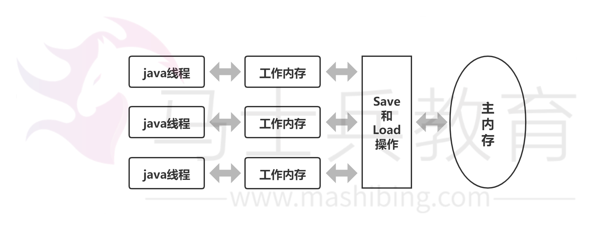

# Java 多线程安全机制

在开始讨论java多线程安全机制之前，首先从内存模型来了解一下什么是多线程的安全性。

我们都知道java的内存模型中有主内存和线程的工作内存之分，主内存上存放的是线程共享的变量（实例字段，静态字段和构成数组的元素），线程的工作内存是线程私有的空间，存放的是线程私有的变量（方法参数与局部变量）。线程在工作的时候如果要操作主内存上的共享变量，为了获得更好的执行性能并不是直接去修改主内存而是会在线程私有的工作内存中创建一份变量的拷贝（缓存），在工作内存上对变量的拷贝修改之后再把修改的值刷回到主内存的变量中去，JVM提供了8中原子操作来完成这一过程：lock, unlock, read, load, use, assign, store, write。深入理解java虚拟机-jvm最高特性与实践这本书中有一个图很好的表示了线程，主内存和工作内存之间的关系：

如果只有一个线程当然不会有什么问题，但是如果有多个线程同时在操作主内存中的变量，因为8种操作的非连续性和线程抢占cpu执行的机制就会带来冲突的问题，也就是多线程的安全问题。线程安全的定义就是：如果线程执行过程中不会产生共享资源的冲突就是线程安全的。

Java里面一般用以下几种机制保证线程安全：

### 1.互斥同步锁（悲观锁）

1）Synchorized

2）ReentrantLock

互斥同步锁也叫做阻塞同步锁，特征是会对没有获取锁的线程进行阻塞。

要理解互斥同步锁，首选要明白什么是互斥什么是同步。简单的说互斥就是非你即我，同步就是顺序访问。互斥同步锁就是以互斥的手段达到顺序访问的目的。操作系统提供了很多互斥机制比如信号量，互斥量，临界区资源等来控制在某一个时刻只能有一个或者一组线程访问同一个资源。

Java里面的互斥同步锁就是Synchorized和ReentrantLock，前者是由语言级别实现的互斥同步锁，理解和写法简单但是机制笨拙，在JDK6之后性能优化大幅提升，即使在竞争激烈的情况下也能保持一个和ReentrantLock相差不多的性能，所以JDK6之后的程序选择不应该再因为性能问题而放弃synchorized。ReentrantLock是API层面的互斥同步锁，需要程序自己打开并在finally中关闭锁，和synchorized相比更加的灵活，体现在三个方面：等待可中断，公平锁以及绑定多个条件。但是如果程序猿对ReentrantLock理解不够深刻，或者忘记释放lock，那么不仅不会提升性能反而会带来额外的问题。另外synchorized是JVM实现的，可以通过监控工具来监控锁的状态，遇到异常JVM会自动释放掉锁。而ReentrantLock必须由程序主动的释放锁。

互斥同步锁都是可重入锁，好处是可以保证不会死锁。但是因为涉及到核心态和用户态的切换，因此比较消耗性能。JVM开发团队在JDK5-JDK6升级过程中采用了很多锁优化机制来优化同步无竞争情况下锁的性能。比如：自旋锁和适应性自旋锁，轻量级锁，偏向锁，锁粗化和锁消除。

### 2.非阻塞同步锁 

1) 原子类（CAS）

非阻塞同步锁也叫乐观锁，相比悲观锁来说，它会先进行资源在工作内存中的更新，然后根据与主存中旧值的对比来确定在此期间是否有其他线程对共享资源进行了更新，如果旧值与期望值相同，就认为没有更新，可以把新值写回内存，否则就一直重试直到成功。它的实现方式依赖于处理器的机器指令：CAS（Compare And Swap）

JUC中提供了几个Automic类以及每个类上的原子操作就是乐观锁机制 

不激烈情况下，性能比synchronized略逊，而激烈的时候，也能维持常态。激烈的时候，Atomic的性能会优于ReentrantLock一倍左右。但是其有一个缺点，就是只能同步一个值，一段代码中只能出现一个Atomic的变量，多于一个同步无效。因为他不能在多个Atomic之间同步。 

非阻塞锁是不可重入的，否则会造成死锁。

### 3.无同步方案

1）可重入代码

在执行的任何时刻都可以中断-重入执行而不会产生冲突。特点就是不会依赖堆上的共享资源

2）ThreadLocal/Volaitile

线程本地的变量，每个线程获取一份共享变量的拷贝，单独进行处理。 

3)  线程本地存储

如果一个共享资源一定要被多线程共享，可以尽量让一个线程完成所有的处理操作，比如生产者消费者模式中，一般会让一个消费者完成对队列上资源的消费。典型的应用是基于请求-应答模式的web服务器的设计