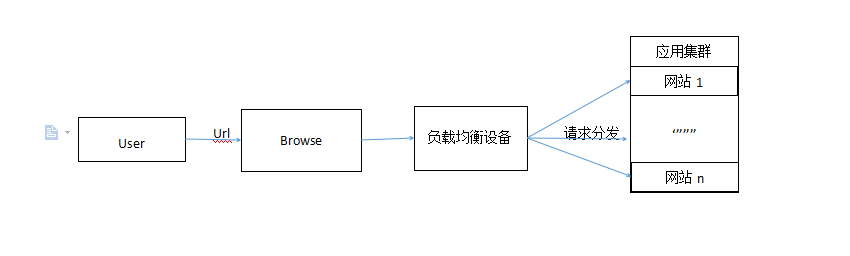

# 大型网站是怎样解决多用户高并发访问的

分布式是以缩短单个任务的执行时间来提升效率的，而集群则是通过提高单位时间内执行的任务数来提升效率。

集群主要分为：高可用集群(High Availability Cluster)，负载均衡集群(Load Balance Cluster，nginx即可实现)，科学计算集群(High Performance Computing Cluster)。

分布式是指将不同的业务分布在不同的地方；而集群指的是将几台服务器集中在一起，实现同一业务。分布式中的每一个节点，都可以做集群。 而集群并不一定就是分布式的。

为了解决大型网站的访问量大、并发量高、海量数据的问题，我们一般会考虑业务拆分和分布式部署。我们可以把那些关联不太大的业务独立出来，部署到不同的机器上，从而实现大规模的分布式系统。但这之中也有一个问题，那就是用户如何选择相应的机器的问题，这也被称为访问统一入口问题，而解决的方法是我们可以在集群机器的前面增加负载均衡设备，实现流量分发（总图如下）。

这里得先解释一下何为“负载均衡”，负载均衡就是将负载（工作任务、访问请求等）进行平衡、分摊到多个操作单元（服务器、组件等）上进行执行，是解决高性能，单点故障（高可用，如果你是单机版网络，一旦服务器挂掉了，那么用户就无法请求了，但对于集群来说，一台服务器挂掉了，负载均衡器会把用户的请求发送给其他的服务器进行处理），扩展性（这里主要是指水平伸缩）的终极解决方案。

在这里，本人主要讨论负载均衡设备为Nginx(至于为啥不讲讲F5，因为人家太贵了，不过人家比较稳定)，这是一款轻量级的Web服务器/反向代理服务器及电子邮件（IMAP/POP3）代理服务器，具有占用内存少、并发能力强等，中国大陆使用nginx网站用户有：百度、网易、新浪、腾讯等（该介绍来自百科）。

nginx大家可以上其 [官网 ](http://nginx.org/en/download.html)去下载最新版，解压后复制到部署目录，对于Nginx的配置网上的资料很多，这里就不再赘述了，只总结一下Nginx使用的注意事项：

1.nginx的负载均衡配置中默认是采用轮询的方式，这种方式中，每个请求按时间顺序逐一分配到不同的后端服务器，如果后端服务器down掉，能自动剔除，但存在各个服务器的session共享问题。

2.另外一种方式是ip_hash:每个请求按访问的ip的hash结果分配，如果访问的IP是固定的，那么在正常情况下，该用户的请求都会分配到后台的同一台服务器去处理，但是如果用户每次请求的IP都不同呢？所以这种方式也同1的方式一样都存在这么一个问题：session在各个服务器上的共享问题。

3.，如果集群中的服务器的性能不一，可以通过配置各个服务器的权值来实现资源利用率的最大化，即性能好的优先选择

也许你会问，既然IP可能变化，那么用户用页面请求时的cookie的ID应该是确定的吧！那么我们可以用cookie_id来进行hash，然后在通过负载均衡器分发到对应的服务器上，这样就可以解决session问题了，其实当初本人也有想到这个方案，但最后本人也放弃这个方案了，因为是根据cookid_id确实可以把该用户的请求唯一的分发到那台独一无二的服务器上，那如果这台服务器挂掉了，那么根据这种分发策略，岂不是在这服务器上请求资源的用户都不能访问了，你说是不是呢？

解决服务器共享session问题：使用redis来共享各个服务器的session，并同时通过redis来缓存一些常用的资源，加快用户获得请求资源的速度（个人比较喜欢redis，当然你们也可以使用memcache来实现，不过，memcache不能做到持久化，这样这台服务器一挂掉，那么所有的资源也都没有了......）。

不过，本人觉得这样进行集群部署，最好配上数据库的主从部署，因为如果在集群中只分配一个数据库服务器，那么这个系统的瓶颈将会出现在数据库的操作上，虽然redis能减轻这种负担，但对于数据量大的还是有一定影响的，而且数据库的主从部署也可以防止因某个数据库服务器的挂掉而丢失用户的信息。