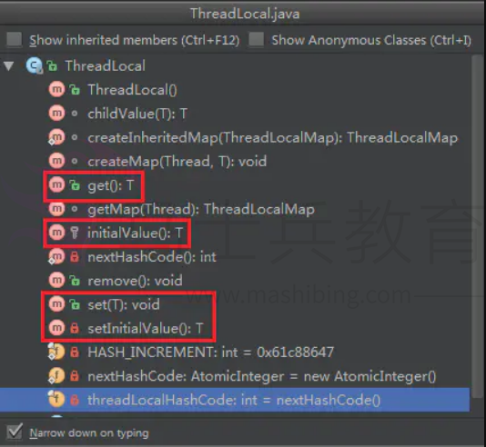
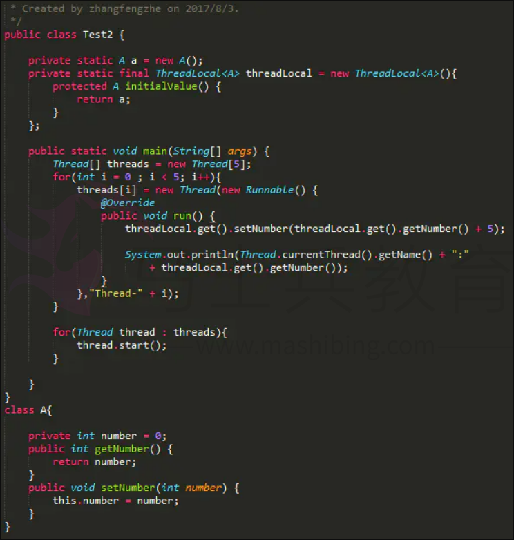
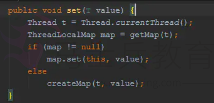
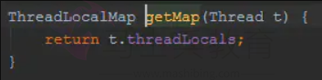
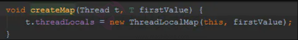
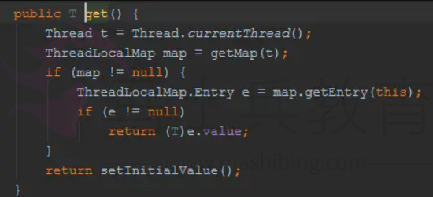
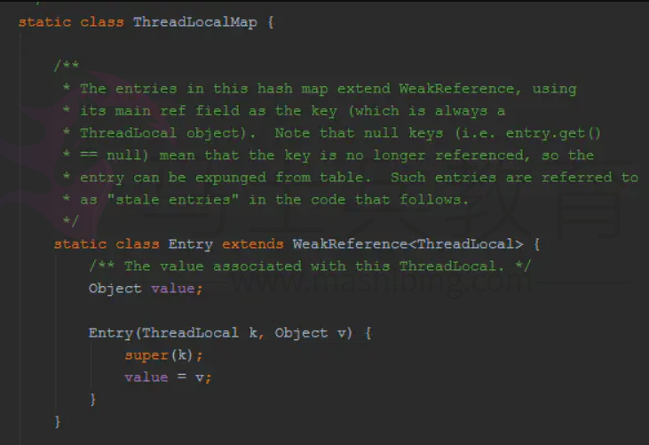
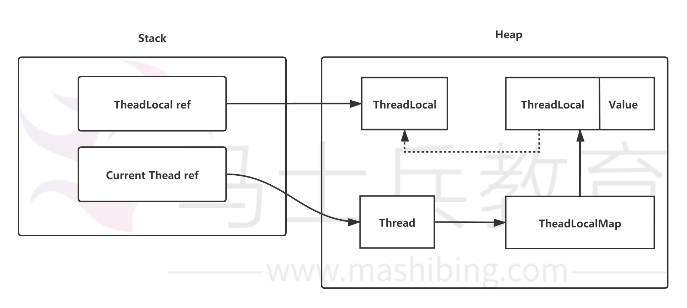

# ThreadLocal是什么、有什么、能做什么？

> **ThreadLocal提供一个线程（Thread）局部变量，访问到某个变量的每一个线程都拥有自己的局部变量。说白了，ThreadLocal就是想在多线程环境下去保证成员变量的安全。**

**ThreadLocal提供的方法**

> **对于ThreadLocal而言，常用的方法，就是get/set/initialValue方法。**

**我们先来看一个例子**

**运行结果**

> **很显然，在这里，并没有通过ThreadLocal达到线程隔离的机制，可是ThreadLocal不是保证线程安全的么？这是什么鬼？**
>
> **虽然，ThreadLocal让访问某个变量的线程都拥有自己的局部变量，但是如果这个局部变量都指向同一个对象呢？这个时候ThreadLocal就失效了。仔细观察下图中的代码，你会发现，threadLocal在初始化时返回的都是同一个对象a！**

# 看一看ThreadLocal源码

**我们直接看最常用的set操作：**

> **你会看到，set需要首先获得当前线程对象Thread；**
>
> **然后取出当前线程对象的成员变量ThreadLocalMap；**
>
> **如果ThreadLocalMap存在，那么进行KEY/VALUE设置，KEY就是ThreadLocal；**
>
> **如果ThreadLocalMap没有，那么创建一个；**
>
> **说白了，当前线程中存在一个Map变量，KEY是ThreadLocal，VALUE是你设置的值。**

**看一下get操作：**

> **这里其实揭示了ThreadLocalMap里面的数据存储结构，从上面的代码来看，ThreadLocalMap中存放的就是Entry，Entry的KEY就是ThreadLocal，VALUE就是值。**

**ThreadLocalMap.Entry：**

> **在JAVA里面，存在强引用、弱引用、软引用、虚引用。这里主要谈一下强引用和弱引用。**
>
> 强引用，就不必说了，类似于：
>
> A a = new A();
>
> B b = new B();
>
> 考虑这样的情况：
>
> **C c = new C(b);
> **
>
> **b = null;
> **
>
> 考虑下GC的情况。要知道b被置为null，那么是否意味着一段时间后GC工作可以回收b所分配的内存空间呢？答案是否定的，因为即便b被置为null，但是c仍然持有对b的引用，而且还是强引用，所以GC不会回收b原先所分配的空间！既不能回收利用，又不能使用，这就造成了**内存泄露**。
>
> 那么如何处理呢？
>
> **可以c = null;也可以使用弱引用！（WeakReference w = new WeakReference(b);）**

分析到这里，我们可以得到：

**这里我们思考一个问题：ThreadLocal使用到了弱引用，是否意味着不会存在内存泄露呢？**

> **首先来说，如果把ThreadLocal置为null，那么意味着Heap中的ThreadLocal实例不在有强引用指向，只有弱引用存在，因此GC是可以回收这部分空间的，也就是key是可以回收的。但是value却存在一条从Current Thread过来的强引用链。因此只有当Current Thread销毁时，value才能得到释放。**
>
> **因此，只要这个线程对象被gc回收，就不会出现内存泄露，但在threadLocal设为null和线程结束这段时间内不会被回收的，就发生了我们认为的内存泄露。最要命的是线程对象不被回收的情况，比如使用线程池的时候，线程结束是不会销毁的，再次使用的，就可能出现内存泄露。**
>
> **那么如何有效的避免呢？**
>
> **事实上，在ThreadLocalMap中的set/getEntry方法中，会对key为null（也即是ThreadLocal为null）进行判断，如果为null的话，那么是会对value置为null的。我们也可以通过调用ThreadLocal的remove方法进行释放！**

