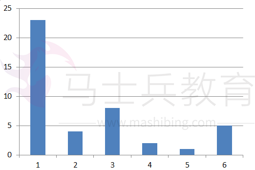
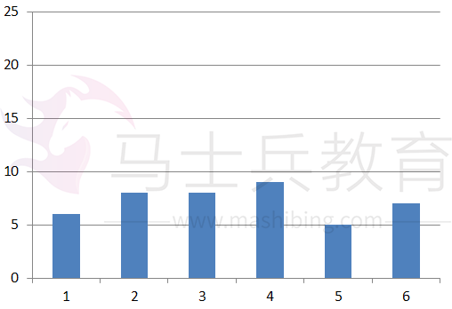

# 探索StringTable提升YGC性能


很久很久以前看过笨神的一篇文章JVM源码分析之String.intern()导致的YGC不断变长，其原因是YGC过程需要对StringTable做扫描，而String.intern()就是在StringTable中保存这个对象的引用，如果String.intern()添加越来越多不同的对象，那么StringTable就越大，扫描StringTable的时间就越长，从而导致YGC耗时越长；那么如何确定YGC耗时越来越长是StringTable变大引起的呢？

介绍一个参数`-XX:+PrintStringTableStatistics`，看名字就知道这个参数的作用了：打印出StringTable的统计信息；再详细一点描述：`在JVM进程退出时，打印出StringTable的统计信息到标准日志输出目录中`。

> JDK版本要求：JDK 7u6 +

## 验证问题

验证代码如下：


```java
import java.util.UUID;

/**
 * @author afei
 * @version 1.0.0
 * @since 2017年08月16日
 */
public class StringInternTest {
    public static void main(String[] args) throws Exception {
        for (int i=0; i<Integer.MAX_VALUE; i++){
            UUID.randomUUID().toString().intern();
            if (i>=100000 && i%100000==0){
                System.out.println("i="+i);
            }
        }
    }
}
```

执行命令如下：


```objectivec
java -verbose:gc -XX:+PrintGC -XX:+UseConcMarkSweepGC -XX:+UseParNewGC  -XX:CMSInitiatingOccupancyFraction=75 -XX:+UseCMSInitiatingOccupancyOnly -XX:+PrintStringTableStatistics -Xmx1g -Xms1g -Xmn64m StringInternTest
```

从gc日志可以看出YGC时间越来越长：


```csharp
[GC (Allocation Failure)  52480K->5691K(1042048K), 0.0109821 secs]
i=100000
[GC (Allocation Failure)  65261K->19731K(1042048K), 0.0233471 secs]
i=200000
[GC (Allocation Failure)  72211K->26796K(1042048K), 0.0266068 secs]
i=300000
[GC (Allocation Failure)  79276K->33860K(1042048K), 0.0262006 secs]
[GC (Allocation Failure)  86340K->40924K(1042048K), 0.0295842 secs]
... ...
[GC (Allocation Failure)  192868K->147456K(1042048K), 0.0661785 secs]
i=1400000
[GC (Allocation Failure)  199936K->154521K(1042048K), 0.0685919 secs]
[GC (Allocation Failure)  207001K->161585K(1042048K), 0.0707886 secs]
i=1500000
[GC (Allocation Failure)  214065K->168649K(1042048K), 0.0744149 secs]
[GC (Allocation Failure)  221129K->175714K(1042048K), 0.0766862 secs]
i=1600000
[GC (Allocation Failure)  228194K->182778K(1042048K), 0.0802783 secs]
```

### String.intern() 250w个String对象：

> 执行命令：
>  java -verbose:gc -XX:+PrintGC -XX:+UseConcMarkSweepGC -XX:+UseParNewGC  -XX:CMSInitiatingOccupancyFraction=75 -XX:+UseCMSInitiatingOccupancyOnly -XX:+PrintStringTableStatistics -Xmx1g -Xms1g -Xmn64m  StringInternTest

当i=2500000，即往StringTable添加了250w个引用时，kill调这个进程，能够看到`PrintStringTableStatistics`这个参数作用下输出的StringTable相关信息（输出信息中还有SymbolTable ，这篇文章不做讨论）：


```jsx
StringTable statistics:
Number of buckets       :     60013 =    480104 bytes, avg   8.000
Number of entries       :   2568786 =  61650864 bytes, avg  24.000
Number of literals      :   2568786 = 287662080 bytes, avg 111.984
Total footprint         :           = 349793048 bytes
Average bucket size     :    42.804
Variance of bucket size :    43.104
Std. dev. of bucket size:     6.565
Maximum bucket size     :        82
```

且这时候的YGC时间达到了0.12s：
 i=2500000
 [GC (Allocation Failure)  320041K->274625K(1042048K), 0.1268211 secs]
 [GC (Allocation Failure)  327105K->281693K(1042048K), 0.1236515 secs]

### String.intern() 500w个String对象：

> 执行命令：
>  java -verbose:gc -XX:+PrintGC -XX:+UseConcMarkSweepGC -XX:+UseParNewGC  -XX:CMSInitiatingOccupancyFraction=75 -XX:+UseCMSInitiatingOccupancyOnly -XX:+PrintStringTableStatistics -Xmx1g -Xms1g -Xmn64m  StringInternTest

当i=5000000，即往StringTable添加了500w个引用时，kill调这个进程，输出结果如下：


```jsx
StringTable statistics:
Number of buckets       :     60013 =    480104 bytes, avg   8.000
Number of entries       :   5082093 = 121970232 bytes, avg  24.000
Number of literals      :   5082093 = 569152512 bytes, avg 111.992
Total footprint         :           = 691602848 bytes
Average bucket size     :    84.683
Variance of bucket size :    85.084
Std. dev. of bucket size:     9.224
Maximum bucket size     :       123
```

YGC时间达到了0.24s：
 i=5000000
 [GC (Allocation Failure)  595600K->550184K(1042048K), 0.2425553 secs]

### PrintStringTableStatistics结果解读：

从PrintStringTableStatistics输出信息可以看出StringTable的bucket数量默认为60013 ，且每个bucket占用8个字节（说明：如果是32位系统，那么每个bucket占用4个字节）；Number of entries即Hashtable的entry数量为2568786，因为我们String.intern( )了250w个不同的String对象；**Average bucket size**表示表示bucket中LinkedList的平均size，**Maximum bucket size** 表示bucket中LinkedList最大的size，Average bucket size越大，说明Hashtable碰撞越严重，由于bucket数量固定为60013，随着StringTable添加的引用越来越多，碰撞越来越严重，YGC时间越来越长。

### String.intern() 250w个String对象&-XX:StringTableSize=2500000：

> 执行命令：
>  java -verbose:gc -XX:+PrintGC -XX:+UseConcMarkSweepGC -XX:+UseParNewGC  -XX:CMSInitiatingOccupancyFraction=75 -XX:+UseCMSInitiatingOccupancyOnly -XX:+PrintStringTableStatistics -Xmx1g -Xms1g -Xmn64m **-XX:StringTableSize=2500000** StringInternTest

当i=2500000，kill调这个进程，输出结果如下：


```jsx
StringTable statistics:
Number of buckets       :   2500000 =  20000000 bytes, avg   8.000
Number of entries       :   2573556 =  61765344 bytes, avg  24.000
Number of literals      :   2573556 = 288196288 bytes, avg 111.984
Total footprint         :           = 369961632 bytes
Average bucket size     :     1.029
Variance of bucket size :     1.028
Std. dev. of bucket size:     1.014
Maximum bucket size     :        10
```

YGC时间从0.12s下降到了0.09s：
 i=2500000
 [GC (Allocation Failure)  320216K->274800K(1042048K), 0.0890073 secs]
 [GC (Allocation Failure)  327280K->281865K(1042048K), 0.0926348 secs]

### String.intern() 500w个String对象&-XX:StringTableSize=5000000：

> 执行命令：
>  java -verbose:gc -XX:+PrintGC -XX:+UseConcMarkSweepGC -XX:+UseParNewGC  -XX:CMSInitiatingOccupancyFraction=75 -XX:+UseCMSInitiatingOccupancyOnly -XX:+PrintStringTableStatistics -Xmx1g -Xms1g -Xmn64m **-XX:StringTableSize=5000000** StringInternTest

当i=5000000，即往StringTable添加了500w个引用时，kill调这个进程，输出结果如下：


```jsx
StringTable statistics:
Number of buckets       :   5000000 =  40000000 bytes, avg   8.000
Number of entries       :   5151776 = 123642624 bytes, avg  24.000
Number of literals      :   5151776 = 576957008 bytes, avg 111.992
Total footprint         :           = 740599632 bytes
Average bucket size     :     1.030
Variance of bucket size :     1.030
Std. dev. of bucket size:     1.015
Maximum bucket size     :         9
```

YGC时间从0.24s降到了0.17s：
 i=5000000
 [GC (Allocation Failure)  595645K->550229K(1042048K), 0.1685862 secs]
 [GC (Allocation Failure)  602709K->557293K(1042048K), 0.1706642 secs]

### PrintStringTableStatistics&StringTableSize结果解读：

设置StringTableSize一个合适的值，即bucket数量为期望的数量后，碰撞的概率明显降低，由**Average bucket size**和**Maximum bucket size**的值明显小于未配置StringTableSize参数时的值可知，且YGC时间也明显降低。另外, 最好通过BTrace分析是哪里频繁调用String.intern(), 确实String.intern()没有滥用的前提下, 再增大StringTableSize的值。

### 引申问题

既然StringTable是Hashtable数据结构，那为什么不能自己通过rehash扩大bucket数量来提高性能呢？JVM中StringTable的rehash有点不一样, JVM中StringTable的rehash不会扩大bucket数量，而是在bucket不变的前提下，通过一个新的seed尝试摊平每个bucket中LinkedList的长度（想想也是，**如果StringTable能通过rehash扩大bucket数量，那还要StringTableSize干嘛**），rehash大概是一个如下图所示的过程，rehash前后bucket数量不变，这是重点：
 假设reash前数据分布（23,4,8,2,1,5）：



StringTable rehash前.png


 reash后可能数据分布（6,8,8,9,5,7）：



StringTable rehash后.png


对应的源码在hashtable.cpp中--第一行代码就是初始化一个新的`_seed`用于后面的hash值计算：


```cpp
// Create a new table and using alternate hash code, populate the new table
// with the existing elements.   This can be used to change the hash code
// and could in the future change the size of the table.

template <class T, MEMFLAGS F> void Hashtable<T, F>::move_to(Hashtable<T, F>* new_table) {

  // Initialize the global seed for hashing.
  _seed = AltHashing::compute_seed();
  assert(seed() != 0, "shouldn't be zero");

  int saved_entry_count = this->number_of_entries();

  // Iterate through the table and create a new entry for the new table
  for (int i = 0; i < new_table->table_size(); ++i) {
    for (HashtableEntry<T, F>* p = bucket(i); p != NULL; ) {
      HashtableEntry<T, F>* next = p->next();
      T string = p->literal();
      // Use alternate hashing algorithm on the symbol in the first table
      unsigned int hashValue = string->new_hash(seed());
      // Get a new index relative to the new table (can also change size)
      int index = new_table->hash_to_index(hashValue);
      p->set_hash(hashValue);
      // Keep the shared bit in the Hashtable entry to indicate that this entry
      // can't be deleted.   The shared bit is the LSB in the _next field so
      // walking the hashtable past these entries requires
      // BasicHashtableEntry::make_ptr() call.
      bool keep_shared = p->is_shared();
      this->unlink_entry(p);
      new_table->add_entry(index, p);
      if (keep_shared) {
        p->set_shared();
      }
      p = next;
    }
  }
  // give the new table the free list as well
  new_table->copy_freelist(this);
  assert(new_table->number_of_entries() == saved_entry_count, "lost entry on dictionary copy?");

  // Destroy memory used by the buckets in the hashtable.  The memory
  // for the elements has been used in a new table and is not
  // destroyed.  The memory reuse will benefit resizing the SystemDictionary
  // to avoid a memory allocation spike at safepoint.
  BasicHashtable<F>::free_buckets();
}
```

## 结论

YGC耗时的问题确实比较难排查，遍历StringTable只是其中一部分，通过PrintStringTableStatistics参数可以了解我们应用的StringTable相关统计信息，且可以通过设置合理的StringTableSize值降低碰撞从而减少YGC时间。另一方面，增大StringTableSize的值有什么影响呢？需要多消耗一点内存，因为每一个bucket需要8个byte（64位系统）。与它带来的YGC性能提升相比，这点内存消耗还是非常值得的。然而StringTable的统计信息需要在JVM退出时才输出，不得不说是一个遗憾

