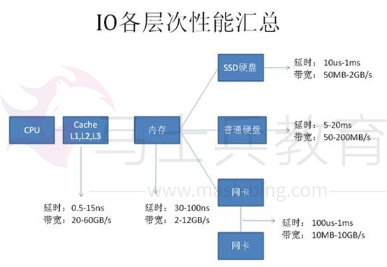
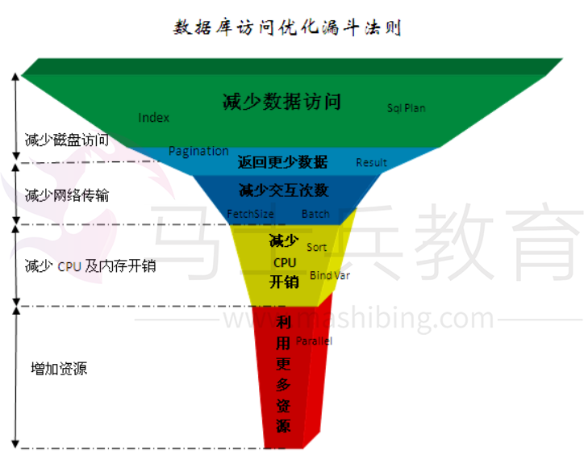
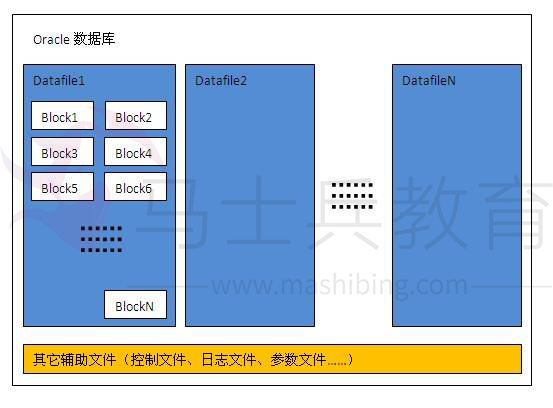
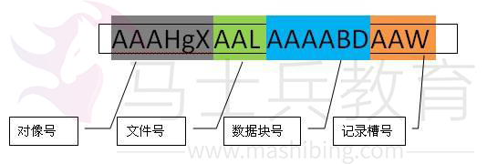
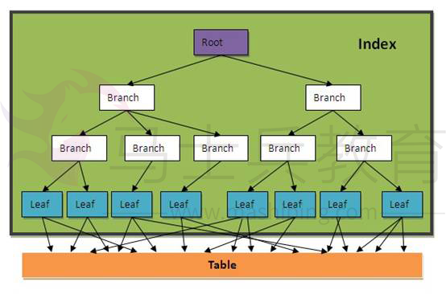
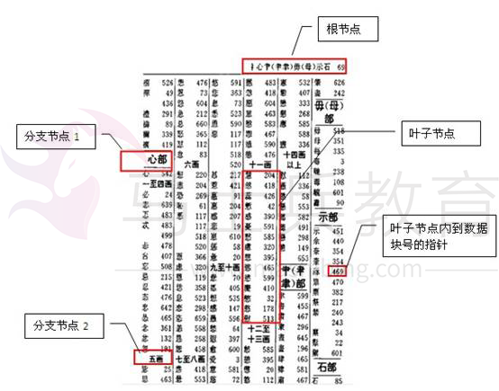
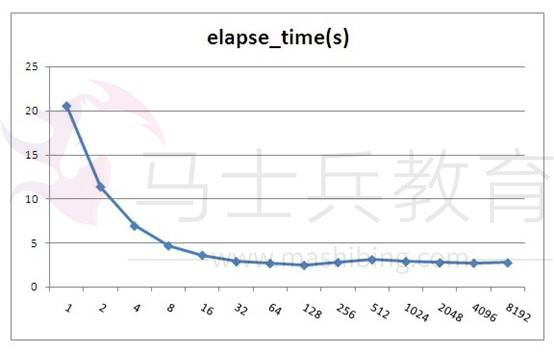
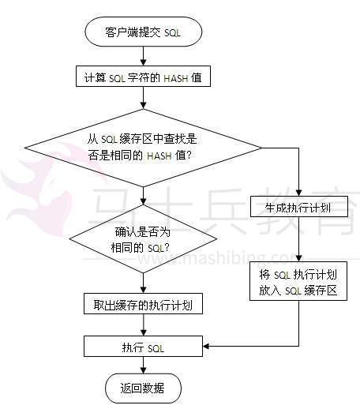
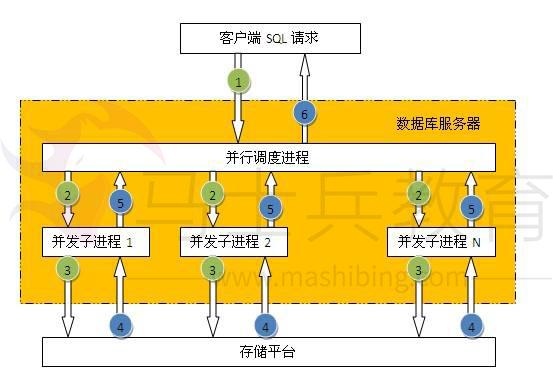

# 数据库SQL优化大总结之 百万级数据库优化方案


网上关于SQL优化的教程很多，但是比较杂乱。近日有空整理了一下，写出来跟大家分享一下，其中有错误和不足的地方，还请大家纠正补充。

这篇文章我花费了大量的时间查找资料、修改、排版，希望大家阅读之后，感觉好的话推荐给更多的人，让更多的人看到、纠正以及补充。

 

**一、百万级数据库优化方案**


1.对查询进行优化，要尽量避免全表扫描，首先应考虑在 where 及 order by 涉及的列上建立索引。

2.应尽量避免在 where 子句中对字段进行 null 值判断，否则将导致引擎放弃使用索引而进行全表扫描，如：

```
select id from t where num is null
```

最好不要给数据库留NULL，尽可能的使用 NOT NULL填充数据库.

备注、描述、评论之类的可以设置为 NULL，其他的，最好不要使用NULL。

不要以为 NULL 不需要空间，比如：char(100) 型，在字段建立时，空间就固定了， 不管是否插入值（NULL也包含在内），都是占用 100个字符的空间的，如果是varchar这样的变长字段， null 不占用空间。


可以在num上设置默认值0，确保表中num列没有null值，然后这样查询：

```
select id from t where num = 0
```


3.应尽量避免在 where 子句中使用 != 或 <> 操作符，否则将引擎放弃使用索引而进行全表扫描。

4.应尽量避免在 where 子句中使用 or 来连接条件，如果一个字段有索引，一个字段没有索引，将导致引擎放弃使用索引而进行全表扫描，如：

```
select id from t where num=10 or Name = 'admin'
```

可以这样查询：

```
select id from t where num = 10
union all
select id from t where Name = 'admin'
```


5.in 和 not in 也要慎用，否则会导致全表扫描，如：

```
select id from t where num in(1,2,3)
```

对于连续的数值，能用 between 就不要用 in 了：

```
select id from t where num between 1 and 3
```

很多时候用 exists 代替 in 是一个好的选择：

```
select num from a where num in(select num from b)
```

用下面的语句替换：

```
select num from a where exists(select 1 from b where num=a.num)
```

 

6.下面的查询也将导致全表扫描：

```
select id from t where name like ‘%abc%’
```

若要提高效率，可以考虑全文检索。

7.如果在 where 子句中使用参数，也会导致全表扫描。因为SQL只有在运行时才会解析局部变量，但优化程序不能将访问计划的选择推迟到运行时；它必须在编译时进行选择。然 而，如果在编译时建立访问计划，变量的值还是未知的，因而无法作为索引选择的输入项。如下面语句将进行全表扫描：

```
select id from t where num = @num
```

可以改为强制查询使用索引：

```
select id from t with(index(索引名)) where num = @num
```

.应尽量避免在 where 子句中对字段进行表达式操作，这将导致引擎放弃使用索引而进行全表扫描。如：

```
select id from t where num/2 = 100
```

应改为:

```
select id from t where num = 100*2
```


9.应尽量避免在where子句中对字段进行函数操作，这将导致引擎放弃使用索引而进行全表扫描。如：

```
select id from t where substring(name,1,3) = ’abc’       -–name以abc开头的id
select id from t where datediff(day,createdate,’2005-11-30′) = 0    -–‘2005-11-30’    --生成的id
```

应改为:

```
select id from t where name like 'abc%'
select id from t where createdate >= '2005-11-30' and createdate < '2005-12-1'
```


10.不要在 where 子句中的“=”左边进行函数、算术运算或其他表达式运算，否则系统将可能无法正确使用索引。

11.在使用索引字段作为条件时，如果该索引是复合索引，那么必须使用到该索引中的第一个字段作为条件时才能保证系统使用该索引，否则该索引将不会被使用，并且应尽可能的让字段顺序与索引顺序相一致。

12.不要写一些没有意义的查询，如需要生成一个空表结构：

```
select col1,col2 into #t from t where 1=0
```

这类代码不会返回任何结果集，但是会消耗系统资源的，应改成这样：
create table #t(…)

13.Update 语句，如果只更改1、2个字段，不要Update全部字段，否则频繁调用会引起明显的性能消耗，同时带来大量日志。

14.对于多张大数据量（这里几百条就算大了）的表JOIN，要先分页再JOIN，否则逻辑读会很高，性能很差。

15.select count(*) from table；这样不带任何条件的count会引起全表扫描，并且没有任何业务意义，是一定要杜绝的。


16.索引并不是越多越好，索引固然可以提高相应的 select 的效率，但同时也降低了 insert 及 update 的效率，因为 insert 或 update 时有可能会重建索引，所以怎样建索引需要慎重考虑，视具体情况而定。一个表的索引数最好不要超过6个，若太多则应考虑一些不常使用到的列上建的索引是否有 必要。

17.应尽可能的避免更新 clustered 索引数据列，因为 clustered 索引数据列的顺序就是表记录的物理存储顺序，一旦该列值改变将导致整个表记录的顺序的调整，会耗费相当大的资源。若应用系统需要频繁更新 clustered 索引数据列，那么需要考虑是否应将该索引建为 clustered 索引。

18.尽量使用数字型字段，若只含数值信息的字段尽量不要设计为字符型，这会降低查询和连接的性能，并会增加存储开销。这是因为引擎在处理查询和连 接时会逐个比较字符串中每一个字符，而对于数字型而言只需要比较一次就够了。

19.尽可能的使用 varchar/nvarchar 代替 char/nchar ，因为首先变长字段存储空间小，可以节省存储空间，其次对于查询来说，在一个相对较小的字段内搜索效率显然要高些。

20.任何地方都不要使用 select * from t ，用具体的字段列表代替“*”，不要返回用不到的任何字段。

21.尽量使用表变量来代替临时表。如果表变量包含大量数据，请注意索引非常有限（只有主键索引）。

\22. 避免频繁创建和删除临时表，以减少系统表资源的消耗。临时表并不是不可使用，适当地使用它们可以使某些例程更有效，例如，当需要重复引用大型表或常用表中的某个数据集时。但是，对于一次性事件， 最好使用导出表。

23.在新建临时表时，如果一次性插入数据量很大，那么可以使用 select into 代替 create table，避免造成大量 log ，以提高速度；如果数据量不大，为了缓和系统表的资源，应先create table，然后insert。

24.如果使用到了临时表，在存储过程的最后务必将所有的临时表显式删除，先 truncate table ，然后 drop table ，这样可以避免系统表的较长时间锁定。

25.尽量避免使用游标，因为游标的效率较差，如果游标操作的数据超过1万行，那么就应该考虑改写。

26.使用基于游标的方法或临时表方法之前，应先寻找基于集的解决方案来解决问题，基于集的方法通常更有效。

27.与临时表一样，游标并不是不可使用。对小型数据集使用 FAST_FORWARD 游标通常要优于其他逐行处理方法，尤其是在必须引用几个表才能获得所需的数据时。在结果集中包括“合计”的例程通常要比使用游标执行的速度快。如果开发时 间允许，基于游标的方法和基于集的方法都可以尝试一下，看哪一种方法的效果更好。

28.在所有的存储过程和触发器的开始处设置 SET NOCOUNT ON ，在结束时设置 SET NOCOUNT OFF 。无需在执行存储过程和触发器的每个语句后向客户端发送 DONE_IN_PROC 消息。

29.尽量避免大事务操作，提高系统并发能力。

30.尽量避免向客户端返回大数据量，若数据量过大，应该考虑相应需求是否合理。

 

**实际案例分析**：拆分大的 DELETE 或INSERT 语句，批量提交SQL语句
　　如果你需要在一个在线的网站上去执行一个大的 DELETE 或 INSERT 查询，你需要非常小心，要避免你的操作让你的整个网站停止相应。因为这两个操作是会锁表的，表一锁住了，别的操作都进不来了。
　　Apache 会有很多的子进程或线程。所以，其工作起来相当有效率，而我们的服务器也不希望有太多的子进程，线程和数据库链接，这是极大的占服务器资源的事情，尤其是内存。
　　如果你把你的表锁上一段时间，比如30秒钟，那么对于一个有很高访问量的站点来说，这30秒所积累的访问进程/线程，数据库链接，打开的文件数，可能不仅仅会让你的WEB服务崩溃，还可能会让你的整台服务器马上挂了。
　　所以，如果你有一个大的处理，你一定把其拆分，使用 LIMIT oracle(rownum),sqlserver(top)条件是一个好的方法。下面是一个mysql示例：


```
while(1){

 　　//每次只做1000条

　　 mysql_query(“delete from logs where log_date <= ’2012-11-01’ limit 1000”);

 　　if(mysql_affected_rows() == 0){

　　 　　//删除完成，退出！
　　 　　break；
　　}

//每次暂停一段时间，释放表让其他进程/线程访问。
usleep(50000)

}
```

 

**二、数据库访问性能优化**


特别说明：

1、 本文只是面对数据库应用开发的程序员，不适合专业DBA，DBA在数据库性能优化方面需要了解更多的知识；

2、 本文许多示例及概念是基于Oracle数据库描述，对于其它关系型数据库也可以参考，但许多观点不适合于KV数据库或内存数据库或者是基于SSD技术的数据库；

3、 本文未深入数据库优化中最核心的执行计划分析技术。

 

读者对像：

开发人员：如果你是做数据库开发，那本文的内容非常适合，因为本文是从程序员的角度来谈数据库性能优化。

架构师：如果你已经是数据库应用的架构师，那本文的知识你应该清楚90%，否则你可能是一个喜欢折腾的架构师。

DBA（数据库管理员）：大型数据库优化的知识非常复杂，本文只是从程序员的角度来谈性能优化，DBA除了需要了解这些知识外，还需要深入数据库的内部体系架构来解决问题。

 

   在网上有很多文章介绍数据库优化知识，但是大部份文章只是对某个一个方面进行说明，而对于我们程序员来说这种介绍并不能很好的掌握优化知识，因为很多介绍只是对一些特定的场景优化的，所以反而有时会产生误导或让程序员感觉不明白其中的奥妙而对数据库优化感觉很神秘。

   很多程序员总是问如何学习数据库优化，有没有好的教材之类的问题。在书店也看到了许多数据库优化的专业书籍，但是感觉更多是面向DBA或者是PL/SQL开发方面的知识，个人感觉不太适合普通程序员。而要想做到数据库优化的高手，不是花几周，几个月就能达到的，这并不是因为数据库优化有多高深，而是因为要做好优化一方面需要有非常好的技术功底，对操作系统、存储硬件网络、数据库原理等方面有比较扎实的基础知识，另一方面是需要花大量时间对特定的数据库进行实践测试与总结。

   作为一个程序员，我们也许不清楚线上正式的服务器硬件配置，我们不可能像DBA那样专业的对数据库进行各种实践测试与总结，但我们都应该非常了解我们SQL的业务逻辑，我们清楚SQL中访问表及字段的数据情况，我们其实只关心我们的SQL是否能尽快返回结果。那程序员如何利用已知的知识进行数据库优化？如何能快速定位SQL性能问题并找到正确的优化方向？

面对这些问题，笔者总结了一些面向程序员的基本优化法则，本文将结合实例来坦述数据库开发的优化知识。

   要正确的优化SQL，我们需要快速定位能性的瓶颈点，也就是说快速找到我们SQL主要的开销在哪里？而大多数情况性能最慢的设备会是瓶颈点，如下载时网络速度可能会是瓶颈点，本地复制文件时硬盘可能会是瓶颈点，为什么这些一般的工作我们能快速确认瓶颈点呢，因为我们对这些慢速设备的性能数据有一些基本的认识，如网络带宽是2Mbps，硬盘是每分钟7200转等等。因此，为了快速找到SQL的性能瓶颈点，我们也需要了解我们计算机系统的硬件基本性能指标，下图展示的当前主流计算机性能指标数据。




从图上可以看到基本上每种设备都有两个指标：

延时（响应时间）：表示硬件的突发处理能力；

带宽（吞吐量）：代表硬件持续处理能力。

 

从上图可以看出，计算机系统硬件性能从高到代依次为：

CPU——Cache(L1-L2-L3)——内存——SSD硬盘——网络——硬盘

由于SSD硬盘还处于快速发展阶段，所以本文的内容不涉及SSD相关应用系统。

根据数据库知识，我们可以列出每种硬件主要的工作内容：

CPU及内存：缓存数据访问、比较、排序、事务检测、SQL解析、函数或逻辑运算；

网络：结果数据传输、SQL请求、远程数据库访问（dblink）；

硬盘：数据访问、数据写入、日志记录、大数据量排序、大表连接。

 

根据当前计算机硬件的基本性能指标及其在数据库中主要操作内容，可以整理出如下图所示的性能基本优化法则：


这个优化法则归纳为5个层次：

1、 减少数据访问（减少磁盘访问）

2、 返回更少数据（减少网络传输或磁盘访问）

3、 减少交互次数（减少网络传输）

4、 减少服务器CPU开销（减少CPU及内存开销）

5、 利用更多资源（增加资源）

 

由于每一层优化法则都是解决其对应硬件的性能问题，所以带来的性能提升比例也不一样。传统数据库系统设计是也是尽可能对低速设备提供优化方法，因此针对低速设备问题的可优化手段也更多，优化成本也更低。我们任何一个SQL的性能优化都应该按这个规则由上到下来诊断问题并提出解决方案，而不应该首先想到的是增加资源解决问题。

以下是每个优化法则层级对应优化效果及成本经验参考：


 

| **优化法则\**     | **性能提升效果\** | **优化成本\** |
| ----------------- | ----------------- | ------------- |
| 减少数据访问      | 1~1000            | 低            |
| 返回更少数据      | 1~100             | 低            |
| 减少交互次数      | 1~20              | 低            |
| 减少服务器CPU开销 | 1~5               | 低            |
| 利用更多资源      | @~10              | 高            |

 

接下来，我们针对5种优化法则列举常用的优化手段并结合实例分析。


接下来，我们针对5种优化法则列举常用的优化手段并结合实例分析。

 

# 二、oracle数据库两个基本概念

数据块是数据库中数据在磁盘中存储的最小单位，也是一次IO访问的最小单位，一个数据块通常可以存储多条记录，数据块大小是DBA在创建数据库或表空间时指定，可指定为2K、4K、8K、16K或32K字节。下图是一个Oracle数据库典型的物理结构，一个数据库可以包括多个数据文件，一个数据文件内又包含多个数据块；




ROWID是每条记录在数据库中的唯一标识，通过ROWID可以直接定位记录到对应的文件号及数据块位置。ROWID内容包括文件号、对像号、数据块号、记录槽号，如下图所示：




**三、数据库访问优化法则详解**


## 减少数据访问

### 创建并使用正确的索引


数据库索引的原理非常简单，但在复杂的表中真正能正确使用索引的人很少，即使是专业的DBA也不一定能完全做到最优。

索引会大大增加表记录的DML(INSERT,UPDATE,DELETE)开销，正确的索引可以让性能提升100，1000倍以上，不合理的索引也可能会让性能下降100倍，因此在一个表中创建什么样的索引需要平衡各种业务需求。

索引常见问题：

**索引有哪些种类？\**

常见的索引有B-TREE索引、位图索引、全文索引，位图索引一般用于数据仓库应用，全文索引由于使用较少，这里不深入介绍。B-TREE索引包括很多扩展类型，如组合索引、反向索引、函数索引等等，以下是B-TREE索引的简单介绍：

B-TREE索引也称为平衡树索引(Balance Tree)，它是一种按字段排好序的树形目录结构，主要用于提升查询性能和唯一约束支持。B-TREE索引的内容包括根节点、分支节点、叶子节点。

**叶子节点内容：**索引字段内容+表记录ROWID

**根节点，分支节点内容：**当一个数据块中不能放下所有索引字段数据时，就会形成树形的根节点或分支节点，根节点与分支节点保存了索引树的顺序及各层级间的引用关系。

​     一个普通的BTREE索引结构示意图如下所示：





如果我们把一个表的内容认为是一本字典，那索引就相当于字典的目录，如下图所示：





图中是一个字典按部首+笔划数的目录，相当于给字典建了一个按部首+笔划的组合索引。

一个表中可以建多个索引，就如一本字典可以建多个目录一样（按拼音、笔划、部首等等）。

一个索引也可以由多个字段组成，称为组合索引，如上图就是一个按部首+笔划的组合目录。

**SQL什么条件会使用索引？**

当字段上建有索引时，通常以下情况会使用索引：

INDEX_COLUMN = ?

INDEX_COLUMN > ?

INDEX_COLUMN >= ?

INDEX_COLUMN < ?

INDEX_COLUMN <= ?

INDEX_COLUMN between ? and ?

INDEX_COLUMN in (?,?,...,?)

INDEX_COLUMN like ?||'%'（后导模糊查询）

T1. INDEX_COLUMN=T2. COLUMN1（两个表通过索引字段关联）

 

**SQL什么条件不会使用索引？**

 

 

| **查询条件\**                                                | **不能使用索引原因\**                                        |
| ------------------------------------------------------------ | ------------------------------------------------------------ |
| INDEX_COLUMN <> ?INDEX_COLUMN not in (?,?,...,?)             | 不等于操作不能使用索引                                       |
| function(INDEX_COLUMN) = ?INDEX_COLUMN + 1 = ?INDEX_COLUMN \|\| 'a' = ? | 经过普通运算或函数运算后的索引字段不能使用索引               |
| INDEX_COLUMN like '%'\|\|?INDEX_COLUMN like '%'\|\|?\|\|'%'  | 含前导模糊查询的Like语法不能使用索引                         |
| INDEX_COLUMN is null                                         | B-TREE索引里不保存字段为NULL值记录，因此IS NULL不能使用索引  |
| NUMBER_INDEX_COLUMN='12345'CHAR_INDEX_COLUMN=12345           | Oracle在做数值比较时需要将两边的数据转换成同一种数据类型，如果两边数据类型不同时会对字段值隐式转换，相当于加了一层函数处理，所以不能使用索引。 |
| a.INDEX_COLUMN=a.COLUMN_1                                    | 给索引查询的值应是已知数据，不能是未知字段值。               |
| 注：经过函数运算字段的字段要使用可以使用函数索引，这种需求建议与DBA沟通。有时候我们会使用多个字段的组合索引，如果查询条件中第一个字段不能使用索引，那整个查询也不能使用索引如：我们company表建了一个id+name的组合索引，以下SQL是不能使用索引的Select * from company where name=?Oracle9i后引入了一种index skip scan的索引方式来解决类似的问题，但是通过index skip scan提高性能的条件比较特殊，使用不好反而性能会更差。 |                                                              |

 

**我们一般在什么字段上建索引？\**

这是一个非常复杂的话题，需要对业务及数据充分分析后再能得出结果。主键及外键通常都要有索引，其它需要建索引的字段应满足以下条件：

1、字段出现在查询条件中，并且查询条件可以使用索引；

2、语句执行频率高，一天会有几千次以上；

3、通过字段条件可筛选的记录集很小，**那数据筛选比例是多少才适合？**

这个没有固定值，需要根据表数据量来评估，以下是经验公式，可用于快速评估：

**小表(记录数小于10000行的表)：筛选比例<10%；**

**大表：(筛选返回记录数)<(表总记录数\*单条记录长度)/10000/16**

   **单条记录长度≈字段平均内容长度之和+字段数\*2**

 

以下是一些字段是否需要建B-TREE索引的经验分类：

 

 

|                                                 | **字段类型\**                                            | **常见字段名\**                |
| ----------------------------------------------- | -------------------------------------------------------- | ------------------------------ |
| 需要建索引的字段                                | 主键                                                     | ID,PK                          |
| 外键                                            | PRODUCT_ID,COMPANY_ID,MEMBER_ID,ORDER_ID,TRADE_ID,PAY_ID |                                |
| 有对像或身份标识意义字段                        | HASH_CODE,USERNAME,IDCARD_NO,EMAIL,TEL_NO,IM_NO          |                                |
| 索引慎用字段,需要进行数据分布及使用场景详细评估 | 日期                                                     | GMT_CREATE,GMT_MODIFIED        |
| 年月                                            | YEAR,MONTH                                               |                                |
| 状态标志                                        | PRODUCT_STATUS,ORDER_STATUS,IS_DELETE,VIP_FLAG           |                                |
| 类型                                            | ORDER_TYPE,IMAGE_TYPE,GENDER,CURRENCY_TYPE               |                                |
| 区域                                            | COUNTRY,PROVINCE,CITY                                    |                                |
| 操作人员                                        | CREATOR,AUDITOR                                          |                                |
| 数值                                            | LEVEL,AMOUNT,SCORE                                       |                                |
| 长字符                                          | ADDRESS,COMPANY_NAME,SUMMARY,SUBJECT                     |                                |
| 不适合建索引的字段                              | 描述备注                                                 | DESCRIPTION,REMARK,MEMO,DETAIL |
| 大字段                                          | FILE_CONTENT,EMAIL_CONTENT                               |                                |

 

 

**如何知道SQL是否使用了正确的索引？**

简单SQL可以根据索引使用语法规则判断，复杂的SQL不好办，判断SQL的响应时间是一种策略，但是这会受到数据量、主机负载及缓存等因素的影响，有时数据全在缓存里，可能全表访问的时间比索引访问时间还少。要准确知道索引是否正确使用，需要到数据库中查看SQL真实的执行计划，这个话题比较复杂，详见SQL执行计划专题介绍。

 

**索引对DML(INSERT,UPDATE,DELETE)附加的开销有多少？**

这个没有固定的比例，与每个表记录的大小及索引字段大小密切相关，以下是一个普通表测试数据，仅供参考：

索引对于Insert性能降低56%

索引对于Update性能降低47%

索引对于Delete性能降低29%

因此对于写IO压力比较大的系统，表的索引需要仔细评估必要性，另外索引也会占用一定的存储空间。

 

### 1.2、只通过索引访问数据

有些时候，我们只是访问表中的几个字段，并且字段内容较少，我们可以为这几个字段单独建立一个组合索引，这样就可以直接只通过访问索引就能得到数据，一般索引占用的磁盘空间比表小很多，所以这种方式可以大大减少磁盘IO开销。

如：select id,name from company where type='2';

如果这个SQL经常使用，我们可以在type,id,name上创建组合索引

create index my_comb_index on company(type,id,name);

有了这个组合索引后，SQL就可以直接通过my_comb_index索引返回数据，不需要访问company表。

还是拿字典举例：有一个需求，需要查询一本汉语字典中所有汉字的个数，如果我们的字典没有目录索引，那我们只能从字典内容里一个一个字计数，最后返回结果。如果我们有一个拼音目录，那就可以只访问拼音目录的汉字进行计数。如果一本字典有1000页，拼音目录有20页，那我们的数据访问成本相当于全表访问的50分之一。

**切记，性能优化是无止境的，当性能可以满足需求时即可，不要过度优化。**在实际数据库中我们不可能把每个SQL请求的字段都建在索引里，所以这种只通过索引访问数据的方法一般只用于核心应用，也就是那种对核心表访问量最高且查询字段数据量很少的查询。

### 1.3、优化SQL执行计划

SQL执行计划是关系型数据库最核心的技术之一，它表示SQL执行时的数据访问算法。由于业务需求越来越复杂，表数据量也越来越大，程序员越来越懒惰，SQL也需要支持非常复杂的业务逻辑，但SQL的性能还需要提高，因此，优秀的关系型数据库除了需要支持复杂的SQL语法及更多函数外，还需要有一套优秀的算法库来提高SQL性能。

目前ORACLE有SQL执行计划的算法约300种，而且一直在增加，所以SQL执行计划是一个非常复杂的课题，一个普通DBA能掌握50种就很不错了，就算是资深DBA也不可能把每个执行计划的算法描述清楚。虽然有这么多种算法，但并不表示我们无法优化执行计划，因为我们常用的SQL执行计划算法也就十几个，如果一个程序员能把这十几个算法搞清楚，那就掌握了80%的SQL执行计划调优知识。

由于篇幅的原因，SQL执行计划需要专题介绍，在这里就不多说了。

 

## 2、返回更少的数据

### 2.1、数据分页处理

一般数据分页方式有：

#### 2.1.1、客户端(应用程序或浏览器)分页

将数据从应用服务器全部下载到本地应用程序或浏览器，在应用程序或浏览器内部通过本地代码进行分页处理

优点：编码简单，减少客户端与应用服务器网络交互次数

缺点：首次交互时间长，占用客户端内存

适应场景：客户端与应用服务器网络延时较大，但要求后续操作流畅，如手机GPRS，超远程访问（跨国）等等。

#### 2.1.2、应用服务器分页

将数据从数据库服务器全部下载到应用服务器，在应用服务器内部再进行数据筛选。以下是一个应用服务器端Java程序分页的示例：

List list=executeQuery(“select * from employee order by id”);

Int count= list.size();

List subList= list.subList(10, 20);

 

优点：编码简单，只需要一次SQL交互，总数据与分页数据差不多时性能较好。

缺点：总数据量较多时性能较差。

适应场景：数据库系统不支持分页处理，数据量较小并且可控。

 

#### 2.1.3、数据库SQL分页

采用数据库SQL分页需要两次SQL完成

一个SQL计算总数量

一个SQL返回分页后的数据

优点：性能好

缺点：编码复杂，各种数据库语法不同，需要两次SQL交互。

 

oracle数据库一般采用rownum来进行分页，常用分页语法有如下两种：

 

**直接通过rownum分页：**

select * from (

​     select a.*,rownum rn from

​          (select * from product a where company_id=? order by status) a

​     where rownum<=20)

where rn>10;

数据访问开销=索引IO+索引全部记录结果对应的表数据IO

 

**采用rowid分页语法**

优化原理是通过纯索引找出分页记录的ROWID，再通过ROWID回表返回数据，要求内层查询和排序字段全在索引里。

create index myindex on product(company_id,status);

 

select b.* from (

​     select * from (

​          select a.*,rownum rn from

​              (select rowid rid,status from product a where company_id=? order by status) a

​          where rownum<=20)

​     where rn>10) a, product b

where a.rid=b.rowid;

数据访问开销=索引IO+索引分页结果对应的表数据IO

 

实例：

一个公司产品有1000条记录，要分页取其中20个产品，假设访问公司索引需要50个IO，2条记录需要1个表数据IO。

那么按第一种ROWNUM分页写法，需要550(50+1000/2)个IO，按第二种ROWID分页写法，只需要60个IO(50+20/2);

 

### 2.2、只返回需要的字段

通过去除不必要的返回字段可以提高性能，例：

调整前：select * from product where company_id=?;

调整后：select id,name from product where company_id=?;

 

优点：

1、减少数据在网络上传输开销

2、减少服务器数据处理开销

3、减少客户端内存占用

4、字段变更时提前发现问题，减少程序BUG

5、如果访问的所有字段刚好在一个索引里面，则可以使用纯索引访问提高性能。

缺点：增加编码工作量

由于会增加一些编码工作量，所以一般需求通过开发规范来要求程序员这么做，否则等项目上线后再整改工作量更大。

如果你的查询表中有大字段或内容较多的字段，如备注信息、文件内容等等，那在查询表时一定要注意这方面的问题，否则可能会带来严重的性能问题。如果表经常要查询并且请求大内容字段的概率很低，我们可以采用分表处理，将一个大表分拆成两个一对一的关系表，将不常用的大内容字段放在一张单独的表中。如一张存储上传文件的表：

T_FILE（ID,FILE_NAME,FILE_SIZE,FILE_TYPE,FILE_CONTENT）

我们可以分拆成两张一对一的关系表：

T_FILE（ID,FILE_NAME,FILE_SIZE,FILE_TYPE）

T_FILECONTENT（ID, FILE_CONTENT）

​     通过这种分拆，可以大大提少T_FILE表的单条记录及总大小，这样在查询T_FILE时性能会更好，当需要查询FILE_CONTENT字段内容时再访问T_FILECONTENT表。

 

## 3、减少交互次数

### 3.1、batch DML

数据库访问框架一般都提供了批量提交的接口，jdbc支持batch的提交处理方法，当你一次性要往一个表中插入1000万条数据时，如果采用普通的executeUpdate处理，那么和服务器交互次数为1000万次，按每秒钟可以向数据库服务器提交10000次估算，要完成所有工作需要1000秒。如果采用批量提交模式，1000条提交一次，那么和服务器交互次数为1万次，交互次数大大减少。采用batch操作一般不会减少很多数据库服务器的物理IO，但是会大大减少客户端与服务端的交互次数，从而减少了多次发起的网络延时开销，同时也会降低数据库的CPU开销。

 

假设要向一个普通表插入1000万数据，每条记录大小为1K字节，表上没有任何索引，客户端与数据库服务器网络是100Mbps，以下是根据现在一般计算机能力估算的各种batch大小性能对比值：

 

 

| 单位：ms             | No batch | Batch=10 | Batch=100 | Batch=1000 | Batch=10000 |
| -------------------- | -------- | -------- | --------- | ---------- | ----------- |
| 服务器事务处理时间   | 0.1      | 0.1      | 0.1       | 0.1        | 0.1         |
| 服务器IO处理时间     | 0.02     | 0.2      | 2         | 20         | 200         |
| 网络交互发起时间     | 0.1      | 0.1      | 0.1       | 0.1        | 0.1         |
| 网络数据传输时间     | 0.01     | 0.1      | 1         | 10         | 100         |
| 小计                 | 0.23     | 0.5      | 3.2       | 30.2       | 300.2       |
| 平均每条记录处理时间 | 0.23     | 0.05     | 0.032     | 0.0302     | 0.03002     |

 

 

从上可以看出，Insert操作加大Batch可以对性能提高近8倍性能，一般根据主键的Update或Delete操作也可能提高2-3倍性能，但不如Insert明显，因为Update及Delete操作可能有比较大的开销在物理IO访问。以上仅是理论计算值，实际情况需要根据具体环境测量。

 

### 3.2、In List

很多时候我们需要按一些ID查询数据库记录，我们可以采用一个ID一个请求发给数据库，如下所示：

for :var in ids[] do begin

 select * from mytable where id=:var;

end;

 

我们也可以做一个小的优化， 如下所示，用ID INLIST的这种方式写SQL：

select * from mytable where id in(:id1,id2,...,idn);

 

通过这样处理可以大大减少SQL请求的数量，从而提高性能。那如果有10000个ID，那是不是全部放在一条SQL里处理呢？答案肯定是否定的。首先大部份数据库都会有SQL长度和IN里个数的限制，如**ORACLE的IN里就不允许超过1000个值**。

另外当前数据库一般都是采用基于成本的优化规则，当IN数量达到一定值时有可能改变SQL执行计划，从索引访问变成全表访问，这将使性能急剧变化。随着SQL中IN的里面的值个数增加，SQL的执行计划会更复杂，占用的内存将会变大，这将会增加服务器CPU及内存成本。

评估在IN里面一次放多少个值还需要考虑应用服务器本地内存的开销，有并发访问时要计算本地数据使用周期内的并发上限，否则可能会导致内存溢出。

综合考虑，一般IN里面的值个数超过20个以后性能基本没什么太大变化，也特别说明不要超过100，超过后可能会引起执行计划的不稳定性及增加数据库CPU及内存成本，这个需要专业DBA评估。

 

### 3.3、设置Fetch Size

当我们采用select从数据库查询数据时，数据默认并不是一条一条返回给客户端的，也不是一次全部返回客户端的，而是根据客户端fetch_size参数处理，每次只返回fetch_size条记录，当客户端游标遍历到尾部时再从服务端取数据，直到最后全部传送完成。所以如果我们要从服务端一次取大量数据时，可以加大fetch_size，这样可以减少结果数据传输的交互次数及服务器数据准备时间，提高性能。

 

以下是jdbc测试的代码，采用本地数据库，表缓存在数据库CACHE中，因此没有网络连接及磁盘IO开销，客户端只遍历游标，不做任何处理，这样更能体现fetch参数的影响：

String vsql ="select * from t_employee";

PreparedStatement pstmt = conn.prepareStatement(vsql,ResultSet.TYPE_FORWARD_ONLY,ResultSet.CONCUR_READ_ONLY);

pstmt.setFetchSize(1000);

ResultSet rs = pstmt.executeQuery(vsql);

int cnt = rs.getMetaData().getColumnCount();

Object o;

while (rs.next()) {

  for (int i = 1; i <= cnt; i++) {

​    o = rs.getObject(i);

  }

}

 

测试示例中的employee表有100000条记录，每条记录平均长度135字节

 

以下是测试结果，对每种fetchsize测试5次再取平均值：

 

| fetchsize | elapse_time（s） |
| --------- | ---------------- |
| 1         | 20.516           |
| 2         | 11.34            |
| 4         | 6.894            |
| 8         | 4.65             |
| 16        | 3.584            |
| 32        | 2.865            |
| 64        | 2.656            |
| **128**   | **2.44**         |
| 256       | 2.765            |
| 512       | 3.075            |
| 1024      | 2.862            |
| 2048      | 2.722            |
| 4096      | 2.681            |
| 8192      | 2.715            |

 




Oracle jdbc fetchsize默认值为10，由上测试可以看出fetchsize对性能影响还是比较大的，但是当fetchsize大于100时就基本上没有影响了。fetchsize并不会存在一个最优的固定值，因为整体性能与记录集大小及硬件平台有关。根据测试结果建议当一次性要取大量数据时这个值设置为100左右，不要小于40。注意，fetchsize不能设置太大，如果一次取出的数据大于JVM的内存会导致内存溢出，所以建议不要超过1000，太大了也没什么性能提高，反而可能会增加内存溢出的危险。

注：图中fetchsize在128以后会有一些小的波动，这并不是测试误差，而是由于resultset填充到具体对像时间不同的原因，由于resultset已经到本地内存里了，所以估计是由于CPU的L1,L2 Cache命中率变化造成，由于变化不大，所以笔者也未深入分析原因。

 

iBatis的SqlMapping配置文件可以对每个SQL语句指定fetchsize大小，如下所示：

 

<select id="getAllProduct" resultMap="HashMap" **fetchSize="1000"**>

select * from employee

</select>

 

### 3.4、使用存储过程

大型数据库一般都支持存储过程，合理的利用存储过程也可以提高系统性能。如你有一个业务需要将A表的数据做一些加工然后更新到B表中，但是又不可能一条SQL完成，这时你需要如下3步操作：

a：将A表数据全部取出到客户端；

b：计算出要更新的数据；

c：将计算结果更新到B表。

 

如果采用存储过程你可以将整个业务逻辑封装在存储过程里，然后在客户端直接调用存储过程处理，这样可以减少网络交互的成本。

当然，存储过程也并不是十全十美，存储过程有以下缺点：

a、不可移植性，每种数据库的内部编程语法都不太相同，当你的系统需要兼容多种数据库时最好不要用存储过程。

b、学习成本高，DBA一般都擅长写存储过程，但并不是每个程序员都能写好存储过程，除非你的团队有较多的开发人员熟悉写存储过程，否则后期系统维护会产生问题。

c、业务逻辑多处存在，采用存储过程后也就意味着你的系统有一些业务逻辑不是在应用程序里处理，这种架构会增加一些系统维护和调试成本。

d、存储过程和常用应用程序语言不一样，它支持的函数及语法有可能不能满足需求，有些逻辑就只能通过应用程序处理。

e、如果存储过程中有复杂运算的话，会增加一些数据库服务端的处理成本，对于集中式数据库可能会导致系统可扩展性问题。

f、为了提高性能，数据库会把存储过程代码编译成中间运行代码(类似于java的class文件)，所以更像静态语言。当存储过程引用的对像(表、视图等等)结构改变后，存储过程需要重新编译才能生效，在24*7高并发应用场景，一般都是在线变更结构的，所以在变更的瞬间要同时编译存储过程，这可能会导致数据库瞬间压力上升引起故障(Oracle数据库就存在这样的问题)。

 

个人观点：普通业务逻辑尽量不要使用存储过程，定时性的ETL任务或报表统计函数可以根据团队资源情况采用存储过程处理。

 

### 3.5、优化业务逻辑

要通过优化业务逻辑来提高性能是比较困难的，这需要程序员对所访问的数据及业务流程非常清楚。

举一个案例：

某移动公司推出优惠套参，活动对像为VIP会员并且2010年1，2，3月平均话费20元以上的客户。

那我们的检测逻辑为：

select avg(money) as avg_money from bill where phone_no='13988888888' and date between '201001' and '201003';

select vip_flag from member where phone_no='13988888888';

if avg_money>20 and vip_flag=true then

begin

 执行套参();

end;

 

如果我们修改业务逻辑为:

select avg(money) as avg_money from bill where phone_no='13988888888' and date between '201001' and '201003';

if avg_money>20 then

begin

 select vip_flag from member where phone_no='13988888888';

 if vip_flag=true then

 begin

  执行套参();

 end;

end;

通过这样可以减少一些判断vip_flag的开销，平均话费20元以下的用户就不需要再检测是否VIP了。

 

如果程序员分析业务，VIP会员比例为1%，平均话费20元以上的用户比例为90%，那我们改成如下：

select vip_flag from member where phone_no='13988888888';

if vip_flag=true then

begin

 select avg(money) as avg_money from bill where phone_no='13988888888' and date between '201001' and '201003';

 if avg_money>20 then

 begin

  执行套参();

 end;

end;

这样就只有1%的VIP会员才会做检测平均话费，最终大大减少了SQL的交互次数。

 

以上只是一个简单的示例，实际的业务总是比这复杂得多，所以一般只是高级程序员更容易做出优化的逻辑，但是我们需要有这样一种成本优化的意识。

 

### 3.6、使用ResultSet游标处理记录

现在大部分Java框架都是通过jdbc从数据库取出数据，然后装载到一个list里再处理，list里可能是业务Object，也可能是hashmap。

由于JVM内存一般都小于4G，所以不可能一次通过sql把大量数据装载到list里。为了完成功能，很多程序员喜欢采用分页的方法处理，如一次从数据库取1000条记录，通过多次循环搞定，保证不会引起JVM Out of memory问题。

 

以下是实现此功能的代码示例，t_employee表有10万条记录，设置分页大小为1000：

 

d1 = Calendar.getInstance().getTime();

vsql = "select count(*) cnt from t_employee";

pstmt = conn.prepareStatement(vsql);

ResultSet rs = pstmt.executeQuery();

Integer cnt = 0;

while (rs.next()) {

​     cnt = rs.getInt("cnt");

}

Integer lastid=0;

Integer pagesize=1000;

System.out.println("cnt:" + cnt);

String vsql = "select count(*) cnt from t_employee";

PreparedStatement pstmt = conn.prepareStatement(vsql);

ResultSet rs = pstmt.executeQuery();

Integer cnt = 0;

while (rs.next()) {

​     cnt = rs.getInt("cnt");

}

Integer lastid = 0;

Integer pagesize = 1000;

System.out.println("cnt:" + cnt);

for (int i = 0; i <= cnt / pagesize; i++) {

​     vsql = "select * from (select * from t_employee where id>? order by id) where rownum<=?";

​     pstmt = conn.prepareStatement(vsql);

​     pstmt.setFetchSize(1000);

​     pstmt.setInt(1, lastid);

​     pstmt.setInt(2, pagesize);

​     rs = pstmt.executeQuery();

​     int col_cnt = rs.getMetaData().getColumnCount();

​     Object o;

​     while (rs.next()) {

​          for (int j = 1; j <= col_cnt; j++) {

​              o = rs.getObject(j);

​          }

​          lastid = rs.getInt("id");

​     }

​     rs.close();

​     pstmt.close();

}

 

以上代码实际执行时间为6.516秒

 

很多持久层框架为了尽量让程序员使用方便，封装了jdbc通过statement执行数据返回到resultset的细节，导致程序员会想采用分页的方式处理问题。实际上如果我们采用jdbc原始的resultset游标处理记录，在resultset循环读取的过程中处理记录，这样就可以一次从数据库取出所有记录。显著提高性能。

这里需要注意的是，采用resultset游标处理记录时，应该将游标的打开方式设置为FORWARD_READONLY模式(ResultSet.TYPE_FORWARD_ONLY,ResultSet.CONCUR_READ_ONLY)，否则会把结果缓存在JVM里，造成JVM Out of memory问题。

 

代码示例：

 

String vsql ="select * from t_employee";

PreparedStatement pstmt = conn.prepareStatement(vsql,ResultSet.TYPE_FORWARD_ONLY,ResultSet.CONCUR_READ_ONLY);

pstmt.setFetchSize(100);

ResultSet rs = pstmt.executeQuery(vsql);

int col_cnt = rs.getMetaData().getColumnCount();

Object o;

while (rs.next()) {

​     for (int j = 1; j <= col_cnt; j++) {

​          o = rs.getObject(j);

​     }

}

调整后的代码实际执行时间为3.156秒

 

从测试结果可以看出性能提高了1倍多，如果采用分页模式数据库每次还需发生磁盘IO的话那性能可以提高更多。

iBatis等持久层框架考虑到会有这种需求，所以也有相应的解决方案，在iBatis里我们不能采用queryForList的方法，而应用该采用queryWithRowHandler加回调事件的方式处理，如下所示：

 

MyRowHandler myrh=**new** MyRowHandler();

*sqlmap*.queryWithRowHandler("getAllEmployee", myrh);

 

**class** MyRowHandler **implements** RowHandler {

  **public void** handleRow(Object o) {

​    //todo something

  }

}

 

iBatis的queryWithRowHandler很好的封装了resultset遍历的事件处理，效果及性能与resultset遍历一样，也不会产生JVM内存溢出。

 

## 4、减少数据库服务器CPU运算

### 4.1、使用绑定变量

绑定变量是指SQL中对变化的值采用变量参数的形式提交，而不是在SQL中直接拼写对应的值。

非绑定变量写法：Select * from employee where id=1234567

绑定变量写法：

Select * from employee where id=?

Preparestatement.setInt(1,1234567)

 

Java中Preparestatement就是为处理绑定变量提供的对像，绑定变量有以下优点：

1、防止SQL注入

2、提高SQL可读性

3、提高SQL解析性能，不使用绑定变更我们一般称为硬解析，使用绑定变量我们称为软解析。

第1和第2点很好理解，做编码的人应该都清楚，这里不详细说明。关于第3点，到底能提高多少性能呢，下面举一个例子说明：

 

假设有这个这样的一个数据库主机：

2个4核CPU 

100块磁盘，每个磁盘支持IOPS为160

业务应用的SQL如下：

select * from table where pk=?

这个SQL平均4个IO（3个索引IO+1个数据IO）

IO缓存命中率75%（索引全在内存中，数据需要访问磁盘）

SQL硬解析CPU消耗：1ms （常用经验值）

SQL软解析CPU消耗：0.02ms（常用经验值）

 

假设CPU每核性能是线性增长，访问内存Cache中的IO时间忽略，要求计算系统对如上应用采用硬解析与采用软解析支持的每秒最大并发数：

 

 

| 是否使用绑定变量 | CPU支持最大并发数        | 磁盘IO支持最大并发数 |
| ---------------- | ------------------------ | -------------------- |
| 不使用           | 2*4*1000=**8000**        | 100*160=**16000**    |
| 使用             | 2*4*1000/0.02=**400000** | 100*160=**16000**    |

 

 

从以上计算可以看出，不使用绑定变量的系统当并发达到8000时会在CPU上产生瓶颈，当使用绑定变量的系统当并行达到16000时会在磁盘IO上产生瓶颈。所以如果你的系统CPU有瓶颈时请先检查是否存在大量的硬解析操作。

 

使用绑定变量为何会提高SQL解析性能，这个需要从数据库SQL执行原理说明，一条SQL在Oracle数据库中的执行过程如下图所示：

 




当一条SQL发送给数据库服务器后，系统首先会将SQL字符串进行hash运算，得到hash值后再从服务器内存里的SQL缓存区中进行检索，如果有相同的SQL字符，并且确认是同一逻辑的SQL语句，则从共享池缓存中取出SQL对应的执行计划，根据执行计划读取数据并返回结果给客户端。

如果在共享池中未发现相同的SQL则根据SQL逻辑生成一条新的执行计划并保存在SQL缓存区中，然后根据执行计划读取数据并返回结果给客户端。

为了更快的检索SQL是否在缓存区中，首先进行的是SQL字符串hash值对比，如果未找到则认为没有缓存，如果存在再进行下一步的准确对比，所以要命中SQL缓存区应保证SQL字符是完全一致，中间有大小写或空格都会认为是不同的SQL。

如果我们不采用绑定变量，采用字符串拼接的模式生成SQL,那么每条SQL都会产生执行计划，这样会导致共享池耗尽，缓存命中率也很低。

 

一些不使用绑定变量的场景：

a、数据仓库应用，这种应用一般并发不高，但是每个SQL执行时间很长，SQL解析的时间相比SQL执行时间比较小，绑定变量对性能提高不明显。数据仓库一般都是内部分析应用，所以也不太会发生SQL注入的安全问题。

b、数据分布不均匀的特殊逻辑，如产品表，记录有1亿，有一产品状态字段，上面建有索引，有审核中，审核通过，审核未通过3种状态，其中审核通过9500万，审核中1万，审核不通过499万。

要做这样一个查询：

select count(*) from product where status=?

采用绑定变量的话，那么只会有一个执行计划，如果走索引访问，那么对于审核中查询很快，对审核通过和审核不通过会很慢；如果不走索引，那么对于审核中与审核通过和审核不通过时间基本一样；

对于这种情况应该不使用绑定变量，而直接采用字符拼接的方式生成SQL，这样可以为每个SQL生成不同的执行计划，如下所示。

select count(*) from product where status='approved'; //不使用索引

select count(*) from product where status='tbd'; //不使用索引

**select count(\*) from product where status='auditing';//使用索引**

 

### 4.2、合理使用排序

Oracle的排序算法一直在优化，但是总体时间复杂度约等于nLog(n)。普通OLTP系统排序操作一般都是在内存里进行的，对于数据库来说是一种CPU的消耗，曾在PC机做过测试，单核普通CPU在1秒钟可以完成100万条记录的全内存排序操作，所以说由于现在CPU的性能增强，对于普通的几十条或上百条记录排序对系统的影响也不会很大。但是当你的记录集增加到上万条以上时，你需要注意是否一定要这么做了，大记录集排序不仅增加了CPU开销，而且可能会由于内存不足发生硬盘排序的现象，当发生硬盘排序时性能会急剧下降，这种需求需要与DBA沟通再决定，取决于你的需求和数据，所以只有你自己最清楚，而不要被别人说排序很慢就吓倒。

以下列出了可能会发生排序操作的SQL语法：

Order by

Group by

Distinct

Exists子查询

Not Exists子查询

In子查询

Not In子查询

Union（并集），Union All也是一种并集操作，但是不会发生排序，如果你确认两个数据集不需要执行去除重复数据操作，那请使用Union All 代替Union。

Minus（差集）

Intersect（交集）

Create Index

Merge Join，这是一种两个表连接的内部算法，执行时会把两个表先排序好再连接，应用于两个大表连接的操作。如果你的两个表连接的条件都是等值运算，那可以采用Hash Join来提高性能，因为Hash Join使用Hash 运算来代替排序的操作。具体原理及设置参考SQL执行计划优化专题。

 

### 4.3、减少比较操作

我们SQL的业务逻辑经常会包含一些比较操作，如a=b，a<b之类的操作，对于这些比较操作数据库都体现得很好，但是如果有以下操作，我们需要保持警惕：

**Like模糊查询，如下所示：**

a like ‘%abc%’

 

Like模糊查询对于数据库来说不是很擅长，特别是你需要模糊检查的记录有上万条以上时，性能比较糟糕，这种情况一般可以采用专用Search或者采用全文索引方案来提高性能。

**不能使用索引定位的大量In List，如下所示：**

a in (:1,:2,:3,…,:n)  ----n>20

如果这里的a字段不能通过索引比较，那数据库会将字段与in里面的每个值都进行比较运算，如果记录数有上万以上，会明显感觉到SQL的CPU开销加大，这个情况有两种解决方式：

a、 将in列表里面的数据放入一张中间小表，采用两个表Hash Join关联的方式处理；

b、 采用**str2varList**方法将字段串列表转换一个临时表处理，关于**str2varList**方法可以在网上直接查询，这里不详细介绍。

 

以上两种解决方案都需要与中间表Hash Join的方式才能提高性能，如果采用了Nested Loop的连接方式性能会更差。

如果发现我们的系统IO没问题但是CPU负载很高，就有可能是上面的原因，这种情况不太常见，如果遇到了最好能和DBA沟通并确认准确的原因。

 

### 4.4、大量复杂运算在客户端处理

什么是复杂运算，一般我认为是一秒钟CPU只能做10万次以内的运算。如含小数的对数及指数运算、三角函数、3DES及BASE64数据加密算法等等。

如果有大量这类函数运算，尽量放在客户端处理，一般CPU每秒中也只能处理1万-10万次这样的函数运算，放在数据库内不利于高并发处理。

 

## 5、利用更多的资源

### 5.1、客户端多进程并行访问

多进程并行访问是指在客户端创建多个进程(线程)，每个进程建立一个与数据库的连接，然后同时向数据库提交访问请求。当数据库主机资源有空闲时，我们可以采用客户端多进程并行访问的方法来提高性能。如果数据库主机已经很忙时，采用多进程并行访问性能不会提高，反而可能会更慢。所以使用这种方式最好与DBA或系统管理员进行沟通后再决定是否采用。

 

例如：

我们有10000个产品ID，现在需要根据ID取出产品的详细信息，如果单线程访问，按每个IO要5ms计算，忽略主机CPU运算及网络传输时间，我们需要50s才能完成任务。如果采用5个并行访问，每个进程访问2000个ID，那么10s就有可能完成任务。

那是不是并行数越多越好呢，开1000个并行是否只要50ms就搞定，答案肯定是否定的，当并行数超过服务器主机资源的上限时性能就不会再提高，如果再增加反而会增加主机的进程间调度成本和进程冲突机率。

 

以下是一些如何设置并行数的基本建议：

如果瓶颈在服务器主机，但是主机还有空闲资源，那么最大并行数取主机CPU核数和主机提供数据服务的磁盘数两个参数中的最小值，同时要保证主机有资源做其它任务。

如果瓶颈在客户端处理，但是客户端还有空闲资源，那建议不要增加SQL的并行，而是用一个进程取回数据后在客户端起多个进程处理即可，进程数根据客户端CPU核数计算。

如果瓶颈在客户端网络，那建议做数据压缩或者增加多个客户端，采用map reduce的架构处理。

如果瓶颈在服务器网络，那需要增加服务器的网络带宽或者在服务端将数据压缩后再处理了。

 

### 5.2、数据库并行处理

数据库并行处理是指客户端一条SQL的请求，数据库内部自动分解成多个进程并行处理，如下图所示：



并不是所有的SQL都可以使用并行处理，一般只有对表或索引进行全部访问时才可以使用并行。数据库表默认是不打开并行访问，所以需要指定SQL并行的提示，如下所示：

select **/\*+parallel(a,4)\*/** * from employee;

 

并行的优点：

使用多进程处理，充分利用数据库主机资源（CPU,IO），提高性能。

并行的缺点：

1、单个会话占用大量资源，影响其它会话，所以只适合在主机负载低时期使用；

2、只能采用直接IO访问，不能利用缓存数据，所以执行前会触发将脏缓存数据写入磁盘操作。

 

注：

1、并行处理在OLTP类系统中慎用，使用不当会导致一个会话把主机资源全部占用，而正常事务得不到及时响应，所以一般只是用于数据仓库平台。

2、一般对于百万级记录以下的小表采用并行访问性能并不能提高，反而可能会让性能更差。