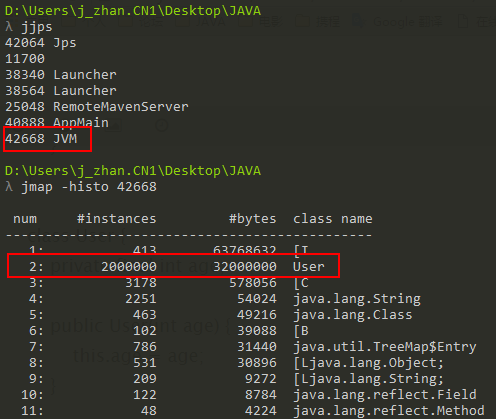
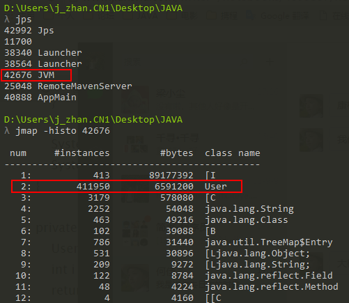
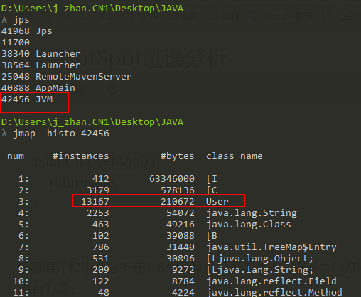
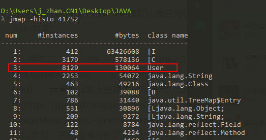
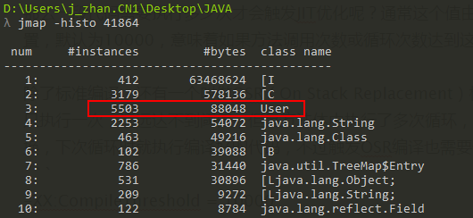
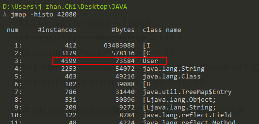
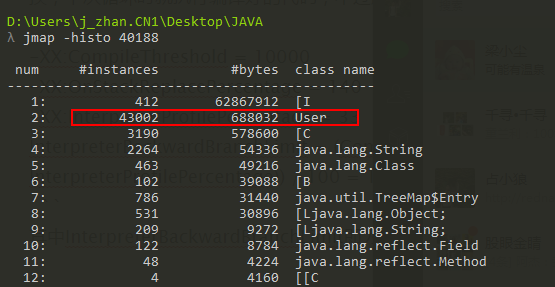
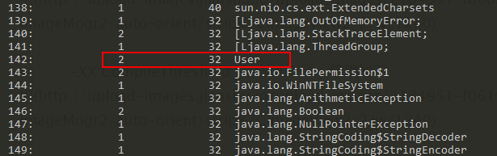

# 浅谈HotSpot逃逸分析


### JIT

即时编译（Just-in-time Compilation，JIT）是一种通过在运行时将字节码翻译为机器码，从而改善字节码编译语言性能的技术。在HotSpot实现中有多种选择：C1、C2和C1+C2，分别对应client、server和分层编译。
 1、C1编译速度快，优化方式比较保守；
 2、C2编译速度慢，优化方式比较激进；
 3、C1+C2在开始阶段采用C1编译，当代码运行到一定热度之后采用G2重新编译；
 在1.8之前，分层编译默认是关闭的，可以添加`-server -XX:+TieredCompilation`参数进行开启。

### 逃逸分析

逃逸分析并不是直接的优化手段，而是一个代码分析，通过动态分析对象的作用域，为其它优化手段如栈上分配、标量替换和同步消除等提供依据，发生逃逸行为的情况有两种：方法逃逸和线程逃逸。
 1、方法逃逸：当一个对象在方法中定义之后，作为参数传递到其它方法中；
 2、线程逃逸：如类变量或实例变量，可能被其它线程访问到；

如果不存在逃逸行为，则可以对该对象进行如下优化：同步消除、标量替换和栈上分配。

##### 同步消除

线程同步本身比较耗，如果确定一个对象不会逃逸出线程，无法被其它线程访问到，那该对象的读写就不会存在竞争，则可以消除对该对象的同步锁，通过`-XX:+EliminateLocks`可以开启同步消除。

##### 标量替换

1、标量是指不可分割的量，如java中基本数据类型和reference类型，相对的一个数据可以继续分解，称为聚合量；
 2、如果把一个对象拆散，将其成员变量恢复到基本类型来访问就叫做标量替换；
 3、如果逃逸分析发现一个对象不会被外部访问，并且该对象可以被拆散，那么经过优化之后，并不直接生成该对象，而是在栈上创建若干个成员变量；
 通过`-XX:+EliminateAllocations`可以开启标量替换， `-XX:+PrintEliminateAllocations`查看标量替换情况。

##### 栈上分配

故名思议就是在栈上分配对象，其实目前Hotspot并没有实现真正意义上的栈上分配，实际上是标量替换。


```cpp
  private static int fn(int age) {
        User user = new User(age);
        int i = user.getAge();
        return i;
    }
```

User对象的作用域局限在方法fn中，可以使用标量替换的优化手段在栈上分配对象的成员变量，这样就不会生成User对象，大大减轻GC的压力，下面通过例子看看逃逸分析的影响。


```java
public class JVM {
    public static void main(String[] args) throws Exception {
        int sum = 0;
        int count = 1000000;
        //warm up
        for (int i = 0; i < count ; i++) {
            sum += fn(i);
        }

        Thread.sleep(500);

        for (int i = 0; i < count ; i++) {
            sum += fn(i);
        }

        System.out.println(sum);
        System.in.read();
    }

    private static int fn(int age) {
        User user = new User(age);
        int i = user.getAge();
        return i;
    }
}

class User {
    private final int age;

    public User(int age) {
        this.age = age;
    }

    public int getAge() {
        return age;
    }
}
```

分层编译和逃逸分析在1.8中是默认是开启的，例子中fn方法被执行了200w次，按理说应该在Java堆生成200w个User对象。

1、通过`java -cp . -Xmx3G -Xmn2G -server -XX:-DoEscapeAnalysis JVM`运行代码，`-XX:-DoEscapeAnalysis`关闭逃逸分析，通过`jps`查看java进程的PID，接着通过`jmap -histo [pid]`查看java堆上的对象分布情况，结果如下：




 可以发现：关闭逃逸分析之后，User对象一个不少的都在堆上进行分配。


2、通过`java -cp . -Xmx3G -Xmn2G -server JVM`运行代码，结果如下：




 可以发现：开启逃逸分析之后，只有41w左右的User对象在Java堆上分配，其余的对象已经通过标量替换优化了。


3、通过`java -cp . -Xmx3G -Xmn2G -server -XX:-TieredCompilation`运行代码，关闭分层编译，结果如下：




 可以发现：关闭了分层编译之后，在Java堆上分配的User对象降低到1w多个，分层编译对逃逸分析还是有影响的。


### 编译阈值

即时编译JIT只在代码段执行足够次数才会进行优化，在执行过程中不断收集各种数据，作为优化的决策，所以在优化完成之前，例子中的User对象还是在堆上进行分配。

那么一段代码需要执行多少次才会触发JIT优化呢？通常这个值由`-XX:CompileThreshold`参数进行设置：
 1、使用client编译器时，默认为1500；
 2、使用server编译器时，默认为10000；
 意味着如果方法调用次数或循环次数达到这个阈值就会触发标准编译，更改CompileThreshold标志的值，将使编译器提早（或延迟）编译。

除了标准编译，还有一个叫做OSR（On Stack Replacement）栈上替换的编译，如上述例子中的main方法，只执行一次，远远达不到阈值，但是方法体中执行了多次循环，OSR编译就是只编译该循环代码，然后将其替换，下次循环时就执行编译好的代码，不过触发OSR编译也需要一个阈值，可以通过以下公式得到。


```undefined
-XX:CompileThreshold = 10000 
-XX:OnStackReplacePercentage = 140
-XX:InterpreterProfilePercentage = 33
OSR trigger = (CompileThreshold * (OnStackReplacePercentage - InterpreterProfilePercentage)) / 100 = 10700
```

其中trigger即为OSR编译的阈值。

那么如果把CompileThreshold设置适当小一点，是不是可以提早触发编译行为，减少在堆上生成User对象？我们可以进行通过不同参数验证一下：
 1、`-XX:CompileThreshold = 5000`，结果如下：



2、`-XX:CompileThreshold = 2500`，结果如下：





 3、`-XX:CompileThreshold = 2000`，结果如下：




4、`-XX:CompileThreshold = 1500`，结果如下：




在我的机器中，当设置到1500时，在堆上生成的User对象反而升到4w个，目前还不清楚原因是啥...

JIT编译在默认情况是异步进行的，当触发某方法或某代码块的优化时，先将其放入编译队列，然后由编译线程进行编译，编译之后的代码放在CodeCache中，CodeCache的大小也是有限的，通过`-XX:-BackgroundCompilation`参数可以关闭异步编译，我们可以通过执行`java -cp . -Xmx3G -Xmn2G -server -XX:CompileThreshold=1 -XX:-TieredCompilation -XX:-BackgroundCompilation JVM`命令看看同步编译的效果：在java堆上只生成了2个对象。



当然了，这是为了好玩而进行的测试，生产环境不要随意修改这些参数：
 1、热点代码的编译过程是有成本的，如果逻辑复杂，编程成本更高；
 2、编译后的代码会被存放在有大小限制的CodeCache中，如果CompileThreshold设置的太低，JIT会将一大堆执行不那么频繁的代码进行编译，并放入CodeCache，导致之后真正执行频繁的代码没有足够的空间存放；

