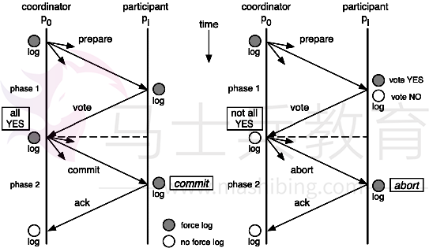
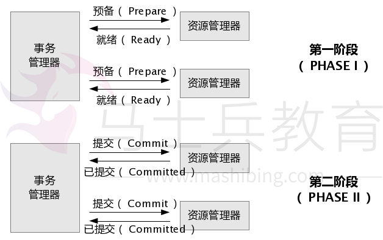
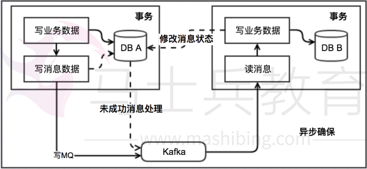
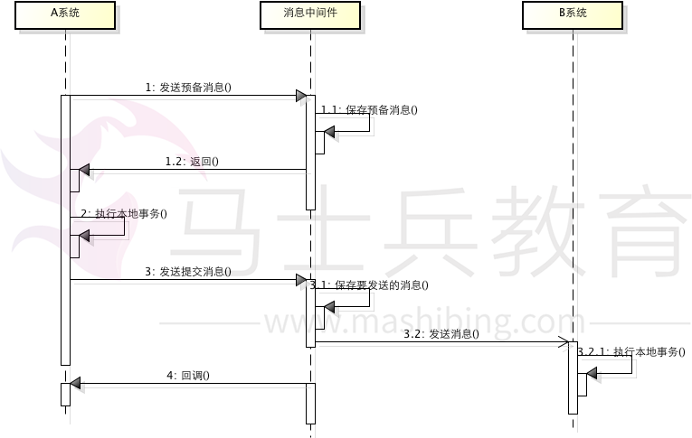
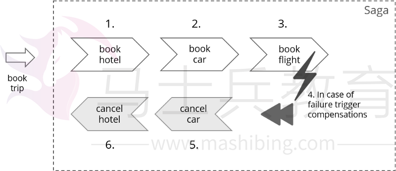

# **前言**

 分布式事务就是指事务的参与者、支持事务的服务器、资源服务器以及事务管理器分别位于不同的分布式系统的不同节点之上。简单的说，就是一次大的操作由不同的小操作组成，这些小的操作分布在不同的服务器上，且属于不同的应用，分布式事务需要保证这些小操作要么全部成功，要么全部失败。本质上来说，分布式事务就是为了保证不同数据库的数据一致性。

 

# **产生原因**

### **数据库分库分表：**

 当数据库单表一年产生的数据超过1000W，那么就要考虑分库分表（具体分库分表的原理在此不做解释），简单的说就是原来的一个数据库变成了多个数据库。这时候，如果一个操作既访问01库，又访问02库，而且要保证数据的一致性，那么就要用到分布式事务。

### **应用SOA化：**

 所谓的SOA化，就是业务的服务化。比如原来单机支撑了整个电商网站，现在对整个网站进行拆解，分离出了订单中心、用户中心、库存中心。对于订单中心，有专门的数据库存储订单信息，用户中心也有专门的数据库存储用户信息，库存中心也会有专门的数据库存储库存信息。这时候如果要同时对订单和库存进行操作，那么就会涉及到订单数据库和库存数据库，为了保证数据一致性，就需要用到分布式事务。

 分布式事务是企业集成中的一个技术难点，也是每一个分布式系统架构中都会涉及到的一个东西，特别是在微服务架构中，几乎可以说是无法避免。

 

# **应用场景**

### **支付、转账：**

 最经典的场景就是支付了，一笔支付，是对买家账户进行扣款，同时对卖家账户进行加钱，这些操作必须在一个事务里执行，要么全部成功，要么全部失败。而对于买家账户属于买家中心，对应的是买家数据库，而卖家账户属于卖家中心，对应的是卖家数据库，对不同数据库的操作必然需要引入分布式事务。

### **在线下单：**

 买家在电商平台下单，往往会涉及到两个动作，一个是扣库存，第二个是更新订单状态，库存和订单一般属于不同的数据库，需要使用分布式事务保证数据一致性。

### **电商场景：流量充值业务**

 中国移动-流量充值能力中心，核心业务流程为：

 1、用户进入流量充值商品购买页面，选择流量商品；

 2、购买流量充值商品，有库存限制则判断库存，生成流量购买订单；

 3、选择对应的支付方式（和包、银联、支付宝、微信）进行支付操作；

 4、支付成功后，近实时流量到账即可使用流量商品；

 此业务流程看似不是很复杂对吧，不涉及到类似电商业务的实物购买，但是我认为其中的区别并不是很大，只是缺少电商中的物流发货流程，其他流程几乎是一样的，也有库存以及优惠折扣等业务存在。

 

# **数据库事务**

 事务是由一组SQL语句组成的逻辑处理单元，事务具有以下4个属性，通常简称为事务的ACID属性：

 原子性（Atomicity）：事务是一个原子操作单元，其对数据的修改，要么全都执行，要么全都不执行。

 一致性（Consistent）：在事务开始和完成时，数据都必须保持一致状态。这意味着所有相关的数据规则都必须应用于事务的修改，以保持数据的完整性；事务结束时，所有的内部数据结构（如B树索引或双向链表）也都必须是正确的。

 隔离性（Isoation）：数据库系统提供一定的隔离机制，保证事务在不受外部并发操作影响的“独立”环境执行。这意味着事务处理过程中的中间状态对外部是不可见的，反之亦然。

 持久性（Durabe）：事务完成之后，它对于数据的修改是永久性的，即使出现系统故障也能够保持。

### **事务类型：**

 JDBC事务：即为上面说的数据库事务中的本地事务，通过connection对象控制管理。

 JTA事务：JTA指Java事务API(JavaTransaction API)，是Java EE数据库事务规范， JTA只提供了事务管理接口，由应用程序服务器厂商（如WebSphere Application Server）提供实现，JTA事务比JDBC更强大，支持分布式事务。

### **隔离级别及引发现象：（略谈）**

| 隔离级别 | 脏读 | 非重复读 | 幻读 |
| -------- | ---- | -------- | ---- |
| 未提交读 | Y    | Y        | Y    |
| 提交读   | N    | Y        | Y    |
| 可重复读 | N    | N        | Y    |
| 序列化   | N    | N        | N    |

### **Spring事务传播行为：（略谈）**

PROPAGATION_REQUIRED：支持当前事务，如当前没有事务，则新建一个。

PROPAGATION_SUPPORTS：支持当前事务，如当前没有事务，则已非事务性执行（源码中提示有个注意点，看不太明白，留待后面考究）。

PROPAGATION_MANDATORY：支持当前事务，如当前没有事务，则抛出异常（强制一定要在一个已经存在的事务中执行，业务方法不可独自发起自己的事务）。

PROPAGATION_REQUIRES_NEW：始终新建一个事务，如当前原来有事务，则把原事务挂起。

PROPAGATION_NOT_SUPPORTED：不支持当前事务，始终已非事务性方式执行，如当前事务存在，挂起该事务。

PROPAGATION_NEVER：不支持当前事务；如果当前事务存在，则引发异常。

PROPAGATION_NESTED：如果当前事务存在，则在嵌套事务中执行，如果当前没有事务，则执行与 PROPAGATION_REQUIRED 类似的操作（注意：当应用到JDBC时，只适用JDBC 3.0以上驱动）。

### **事务种类：**

 本地事务：普通事务，独立一个数据库，能保证在该数据库上操作的ACID。

 分布式事务：涉及两个或多个数据库源的事务，即跨越多台同类或异类数据库的事务（由每台数据库的本地事务组成的），分布式事务旨在保证这些本地事务的所有操作的ACID，使事务可以跨越多台数据库。

 

# **如何保证强一致性**

### **本地事务（mysql 之 InnoDB）：**

 InnoDB支持事务，同Oracle类似，事务提交需要写redo、undo。采用日志先行的策略，将数据的变更在内存中完成，并且将事务记录成redo，顺序的写入redo日志中，即表示该事务已经完成，就可以返回给客户已提交的信息。但是实际上被更改的数据还在内存中，并没有刷新到磁盘，即还没有落地，当达到一定的条件，会触发checkpoint，将内存中的数据（page）合并写入到磁盘，这样就减少了离散写、IOPS，提高性能。

 在这个过程中，如果服务器宕机了，内存中的数据丢失，当重启后，会通过redo日志进行recovery重做。确保不会丢失数据。因此只要redo能够实时的写入到磁盘，InnoDB就不会丢数据。

### **分布式事务：**

 多个数据库中的某个数据库在提交事务的时候突然断电，那么它是怎么样恢复的呢？ 这也是分布式系统复杂的地方，因为分布式的网络环境很复杂，这种“断电”故障要比单机多很多，所以我们在做分布式系统的时候，最先考虑的就是这种情况。这些异常可能有 机器宕机、网络异常、消息丢失、消息乱序、数据错误、不可靠的TCP、存储数据丢失、其他异常等等...

 对分布式系统有过研究的读者， 听说过 "CAP定律"、"Base理论" 等，这里不对这些概念做过多的解释，有兴趣的读者可以查看相关参考资料 。

 在分布式系统中，同时满足 "CAP定律" 中的 "一致性"、"可用性" 和 "分区容错性" 三者是不可能的， 根据不同的业务场景使用不同的方法实现最终一致性，可以根据业务的特性做部分取舍，在业务过程中可以容忍一定时间内的数据不一致。

 

# **实现分布式事务解决方案**

### **基于XA协议的两阶段提交（2PC）**

 XA 是由 X/Open 组织提出的**分布式事务的规范**。

 XA 规范主要 定义了 ( 全局 ) 事务管理器 ( Transaction Manager ) 和 ( 局部 ) 资源管理器 ( Resource Manager ) 之间的接口。 XA 接口是双向的系统接口，在事务管理器（Transaction Manager）以及一个或多个资源管理器（Resource Manager）之间形成通信桥梁。 XA 之所以需要引入事务管理器是因为，在分布式系统中，从理论上讲（参考Fischer等的论文），两台机器理论上无 法达到一致的状态，需要引入一个单点进行协调。 事务管理器控制着全局事务，管理事务生命周期，并协调资源。资源管理器负责控制和管理实际资源（如数据库或 JMS队列）。下图说明了事务管理器、资源管理器，与应用程序之间的关系：

在 JavaEE 平台下，WebLogic、Webshare 等主流商用的应用服务器提供了 JTA 的实现和支持。而在 Tomcat 下是没有实现的（Tomcat 不能算是 JavaEE 应用服务器，比较轻量），这就需要借助第三方的框架 Jotm、Automikos 等来实现，两者均支持 Spring 事务整合。

 在分布式事务的控制中采用了**两阶段提交协议（Two- Phase Commit Protocol）**。即事务的提交分为两个阶段：

　　**预提交阶段(Pre-Commit Phase)**　　**决策后阶段（Post-Decision Phase）**

 为了支持两阶段提交，一个分布式更新事务中涉及到的服务器必须能够相互通信。一般来说一个服务器会被指定为"控制"或"提交"服务器并监控来自其它服务器的信息。

 在一个分布式事务中，必须有一个场地的Server作为协调者(coordinator)，它能向 其它场地的Server发出请求，并对它们的回答作出响应，由它来控制一个分布式事务的提交或撤消。该分布式事务中涉及到的其它场地的Server称为参 与者（Participant）。

事务两阶段提交的过程如下：　　

● 两阶段提交在应用程序向协调者发出一个提交命令时被启动。这时提交进入第一阶段，即预提交阶段。在这一阶段中：

(1) 协调者准备局部（即在本地）提交并在日志中写入"预提交"日志项，并包含有该事务的所有参与者的名字。

(2) 协调者询问参与者能否提交该事务。一个参与者可能由于多种原因不能提交。例如，该Server提供的约束条件（Constraints）的延迟检查不符合 限制条件时，不能提交；参与者本身的Server进程或硬件发生故障，不能提交；或者协调者访问不到某参与者（网络故障），这时协调者都认为是收到了一个 否定的回答。

(3) 如果参与者能够提交，则在其本身的日志中写入"准备提交"日志项，该日志项立即写入硬盘，然后给协调者发回，已准备好提交"的回答。

(4) 协调者等待所有参与者的回答，如果有参与者发回否定的回答，则协调者撤消该事务并给所有参与者发出一个"撤消该事务"的消息，结束该分布式事务，撤消该事务的所有影响。

● 如果所有的参与者都送回"已准备好提交"的消息，则该事务的提交进入第二阶段，即决策后提交阶段。在这一阶段中：　　

(1) 协调者在日志中写入"提交"日志项，并立即写入硬盘。　　

(2) 协调者向参与者发出"提交该事务"的命令。各参与者接到该命令后，在各自的日志中写入"提交"日志项，并立即写入硬盘。然后送回"已提交"的消息，释放该事务占用的资源。 　

(3) 当所有的参与者都送回"已提交"的消息后，协调者在日志中写入"事务提交完成"日志项，释放协调者占用的资源 。这样，完成了该分布式事务的提交。

**优点：** 尽量保证了数据的强一致，适合对数据强一致要求很高的关键领域。

**缺点：** 实现复杂，牺牲了可用性，对性能影响较大，涉及多次节点间的网络通信，通信时间太长，不适合高并发高性能场景。

### **补偿事务（TCC）**

 TCC 其实就是采用的补偿机制，其核心思想是：针对每个操作，都要注册一个与其对应的确认和补偿（撤销）操作。它分为三个阶段：

- Try 阶段主要是对业务系统做检测及资源预留
- Confirm 阶段主要是对业务系统做确认提交，Try 阶段执行成功并开始执行 Confirm 阶段时，默认Confirm 阶段是不会出错的。即：只要 Try 成功，Confirm 一定成功。
- Cancel 阶段主要是在业务执行错误，需要回滚的状态下执行的业务取消，预留资源释放。

举个例子，假入 Bob 要向 Smith 转账，思路大概是：我们有一个本地方法，里面依次调用

1、首先在 Try 阶段，要先调用远程接口把 Smith 和 Bob 的钱给冻结起来。

2、在 Confirm 阶段，执行远程调用的转账的操作，转账成功进行解冻。

3、如果第2步执行成功，那么转账成功，如果第二步执行失败，则调用远程冻结接口对应的解冻方法 (Cancel)。

**优点：** 跟 2PC 比起来，实现以及流程相对简单了一些，但数据的一致性比 2PC 也要差一些。

**缺点：** 缺点还是比较明显的，在2,3步中都有可能失败。TCC 属于应用层的一种补偿方式，所以需要程序员在实现的时候多写很多补偿的代码，在一些场景中，一些业务流程可能用 TCC 不太好定义及处理。

### **本地消息表（MQ 异步确保）**

 这种实现方式的思路，其实是源于ebay，后来通过支付宝等公司的布道，在业内广泛使用。其基本的设计思想是将远程分布式事务拆分成一系列的本地事务。如果不考虑性能及设计优雅，借助关系型数据库中的表即可实现。

基本思路就是：

 消息生产方，需要额外建一个消息表，并记录消息发送状态。消息表和业务数据要在一个事务里提交，也就是说他们要在一个数据库里面。然后消息会经过 MQ 发送到消息的消费方。如果消息发送失败，会进行重试发送。

 消息消费方，需要处理这个消息，并完成自己的业务逻辑。此时如果本地事务处理成功，表明已经处理成功了，如果处理失败，那么就会重试执行。如果是业务上面的失败，可以给生产方发送一个业务补偿消息，通知生产方进行回滚等操作。

 生产方和消费方定时扫描本地消息表，把还没处理完成的消息或者失败的消息再发送一遍。如果有靠谱的自动对账补账逻辑（防止消息会被重复投递，增加消息应用状态表（message_apply），通俗来说就是个账本，用于记录消息的消费情况，每次来一个消息， 在真正执行之前，先去消息应用状态表中查询一遍，如果找到说明是重复消息，丢弃即可，如果没找到才执行，同时插入到消息应用状态表（同一事务）），这种方案还是非常实用的。

 这种方案遵循 BASE 理论，采用的是最终一致性，比较适合实际业务场景的，即不会出现像 2PC 那样复杂的实现(当调用链很长的时候，2PC 的可用性是非常低的)，也不会像 TCC 那样可能出现确认或者回滚不了的情况。

**优点：** 一种非常经典的实现，避免了分布式事务，实现了最终一致性。

**缺点：** 消息表会耦合到业务系统中，如果没有封装好的解决方案，会有很多杂活需要处理，而且，关系型数据库的吞吐量和性能方面存在瓶颈，频繁的读写消息会给数据库造成压力。

### **MQ 事务消息**

 有一些第三方的 MQ 是支持事务消息的，比如 RocketMQ，他们支持事务消息的方式也是类似于采用的二阶段提交，但是市面上一些主流的 MQ 都是不支持事务消息的，比如 RabbitMQ 和 Kafka 都不支持。

 以阿里的 RocketMQ 中间件为例，其思路大致为：

 第一阶段 Prepared 消息，会拿到消息的地址。 第二阶段执行本地事务，第三阶段通过第一阶段拿到的地址去访问消息，并修改状态。

 也就是说在业务方法内要想消息队列提交两次请求，一次发送消息和一次确认消息。如果确认消息发送失败了 RocketMQ 会定期扫描消息集群中的事务消息，这时候发现了 Prepared 消息，它会向消息发送者确认，所以生产方需要实现一个 check 接口，RocketMQ 会根据发送端设置的策略来决定是回滚还是继续发送确认消息。

 这样就保证了消息发送与本地事务同时成功或同时失败，具体原理如下：

 1、A系统向消息中间件发送一条预备消息

2、消息中间件保存预备消息并返回成功

3、A执行本地事务

4、A发送提交消息给消息中间件

通过以上4 步完成了一个消息事务。对于以上的4个步骤，每个步骤都可能产生错误，下面一一分析：

 步骤一出错，则整个事务失败，不会执行A的本地操作

 步骤二出错，则整个事务失败，不会执行A的本地操作

 步骤三出错，这时候需要回滚预备消息，怎么回滚？答案是A系统实现一个消息中间件的回调接口，消息中间件会去不断执行回调接口，检查A事务执行是否执行成功，如果失败则回滚预备消息

 步骤四出错，这时候A的本地事务是成功的，那么消息中间件要回滚A吗？答案是不需要，其实通过回调接口，消息中间件能够检查到A执行成功了，这时候其实不需要A发提交消息了，消息中间件可以自己对消息进行提交，从而完成整个消息事务

 基于消息中间件的两阶段提交往往用在高并发场景下，将一个分布式事务拆成一个消息事务（A系统的本地操作+发消息）+B系统的本地操作，其中B系统的操作由消息驱动，只要消息事务成功，那么A操作一定成功，消息也一定发出来了，这时候B会收到消息去执行本地操作，如果本地操作失败，消息会重投，直到B操作成功，这样就变相地实现了A与B的分布式事务。

**优点：** 实现了最终一致性，不需要依赖本地数据库事务。

**缺点：** 实现难度大，主流MQ不支持，没有.NET客户端，RocketMQ事务消息部分代码也未开源。

### **Sagas 事务模型**

 Saga事务模型又叫做长时间运行的事务（Long-running-transaction）, 它是由普林斯顿大学的H.Garcia-Molina等人提出，它描述的是另外一种在没有两阶段提交的的情况下解决分布式系统中复杂的业务事务问题。

 我们这里说的是一种基于 Sagas 机制的工作流事务模型，这个模型的相关理论目前来说还是比较新的，以至于百度上几乎没有什么相关资料。

 该模型其核心思想就是拆分分布式系统中的长事务为多个短事务，或者叫多个本地事务，然后由 Sagas 工作流引擎负责协调，如果整个流程正常结束，那么就算是业务成功完成，如果在这过程中实现失败，那么Sagas工作流引擎就会以相反的顺序调用补偿操作，重新进行业务回滚。

 比如我们一次关于购买旅游套餐业务操作涉及到三个操作，他们分别是预定车辆，预定宾馆，预定机票，他们分别属于三个不同的远程接口。可能从我们程序的角度来说他们不属于一个事务，但是从业务角度来说是属于同一个事务的。

 他们的执行顺序如上图所示，所以当发生失败时，会依次进行取消的补偿操作。

 因为长事务被拆分了很多个业务流，所以 Sagas 事务模型最重要的一个部件就是工作流或者你也可以叫流程管理器（Process Manager），工作流引擎和Process Manager虽然不是同一个东西，但是在这里，他们的职责是相同的。

 优缺点这里我们就不说了，因为这个理论比较新，目前市面上还没有什么解决方案，即使是 Java 领域，也没有搜索的太多有用的信息。

### **其他补偿方式**

 做过支付宝交易接口的同学都知道，我们一般会在支付宝的回调页面和接口里，解密参数，然后调用系统中更新交易状态相关的服务，将订单更新为付款成功。同时，只有当我们回调页面中输出了success字样或者标识业务处理成功相应状态码时，支付宝才会停止回调请求。否则，支付宝会每间隔一段时间后，再向客户方发起回调请求，直到输出成功标识为止。

 其实这就是一个很典型的补偿例子，跟一些 MQ 重试补偿机制很类似。

 一般成熟的系统中，对于级别较高的服务和接口，整体的可用性通常都会很高。如果有些业务由于瞬时的网络故障或调用超时等问题，那么这种重试机制其实是非常有效的。

 当然，考虑个比较极端的场景，假如系统自身有bug或者程序逻辑有问题，那么重试1W次那也是无济于事的。那岂不是就发生了“明明已经付款，却显示未付款不发货”类似的悲剧？

 其实为了交易系统更可靠，我们一般会在类似交易这种高级别的服务代码中，加入详细日志记录的，一旦系统内部引发类似致命异常，会有邮件通知。同时，后台会有定时任务扫描和分析此类日志，检查出这种特殊的情况，会尝试通过程序来补偿并邮件通知相关人员。

 在某些特殊的情况下，还会有 "人工补偿" 的，这也是最后一道屏障。

# **总结**

 分布式事务，本质上是对多个数据库的事务进行统一控制，按照控制力度可以分为：不控制、部分控制和完全控制。

 具体用哪种方式，最终还是取决于业务场景。作为技术人员，一定不能忘了技术是为业务服务的，不要为了技术而技术，针对不同业务进行技术选型也是一种很重要的能力！