# 深入分析ConcurrentHashMap1.8的扩容实现

ConcurrentHashMap相关的文章写了不少，有个遗留问题一直没有分析，也被好多人请教过，被搁置在一旁，即如何在并发的情况下实现数组的扩容。

### 什么情况会触发扩容

当往hashMap中成功插入一个key/value节点时，有可能触发扩容动作：
1、如果新增节点之后，所在链表的元素个数达到了阈值 **8**，则会调用`treeifyBin`方法把链表转换成红黑树，不过在结构转换之前，会对数组长度进行判断，实现如下：

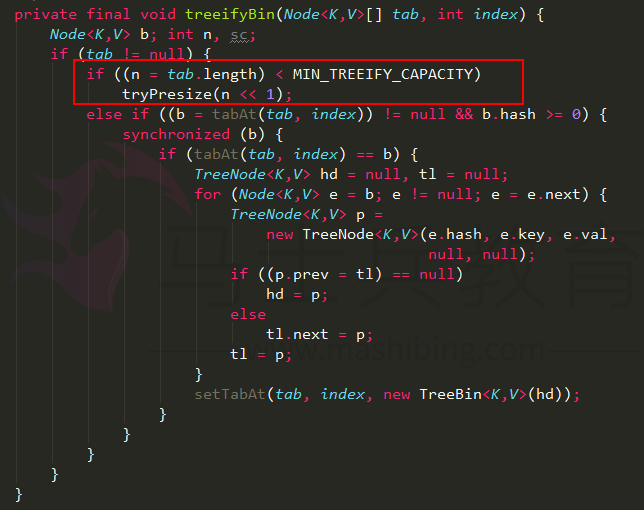

如果数组长度n小于阈值`MIN_TREEIFY_CAPACITY`，默认是64，则会调用`tryPresize`方法把数组长度扩大到原来的两倍，并触发`transfer`方法，重新调整节点的位置。

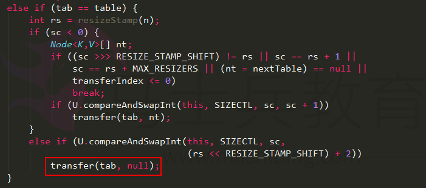

2、新增节点之后，会调用`addCount`方法记录元素个数，并检查是否需要进行扩容，当数组元素个数达到阈值时，会触发`transfer`方法，重新调整节点的位置。

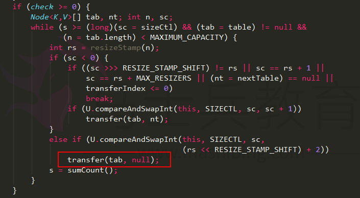

### transfer实现

`transfer`方法实现了在并发的情况下，高效的从原始组数往新数组中移动元素，假设扩容之前节点的分布如下，这里区分蓝色节点和红色节点，是为了后续更好的分析：

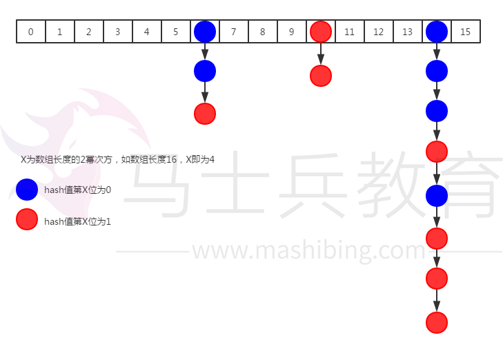

在上图中，第14个槽位插入新节点之后，链表元素个数已经达到了8，且数组长度为16，优先通过扩容来缓解链表过长的问题，实现如下：
1、根据当前数组长度n，新建一个两倍长度的数组`nextTable`；

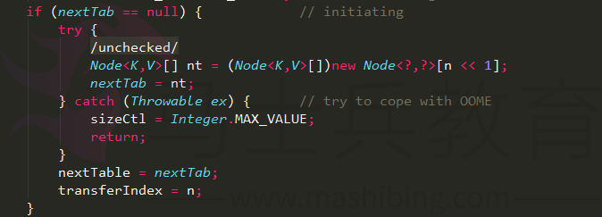

2、初始化`ForwardingNode`节点，其中保存了新数组`nextTable`的引用，在处理完每个槽位的节点之后当做占位节点，表示该槽位已经处理过了；

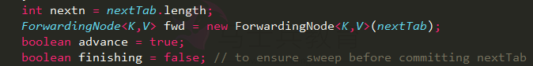

3、通过`for`自循环处理每个槽位中的链表元素，默认`advace`为真，通过CAS设置`transferIndex`属性值，并初始化`i`和`bound`值，`i`指当前处理的槽位序号，`bound`指需要处理的槽位边界，先处理槽位15的节点；

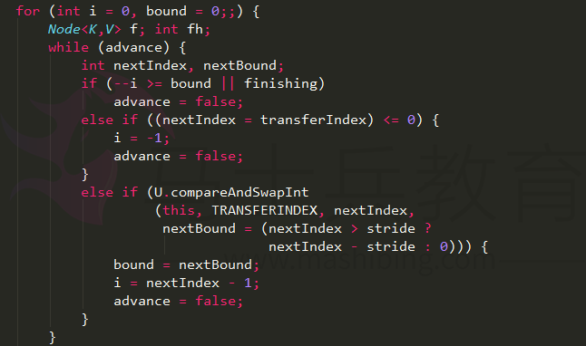

4、在当前假设条件下，槽位15中没有节点，则通过CAS插入在第二步中初始化的`ForwardingNode`节点，用于告诉其它线程该槽位已经处理过了；

5、如果槽位15已经被线程A处理了，那么线程B处理到这个节点时，取到该节点的hash值应该为`MOVED`，值为`-1`，则直接跳过，继续处理下一个槽位14的节点；

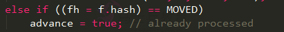

6、处理槽位14的节点，是一个链表结构，先定义两个变量节点`ln`和`hn`，按我的理解应该是`lowNode`和`highNode`，分别保存hash值的第X位为0和1的节点，具体实现如下：

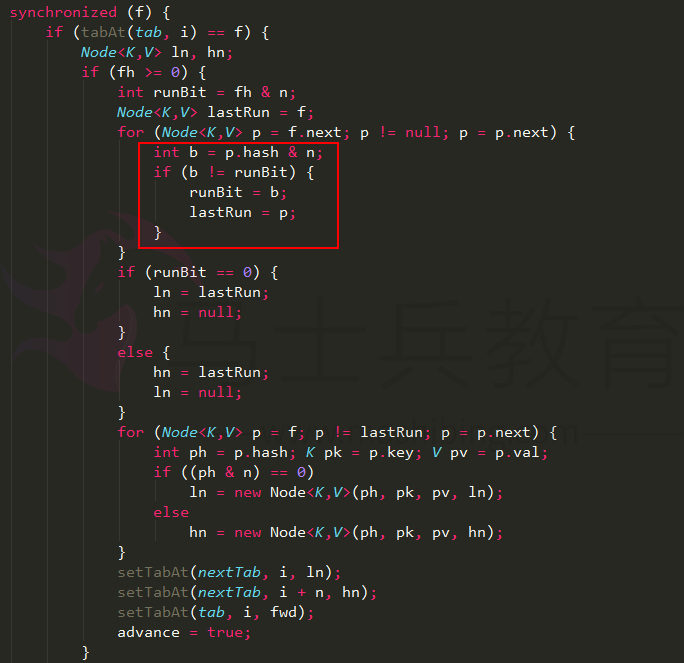

使用`fn&n`可以快速把链表中的元素区分成两类，A类是hash值的第X位为0，B类是hash值的第X位为1，并通过`lastRun`记录最后需要处理的节点，A类和B类节点可以分散到新数组的槽位14和30中，在原数组的槽位14中，蓝色节点第X为0，红色节点第X为1，把链表拉平显示如下：

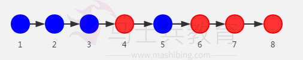

1、通过遍历链表，记录`runBit`和`lastRun`，分别为1和节点6，所以设置`hn`为节点6，`ln`为null；
2、重新遍历链表，以`lastRun`节点为终止条件，根据第X位的值分别构造ln链表和hn链表：

ln链：和原来链表相比，顺序已经不一样了

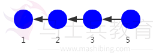

hn链：

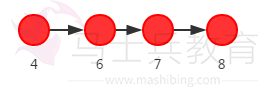

通过CAS把ln链表设置到新数组的i位置，hn链表设置到i+n的位置；

7、如果该槽位是红黑树结构，则构造树节点`lo`和`hi`，遍历红黑树中的节点，同样根据`hash&n`算法，把节点分为两类，分别插入到`lo`和`hi`为头的链表中，根据`lo`和`hi`链表中的元素个数分别生成`ln`和`hn`节点，其中`ln`节点的生成逻辑如下：
（1）如果`lo`链表的元素个数小于等于`UNTREEIFY_THRESHOLD`，默认为6，则通过`untreeify`方法把树节点链表转化成普通节点链表；
（2）否则判断`hi`链表中的元素个数是否等于0：如果等于0，表示`lo`链表中包含了所有原始节点，则设置原始红黑树给`ln`，否则根据`lo`链表重新构造红黑树。

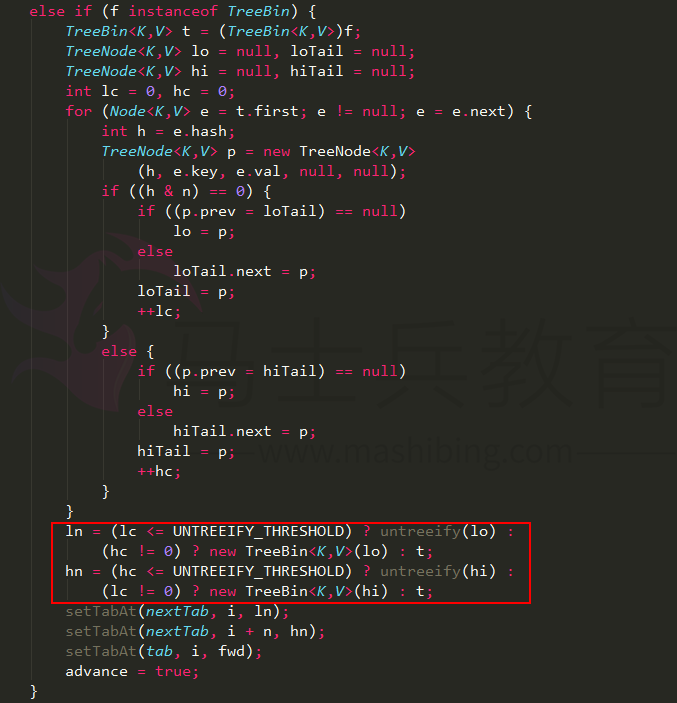

最后，同样的通过CAS把`ln`设置到新数组的`i`位置，`hn`设置到`i+n`位置。