ThreadLocal可以说是笔试面试的常客，每逢面试基本都会问到，关于ThreadLocal的原理以及不正当的使用造成的OOM内存溢出的问题，值得花时间仔细研究一下其原理。这一篇主要学习一下ThreadLocal的原理，在下一篇会深入理解一下OOM内存溢出的原理和最佳实践。

ThreadLocal很容易让人望文生义，想当然地认为是一个“本地线程”。其实，ThreadLocal并不是一个Thread，而是Thread的一个局部变量，也许把它命名为`ThreadLocalVariable`更容易让人理解一些。

当使用ThreadLocal维护变量时，ThreadLocal为每个使用该变量的线程提供独立的变量副本，所以每一个线程都可以独立地改变自己的副本，而不会影响其它线程所对应的副本。

**ThreadLocal 的作用是提供线程内的局部变量，这种变量在线程的生命周期内起作用，减少同一个线程内多个函数或者组件之间一些公共变量的传递的复杂度。**

从线程的角度看，目标变量就像是线程的本地变量，这也是类名中“Local”所要表达的意思。

## ThreadLocal全部方法和内部类

ThreadLocal全部方法和内部类结构如下：

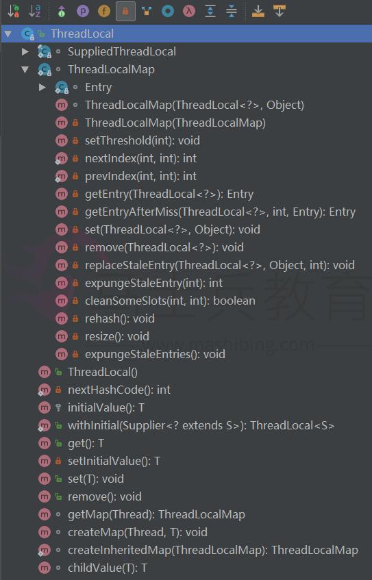

ThreadLocal公有的方法就四个，分别为：**get、set、remove、intiValue**:

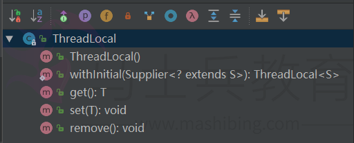

也就是说我们平时使用的时候关心的是这四个方法。

**ThreadLocal是如何做到为每一个线程维护变量的副本的呢？**

其实实现的思路很简单：在ThreadLocal类中有一个static声明的Map，用于存储每一个线程的变量副本，Map中元素的键为线程对象，而值对应线程的变量副本。我们自己就可以提供一个简单的实现版本：

```
public class SimpleThreadLocal<T> {

    /**
     * Key为线程对象，Value为传入的值对象
     */
    private static Map<Thread, T> valueMap = Collections.synchronizedMap(new HashMap<Thread, T>());

    /**
     * 设值
     * @param value Map键值对的value
     */
    public void set(T value) {
        valueMap.put(Thread.currentThread(), value);
    }

    /**
     * 取值
     * @return
     */
    public T get() {
        Thread currentThread = Thread.currentThread();
        //返回当前线程对应的变量
        T t = valueMap.get(currentThread);
        //如果当前线程在Map中不存在，则将当前线程存储到Map中
        if (t == null && !valueMap.containsKey(currentThread)) {
            t = initialValue();
            valueMap.put(currentThread, t);
        }
        return t;
    }

    public void remove() {
        valueMap.remove(Thread.currentThread());
    }

    public T initialValue() {
        return null;
    }

    public static void main(String[] args) {

        SimpleThreadLocal<List<String>> threadLocal = new SimpleThreadLocal<>();

        new Thread(() -> {
            List<String> params = new ArrayList<>(3);
            params.add("张三");
            params.add("李四");
            params.add("王五");
            threadLocal.set(params);
            System.out.println(Thread.currentThread().getName());
            threadLocal.get().forEach(param -> System.out.println(param));
        }).start();

        new Thread(() -> {
            try {
                Thread.sleep(1000);
                List<String> params = new ArrayList<>(2);
                params.add("Chinese");
                params.add("English");
                threadLocal.set(params);
                System.out.println(Thread.currentThread().getName());
                threadLocal.get().forEach(param -> System.out.println(param));
            } catch (InterruptedException e) {
                e.printStackTrace();
            }
        }).start();
    }
} 
```

运行结果：

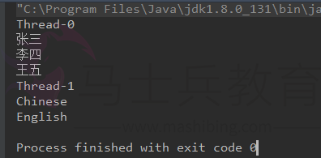

虽然上面的代码清单中的这个ThreadLocal实现版本显得比较简单粗，但其目的主要在与呈现JDK中所提供的ThreadLocal类在实现上的思路。

## ThreadLocal源码分析

**1、线程局部变量在Thread中的位置**

既然是**线程局部变量**，那么理所当然就应该存储在自己的线程对象中，我们可以从 Thread 的源码中找到**线程局部变量存储**的地方：

```
public class Thread implements Runnable {
    /* Make sure registerNatives is the first thing <clinit> does. */
    private static native void registerNatives();
    static {
        registerNatives();
    }

    //省略其他代码

    /* ThreadLocal values pertaining to this thread. This map is maintained
     * by the ThreadLocal class. */
    ThreadLocal.ThreadLocalMap threadLocals = null;

    /*
     * InheritableThreadLocal values pertaining to this thread. This map is
     * maintained by the InheritableThreadLocal class.
     */
    ThreadLocal.ThreadLocalMap inheritableThreadLocals = null;
}12345678910111213141516171819
```

我们可以看到线程局部变量是存储在Thread对象的 `threadLocals` 属性中，而 `threadLocals` 属性是一个 `ThreadLocal.ThreadLocalMap` 对象。

ThreadLocalMap为ThreadLocal的**静态内部类**，如下图所示：

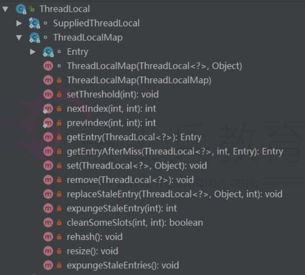

**2、Thread和ThreadLocalMap的关系**

Thread和ThreadLocalMap的关系，先看下边这个简单的图，可以看出Thread中的`threadLocals`就是ThreadLocal中的ThreadLocalMap：

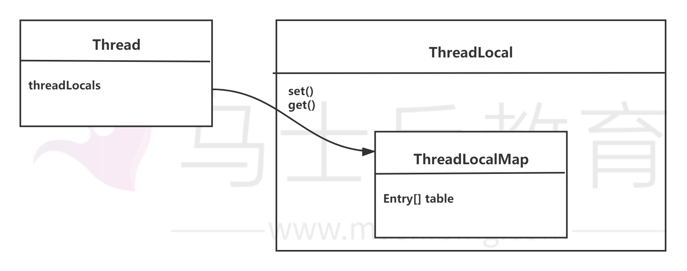

到这里应该大致能够感受到上述三者之间微妙的关系，再看一个复杂点的图：

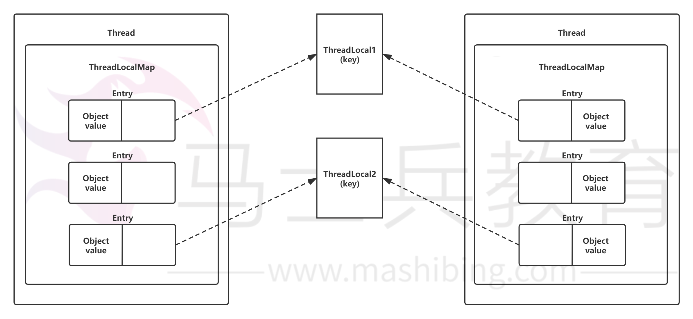

可以看出每个`thread`实例都有一个`ThreadLocalMap`。在上图中的一个Thread的这个ThreadLocalMap中分别存放了3个Entry，默认一个ThreadLocalMap初始化了16个Entry，每一个Entry对象存放的是一个ThreadLocal变量对象。

再简单一点的说就是：一个Thread中只有一个ThreadLocalMap，一个ThreadLocalMap中可以有多个ThreadLocal对象，其中一个ThreadLocal对象对应一个ThreadLocalMap中的一个Entry（也就是说：一个Thread可以依附有多个ThreadLocal对象）。

再看一张图片，应该可以更好的理解，如下图：

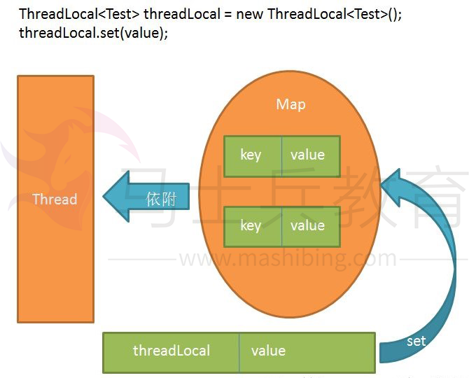

这里的Map其实是ThreadLocalMap。

**3、ThreadLocalMap与WeakReference**

`ThreadLocalMap`从字面上就可以看出这是一个保存`ThreadLocal`对象的map(其实是以它为Key)，不过是经过了两层包装的ThreadLocal对象：

（1）第一层包装是使用 `WeakReference<ThreadLocal<?>>` 将`ThreadLocal`对象变成一个弱引用的对象；

（2）第二层包装是定义了一个专门的类 Entry 来扩展 `WeakReference<ThreadLocal<?>>`：

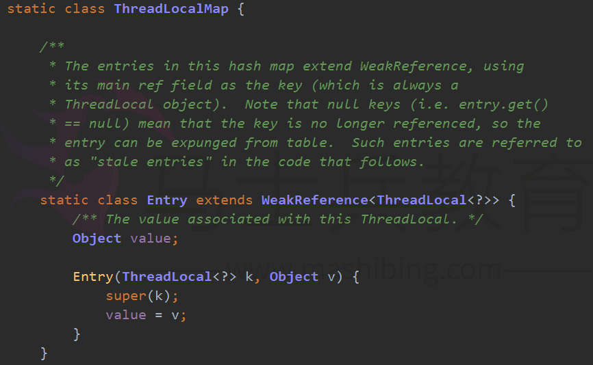

类 Entry 很显然是一个**保存map键值对**的实体，`ThreadLocal<?>`为key, 要保存的线程局部变量的值为`value`。`super(k)`调用的`WeakReference`的构造函数，表示将`ThreadLocal<?>`对象转换成弱引用对象，用做key。

**4、ThreadLocalMap 的构造函数**

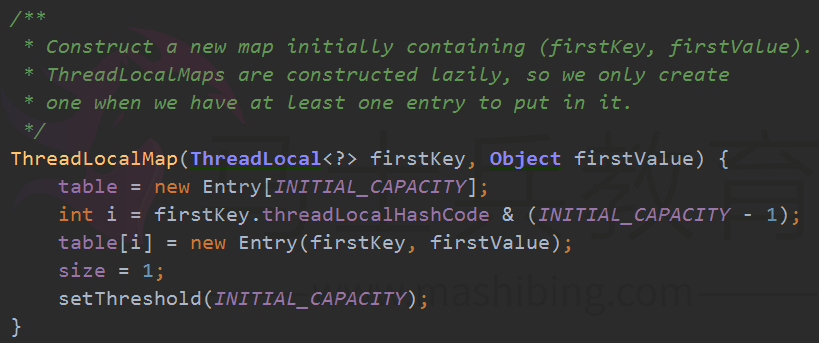

可以看出，ThreadLocalMap这个map的实现是使用一个数组 `private Entry[] table` 来保存键值对的实体，初始大小为16，`ThreadLocalMap`自己实现了如何从 `key` 到 value 的映射：

```
int i = firstKey.threadLocalHashCode & (INITIAL_CAPACITY - 1);1
```

使用一个 `static` 的原子属性 `AtomicInteger nextHashCode`，通过每次增加 `HASH_INCREMENT = 0x61c88647` ，然后 `& (INITIAL_CAPACITY - 1)` 取得在数组 `private Entry[] table` 中的索引。

```
public class ThreadLocal<T> {
    /**
     * ThreadLocals rely on per-thread linear-probe hash maps attached
     * to each thread (Thread.threadLocals and
     * inheritableThreadLocals).  The ThreadLocal objects act as keys,
     * searched via threadLocalHashCode.  This is a custom hash code
     * (useful only within ThreadLocalMaps) that eliminates collisions
     * in the common case where consecutively constructed ThreadLocals
     * are used by the same threads, while remaining well-behaved in
     * less common cases.
     */
    private final int threadLocalHashCode = nextHashCode();

    /**
     * The next hash code to be given out. Updated atomically. Starts at
     * zero.
     */
    private static AtomicInteger nextHashCode =
        new AtomicInteger();

    /**
     * The difference between successively generated hash codes - turns
     * implicit sequential thread-local IDs into near-optimally spread
     * multiplicative hash values for power-of-two-sized tables.
     */
    private static final int HASH_INCREMENT = 0x61c88647;

    /**
     * Returns the next hash code.
     */
    private static int nextHashCode() {
        return nextHashCode.getAndAdd(HASH_INCREMENT);
    }
    //省略其它代码
}
```

总的来说，ThreadLocalMap是一个类似HashMap的集合，只不过自己实现了寻址，也没有HashMap中的put方法，而是set方法等区别。

## ThreadLocal的set方法

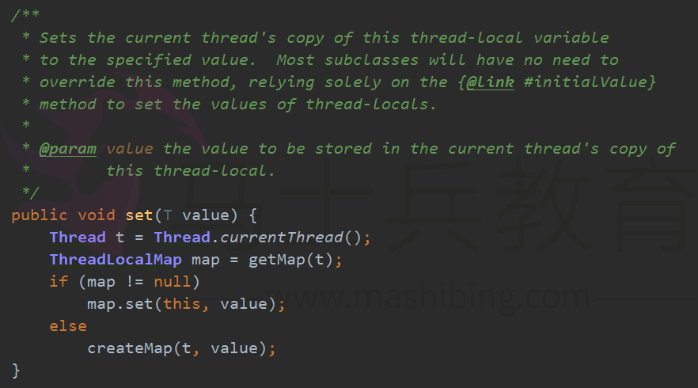

由于每个thread实例都有一个ThreadLocalMap，所以在进行set的时候，首先根据Thread.currentThread（）获取当前线程，然后根据当前线程t，调用getMap(t)获取ThreadLocalMap对象，
如果是第一次设置值，ThreadLocalMap对象是空值，所以会进行初始化操作，即调用`createMap(t,value)`方法：


即是调用上述的构造方法进行构造，这里仅仅是初始化了16个元素的引用数组，并没有初始化16个 Entry 对象。而是一个线程中有多少个线程局部对象要保存，那么就初始化多少个 Entry 对象来保存它们。
到了这里，我们可以思考一下，为什么要这样实现了。

**1、为什么要用 ThreadLocalMap 来保存线程局部对象呢？**

原因是一个线程拥有的的局部对象可能有很多，这样实现的话，那么不管你一个线程拥有多少个局部变量，都是使用同一个 ThreadLocalMap 来保存的，ThreadLocalMap 中 `private Entry[] table` 的初始大小是16。超过容量的2/3时，会扩容。


然后在回到如果map不为空的情况，会调用`map.set(this, value);`方法，我们看到是以当前 thread 的引用为 key, 获得 `ThreadLocalMap` ，然后调用 `map.set(this, value);` 保存进 `private Entry[] table` :

```
    private void set(ThreadLocal<?> key, Object value) {

        // We don't use a fast path as with get() because it is at
        // least as common to use set() to create new entries as
        // it is to replace existing ones, in which case, a fast
        // path would fail more often than not.

        Entry[] tab = table;
        int len = tab.length;
        int i = key.threadLocalHashCode & (len - 1);

        for (Entry e = tab[i];
             e != null;
             e = tab[i = nextIndex(i, len)]) {
            ThreadLocal<?> k = e.get();

            if (k == key) {
                e.value = value;
                return;
            }

            if (k == null) {
                replaceStaleEntry(key, value, i);
                return;
            }
        }

        tab[i] = new Entry(key, value);
        int sz = ++size;
        if (!cleanSomeSlots(i, sz) && sz >= threshold)
            rehash();
    }
```

可以看到，`set(T value)`方法为每个Thread对象都创建了一个ThreadLocalMap，并且将value放入ThreadLocalMap中，ThreadLocalMap作为Thread对象的成员变量保存。那么可以用下图来表示ThreadLocal在存储value时的关系。

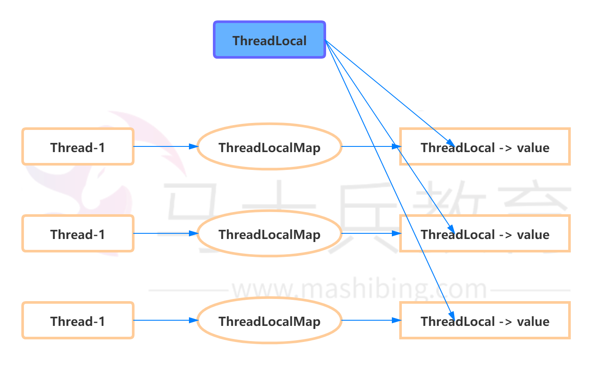

**2、了解了set方法的大致原理之后，我们在研究一段程序如下：**

```
/**
  * 三个ThreadLocal
  */
private static ThreadLocal<String> threadLocal1 = new ThreadLocal<>();
private static ThreadLocal<String> threadLocal2 = new ThreadLocal<>();
private static ThreadLocal<String> threadLocal3 = new ThreadLocal<>();

//线程池变量指定一个线程
ExecutorService executorService = Executors.newFixedThreadPool(1);

executorService.execute(() -> {
    threadLocal1.set("123");
    threadLocal2.set("234");
    threadLocal3.set("345");
    Thread t = Thread.currentThread();
    System.out.println(Thread.currentThread().getName());
});
123456789101112131415161718
```

这样的话就相当于**一个线程依附了三个ThreadLocal对象**,执行完最后一个set方法之后，调试过程如下：

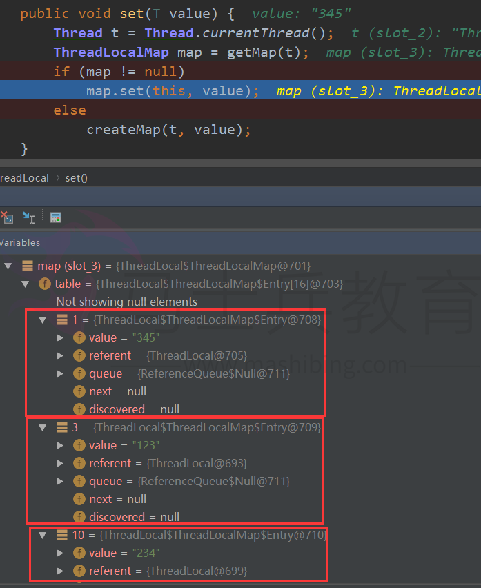

可以看到table（Entry集合）中有三个对象，对象的值就是我们设置的三个threadLocal的对象值；

**3、如果在修改一下代码，修改为两个线程：**

```
private static final int THREAD_LOOP_SIZE = 2;

private static ThreadLocal<String> threadLocal1 = new ThreadLocal<>();
private static ThreadLocal<String> threadLocal2 = new ThreadLocal<>();
private static ThreadLocal<String> threadLocal3 = new ThreadLocal<>();

ExecutorService executorService = Executors.newFixedThreadPool(THREAD_LOOP_SIZE);

for (int i = 0; i < THREAD_LOOP_SIZE; i++) {
    executorService.execute(() -> {
        threadLocal1.set("123");
        threadLocal2.set("234");
        threadLocal3.set("345");
    });
}
```

这样的话，可以看到运行调试图如下：

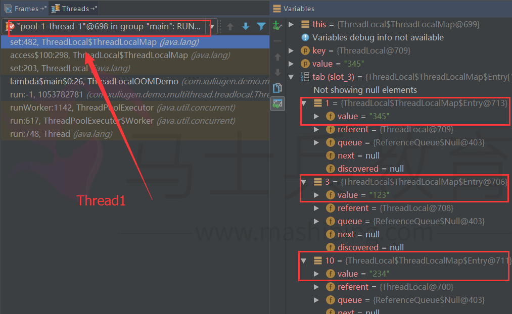

然后更改到Thread2，查看，由于多线程，线程1运行到上图情况，线程2运行到下图情况，也可以看出他们是不同的ThreadLocalMap：

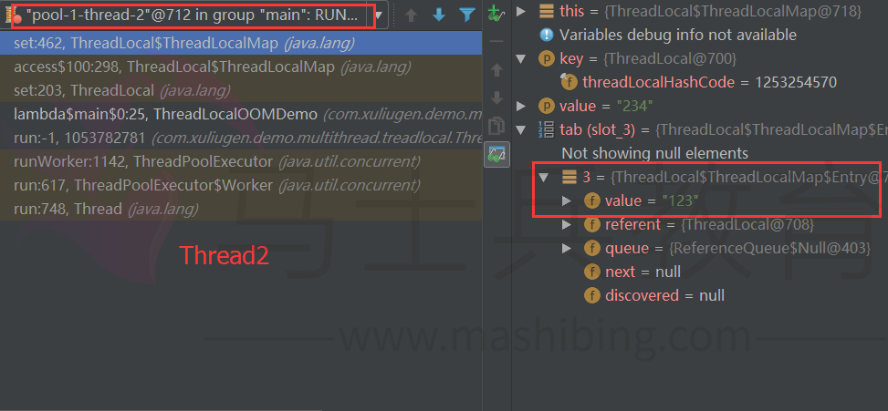

那如果多个线程，只设置一个ThreadLocal变量那，结果可想而知，这里不再赘述！

另外，有一点需要提示一下，代码如下：

```
private static final int THREAD_LOOP_SIZE = 1;
private static final int MOCK_DIB_DATA_LOOP_SIZE = 1000;
private static ThreadLocal<String> threadLocal = new ThreadLocal<>();

ExecutorService executorService = Executors.newFixedThreadPool(THREAD_LOOP_SIZE);

for (int i = 0; i < THREAD_LOOP_SIZE; i++) {
    for (int j = 0; j < MOCK_DIB_DATA_LOOP_SIZE; j++) {
        executorService.execute(() -> threadLocal.set(("123" + index).toString()));
    }
}1234567891011
```

运行结果：

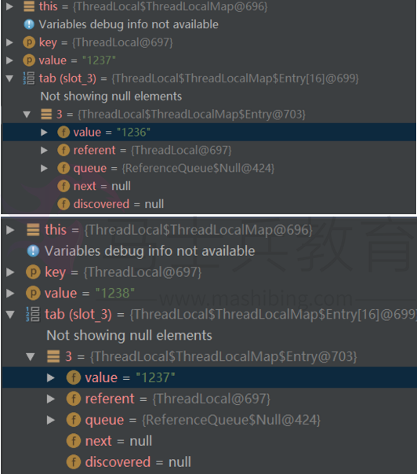

可以看到，在这个线程中的ThreadLocal变量的值始终是只有一个的，即以前的值被覆盖了的！这里是因为Entry对象是以该ThreadLocal变量的引用为key的，所以多次赋值以前的值会被覆盖，特此注意！

到这里应该可以清楚了的了解Thread、ThreadLocal和ThreadLocalMap之间的关系了！

## ThreadLocal的get方法

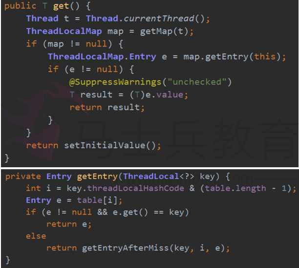

经过上述set方法的分析，对于get方法应该理解起来轻松了许多，首先获取ThreadLocalMap对象，由于ThreadLocalMap使用的当前的ThreadLocal作为key，所以传入的参数为this，然后调用`getEntry（）`方法，通过这个key构造索引，根据索引去table（Entry数组）中去查找线程本地变量，根据下边找到Entry对象，然后判断Entry对象e不为空并且e的引用与传入的key一样则直接返回，如果找不到则调用`getEntryAfterMiss（）`方法。调用`getEntryAfterMiss`表示直接散列到的位置没找到，那么顺着hash表递增（循环）地往下找，从i开始，一直往下找，直到出现空的槽为止。

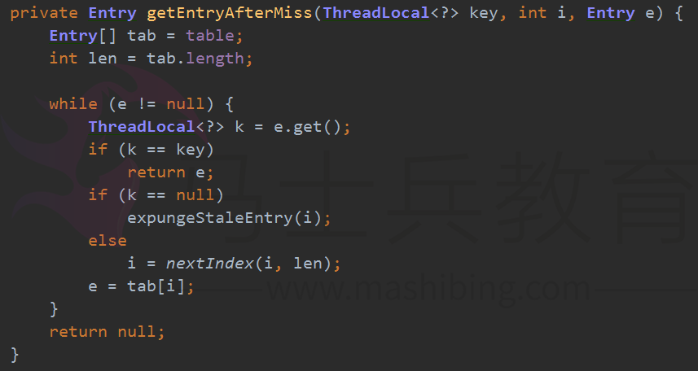

## ThreadLocal的内存回收

ThreadLocal 涉及到的两个层面的内存自动回收：

1）在 ThreadLocal 层面的内存回收：

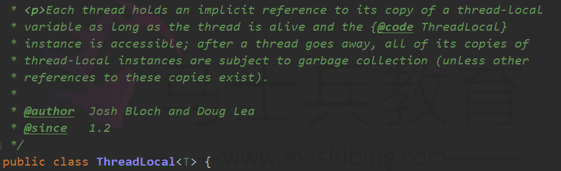

当线程死亡时，那么所有的保存在的线程局部变量就会被回收，其实这里是指线程Thread对象中的 `ThreadLocal.ThreadLocalMap threadLocals` 会被回收，这是显然的。

2）ThreadLocalMap 层面的内存回收：

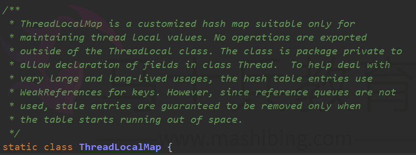

如果线程可以活很长的时间，并且该线程保存的线程局部变量有很多(也就是 Entry 对象很多)，那么就涉及到在线程的生命期内如何回收 ThreadLocalMap 的内存了，不然的话，Entry对象越多，那么ThreadLocalMap 就会越来越大，占用的内存就会越来越多，所以对于已经不需要了的线程局部变量，就应该清理掉其对应的Entry对象。

使用的方式是，Entry对象的key是WeakReference 的包装，当ThreadLocalMap 的 `private Entry[] table`，已经被占用达到了三分之二时 `threshold = 2/3`(也就是线程拥有的局部变量超过了10个) ，就会尝试回收 Entry 对象，我们可以看到 `ThreadLocalMap.set（）`方法中有下面的代码：

```
if (!cleanSomeSlots(i, sz) && sz >= threshold)
       rehash();12
```

cleanSomeSlots 就是进行回收内存：

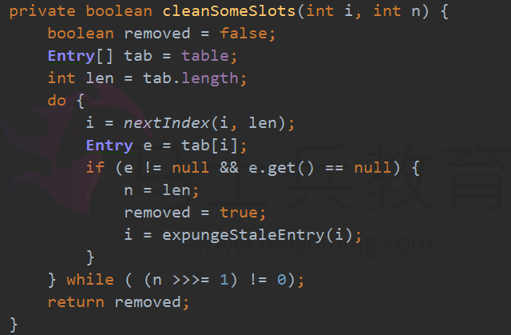

## ThreadLocal可能引起的OOM内存溢出问题简要分析

我们知道ThreadLocal变量是维护在Thread内部的，这样的话只要我们的线程不退出，对象的引用就会一直存在。当线程退出时，Thread类会进行一些清理工作，其中就包含ThreadLocalMap，Thread调用exit方法如下：

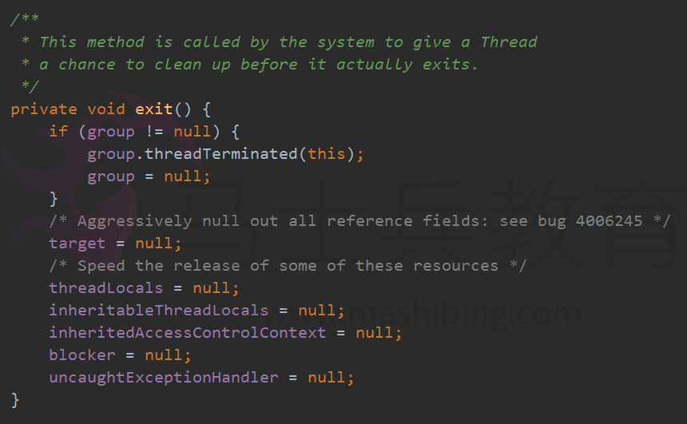

但是，当我们使用线程池的时候，就意味着当前线程未必会退出（比如固定大小的线程池，线程总是存在的）。如果这样的话，将一些很大的对象设置到ThreadLocal中（这个很大的对象实际保存在Thread的threadLocals属性中），这样的话就可能会出现内存溢出的情况。

一种场景就是说如果使用了线程池并且设置了固定的线程，处理一次业务的时候存放到ThreadLocalMap中一个大对象，处理另一个业务的时候，又一个线程存放到ThreadLocalMap中一个大对象，但是这个线程由于是线程池创建的他会一直存在，不会被销毁，这样的话，以前执行业务的时候存放到ThreadLocalMap中的对象可能不会被再次使用，但是由于线程不会被关闭，因此无法释放Thread 中的ThreadLocalMap对象，造成内存溢出。

也就是说，ThreadLocal在没有线程池使用的情况下，正常情况下不会存在内存泄露，但是如果使用了线程池的话，就依赖于线程池的实现，如果线程池不销毁线程的话，那么就会存在内存泄露。所以我们在使用线程池的时候，使用ThreadLocal要格外小心！

## 总结

通过源代码可以看到每个线程都可以独立修改属于自己的副本而不会互相影响，从而隔离了线程和线程.避免了线程访问实例变量发生安全问题. 同时我们也能得出下面的结论：

（1）ThreadLocal只是操作Thread中的ThreadLocalMap对象的集合；

（2）ThreadLocalMap变量属于线程的内部属性，不同的线程拥有完全不同的ThreadLocalMap变量；

（3）线程中的ThreadLocalMap变量的值是在ThreadLocal对象进行set或者get操作时创建的；

（4）使用当前线程的ThreadLocalMap的关键在于使用当前的ThreadLocal的实例作为key来存储value值；

（5） ThreadLocal模式至少从两个方面完成了数据访问隔离，即纵向隔离(线程与线程之间的ThreadLocalMap不同)和横向隔离(不同的ThreadLocal实例之间的互相隔离)；

（6）一个线程中的所有的局部变量其实存储在该线程自己的同一个map属性中；

（7）线程死亡时，线程局部变量会自动回收内存；

（8）线程局部变量时通过一个 Entry 保存在map中，该Entry 的key是一个 WeakReference包装的ThreadLocal, value为线程局部变量，key 到 value 的映射是通过：`ThreadLocal.threadLocalHashCode & (INITIAL_CAPACITY - 1)` 来完成的；

（9）当线程拥有的局部变量超过了容量的2/3(没有扩大容量时是10个)，会涉及到ThreadLocalMap中Entry的回收；

对于多线程资源共享的问题，同步机制采用了“以时间换空间”的方式，而ThreadLocal采用了“以空间换时间”的方式。前者仅提供一份变量，让不同的线程排队访问，而后者为每一个线程都提供了一份变量，因此可以同时访问而互不影响。