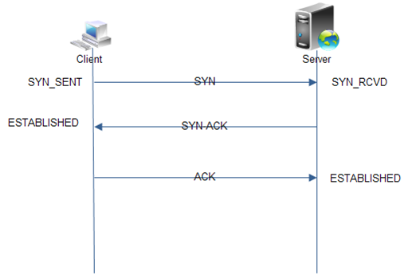
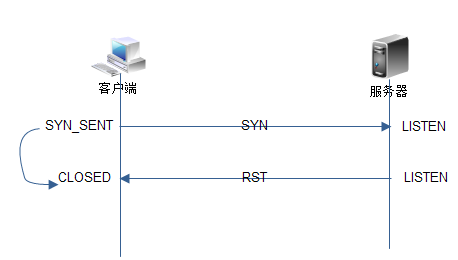
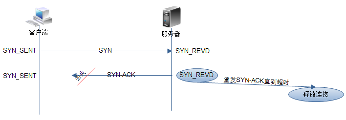
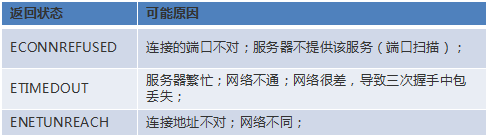
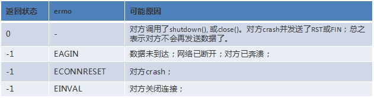
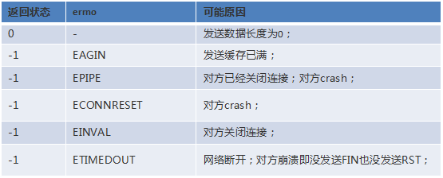

# 深入理解socket网络异常

在各种网络异常情况的背后，TCP是怎么处理的？又是怎样把处理结果反馈给上层应用的？本文就来讨论这个问题。

分为两个场景来讨论

## **建立连接**

### 1 正常情况下

 进过三次握手，客户端连接成功，服务端有一个新连接到来。

### 2 客户端连接了服务端未监听的端口

在这种情况下，服务端会对收到的SYN回应一个RST（RFC 793 3.4），客户端收到RST之后，终止连接，并进入CLOSED状态。

客户端的connect返回ECONNREFUSED 111 /* Connection refused */。

### 3 客户端与服务器之间的网络不通

这又分两种情况

1. connect返回主机不可达
   具体信息在不同系统上不一样，比如linux上的定义是EHOSTUNREACH 113 /* No route to host */。明显给出了一个不可访问的地址（例如，访
   问一个不存在的本地网络地址，或者DNS解析失败会导致这种情况。
2. connect返回连接超时
   这种情况下，客户端发送的SYN丢失在网络中，没有得到确认，客户端的TCP会超时重发SYN。以ubuntu 12.04为例，重发SYN的时间,系列是：
   0,1,3,7,15,31,63(2n-1-1)。即发送7个SYN后等待一个超时时间（例如：127秒），如果在这段时间内仍然没有收到ACK，则connect返回超时。

在这两种情况下， 服务端的状态没有变化，对服务端来讲什么也没发生。

### 4 建立连接的过程中包丢失

三次握手发送的包系列是SYN > SYN-ACK > ACK

1. SYN丢失
   这种情况就是3种的第2种情况。
2. SYN-ACK丢失
   从客户端的角度来讲以前面一种情况类似。从服务端的角度来讲，由LISTEN状态进入SYN_REVD状态。服务端的TCP会重发SYN-ACK，直到超
   时。SYN攻击正是利用这一原理，攻击方伪造大量的SYN包发送到服务器，服务器对收到的SYN包不断回应SYN-ACK，直到超时。这会浪费服务
   器大量的资源，甚至导致奔溃。对服务端的应用层来讲，什么也没有发生。因为TCP只有在经过3次握手之后才回通知应用层，有新的连接到来。
   
3. ACK丢失
   这对服务端来讲与2相同。对于客户端来讲，由SYN_SENT状态进入了ESTABLISED状态，即连接成功了。连接成功后客户端就可以发送数据了。
   但实际上数据是发送不到服务端的（我们假设客户端收到SYN-ACK之后，客户端与服务端之间的网络就断开了），客户端发送出去的数据得不
   到确认，一般重发3次左右就会处于等待ACK的状态（win7）。而ubuntu 12.10下，调用send会返回成功，直到TCP的缓冲被填满（测试环
   境：局域网，感觉这个不是很合理，按照书上所说：应该是使用“指数退避”进行重传 -- TCP/IP协议详解， 大概是我的测试环境中有NAT所致
   吧）。最终，客户端产生一个复位信号并终止连接。返回给应用程序的结果是Connection time out（errno: 110）

## **通信过程**

下面来看看连接建立成功后出现异常情况的处理

### 1 客户端与服务器的网络断开，双方不再发送数据

  这样，双方都不知道网络已经不通，会一直保持ESTABLISHDED状态，除非打开了SO_KEEPALIVE选项。

### 2 网络断开，一方给另一方发送数据

这种情况下，接收一方不知道网络出问题，会一直等待数据到来。

对于发送方，理论上的情况是，重传一定次数后，返回连接超时。

不过实际，很可能是这样的情况，发送方显示发送数据成功（send返回发送的数据长度），但实际接收方还没有接收到数据。

对于已经发送成功的数据有3种可能情况：

1 在本机的TCP缓存中

2 在网络上的某个NAT的缓存中

3 对方已经成功接收到

在实验的过程中发现，即使网络断开了，发送方仍然收到了对数据的ACK（在有NAT的情况下），猜测是NAT把数据缓存起来并发送了ACK。

当网络恢复时，那些被缓存的数据会被发送到接收方。鉴于这样的结果，给我们一个提示：不能依赖于TCP的可靠性，认为我发送成功的数据，对方一
定能收到。

TCP可以保证可靠、有序的传输，这意思是说保证收到的数据时有序正确的，并没有说已经发送成功的数据，对方一定就收到了。

在ubuntu 12.10上，发送方一直在发送数据，直到缓冲区满。而在win7下，重发3次就会停止，进入等待ACK状态。

解决的办法是：应用层对数据是否接收完成进行确认（需要的时候）。

### 3 网络断开，一方等待着另一方发送数据

这种情况下，等待数据的一方将一直等待下去。接收方无法直接知道网络已经断开，一般是设置一个超时时间，超时时间到就判断为网络已断开。发送
数据的一方的反应如2所述。

### 4 一方crash，另一方继续发送/接收数据

 这依赖于TCP协议栈对crash的反应。与系统相关性很大 例如：

 在windows下：按ctrl+c结束程序，会发送RST段。而在linux下，按ctrl+c结束程序，会调用close。

 在wind7下，如果没有调用close而结束程序，TCP会发送RST。而Ubuntu12.10上，则会发送FIN段。

1.  crash的一端发送FIN，相当于调用了close
   没有crash的一端接收数据
   具体的反应与系统有关
   例如linux 3.8.0-29-generic调用recv返回-1，errno被设置为22， Invalid argument，而linux3.3.6-030306-generic调用recv返回0.
   在TCP内部，调用recv时，发送FIN，终止连接(Linux)。
   windows情况以此不同，recv返回0，表示对方调用了shutdown。TCP内部发送一个RST。

   但共同点是recv都会立即返回失败。
   没有crash的一端发送数据
   第一次调用send返回成功，数据会被发送到crash的一端，crash的一端会回应一个RST，再次调用send返回-1， errno被设置为32， 
   Broken pipe。 注意：这会向应用程序发送SIGPIPE信号，你的程序会莫名其妙退出。这是因为程序对SIGPIPE的默认处理就是结束程序。
   这是编写服务器程序是最需要注意的一个问题。最简单的处理方法是忽略该信号 -- signal(SIGPIPE,SIG_IGN);
   windows下行为是一样的， 不同的是返回的错误是10053 - WSAECONNABORTED， 由于软件错误，造成一个已经建立的连
   接被取消。

   共同点第一次send成功，之后就出错。

2. crash的一端发送RST
   没有crash的一端接收数据
   调用recv返回-1，errno被设置为104， Connection reset by peer。在TCP内部，当收到RST时，把错误号设为ECONNRESET。
   没有crash的一端发送数据
   调用send返回-1，errno被设置为104， Connection reset by peer。在TCP内部，当收到RST时，把错误号设为ECONNRESET

   

3. crash的一端即没发送FIN也没发送RST
   没有crash的一端接收数据
   调用recv会一直阻塞等待数据到来
   没有crash的一端发送数据
   重传一定次数后，返回connection time out。

5 一端关闭连接

  这种情况与一端crash并发送FIN 的情况相同，参看4.1

## 总结  

上面分析的目的是：当程序出现网络异常时，能够知道问题的原因在哪？

作为开发者，我们主要关心应用层面的返回状态。一般出错的地方是调用connect, recv, send的时候。

下面做一个总结

connect函数返回状态及其原因

recv函数返回状态及其原因

send函数返回状态及其原因

各种不同步的状态，都是通过发送RST来恢复的，理解这些状况的关键在于理解何时产生RST，以及在各种状态下，对RST段如何处理。