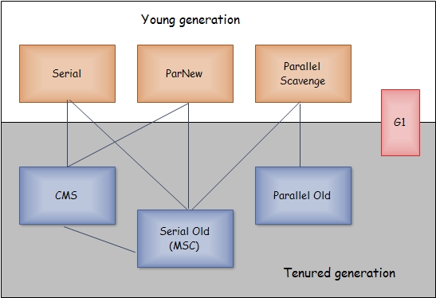

# 管中窥豹——从对象的生命周期梳理JVM内存结构、GC、类加载、AOP编程及性能监控

如题，本文的宗旨既是透过对象的生命周期，来梳理JVM内存结构及GC相关知识，并辅以AOP及双亲委派机制原理，学习不仅仅是海绵式的吸收学习，还需要自己去分析why，加深对技术的理解和认知，祝大家早日走上自己的“成金之路”。

------

## Java对象的创建

本部分，从攻城狮编写.java文件入手，详解了编译、载入、AOP原理。
读过《程序员的自我修养》的朋友，对程序的编译及执行会有一个很清晰的认识：编译其实就是将人类能理解的代码文件转译为机器/CPU能执行的文件(包括数据段、代码段)，而执行的过程，则是根据文件头部字节的标识(简称魔数)，映射为对应的文件结构体，找到程序入口，当获取到CPU执行权限时，将方法压栈，执行对应的指令码，完成相应的逻辑操作。
而对应.java文件，则先需要使用javac进行编译，编译后的.class文件，此文件将java程序能读懂的数据段和代码段，之后用java执行文件，既是载入.class文件，找到程序入口，并根据要执行的方法，不停的压栈、出栈，进行逻辑处理。

## class文件载入过程

### 加载

在加载阶段，虚拟机需要完成以下三件事情：

> - 通过一个类的全限定名来获取其定义的二进制字节流。
> - 将这个字节流所代表的静态存储结构转化为方法区的运行时数据结构。
> - 在Java堆中生成一个代表这个类的java.lang.Class对象，作为对方法区中这些数据的访问入口。

**即相当于在内存中将代码段和数据段关联起来，组织好Class对象的内存空间，作为对象成员和方法的引入入口，并将.class及方法载入Perm内存区。**相对于类加载的其他阶段而言，加载阶段（准确地说，是加载阶段获取类的二进制字节流的动作）是可控性最强的阶段，因为开发人员既可以使用系统提供的类加载器来完成加载，也可以自定义自己的类加载器来完成加载。

### 连接

分为四个阶段：

- 第一阶段是验证，确保被加载的类的正确性。

> 这一阶段的目的是为了确保Class文件的字节流中包含的信息符合当前虚拟机的要求，并且不会危害虚拟机自身的安全。验证阶段大致会完成4个阶段的检验动作：
> ***文件格式验证***验证字节流是否符合Class文件格式的规范；例如：是否以0xCAFEBABE开头、主次版本号是否在当前虚拟机的处理范围之内、常量池中的常量是否有不被支持的类型。
> ***元数据验证***对字节码描述的信息进行语义分析（注意：对比javac编译阶段的语义分析），以保证其描述的信息符合Java语言规范的要求；例如：这个类是否有父类，除了java.lang.Object之外。
> ***字节码验证***通过数据流和控制流分析，确定程序语义是合法的、符合逻辑的。
> ***符号引用验证***确保解析动作能正确执行。

> 验证阶段是非常重要的，但不是必须的，它对程序运行期没有影响，如果所引用的类经过反复验证，那么可以考虑采用***-Xverifynone参数来关闭大部分的类验证措施***，以缩短虚拟机类加载的时间。

- 第二阶段是准备：为类的静态变量分配内存，并将其初始化为默认值

> 准备阶段是正式为类变量分配内存并设置类变量初始值的阶段，这些内存都将在方法区中分配。对于该阶段有以下几点需要注意：
> 1、这时候进行内存分配的仅包括***类变量（static）***，而不包括实例变量，实例变量会在对象实例化时随着对象一块分配在Java堆中。

> 2、这里所设置的初始值通常情况下是数据类型***默认的零值***（如0、0L、null、false等），而不是被在Java代码中被显式地赋予的值。如public static int value = 3；那么变量value在准备阶段过后的初始值为0，而不是3，因为这时候尚***未开始执行任何Java方法***，而把value赋值为3的putstatic指令是在程序编译后，存放于类构造器()方法之中的，所以把value赋值为3的动作将在***初始化阶段才会执行***。这里还需要注意如下几点：
> i.对基本数据类型来说，对于类变量（static）和全局变量，如果不显式地对其赋值而直接使用，则系统会为其赋予默认的零值，而对于***局部变量来说，在使用前必须显式地为其赋值***，否则编译时不通过。
> ii.对于同时被static和final修饰的常量，必须在声明的时候就为其显式地赋值，否则编译时不通过；而只被final修饰的常量则既可以在声明时显式地为其赋值，也可以在类初始化时显式地为其赋值，总之，在使用前必须为其显式地赋值，***系统不会为final修饰的常量赋予默认零值***。
> iii.对于***引用数据类型*** reference来说，如数组引用、对象引用等，如果没有对其进行显式地赋值而直接使用，系统都会为其赋予默认的零值，即null。
> iv.如果在***数组***初始化时没有对数组中的各元素赋值，那么其中的元素将根据对应的数据类型而被赋予默认的零值。

> 3、如果类字段的字段属性表中存在***ConstantValue属性***，即同时被final和static修饰，那么在准备阶段变量value就会被初始化为ConstValue属性所指定的值。如public static final int value = 3；编译时Javac将会为value生成ConstantValue属性，在准备阶段虚拟机就会根据ConstantValue的设置将value赋值为3。

- 第三阶段是解析:把类中的符号引用转换为直接引用

> 解析阶段是虚拟机将常量池内的***符号引用替换为直接引用***的过程，解析动作主要针对类或接口、字段、类方法、接口方法、方法类型、方法句柄和调用点限定符7类符号引用进行。符号引用就是一组符号来描述目标，可以是任何字面量。
> 直接引用就是直接指向目标的指针、相对偏移量或一个间接定位到目标的句柄。

这个阶段的主要目的将编译后的虚拟地址(类似动态库，库数据段都是0x00开始，载入内存后需要与实际分配的地址关联起来)与实际运行的地址关联起来。

- 第四阶段是初始化，为类的静态变量赋予正确的初始值，JVM负责对类进行初始化，主要对类变量进行初始化，包括给声明类变量指定初始值，和为类static变量指定静态代码块地址。

> 1、假如这个类还没有被加载和连接，则程序先加载并连接该类
> 2、假如该类的直接父类还没有被初始化，则先初始化其直接父类
> 3、假如类中有初始化语句，则系统依次执行这些初始化语句

> 类初始化时机：只有当对类的主动使用的时候才会导致类的初始化，类的主动使用包括以下六种：
> – 创建类的实例，也就是new的方式
> – 访问某个类或接口的静态变量，或者对该静态变量赋值
> – 调用类的静态方法
> – 反射（如Class.forName(“com.xxx.Test”)）
> – 初始化某个类的子类，则其父类也会被初始化
> – Java虚拟机启动时被标明为启动类的类（Java Test），直接使用java.exe命令来运行某个主类。

### 拓展：双亲委派机制与AOP面向切面编程原理

> 

JVM最底层的载入是BootstrapClassLoader，为C语言编写，从Java中引用不到，其上是ExtClassLoader，然后是AppClassLoader，普通类中getContextClassLoader()得到的是AppClassLoader，getContextClassLoader().getParent()得到的是ExtClassLoader，而再往上getParent()为null，即引用不到BootstrapLoader。

> ***启动类加载器：BootstrapClassLoader***，负责加载存放在JDK\jre\lib(JDK代表JDK的安装目录，下同)下，或被-Xbootclasspath参数指定的路径中的，并且能被虚拟机识别的类库（如rt.jar，所有的java.*开头的类均被BootstrapClassLoader加载）。启动类加载器是无法被Java程序直接引用的。

> ***扩展类加载器：ExtensionClassLoader***，该加载器由sun.misc.Launcher$ExtClassLoader实现，它负责加载DK\jre\lib\ext目录中，或者由java.ext.dirs系统变量指定的路径中的所有类库（如javax.*开头的类），开发者可以直接使用扩展类加载器。

> ***应用程序类加载器：ApplicationClassLoader***，该类加载器由sun.misc.Launcher$AppClassLoader来实现，它负责加载用户类路径（ClassPath）所指定的类，开发者可以直接使用该类加载器，如果应用程序中没有自定义过自己的类加载器，一般情况下这个就是程序中默认的类加载器。

> 应用程序都是由这三种类加载器**互相配合进行加载**的，如果有必要，我们还可以加入自定义的类加载器。因为JVM自带的ClassLoader只是懂得从本地文件系统加载标准的java class文件，因此如果编写了自己的ClassLoader，便可以做到如下几点：
> 1）在执行非置信代码之前，自动验证数字签名。
> 2）动态地创建符合用户特定需要的定制化构建类。
> 3）从特定的场所取得java class，例如数据库中和网络中。

> **双亲委派机制**
> 简单来说既是先拿父类加载器加载class，父类加载失败后再使用本类加载器加载。当AppClassLoader加载一个class时，它首先不会自己去尝试加载这个类，而是把类加载请求委派给父类加载器ExtClassLoader去完成。当ExtClassLoader加载一个class时，它首先也不会自己去尝试加载这个类，而是把类加载请求委派给BootStrapClassLoader去完成。如果BootStrapClassLoader加载失败（例如在$JAVA_HOME/jre/lib里未查找到该class），会使用ExtClassLoader来尝试加载；若ExtClassLoader也加载失败，则会使用AppClassLoader来加载，如果AppClassLoader也加载失败，则会报出异常ClassNotFoundException。

> ***其它相关点***
> 1.全盘负责，当一个类加载器负责加载某个Class时，该Class所依赖的和引用的其他Class也将由该类加载器负责载入，除非显示使用另外一个类加载器来载入。
> 2.父类委托，先让父类加载器试图加载该类，只有在父类加载器无法加载该类时，才使用本类加载器从自己的类路径中加载该类。
> 3.缓存机制，缓存机制将会保证所有加载过的Class都会被缓存，当程序中需要使用某个Class时，类加载器先从缓存区寻找该Class，只有缓存区不存在，系统才会读取该类对应的二进制数据，并将其转换成Class对象，存入缓存区。这就是为什么修改了Class后，必须重启JVM，程序的修改才会生效。

\--

> **AOP面向切面编程**
> AOP 专门用于处理系统中分布于各个模块（不同方法）中的交叉关注点的问题，在 Java EE 应用中，常常通过AOP来处理一些具有横切性质的系统级服务，如事务管理、安全检查、缓存、对象池管理等，在不改变已有代码的情况下，静态/动态的插入代码。

> 将AOP放到这里的主要原因是因为AOP改变的class文件，达到嵌入方法的目的，***静态模式***使用AspectJ进行由.java到.class文件编译。而***动态模式***时使用CGLIB载入使用javac编译的.class文件后，使用动态代理的方式，将要执行的方法嵌入到原有class方法中，完成在内存中对class对象的构造，这也就是所谓***动态代理技术***的内在原理。同时静态方式在载入前已经修好完.class文件，而动态方式在.class载入时需要做额外的处理，导致性能受到一定影响，但其优势是无须使用额外的编译器。总体的技术的切入点在于在修改机器执行码，达到增加执行方法的目的。

### 对象创建及方法调用

***数据分类***：基本类型与引用类型

> 基本类型包括：byte,short,int,long,char,float,double,boolean,returnAddress
> 引用类型包括：类类型，接口类型和数组。

***数据存储***：使用堆存储对象信息

***方法调用***：使用栈来解决方法嵌套调用，而栈内部由一个个栈帧构成，调用一个方法时，在当前栈上压入一个栈帧，此栈帧包含局部变量表，操作栈等子项，每一个方法被调用直至执行完成的过程，就对应着一个栈帧在虚拟机栈中从入栈到出栈的过程。表面上代码在运行时，是通过程序计数器不断执行下一条指令；而实际指令运算等操作是通过控制操作栈的操作数入栈和出栈，将操作数在局部变量表和操作栈之间转移。

> 这里对内存的分配做个深入的扩展，解释下基础类型的***自动装箱*** boxing
> 以"Object obj = new Object();"为例，一个空Object对象占用8byte空间，而obj引用占用4byte，此条语句执行后共占用12byte；而Java中***对象大小是8的整数倍***，则Boolean b = new Boolean(true)至少需要20byte(16byte+4byte)，而如果直接使用基本数据类型boolean b = true则仅仅需要1byte，在栈帧中存储；为优化此问题，JVM提出了基本类型的自动装载技术，来自动化进行基本类型与基本类型对象间的转换，来降低内存的使用量。

### 内存集中管理(模型及GC机制)

- JVM内存模型图如下

> 内存结构主要有三大块：堆内存、方法区和栈。
> 1.***堆内存***是JVM中最大的一块由Young Generation(年轻代、新生代)和Old Generation(年老代)组成，而Young Generation内存又被分成三部分，Eden空间、From Survivor空间、To Survivor空间，默认情况下年轻代按照8:1:1的比例来分配。
> 2.***方法区***存储类信息、常量、静态变量等数据，是线程共享的区域，为与Java堆区分，方法区还有一个别名Non-Heap(非堆)。
> 3.***栈***又分为java虚拟机栈(方法执行的内存区，每个方法执行时会在虚拟机栈中创建栈帧)和本地方法栈(虚拟机的Native方法执行的内存区)主要用于方法的执行。
> 4.内存设置参数：
> -Xms设置堆的最小空间大小。
> -Xmx设置堆的最大空间大小。
> -XX:NewSize设置新生代最小空间大小。
> -XX:MaxNewSize设置新生代最大空间大小。
> -XX:PermSize设置永久代最小空间大小。
> -XX:MaxPermSize设置永久代最大空间大小。
> -Xss设置每个线程的堆栈大小。
> -XX:SurvivorRatio=x #Eden区与Survivor区的大小比值，默认为8(Eden:From-Survivor=8:1)
> -XX:NewRatio=x #年轻代(包括Eden和两个Survivor区)与年老代的比值(除去持久代)默认值为2，即年轻代:年老代=1:2(这里与数学的比值有差异)

- Minor GC

对象分配先从Eden空间与From Survivor空间获取内存，当两者中空间不足时，进行Minor GC，将Eden与From Survivor空间存活的对象，Copy到To Survivor空间，然后清空Eden与From Survivor空间，之后将To Survivor空间对象年龄加1，并将To Survivor空间设置为From Survivor空间，保证Minor GC时To Survivor空间始终为空；而当对象年龄为15后(默认是 15，可以通过参数-XX:MaxTenuringThreshold 来设定)，将存活对象放入老年代。

**例外情况**：
1.对于一些***较大的对象(***即需要分配一块较大的连续内存空间)则是直接进入到老年代。虚拟机提供了一个-XX:PretenureSizeThreshold参数，令大于这个设置值的对象直接在老年代分配。避免在新生代采用复制算法收集内存时，在Eden区及两个Survivor区之间发生大量的内存复制。
2.为了更好的适应不同的程序，虚拟机并不是永远地要求对象的年龄必须达到了MaxTenuringThreshold才能晋升老年代，如果在Survivor空间中***相同年龄所有对象大小的总和大于Survivor空间的一半***，年龄大于或等于该年龄的对象可以直接进入Old Generation，无需等到MaxTenuringThreshold中要求的年龄。

> 这里的疑问，按照默认的8:1:1设置，一个To Survivor空间占10%空间，每次Minor GC能保证To Survivor空间够用吗？IBM的研究表明，98%的对象都是很快消亡的，大部分的对象在创建后很快就不再使用。这里可以根据GC detail来查看和分析比例设置是否合理。

- Full GC

***工作***：同时回收年轻代、年老代，按照配置的不同算法进行回收。
***时机***：在Minor GC触发时，会检测之前每次晋升到老年代的***平均大小***是否大于老年代的剩余空间，如果大于，改为直接进行一次Full GC；如果小于则查看HandlePromotionFailure设置(是否允许担保，使用Old Gerneration空间担保)，如果允许，那仍然进行Minor GC，如果不允许，则也要改为进行一次Full GC。
取平均值进行比较其实仍然是一种动态概率的手段，也就是说如果某次Minor GC存活后的对象突增，大大高于平均值的话，依然会导致担保失败，这样就只好在失败后重新进行一次Full GC。

### 回收算法

首先判断对象是否存活，一般有两种方式：

> - 引用计数：每个对象有一个引用计数属性，新增一个引用时计数加1，引用释放时计数减1，计数为0时可以回收。此方法简单，无法解决对象相互循环引用的问题。
> - 可达性分析（Reachability Analysis）：从GC Roots开始向下搜索，搜索所走过的路径称为引用链。当一个对象到GC Roots没有任何引用链相连时，则证明此对象是不可用的、不可达对象。

在Java语言中，GC Roots包括：
--虚拟机栈中引用的对象。
--方法区中类静态属性实体引用的对象。
--方法区中常量引用的对象。
--本地方法栈中JNI引用的对象。

**标记-清除算法**:首先标记出所有需要回收的对象，在标记完成后统一回收掉所有被标记的对象。之所以说它是最基础的收集算法，是因为后续的收集算法都是基于这种思路并对其缺点进行改进而得到的。
*缺点*：一个是**效率**问题，标记和清除过程的效率都不高；另外一个是**空间**问题，标记清除之后会产生大量不连续的内存碎片，空间碎片太多可能会导致，当程序在以后的运行过程中需要分配较大对象时无法找到足够的连续内存而不得不提前触发另一次垃圾收集动作。

**复制算法**：对**空间**问题的改进，它将可用内存按容量划分为大小相等的两块，每次只使用其中的一块。当这一块的内存用完了，就将还存活着的对象复制到另外一块上面，然后再把已使用过的内存空间一次清理掉。
*缺点*是这种算法的代价是将内存缩小为原来的一半，持续复制长生存期的对象则导致效率降低。如果不想浪费50%的空间，就需要有额外的空间进行分配担保(HandlePromotionFailure设置为true)，以应对被使用的内存中所有对象都100%存活的极端情况，所以在老年代一般不能直接选用这种算法。

**标记-压缩/整理算法**：对复制算法在老年代上的改进，标记过程仍然与“标记-清除”算法一样，但后续步骤不是直接对可回收对象进行清理，而是让所有存活的对象都向一端移动，然后直接清理掉端边界以外的内存。

**分代收集算法**：把Java堆分为新生代和老年代，这样就可以根据各个年代的特点采用最适当的收集算法。
在***新生代***中，每次垃圾收集时都发现有大批对象死去，只有少量存活，那就选用复制算法，只需要付出少量存活对象的复制成本就可以完成收集。
而***老年代***中，因为对象存活率高、没有额外空间对它进行分配担保，就必须使用“标记-清理”或“标记-整理”算法来进行回收。

### 回收器

#### 新生代收集器

- Serial收集器

> 串行收集器是最古老，最稳定以及效率高的收集器，使用停止复制方法，只使用一个线程去串行回收；***垃圾收集的过程中会Stop The World***（服务暂停）；
> 参数控制：使用-XX:+UseSerialGC可以使用Serial+Serial Old模式运行进行内存回收（这也是虚拟机在Client模式下运行的默认值）
> ***缺点***是串行效率较低

- ParNew收集器

> ParNew收集器其实就是Serial收集器的***多线程版本***，使用停止复制方法。新生代***并行***，其它工作线程暂停。
> 参数控制：使用-XX:+UseParNewGC开关来控制使用ParNew+Serial Old收集器组合收集内存；使用-XX:ParallelGCThreads来设置执行内存回收的线程数。

- Parallel收集器

> Parallel Scavenge收集器类似ParNew收集器，***Parallel收集器更关注CPU吞吐量，即运行用户代码的时间/总时间***，使用停止复制算法。可以通过参数来打开自适应调节策略，虚拟机会根据当前系统的运行情况收集性能监控信息，动态调整这些参数以提供最合适的停顿时间或最大的吞吐量；也可以通过参数控制GC的时间不大于多少毫秒或者比例。

> 参数控制：使用-XX:+UseParallelGC开关控制使用Parallel Scavenge+Serial Old收集器组合回收垃圾（这也是在Server模式下的默认值）；使用-XX:GCTimeRatio来设置用户执行时间占总时间的比例，默认99，即1%的时间用来进行垃圾回收。使用-XX:MaxGCPauseMillis设置GC的最大停顿时间（这个参数只对Parallel Scavenge有效），用开关参数-XX:+UseAdaptiveSizePolicy可以进行动态控制，如自动调整Eden/Survivor比例，老年代对象年龄，新生代大小等，这个参数在ParNew下没有。

#### 老年代收集器

- Serial Old收集器：老年代收集器，单线程收集器，串行，使用"标记-整理"算法（整理的方法是Sweep（清理）和Compact（压缩），
- Parallel Old 收集器

> 多线程机制与Parallel Scavenge差不错，使用标记整理（与Serial Old不同，这里的整理是Summary（汇总）和Compact（压缩），汇总的意思就是将幸存的对象复制到预先准备好的区域，而不是像Sweep（清理）那样清理废弃的对象）算法，在Parallel Old执行时，仍然需要暂停其它线程。Parallel Old在多核计算中很有用。这个收集器是在JDK 1.6中，与Parallel Scavenge配合有很好的效果。

> 参数控制： 使用-XX:+UseParallelOldGC开关控制使用Parallel Scavenge +Parallel Old组合收集器进行收集。

- CMS收集器：老年代收集器（新生代使用ParNew）

> CMS（Concurrent Mark Sweep）收集器是一种以获取最短回收停顿时间为目标的收集器。目前很大一部分的Java应用都集中在互联网站或B/S系统的服务端上，这类应用尤其重视服务的响应速度，希望系统停顿时间最短，以给用户带来较好的体验。
> 从名字（包含“Mark Sweep”）上就可以看出CMS收集器是基于“标记-清除”算法实现的，它的运作过程相对于前面几种收集器来说要更复杂一些，整个过程分为6个步骤，其中***初始标记***、***重新标记***这两个步骤仍然需要“Stop The World”，包括：

1. 初始标记(CMS-initial-mark)：为了收集应用程序的对象引用需要暂停应用程序线程，该阶段完成后，应用程序线程再次启动。
2. 并发标记(CMS-concurrent-mark)：从第一阶段收集到的对象引用开始，遍历所有其他的对象引用，此阶段会打印2条日志：CMS-concurrent-mark-start，CMS-concurrent-mark。
3. 并发预清理(CMS-concurrent-preclean)：改变当运行第二阶段时，由应用程序线程产生的对象引用，以更新第二阶段的结果。 此阶段会打印2条日志：CMS-concurrent-preclean-start，CMS-concurrent-preclean。
4. 下一阶段是CMS-concurrent-abortable-preclean阶段，加入此阶段的目的是使cms gc更加可控一些，作用也是执行一些预清理，以减少Rescan阶段造成应用暂停的时间.
   通过两个参数来来控制是否进行下一阶段：
   -XX:CMSScheduleRemarkEdenSizeThreshold（默认2M）：即当eden使用小于此值时；
   -XX:CMSScheduleRemarkEdenPenetratio（默认50%）：当Eden区占用比例此比例时
   在concurrent preclean阶段之后，如果Eden占用率高于CMSScheduleRemarkEdenSizeThreshold，开启'concurrent abortable preclean'，并且持续的precleanig直到Eden占比超过CMSScheduleRemarkEdenPenetratio，之后，开启remark阶段，
   另外，-XX:CMSMaxAbortablePrecleanTime：当abortable-preclean阶段执行达到这个时间时会结束进入下一阶段。
5. 重标记CMS-concurrent-remark：由于上面三阶段是并发的，对象引用可能会发生进一步改变。因此，应用程序线程会再一次被暂停以更新这些变化，并且在进行实际的清理之前确保一个正确的对象引用视图。这一阶段十分重要，因为必须避免收集到仍被引用的对象。
6. 并发清理CMS-concurrent-sweep：所有不再被应用的对象将从堆里清除掉。
7. 并发重置CMS-concurrent-reset：收集器做一些收尾的工作，以便下一次GC周期能有一个干净的状态。
   尽管CMS收集器为老年代垃圾回收提供了几乎完全并发的解决方案，然而年轻代仍然通过“stop-the-world”方法来进行收集。对于交互式应用，停顿也是可接受的，背后的原理是年轻带的垃圾回收时间通常是相当短的。

**优点**：并发收集、低停顿
**缺点**：产生大量空间碎片、并发阶段会降低吞吐量

> - 堆碎片：CMS收集器并没有任何碎片整理的机制，可能出现总的堆大小远没有耗尽，但因为没有足够连续的空间却不能分配对象，只能触发Full GC来解决，造成应用停顿。

- 对象分配率高：如果获取对象实例的频率高于收集器清除堆里死对象的频率，并发算法将再次失败，从某种程度上说，老年代将没有足够的可用空间来容纳一个从年轻代提升过来的对象。经常被证实是老年代有大量不必要的对象。一个可行的办法就是增加***年轻代的堆大小***，以防止年轻代短生命的对象提前进入老年代。另一个办法就似乎利用分析器，快照运行系统的堆转储，并且***分析过度的对象分配***，找出这些对象，最终减少这些对象的申请。

**参数控制**

> -XX:+UseConcMarkSweepGC 使用CMS收集器
> 当使用-XX：+UseConcMarkSweepGC时，-XX：UseParNewGC会自动开启。因此，如果年轻代的并行GC不想开启，可以通过设置-XX：-UseParNewGC来关掉
> -XX:+CMSClassUnloadingEnabled相对于并行收集器，CMS收集器默认不会对永久代进行垃圾回收。
> -XX:+CMSConcurrentMTEnabled当该标志被启用时，并发的CMS阶段将以多线程执行(因此，多个GC线程会与所有的应用程序线程并行工作)。该标志已经默认开启，如果顺序执行更好，这取决于所使用的硬件，多线程执行可以通过-XX:-CMSConcurremntMTEnabled禁用(注意是-号)。
> -XX:+UseCMSCompactAtFullCollection Full GC后，进行一次碎片整理；整理过程是独占的，会引起停顿时间变长
> -XX:+CMSFullGCsBeforeCompaction 设置进行几次Full GC后，进行一次碎片整理
> -XX:ParallelCMSThreads 设定CMS的线程数量（一般情况约等于可用CPU数量）
> -XX:CMSMaxAbortablePrecleanTime：当abortable-preclean阶段执行达到这个时间时才会结束

> -XX:CMSInitiatingOccupancyFraction，-XX:+UseCMSInitiatingOccupancyOnly来决定什么时间开始垃圾收集；如果设置了***-XX:+UseCMSInitiatingOccupancyOnly***，那么只有当old代占用确实达到了-XX:CMSInitiatingOccupancyFraction参数所设定的比例时才会触发cms gc；如果没有设置-XX:+UseCMSInitiatingOccupancyOnly，那么系统会根据统计数据自行决定什么时候触发cms gc；因此有时会遇到设置了80%比例才cms gc，但是50%时就已经触发了，就是因为这个参数没有设置的原因.

#### G1收集器

G1 GC是Jdk7的新特性之一、Jdk7+版本都可以自主配置G1作为JVM GC选项；作为JVM GC算法的一次重大升级、DK7u后G1已相对稳定、且未来计划替代CMS。
不同于其他的分代回收算法、G1将堆空间划分成了互相独立的区块。每块区域既有可能属于O区、也有可能是Y区，且每类区域空间可以是不连续的（***对比CMS的O区和Y区都必须是连续的***）。区别如下：

> 1. G1在压缩空间方面有优势

1. G1通过将内存空间分成区域（Region）的方式避免内存碎片问题
2. Eden, Survivor, Old区不再固定、在内存使用效率上来说更灵活
3. G1可以通过设置预期停顿时间（Pause Time）来控制垃圾收集时间避免应用雪崩现象
4. G1在回收内存后会马上同时做合并空闲内存的工作、而CMS默认是在STW（stop the world）的时候做
5. G1会在Young GC中使用、而CMS只能在O区使用

就目前而言、CMS还是默认首选的GC策略、可能在以下场景下G1更适合：

> 1. 大量内存的系统提供一个保证GC低延迟的解决方案，也就是说堆内存在6GB及以上，稳定和可预测的暂停时间小于0.5秒。

1. Full GC 次数太频繁或者消耗时间太长
2. 应用在运行过程中会产生大量内存碎片、需要经常压缩空间
3. 想要更可控、可预期的GC停顿周期；防止高并发下应用雪崩现象
4. 对象分配的频率或代数提升(promotion)显著变化
5. 受够了太长的垃圾回收或内存整理时间(超过0.5~1秒)
   注意: 如果正在使用CMS或ParallelOldGC，而应用程序的垃圾收集停顿时间并不长，那么建议继续使用现在的垃圾收集器。使用最新的JDK时，并不要求切换到G1收集器。

- 内存模型：

> G1堆由多个区（region）组成，每个区大小1M~32M，逻辑上区有3种类型，包括（Eden、Survivor、Old），按分代划分包括：年轻代（Young Generation）和老年代（Old Generation）。

> 如果从 ParallelOldGC 或者 CMS收集器迁移到 G1，可能会看到JVM进程占用更多的内存(a larger JVM process size)。 这在很大程度上与 “accounting” 数据结构有关，如 Remembered Sets 和 Collection Sets。
> Remembered Sets 简称 RSets。跟踪指向某个heap区内的对象引用。 堆内存中的每个区都有一个 RSet。 RSet 使heap区能并行独立地进行垃圾集合。 RSets的总体影响小于5%。
> Collection Sets 简称 CSets。收集集合, 在一次GC中将执行垃圾回收的heap区。GC时在CSet中的所有存活数据(live data)都会被转移(复制/移动)。集合中的heap区可以是 Eden, survivor, 和/或 old generation。CSets所占用的JVM内存小于1%。

- Young GC

> Young GC是stop-the-world活动，会导致整个应用线程的停止。其过程如下：

1. 新对象进入Eden区
2. 存活对象拷贝到Survivor区；
3. 存活时间达到年龄阈值时，对象晋升到Old区。
   young gc是多线程并行执行的。

- Old GC阶段描述为：

> 1. 初始化标记(stop_the_world事件)：这是一个stop_the_world的过程，是随着年轻代GC做的，标记survivor区域(根区域),这些区域可能含有对老年代对象的引用。

1. 根区域扫描：扫描survivor区域中对老年代的引用，这个过程和应用程序一起执行的，这个阶段必须在年轻代GC发生之前完成。
2. 并发标记：查找整个堆中存活的对象，这也是和应用程序一起执行的。这个阶段可以被年轻代的垃圾收集打断。
3. 重新标记(stop-the-world事件)：完成堆内存活对象的标记。使用了一个叫开始前快照snapshot-at-the-beginning (SATB)的算法，这个会比CMS collector使用的算法快。
4. 清理(stop-the-world事件，并且是并发的)：对存活的对象和完全空的区域进行统计(stop-the-world)、刷新Remembered Sets(stop-the-world)、重置空的区域，把他们放到free列表(并发)(译者注：大体意思就是统计下哪些区域又空了，可以拿去重新分配了)
5. 复制(stop-the-world事件)：这个stop-the-world的阶段是来移动和复制存活对象到一个未被使用的区域，这个可以是年轻代区域,打日志的话就标记为 [GC pause (young)]。或者老年代和年轻代都用到了，打日志就会标记为[GC Pause (mixed)]。

- 参数分析

> -XX:+UseG1GC使用G1 GC
> -XX:MaxGCPauseMillis=n设置一个暂停时间期望目标，这是一个软目标，JVM会近可能的保证这个目标
> -XX:InitiatingHeapOccupancyPercent=n内存占用达到整个堆百分之多少的时候开启一个GC周期，G1 GC会根据整个栈的占用，而不是某个代的占用情况去触发一个并发GC周期，0表示一直在GC，默认值是45
> -XX:NewRatio=n年轻代和老年代大小的比例，默认是2
> -XX:SurvivorRatio=n eden和survivor区域空间大小的比例，默认是8
> -XX:MaxTenuringThreshold=n晋升的阈值，默认是15（译者注：一个存活对象经历多少次GC周期之后晋升到老年代)
> -XX:ParallelGCThreads=n GC在并行处理阶段试验多少个线程，默认值和平台有关。（译者注：和程序一起跑的时候，使用多少个线程)
> -XX:ConcGCThreads=n并发收集的时候使用多少个线程，默认值和平台有关。（译者注:stop-the-world的时候，并发处理的时候使用多少个线程)
> -XX:G1ReservePercent=n预留多少内存，防止晋升失败的情况，默认值是10
> -XX:G1HeapRegionSize=n G1 GC的堆内存会分割成均匀大小的区域，这个值设置每个划分区域的大小，这个值的默认值是根据堆的大小决定的。最小值是1Mb，最大值是32Mb

## 调优

### 命令行工具(以Linux场景进行详解)

- GC监控：

> ./jstat -gc pid 3s对pid GC每隔3s进行监控

- 谁动了我的CPU

> 

1. top查看CPU使用情况，或通过CPU使用率收集，找到CPU占用率高Java进程，假设其进程编号为pid；
2. 使用top -Hp pid(或ps -Lfp pid或者ps -mp pid -o THREAD,tid,time)查看pid进程中占用CPU较高的线程，假设其编号为tid；
3. 使用Linux命令，将tid转换为16进制数，printf '%0x\n' tid，假设得到值txid；
4. 使用jstack pid | grep txid查看线程CPU占用代码，然后根据得到的对象信息，去追踪代码，定位问题。

- 死锁

> 另外，jstack -l long listings，会打印出额外的锁信息，在发生死锁时可以用jstack -l pid来观察锁持有情况。

- Memory

> 

1. 查看java 堆（heap）使用情况jmap -J-d64 -heap pid，其中-J-d64为64位机器标识，启动
2. 查看堆内存(histogram)中的对象数量及大小jmap -J-d64 -histo pid；而查看存活对象-histo:live，这个命令执行，JVM会先触发gc，然后再统计信息。
   如果有***大量对象在持续被引用，并没有被释放掉***，那就产生了内存泄露，就要结合代码，把不用的对象释放掉。
   其中class name中B 代表 byte，C 代表 char，D 代表 double，F 代表 float，I 代表 int，J 代表 long，Z 代表 boolean，前边有 [ 代表数组， [I 就相当于 int[]，对象用 [L+ 类名表示
3. ***程序内存不足或者频繁GC，很可能存在内存泄露***将内存使用的详细情况输出到文件，执行命令：jmap -J-d64 -dump:format=b,file=heapDump pid；然后用jhat命令可以参看 jhat -port 5000 heapDump 

\--

> 内存泄漏OOM，通常做法：
> 方法1. 首先配置JVM启动参数，让JVM在遇到OutOfMemoryError时自动生成Dump文件-XX:+HeapDumpOnOutOfMemoryError -XX:HeapDumpPath=/path
> 方法2. 使用上面第3步进行进行分析；
> 方法3. 使用eclipse的MAT分析工具对dump文件进行分析

> 1. 发现问题

- 使用uptime命令查看CPU的Load情况，Load越高说明问题越严重；
- 使用jstat查看FGC发生的频率及FGC所花费的时间，FGC发生的频率越快、花费的时间越高，问题越严重；

1. 使用jmap -head 观察老年代大小，当快达到配置的阀值CMSInitiatingOccupancyFraction时，将对象导出进行分析；
2. 对head中对象进行命令行排序分析：./jmap -J-d64 -histo pid | grep java | sort -k 3 -n -r | more按照bytes大小进行排序；数量最多排序将-k 3换成-k 2即可

### 图形化工具jvisualvm.exe

一般结合JMX分析，分析远程tomcat状态

- tomcat配置

> 修改远程tomcat的catalina.sh配置文件，在其中增加(不走权限校验。只是打开jmx端口)：
> JAVA_OPTS="$JAVA_OPTS -Djava.rmi.server.hostname=192.168.122.128 -Dcom.sun.management.jmxremote.port=18999 -Dcom.sun.management.jmxremote.ssl=false
> -Dcom.sun.management.jmxremote.authenticate=false"

\--

> 如果连接的是公网上的Tomcat，那么就要注意安全性了，接下来看看使用用户名和密码连接
> JAVA_OPTS='-Xms128m -Xmx256m -XX:MaxPermSize=128m -Djava.rmi.server.hostname=10.10.23.10
> -Dcom.sun.management.jmxremote.port=9999
> -Dcom.sun.management.jmxremote.ssl=false
> -Dcom.sun.management.jmxremote.authenticate=true
> -Dcom.sun.management.jmxremote.password.file=/path/to/passwd/jmxremote.password
> -Dcom.sun.management.jmxremote.access.file=/path/to/passwd/jmxremote.access'

以下分别编辑jmxremote.password与jmxremote.access两个文件
jmxremote.password

> monitorRole 123456
> controlRole 123456789

jmxremote.access

> monitorRole readonly
> controlRole readwrite

完成这两个文件后修改jmxremote.password的权限chmod 600 jmxremote.password

- 工具使用
  配置后重启tomcat，然后从本机上使用jvisualvm.exe，按照配置输入远程地址、用户名密码，即可进行监控，包括CPU、Head、Thread、Objects等分析

### 优化策略使用

本质上是减少Full GC的次数(Minor GC很快基本不会有影响)

- 第一个问题既是目前年轻代、年老代分别使用什么收集器；
- 针对不同的收集器，进行优化：串行改并行、针对目前的Head对象情况，根据实际场景设置SurvivorRatio与NewRatio；
- 根据对象回收情况，判断是否需要压缩，减小碎片化。

> 如果是频繁创建对象的应用，可以适当增加新生代大小。常量较多可以增加持久代大小。对于单例较多的对象可以增加老生代大小。比如spring应用中。

GC选择，在JDK5.0以后，JVM会根据当前系统配置进行判断。一般执行-Server命令便可以。gc包括三种策略：串行，并行，并发(使用CMS收集器老年代)。

> 吞吐量大的应用，一般采用并行收集，开启多个线程，加快gc的速率。
> 响应速度高的应用，一般采用并发收集，比如应用服务器。
> 年老代建议配置为并发收集器，由于并发收集器不会压缩和整理磁盘碎片，因此建议配置：
> -XX:+UseConcMarkSweepGC #并发收集年老代
> -XX:CMSInitiatingOccupancyFraction=80 # 表示年老代空间到80%时就开始执行CMS
> -XX:+UseCMSInitiatingOccupancyOnly #是阀值生效
> -XX:+UseCMSCompactAtFullCollection#打开对年老代的压缩。可能会影响性能，但是可以消除内存碎片。
> -XX:CMSFullGCsBeforeCompaction=10 # 由于并发收集器不对内存空间进行压缩、整理，所以运行一段时间以后会产生“碎片”，使得运行效率降低。此参数设置运行次FullGC以后对内存空间进行压缩、整理。