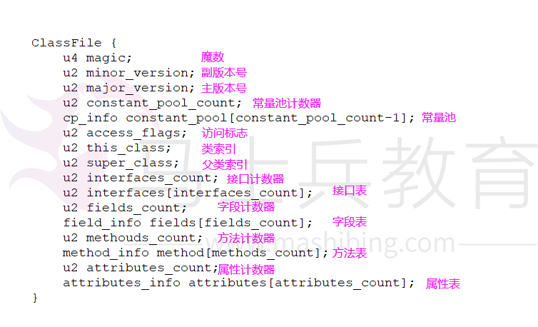
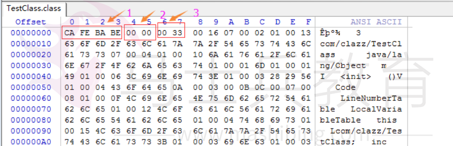

# 类（class）文件结构

前面的内容我们了解到jvm的内存结构。所有java文件必须经过“编译”转成class文件之后才会被jvm所识别和运用。那么我们开始了解一下类文件也就是class文件的结构。也就是我们写的java文件最终会被编译成什么样？那种格式？

本文讲解内容借鉴了《Java 虚拟机规范（Java SE 7 版）》第四章。如果有兴趣可以自行阅读

**1、类文件介绍**

每一个 Class 文件都对应着唯一一个类或接口的定义信息，但是相对地，类或接口并不一定都得定义在文件里（譬如类或接口也可以通过类加载器直接生成）。

本节中，我们只是通俗地将任意一个有效的类或接口所应当满足的格式称为“Class 文件格式”，即使它不一定以磁盘文件的形式存在。

每个 Class 文件都是由 8 字节为单位的字节流组成，所有的 16 位、32 位和 64 位长度的数据将被构造成 2 个、4 个和 8 个 8 字节单位来表示。多字节数据项总是按照 Big-Endian  的顺序进行存储。

注意：Big-Endian 顺序是指按高位字节在地址最低位，最低字节在地址最高位来存储数据，它是 SPARC、PowerPC等处理器的默认多字节存储顺序，而x86等处理器则是使用了相反的Little-Endian顺序来存储数据。为了保证 Class 文件在不同硬件上具备同样的含义，因此在 Java 虚拟机规范中是有必要严格规定了数据存储顺序的。

在 Java SDK 中，访问这种格式的数据可以使用 java.io.DataInput、java.io.DataOutput 等接口和 java.io.DataInputStream 和java.io.DataOutputStream 等类来实现。

本节内容，还定义了一组私有数据类型来表示 Class 文件的内容，它们包括 u1，u2 和 u4，分别代表了 1、2 和 4 个字节的无符号数。

在 Java SDK 中这些类型的数据可以通过实现接口java.io.DataInput 中的 readUnsignedByte、readUnsignedShort 和 readInt 方法进行读取。

本节将采用类似 C 语言结构体的伪结构来描述 Class 文件格式。为了避免与类的字段、类的实例等概念产生混淆，在此把用于描述类结构格式的内容定义为项（Item）。

在 Class 文件中，各项按照严格顺序连续存放的，它们之间没有任何填充或对齐作为各项间的分隔符号。

表（Table）是由任意数量的可变长度的项组成，用于表示 Class 文件内容的一系列复合结构。尽管我们采用类似 C 语言的数组语法来表示表中的项，但是读者应当清楚意识到，表是由可变长数据组成的复合结构（表中每项的长度不固定），因此无法直接将字节偏移量来作为索引对表进行访问。

而我们描述一个数据结构为数组（Array）时，就意味着它含有零至多个长度固定的项组成，这个时候则可以采用数组索引的方式来访问它 。

注意：虽然原文中在此定义了“表”和“数组”的关系，但在后文中依然存在表和数组混用的情况。译文中作了一些修正，把各个数据项结构不一致的数据集合用“表”那表示，譬如“constant_pool 表”、 “attributes表”，而把数据项结构一致的数据集合用“数组”来表示，譬如“code[]数组“、“fields[]数组”。

**2、ClassFile 结构**

每一个 Class 文件对应于一个如下所示的 ClassFile 结构体。



ClassFile 结构体中，各项的含义描述如下：

1，无符号数，以u1、u2、u4、u8分别代表1个字节、2个字节、4个字节、8个字节的无符号数

2，表是由多个无符号数或者其它表作为数据项构成的复合数据类型，所以表都以“_info”结尾，由多个无符号数或其它表构成的复合数据类型

每个部分出现的次数和数量见下表(Class文件格式)：

| 类  型         | 名  称              | 数  量                |
| -------------- | ------------------- | --------------------- |
| u4             | magic               | 1                     |
| u2             | minor_version       | 1                     |
| u2             | major_version       | 1                     |
| u2             | constant_pool_count | 1                     |
| cp_info        | constant_pool       | constant_pool_count-1 |
| u2             | access_flags        | 1                     |
| u2             | this_class          | 1                     |
| u2             | super_class         | 1                     |
| u2             | interfaces_count    | 1                     |
| u2             | interfaces          | interfaces_count      |
| u2             | fields_count        | 1                     |
| field_info     | fileds              | fields_count          |
| u2             | methods_count       | 1                     |
| method_info    | methods             | methods_count         |
| u2             | attributes_count    | 1                     |
| attribute_info | attributes          | attributes_count      |

magic
    魔数，魔数的唯一作用是确定这个文件是否为一个能被虚拟机所接受的 Class 文件。魔数值固定为 0xCAFEBABE，不会改变。

 minor_version、major_version
    副版本号和主版本号，minor_version 和 major_version 的值分别表示 Class 文件的副、主版本。它们共同构成了 Class 文件的格式版本号。譬如某个 Class 文件的主版本号为 M，副版本号为 m，那么这个 Class 文件的格式版本号就确定为 M.m。Class 文件格式版本号大小的顺序为：1.5 < 2.0 < 2.1。
 一个 Java 虚拟机实例只能支持特定范围内的主版本号（Mi 至 Mj）和 0 至特定范围内（0 至 m）的副版本号。假设一个 Class 文件的格式版本号为 V，仅当 Mi.0 ≤ v ≤ Mj.m
 成立时，这个 Class 文件才可以被此 Java 虚拟机支持。不同版本的 Java 虚拟机实现支持的版本号也不同，高版本号的 Java 虚拟机实现可以支持低版本号的 Class 文件，反之则不成立 。

注意：Oracle 的 JDK 在 1.0.2 版本时，支持的 Class 格式版本号范围是 45.0 至 45.3；JDK 版本在 1.1.x时，支持的 Class 格式版本号范围扩展至 45.0 至 45.65535；JDK 版本为 1. k 时（k ≥2）时，对应的 Class文件格式版本号的范围是 45.0 至 44+k.0

下表列举了Class文件版本号

| 编译器版本   | -target参数                | 十六进制版本号 | 十进制版本号 |
| ------------ | -------------------------- | -------------- | ------------ |
| JDK 1.1.8    | 不能带 target 参数         | 00 03 00 2D    | 45.3         |
| JDK 1.2.2    | 不带 (默认为 -target 1.1 ) | 00 03 00 2D    | 45.3         |
| JDK 1.2.2    | -target 1.2                | 00 00 00 2E    | 46.0         |
| JDK 1.3.1_19 | 不带 (默认为 -target 1.1 ) | 00 03 00 2D    | 45.3         |
| JDK 1.3.1_19 | -target 1.3                | 00 00 00 2F    | 47.0         |
| JDK 1.4.2_10 | 不带 (默认为 -target 1.2 ) | 00 00 00 2E    | 46.0         |
| JDK 1.4.2_10 | -target 1.4                | 00 00 00 30    | 48.0         |
| JDK 1.5.0_11 | 不带 (默认为 -target 1.5 ) | 00 00 00 31    | 49.0         |
| JDK 1.5.0_11 | -target 1.2  -source 1.4   | 00 00 00 30    | 48.0         |
| JDK 1.6.0_01 | 不带 (默认为 -target 1.6)  | 00 00 00 32    | 50.0         |
| JDK 1.6.0_01 | -target 1.5                | 00 00 00 31    | 49.0         |
| JDK 1.6.0_01 | -target 1.4  -source 1.4   | 00 00 00 30    | 48.0         |
| JDK 1.7.0    | 不带 (默认为 -target 1.7 ) | 00 00 00 33    | 51.0         |
| JDK 1.7.0    | -target 1.6                | 00 00 00 32    | 50.0         |
| JDK 1.7.0    | -target 1.4  -source 1.4   | 00 00 00 30    | 48.0         |

onstant_pool_count
 常量池计数器，constant_pool_count的值等于constant_pool表中的成员数加1。constant_pool 表的索引值只有在大于 0 且小于 constant_pool_count 时才会被
 认为是有效的 ，对于 long 和 double 类型有例外情况，后续在讲解。

注意：虽然值为 0 的 constant_pool 索引是无效的，但其他用到常量池的数据结构可以使用索引 0 来表示“不引用任何一个常量池项”的意思。

 constant_pool[ ]
 常量池，constant_pool 是一种表结构（这里需要列举一下表就会明白，这个在下面的例子中会有讲解这个结构，返回来在读就会明白），它包含 Class 文件结构及其子结构中引用的所有字符串常量、类或接口名、字段名和其它常量。常量池中的每一项都具备相同的格式特征——第一个字节作为类型标记用于识别该项是哪种类型的常量，称为“tagbyte”。常量池的索引范围是 1 至 constant_pool_count−1。

1常量池的项目类型

| 类  型                           | 标  志 | 描  述                   |
| -------------------------------- | ------ | ------------------------ |
| CONSTANT_Utf8_info               | 1      | UTF-8编码的字符串        |
| CONSTANT_Integer_info            | 3      | 整型字面量               |
| CONSTANT_Float_info              | 4      | 浮点型字面量             |
| CONSTANT_Long_info               | 5      | 长整型字面量             |
| CONSTANT_Double_info             | 6      | 双精度浮点型字面量       |
| CONSTANT_Class_info              | 7      | 类或接口的符号引用       |
| CONSTANT_String_info             | 8      | 字符串类型字面量         |
| CONSTANT_Fieldre_info            | 9      | 字段的符号引用           |
| CONSTANT_Methodref_info          | 10     | 类中方法的符号引用       |
| CONSTANT_IngerfaceMethodref_info | 11     | 接口中方法的符号引用     |
| CONSTANT_NameAndType_info        | 12     | 字段或方法的部分符号引用 |
| CONSTANT_MethodHandle_info       | 15     | 表示方法句柄             |
| CONSTANT_MethodType_info         | 16     | 标识方法类型             |
| CONSTANT_InvokeDynamic_info      | 18     | 表示一个动态方法调用点   |

2每一种类型的格式特征：这里用CONSTANT_Class_info举个例子：

| 类  型 | 名  称     | 数  量 |
| ------ | ---------- | ------ |
| u1     | tag        | 1      |
| u2     | name_index | 1      |

常量池主要存放两大类常量：字面量（literal）和符号引用。字面量比较接近java语言层面的常量概念，比如文本字符串、声明的final的常量值等。符号引用属于编译原理方面概念。包括下面三类常量：类和接口的全局限定名。字段的名称和描述符。方法的名称和描述符。这三类稍后在详细讲解。

​	access_flags
访问标志，access_flags 是一种掩码标志，用于表示某个类或者接口的访问权限及基础属性。access_flags 的取值范围和相应含义见表(访问和修饰符标志)所示。

| 标记名         | 值     | 含义                                             |
| -------------- | ------ | ------------------------------------------------ |
| ACC_PUBLIC     | 0x0001 | 可以被包的类外访问                               |
| ACC_FINAL      | 0x0010 | 不允许有子类                                     |
| ACC_SUPER      | 0x0020 | 当用到invokespecial指令时,需要特殊处理的父类方法 |
| ACC_INTERFACE  | 0x0200 | 标识定义的是接口而不是类                         |
| ACC_ABSTRACT   | 0x0400 | 不能被实例化                                     |
| ACC_SYNTHETIC  | 0x1000 | 标识并非Java源码生成的代码                       |
| ACC_ANNOTATION | 0x2000 | 标识注解类型                                     |
| ACC_ENUM       | 0x4000 | 标识枚举类型                                     |

带有 ACC_SYNTHETIC 标志的类，意味着它是由编译器自己产生的而不是由程序员编写的源代码生成的。

带有 ACC_ENUM 标志的类，意味着它或它的父类被声明为枚举类型。

带有 ACC_INTERFACE 标志的类，意味着它是接口而不是类，反之是类而不是接口。如果一个 Class 文件被设置了 ACC_INTERFACE 标志，那么同时也得设置ACC_ABSTRACT 标志（JLS §9.1.1.1）。同时它不能再设置 ACC_FINAL、ACC_SUPER 和 ACC_ENUM 标志。

注解类型必定带有 ACC_ANNOTATION 标记，如果设置了 ANNOTATION 标记，ACC_INTERFACE 也必须被同时设置。如果没有同时设置 ACC_INTERFACE 标记，那么这个Class文件可以具有表4.1中的除ACC_ANNOTATION外的所有其它标记。当然 ACC_FINAL 和 ACC_ABSTRACT 这类互斥的标记除外（JLS §8.1.1.2）。

ACC_SUPER 标志用于确定该 Class 文件里面的 invokespecial 指令使用的是哪一种执行语义。目前 Java 虚拟机的编译器都应当设置这个标志。ACC_SUPER 标记是为了向后兼容旧编译器编译的 Class 文件而存在的，在 JDK1.0.2 版本以前的编译器产生的 Class 文件中，access_flag 里面没有 ACC_SUPER 标志。同时，JDK1.0.2 前的 Java 虚拟机遇到 ACC_SUPER 标记会自动忽略它。

在表 4.1 中没有使用的 access_flags 标志位是为未来扩充而预留的，这些预留的标志为在编译器中会被设置为 0， Java 虚拟机实现也会自动忽略它们。

**this_class**

 类索引，this_class 的值必须是对 constant_pool 表中项目的一个有效索引值。constant_pool 表在这个索引处的项必须为 CONSTANT_Class_info 类型常量，表示这个 Class 文件所定义的类或接口。

 

**super_class**

 父类索引，对于类来说，super_class 的值必须为 0 或者是对 constant_pool 表中项目的一个有效索引值。如果它的值不为 0，那 constant_pool 表在这个索引处的项

 必须为 CONSTANT_Class_info 类型常量（§4.4.1），表示这个 Class 文件所定义的类的直接父类。当前类的直接父类，以及它所有间接父类的 access_flag 中都不能带有 ACC_FINAL 标记。对于接口来说，它的 Class 文件的 super_class 项的值必须是对 constant_pool 表中项目的一个有效索引值。constant_pool 表在这个索引处的
 项必须为代表 java.lang.Object 的 CONSTANT_Class_info 类型常量（§4.4.1）。如果 Class 文件的 super_class 的值为 0，那这个 Class 文件只可能是定义的是
 java.lang.Object 类，只有它是唯一没有父类的类。

 


 **interfaces_count**

 接口计数器，interfaces_count 的值表示当前类或接口的直接父接口数量。

 


  **interfaces**[]

接口表，interfaces[]数组中的每个成员的值必须是一个对 constant_pool 表中项目的一个有效索引值，它的长度为 interfaces_count。每个成员 interfaces[i] 必须为 CONSTANT_Class_info 类型常量（§4.4.1），其中 0 ≤ i <interfaces_count。在 interfaces[]数组中，成员所表示的接口顺序和对应的源代码中给定的接口顺序（从左至右）一样，即 interfaces[0]对应的是源代码中最左边的接口。

 


 **fields_count**

字段计数器，fields_count 的值表示当前 Class 文件 fields[]数组的成员个数。fields[]数组中每一项都是一个 field_info 结构（§4.5）的数据项，它用于表示该类或接口声明的类字段或者实例字段 。

 注意：：类字段即被声明为 static 的字段，也称为类变量或者类属性，同样，实例字段是指未被声明为static 的字段。由于《Java 虚拟机规范》中，“Variable”和“Attribute”出现频率很高且在大多数场景中具备其他含义，所以译文中统一把“Field”翻译为“字段”，即“类字段”、“实例字段”。

 


 **fields**[]

字段表，fields[]数组中的每个成员都必须是一个 fields_info 结构（§4.5）的数据项，用于表示当前类或接口中某个字段的完整描述。fields[]数组描述当前类或接口
 声明的所有字段，但不包括从父类或父接口继承的部分。

 


  **methods_count**

 方法计数器，methods_count 的值表示当前 Class 文件 methods[]数组的成员个数。Methods[]数组中每一项都是一个 method_info 结构（§4.5）的数据项。

 


 **methods**[]

 方法表，methods[]数组中的每个成员都必须是一个 method_info 结构（§4.6）的数据项，用于表示当前类或接口中某个方法的完整描述。如果某个 method_info 结构
 的 access_flags 项既没有设置 ACC_NATIVE 标志也没有设置 ACC_ABSTRACT 标志，那么它所对应的方法体就应当可以被 Java 虚拟机直接从当前类加载，而不需要引用其它类。method_info 结构可以表示类和接口中定义的所有方法，包括实例方法、类方法、实例初始化方法方法（§2.9）和类或接口初始化方法方法（§2.9）。methods[]数组
 只描述当前类或接口中声明的方法，不包括从父类或父接口继承的方法。

 


 **attributes_count**

属性计数器，attributes_count 的值表示当前 Class 文件 attributes 表的成员个数。attributes 表中每一项都是一个 attribute_info 结构（§4.7）的数据项。

 


 **attributes**[]

属性表，attributes 表的每个项的值必须是 attribute_info 结构（§4.7）。在本规范里，Class 文件结构中的 attributes 表的项包括下列定义的属性：
 InnerClasses（§4.7.6）、EnclosingMethod（§4.7.7）、Synthetic（§4.7.8）、Signature（§4.7.9）、SourceFile（§4.7.10），SourceDebugExtension（§4.7.11）、Deprecated（§4.7.15）、RuntimeVisibleAnnotations（§4.7.16）、RuntimeInvisibleAnnotations（§4.7.17）以及BootstrapMethods（§4.7.21）属性。对于支持 Class 文件格式版本号为 49.0 或更高的 Java 虚拟机实现，必须正确识别并读取 attributes 表中的 Signature（§4.7.9）、RuntimeVisibleAnnotations（§4.7.16）和RuntimeInvisibleAnnotations（§4.7.17）属性。对于支持 Class 文件格式版本号为 51.0 或更高的 Java 虚拟机实现，必须正确识别并读取 attributes 表中的
 BootstrapMethods（§4.7.21）属性。本规范要求任一 Java 虚拟机实现可以自动忽略 Class 文件的 attributes 表中的若干（甚至全部）它不可识别的属性项。任何本规范未定义的属性不能影响 Class 文件的语义，只能提供附加的描述信息（§4.7.1）。

这16个部分需要在实际应用中仔细研究一下。

列如下面代码：

```
1. package com.clazz;
2.  
3. public class TestClass {
4.  
5. 	private int m;
6. 	public int inc(){
7. 		return m+1;
8. 	}
9. }
```

经过编译之后class文件用WinHex编辑器打开你会发现



解读：

 1>前4个字节16进制表示0xCAFEBABE 固定不变的魔数。

2>看到第5字节和6字节表示副版本号0x0000和主版本号0x0033也就是十进制51。查找class版本号可知这个class文件可以被JDK1.7.0 或者以上的虚拟机执行的class文件。

3>常量池计数器是从1开始计数，即上图中的偏移地址（0x00000008）即数字16那，换做十进制为22，也就是常量池中有21个常量。索引值范围1~21，

这里注意:将索引值设置为0时有特殊含义，不引用任何一个常量池项目的含义。Class文件中只有常量池的容量是从1计数开始。其它一般从0开始

4>常量池：常量池第一项，（偏移地址0x0000000A）是0x07，查看表6-3的标志发现它属于CONSTANT_Class_info类型。此类型的结构如上面的常量池的6-4图，其中tag是标志位已经说过了用于区分常量类型，name_index是一个索引值，它指向常量池中一个CONSTANT_Utf8_info类型的常量，这里name_index的值（偏移地址0x0000000B）为0x0002也指向了常量池的第二项。然后依次继续查找。。。

分析了TestClass.class常量池中的两个，其余19个常量也可以继续计算出来。这里我们可以借助jdk的计算器帮我们完成。在JDK的bin目录中有一个专门分析class文件的字节码工具：javap，使用命令 javap -verbose TestClass  参数输出文件字节码内容。如下：

```java
F:\Java\jdk\jdk1.7.0_60\bin>javap -verbose TestClass.class
Classfile /F:/Java/jdk/jdk1.7.0_60/bin/TestClass.class
  Last modified 2017-10-16; size 373 bytes
  MD5 checksum 7d19b6fe8101f913758048f3529eaee4
  Compiled from "TestClass.java"
public class com.clazz.TestClass
  SourceFile: "TestClass.java"
  minor version: 0
  major version: 51
  flags: ACC_PUBLIC, ACC_SUPER
Constant pool:
   #1 = Class              #2             //  com/clazz/TestClass
   #2 = Utf8               com/clazz/TestClass
   #3 = Class              #4             //  java/lang/Object
   #4 = Utf8               java/lang/Object
   #5 = Utf8               m
   #6 = Utf8               I
   #7 = Utf8               <init>
   #8 = Utf8               ()V
   #9 = Utf8               Code
  #10 = Methodref          #3.#11         //  java/lang/Object."<init>":()V
  #11 = NameAndType        #7:#8          //  "<init>":()V
  #12 = Utf8               LineNumberTable
  #13 = Utf8               LocalVariableTable
  #14 = Utf8               this
  #15 = Utf8               Lcom/clazz/TestClass;
  #16 = Utf8               inc
  #17 = Utf8               ()I
  #18 = Fieldref           #1.#19         //  com/clazz/TestClass.m:I
  #19 = NameAndType        #5:#6          //  m:I
  #20 = Utf8               SourceFile
  #21 = Utf8               TestClass.java
{
  public com.clazz.TestClass();
    flags: ACC_PUBLIC
    Code:
      stack=1, locals=1, args_size=1
         0: aload_0
         1: invokespecial #10                 // Method java/lang/Object."<init>
":()V
         4: return

```

5>常量池结束后，紧接着的两个字节代表访问标识（access_flags）偏移量（0x000000DC）为0x0021=0x0001 