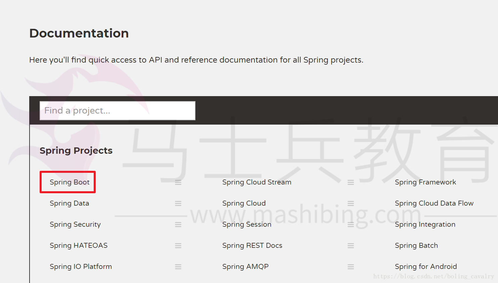
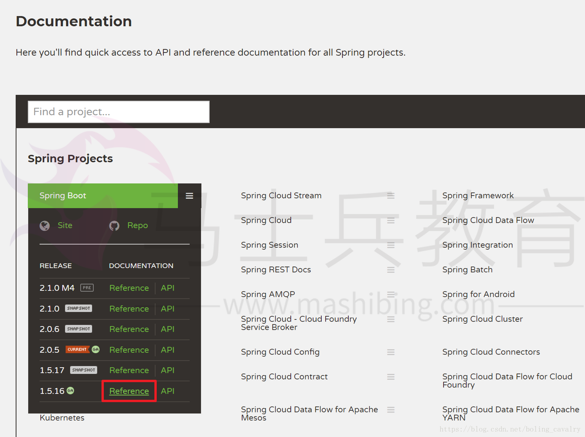
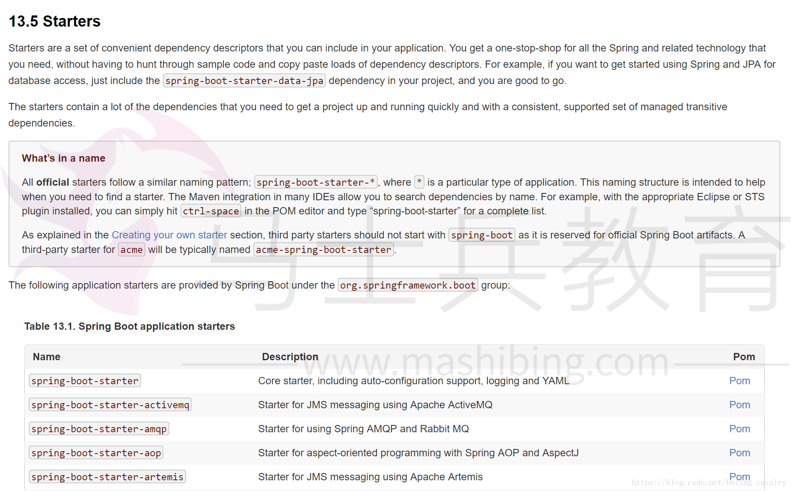
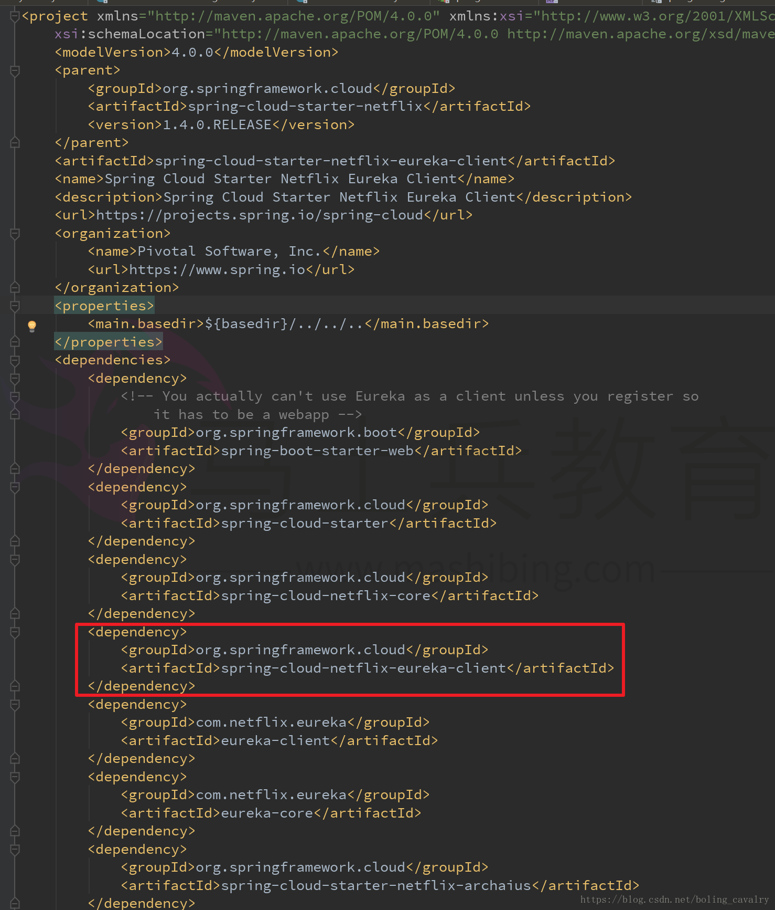
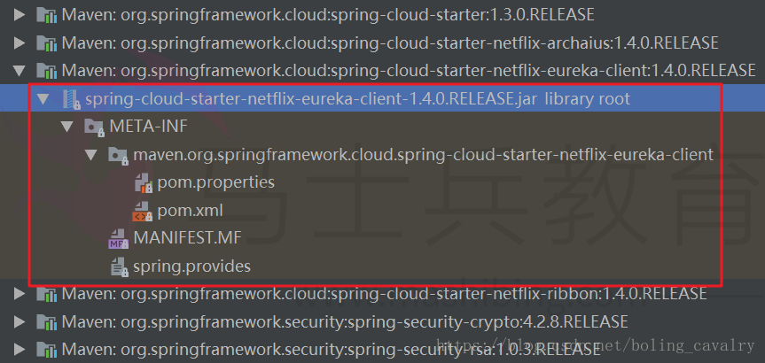
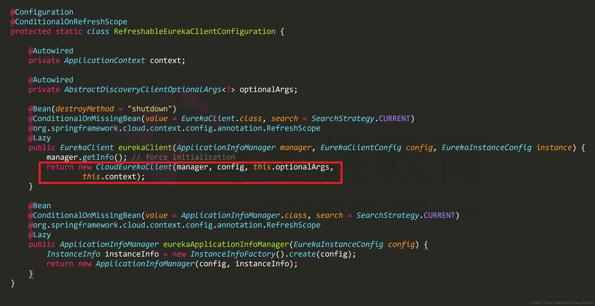
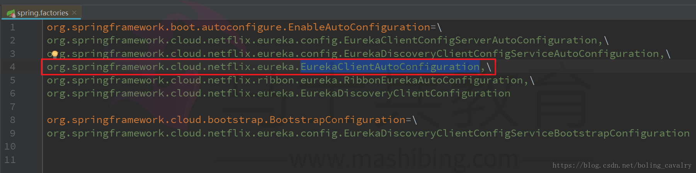

从本章开始，一起实战一个自定义的spring boot starter，整个系列共三篇文章，内容如下：

 

1. 准备：了解基本概念、规划实战内容；
2. 实战：开发自定义starter，并在demo工程中使用它；
3. 深入：从spring和spring boot源码层面分析starter的原理；

### 本章内容概览

 

1. 查看官方资料；
2. 设定实战目标；
3. 学习spring cloud的starter，作为实战参考；
4. 实战内容的具体设计；

 

### 版本信息

 

本次实战的版本信息：

 

1. java：1.8.0_144
2. spring boot：1.5.16.RELEASE
3. spring cloud：Edgware.RELEASE

 

### 官方资料

 

为了有个初始印象，我们从spring官方文档看起吧：

 

1. 官网：https://spring.io/docs/reference，点击下图红框位置：
   
2. 在弹出的列表中选择1.5.16版本的reference，如下图红框：
   
3. 在打开的文档目录中很容易找到starter的章节，地址是：https://docs.spring.io/spring-boot/docs/1.5.16.RELEASE/reference/htmlsingle/#using-boot-starter，内容如下图：
   

 

我的理解：
 第一. 在应用中可以用starter将依赖库问题变得简单，如果你想依赖Spring和JPA，只需在应用中依赖spring-boot-starter-data-jpa即可；
 第二. 常用库的官方starter，其artifactId的格式类似"spring-boot-starter-*"， 对于非官方的starter，建议将业务名称放在"spring-boot-starter"前面，例如"acme-spring-boot-starter"；
 第三. 已列举常用的官方starter，可用来参考；

 

### 设定实战目标

 

本次实战的目标如下：

 

1. A应用提供加法计算的服务；
2. B应用提供减法计算的服务；
3. C应用要使用加法计算和减法计算的服务，并且减法服务可以通过配置来实现是否支持负数；

 

### 学习spring cloud的starter

 

目标已定下，但是先不急着编码，我们去看下spring cloud的设计，用来作为借鉴参考；

 

回顾一下我们使用Spring cloud的时候，如果要把一个应用作为Eureka client注册到Eureka server，只需在应用的pom.xml中添加如下依赖：

 

```xml
<dependency>
	<groupId>org.springframework.cloud</groupId>
	<artifactId>spring-cloud-starter-netflix-eureka-client</artifactId>
</dependency>
```

 

注册到Eureka server的工作，是由CloudEurekaClient类完成的，该类属于模块spring-cloud-netflix-eureka-client，因此我们要弄清楚以下两点：

 

1. 为什么不需要应用的pom.xml中依赖spring-cloud-netflix-eureka-client？
2. 为什么应用能自动注册到Eureka sever？

 

### 如何建立对spring-cloud-netflix-eureka-client模块的依赖

 

打开spring-cloud-starter-netflix-eureka-client模块的pom.xml文件就一目了然了，如下图，原来在这个pom.xml文件中已经依赖了spring-cloud-netflix-eureka-client模块，因此，我们的应用只需依赖spring-cloud-starter-netflix-eureka-client模块，就能间接依赖到spring-cloud-netflix-eureka-client模块：


 

再看看上图中其他的依赖，可以发现的确如官方文档所说，starter处理了复杂的依赖关系，我们只需要依赖starter即可，官方文档中还有一段话需要注意，如下图：


 

上图红框中说明starter是个空的jar，其作用就是用来提供必要的模块依赖的，来看看spring-cloud-starter-netflix-eureka-client模块是否遵守此规则，如下图，只有配置文件，没有任何class：


 

### 为什么应用能自动注册到Eureka sever

 

作为Eureka client的应用，在启动后就自动注册到Eureka server了，作为应用开发者的我们除了在pom.xml中依赖spring-cloud-starter-netflix-eureka-client模块，没有做其他设置，这是如何实现的呢？

 

1. 注册到Eureka server的工作，是CloudEurekaClient类在其父类的构造方法中完成的，搜索源码发现此类的在EurekaClientAutoConfiguration中被注册到spring容器，如下图红框所示：
   

 

所以，现在问题就变成了如何让EurekaClientAutoConfiguration类被实例化?

 

1. 在spring-cloud-netflix-eureka-client模块的spring.factories文件中，找到了EurekaClientAutoConfiguration：
   

 

这是个spring boot的扩展配置，在此文件中配置的bean都会被实例化，然后注册到spring容器，具体的细节，我们会在第三章结合spring boot源码详细分析，本章只要知道用法即可；

 

此处小结Eureka client自动注册到Eureka server的过程：
 第一、spring-cloud-netflix-eureka-client模块的spring.factories文件中配置了EurekaClientAutoConfiguration，因此EurekaClientAutoConfiguration会被实例化并注册到Spring容器中；
 第二、EurekaClientAutoConfiguration中配置了CloudEurekaClient，因此CloudEurekaClient会实例化，在构造方法中执行了注册；

 

### 实战的设计

 

参考了spring cloud的starter设计后，接下来的实战被设计成两个maven工程：customizestarter和customizestartertestdemo；

 

1. 工程customizestarter里面包含了四个模块，每个模块功能如下所示：

 

| 模块名称                | 作用                    | 备注                                                         |
| ----------------------- | ----------------------- | ------------------------------------------------------------ |
| customizeapi            | 包含 了接口和异常的定义 | 实现和调用服务时用到的接口和异常都在此工程中                 |
| addservice              | 提供加法服务            | 普通的maven工程，里面加法接口的实现类                        |
| minusservice            | 提供减法服务            | 普通的maven工程，里面有两个减法接口的实现类，一个支持负数，另一个不支持 |
| customizeservicestarter | 自定义starter模块       | pom.xml中依赖了customizeapi、addservice、minusservice，自身有个Configuration类，通过@Bean注解向spring容器注册AddService和MinusService的实例 |


1. 工程customizestartertestdemo在pom.xml中依赖了上述的customizeservicestarter模块，提供的web服务会用到addservice和minusservice的服务，并且在应用启动时设置环境变量来选择使用的减法服务是否支持负数；

 

至此，准备工作已经完成了，对基本原理和开发设计都已经清楚，接下来的章节我们来一起开发上述五个工程；