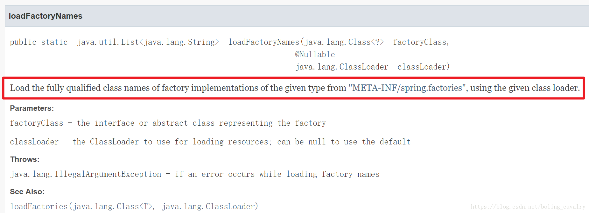

# 自定义spring boot starter三部曲之三：源码分析spring.factories加载过程


### 版本情况

本文中涉及到的库的版本：

1. Spring boot ：1.5.9.RELEASE；
2. JDK ：1.8.0_144

### 初步分析

先回顾customizeservicestarter模块中spring.factories文件的内容：

```properties
org.springframework.boot.autoconfigure.EnableAutoConfiguration=com.bolingcavalry.customizeservicestarter.CustomizeConfiguration
```

从上述内容可以确定今天源码学习目标：

1. spring容器如何处理配置类；
2. spring boot配置类的加载情况；
3. spring.factories中的EnableAutoConfiguration配置何时被加载？
4. spring.factories中的EnableAutoConfiguration配置被加载后做了什么处理；

### spring容器如何处理配置类

1. ConfigurationClassPostProcessor类的职责是处理配置类；
2. ConfigurationClassPostProcessor是BeanDefinitionRegistryPostProcessor接口的实现类，它的postProcessBeanDefinitionRegistry方法在容器初始化阶段会被调用（BeanDefinitionRegistryPostProcessor接口的更多细节请参考[《spring4.1.8扩展实战之六：注册bean到spring容器(BeanDefinitionRegistryPostProcessor接口)》](https://blog.csdn.net/boling_cavalry/article/details/82193692)）；
3. postProcessBeanDefinitionRegistry方法又调用processConfigBeanDefinitions方法处理具体业务；
4. processConfigBeanDefinitions方法中通过ConfigurationClassParser类来处理Configuration注解，如下图：
   
5. 如上图红框所示，所有被Configuration注解修饰过的类，都会被parser.parse(candidates)处理，即ConfigurationClassParser类的parse方法；
6. parse方法中调用processDeferredImportSelectors方法做处理：找到Configuration类中的Import注解，对于Import注解的值，如果实现了ImportSelector接口，就调用其selectImports方法，将返回的名称实例化：

```java
private void processDeferredImportSelectors() {
		//这里就是Configuration注解中的Import注解的值，
		//例如EnableAutoConfiguration注解的源码中，Import注解的值是EnableAutoConfigurationImportSelector.class
		List<DeferredImportSelectorHolder> deferredImports = this.deferredImportSelectors;
		this.deferredImportSelectors = null;
		Collections.sort(deferredImports, DEFERRED_IMPORT_COMPARATOR);

		for (DeferredImportSelectorHolder deferredImport : deferredImports) {
			ConfigurationClass configClass = deferredImport.getConfigurationClass();
			try {
				//以EnableAutoConfiguration注解为例，其Import注解的值为EnableAutoConfigurationImportSelector.class，
				//那么此处就是在调用EnableAutoConfigurationImportSelector的selectImports方法，返回了一个字符串数组
				String[] imports = deferredImport.getImportSelector().selectImports(configClass.getMetadata());
				//字符串数组中的每个字符串都代表一个类，此处做实例化
				processImports(configClass, asSourceClass(configClass), asSourceClasses(imports), false);
			}
			catch (BeanDefinitionStoreException ex) {
				throw ex;
			}
			catch (Throwable ex) {
				throw new BeanDefinitionStoreException(
						"Failed to process import candidates for configuration class [" +
						configClass.getMetadata().getClassName() + "]", ex);
			}
		}
	}
```

小结一下spring容器配置类的逻辑：

1. 找出配置类；
2. 找出配置类中的Import注解；
3. Import注解的值是class，如果该class实现了ImportSelector接口，就调用其selectImports方法，将返回的名称实例化；

有了上面的结论就可以结合Spring boot的源码来分析加载了哪些数据了；

### spring boot配置类的加载情况

1. 我们的应用使用了SpringBootApplication注解，看此注解的源码，使用了EnableAutoConfiguration注解：

```java
@Target(ElementType.TYPE)
@Retention(RetentionPolicy.RUNTIME)
@Documented
@Inherited
@SpringBootConfiguration
@EnableAutoConfiguration
@ComponentScan(excludeFilters = {
		@Filter(type = FilterType.CUSTOM, classes = TypeExcludeFilter.class),
		@Filter(type = FilterType.CUSTOM, classes = AutoConfigurationExcludeFilter.class) })
public @interface SpringBootApplication {
	......
```

2. EnableAutoConfiguration注解中，通过Import注解引入了EnableAutoConfigurationImportSelector.class：

```java
@Target(ElementType.TYPE)
@Retention(RetentionPolicy.RUNTIME)
@Documented
@Inherited
@AutoConfigurationPackage
@Import(EnableAutoConfigurationImportSelector.class)
public @interface EnableAutoConfiguration {
	......
```

3. 看EnableAutoConfigurationImportSelector的源码：

```java
/**
 * {@link DeferredImportSelector} to handle {@link EnableAutoConfiguration
 * auto-configuration}. This class can also be subclassed if a custom variant of
 * {@link EnableAutoConfiguration @EnableAutoConfiguration}. is needed.
 *
 * @deprecated as of 1.5 in favor of {@link AutoConfigurationImportSelector}
 * @author Phillip Webb
 * @author Andy Wilkinson
 * @author Stephane Nicoll
 * @author Madhura Bhave
 * @since 1.3.0
 * @see EnableAutoConfiguration
 */
@Deprecated
public class EnableAutoConfigurationImportSelector
		extends AutoConfigurationImportSelector {

	@Override
	protected boolean isEnabled(AnnotationMetadata metadata) {
		if (getClass().equals(EnableAutoConfigurationImportSelector.class)) {
			return getEnvironment().getProperty(
					EnableAutoConfiguration.ENABLED_OVERRIDE_PROPERTY, Boolean.class,
					true);
		}
		return true;
	}

}
```

上述源码有三处重点需要关注：
第一，EnableAutoConfigurationImportSelector是AutoConfigurationImportSelector的子类；
第二，EnableAutoConfigurationImportSelector已经被废弃了，不推荐使用；
第三，文档中已经写明废弃原因：从1.5版本开始，其特性由父类AutoConfigurationImportSelector实现；

4. 查看AutoConfigurationImportSelector的源码，重点关注selectImports方法，该方法的返回值表明了哪些类会被实例化：

```java
@Override
	public String[] selectImports(AnnotationMetadata annotationMetadata) {
		if (!isEnabled(annotationMetadata)) {
			return NO_IMPORTS;
		}
		try {
		    //将所有spring-autoconfigure-metadata.properties文件中的键值对保存在autoConfigurationMetadata中
			AutoConfigurationMetadata autoConfigurationMetadata = AutoConfigurationMetadataLoader
					.loadMetadata(this.beanClassLoader);
			AnnotationAttributes attributes = getAttributes(annotationMetadata);
			//取得所有配置类的名称
			List<String> configurations = getCandidateConfigurations(annotationMetadata,
					attributes);
			configurations = removeDuplicates(configurations);
			configurations = sort(configurations, autoConfigurationMetadata);
			Set<String> exclusions = getExclusions(annotationMetadata, attributes);
			checkExcludedClasses(configurations, exclusions);
			configurations.removeAll(exclusions);
			configurations = filter(configurations, autoConfigurationMetadata);
			fireAutoConfigurationImportEvents(configurations, exclusions);
			return configurations.toArray(new String[configurations.size()]);
		}
		catch (IOException ex) {
			throw new IllegalStateException(ex);
		}
	}
```

5. 通过上述代码可以发现，getCandidateConfigurations方法的调用是个关键，它返回的字符串都是即将被实例化的类名，来看此方法源码：

```java
protected List<String> getCandidateConfigurations(AnnotationMetadata metadata,
			AnnotationAttributes attributes) {
		List<String> configurations = SpringFactoriesLoader.loadFactoryNames(
				getSpringFactoriesLoaderFactoryClass(), getBeanClassLoader());
		Assert.notEmpty(configurations,
				"No auto configuration classes found in META-INF/spring.factories. If you "
						+ "are using a custom packaging, make sure that file is correct.");
		return configurations;
	}
```

6. getCandidateConfigurations方法中，调用了静态方法SpringFactoriesLoader.loadFactoryNames，上面提到的SpringFactoriesLoader.loadFactoryNames方法是关键，看看[官方文档](https://docs.spring.io/spring/docs/5.0.4.BUILD-SNAPSHOT/javadoc-api/org/springframework/core/io/support/SpringFactoriesLoader.html)对此静态方法的描述，如下图红框所示，该方法会在spring.factories文件中寻找指定接口对应的实现类的全名（包名+实现类）：
   

7. 在getCandidateConfigurations方法中，调用SpringFactoriesLoader.loadFactoryNames的时候传入的指定类型是getSpringFactoriesLoaderFactoryClass方法的返回值：

```java
protected Class<?> getSpringFactoriesLoaderFactoryClass() {
		return EnableAutoConfiguration.class;
	}
```

现在可以梳理一下了：

1. spring boot应用启动时使用了EnableAutoConfiguration注解；
2. EnableAutoConfiguration注解通过import注解将EnableAutoConfigurationImportSelector类实例化，并且将其selectImports方法返回的类名实例化后注册到spring容器；
3. EnableAutoConfigurationImportSelector的selectImports方法返回的类名，来自spring.factories文件内的配置信息，这些配置信息的key等于EnableAutoConfiguration；

现在真相大白了：只要我们在spring.factories文件内配置了EnableAutoConfiguration，那么对于的类就会被实例化后注册到spring容器；

至此，《自定义spring boot starter三部曲》系列就完结了，希望实战加源码分析的三篇文章，能帮助您理解和实现自定义starter这种简单快捷的扩展方式；