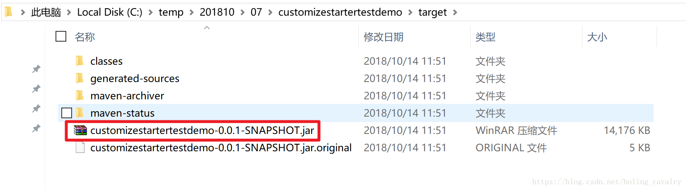
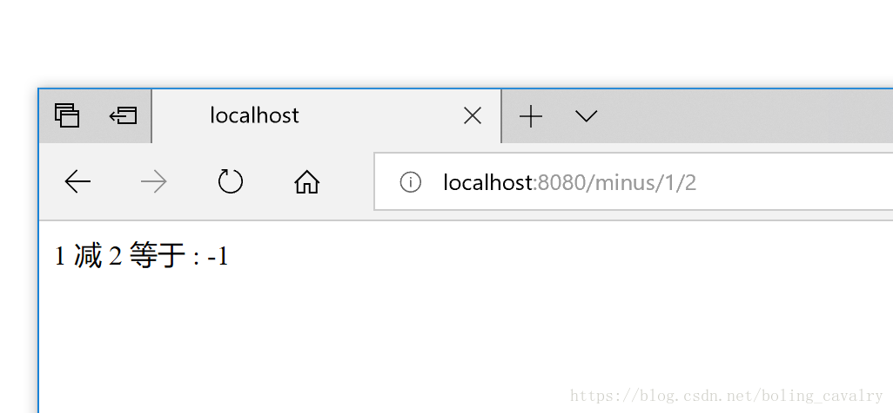
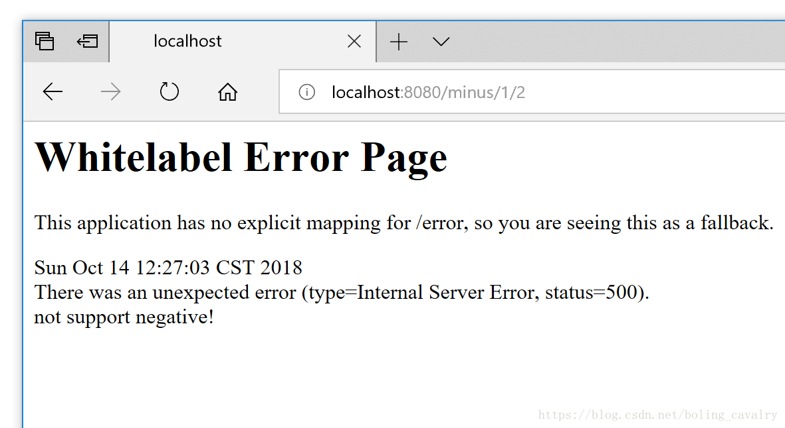

# 自定义spring boot starter三部曲之二：实战开发


本文是《自定义spring boot starter三部曲》的第二篇，上一篇中我们通过学习spring cloud的starter，对spring boot的starter有了初步了解，也设计好了实战内容，今天就来一起实现；

### 本章内容概述

1. 创建工程customizestarter；
2. 创建模块customizeapi；
3. 创建模块addservice；
4. 创建模块minusservice；
5. 创建模块customizeservicestarter；
6. 构建工程customizestarter，并安装到本地maven仓库；
7. 创建工程customizestartertestdemo；
8. 构建工程customizestartertestdemo，得到jar包；
9. 启动customizestartertestdemo工程的jar包，并带上一个启动参数，验证支持负数的减法服务；
10. 启动customizestartertestdemo工程的jar包，验证不支持服务的减法服务；


### 创建工程customizestarter

1. 创建一个名为customizestarter的maven工程，以spring-boot-starter-parent作为父工程，同时自身又是后续几个模块的父工程，pom.xml内容如下：

```xml
<?xml version="1.0" encoding="UTF-8"?>
<project xmlns="http://maven.apache.org/POM/4.0.0"
         xmlns:xsi="http://www.w3.org/2001/XMLSchema-instance"
         xsi:schemaLocation="http://maven.apache.org/POM/4.0.0 http://maven.apache.org/xsd/maven-4.0.0.xsd">
    <modelVersion>4.0.0</modelVersion>
    <groupId>com.bolingcavalry</groupId>
    <artifactId>customizestarter</artifactId>
    <packaging>pom</packaging>
    <version>0.0.1-SNAPSHOT</version>

    <properties>
        <project.build.sourceEncoding>UTF-8</project.build.sourceEncoding>
    </properties>

    <parent>
        <groupId>org.springframework.boot</groupId>
        <artifactId>spring-boot-starter-parent</artifactId>
        <version>1.5.9.RELEASE</version>
        <relativePath/>
    </parent>

    <modules>
        <!--加法服务-->
        <module>addservice</module>
        <!--减法服务-->
        <module>minusservice</module>
        <!--接口和异常定义-->
        <module>customizeapi</module>
        <!--启动器-->
        <module>customizeservicestarter</module>
    </modules>
</project>
```

### 创建模块customizeapi

1. 在工程customizestarter下创建模块customizeapi，这是个java工程，里面是加法和减法服务的接口，和一个业务异常的定义；
2. customizeapi的pom.xml内容如下，很简单，只有基本定义：

```xml
<?xml version="1.0" encoding="UTF-8"?>
<project xmlns="http://maven.apache.org/POM/4.0.0"
         xmlns:xsi="http://www.w3.org/2001/XMLSchema-instance"
         xsi:schemaLocation="http://maven.apache.org/POM/4.0.0 http://maven.apache.org/xsd/maven-4.0.0.xsd">
    <parent>
        <artifactId>customizestarter</artifactId>
        <groupId>com.bolingcavalry</groupId>
        <version>0.0.1-SNAPSHOT</version>
        <relativePath>../</relativePath>
    </parent>
    <modelVersion>4.0.0</modelVersion>
    <artifactId>customizeapi</artifactId>
</project>
```

1. 异常定义类：

```java
package com.bolingcavalry.api.exception;

/**
 * @author wilzhao
 * @description 执行减法服务时抛出的异常
 * @email zq2599@gmail.com
 * @time 2018/10/13 14:20
 */
public class MinusException extends Exception{
    public MinusException(String message) {
        super(message);
    }
}
```

1. 加法服务的接口类AddService：

```java
package com.bolingcavalry.api.service;

/**
 * @author wilzhao
 * @description 加法服务对应的接口
 * @email zq2599@gmail.com
 * @time 2018/10/13 10:07
 */
public interface AddService {
    /**
     * 普通加法
     * @param a
     * @param b
     * @return
     */
    int add(int a, int b);
}
```

1. 减法服务定义类，注意减法API声明了异常抛出，因为如果已经配置了不支持负数的减法服务，那么被减数如果小于减数就抛出异常：

```java
package com.bolingcavalry.api.service;

import com.bolingcavalry.api.exception.MinusException;

/**
 * @author wilzhao
 * @description 减法服务
 * @email zq2599@gmail.com
 * @time 2018/10/13 12:07
 */
public interface MinusService {
    /**
     * 普通减法
     * @param minuend 减数
     * @param subtraction 被减数
     * @return 差
     */
    int minus(int minuend, int subtraction) throws MinusException;
}
```

### 创建模块addservice

1. 在工程customizestarter下创建模块addservice，这是个java工程，里面包含了加法相服务的实现，pom.xml内容如下，注意由于要实现加法接口，因此需要依赖模块customizeapi：

```xml
<?xml version="1.0" encoding="UTF-8"?>
<project xmlns="http://maven.apache.org/POM/4.0.0"
         xmlns:xsi="http://www.w3.org/2001/XMLSchema-instance"
         xsi:schemaLocation="http://maven.apache.org/POM/4.0.0 http://maven.apache.org/xsd/maven-4.0.0.xsd">
    <parent>
        <artifactId>customizestarter</artifactId>
        <groupId>com.bolingcavalry</groupId>
        <version>0.0.1-SNAPSHOT</version>
        <relativePath>../</relativePath>
    </parent>
    <artifactId>addservice</artifactId>
    <modelVersion>4.0.0</modelVersion>

    <dependencies>
        <dependency>
            <groupId>com.bolingcavalry</groupId>
            <artifactId>customizeapi</artifactId>
            <version>${project.version}</version>
        </dependency>
    </dependencies>
</project>
```

1. 加法接口的实现类AddServiceImpl很简单，如下：

```java
package com.bolingcavalry.addservice.service.impl;

import com.bolingcavalry.api.service.AddService;

/**
 * @author wilzhao
 * @description 加法服务的实现
 * @email zq2599@gmail.com
 * @time 2018/10/13 10:59
 */
public class AddServiceImpl implements AddService {
    public int add(int a, int b) {
        return a + b;
    }
}
```

### 创建模块minusservice

1. 在工程customizestarter下创建模块minusservice，这是个java工程，里面包含了减法相服务的实现，pom.xml内容如下，注意由于要实现减法接口，因此需要依赖模块customizeapi：

```xml
<?xml version="1.0" encoding="UTF-8"?>
<project xmlns="http://maven.apache.org/POM/4.0.0"
         xmlns:xsi="http://www.w3.org/2001/XMLSchema-instance"
         xsi:schemaLocation="http://maven.apache.org/POM/4.0.0 http://maven.apache.org/xsd/maven-4.0.0.xsd">
    <parent>
        <artifactId>customizestarter</artifactId>
        <groupId>com.bolingcavalry</groupId>
        <version>0.0.1-SNAPSHOT</version>
        <relativePath>../</relativePath>
    </parent>
    <modelVersion>4.0.0</modelVersion>
    <artifactId>minusservice</artifactId>
    <dependencies>
        <dependency>
            <groupId>com.bolingcavalry</groupId>
            <artifactId>customizeapi</artifactId>
            <version>${project.version}</version>
        </dependency>
    </dependencies>
</project>
```

1. 一共有两个减法接口的实现类，第一个不支持负数结果，如果被减数小于减数就抛出异常MinusException：

```java
package com.bolingcavalry.minusservice.service.impl;

import com.bolingcavalry.api.exception.MinusException;
import com.bolingcavalry.api.service.MinusService;

/**
 * @author wilzhao
 * @description 减法服务的实现，不支持负数
 * @email zq2599@gmail.com
 * @time 2018/10/13 14:24
 */
public class MinusServiceNotSupportNegativeImpl implements MinusService {

    /**
     * 减法运算，不支持负数结果，如果被减数小于减数，就跑出MinusException
     * @param minuend 被减数
     * @param subtraction 减数
     * @return
     * @throws MinusException
     */
    public int minus(int minuend, int subtraction) throws MinusException {
        if(subtraction>minuend){
            throw new MinusException("not support negative!");
        }

        return minuend-subtraction;
    }
}
```

1. 第二个减法接口的实现类支持负数返回：

```java
package com.bolingcavalry.minusservice.service.impl;

import com.bolingcavalry.api.exception.MinusException;
import com.bolingcavalry.api.service.MinusService;

/**
 * @author wilzhao
 * @description 支持负数结果的减法服务
 * @email zq2599@gmail.com
 * @time 2018/10/13 14:30
 */
public class MinusServiceSupportNegativeImpl implements MinusService {

    /**
     * 减法实现，支持负数
     * @param minuend 减数
     * @param subtraction 被减数
     * @return
     * @throws MinusException
     */
    public int minus(int minuend, int subtraction) throws MinusException {
        return minuend - subtraction;
    }
}
```

### 创建模块customizeservicestarter

1. 在工程customizestarter下创建模块customizeservicestarter，这是个java工程，里面需要依赖spring boot配置相关的库，由于要在配置中实例化加法和减法服务的实现，因此customizeapi、addservice、minusservice这些模块都要在pom.xml中声明依赖，如下：

```xml
<?xml version="1.0" encoding="UTF-8"?>
<project xmlns="http://maven.apache.org/POM/4.0.0"
         xmlns:xsi="http://www.w3.org/2001/XMLSchema-instance"
         xsi:schemaLocation="http://maven.apache.org/POM/4.0.0 http://maven.apache.org/xsd/maven-4.0.0.xsd">
    <parent>
        <artifactId>customizestarter</artifactId>
        <groupId>com.bolingcavalry</groupId>
        <version>0.0.1-SNAPSHOT</version>
        <relativePath>../</relativePath>
    </parent>
    <artifactId>customizeservicestarter</artifactId>
    <modelVersion>4.0.0</modelVersion>
    
    <dependencies>
        <dependency>
            <groupId>org.springframework.boot</groupId>
            <artifactId>spring-boot-autoconfigure</artifactId>
            <!--仅编译时才需要-->
            <scope>provided</scope>
        </dependency>
        <dependency>
            <groupId>com.bolingcavalry</groupId>
            <artifactId>customizeapi</artifactId>
            <version>${project.version}</version>
        </dependency>
        <dependency>
            <groupId>com.bolingcavalry</groupId>
            <artifactId>addservice</artifactId>
            <version>${project.version}</version>
        </dependency>
        <dependency>
            <groupId>com.bolingcavalry</groupId>
            <artifactId>minusservice</artifactId>
            <version>${project.version}</version>
        </dependency>
    </dependencies>
</project>
```

1. 创建配置类CustomizeConfiguration，注意getSupportMinusService和getNotSupportMinusService这两个方法上的注解配置，如果环境变量com.bolingcavalry.supportnegative存在并且等于true，那么getSupportMinusService方法就返回了MinusService接口的实例，如果当前环境没有MinusService接口的实例，就由getNotSupportMinusService方法就返回一个，并且有会在控制台打印创建了哪种实现：

```java
package com.bolingcavalry.customizeservicestarter;

import com.bolingcavalry.addservice.service.impl.AddServiceImpl;
import com.bolingcavalry.api.service.AddService;
import com.bolingcavalry.api.service.MinusService;
import com.bolingcavalry.minusservice.service.impl.MinusServiceNotSupportNegativeImpl;
import com.bolingcavalry.minusservice.service.impl.MinusServiceSupportNegativeImpl;
import org.springframework.beans.factory.annotation.Qualifier;
import org.springframework.boot.autoconfigure.condition.ConditionalOnMissingBean;
import org.springframework.boot.autoconfigure.condition.ConditionalOnProperty;
import org.springframework.context.annotation.Bean;
import org.springframework.context.annotation.Configuration;

/**
 * @author wilzhao
 * @description 一句话介绍
 * @email zq2599@gmail.com
 * @time 2018/10/13 14:36
 */
@Configuration
public class CustomizeConfiguration {

    @Bean
    public AddService getAddService(){
        System.out.println("create addService");
        return new AddServiceImpl();
    }

    /**
     * 如果配置了com.bolingcavalry.supportnegative=true，
     * 就实例化MinusServiceSupportNegativeImpl
     * @return
     */
    @Bean
    @ConditionalOnProperty(prefix="com.bolingcavalry",name = "supportnegative", havingValue = "true")
    public MinusService getSupportMinusService(){
        System.out.println("create minusService support minus");
        return new MinusServiceSupportNegativeImpl();
    }

    /**
     * 如果没有配置com.bolingcavalry.supportnegative=true，
     * 就不会实例化MinusServiceSupportNegativeImpl，
     * 这里的条件是如果没有MinusService类型的bean，就在此实例化一个
     * @return
     */
    @Bean
    @ConditionalOnMissingBean(MinusService.class)
    public MinusService getNotSupportMinusService(){
        System.out.println("create minusService not support minus");
        return new MinusServiceNotSupportNegativeImpl();
    }
}
```

1. 在src\main\resources目录下创建一个目录META-INF，里面创建一个文件spring.factories，内容是如下，表示如果当前应用支持spring boot的自动配置，就会被spring boot框架实例化并注册到spring容器内：

```properties
org.springframework.boot.autoconfigure.EnableAutoConfiguration=com.bolingcavalry.customizeservicestarter.CustomizeConfiguration
```

### 构建工程customizestarter

1. 到这里customizestarter工程的编码就结束了，在工程内pom.xml所在目录（也就是customizestarter内的第一层目录），执行以下命令可以编译构建并安装到本地maven仓库：

```shell
mvn clean install -Dmaven.test.skip=true -U
```

1. 如果编译构建和安装都成功了，可以看到类似如下输出：

```shell
[INFO] Installing C:\temp\201810\07\customizestarter\customizeservicestarter\pom.xml to C:\Users\12167\.m2\repositor
y\com\bolingcavalry\customizeservicestarter\0.0.1-SNAPSHOT\customizeservicestarter-0.0.1-SNAPSHOT.pom
[INFO] ------------------------------------------------------------------------
[INFO] Reactor Summary:
[INFO]
[INFO] customizestarter ................................... SUCCESS [  0.748 s]
[INFO] customizeapi ....................................... SUCCESS [  3.266 s]
[INFO] addservice ......................................... SUCCESS [  0.427 s]
[INFO] minusservice ....................................... SUCCESS [  0.344 s]
[INFO] customizeservicestarter ............................ SUCCESS [  0.495 s]
[INFO] ------------------------------------------------------------------------
[INFO] BUILD SUCCESS
[INFO] ------------------------------------------------------------------------
[INFO] Total time: 5.954 s
[INFO] Finished at: 2018-10-14T00:17:46+08:00
[INFO] Final Memory: 29M/221M
[INFO] ------------------------------------------------------------------------
```

现在starter已经准备好了，我们做一个spring boot的web应用来验证一下；

### 创建工程customizestartertestdemo

1. 工程customizestartertestdemo是个简单的spring boot应用，pom.xml如下，可见并无特别之处，只是多了customizeservicestarter的依赖：

```xml
<?xml version="1.0" encoding="UTF-8"?>
<project xmlns="http://maven.apache.org/POM/4.0.0" xmlns:xsi="http://www.w3.org/2001/XMLSchema-instance"
         xsi:schemaLocation="http://maven.apache.org/POM/4.0.0 http://maven.apache.org/xsd/maven-4.0.0.xsd">
    <modelVersion>4.0.0</modelVersion>

    <groupId>com.bolingcavalry</groupId>
    <artifactId>customizestartertestdemo</artifactId>
    <version>0.0.1-SNAPSHOT</version>
    <packaging>jar</packaging>

    <name>customizestartertestdemo</name>
    <description>Demo project for Spring Boot</description>

    <parent>
        <groupId>org.springframework.boot</groupId>
        <artifactId>spring-boot-starter-parent</artifactId>
        <version>1.5.9.RELEASE</version>
        <relativePath/> <!-- lookup parent from repository -->
    </parent>

    <properties>
        <project.build.sourceEncoding>UTF-8</project.build.sourceEncoding>
        <project.reporting.outputEncoding>UTF-8</project.reporting.outputEncoding>
        <java.version>1.8</java.version>
    </properties>

    <dependencies>
        <dependency>
            <groupId>org.springframework.boot</groupId>
            <artifactId>spring-boot-starter-web</artifactId>
        </dependency>

        <dependency>
            <groupId>org.springframework.boot</groupId>
            <artifactId>spring-boot-starter-test</artifactId>
            <scope>test</scope>
        </dependency>

        <dependency>
            <groupId>com.bolingcavalry</groupId>
            <artifactId>customizeservicestarter</artifactId>
            <version>0.0.1-SNAPSHOT</version>
        </dependency>
    </dependencies>

    <build>
        <plugins>
            <plugin>
                <groupId>org.springframework.boot</groupId>
                <artifactId>spring-boot-maven-plugin</artifactId>
            </plugin>
        </plugins>
    </build>
</project>
```

1. 开发一个Controller类，用于调用AddService和MinusService对应的服务：

```java
package com.bolingcavalry.customizestartertestdemo.controller;

import com.bolingcavalry.api.exception.MinusException;
import com.bolingcavalry.api.service.AddService;
import com.bolingcavalry.api.service.MinusService;
import org.springframework.beans.factory.annotation.Autowired;
import org.springframework.web.bind.annotation.*;

/**
 * @author wilzhao
 * @description 调用加法和减法服务的测试类
 * @email zq2599@gmail.com
 * @time 2018/10/13 16:00
 */
@RestController
public class CalculateController {

    @Autowired
    private AddService addService;

    @Autowired
    private MinusService minusService;

    @RequestMapping(value = "/add/{added}/{add}", method = RequestMethod.GET)
    public String add(@PathVariable("added") int added, @PathVariable("add") int add){
        return added + " 加 " + add + " 等于 : " + addService.add(added, add);
    }

    @RequestMapping(value = "/minus/{minuend}/{subtraction}", method = RequestMethod.GET)
    public String minus(@PathVariable("minuend") int minuend, @PathVariable("subtraction") int subtraction) throws MinusException {
        return minuend + " 减 " + subtraction + " 等于 : " + minusService.minus(minuend, subtraction);
    }
}
```

1. 启动类如下:

```java
package com.bolingcavalry.customizestartertestdemo;

import org.springframework.boot.SpringApplication;
import org.springframework.boot.autoconfigure.SpringBootApplication;

@SpringBootApplication
public class CustomizestartertestdemoApplication {

    public static void main(String[] args) {
        SpringApplication.run(CustomizestartertestdemoApplication.class, args);
    }
}
```

### 构建工程customizestartertestdemo

1. 在customizestartertestdemo工程的pom.xml所在目录下执行以下命令即可构建成功：

```shell
mvn clean package -Dmaven.test.skip=true
```

1. 命令执行成功后，即可在target目录下见到customizestartertestdemo-0.0.1-SNAPSHOT.jar文件，如下图：
   

现在编码和构建已经全部完成，我们可以来验证了；

### 验证支持负数的减法服务

1. 在customizeapi模块的CustomizeConfiguration类中，有如下方法和注解：

```java
@Bean
    @ConditionalOnProperty(prefix="com.bolingcavalry",name = "supportnegative", havingValue = "true")
    public MinusService getSupportMinusService(){
        System.out.println("create minusService support minus");
        return new MinusServiceSupportNegativeImpl();
    }
```

从上述代码可见，只要环境变量"com.bolingcavalry.supportnegative"等于true，注册到spring容器的就是MinusServiceSupportNegativeImpl类的实例；

1. customizestartertestdemo-0.0.1-SNAPSHOT.jar文件所在目录下，执行以下命令启动应用：

```shell
java -Dcom.bolingcavalry.supportnegative=true -jar customizestartertestdemo-0.0.1-SNAPSHOT.jar
```

1. 在控制台中可以看见create minusService support minus，表示注册到spring容器的是MinusServiceSupportNegativeImpl类的实例，如下所示：

```shell
2018-10-14 12:04:54.233  INFO 16588 --- [ost-startStop-1] o.s.b.w.servlet.FilterRegistrationBean   : Mapping filter: 'requestContextFilter' to: [/*]
create addService
create minusService support minus
2018-10-14 12:04:54.845  INFO 16588 --- [           main] s.w.s.m.m.a.RequestMappingHandlerAdapter : Looking for @ControllerAdvice: org.springframework.boot.context.embedded.AnnotationConfigEmbeddedWebApplicationContext@443b7951: startup date [Sun Oct 14 12:04:50 CST 2018]; root of context hierarchy
```

1. 在浏览器访问http://localhost:8080/minus/1/2，可见返回计算结果为负数：
   

### 验证不支持负数的减法服务

1. 前面已经分析过，CustomizeConfiguration类的getNotSupportMinusService方法执行的条件是环境变量"com.bolingcavalry.supportnegative"等于true，如果没有这个环境变量，getNotSupportMinusService方法就不会执行，spring容器中就没有MinusService接口的实例；
2. CustomizeConfiguration类中，有如下方法和注解：

```java
    @Bean
    @ConditionalOnMissingBean(MinusService.class)
    public MinusService getNotSupportMinusService(){
        System.out.println("create minusService not support minus");
        return new MinusServiceNotSupportNegativeImpl();
    }
```

从上述代码可见，spring容器中如果没有MinusService接口的实例，getNotSupportMinusService方法就会被执行，在spring容器中注册MinusServiceNotSupportNegativeImpl实例；

因此接下来的我们启动的应用如果没有环境变量"com.bolingcavalry.supportnegative"，就可以使用到不支持负数的减法服务了；
\2. 停掉之前启动的应用，然后执行以下命令启动应用：

```shell
java -jar customizestartertestdemo-0.0.1-SNAPSHOT.jar
```

1. 在控制台中可以看见create minusService not support minus，表示注册到spring容器的是MinusServiceNotSupportNegativeImpl类的实例，如下所示：

```shell
2018-10-14 12:15:05.994  INFO 16608 --- [ost-startStop-1] o.s.b.w.servlet.FilterRegistrationBean   : Mapping filter: 'requestContextFilter' to: [/*]
create addService
create minusService not support minus
2018-10-14 12:15:06.592  INFO 16608 --- [           main] s.w.s.m.m.a.RequestMappingHandlerAdapter : Looking for @ControllerAdvice: org.springframework.boot.context.embedded.AnnotationConfigEmbeddedWebApplicationContext@443b7951: startup date [Sun Oct 14 12:15:02 CST 2018]; root of context hierarchy
```

1. 在浏览器访问http://localhost:8080/minus/1/2，由于MinusServiceNotSupportNegativeImpl实例不支持负数减法，会直接抛出异常，如下图：
   

至此，自定义spring boot starter的编码实战就完成了，希望本篇可以给您用来作参考，助您做出自己所需的starter；

下一篇我们一起去看看spring boot的源码，对这个高效的扩展功能做更深入的了解；