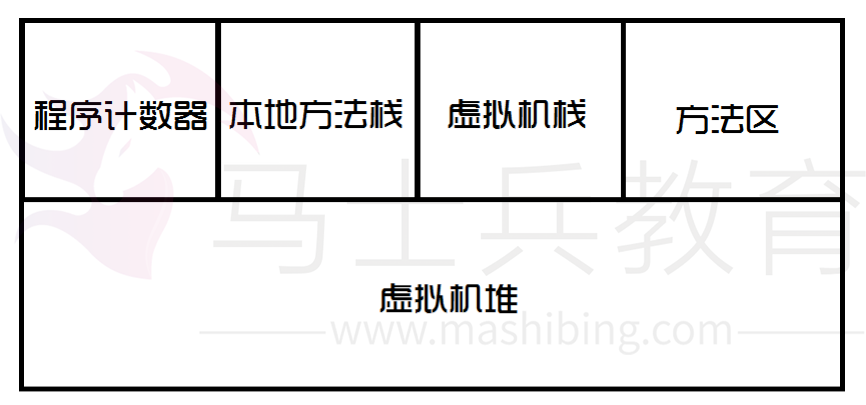
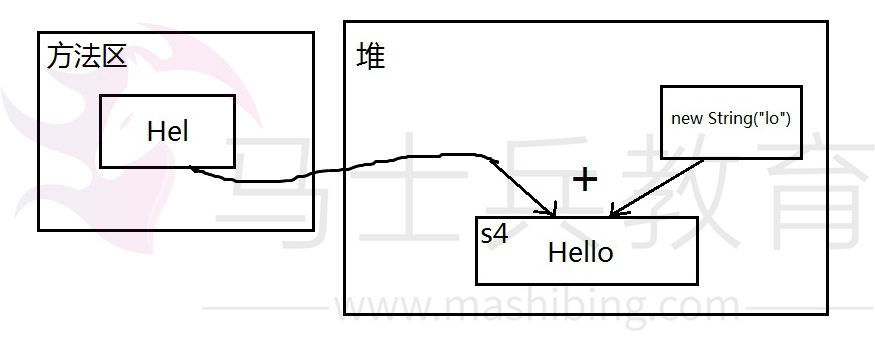
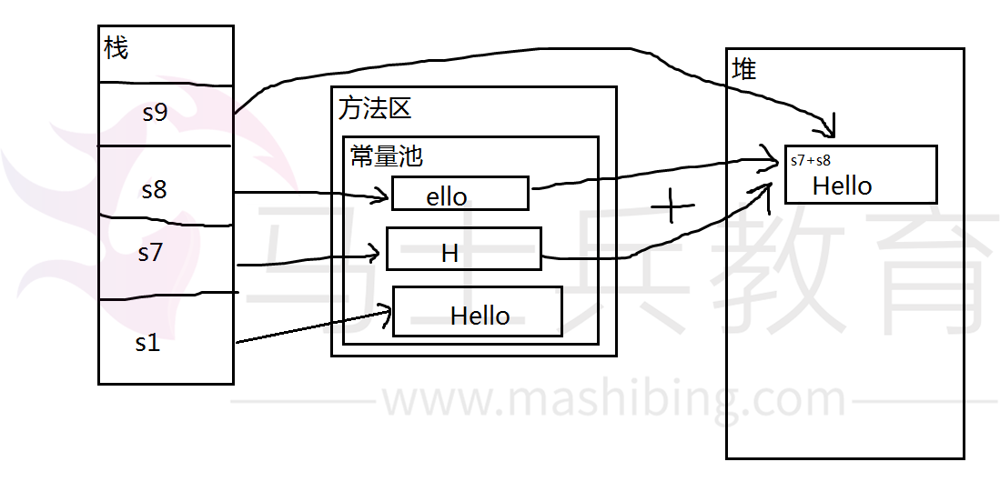
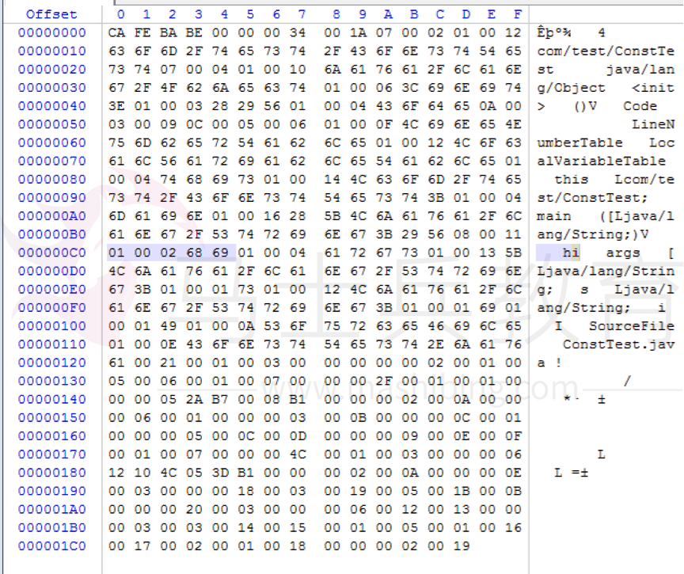

# 触摸java常量池


 java常量池是一个经久不衰的话题，也是面试官的最爱，题目花样百出，这次好好总结一下。

 

理论

   

   小菜先拙劣的表达一下jvm虚拟内存分布：



 

   **程序计数器**是jvm执行程序的流水线，存放一些跳转指令，这个太高深，小菜不懂。

   **本地方法栈**是jvm调用操作系统方法所使用的栈。

   **虚拟机栈**是jvm执行java代码所使用的栈。

   **方法区**存放了一些常量、静态变量、类信息等，可以理解成class文件在内存中的存放位置。

   **虚拟机堆**是jvm执行java代码所使用的堆。

   Java中的常量池，实际上分为两种形态：**静态常量池**和**运行时常量池**。

   所谓**静态常量池**，即*.class文件中的常量池，class文件中的常量池不仅仅包含字符串(数字)字面量，还包含类、方法的信息，占用class文件绝大部分空间。

   而**运行时常量池**，则是jvm虚拟机在完成类装载操作后，将class文件中的常量池载入到内存中，并保存在**方法区**中，我们常说的常量池，就是指方法区中的运行时常量池。

   接下来我们引用一些网络上流行的常量池例子，然后借以讲解。


```
 1 String s1 = "Hello";
 2 String s2 = "Hello";
 3 String s3 = "Hel" + "lo";
 4 String s4 = "Hel" + new String("lo");
 5 String s5 = new String("Hello");
 6 String s6 = s5.intern();
 7 String s7 = "H";
 8 String s8 = "ello";
 9 String s9 = s7 + s8;
10           
11 System.out.println(s1 == s2);  // true
12 System.out.println(s1 == s3);  // true
13 System.out.println(s1 == s4);  // false
14 System.out.println(s1 == s9);  // false
15 System.out.println(s4 == s5);  // false
16 System.out.println(s1 == s6);  // true
```


   首先说明一点，在java 中，直接使用==操作符，比较的是两个字符串的引用地址，并不是比较内容，比较内容请用String.equals()。

   s1 == s2这个非常好理解，s1、s2在赋值时，均使用的字符串字面量，说白话点，就是直接把字符串写死，在编译期间，这种字面量会直接放入class文件的常量池中，从而实现复用，载入运行时常量池后，s1、s2指向的是同一个内存地址，所以相等。

   s1 == s3这个地方有个坑，s3虽然是动态拼接出来的字符串，但是所有参与拼接的部分都是已知的字面量，在编译期间，这种拼接会被优化，编译器直接帮你拼好，因此String s3 = "Hel" + "lo";在class文件中被优化成String s3 = "Hello";，所以s1 == s3成立。

   s1 == s4当然不相等，s4虽然也是拼接出来的，但new String("lo")这部分不是已知字面量，是一个不可预料的部分，编译器不会优化，必须等到运行时才可以确定结果，结合**字符串不变**定理，鬼知道s4被分配到哪去了，所以地址肯定不同。配上一张简图理清思路：



   s1 == s9也不相等，道理差不多，虽然s7、s8在赋值的时候使用的字符串字面量，但是拼接成s9的时候，s7、s8作为两个变量，都是不可预料的，编译器毕竟是编译器，不可能当解释器用，所以不做优化，等到运行时，s7、s8拼接成的新字符串，在堆中地址不确定，不可能与方法区常量池中的s1地址相同。


   s4 == s5已经不用解释了，绝对不相等，二者都在堆中，但地址不同。

   s1 == s6这两个相等完全归功于intern方法，s5在堆中，内容为Hello ，intern方法会尝试将Hello字符串添加到常量池中，并返回其在常量池中的地址，因为常量池中已经有了Hello字符串，所以intern方法直接返回地址；而s1在编译期就已经指向常量池了，因此s1和s6指向同一地址，相等。

   至此，我们可以得出三个非常重要的结论：

 

​      **必须要关注编译期的行为，才能更好的理解常量池。**

​      **运行时常量池中的常量，基本来源于各个class文件中的常量池。**

​      **程序运行时，除非手动向常量池中添加常量(比如调用intern方法)，否则jvm不会自动添加常量到常量池。**

 

   以上所讲仅涉及字符串常量池，实际上还有整型常量池、浮点型常量池等等，但都大同小异，只不过数值类型的常量池不可以手动添加常量，程序启动时常量池中的常量就已经确定了，比如整型常量池中的常量范围：-128~127，只有这个范围的数字可以用到常量池。

 

实践

   

   说了这么多理论，接下来让我们触摸一下真正的常量池。

   前文提到过，class文件中存在一个静态常量池，这个常量池是由编译器生成的，用来存储java源文件中的字面量(本文仅仅关注字面量)，假设我们有如下java代码：

 

```
1 String s = "hi";
```

 

   为了方便起见，就这么简单，没错！将代码编译成class文件后，用winhex打开二进制格式的class文件。如图：



 

   简单讲解一下class文件的结构，开头的4个字节是class文件魔数，用来标识这是一个class文件，说白话点就是文件头，既：CA FE BA BE。

   紧接着4个字节是java的版本号，这里的版本号是34，因为笔者是用jdk8编译的，版本号的高低和jdk版本的高低相对应，高版本可以兼容低版本，但低版本无法执行高版本。所以，如果哪天读者想知道别人的class文件是用什么jdk版本编译的，就可以看这4个字节。

   接下来就是常量池入口，入口处用2个字节标识常量池常量数量，本例中数值为00 1A，翻译成十进制是26，也就是有25个常量，其中第0个常量是特殊值，所以只有25个常量。

   常量池中存放了各种类型的常量，他们都有自己的类型，并且都有自己的存储规范，本文只关注字符串常量，字符串常量以01开头(1个字节)，接着用2个字节记录字符串长度，然后就是字符串实际内容。本例中为：01 00 02 68 69。

   接下来再说说运行时常量池，由于运行时常量池在方法区中，我们可以通过jvm参数：-XX:PermSize、-XX:MaxPermSize来设置方法区大小，从而间接限制常量池大小。

   假设jvm启动参数为：-XX:PermSize＝2M -XX:MaxPermSize＝2M，然后运行如下代码：


```
1 //保持引用，防止自动垃圾回收
2 List<String> list = new ArrayList<String>();
3         
4 int i = 0;
5         
6 while(true){
7     //通过intern方法向常量池中手动添加常量
8     list.add(String.valueOf(i++).intern());
9 }
```


   程序立刻会抛出：Exception in thread "main" java.lang.outOfMemoryError: PermGen space异常。PermGen space正是方法区，足以说明常量池在方法区中。

   在jdk8中，移除了方法区，转而用Metaspace区域替代，所以我们需要使用新的jvm参数：-XX:MaxMetaspaceSize=2M，依然运行如上代码，抛出：java.lang.OutOfMemoryError: Metaspace异常。同理说明运行时常量池是划分在Metaspace区域中。具体关于Metaspace区域的知识，请读者自行搜索。

   本文所有代码均在jdk7、jdk8下测试通过，其他版本jdk可能会略有差异，请读者自行探索。